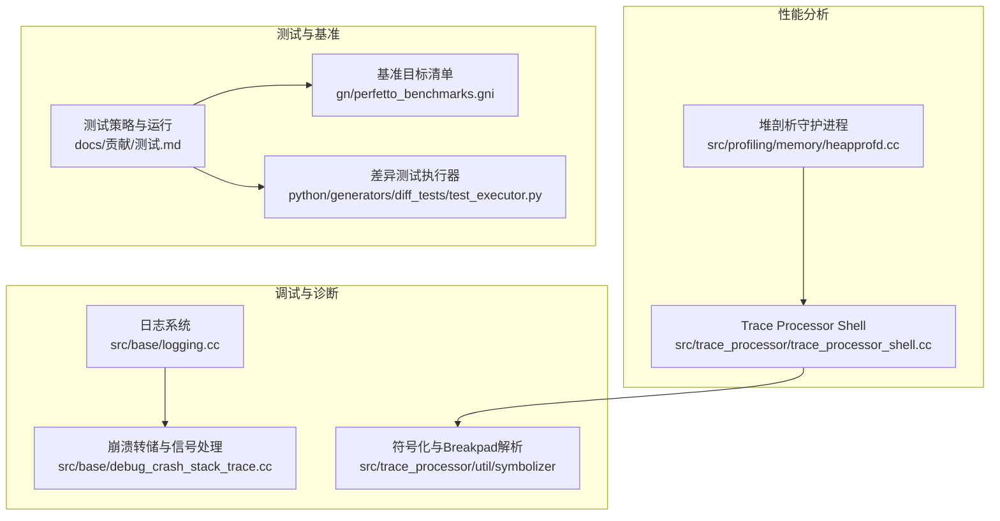
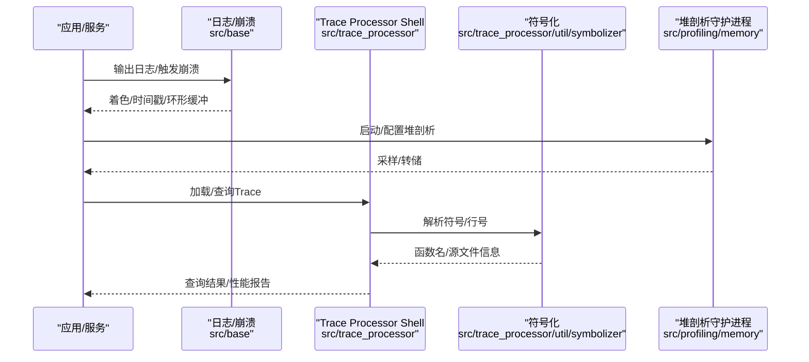
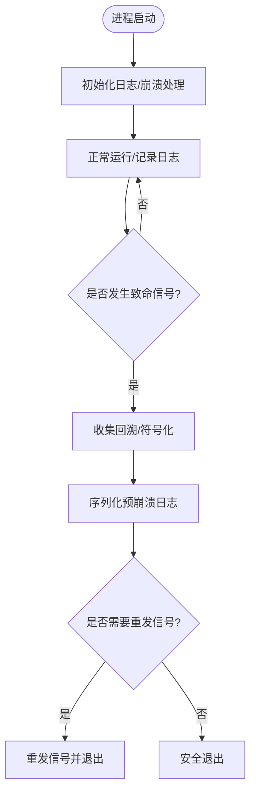
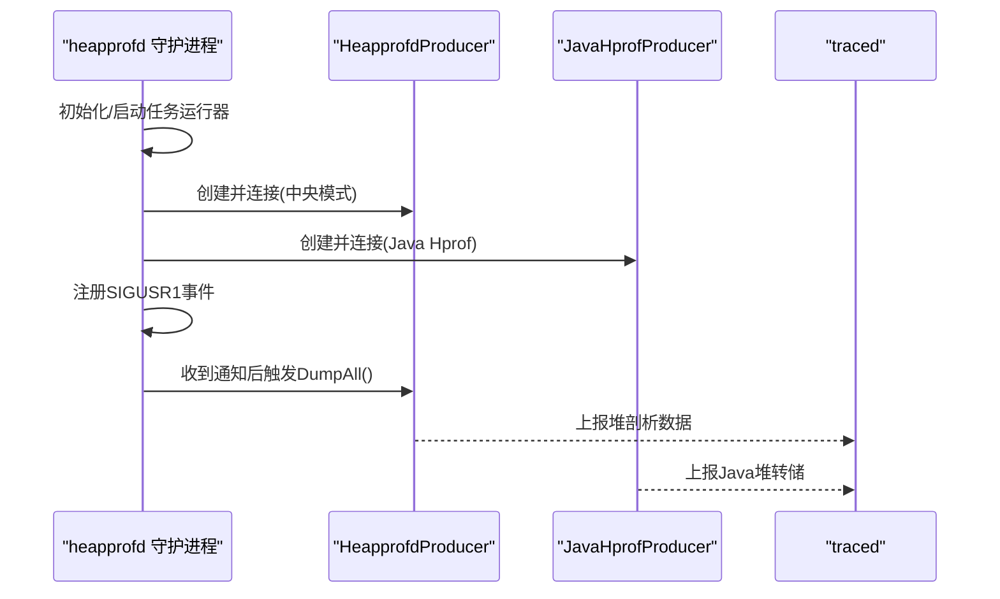
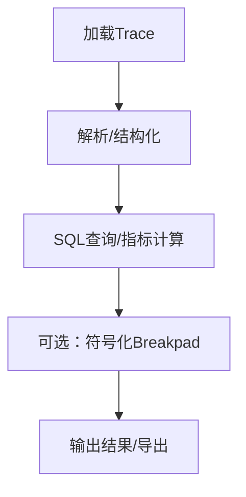
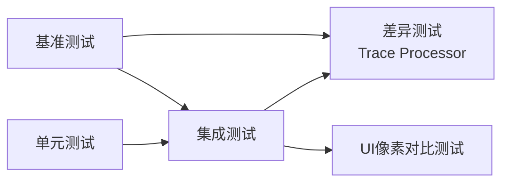
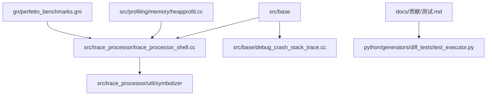

# 调试工具

<cite>
**本文引用的文件**
- [docs/贡献/测试.md](file://docs/contributing/testing.md)
- [src/base/logging.cc](file://src/base/logging.cc)
- [src/base/debug_crash_stack_trace.cc](file://src/base/debug_crash_stack_trace.cc)
- [src/profiling/memory/heapprofd.cc](file://src/profiling/memory/heapprofd.cc)
- [src/trace_processor/trace_processor_shell.cc](file://src/trace_processor/trace_processor_shell.cc)
- [src/trace_processor/util/symbolizer/breakpad_parser.cc](file://src/trace_processor/util/symbolizer/breakpad_parser.cc)
- [gn/perfetto_benchmarks.gni](file://gn/perfetto_benchmarks.gni)
- [docs/入门/内存剖析.md](file://docs/getting-started/memory-profiling.md)
- [docs/入门/CPU剖析.md](file://docs/getting-started/cpu-profiling.md)
- [docs/分析/GettingStarted.md](file://docs/analysis/getting-started.md)
- [docs/跟踪101.md](file://docs/tracing-101.md)
- [test/integrationtest_initializer.h](file://test/integrationtest_initializer.h)
- [src/shared_lib/test/BUILD.gn](file://src/shared_lib/test/BUILD.gn)
- [src/base/BUILD.gn](file://src/base/BUILD.gn)
- [python/generators/diff_tests/testing.py](file://python/generators/diff_tests/testing.py)
- [python/generators/diff_tests/test_executor.py](file://python/generators/diff_tests/test_executor.py)
- [ui/src/plugins/dev.perfetto.RecordTraceV2/pages/memory.ts](file://ui/src/plugins/dev.perfetto.RecordTraceV2/pages/memory.ts)
</cite>

## 目录
1. [简介](#简介)
2. [项目结构](#项目结构)
3. [核心组件](#核心组件)
4. [架构总览](#架构总览)
5. [详细组件分析](#详细组件分析)
6. [依赖关系分析](#依赖关系分析)
7. [性能考量](#性能考量)
8. [故障排查指南](#故障排查指南)
9. [结论](#结论)
10. [附录](#附录)

## 简介
本文件面向开发者与高级用户，系统性梳理 Perfetto 的调试工具与技巧，覆盖以下主题：
- 内置调试与诊断：日志系统、崩溃转储、符号化与追踪分析
- 性能分析：CPU 计数器与调用栈采样、内存剖析（原生与 Java）
- 内存检测：堆剖析守护进程、手动触发全量转储
- 源码级调试：在 Linux/Android 上使用 GDB/LLDB 进行断点、条件断点与数据断点
- 测试体系：单元测试、集成测试、差异测试、UI 像素对比测试、基准测试
- 崩溃转储与内存泄漏分析：符号化、回溯、定位与修复建议
- 常见调试场景与解决方案：权限问题、平台差异、符号缺失、性能回归

## 项目结构
Perfetto 采用模块化分层设计，围绕“记录-传输-解析-可视化”闭环构建。调试与诊断能力主要分布在如下模块：
- 日志与崩溃：src/base
- 崩溃转储与信号处理：src/base/debug_crash_stack_trace.cc
- 堆剖析守护进程：src/profiling/memory/heapprofd.cc
- Trace Processor 交互式 Shell：src/trace_processor/trace_processor_shell.cc
- 符号化与 Breakpad 解析：src/trace_processor/util/symbolizer
- 文档与指南：docs 下各子文档
- 测试与基准：docs/贡献/测试.md、gn/perfetto_benchmarks.gni、test/*、python/generators/diff_tests/*

**图示来源**
- [src/base/logging.cc:1-236](file://src/base/logging.cc#L1-L236)
- [src/base/debug_crash_stack_trace.cc:1-274](file://src/base/debug_crash_stack_trace.cc#L1-L274)
- [src/trace_processor/trace_processor_shell.cc:1-800](file://src/trace_processor/trace_processor_shell.cc#L1-L800)
- [src/profiling/memory/heapprofd.cc:1-130](file://src/profiling/memory/heapprofd.cc#L1-L130)
- [docs/贡献/测试.md:1-249](file://docs/contributing/testing.md#L1-L249)
- [gn/perfetto_benchmarks.gni:1-41](file://gn/perfetto_benchmarks.gni#L1-L41)
- [python/generators/diff_tests/test_executor.py:105-140](file://python/generators/diff_tests/test_executor.py#L105-L140)

**章节来源**
- [docs/贡献/测试.md:1-249](file://docs/contributing/testing.md#L1-L249)
- [gn/perfetto_benchmarks.gni:1-41](file://gn/perfetto_benchmarks.gni#L1-L41)

## 核心组件
- 日志系统：统一的日志输出、时间戳、着色、环形缓冲与崩溃前日志序列化，便于跨进程关联事件与崩溃取证。
- 崩溃转储：在调试构建中注册信号处理器，捕获崩溃现场、打印回溯、尝试符号化，并可重发信号或安全退出。
- 堆剖析守护进程：中央模式启动，监听 Unix Socket，接收生产者连接，支持通过信号触发全量转储，用于内存泄漏与压力测试。
- Trace Processor Shell：命令行交互式查询引擎，支持 HTTP/STDIO RPC、元追踪、额外校验、导出、性能文件写入等。
- 符号化与 Breakpad 解析：解析 Breakpad 符号文件，按地址查找函数名与源码行，辅助崩溃与采样分析。
- 测试与基准：多平台测试目标、差异测试、UI 像素对比、基准覆盖容器、SQL 包注册、开发标志与额外检查。

**章节来源**
- [src/base/logging.cc:1-236](file://src/base/logging.cc#L1-L236)
- [src/base/debug_crash_stack_trace.cc:1-274](file://src/base/debug_crash_stack_trace.cc#L1-L274)
- [src/profiling/memory/heapprofd.cc:1-130](file://src/profiling/memory/heapprofd.cc#L1-L130)
- [src/trace_processor/trace_processor_shell.cc:1-800](file://src/trace_processor/trace_processor_shell.cc#L1-L800)
- [src/trace_processor/util/symbolizer/breakpad_parser.cc:1-152](file://src/trace_processor/util/symbolizer/breakpad_parser.cc#L1-L152)
- [docs/贡献/测试.md:1-249](file://docs/contributing/testing.md#L1-L249)

## 架构总览
下图展示调试与诊断的关键路径：日志与崩溃在运行期产生；Trace Processor 在解析阶段进行符号化；heapprofd 在运行期采集内存样本；测试与基准贯穿开发流程。

**图示来源**
- [src/base/logging.cc:1-236](file://src/base/logging.cc#L1-L236)
- [src/base/debug_crash_stack_trace.cc:1-274](file://src/base/debug_crash_stack_trace.cc#L1-L274)
- [src/trace_processor/trace_processor_shell.cc:1-800](file://src/trace_processor/trace_processor_shell.cc#L1-L800)
- [src/trace_processor/util/symbolizer/breakpad_parser.cc:1-152](file://src/trace_processor/util/symbolizer/breakpad_parser.cc#L1-L152)
- [src/profiling/memory/heapprofd.cc:1-130](file://src/profiling/memory/heapprofd.cc#L1-L130)

## 详细组件分析

### 组件A：日志系统与崩溃转储
- 日志系统
  - 支持回调钩子、颜色输出、时间戳、文件与行号对齐、Android logcat 集成
  - 可选环形日志缓冲，在崩溃前序列化输出，便于取证
- 崩溃转储
  - 调试构建启用信号处理器，捕获常见致命信号
  - 打印回溯、尝试符号化（Linux/Android 使用 libbacktrace，其他平台使用 dladdr）
  - 重发信号或安全退出，避免死锁或不一致状态

**图示来源**
- [src/base/logging.cc:1-236](file://src/base/logging.cc#L1-L236)
- [src/base/debug_crash_stack_trace.cc:1-274](file://src/base/debug_crash_stack_trace.cc#L1-L274)

**章节来源**
- [src/base/logging.cc:1-236](file://src/base/logging.cc#L1-L236)
- [src/base/debug_crash_stack_trace.cc:1-274](file://src/base/debug_crash_stack_trace.cc#L1-L274)

### 组件B：堆剖析守护进程（heapprofd）
- 中央模式启动，监听 Unix Socket，等待生产者连接
- 注册事件 FD，响应 SIGUSR1 触发全量转储，便于手动采样
- 与 Java Hprof 生产者协同，统一上报到 traced

**图示来源**
- [src/profiling/memory/heapprofd.cc:1-130](file://src/profiling/memory/heapprofd.cc#L1-L130)

**章节来源**
- [src/profiling/memory/heapprofd.cc:1-130](file://src/profiling/memory/heapprofd.cc#L1-L130)

### 组件C：Trace Processor Shell 与符号化
- Shell 提供命令行交互、RPC（HTTP/STDIO）、元追踪、额外校验、导出、性能文件写入等
- 符号化解析 Breakpad 文件，按地址映射函数名与源码行，支持范围查找

**图示来源**
- [src/trace_processor/trace_processor_shell.cc:1-800](file://src/trace_processor/trace_processor_shell.cc#L1-L800)
- [src/trace_processor/util/symbolizer/breakpad_parser.cc:1-152](file://src/trace_processor/util/symbolizer/breakpad_parser.cc#L1-L152)

**章节来源**
- [src/trace_processor/trace_processor_shell.cc:1-800](file://src/trace_processor/trace_processor_shell.cc#L1-L800)
- [src/trace_processor/util/symbolizer/breakpad_parser.cc:1-152](file://src/trace_processor/util/symbolizer/breakpad_parser.cc#L1-L152)

### 组件D：测试与基准体系
- 测试目标：单元测试、集成测试、基准测试
- 差异测试：Trace Processor 查询/指标差异测试，支持注册 SQL 包与覆盖标准库
- UI 像素对比测试：Headless Chrome 截图比对，失败时可重新基线
- 基准清单：覆盖容器、SQL、RPC、解析器、ftrace 导入等

**图示来源**
- [docs/贡献/测试.md:1-249](file://docs/contributing/testing.md#L1-L249)
- [gn/perfetto_benchmarks.gni:1-41](file://gn/perfetto_benchmarks.gni#L1-L41)
- [python/generators/diff_tests/test_executor.py:105-140](file://python/generators/diff_tests/test_executor.py#L105-L140)

**章节来源**
- [docs/贡献/测试.md:1-249](file://docs/contributing/testing.md#L1-L249)
- [gn/perfetto_benchmarks.gni:1-41](file://gn/perfetto_benchmarks.gni#L1-L41)
- [python/generators/diff_tests/test_executor.py:105-140](file://python/generators/diff_tests/test_executor.py#L105-L140)

## 依赖关系分析
- 日志与崩溃处理：在 base 组件中实现，被广泛依赖（几乎任何依赖 base 的目标都会受益于统一日志与崩溃前日志序列化）
- Trace Processor Shell：依赖 RPC、元追踪、SQL 标准库、符号化工具
- heapprofd：依赖 Unix Socket、事件 FD、任务运行器、看门狗、生产者接口
- 测试与基准：依赖差异测试执行器、开发标志、额外检查、SQL 包注册

**图示来源**
- [src/base/logging.cc:1-236](file://src/base/logging.cc#L1-L236)
- [src/base/debug_crash_stack_trace.cc:1-274](file://src/base/debug_crash_stack_trace.cc#L1-L274)
- [src/trace_processor/trace_processor_shell.cc:1-800](file://src/trace_processor/trace_processor_shell.cc#L1-L800)
- [src/profiling/memory/heapprofd.cc:1-130](file://src/profiling/memory/heapprofd.cc#L1-L130)
- [docs/贡献/测试.md:1-249](file://docs/contributing/testing.md#L1-L249)
- [gn/perfetto_benchmarks.gni:1-41](file://gn/perfetto_benchmarks.gni#L1-L41)
- [python/generators/diff_tests/test_executor.py:105-140](file://python/generators/diff_tests/test_executor.py#L105-L140)

**章节来源**
- [src/base/logging.cc:1-236](file://src/base/logging.cc#L1-L236)
- [src/base/debug_crash_stack_trace.cc:1-274](file://src/base/debug_crash_stack_trace.cc#L1-L274)
- [src/trace_processor/trace_processor_shell.cc:1-800](file://src/trace_processor/trace_processor_shell.cc#L1-L800)
- [src/profiling/memory/heapprofd.cc:1-130](file://src/profiling/memory/heapprofd.cc#L1-L130)
- [docs/贡献/测试.md:1-249](file://docs/contributing/testing.md#L1-L249)
- [gn/perfetto_benchmarks.gni:1-41](file://gn/perfetto_benchmarks.gni#L1-L41)
- [python/generators/diff_tests/test_executor.py:105-140](file://python/generators/diff_tests/test_executor.py#L105-L140)

## 性能考量
- Trace Processor Shell
  - 支持额外校验与元追踪，有助于定位性能瓶颈与异常路径
  - 导出 SQLite 数据库便于离线分析与二次处理
- 基准测试
  - 覆盖容器、SQL、RPC、解析器、ftrace 导入等关键路径
  - 可结合性能文件输出，评估变更对吞吐与延迟的影响
- heapprofd
  - 中央模式与事件驱动转储，降低开销并提升可控性
  - 通过 SIGUSR1 触发全量转储，适合压力测试与泄漏排查

**章节来源**
- [src/trace_processor/trace_processor_shell.cc:1-800](file://src/trace_processor/trace_processor_shell.cc#L1-L800)
- [gn/perfetto_benchmarks.gni:1-41](file://gn/perfetto_benchmarks.gni#L1-L41)
- [src/profiling/memory/heapprofd.cc:1-130](file://src/profiling/memory/heapprofd.cc#L1-L130)

## 故障排查指南

### 日志与崩溃
- 症状：运行期无日志或崩溃后缺少上下文
- 排查要点：
  - 确认日志级别与回调钩子已正确设置
  - 检查环形日志缓冲是否启用，崩溃前日志是否被序列化
  - 在调试构建中确认信号处理器已注册，必要时重发信号验证

**章节来源**
- [src/base/logging.cc:1-236](file://src/base/logging.cc#L1-L236)
- [src/base/debug_crash_stack_trace.cc:1-274](file://src/base/debug_crash_stack_trace.cc#L1-L274)

### 符号化与回溯
- 症状：崩溃回溯显示地址而非函数名
- 排查要点：
  - 确保 Breakpad 符号文件完整且路径正确
  - 使用符号化工具解析地址到函数名与源码行
  - 在 Linux/Android 平台确保 libbacktrace 正常工作

**章节来源**
- [src/trace_processor/util/symbolizer/breakpad_parser.cc:1-152](file://src/trace_processor/util/symbolizer/breakpad_parser.cc#L1-L152)

### Trace Processor 查询与差异测试
- 症状：查询结果与预期不符或差异测试失败
- 排查要点：
  - 使用额外校验选项与元追踪定位异常
  - 注册 SQL 包或覆盖标准库以修正路径
  - 对于指标差异测试，确保查询仅产生单一输出列或使用抑制列名

**章节来源**
- [src/trace_processor/trace_processor_shell.cc:1-800](file://src/trace_processor/trace_processor_shell.cc#L1-L800)
- [python/generators/diff_tests/test_executor.py:105-140](file://python/generators/diff_tests/test_executor.py#L105-L140)

### heapprofd 与内存泄漏
- 症状：内存持续增长、泄漏怀疑
- 排查要点：
  - 启动 heapprofd 中央模式，确认生产者连接成功
  - 使用 SIGUSR1 触发全量转储，观察未释放内存分布
  - 结合 UI 或 SQL 查询定位热点分配路径

**章节来源**
- [src/profiling/memory/heapprofd.cc:1-130](file://src/profiling/memory/heapprofd.cc#L1-L130)
- [docs/入门/内存剖析.md:1-515](file://docs/getting-started/memory-profiling.md#L1-L515)

### 权限与平台差异
- 症状：集成测试无法访问 ftrace 或权限不足
- 排查要点：
  - 在 Linux 上调整 ftrace 目录权限与 perf_event_paranoid 设置
  - 在 Android 上确保应用具备 profileable 或 debuggable 属性

**章节来源**
- [docs/贡献/测试.md:28-33](file://docs/contributing/testing.md#L28-L33)
- [docs/入门/CPU剖析.md:154-159](file://docs/getting-started/cpu-profiling.md#L154-L159)
- [docs/入门/内存剖析.md:108-118](file://docs/getting-started/memory-profiling.md#L108-L118)

### 源码级调试（GDB/LLDB）
- 建议步骤：
  - 在调试构建中启用崩溃回溯与日志环形缓冲
  - 使用 GDB/LLDB 设置断点、条件断点与数据断点
  - 利用符号化工具与 UI 轨迹查看器交叉验证
  - 对性能问题，结合 CPU 计数器与调用栈采样定位热点

**章节来源**
- [src/base/debug_crash_stack_trace.cc:1-274](file://src/base/debug_crash_stack_trace.cc#L1-L274)
- [docs/入门/CPU剖析.md:173-358](file://docs/getting-started/cpu-profiling.md#L173-L358)
- [docs/入门/内存剖析.md:66-221](file://docs/getting-started/memory-profiling.md#L66-L221)

## 结论
Perfetto 的调试与诊断体系以“统一日志、崩溃取证、符号化、Trace Processor、heapprofd、测试与基准”为核心，形成从运行期观测到离线分析的完整闭环。通过合理使用这些工具与流程，可以高效定位性能瓶颈、内存泄漏与崩溃根因，并建立可持续的质量保障机制。

## 附录

### 常见调试场景与解决方案速查
- 场景：崩溃无回溯或符号缺失
  - 方案：启用调试构建、确保信号处理器注册、准备 Breakpad 符号
- 场景：内存泄漏怀疑
  - 方案：启动 heapprofd，触发全量转储，结合 UI/SQL 分析未释放路径
- 场景：性能回归
  - 方案：运行基准测试，对比性能文件，结合元追踪定位热点
- 场景：测试失败（ftrace/权限）
  - 方案：调整权限与内核参数，或在 Android 上启用 profileable/debuggable

**章节来源**
- [src/base/debug_crash_stack_trace.cc:1-274](file://src/base/debug_crash_stack_trace.cc#L1-L274)
- [src/profiling/memory/heapprofd.cc:1-130](file://src/profiling/memory/heapprofd.cc#L1-L130)
- [gn/perfetto_benchmarks.gni:1-41](file://gn/perfetto_benchmarks.gni#L1-L41)
- [docs/贡献/测试.md:28-33](file://docs/contributing/testing.md#L28-L33)