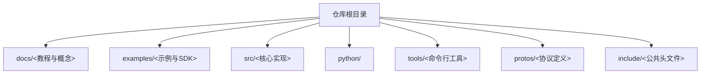
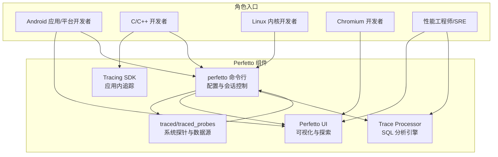
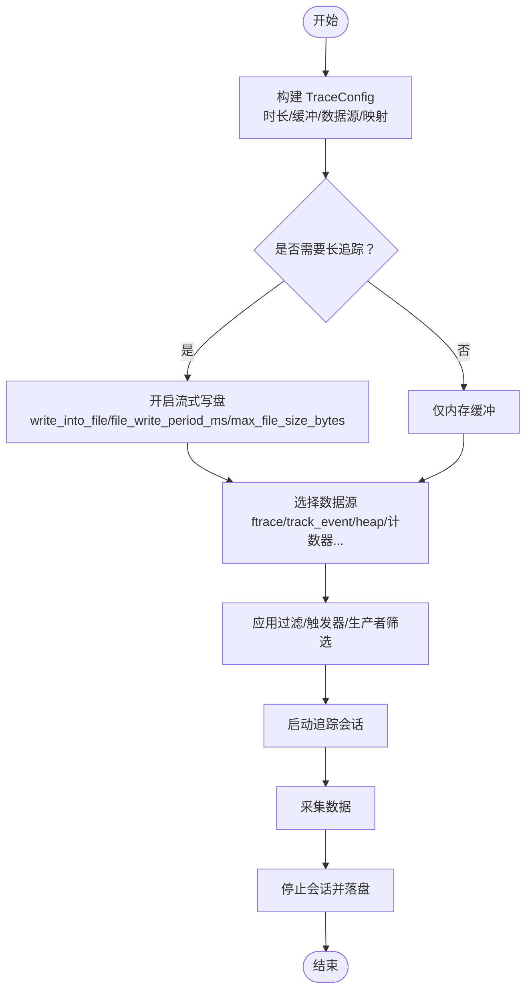
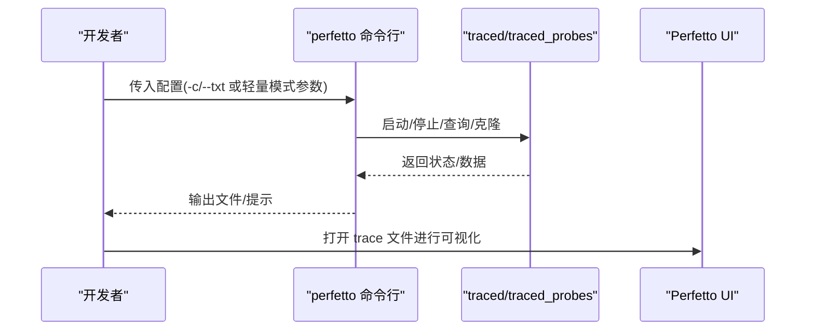
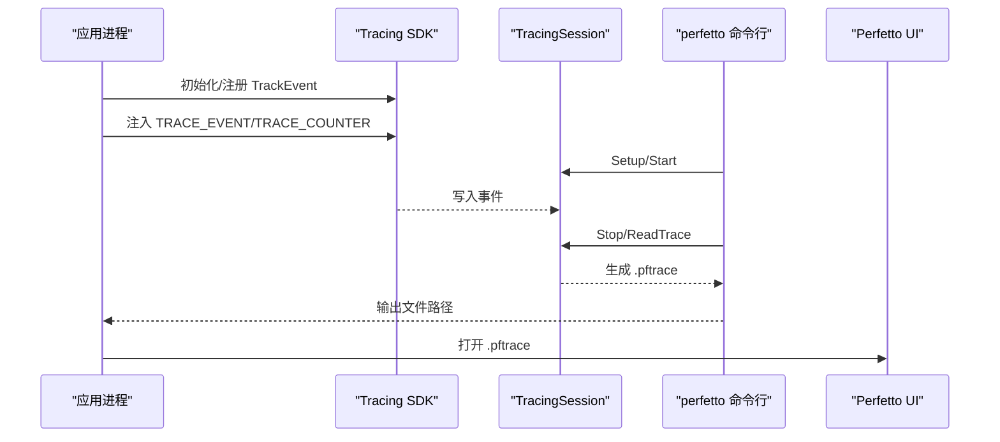
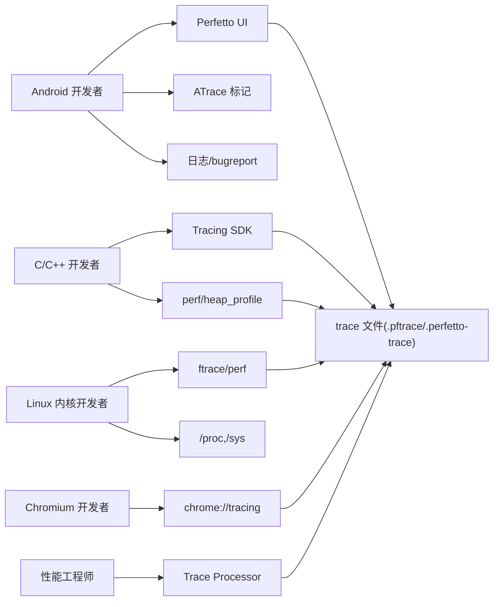

# 快速开始

<cite>
**本文引用的文件**
- [README.md](file://README.md)
- [start-using-perfetto.md](file://docs/getting-started/start-using-perfetto.md)
- [system-tracing.md](file://docs/getting-started/system-tracing.md)
- [cpu-profiling.md](file://docs/getting-started/cpu-profiling.md)
- [memory-profiling.md](file://docs/getting-started/memory-profiling.md)
- [in-app-tracing.md](file://docs/getting-started/in-app-tracing.md)
- [tracing-sdk.md](file://docs/instrumentation/tracing-sdk.md)
- [config.md](file://docs/concepts/config.md)
- [perfetto-cli.md](file://docs/reference/perfetto-cli.md)
- [atrace.md](file://docs/data-sources/atrace.md)
- [android-trace-analysis.md](file://docs/getting-started/android-trace-analysis.md)
- [faq.md](file://docs/faq.md)
- [example.cc](file://examples/sdk/example.cc)
- [system_wide_trace_cfg.pbtxt](file://examples/sdk/system_wide_trace_cfg.pbtxt)
- [persistent_cfg.pbtxt](file://persistent_cfg.pbtxt)
</cite>

## 目录
1. [简介](#简介)
2. [项目结构](#项目结构)
3. [核心组件](#核心组件)
4. [架构总览](#架构总览)
5. [详细组件分析](#详细组件分析)
6. [依赖关系分析](#依赖关系分析)
7. [性能考虑](#性能考虑)
8. [故障排除指南](#故障排除指南)
9. [结论](#结论)
10. [附录](#附录)

## 简介
Perfetto 是一套用于系统级性能分析与追踪的开源套件，覆盖 Android、Linux、Chromium 等平台，提供高性能追踪守护进程、低开销用户态追踪 SDK、广泛的系统探针、浏览器端可视化 UI 以及基于 SQL 的分析引擎。它既适合 Android 应用与平台开发者定位卡顿、内存压力、ANR 等问题，也适合 C/C++ 开发者、Linux 内核开发者、Chromium 工程师与性能工程师进行深入的时序分析与自动化度量。

本“快速开始”面向不同角色（Android 应用开发者、C/C++ 开发者、Linux 内核开发者、Chromium 开发者、性能工程师），给出可直接落地的环境准备、安装步骤、首个追踪示例的完整流程，并解释追踪配置、数据源选择与追踪会话管理等基础概念。文末提供常见问题与故障排除建议，帮助你快速上手并成功运行第一个 Perfetto 追踪。

## 项目结构
- 文档与教程：位于 docs/ 下，按“入门”“概念”“数据源”“分析”“参考”等维度组织，便于按角色检索。
- 示例与 SDK：examples/ 提供 C++ SDK 使用示例；contrib/ 包含 Rust SDK。
- 核心实现：src/ 下为服务、探针、解析器、UI 等实现。
- 工具链：python/ 与 tools/ 提供 traceconv、record_android_trace、cpu_profile、heap_profile 等实用脚本。
- 配置样例：examples/sdk/system_wide_trace_cfg.pbtxt、persistent_cfg.pbtxt 等展示典型配置。

章节来源
- [README.md:1-101](file://README.md#L1-L101)

## 核心组件
- 追踪守护与探针：在 Android/Linux 上通过 traced/traced_probes 收集 ftrace、进程统计、系统调用、CPU 频率等事件。
- 用户态追踪 SDK：C++17 的 Tracing SDK，支持在应用中注入切片、计数器、流事件等，或自定义数据源。
- 浏览器 UI：本地运行的 Web UI，支持拖拽打开 trace 文件，进行时间轴可视化与交互。
- Trace Processor：基于 SQL 的分析引擎，支持查询、聚合与导出，便于自动化提取指标。
- 命令行工具：perfetto 命令行客户端用于启动/停止追踪、后台模式、克隆会话、触发器等。

章节来源
- [README.md:12-31](file://README.md#L12-L31)

## 架构总览
下图展示了从配置到采集、存储与可视化的整体流程，以及不同角色的入口路径。

图表来源
- [start-using-perfetto.md:33-42](file://docs/getting-started/start-using-perfetto.md#L33-L42)
- [system-tracing.md:1-302](file://docs/getting-started/system-tracing.md#L1-L302)
- [tracing-sdk.md:1-419](file://docs/instrumentation/tracing-sdk.md#L1-L419)

## 详细组件分析

### 角色化快速入门路径
- Android 应用/平台开发者
  - 推荐先用 Perfetto UI 录制系统追踪，再结合 ATrace 标记与日志查看问题。
  - 参考：[系统追踪录制:22-171](file://docs/getting-started/system-tracing.md#L22-L171)、[ATrace 数据源:1-124](file://docs/data-sources/atrace.md#L1-L124)、[Android 分析食谱:1-672](file://docs/getting-started/android-trace-analysis.md#L1-L672)
- C/C++ 开发者（非 Android）
  - 使用 Tracing SDK 注入切片/计数器，或启用 native heap profiler、perf counters。
  - 参考：[In-App 追踪:1-361](file://docs/getting-started/in-app-tracing.md#L1-L361)、[Tracing SDK:1-419](file://docs/instrumentation/tracing-sdk.md#L1-L419)、[CPU 性能分析:1-452](file://docs/getting-started/cpu-profiling.md#L1-L452)、[内存分析:1-515](file://docs/getting-started/memory-profiling.md#L1-L515)
- Linux 内核开发者
  - 通过 ftrace、perf、/proc 和 /sys 采集内核与系统信息，结合 UI 与 SQL 分析。
  - 参考：[系统追踪录制（Linux）:136-171](file://docs/getting-started/system-tracing.md#L136-L171)、[CPU 性能分析:115-171](file://docs/getting-started/cpu-profiling.md#L115-L171)
- Chromium 开发者
  - 使用 chrome://tracing 的 Perfetto 后端进行录制与分析。
  - 参考：[Chrome 追踪教程:31-90](file://docs/getting-started/system-tracing.md#L31-L90)
- 性能工程师/SRE
  - 使用 Trace Processor 对多格式 trace 进行统一分析与自动化提取指标。
  - 参考：[Trace Processor 入门](file://docs/analysis/getting-started.md)、[SQL 模块与查询](file://docs/analysis/perfetto-sql-getting-started.md)

章节来源
- [start-using-perfetto.md:30-475](file://docs/getting-started/start-using-perfetto.md#L30-L475)

### 追踪配置与数据源选择
- TraceConfig 是追踪的“蓝图”，定义时长、缓冲区、数据源与映射策略。
- 关键要点
  - 缓冲区大小与填充策略（环形/丢弃）、目标文件大小上限。
  - 数据源分组与 target_buffer 映射，避免高吞吐数据源“吃掉”低频数据。
  - 文本/二进制配置格式、长追踪流式写盘、触发器（开始/停止）。
- 参考
  - [TraceConfig 概念:1-499](file://docs/concepts/config.md#L1-L499)
  - [示例配置：系统全量追踪:1-47](file://examples/sdk/system_wide_trace_cfg.pbtxt#L1-L47)
  - [示例配置：持久化会话:1-103](file://persistent_cfg.pbtxt#L1-L103)

图表来源
- [config.md:49-499](file://docs/concepts/config.md#L49-L499)
- [system_wide_trace_cfg.pbtxt:1-47](file://examples/sdk/system_wide_trace_cfg.pbtxt#L1-L47)
- [persistent_cfg.pbtxt:1-103](file://persistent_cfg.pbtxt#L1-103)

章节来源
- [config.md:1-499](file://docs/concepts/config.md#L1-L499)
- [system_wide_trace_cfg.pbtxt:1-47](file://examples/sdk/system_wide_trace_cfg.pbtxt#L1-L47)
- [persistent_cfg.pbtxt:1-103](file://persistent_cfg.pbtxt#L1-L103)

### 追踪会话管理与命令行工具
- perfetto 命令行
  - 轻量模式：通过命令行参数快速启用 ftrace/atrace。
  - 正常模式：通过 TraceConfig（文本/二进制）精细控制。
  - 支持后台模式、查询服务状态、克隆会话、触发器、分离/附加等。
- 参考
  - [perfetto CLI 参考:1-215](file://docs/reference/perfetto-cli.md#L1-L215)

图表来源
- [perfetto-cli.md:1-215](file://docs/reference/perfetto-cli.md#L1-L215)
- [system-tracing.md:22-171](file://docs/getting-started/system-tracing.md#L22-L171)

章节来源
- [perfetto-cli.md:1-215](file://docs/reference/perfetto-cli.md#L1-L215)

### 第一个系统追踪（Android/命令行）
- 准备
  - 安卓设备已开启开发者选项与 USB 调试；adb 可用。
- 录制
  - 使用 record_android_trace 辅助脚本一键拉起、采集、下载并打开 UI。
  - 或直接使用 perfetto 命令行传入配置与输出路径。
- 查看
  - 在 UI 中拖拽 trace 文件或自动打开；使用“查询（SQL）”标签页执行分析。
- 参考
  - [系统追踪：Android（命令行）:91-135](file://docs/getting-started/system-tracing.md#L91-L135)

章节来源
- [system-tracing.md:91-135](file://docs/getting-started/system-tracing.md#L91-L135)

### 第一个应用内追踪（C++）
- SDK 集成
  - 将 sdk/perfetto.h/cc 引入工程，初始化 Tracing（可选 in-process 或 system 模式），注册 TrackEvent。
- 注入事件
  - 使用 TRACE_EVENT/TRACE_EVENT_BEGIN/TRACE_EVENT_END/TRACE_COUNTER 等宏。
- 录制与保存
  - 构建 TraceConfig（启用 track_event，配置缓冲与分类），启动/停止 TracingSession 并保存为 .pftrace。
- 可视化与查询
  - 在 UI 中打开；或使用 SQL 查询切片、计数器等。
- 参考
  - [In-App 追踪:1-361](file://docs/getting-started/in-app-tracing.md#L1-L361)
  - [Tracing SDK:1-419](file://docs/instrumentation/tracing-sdk.md#L1-L419)
  - [示例：example.cc:1-131](file://examples/sdk/example.cc#L1-L131)

图表来源
- [in-app-tracing.md:165-232](file://docs/getting-started/in-app-tracing.md#L165-L232)
- [tracing-sdk.md:332-414](file://docs/instrumentation/tracing-sdk.md#L332-L414)
- [example.cc:35-83](file://examples/sdk/example.cc#L35-L83)

章节来源
- [in-app-tracing.md:1-361](file://docs/getting-started/in-app-tracing.md#L1-L361)
- [tracing-sdk.md:1-419](file://docs/instrumentation/tracing-sdk.md#L1-L419)
- [example.cc:1-131](file://examples/sdk/example.cc#L1-L131)

### CPU 分析（性能计数器与火焰图）
- 采集模式
  - perf 计数器采样（周期/频率），可与 ftrace/sched 事件混合。
  - 可开启调用栈采样（callstack），按进程范围限制以降低开销。
- 录制与可视化
  - 使用 record_android_trace 或 tracebox；在 UI 中查看计数器与火焰图。
- 参考
  - [CPU 性能分析:1-452](file://docs/getting-started/cpu-profiling.md#L1-L452)

章节来源
- [cpu-profiling.md:1-452](file://docs/getting-started/cpu-profiling.md#L1-L452)

### 内存分析（Java/原生堆剖析）
- Java 堆转储（Android）
  - 通过 heap dump 获取对象图与可达性，辅助定位泄漏与大对象。
- 原生堆剖析（Android/Linux）
  - 通过 heapprofd 采样 malloc/free，聚合未释放/总分配等指标。
- 参考
  - [内存分析:1-515](file://docs/getting-started/memory-profiling.md#L1-L515)

章节来源
- [memory-profiling.md:1-515](file://docs/getting-started/memory-profiling.md#L1-L515)

### ATrace 标记与日志联动
- ATrace 是 Android 上的标准标记接口，可在 UI 中显示为切片/计数器。
- 可在 TraceConfig 中按类别/应用启用系统与应用事件。
- 参考
  - [ATrace 数据源:1-124](file://docs/data-sources/atrace.md#L1-L124)

章节来源
- [atrace.md:1-124](file://docs/data-sources/atrace.md#L1-L124)

### Android 分析食谱（SQL 与高级特性）
- 切片查询、聚合统计、进程元数据、内存峰值、不可中断睡眠、启动阻塞、调度组调试跟踪等。
- 参考
  - [Android 分析食谱:1-672](file://docs/getting-started/android-trace-analysis.md#L1-L672)

章节来源
- [android-trace-analysis.md:1-672](file://docs/getting-started/android-trace-analysis.md#L1-L672)

## 依赖关系分析
- 角色到入口
  - Android 开发者 → Perfetto UI + ATrace + 日志
  - C/C++ 开发者 → Tracing SDK + perf/heap 工具
  - Linux 内核开发者 → traced/traced_probes + ftrace + perf
  - Chromium 开发者 → chrome://tracing（Perfetto 后端）
  - 性能工程师 → Trace Processor + SQL
- 组件耦合
  - perfetto 命令行 ↔ traced/traced_probes（配置下发与数据回传）
  - UI/Trace Processor ↔ Trace 文件（Protobuf 格式）
  - 应用侧 SDK ↔ traced（系统模式）

图表来源
- [start-using-perfetto.md:30-475](file://docs/getting-started/start-using-perfetto.md#L30-L475)
- [system-tracing.md:1-302](file://docs/getting-started/system-tracing.md#L1-L302)
- [tracing-sdk.md:1-419](file://docs/instrumentation/tracing-sdk.md#L1-L419)

## 性能考虑
- 缓冲区策略
  - 高频数据源（如 sched）与低频数据源（如内存快照）应分拆到不同缓冲区，避免互相挤占。
  - 环形缓冲区适合实时追踪；丢弃策略需谨慎，避免关键尾部提交数据丢失。
- 长追踪
  - 启用流式写盘与合理周期，平衡 I/O 与内存占用。
- 采样与开销
  - CPU 采样频率与调用栈解码成本需权衡；按进程范围限制采样可降低开销。
- UI/分析
  - 大型 trace 建议使用 Trace Processor 进行离线分析，减少浏览器端压力。

章节来源
- [config.md:94-269](file://docs/concepts/config.md#L94-L269)
- [cpu-profiling.md:115-171](file://docs/getting-started/cpu-profiling.md#L115-L171)

## 故障排除指南
- 无法通过 adb 打开 UI 或打开失败
  - 使用 open_trace_in_ui 脚本或手动在 UI 中打开 trace 文件。
  - 参考：[FAQ：如何从命令行打开 trace:3-22](file://docs/faq.md#L3-L22)
- JSON 特性不兼容
  - JSON 为遗留格式，部分特性不保证兼容；推荐改用 TrackEvent。
  - 参考：[FAQ：JSON 兼容性:23-53](file://docs/faq.md#L23-L53)
- 多进程聚合
  - 使用 Tracing SDK 的 system 模式，所有进程连接 traced，生成统一 trace。
  - 参考：[FAQ：多进程聚合:66-71](file://docs/faq.md#L66-L71)
- Android 设备权限/SELinux 限制
  - 非 Root 设备可能需要特定配置或使用持久化配置；注意配置传递方式与路径。
  - 参考：[配置：Android 注意事项:478-494](file://docs/concepts/config.md#L478-L494)

章节来源
- [faq.md:1-71](file://docs/faq.md#L1-L71)
- [config.md:478-494](file://docs/concepts/config.md#L478-L494)

## 结论
通过本快速开始，你可以根据不同角色选择合适的入口与工具：Android 开发者可从 UI 与 ATrace 入手；C/C++ 开发者可直接集成 SDK 并结合 perf/heap 工具；Linux 内核开发者可利用 ftrace/perf；Chromium 开发者可用 chrome://tracing；性能工程师可借助 Trace Processor 与 SQL 自动化分析。掌握 TraceConfig、数据源选择与会话管理后，即可高效开展系统级性能诊断与优化。

## 附录
- 常用命令与脚本
  - record_android_trace：一键录制 Android trace 并打开 UI。
  - traceconv：trace 文件转换（如 pprof、JSON、文本等）。
  - tracebox：Linux/Android 便携式采集器，内置多种数据源。
- 参考文件
  - [system_wide_trace_cfg.pbtxt:1-47](file://examples/sdk/system_wide_trace_cfg.pbtxt#L1-L47)
  - [persistent_cfg.pbtxt:1-103](file://persistent_cfg.pbtxt#L1-L103)
  - [example.cc:1-131](file://examples/sdk/example.cc#L1-L131)