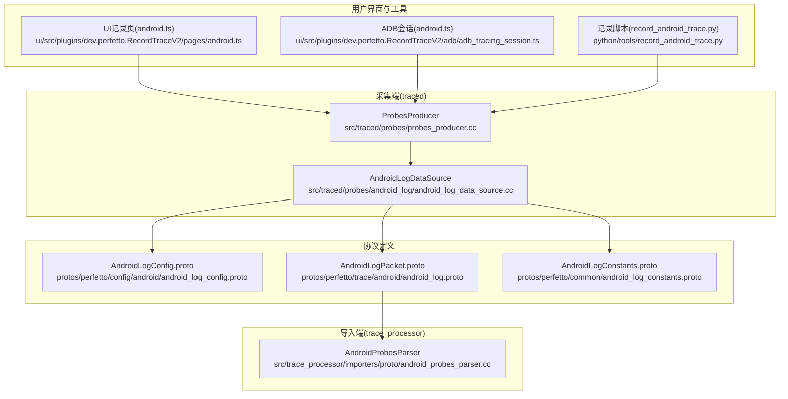
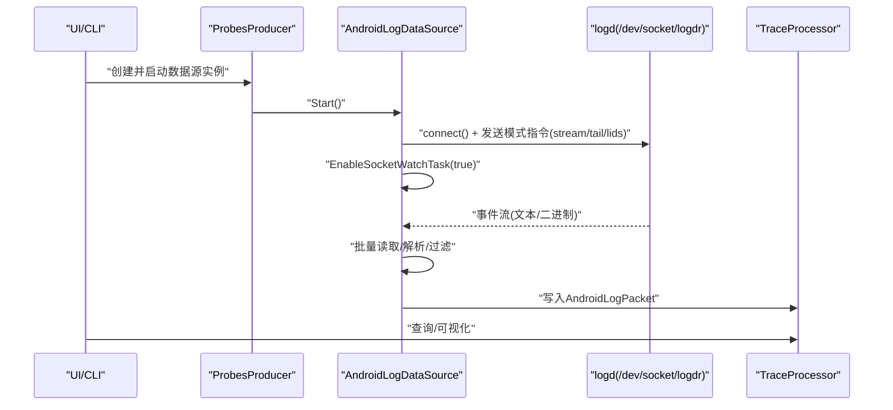
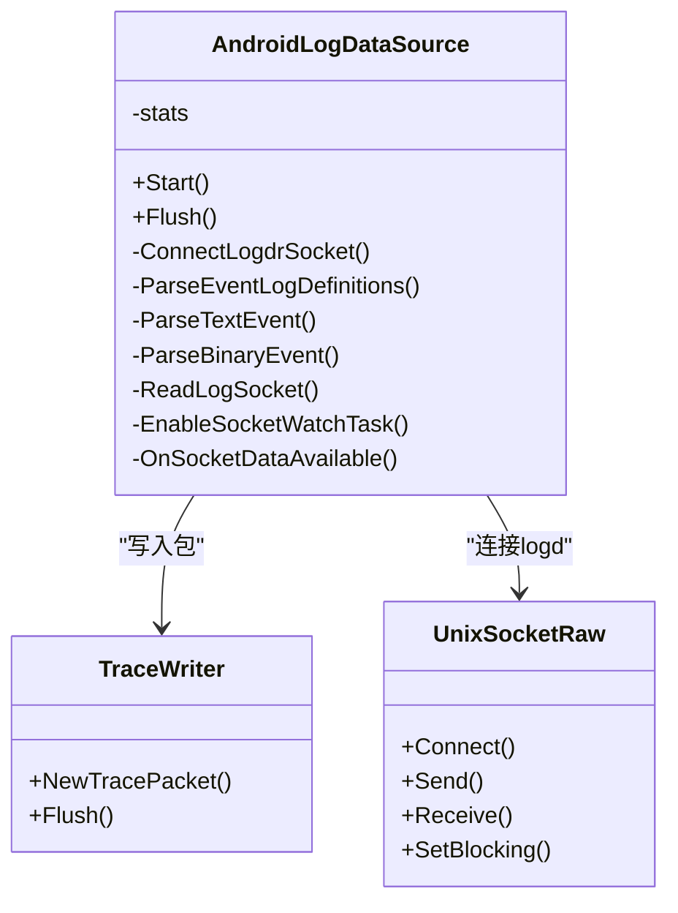
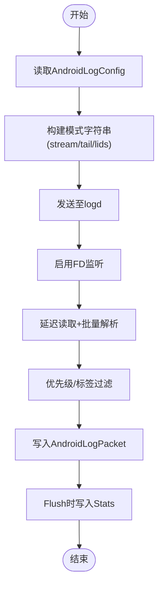
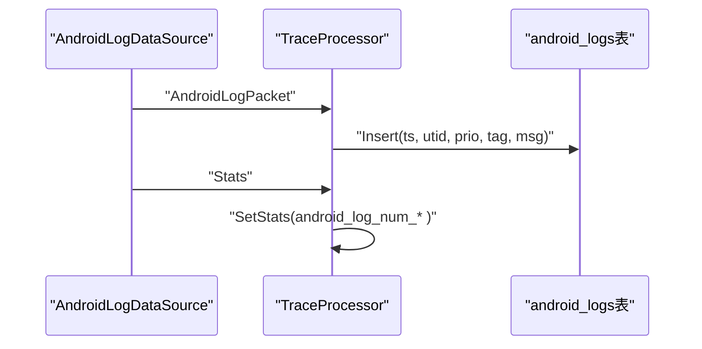
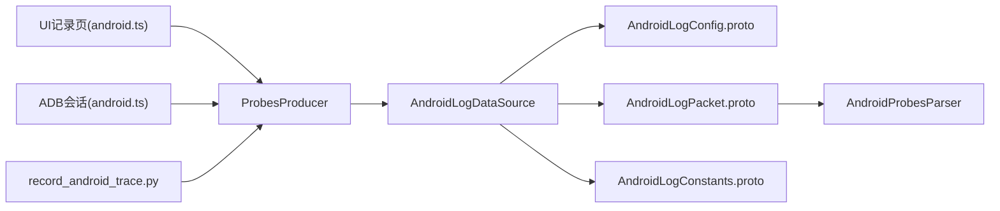

# Android日志探测器

<cite>
**本文引用的文件**
- [android_log_data_source.cc](file://src/traced/probes/android_log/android_log_data_source.cc)
- [android_log_data_source.h](file://src/traced/probes/android_log/android_log_data_source.h)
- [probes_producer.cc](file://src/traced/probes/probes_producer.cc)
- [android_log_config.proto](file://protos/perfetto/config/android/android_log_config.proto)
- [android_log.proto](file://protos/perfetto/trace/android/android_log.proto)
- [android_log_constants.proto](file://protos/perfetto/common/android_log_constants.proto)
- [android-log.md](file://docs/data-sources/android-log.md)
- [system-log.md](file://docs/data-sources/system-log.md)
- [clock-sync.md](file://docs/concepts/clock-sync.md)
- [android_probes_parser.cc](file://src/trace_processor/importers/proto/android_probes_parser.cc)
- [record_android_trace.py](file://python/tools/record_android_trace.py)
- [adb_tracing_session.ts](file://ui/src/plugins/dev.perfetto.RecordTraceV2/adb/adb_tracing_session.ts)
- [android.ts](file://ui/src/plugins/dev.perfetto.RecordTraceV2/pages/android.ts)
</cite>

## 目录
1. [简介](#简介)
2. [项目结构](#项目结构)
3. [核心组件](#核心组件)
4. [架构总览](#架构总览)
5. [详细组件分析](#详细组件分析)
6. [依赖关系分析](#依赖关系分析)
7. [性能考量](#性能考量)
8. [故障排除指南](#故障排除指南)
9. [结论](#结论)
10. [附录](#附录)

## 简介
本技术文档面向Android日志探测器（android.log数据源），系统性阐述其工作原理、过滤机制、优先级与时间戳同步策略，并给出配置项说明、与其他数据源的集成方式及在性能分析中的应用实践。读者可据此在长时追踪场景下稳定地采集并分析Android logcat事件，实现与系统/内核/应用等其他数据源的时间对齐与统一视图。

## 项目结构
Android日志探测器位于traced探针子系统中，核心代码由数据源实现、配置协议、追踪包协议与导入解析器组成；同时通过trace_processor在导入阶段完成统计与表结构化，配合UI与CLI工具完成端到端采集与可视化。

图表来源
- [android_log_data_source.cc:173-186](file://src/traced/probes/android_log/android_log_data_source.cc#L173-L186)
- [probes_producer.cc:250-257](file://src/traced/probes/probes_producer.cc#L250-L257)
- [android_log_config.proto:22-41](file://protos/perfetto/config/android/android_log_config.proto#L22-L41)
- [android_log.proto:22-77](file://protos/perfetto/trace/android/android_log.proto#L22-L77)
- [android_log_constants.proto:21-47](file://protos/perfetto/common/android_log_constants.proto#L21-L47)
- [android_probes_parser.cc:464-497](file://src/trace_processor/importers/proto/android_probes_parser.cc#L464-L497)
- [android.ts:96-119](file://ui/src/plugins/dev.perfetto.RecordTraceV2/pages/android.ts#L96-L119)
- [adb_tracing_session.ts:24-36](file://ui/src/plugins/dev.perfetto.RecordTraceV2/adb/adb_tracing_session.ts#L24-L36)
- [record_android_trace.py:241-365](file://python/tools/record_android_trace.py#L241-L365)

章节来源
- [android_log_data_source.cc:173-186](file://src/traced/probes/android_log/android_log_data_source.cc#L173-L186)
- [probes_producer.cc:250-257](file://src/traced/probes/probes_producer.cc#L250-L257)
- [android_log_config.proto:22-41](file://protos/perfetto/config/android/android_log_config.proto#L22-L41)
- [android_log.proto:22-77](file://protos/perfetto/trace/android/android_log.proto#L22-L77)
- [android_log_constants.proto:21-47](file://protos/perfetto/common/android_log_constants.proto#L21-L47)
- [android_probes_parser.cc:464-497](file://src/trace_processor/importers/proto/android_probes_parser.cc#L464-L497)
- [android.ts:96-119](file://ui/src/plugins/dev.perfetto.RecordTraceV2/pages/android.ts#L96-L119)
- [adb_tracing_session.ts:24-36](file://ui/src/plugins/dev.perfetto.RecordTraceV2/adb/adb_tracing_session.ts#L24-L36)
- [record_android_trace.py:241-365](file://python/tools/record_android_trace.py#L241-L365)

## 核心组件
- 数据源实现：负责连接logd守护进程、批量读取、解析文本与二进制事件、应用过滤规则、写入TracePacket。
- 配置协议：定义日志缓冲区选择、最小优先级、标签过滤、是否保留启动前缓冲等参数。
- 追踪包协议：定义AndroidLogPacket结构、字段含义与统计信息。
- 导入解析器：在trace_processor中将原始包转换为标准表结构，供SQL查询使用。
- UI与工具链：提供记录向导、ADB会话管理与命令行脚本，便于端到端采集与查看。

章节来源
- [android_log_data_source.h:46-144](file://src/traced/probes/android_log/android_log_data_source.h#L46-L144)
- [android_log_config.proto:22-41](file://protos/perfetto/config/android/android_log_config.proto#L22-L41)
- [android_log.proto:22-77](file://protos/perfetto/trace/android/android_log.proto#L22-L77)
- [android_probes_parser.cc:464-497](file://src/trace_processor/importers/proto/android_probes_parser.cc#L464-L497)

## 架构总览
Android日志探测器以“探针数据源”的形式接入traced服务，通过UNIX域套接字与logd通信，按配置进行过滤与批量处理，最终写入TracePacket并由trace_processor导入为结构化表。

图表来源
- [probes_producer.cc:250-257](file://src/traced/probes/probes_producer.cc#L250-L257)
- [android_log_data_source.cc:173-186](file://src/traced/probes/android_log/android_log_data_source.cc#L173-L186)
- [android_log_data_source.cc:205-228](file://src/traced/probes/android_log/android_log_data_source.cc#L205-L228)
- [android_log_data_source.cc:230-316](file://src/traced/probes/android_log/android_log_data_source.cc#L230-L316)
- [android_log.proto:22-77](file://protos/perfetto/trace/android/android_log.proto#L22-L77)

## 详细组件分析

### 组件A：AndroidLogDataSource（数据源实现）
- 启动流程：解析事件格式定义、连接logd、发送模式指令（支持保留启动前缓冲）、启用FD事件监听。
- 事件读取与批处理：采用延迟读取与批量解析，避免风暴式回调与频繁上下文切换。
- 文本事件解析：校验优先级、应用最小优先级与标签过滤、填充Common字段（PID/TID/UID）。
- 二进制事件解析：基于事件ID查找格式定义，按字段类型解码并生成参数键值。
- 统计与刷新：在Flush时输出累计统计（总数/失败/跳过）。

图表来源
- [android_log_data_source.h:46-144](file://src/traced/probes/android_log/android_log_data_source.h#L46-L144)
- [android_log_data_source.cc:95-154](file://src/traced/probes/android_log/android_log_data_source.cc#L95-L154)
- [android_log_data_source.cc:163-186](file://src/traced/probes/android_log/android_log_data_source.cc#L163-L186)
- [android_log_data_source.cc:230-316](file://src/traced/probes/android_log/android_log_data_source.cc#L230-L316)

章节来源
- [android_log_data_source.cc:95-154](file://src/traced/probes/android_log/android_log_data_source.cc#L95-L154)
- [android_log_data_source.cc:163-186](file://src/traced/probes/android_log/android_log_data_source.cc#L163-L186)
- [android_log_data_source.cc:205-228](file://src/traced/probes/android_log/android_log_data_source.cc#L205-L228)
- [android_log_data_source.cc:230-316](file://src/traced/probes/android_log/android_log_data_source.cc#L230-L316)
- [android_log_data_source.cc:318-365](file://src/traced/probes/android_log/android_log_data_source.cc#L318-L365)
- [android_log_data_source.cc:367-460](file://src/traced/probes/android_log/android_log_data_source.cc#L367-L460)
- [android_log_data_source.cc:462-479](file://src/traced/probes/android_log/android_log_data_source.cc#L462-L479)
- [android_log_data_source.h:46-144](file://src/traced/probes/android_log/android_log_data_source.h#L46-L144)

### 组件B：配置与协议（AndroidLogConfig/AndroidLogPacket）
- 配置项
  - 日志缓冲区：log_ids（默认若未指定则包含常用缓冲）
  - 最小优先级：min_prio
  - 标签过滤：filter_tags（多值）
  - 保留启动前缓冲：preserve_log_buffer（默认false）
- 追踪包
  - AndroidLogPacket.LogEvent包含：log_id、pid/tid/uid、timestamp、tag、优先级、消息或二进制参数列表
  - Stats用于Flush时上报累计统计

图表来源
- [android_log_config.proto:22-41](file://protos/perfetto/config/android/android_log_config.proto#L22-L41)
- [android_log_data_source.cc:105-130](file://src/traced/probes/android_log/android_log_data_source.cc#L105-L130)
- [android_log_data_source.cc:173-186](file://src/traced/probes/android_log/android_log_data_source.cc#L173-L186)
- [android_log_data_source.cc:205-228](file://src/traced/probes/android_log/android_log_data_source.cc#L205-L228)
- [android_log_data_source.cc:230-316](file://src/traced/probes/android_log/android_log_data_source.cc#L230-L316)
- [android_log.proto:22-77](file://protos/perfetto/trace/android/android_log.proto#L22-L77)

章节来源
- [android_log_config.proto:22-41](file://protos/perfetto/config/android/android_log_config.proto#L22-L41)
- [android_log.proto:22-77](file://protos/perfetto/trace/android/android_log.proto#L22-L77)

### 组件C：导入与查询（trace_processor）
- 解析逻辑：将AndroidLogPacket写入android_logs表，解析失败/跳过计数写入统计
- 查询接口：通过Perfetto SQL访问android_logs，关联thread/process等表进行上下文分析

图表来源
- [android_probes_parser.cc:464-497](file://src/trace_processor/importers/proto/android_probes_parser.cc#L464-L497)
- [android-log.md:34-47](file://docs/data-sources/android-log.md#L34-L47)

章节来源
- [android_probes_parser.cc:464-497](file://src/trace_processor/importers/proto/android_probes_parser.cc#L464-L497)
- [android-log.md:34-47](file://docs/data-sources/android-log.md#L34-L47)

## 依赖关系分析
- 数据源与生产者：ProbesProducer根据配置创建AndroidLogDataSource实例并注入TraceWriter。
- 协议依赖：数据源读取配置协议，写入追踪包协议；导入器依赖追踪包协议。
- UI/工具链：UI页面提供缓冲区选择与记录向导；ADB会话负责与设备建立消费者通道；CLI脚本负责后台启动与拉取结果。

图表来源
- [probes_producer.cc:250-257](file://src/traced/probes/probes_producer.cc#L250-L257)
- [android_log_data_source.cc:103-154](file://src/traced/probes/android_log/android_log_data_source.cc#L103-L154)
- [android_log_config.proto:22-41](file://protos/perfetto/config/android/android_log_config.proto#L22-L41)
- [android_log.proto:22-77](file://protos/perfetto/trace/android/android_log.proto#L22-L77)
- [android_log_constants.proto:21-47](file://protos/perfetto/common/android_log_constants.proto#L21-L47)
- [android_probes_parser.cc:464-497](file://src/trace_processor/importers/proto/android_probes_parser.cc#L464-L497)
- [android.ts:96-119](file://ui/src/plugins/dev.perfetto.RecordTraceV2/pages/android.ts#L96-L119)
- [adb_tracing_session.ts:24-36](file://ui/src/plugins/dev.perfetto.RecordTraceV2/adb/adb_tracing_session.ts#L24-L36)
- [record_android_trace.py:241-365](file://python/tools/record_android_trace.py#L241-L365)

章节来源
- [probes_producer.cc:250-257](file://src/traced/probes/probes_producer.cc#L250-L257)
- [android_log_data_source.cc:103-154](file://src/traced/probes/android_log/android_log_data_source.cc#L103-L154)
- [android_log_config.proto:22-41](file://protos/perfetto/config/android/android_log_config.proto#L22-L41)
- [android_log.proto:22-77](file://protos/perfetto/trace/android/android_log.proto#L22-L77)
- [android_log_constants.proto:21-47](file://protos/perfetto/common/android_log_constants.proto#L21-L47)
- [android_probes_parser.cc:464-497](file://src/trace_processor/importers/proto/android_probes_parser.cc#L464-L497)
- [android.ts:96-119](file://ui/src/plugins/dev.perfetto.RecordTraceV2/pages/android.ts#L96-L119)
- [adb_tracing_session.ts:24-36](file://ui/src/plugins/dev.perfetto.RecordTraceV2/adb/adb_tracing_session.ts#L24-L36)
- [record_android_trace.py:241-365](file://python/tools/record_android_trace.py#L241-L365)

## 性能考量
- 批量与节流：采用最多100ms延迟读取与批量解析，降低上下文切换频率，缓解日志风暴。
- 内存与解析：使用页式内存缓冲，减少栈使用风险；解析路径中对异常帧与无效字段进行快速失败与跳过。
- 过滤前置：优先级与标签过滤在解析早期执行，减少后续写入压力。
- 时间戳同步：AndroidLogPacket使用CLOCK_REALTIME，trace_processor通过ClockSnapshot进行全局对齐，保证与其他数据源时间一致性。

章节来源
- [android_log_data_source.cc:205-228](file://src/traced/probes/android_log/android_log_data_source.cc#L205-L228)
- [android_log_data_source.cc:230-316](file://src/traced/probes/android_log/android_log_data_source.cc#L230-L316)
- [android_log_data_source.cc:318-365](file://src/traced/probes/android_log/android_log_data_source.cc#L318-L365)
- [android_log.proto:32-35](file://protos/perfetto/trace/android/android_log.proto#L32-L35)
- [clock-sync.md:1-242](file://docs/concepts/clock-sync.md#L1-L242)

## 故障排除指南
- 设备要求与权限
  - 支持平台：仅支持Android userdebug构建（参考文档说明）。
  - traced服务状态：确认traced运行且版本满足要求。
- 常见问题定位
  - logd连接失败：检查/dev/socket/logdr可用性与权限；查看连接日志。
  - 无事件/事件过少：确认已正确发送模式指令（stream/tail/lids）；检查缓冲区选择与标签过滤。
  - 优先级/标签过滤导致漏报：调整min_prio与filter_tags配置。
  - 长时追踪缓冲溢出：启用preserve_log_buffer以包含启动前事件；或使用长时追踪配置。
- 工具链辅助
  - UI记录页提供缓冲区多选与预设；ADB会话负责建立消费者通道；CLI脚本支持后台启动与自动拉取。

章节来源
- [android-log.md:1-21](file://docs/data-sources/android-log.md#L1-L21)
- [adb_tracing_session.ts:38-55](file://ui/src/plugins/dev.perfetto.RecordTraceV2/adb/adb_tracing_session.ts#L38-L55)
- [record_android_trace.py:366-438](file://python/tools/record_android_trace.py#L366-L438)

## 结论
Android日志探测器通过与logd的直接对接、高效的批量解析与严格的过滤策略，在长时追踪场景下实现了高吞吐、低干扰的日志采集。结合trace_processor的统计与表结构化能力，以及UI/CLI工具链，开发者可以将Android日志与系统/内核/应用事件进行时间对齐与统一分析，有效支撑性能诊断与问题定位。

## 附录

### 配置选项说明（摘自协议）
- log_ids：日志缓冲区集合，默认为空时包含常用缓冲
- min_prio：最小优先级阈值
- filter_tags：标签白名单（多值）
- preserve_log_buffer：是否包含启动前缓冲内容

章节来源
- [android_log_config.proto:22-41](file://protos/perfetto/config/android/android_log_config.proto#L22-L41)

### 实际配置示例（摘自文档）
- 基础示例：包含多个缓冲区并设置最小优先级与标签过滤
- 系统日志示例：仅包含特定缓冲区（如MAIN/SYSTEM/CRASH）

章节来源
- [android-log.md:56-76](file://docs/data-sources/android-log.md#L56-L76)
- [system-log.md:48-60](file://docs/data-sources/system-log.md#L48-L60)

### SQL查询示例（摘自文档）
- 基础查询：按时间、线程、进程、优先级、标签、消息检索
- UI侧展示：概览轨道与时间窗表格联动

章节来源
- [android-log.md:34-47](file://docs/data-sources/android-log.md#L34-L47)