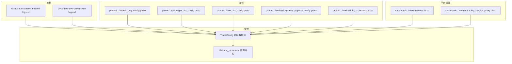
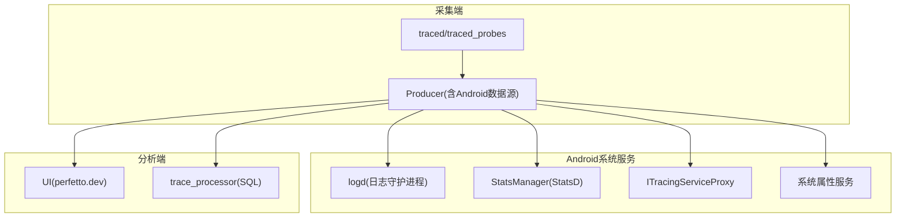
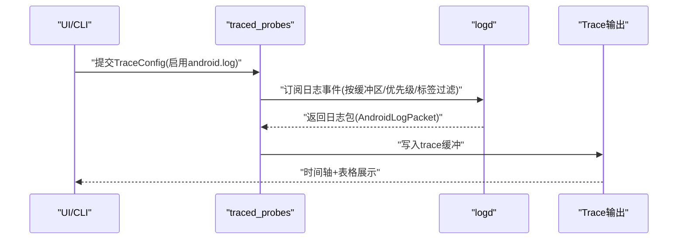
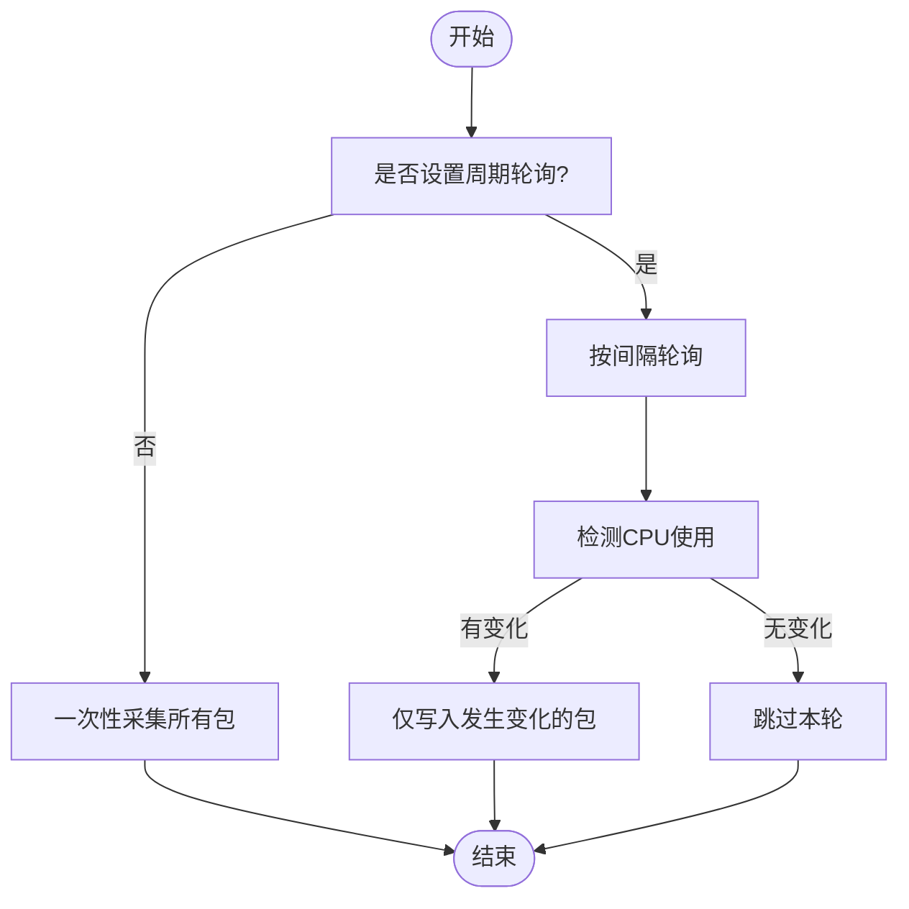
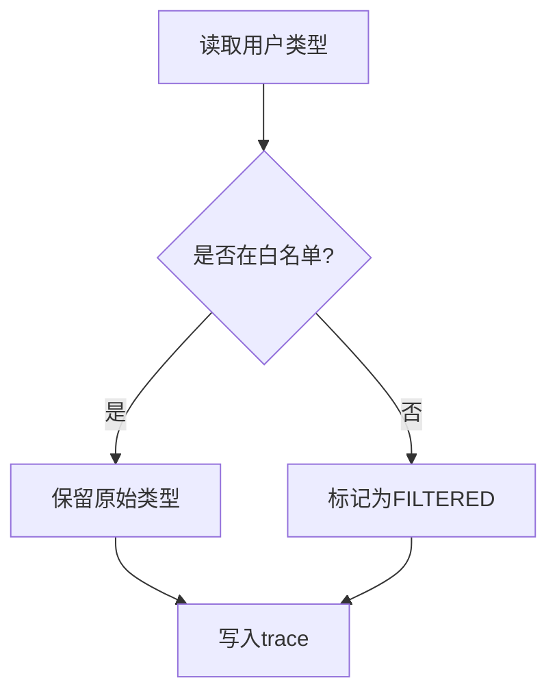
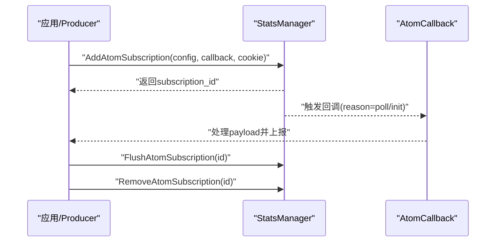
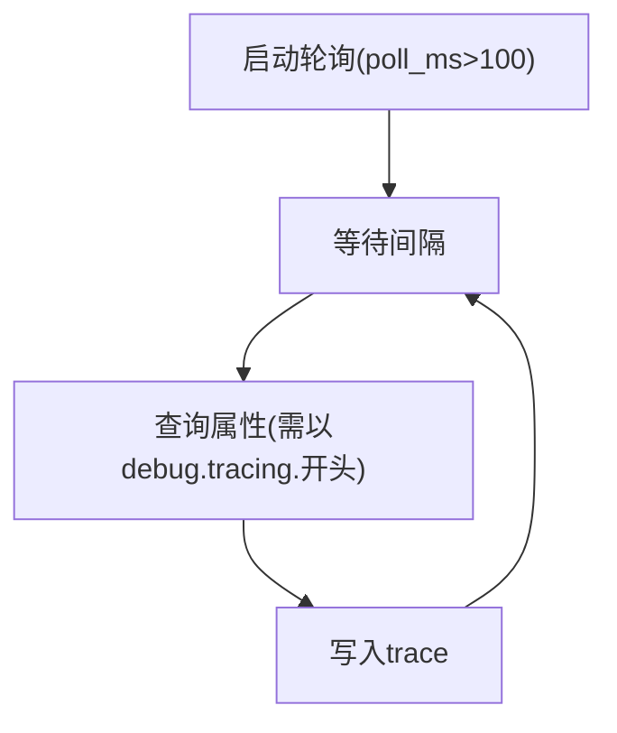
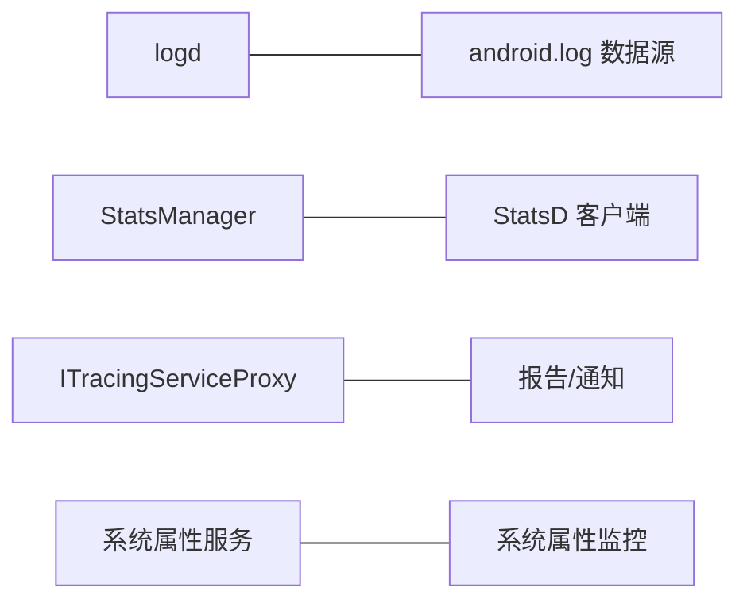
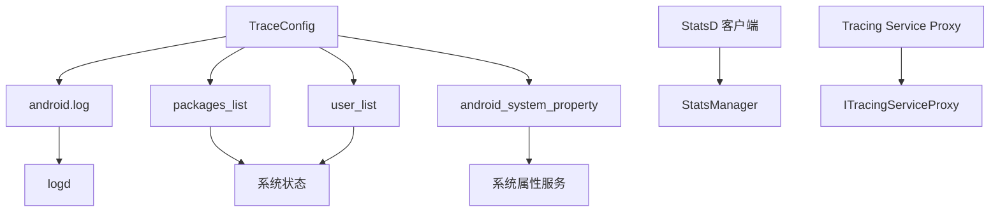

# Android特定探测器

<cite>
**本文引用的文件**
- [android-log.md](file://docs/data-sources/android-log.md)
- [system-log.md](file://docs/data-sources/system-log.md)
- [statsd.h](file://src/android_internal/statsd.h)
- [statsd.cc](file://src/android_internal/statsd.cc)
- [tracing_service_proxy.h](file://src/android_internal/tracing_service_proxy.h)
- [tracing_service_proxy.cc](file://src/android_internal/tracing_service_proxy.cc)
- [packages_list_config.proto](file://protos/perfetto/config/android/packages_list_config.proto)
- [user_list_config.proto](file://protos/perfetto/config/android/user_list_config.proto)
- [android_system_property_config.proto](file://protos/perfetto/config/android/android_system_property_config.proto)
- [android_log_constants.proto](file://protos/perfetto/common/android_log_constants.proto)
</cite>

## 目录
1. [简介](#简介)
2. [项目结构](#项目结构)
3. [核心组件](#核心组件)
4. [架构总览](#架构总览)
5. [详细组件分析](#详细组件分析)
6. [依赖关系分析](#依赖关系分析)
7. [性能考量](#性能考量)
8. [故障排查指南](#故障排查指南)
9. [结论](#结论)
10. [附录](#附录)

## 简介
本技术文档聚焦于Perfetto在Android平台上的专用探测器与数据源，涵盖以下Android特有能力：
- Android日志探测器：从logd采集日志事件，支持文本与二进制EventLog，并可按优先级、标签与日志缓冲区过滤。
- 包列表监控：周期性或一次性采集已安装应用包信息（版本、签名等），支持按包名白名单/正则筛选。
- 用户列表跟踪：采集设备用户类型信息，支持用户类型白名单过滤以满足隐私需求。
- StatsD客户端：通过StatsManager订阅原子事件（Atoms），实现系统侧统计指标的实时采集。
- 系统属性监控：周期轮询特定系统属性值，用于追踪调试开关与运行时参数变化。

上述探测器与Android系统服务紧密集成，既可用于应用性能分析，也可用于系统稳定性与资源占用评估。文档同时给出配置要点、权限与兼容性注意事项，以及对系统性能影响的评估建议。

## 项目结构
围绕Android特定探测器，相关代码与文档分布如下：
- 文档层：位于docs/data-sources，包含Android日志与系统日志的数据源说明。
- 协议层：位于protos/perfetto/config/android与protos/perfetto/common，定义各数据源的配置消息与常量。
- 平台适配层：位于src/android_internal，封装与Android系统服务交互的接口（如StatsD、Tracing Service Proxy）。
- 集成与使用：通过TraceConfig在采集端启用相应数据源；在UI或trace_processor中查询与分析。

图示来源
- [android-log.md:1-76](file://docs/data-sources/android-log.md#L1-L76)
- [system-log.md:1-94](file://docs/data-sources/system-log.md#L1-L94)
- [packages_list_config.proto:1-43](file://protos/perfetto/config/android/packages_list_config.proto#L1-L43)
- [user_list_config.proto:1-54](file://protos/perfetto/config/android/user_list_config.proto#L1-L54)
- [android_system_property_config.proto:1-31](file://protos/perfetto/config/android/android_system_property_config.proto#L1-L31)
- [android_log_constants.proto:1-48](file://protos/perfetto/common/android_log_constants.proto#L1-L48)
- [statsd.h:1-64](file://src/android_internal/statsd.h#L1-L64)
- [statsd.cc:1-50](file://src/android_internal/statsd.cc#L1-L50)
- [tracing_service_proxy.h:1-43](file://src/android_internal/tracing_service_proxy.h#L1-L43)
- [tracing_service_proxy.cc:1-86](file://src/android_internal/tracing_service_proxy.cc#L1-L86)

章节来源
- [android-log.md:1-76](file://docs/data-sources/android-log.md#L1-L76)
- [system-log.md:1-94](file://docs/data-sources/system-log.md#L1-L94)

## 核心组件
- Android日志数据源：支持多日志缓冲区、优先级与标签过滤，适合长时录制与跨事件时间对齐。
- 包列表数据源：支持一次性全量采集与周期性CPU使用驱动的增量采集，便于定位高耗CPU包。
- 用户列表数据源：支持用户类型白名单过滤，满足隐私合规场景。
- StatsD客户端：通过StatsManager订阅原子事件，回调处理订阅生命周期与刷新。
- 系统属性监控：限定轮询频率与属性前缀，避免高频轮询带来的性能开销。

章节来源
- [android-log.md:17-76](file://docs/data-sources/android-log.md#L17-L76)
- [packages_list_config.proto:21-43](file://protos/perfetto/config/android/packages_list_config.proto#L21-L43)
- [user_list_config.proto:21-54](file://protos/perfetto/config/android/user_list_config.proto#L21-L54)
- [android_system_property_config.proto:21-31](file://protos/perfetto/config/android/android_system_property_config.proto#L21-L31)
- [android_log_constants.proto:21-48](file://protos/perfetto/common/android_log_constants.proto#L21-L48)
- [statsd.h:32-61](file://src/android_internal/statsd.h#L32-L61)
- [statsd.cc:25-46](file://src/android_internal/statsd.cc#L25-L46)

## 架构总览
下图展示Android特定探测器与系统服务的交互路径，以及与采集端、UI/分析端的关系。

图示来源
- [tracing_service_proxy.cc:40-82](file://src/android_internal/tracing_service_proxy.cc#L40-L82)
- [statsd.cc:25-46](file://src/android_internal/statsd.cc#L25-L46)
- [android-log.md:1-15](file://docs/data-sources/android-log.md#L1-L15)

## 详细组件分析

### Android日志探测器
- 功能概述
  - 从logd采集日志事件，支持文本与EventLog二进制事件。
  - 支持按日志缓冲区（默认、系统、无线电、事件、崩溃、统计、安全、内核）与优先级过滤。
  - 可按标签白名单过滤，适用于长时录制与跨事件时间同步。
- 配置要点
  - 使用AndroidLogConfig指定最小优先级、标签过滤与日志缓冲区集合。
  - 在TraceConfig中声明数据源名称为“android.log”。
- 性能与兼容性
  - 仅在userdebug构建可用。
  - 长时录制不受logd环形缓冲限制，事件定期写入trace缓冲。
- 使用场景
  - 联动UI时间轴查看日志分布与严重级别。
  - SQL查询android_logs表进行筛选与聚合分析。

图示来源
- [android-log.md:48-76](file://docs/data-sources/android-log.md#L48-L76)
- [android_log_constants.proto:21-48](file://protos/perfetto/common/android_log_constants.proto#L21-L48)

章节来源
- [android-log.md:1-76](file://docs/data-sources/android-log.md#L1-L76)
- [android_log_constants.proto:21-48](file://protos/perfetto/common/android_log_constants.proto#L21-L48)

### 包列表监控
- 功能概述
  - 采集设备上已安装应用包信息（如版本代码等）。
  - 支持包名精确匹配白名单与正则白名单组合过滤。
  - 支持周期性轮询（毫秒级），仅在检测到CPU使用时才写入结果，降低开销。
- 配置要点
  - 使用PackagesListConfig设置包名过滤与only_write_on_cpu_use_every_ms。
- 使用场景
  - 定位高CPU占用包，结合CPU调度与系统事件分析根因。

图示来源
- [packages_list_config.proto:21-43](file://protos/perfetto/config/android/packages_list_config.proto#L21-L43)

章节来源
- [packages_list_config.proto:21-43](file://protos/perfetto/config/android/packages_list_config.proto#L21-L43)

### 用户列表跟踪
- 功能概述
  - 采集设备用户类型信息，支持用户类型白名单过滤，未命中者统一标记为“FILTERED”。
- 配置要点
  - 使用AndroidUserListConfig设置user_type_filter白名单。
- 使用场景
  - 合规场景下隐藏敏感用户类型细节，仅暴露必要类型。

图示来源
- [user_list_config.proto:21-54](file://protos/perfetto/config/android/user_list_config.proto#L21-L54)

章节来源
- [user_list_config.proto:21-54](file://protos/perfetto/config/android/user_list_config.proto#L21-L54)

### StatsD客户端
- 功能概述
  - 通过StatsManager订阅原子事件（Atoms），支持添加/移除/刷新订阅。
  - 回调通知订阅初始化、手动刷新与订阅结束等事件原因。
- 接口要点
  - AddAtomSubscription/RemoveAtomSubscription/FlushAtomSubscription。
  - 回调函数签名包含订阅ID、原因、负载与cookie。
- 使用场景
  - 实时采集系统侧统计指标，配合trace_processor进行趋势分析。

图示来源
- [statsd.h:32-61](file://src/android_internal/statsd.h#L32-L61)
- [statsd.cc:25-46](file://src/android_internal/statsd.cc#L25-L46)

章节来源
- [statsd.h:32-61](file://src/android_internal/statsd.h#L32-L61)
- [statsd.cc:25-46](file://src/android_internal/statsd.cc#L25-L46)

### 系统属性监控
- 功能概述
  - 周期轮询特定系统属性值，用于追踪调试开关与运行时参数变化。
- 配置要点
  - AndroidSystemPropertyConfig限定轮询间隔（>100ms）与属性名前缀（必须以“debug.tracing.”开头）。
- 使用场景
  - 追踪与性能相关的系统属性变化，辅助问题复现与回归分析。

图示来源
- [android_system_property_config.proto:21-31](file://protos/perfetto/config/android/android_system_property_config.proto#L21-L31)

章节来源
- [android_system_property_config.proto:21-31](file://protos/perfetto/config/android/android_system_property_config.proto#L21-L31)

### 与Android系统服务集成
- 日志：直接从logd获取事件，支持多缓冲区与优先级过滤。
- StatsD：通过StatsManager订阅原子事件，需要Binder线程池支持。
- Tracing Service Proxy：向系统服务上报trace或通知会话结束，便于框架级集成。
- 系统属性：通过系统属性服务轮询指定属性值。

图示来源
- [tracing_service_proxy.cc:40-82](file://src/android_internal/tracing_service_proxy.cc#L40-L82)
- [statsd.cc:25-46](file://src/android_internal/statsd.cc#L25-L46)

章节来源
- [tracing_service_proxy.h:25-38](file://src/android_internal/tracing_service_proxy.h#L25-L38)
- [tracing_service_proxy.cc:40-82](file://src/android_internal/tracing_service_proxy.cc#L40-L82)
- [statsd.h:32-61](file://src/android_internal/statsd.h#L32-L61)
- [statsd.cc:25-46](file://src/android_internal/statsd.cc#L25-L46)

## 依赖关系分析
- 组件耦合
  - Android日志数据源依赖logd与TraceConfig中的AndroidLogConfig。
  - 包列表与用户列表数据源依赖TraceConfig中的对应配置消息。
  - StatsD客户端依赖StatsManager与回调机制。
  - 系统属性监控依赖系统属性服务与轮询策略。
- 外部依赖
  - Android Binder与StatsD接口用于与系统服务通信。
  - UI与trace_processor用于可视化与SQL查询分析。

图示来源
- [android-log.md:48-76](file://docs/data-sources/android-log.md#L48-L76)
- [packages_list_config.proto:21-43](file://protos/perfetto/config/android/packages_list_config.proto#L21-L43)
- [user_list_config.proto:21-54](file://protos/perfetto/config/android/user_list_config.proto#L21-L54)
- [android_system_property_config.proto:21-31](file://protos/perfetto/config/android/android_system_property_config.proto#L21-L31)
- [statsd.h:32-61](file://src/android_internal/statsd.h#L32-L61)
- [tracing_service_proxy.h:25-38](file://src/android_internal/tracing_service_proxy.h#L25-L38)

章节来源
- [android-log.md:48-76](file://docs/data-sources/android-log.md#L48-L76)
- [packages_list_config.proto:21-43](file://protos/perfetto/config/android/packages_list_config.proto#L21-L43)
- [user_list_config.proto:21-54](file://protos/perfetto/config/android/user_list_config.proto#L21-L54)
- [android_system_property_config.proto:21-31](file://protos/perfetto/config/android/android_system_property_config.proto#L21-L31)
- [statsd.h:32-61](file://src/android_internal/statsd.h#L32-L61)
- [tracing_service_proxy.h:25-38](file://src/android_internal/tracing_service_proxy.h#L25-L38)

## 性能考量
- Android日志
  - 长时录制不受logd缓冲限制，但大量事件可能增加trace体积与解析成本。
  - 按缓冲区、优先级与标签过滤可显著降低带宽与存储压力。
- 包列表
  - 使用only_write_on_cpu_use_every_ms可减少无效写入，避免频繁扫描。
- StatsD
  - 订阅回调需注意线程模型与处理开销，避免阻塞Binder线程。
- 系统属性
  - 轮询间隔需>100ms，避免过度唤醒CPU与I/O。
- UI/分析端
  - 大型trace建议分段分析与索引优化，避免内存峰值过高。

## 故障排查指南
- 权限与兼容性
  - Android日志数据源仅在userdebug构建可用，release构建可能不可用。
  - StatsD订阅需确保目标属性名符合前缀要求，且轮询间隔满足最小阈值。
- 常见问题
  - 无法看到日志：检查TraceConfig中是否正确启用“android.log”，并确认缓冲区与优先级设置。
  - 包列表为空：确认包名过滤条件是否过于严格，或轮询间隔是否过大导致未触发。
  - 用户类型全部显示为FILTERED：检查user_type_filter白名单是否覆盖实际类型。
  - StatsD回调未触发：确认回调注册成功、订阅ID有效，以及StatsManager可用。
- 调试建议
  - 使用UI时间轴快速定位异常时间段的日志与事件。
  - 通过SQL查询android_logs与相关表进行交叉验证。
  - 逐步缩小配置范围（如先禁用过滤，再逐项启用）以定位问题。

章节来源
- [android-log.md:3-15](file://docs/data-sources/android-log.md#L3-L15)
- [android_system_property_config.proto:23-31](file://protos/perfetto/config/android/android_system_property_config.proto#L23-L31)
- [user_list_config.proto:21-54](file://protos/perfetto/config/android/user_list_config.proto#L21-L54)
- [statsd.cc:25-46](file://src/android_internal/statsd.cc#L25-L46)

## 结论
Perfetto在Android平台提供了完善的专用探测器与数据源，覆盖日志、包与用户信息、系统属性及StatsD原子事件等关键领域。通过合理的配置与过滤策略，可在保证分析价值的同时控制采集开销。与Android系统服务的深度集成使得这些探测器既能满足日常性能分析，也能支撑复杂场景下的稳定性与合规性需求。

## 附录
- 配置参考
  - Android日志：参见TraceConfig中的AndroidLogConfig与日志缓冲区枚举。
  - 包列表：参见PackagesListConfig的消息字段。
  - 用户列表：参见AndroidUserListConfig的消息字段。
  - 系统属性：参见AndroidSystemPropertyConfig的消息字段。
- 相关协议
  - Android日志常量：参见AndroidLogId与AndroidLogPriority枚举。

章节来源
- [android_log_constants.proto:21-48](file://protos/perfetto/common/android_log_constants.proto#L21-L48)
- [packages_list_config.proto:21-43](file://protos/perfetto/config/android/packages_list_config.proto#L21-L43)
- [user_list_config.proto:21-54](file://protos/perfetto/config/android/user_list_config.proto#L21-L54)
- [android_system_property_config.proto:21-31](file://protos/perfetto/config/android/android_system_property_config.proto#L21-L31)