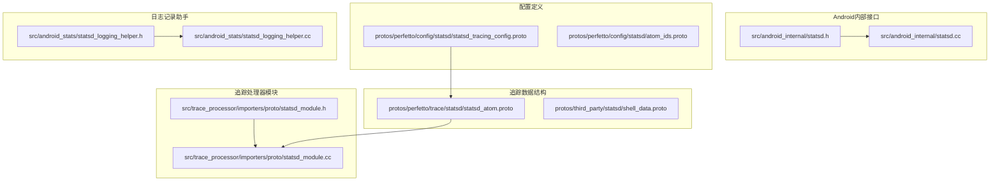
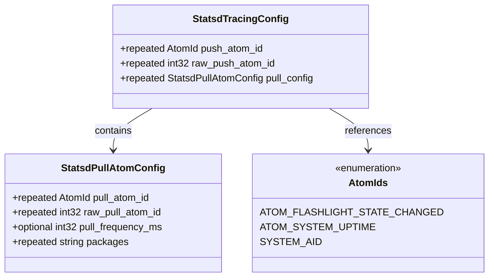
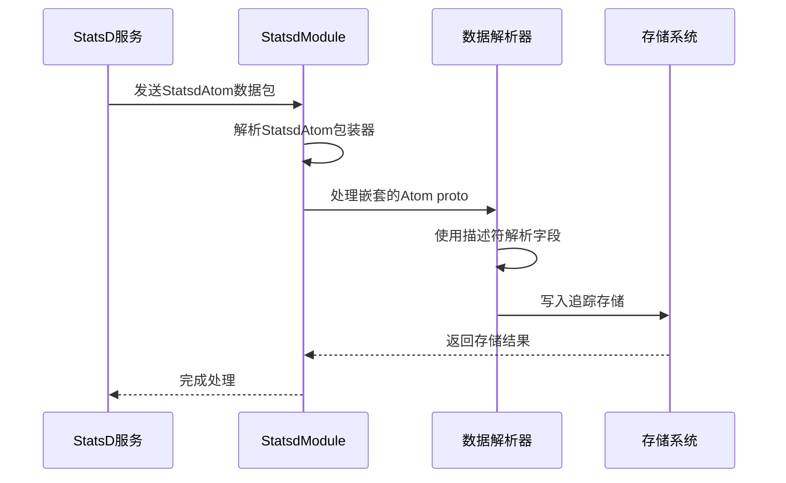
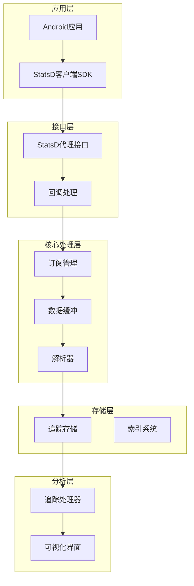
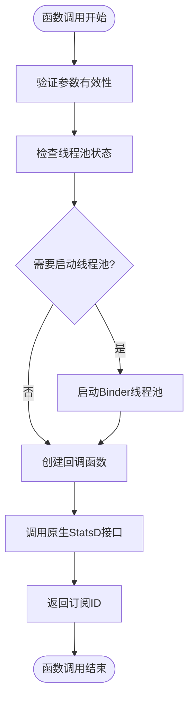
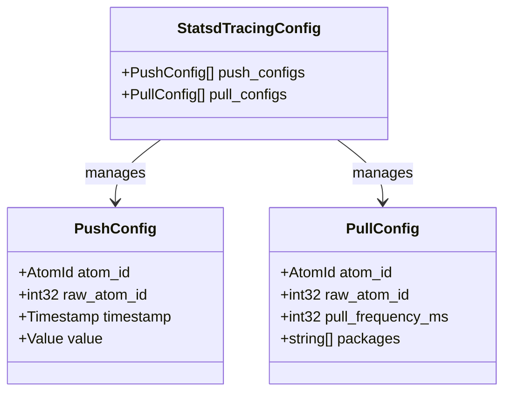
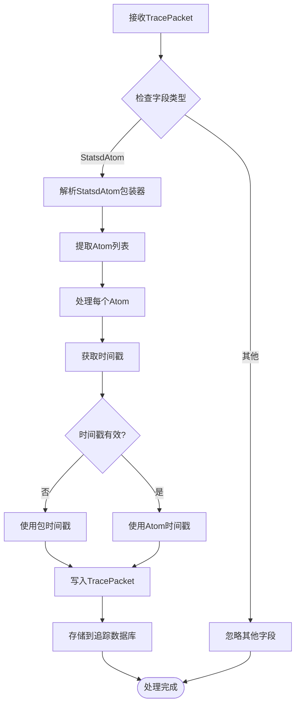
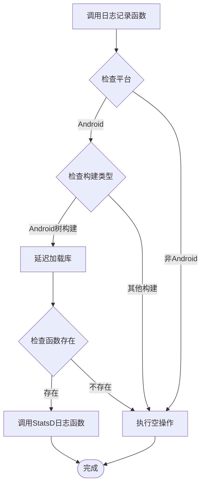
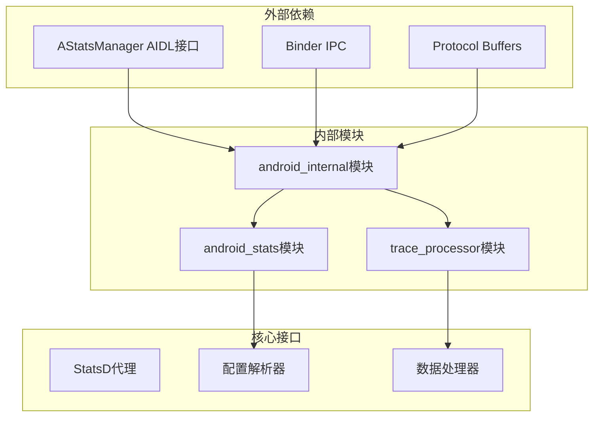

# StatsD客户端探测器

<cite>
**本文档引用的文件**
- [statsd.h](file://src/android_internal/statsd.h)
- [statsd.cc](file://src/android_internal/statsd.cc)
- [statsd_tracing_config.proto](file://protos/perfetto/config/statsd/statsd_tracing_config.proto)
- [statsd_atom.proto](file://protos/perfetto/trace/statsd/statsd_atom.proto)
- [statsd_logging_helper.h](file://src/android_stats/statsd_logging_helper.h)
- [statsd_logging_helper.cc](file://src/android_stats/statsd_logging_helper.cc)
- [statsd_module.h](file://src/trace_processor/importers/proto/statsd_module.h)
- [statsd_module.cc](file://src/trace_processor/importers/proto/statsd_module.cc)
- [statsd.cfg](file://test/configs/statsd.cfg)
</cite>

## 目录
1. [简介](#简介)
2. [项目结构](#项目结构)
3. [核心组件](#核心组件)
4. [架构概览](#架构概览)
5. [详细组件分析](#详细组件分析)
6. [依赖关系分析](#依赖关系分析)
7. [性能考虑](#性能考虑)
8. [故障排除指南](#故障排除指南)
9. [结论](#结论)

## 简介

StatsD客户端探测器是Perfetto框架中的一个关键组件，专门用于在Android平台上捕获和分析StatsD指标数据。该实现提供了完整的StatsD协议支持，包括计数器、定时器和Gauge指标的收集、处理和可视化。

在Android系统中，StatsD是一个重要的监控和指标收集框架，用于收集系统级和应用级的性能指标。Perfetto通过其StatsD客户端探测器实现了对这些指标的实时捕获和分析，为开发者提供了强大的性能监控能力。

## 项目结构

StatsD客户端探测器的实现分布在多个关键目录中：

**图表来源**
- [statsd.h:1-64](file://src/android_internal/statsd.h#L1-L64)
- [statsd.cc:1-50](file://src/android_internal/statsd.cc#L1-L50)
- [statsd_tracing_config.proto:1-45](file://protos/perfetto/config/statsd/statsd_tracing_config.proto#L1-L45)
- [statsd_atom.proto:1-36](file://protos/perfetto/trace/statsd/statsd_atom.proto#L1-L36)

**章节来源**
- [statsd.h:1-64](file://src/android_internal/statsd.h#L1-L64)
- [statsd.cc:1-50](file://src/android_internal/statsd.cc#L1-L50)
- [statsd_tracing_config.proto:1-45](file://protos/perfetto/config/statsd/statsd_tracing_config.proto#L1-L45)
- [statsd_atom.proto:1-36](file://protos/perfetto/trace/statsd/statsd_atom.proto#L1-L36)

## 核心组件

### Android内部StatsD接口

StatsD客户端探测器的核心是Android内部的StatsD接口，它提供了与Android StatsD服务通信的能力。

主要功能包括：
- 订阅StatsD原子事件
- 管理订阅生命周期
- 处理异步回调机制
- 支持批量数据传输

### 配置管理系统

配置系统基于Protocol Buffers定义，支持灵活的StatsD指标收集配置：

**图表来源**
- [statsd_tracing_config.proto:28-44](file://protos/perfetto/config/statsd/statsd_tracing_config.proto#L28-L44)

### 追踪数据处理模块

追踪处理器模块负责解析和处理从StatsD收集的数据：

**图表来源**
- [statsd_module.cc:128-178](file://src/trace_processor/importers/proto/statsd_module.cc#L128-L178)

**章节来源**
- [statsd_tracing_config.proto:28-44](file://protos/perfetto/config/statsd/statsd_tracing_config.proto#L28-L44)
- [statsd_module.cc:110-124](file://src/trace_processor/importers/proto/statsd_module.cc#L110-L124)

## 架构概览

StatsD客户端探测器采用分层架构设计，确保了良好的模块化和可扩展性：

**图表来源**
- [statsd.h:32-56](file://src/android_internal/statsd.h#L32-L56)
- [statsd_module.cc:37-65](file://src/trace_processor/importers/proto/statsd_module.cc#L37-L65)

## 详细组件分析

### Android内部StatsD接口实现

Android内部StatsD接口提供了与Android StatsD服务的直接通信能力：

#### 关键接口函数

**图表来源**
- [statsd.cc:25-38](file://src/android_internal/statsd.cc#L25-L38)

#### 回调机制设计

回调机制是StatsD接口的核心特性，支持异步事件通知：

| 回调原因 | 值 | 描述 |
|---------|----|------|
| StatsD初始化 | 1 | StatsD服务初始化完成 |
| 刷新请求 | 2 | 请求刷新当前数据 |
| 订阅结束 | 3 | 订阅生命周期结束 |

**章节来源**
- [statsd.h:36-56](file://src/android_internal/statsd.h#L36-L56)
- [statsd.cc:25-46](file://src/android_internal/statsd.cc#L25-L46)

### 配置系统详解

配置系统基于Protocol Buffers定义，提供了灵活的StatsD指标收集策略：

#### 推送配置

推送配置允许应用程序主动向StatsD服务发送指标数据：

**图表来源**
- [statsd_tracing_config.proto:28-44](file://protos/perfetto/config/statsd/statsd_tracing_config.proto#L28-L44)

#### 拉取配置

拉取配置支持定期从StatsD服务获取指标数据：

**章节来源**
- [statsd_tracing_config.proto:38-44](file://protos/perfetto/config/statsd/statsd_tracing_config.proto#L38-L44)

### 追踪数据处理流程

追踪处理器模块负责将原始StatsD数据转换为可分析的追踪格式：

#### 数据解析算法

**图表来源**
- [statsd_module.cc:128-162](file://src/trace_processor/importers/proto/statsd_module.cc#L128-L162)

#### 描述符解析机制

描述符解析机制支持动态解析未知的Atom类型：

**章节来源**
- [statsd_module.cc:180-224](file://src/trace_processor/importers/proto/statsd_module.cc#L180-L224)

### 日志记录助手

日志记录助手提供了与Android构建系统的集成能力：

#### 条件编译机制

日志记录功能仅在特定环境下启用：

**图表来源**
- [statsd_logging_helper.cc:38-58](file://src/android_stats/statsd_logging_helper.cc#L38-L58)

**章节来源**
- [statsd_logging_helper.h:30-43](file://src/android_stats/statsd_logging_helper.h#L30-L43)
- [statsd_logging_helper.cc:41-58](file://src/android_stats/statsd_logging_helper.cc#L41-L58)

## 依赖关系分析

StatsD客户端探测器的依赖关系展现了清晰的分层架构：

**图表来源**
- [statsd.cc:19-37](file://src/android_internal/statsd.cc#L19-L37)
- [statsd_module.cc:34-49](file://src/trace_processor/importers/proto/statsd_module.cc#L34-L49)

**章节来源**
- [statsd.cc:19-37](file://src/android_internal/statsd.cc#L19-L37)
- [statsd_module.cc:34-49](file://src/trace_processor/importers/proto/statsd_module.cc#L34-L49)

## 性能考虑

### 内存管理优化

StatsD客户端探测器采用了多种内存管理策略来优化性能：

1. **零拷贝设计**：在可能的情况下避免不必要的数据复制
2. **缓冲区复用**：重用内存缓冲区减少分配开销
3. **延迟加载**：按需加载库和资源

### 线程安全设计

接口设计确保了多线程环境下的安全性：

- 所有公共接口都是线程安全的
- 使用原子操作保证状态一致性
- 避免死锁的设计模式

### 批量处理策略

为了提高效率，系统实现了智能的批量处理机制：

- 自动批处理小数据包
- 动态调整批处理大小
- 异步处理以避免阻塞主线程

## 故障排除指南

### 常见问题诊断

#### 订阅失败问题

当订阅StatsD事件失败时，可以检查以下方面：

1. **权限问题**：确认应用具有访问StatsD服务的权限
2. **服务可用性**：验证StatsD服务是否正常运行
3. **配置错误**：检查配置文件中的Atom ID是否正确

#### 数据丢失问题

如果发现数据丢失，应该：

1. **检查缓冲区设置**：确认缓冲区大小足够大
2. **验证时间戳**：确保时间戳同步正确
3. **监控网络连接**：检查设备与StatsD服务的连接状态

#### 性能问题排查

性能问题的常见原因：

1. **过度订阅**：避免订阅过多的Atom类型
2. **频繁刷新**：合理设置刷新频率
3. **内存泄漏**：定期检查内存使用情况

**章节来源**
- [statsd_module.cc:145-147](file://src/trace_processor/importers/proto/statsd_module.cc#L145-L147)
- [statsd_logging_helper.cc:38-66](file://src/android_stats/statsd_logging_helper.cc#L38-L66)

## 结论

StatsD客户端探测器为Android平台提供了强大而灵活的指标收集和分析能力。通过其精心设计的架构，该实现不仅满足了高性能的要求，还保持了良好的可维护性和扩展性。

### 主要优势

1. **完整的协议支持**：实现了标准的StatsD协议规范
2. **高效的性能表现**：优化的内存管理和批量处理机制
3. **灵活的配置选项**：支持复杂的订阅和拉取策略
4. **强大的分析能力**：集成了完整的追踪和可视化工具链

### 应用场景

该组件特别适用于：
- 系统性能监控
- 应用性能分析
- 用户行为统计
- 业务指标跟踪

通过与其他Perfetto组件的无缝集成，StatsD客户端探测器为Android开发者提供了一个完整的性能监控解决方案。