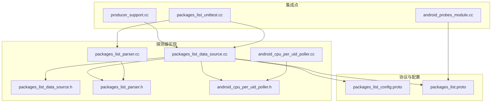
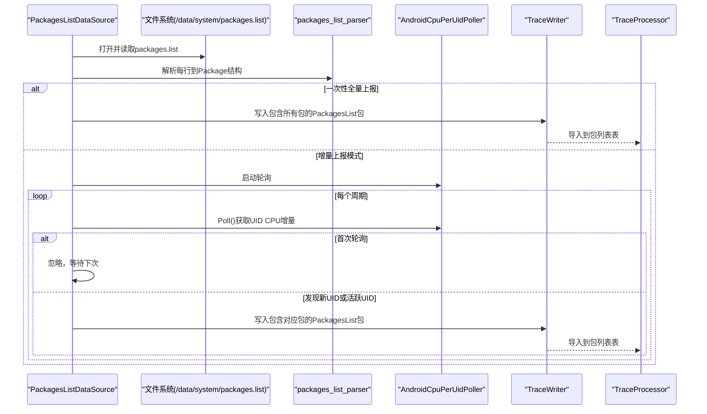
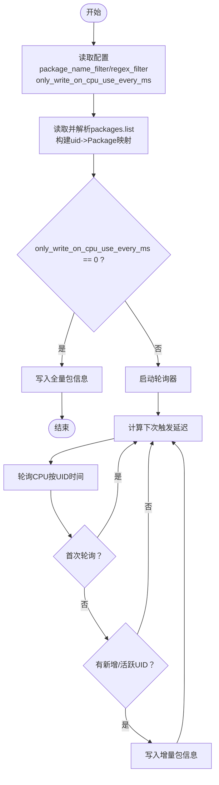
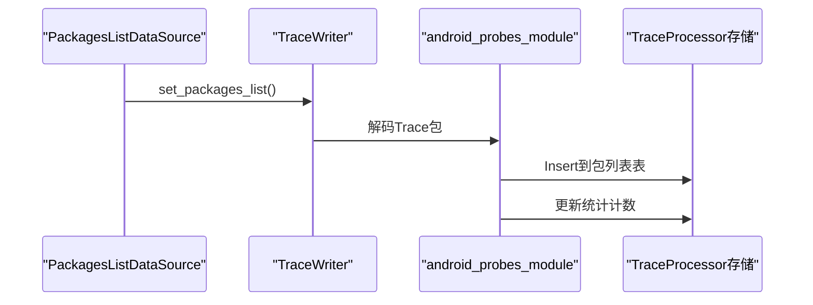
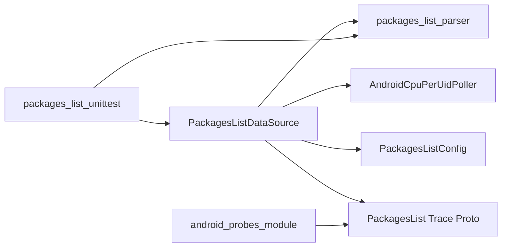

# 包列表探测器

<cite>
**本文引用的文件**
- [packages_list_data_source.cc](file://src/traced/probes/packages_list/packages_list_data_source.cc)
- [packages_list_data_source.h](file://src/traced/probes/packages_list/packages_list_data_source.h)
- [packages_list_parser.cc](file://src/traced/probes/packages_list/packages_list_parser.cc)
- [packages_list_parser.h](file://src/traced/probes/packages_list/packages_list_parser.h)
- [packages_list_config.proto](file://protos/perfetto/config/android/packages_list_config.proto)
- [packages_list.proto](file://protos/perfetto/trace/android/packages_list.proto)
- [android_cpu_per_uid_poller.h](file://src/traced/probes/common/android_cpu_per_uid_poller.h)
- [android_cpu_per_uid_poller.cc](file://src/traced/probes/common/android_cpu_per_uid_poller.cc)
- [android_probes_module.cc](file://src/trace_processor/importers/proto/android_probes_module.cc)
- [producer_support.cc](file://src/profiling/common/producer_support.cc)
- [packages_list_unittest.cc](file://src/traced/probes/packages_list/packages_list_unittest.cc)
</cite>

## 目录
1. [简介](#简介)
2. [项目结构](#项目结构)
3. [核心组件](#核心组件)
4. [架构总览](#架构总览)
5. [详细组件分析](#详细组件分析)
6. [依赖关系分析](#依赖关系分析)
7. [性能考量](#性能考量)
8. [故障排查指南](#故障排查指南)
9. [结论](#结论)
10. [附录](#附录)

## 简介
本技术文档面向“包列表探测器”，系统性阐述其在Android系统中对应用程序包信息的监控与采集机制。该探测器负责：
- 捕获系统/packages.list文件中的包元数据（如包名、UID、调试标志、可被shell分析标志、版本号等）
- 支持两种工作模式：启动时一次性全量上报，或基于CPU使用率轮询的增量上报
- 提供过滤能力（精确包名与正则匹配）
- 将包信息写入Trace数据包，并由Trace处理器导入到数据库表中，便于后续SQL查询与分析

此外，文档还解释包信息的数据结构与字段含义、触发机制与更新频率设置、以及在应用性能分析中的典型应用场景与分析方法。

## 项目结构
包列表探测器位于traced/probes/packages_list目录下，核心文件如下：
- 数据源实现：packages_list_data_source.{h,cc}
- 解析器：packages_list_parser.{h,cc}
- 配置与Trace协议：packages_list_config.proto、packages_list.proto
- CPU按UID轮询器：android_cpu_per_uid_poller.{h,cc}
- Trace导入模块：android_probes_module.cc
- 生产者侧支持：producer_support.cc
- 单元测试：packages_list_unittest.cc

**图表来源**
- [packages_list_data_source.cc:103-133](file://src/traced/probes/packages_list/packages_list_data_source.cc#L103-L133)
- [packages_list_parser.cc:26-92](file://src/traced/probes/packages_list/packages_list_parser.cc#L26-L92)
- [android_cpu_per_uid_poller.cc:72-124](file://src/traced/probes/common/android_cpu_per_uid_poller.cc#L72-L124)
- [packages_list_config.proto:23-42](file://protos/perfetto/config/android/packages_list_config.proto#L23-L42)
- [packages_list.proto:20-36](file://protos/perfetto/trace/android/packages_list.proto#L20-L36)
- [android_probes_module.cc:89-315](file://src/trace_processor/importers/proto/android_probes_module.cc#L89-L315)
- [producer_support.cc:25-169](file://src/profiling/common/producer_support.cc#L25-L169)

**章节来源**
- [packages_list_data_source.cc:103-133](file://src/traced/probes/packages_list/packages_list_data_source.cc#L103-L133)
- [packages_list_parser.cc:26-92](file://src/traced/probes/packages_list/packages_list_parser.cc#L26-L92)
- [android_cpu_per_uid_poller.cc:72-124](file://src/traced/probes/common/android_cpu_per_uid_poller.cc#L72-L124)
- [packages_list_config.proto:23-42](file://protos/perfetto/config/android/packages_list_config.proto#L23-L42)
- [packages_list.proto:20-36](file://protos/perfetto/trace/android/packages_list.proto#L20-L36)
- [android_probes_module.cc:89-315](file://src/trace_processor/importers/proto/android_probes_module.cc#L89-L315)
- [producer_support.cc:25-169](file://src/profiling/common/producer_support.cc#L25-L169)

## 核心组件
- 包列表数据源（PackagesListDataSource）：负责解析/packages.list、根据配置决定一次性全量上报或按周期增量上报；在增量模式下通过CPU按UID轮询器识别活跃UID并仅上报对应包信息。
- 包解析器（packages_list_parser）：逐行解析packages.list文本格式，填充Package结构体。
- CPU按UID轮询器（AndroidCpuPerUidPoller）：周期性读取各UID的CPU时间增量，用于触发增量上报。
- Trace协议与配置：PackagesListConfig定义过滤与上报策略；PackagesList协议定义Trace包中的包信息字段。
- Trace导入模块：将Trace包中的包信息导入到TraceProcessor存储表中，供SQL查询使用。
- 生产者侧支持：在生产者侧读取packages.list并进行解析，辅助heapprofd等工具判断可分析性。

**章节来源**
- [packages_list_data_source.h:48-87](file://src/traced/probes/packages_list/packages_list_data_source.h#L48-L87)
- [packages_list_parser.h:25-33](file://src/traced/probes/packages_list/packages_list_parser.h#L25-L33)
- [android_cpu_per_uid_poller.h:34-51](file://src/traced/probes/common/android_cpu_per_uid_poller.h#L34-L51)
- [packages_list_config.proto:23-42](file://protos/perfetto/config/android/packages_list_config.proto#L23-L42)
- [packages_list.proto:20-36](file://protos/perfetto/trace/android/packages_list.proto#L20-L36)
- [android_probes_module.cc:89-315](file://src/trace_processor/importers/proto/android_probes_module.cc#L89-L315)
- [producer_support.cc:25-169](file://src/profiling/common/producer_support.cc#L25-L169)

## 架构总览
包列表探测器的运行流程分为“启动初始化”和“周期性增量上报”两部分。初始化阶段会读取/packages.list并根据过滤条件构建包映射；随后根据配置选择全量上报或进入轮询模式。轮询模式下，探测器依据CPU使用率变化触发增量上报，避免频繁写入。

**图表来源**
- [packages_list_data_source.cc:135-188](file://src/traced/probes/packages_list/packages_list_data_source.cc#L135-L188)
- [packages_list_parser.cc:26-92](file://src/traced/probes/packages_list/packages_list_parser.cc#L26-L92)
- [android_cpu_per_uid_poller.cc:72-124](file://src/traced/probes/common/android_cpu_per_uid_poller.cc#L72-L124)
- [android_probes_module.cc:89-315](file://src/trace_processor/importers//proto/android_probes_module.cc#L89-L315)

## 详细组件分析

### 数据结构与字段含义
- Package结构体包含以下字段：
  - name：包名（字符串）
  - uid：用户ID（无符号整数）
  - debuggable：是否允许调试（布尔）
  - profileable_from_shell：是否允许shell进行性能分析（布尔）
  - version_code：版本号（整数）
  - profileable：是否可被性能分析工具分析（布尔）
  - installed_by：安装者（字符串）

这些字段来源于packages.list的解析逻辑，其中部分字段在解析过程中被显式转换为布尔或整数类型。

**章节来源**
- [packages_list_parser.h:25-33](file://src/traced/probes/packages_list/packages_list_parser.h#L25-L33)
- [packages_list_parser.cc:26-92](file://src/traced/probes/packages_list/packages_list_parser.cc#L26-L92)

### 触发机制与更新频率
- 配置项：
  - package_name_filter：精确包名过滤列表
  - package_name_regex_filter：正则过滤列表
  - only_write_on_cpu_use_every_ms：仅在检测到CPU使用时才上报的周期（毫秒），为0表示一次性全量上报
- 启动行为：
  - 初始化时读取并解析packages.list，构建uid到Package的多映射
  - 若only_write_on_cpu_use_every_ms为0，则立即写入一次全量包信息
  - 否则启动轮询器，按周期计算下次触发延迟
- 轮询与增量上报：
  - Poll()返回每个UID的CPU时间增量
  - 首次轮询忽略，避免冷启动时的全量历史数据
  - 对于新增UID或存在CPU增量的UID，提取其对应的包信息并写入Trace包

**图表来源**
- [packages_list_data_source.cc:113-188](file://src/traced/probes/packages_list/packages_list_data_source.cc#L113-L188)
- [android_cpu_per_uid_poller.cc:72-124](file://src/traced/probes/common/android_cpu_per_uid_poller.cc#L72-L124)

**章节来源**
- [packages_list_config.proto:23-42](file://protos/perfetto/config/android/packages_list_config.proto#L23-L42)
- [packages_list_data_source.cc:113-188](file://src/traced/probes/packages_list/packages_list_data_source.cc#L113-L188)
- [android_cpu_per_uid_poller.cc:72-124](file://src/traced/probes/common/android_cpu_per_uid_poller.cc#L72-L124)

### Trace导入与存储
- Trace包结构：PackagesList包含多个PackageInfo，以及可选的解析错误与读取错误标记
- Trace导入：android_probes_module在解析到packages_list包时，将其插入到包列表表中，并维护统计计数
- SQL查询：导入后可通过SQL对包信息进行筛选、聚合与关联分析

**图表来源**
- [packages_list.proto:20-36](file://protos/perfetto/trace/android/packages_list.proto#L20-L36)
- [android_probes_module.cc:89-315](file://src/trace_processor/importers/protobuf/android_probes_module.cc#L89-L315)

**章节来源**
- [packages_list.proto:20-36](file://protos/perfetto/trace/android/packages_list.proto#L20-L36)
- [android_probes_module.cc:89-315](file://src/trace_processor/importers/protobuf/android_probes_module.cc#L89-L315)

### 过滤机制
- 精确包名过滤：在解析前构建集合，仅保留匹配的包
- 正则过滤：预编译正则表达式，对包名执行全匹配
- 组合策略：两者可同时启用，满足任一条件即保留

**章节来源**
- [packages_list_data_source.cc:63-101](file://src/traced/probes/packages_list/packages_list_data_source.cc#L63-L101)
- [packages_list_unittest.cc:85-230](file://src/traced/probes/packages_list/packages_list_unittest.cc#L85-L230)

### 生产者侧支持
- 生产者在客户端侧读取packages.list并解析，用于判断应用是否可被性能分析（例如heapprofd）
- 支持查找指定UID对应的包信息，以及判断是否可被可信发起方分析

**章节来源**
- [producer_support.cc:25-169](file://src/profiling/common/producer_support.cc#L25-L169)

## 依赖关系分析
- PackagesListDataSource依赖：
  - packages_list_parser：解析packages.list
  - AndroidCpuPerUidPoller：轮询CPU使用情况
  - TraceWriter：写入Trace包
  - 配置解析：PackagesListConfig
- Trace导入依赖：
  - android_probes_module：解析并导入包信息
  - packages_list.proto：定义Trace包结构
- 测试依赖：
  - packages_list_unittest：验证解析与过滤逻辑

**图表来源**
- [packages_list_data_source.cc:103-133](file://src/traced/probes/packages_list/packages_list_data_source.cc#L103-L133)
- [packages_list_parser.cc:26-92](file://src/traced/probes/packages_list/packages_list_parser.cc#L26-L92)
- [android_cpu_per_uid_poller.cc:72-124](file://src/traced/probes/common/android_cpu_per_uid_poller.cc#L72-L124)
- [packages_list_config.proto:23-42](file://protos/perfetto/config/android/packages_list_config.proto#L23-L42)
- [packages_list.proto:20-36](file://protos/perfetto/trace/android/packages_list.proto#L20-L36)
- [android_probes_module.cc:89-315](file://src/trace_processor/importers/protobuf/android_probes_module.cc#L89-L315)
- [packages_list_unittest.cc:85-230](file://src/traced/probes/packages_list/packages_list_unittest.cc#L85-L230)

**章节来源**
- [packages_list_data_source.cc:103-133](file://src/traced/probes/packages_list/packages_list_data_source.cc#L103-L133)
- [packages_list_parser.cc:26-92](file://src/traced/probes/packages_list/packages_list_parser.cc#L26-L92)
- [android_cpu_per_uid_poller.cc:72-124](file://src/traced/probes/common/android_cpu_per_uid_poller.cc#L72-L124)
- [packages_list_config.proto:23-42](file://protos/perfetto/config/android/packages_list_config.proto#L23-L42)
- [packages_list.proto:20-36](file://protos/perfetto/trace/android/packages_list.proto#L20-L36)
- [android_probes_module.cc:89-315](file://src/trace_processor/importers/protobuf/android_probes_module.cc#L89-L315)
- [packages_list_unittest.cc:85-230](file://src/traced/probes/packages_list/packages_list_unittest.cc#L85-L230)

## 性能考量
- 增量模式降低I/O与Trace体积：仅在检测到CPU使用时才上报，避免持续全量写入
- 轮询间隔下限保护：若配置过低会被强制提升至最小阈值，防止过于频繁的轮询
- 首次轮询跳过：避免冷启动时的历史活动导致误报
- 过滤优化：在解析前进行名称与正则过滤，减少后续处理负担
- 文件读取与解析：解析过程逐行读取，内存占用与时间复杂度与包数量线性相关

**章节来源**
- [packages_list_data_source.cc:121-132](file://src/traced/probes/packages_list/packages_list_data_source.cc#L121-L132)
- [packages_list_data_source.cc:193-199](file://src/traced/probes/packages_list/packages_list_data_source.cc#L193-L199)
- [packages_list_parser.cc:26-92](file://src/traced/probes/packages_list/packages_list_parser.cc#L26-L92)

## 故障排查指南
- packages.list读取失败：
  - 现象：日志提示无法打开或读取packages.list，Trace包中read_error为真
  - 排查：确认/data/system/packages.list是否存在且可读
- 行解析失败：
  - 现象：日志提示某字段解析失败，Trace包中parse_error为真
  - 排查：检查packages.list格式是否符合预期，字段分隔与数值格式是否正确
- 增量模式无输出：
  - 现象：only_write_on_cpu_use_every_ms非零但长时间无包信息上报
  - 排查：确认设备上应用是否有CPU活动；检查轮询器是否正常工作；核对过滤条件是否过于严格
- 过滤不生效：
  - 现象：期望被过滤掉的包仍出现在结果中
  - 排查：确认过滤列表与正则是否正确；注意精确过滤与正则过滤的组合规则

**章节来源**
- [packages_list_data_source.cc:143-146](file://src/traced/probes/packages_list/packages_list_data_source.cc#L143-L146)
- [packages_list_parser.cc:36-38](file://src/traced/probes/packages_list/packages_list_parser.cc#L36-L38)
- [packages_list_parser.cc:46-48](file://src/traced/probes/packages_list/packages_list_parser.cc#L46-L48)
- [packages_list_parser.cc](file://src/traced/probes/packages_list/packages_list_parser.ccL67-L69)
- [packages_list_data_source.cc:121-132](file://src/traced/probes/packages_list/packages_list_data_source.cc#L121-L132)

## 结论
包列表探测器通过解析Android系统/packages.list文件，结合可选的过滤与轮询机制，实现了对应用包信息的高效采集与上报。其设计兼顾了性能与实用性：在需要全面快照时提供一次性全量上报，在常态下通过CPU使用率驱动的增量上报降低开销。配合Trace导入与SQL查询能力，包列表数据可广泛应用于应用性能分析、进程关联、安装与升级追踪等场景。

## 附录

### 字段定义与含义对照
- name：包名（字符串）
- uid：用户ID（无符号整数）
- debuggable：是否允许调试（布尔）
- profileable_from_shell：是否允许shell进行性能分析（布尔）
- version_code：版本号（整数）
- profileable：是否可被性能分析工具分析（布尔）
- installed_by：安装者（字符串）

**章节来源**
- [packages_list_parser.h:25-33](file://src/traced/probes/packages_list/packages_list_parser.h#L25-L33)
- [packages_list_parser.cc:26-92](file://src/traced/probes/packages_list/packages_list_parser.cc#L26-L92)
- [packages_list.proto:21-27](file://protos/perfetto/trace/android/packages_list.proto#L21-L27)

### 应用性能分析场景示例
- 安装/卸载事件追踪：结合包信息与进程启动事件，定位应用生命周期关键节点
- 版本对比分析：利用version_code字段比较不同版本的包信息，评估升级影响
- 可分析性判定：结合profileable_from_shell与profileable字段，判断应用是否可被性能分析工具采集数据
- 进程关联：通过uid与进程树信息关联，定位特定包的线程与内存占用

**章节来源**
- [packages_list_data_source.cc:157-165](file://src/traced/probes/packages_list/packages_list_data_source.cc#L157-L165)
- [android_probes_module.cc:89-315](file://src/trace_processor/importers/protobuf/android_probes_module.cc#L89-L315)
- [producer_support.cc:25-169](file://src/profiling/common/producer_support.cc#L25-L169)