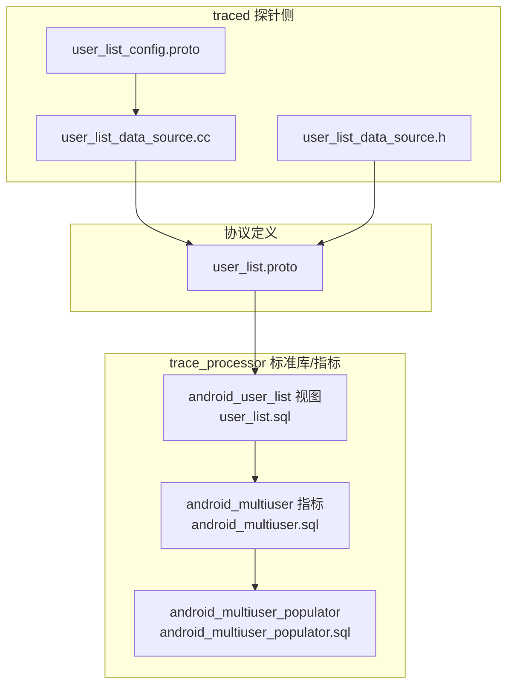
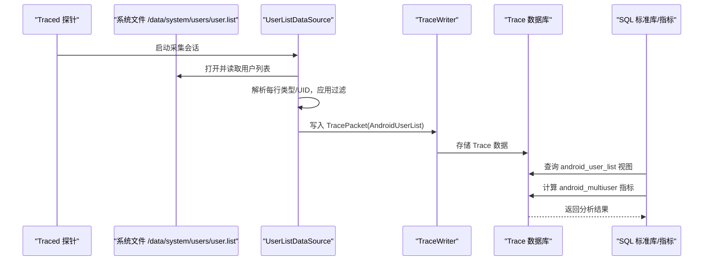
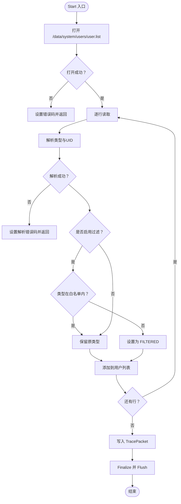
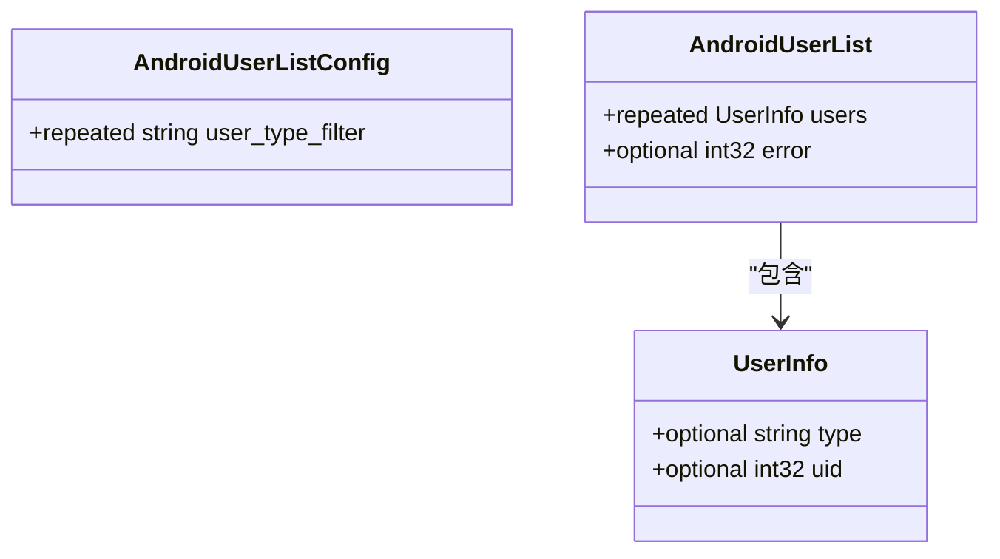
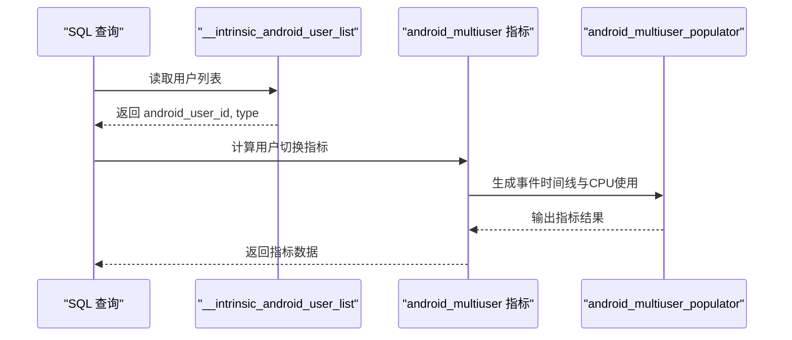
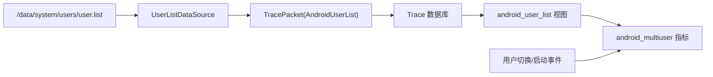

# 用户列表探测器

<cite>
**本文引用的文件**
- [user_list_data_source.cc](file://src/traced/probes/user_list/user_list_data_source.cc)
- [user_list_data_source.h](file://src/traced/probes/user_list/user_list_data_source.h)
- [user_list_config.proto](file://protos/perfetto/config/android/user_list_config.proto)
- [user_list.proto](file://protos/perfetto/trace/android/user_list.proto)
- [user_list.sql](file://src/trace_processor/perfetto_sql/stdlib/android/user_list.sql)
- [user_list_unittest.cc](file://src/traced/probes/user_list/user_list_unittest.cc)
- [android_multiuser_populator.sql](file://src/trace_processor/metrics/sql/android/android_multiuser_populator.sql)
- [android_multiuser.sql](file://src/trace_processor/metrics/sql/android/android_multiuser.sql)
- [android_auto_multiuser.textproto](file://test/trace_processor/diff_tests/metrics/android/android_auto_multiuser.textproto)
</cite>

## 目录
1. [简介](#简介)
2. [项目结构](#项目结构)
3. [核心组件](#核心组件)
4. [架构总览](#架构总览)
5. [详细组件分析](#详细组件分析)
6. [依赖关系分析](#依赖关系分析)
7. [性能考量](#性能考量)
8. [故障排查指南](#故障排查指南)
9. [结论](#结论)
10. [附录](#附录)

## 简介
本技术文档围绕“用户列表探测器”展开，系统性阐述其在Android多用户系统中的作用与实现机制。该探测器负责采集并上报设备当前存在的Android用户账户信息（用户ID、用户类型等），并支持基于用户类型的过滤策略。同时，文档还解释了探测器与Android多用户系统（如用户切换、启动等）的集成方式，并给出在多用户环境下进行用户活动分析的应用场景与数据解读方法。

## 项目结构
用户列表探测器由三部分组成：
- 探测器实现：位于traced探针侧，负责从系统文件读取用户列表并写入TracePacket。
- 协议定义：位于protos目录，定义用户列表的配置参数与Trace数据结构。
- SQL标准库与指标：位于trace_processor侧，提供视图与指标查询能力，便于在Trace中检索与分析用户信息。

**图表来源**
- [user_list_data_source.cc:55-86](file://src/traced/probes/user_list/user_list_data_source.cc#L55-L86)
- [user_list_data_source.h:51-70](file://src/traced/probes/user_list/user_list_data_source.h#L51-L70)
- [user_list_config.proto:23-53](file://protos/perfetto/config/android/user_list_config.proto#L23-L53)
- [user_list.proto:20-31](file://protos/perfetto/trace/android/user_list.proto#L20-L31)
- [user_list.sql:25-39](file://src/trace_processor/perfetto_sql/stdlib/android/user_list.sql#L25-L39)
- [android_multiuser.sql:17-26](file://src/trace_processor/metrics/sql/android/android_multiuser.sql#L17-L26)
- [android_multiuser_populator.sql:116-136](file://src/trace_processor/metrics/sql/android/android_multiuser_populator.sql#L116-L136)

**章节来源**
- [user_list_data_source.cc:1-159](file://src/traced/probes/user_list/user_list_data_source.cc#L1-L159)
- [user_list_data_source.h:1-75](file://src/traced/probes/user_list/user_list_data_source.h#L1-L75)
- [user_list_config.proto:1-54](file://protos/perfetto/config/android/user_list_config.proto#L1-L54)
- [user_list.proto:1-32](file://protos/perfetto/trace/android/user_list.proto#L1-L32)
- [user_list.sql:1-39](file://src/trace_processor/perfetto_sql/stdlib/android/user_list.sql#L1-L39)
- [android_multiuser.sql:1-26](file://src/trace_processor/metrics/sql/android/android_multiuser.sql#L1-L26)
- [android_multiuser_populator.sql:1-136](file://src/trace_processor/metrics/sql/android/android_multiuser_populator.sql#L1-L136)

## 核心组件
- 用户列表数据源（UserListDataSource）
  - 负责在采集会话启动时打开系统用户列表文件，解析每行记录，按需应用用户类型过滤，并将结果写入TracePacket。
  - 支持错误码回传，便于上层诊断。
- 配置消息（AndroidUserListConfig）
  - 提供用户类型白名单过滤策略，精确匹配字符串。
- Trace协议（AndroidUserList）
  - 定义用户条目（类型、UID）与错误码字段。
- SQL标准库视图（android_user_list）
  - 将内置的用户列表表暴露为可查询视图，便于与其他表关联。
- 多用户指标（android_multiuser）
  - 基于用户切换与启动事件的时间戳，计算用户切换时长与CPU使用情况等指标。

**章节来源**
- [user_list_data_source.cc:44-93](file://src/traced/probes/user_list/user_list_data_source.cc#L44-L93)
- [user_list_config.proto:23-53](file://protos/perfetto/config/android/user_list_config.proto#L23-L53)
- [user_list.proto:20-31](file://protos/perfetto/trace/android/user_list.proto#L20-L31)
- [user_list.sql:25-39](file://src/trace_processor/perfetto_sql/stdlib/android/user_list.sql#L25-L39)
- [android_multiuser.sql:17-26](file://src/trace_processor/metrics/sql/android/android_multiuser.sql#L17-L26)

## 架构总览
用户列表探测器在系统侧采集用户信息，写入Trace后，trace_processor通过标准库视图与指标模块进行分析与聚合。

**图表来源**
- [user_list_data_source.cc:55-86](file://src/traced/probes/user_list/user_list_data_source.cc#L55-L86)
- [user_list.proto:20-31](file://protos/perfetto/trace/android/user_list.proto#L20-L31)
- [user_list.sql:25-39](file://src/trace_processor/perfetto_sql/stdlib/android/user_list.sql#L25-L39)
- [android_multiuser.sql:17-26](file://src/trace_processor/metrics/sql/android/android_multiuser.sql#L17-L26)

## 详细组件分析

### 组件A：用户列表数据源（UserListDataSource）
- 职责
  - 在Start阶段打开系统用户列表文件，逐行解析用户类型与UID。
  - 支持用户类型白名单过滤；未匹配的类型统一标记为“FILTERED”。
  - 将解析结果写入TracePacket，并设置错误码（若发生IO或解析失败）。
- 关键流程
  - 文件打开与错误处理
  - 行解析（类型、UID）
  - 过滤逻辑
  - 写入TracePacket与Flush

**图表来源**
- [user_list_data_source.cc:55-86](file://src/traced/probes/user_list/user_list_data_source.cc#L55-L86)
- [user_list_data_source.cc:98-156](file://src/traced/probes/user_list/user_list_data_source.cc#L98-L156)

**章节来源**
- [user_list_data_source.cc:44-93](file://src/traced/probes/user_list/user_list_data_source.cc#L44-L93)
- [user_list_data_source.cc:98-156](file://src/traced/probes/user_list/user_list_data_source.cc#L98-L156)
- [user_list_data_source.h:40-70](file://src/traced/probes/user_list/user_list_data_source.h#L40-L70)

### 组件B：配置与协议
- AndroidUserListConfig
  - 字段：user_type_filter（字符串重复字段）
  - 语义：白名单过滤；未匹配的类型将被标记为“FILTERED”
- AndroidUserList
  - 字段：users（UserInfo数组）、error（错误码）
  - UserInfo：type（用户类型）、uid（用户ID）

**图表来源**
- [user_list_config.proto:23-53](file://protos/perfetto/config/android/user_list_config.proto#L23-L53)
- [user_list.proto:20-31](file://protos/perfetto/trace/android/user_list.proto#L20-L31)

**章节来源**
- [user_list_config.proto:23-53](file://protos/perfetto/config/android/user_list_config.proto#L23-L53)
- [user_list.proto:20-31](file://protos/perfetto/trace/android/user_list.proto#L20-L31)

### 组件C：SQL标准库与指标
- android_user_list 视图
  - 将内置用户列表表映射为可查询视图，字段包含android_user_id与type，便于与进程元数据等表关联。
- android_multiuser 指标
  - 基于用户切换与启动事件时间戳，计算切换时长与CPU使用分布等指标。
  - android_multiuser_populator.sql 提供多用户事件时间线、CPU使用计算与输出表生成。

**图表来源**
- [user_list.sql:25-39](file://src/trace_processor/perfetto_sql/stdlib/android/user_list.sql#L25-L39)
- [android_multiuser.sql:17-26](file://src/trace_processor/metrics/sql/android/android_multiuser.sql#L17-L26)
- [android_multiuser_populator.sql:116-136](file://src/trace_processor/metrics/sql/android/android_multiuser_populator.sql#L116-L136)

**章节来源**
- [user_list.sql:25-39](file://src/trace_processor/perfetto_sql/stdlib/android/user_list.sql#L25-L39)
- [android_multiuser.sql:17-26](file://src/trace_processor/metrics/sql/android/android_multiuser.sql#L17-L26)
- [android_multiuser_populator.sql:21-50](file://src/trace_processor/metrics/sql/android/android_multiuser_populator.sql#L21-L50)

### 组件D：测试用例与行为验证
- 行解析与过滤行为
  - 测试覆盖：完整行、不完整行、无效UID、空过滤、白名单过滤、全匹配过滤等场景。
- Trace数据验证
  - 通过单元测试断言用户条目数量、类型与UID正确性，以及过滤后类型为“FILTERED”的行为。

**章节来源**
- [user_list_unittest.cc:46-193](file://src/traced/probes/user_list/user_list_unittest.cc#L46-L193)

## 依赖关系分析
- traced探针侧依赖
  - 依赖系统文件路径与文件流读取能力，解析用户类型与UID。
  - 依赖TraceWriter写入TracePacket，依赖错误码回传。
- trace_processor侧依赖
  - 依赖标准库视图将内置用户列表表暴露为可查询视图。
  - 依赖指标模块基于用户切换事件与启动事件时间戳进行分析。
- 外部输入
  - Android系统文件：/data/system/users/user.list
  - Android多用户事件：用户切换、启动等事件时间戳

**图表来源**
- [user_list_data_source.cc:55-86](file://src/traced/probes/user_list/user_list_data_source.cc#L55-L86)
- [user_list.proto:20-31](file://protos/perfetto/trace/android/user_list.proto#L20-L31)
- [user_list.sql:25-39](file://src/trace_processor/perfetto_sql/stdlib/android/user_list.sql#L25-L39)
- [android_multiuser.sql:17-26](file://src/trace_processor/metrics/sql/android/android_multiuser.sql#L17-L26)

**章节来源**
- [user_list_data_source.cc:55-86](file://src/traced/probes/user_list/user_list_data_source.cc#L55-L86)
- [user_list.sql:25-39](file://src/trace_processor/perfetto_sql/stdlib/android/user_list.sql#L25-L39)
- [android_multiuser.sql:17-26](file://src/trace_processor/metrics/sql/android/android_multiuser.sql#L17-L26)

## 性能考量
- I/O与解析复杂度
  - 文件读取为O(N)，N为用户行数；解析单行为O(1)（固定两列）。
- 过滤策略
  - 白名单集合查找为O(M)（M为白名单大小），通常很小，影响可忽略。
- 写入与存储
  - TracePacket写入为一次性写入，避免频繁Flush；错误码回传有助于快速失败。
- 指标计算
  - 多用户指标涉及时间线对齐与CPU频率/调度切片的跨表连接，建议在大Trace中分段查询以降低内存压力。

[本节为通用性能讨论，无需列出具体文件来源]

## 故障排查指南
- 常见问题与定位
  - 打开文件失败：检查权限与路径是否存在；查看TracePacket中的error字段。
  - 解析失败：检查用户列表文件格式是否符合“类型 UID”两列；单行不完整或UID非数字会导致解析错误。
  - 过滤后全部为FILTERED：确认白名单是否正确配置；必要时清空白名单以验证原始数据。
- 调试建议
  - 使用单元测试样例作为参考，构造最小化输入以复现问题。
  - 在trace_processor侧先查询android_user_list视图，确认用户列表是否正确注入。
  - 结合android_multiuser指标核对用户切换事件时间戳是否合理。

**章节来源**
- [user_list_data_source.cc:55-86](file://src/traced/probes/user_list/user_list_data_source.cc#L55-L86)
- [user_list_unittest.cc:71-81](file://src/traced/probes/user_list/user_list_unittest.cc#L71-L81)
- [user_list.sql:25-39](file://src/trace_processor/perfetto_sql/stdlib/android/user_list.sql#L25-L39)

## 结论
用户列表探测器通过读取Android系统用户列表文件，将用户类型与UID等关键信息注入Trace，并提供灵活的过滤策略。结合trace_processor的标准库视图与多用户指标模块，可在多用户环境下进行用户切换时长、CPU占用等深入分析，为系统优化与用户体验评估提供数据支撑。

[本节为总结性内容，无需列出具体文件来源]

## 附录

### 用户信息数据结构说明
- 字段
  - 类型（type）：用户类型标识，例如系统用户、访客、受管配置文件等。
  - 用户ID（uid）：Android用户ID，用于与进程元数据等表关联。
  - 错误码（error）：采集过程中的错误信息，便于诊断。
- 关联与用途
  - 与进程元数据（如android_process_metadata.user_id）关联，可用于按用户维度统计资源使用。
  - 与多用户指标（android_multiuser）结合，分析用户切换与启动期间的系统行为。

**章节来源**
- [user_list.proto:20-31](file://protos/perfetto/trace/android/user_list.proto#L20-L31)
- [user_list.sql:25-39](file://src/trace_processor/perfetto_sql/stdlib/android/user_list.sql#L25-L39)

### 多用户环境下的数据收集策略
- 采集时机
  - 在采集会话启动时一次性读取并写入用户列表，避免频繁I/O。
- 过滤策略
  - 通过AndroidUserListConfig的user_type_filter实现白名单过滤，未匹配类型统一标记为“FILTERED”，降低敏感信息泄露风险。
- 指标生成
  - 基于用户切换事件与启动事件时间戳，计算切换时长与CPU使用分布，辅助评估多用户场景下的系统负载。

**章节来源**
- [user_list_config.proto:23-53](file://protos/perfetto/config/android/user_list_config.proto#L23-L53)
- [user_list_data_source.cc:55-86](file://src/traced/probes/user_list/user_list_data_source.cc#L55-L86)
- [android_multiuser_populator.sql:21-50](file://src/trace_processor/metrics/sql/android/android_multiuser_populator.sql#L21-L50)

### 实际应用场景与数据解读
- 场景示例
  - 用户切换耗时分析：通过android_multiuser指标获取切换时长，定位卡顿瓶颈。
  - CPU占用归因：按用户维度统计CPU周期，识别高负载用户或应用。
  - 资源使用对比：比较不同用户类型在切换前后内存与CPU的差异。
- 数据解读要点
  - 关注事件时间戳的准确性与完整性，确保起止事件对应同一切换周期。
  - 结合进程树与线程调度信息，进一步细化到具体应用与线程的行为。

**章节来源**
- [android_multiuser.sql:17-26](file://src/trace_processor/metrics/sql/android/android_multiuser.sql#L17-L26)
- [android_multiuser_populator.sql:116-136](file://src/trace_processor/metrics/sql/android/android_multiuser_populator.sql#L116-L136)
- [android_auto_multiuser.textproto:26-197](file://test/trace_processor/diff_tests/metrics/android/android_auto_multiuser.textproto#L26-L197)