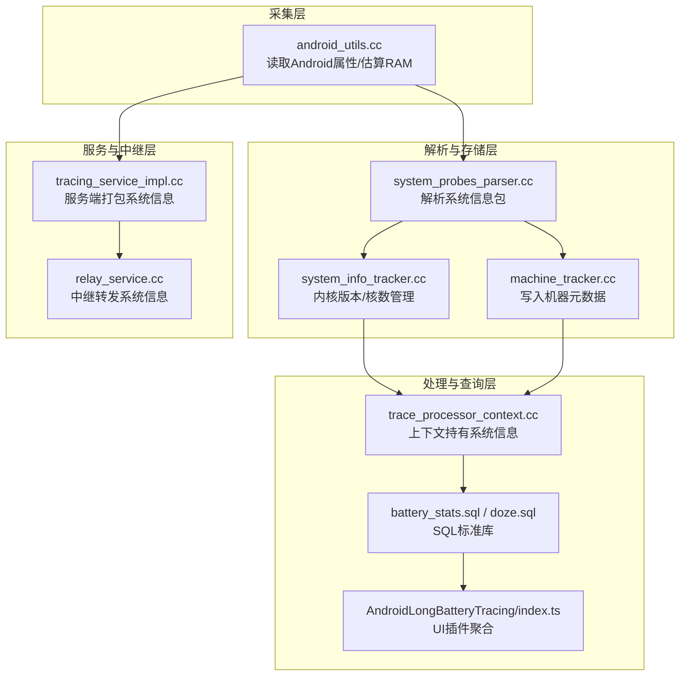
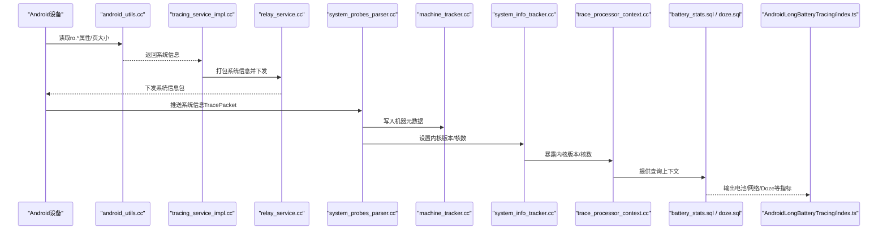
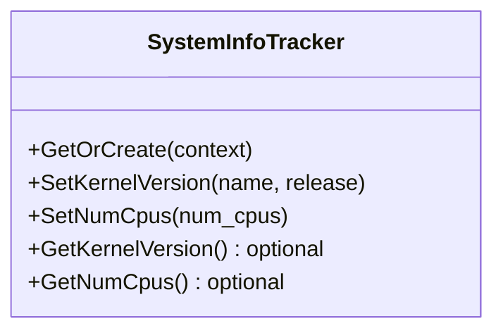
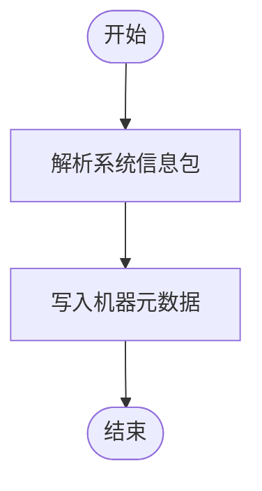
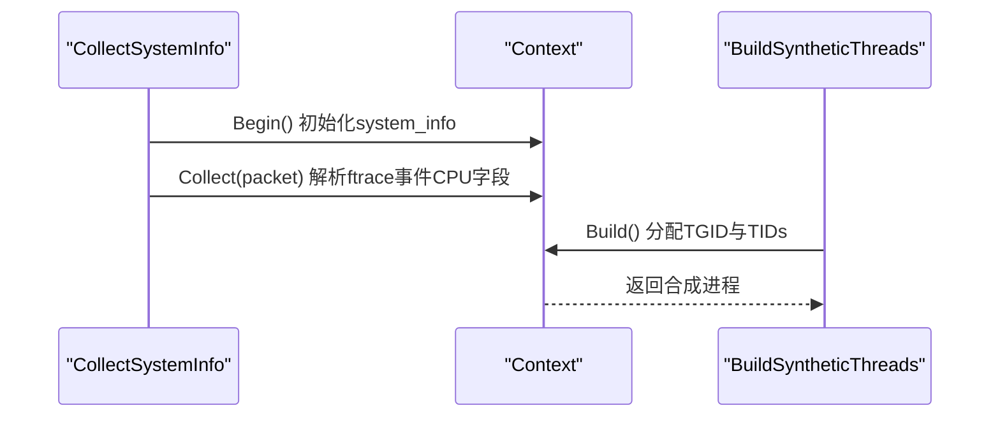
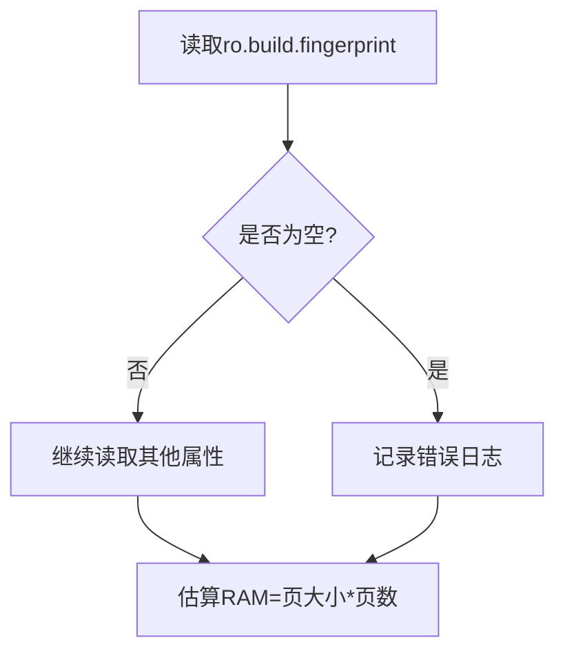
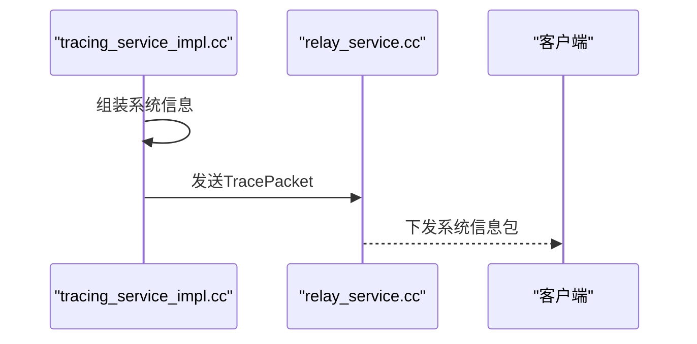
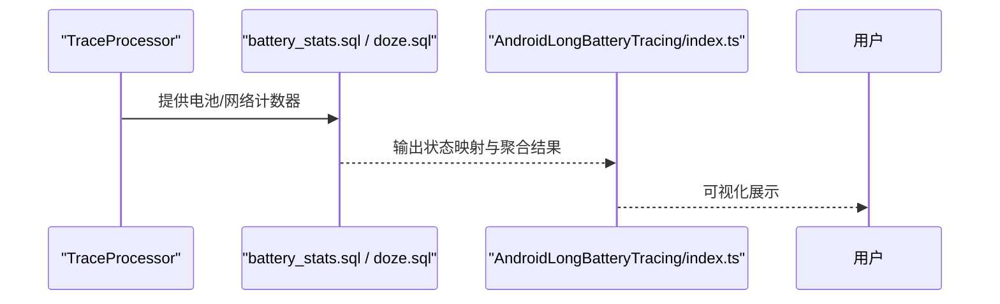
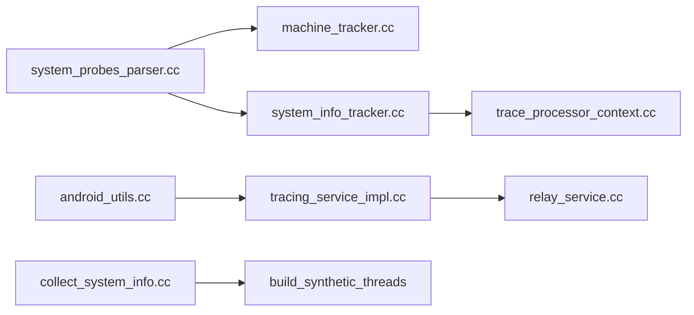

# 系统信息探测器

<cite>
**本文引用的文件**
- [src/trace_redaction/collect_system_info.h](file://src/trace_redaction/collect_system_info.h)
- [src/trace_redaction/collect_system_info.cc](file://src/trace_redaction/collect_system_info.cc)
- [src/trace_processor/importers/common/system_info_tracker.h](file://src/trace_processor/importers/common/system_info_tracker.h)
- [src/trace_processor/importers/common/system_info_tracker.cc](file://src/trace_processor/importers/common/system_info_tracker.cc)
- [src/trace_processor/importers/proto/system_probes_parser.cc](file://src/trace_processor/importers/proto/system_probes_parser.cc)
- [src/trace_processor/importers/proto/system_probes_parser.h](file://src/trace_processor/importers/proto/system_probes_parser.h)
- [src/trace_processor/importers/proto/android_probes_parser.cc](file://src/trace_processor/importers/proto/android_probes_parser.cc)
- [src/trace_processor/importers/proto/android_probes_parser.h](file://src/trace_processor/importers/proto/android_probes_parser.h)
- [src/trace_processor/importers/common/machine_tracker.h](file://src/trace_processor/importers/common/machine_tracker.h)
- [src/trace_processor/importers/common/machine_tracker.cc](file://src/trace_processor/importers/common/machine_tracker.cc)
- [src/base/android_utils.cc](file://src/base/android_utils.cc)
- [src/traced_relay/relay_service.cc](file://src/traced_relay/relay_service.cc)
- [src/tracing/service/tracing_service_impl.cc](file://src/tracing/service/tracing_service_impl.cc)
- [src/trace_processor/trace_processor_context.cc](file://src/trace_processor/trace_processor_context.cc)
- [src/trace_processor/perfetto_sql/stdlib/android/battery_stats.sql](file://src/trace_processor/perfetto_sql/stdlib/android/battery_stats.sql)
- [ui/src/plugins/com.android.AndroidLongBatteryTracing/index.ts](file://ui/src/plugins/com.android.AndroidLongBatteryTracing/index.ts)
- [src/trace_processor/perfetto_sql/stdlib/android/battery/doze.sql](file://src/trace_processor/perfetto_sql/stdlib/android/battery/doze.sql)
- [test/trace_processor/diff_tests/parser/power/tests_linux_sysfs_power.py](file://test/trace_processor/diff_tests/parser/power/tests_linux_sysfs_power.py)
</cite>

## 目录
1. [引言](#引言)
2. [项目结构](#项目结构)
3. [核心组件](#核心组件)
4. [架构总览](#架构总览)
5. [详细组件分析](#详细组件分析)
6. [依赖关系分析](#依赖关系分析)
7. [性能考量](#性能考量)
8. [故障排查指南](#故障排查指南)
9. [结论](#结论)
10. [附录](#附录)

## 引言
本技术文档围绕“系统信息探测器”展开，系统性阐述 Perfetto 在 Android 设备上如何采集并处理系统级信息（硬件规格、系统版本、内核版本、电池状态、网络状态等），以及这些信息在性能分析中的应用路径。文档从架构、组件职责、数据流、更新与缓存策略、SQL 查询与可视化集成等方面进行深入解析，并提供配置建议与最佳实践。

## 项目结构
系统信息探测涉及以下关键模块：
- 基础采集层：Android 属性读取、内核版本与 CPU 数量设置、系统内存估算
- 解析与存储层：系统信息解析器、机器元数据跟踪器、系统信息追踪器
- 处理与查询层：TraceProcessor 上下文、SQL 标准库、UI 插件
- 服务与中继层：traced 服务与 relay 中继，负责打包系统信息并下发到客户端

图表来源
- [src/base/android_utils.cc:119-154](file://src/base/android_utils.cc#L119-L154)
- [src/trace_processor/importers/proto/system_probes_parser.cc:936-975](file://src/trace_processor/importers/proto/system_probes_parser.cc#L936-L975)
- [src/trace_processor/importers/common/machine_tracker.cc:51-60](file://src/trace_processor/importers/common/machine_tracker.cc#L51-L60)
- [src/trace_processor/importers/common/system_info_tracker.cc:31-50](file://src/trace_processor/importers/common/system_info_tracker.cc#L31-L50)
- [src/trace_processor/trace_processor_context.cc:283-297](file://src/trace_processor/trace_processor_context.cc#L283-L297)
- [src/trace_processor/perfetto_sql/stdlib/android/battery_stats.sql:33-90](file://src/trace_processor/perfetto_sql/stdlib/android/battery_stats.sql#L33-L90)
- [ui/src/plugins/com.android.AndroidLongBatteryTracing/index.ts:800-845](file://ui/src/plugins/com.android.AndroidLongBatteryTracing/index.ts#L800-L845)
- [src/tracing/service/tracing_service_impl.cc:4062-4087](file://src/tracing/service/tracing_service_impl.cc#L4062-L4087)
- [src/traced_relay/relay_service.cc:108-135](file://src/traced_relay/relay_service.cc#L108-L135)

章节来源
- [src/base/android_utils.cc:119-154](file://src/base/android_utils.cc#L119-L154)
- [src/trace_processor/importers/proto/system_probes_parser.cc:936-975](file://src/trace_processor/importers/proto/system_probes_parser.cc#L936-L975)
- [src/trace_processor/importers/common/machine_tracker.cc:51-60](file://src/trace_processor/importers/common/machine_tracker.cc#L51-L60)
- [src/trace_processor/importers/common/system_info_tracker.cc:31-50](file://src/trace_processor/importers/common/system_info_tracker.cc#L31-L50)
- [src/trace_processor/trace_processor_context.cc:283-297](file://src/trace_processor/trace_processor_context.cc#L283-L297)
- [src/trace_processor/perfetto_sql/stdlib/android/battery_stats.sql:33-90](file://src/trace_processor/perfetto_sql/stdlib/android/battery_stats.sql#L33-L90)
- [ui/src/plugins/com.android.AndroidLongBatteryTracing/index.ts:800-845](file://ui/src/plugins/com.android.AndroidLongBatteryTracing/index.ts#L800-L845)
- [src/tracing/service/tracing_service_impl.cc:4062-4087](file://src/tracing/service/tracing_service_impl.cc#L4062-L4087)
- [src/traced_relay/relay_service.cc:108-135](file://src/traced_relay/relay_service.cc#L108-L135)

## 核心组件
- 系统信息追踪器（SystemInfoTracker）
  - 职责：维护内核版本与 CPU 数量；提供查询接口
  - 关键点：仅接受 Linux 名称与可解析的主/次内核版本串
- 机器元数据跟踪器（MachineTracker）
  - 职责：将 Android 构建指纹、厂商、SDK 版本等写入元数据表
- 系统信息采集与合成（CollectSystemInfo / BuildSyntheticThreads）
  - 职责：从 ftrace 事件中收集 CPU 数量，构建合成线程映射
- Android 属性读取（android_utils.cc）
  - 职责：读取 ro.* 系统属性，估算 RAM 字节
- 服务与中继（tracing_service_impl.cc / relay_service.cc）
  - 职责：将系统信息打包进 TracePacket 并下发

章节来源
- [src/trace_processor/importers/common/system_info_tracker.h:30-55](file://src/trace_processor/importers/common/system_info_tracker.h#L30-L55)
- [src/trace_processor/importers/common/system_info_tracker.cc:31-50](file://src/trace_processor/importers/common/system_info_tracker.cc#L31-L50)
- [src/trace_processor/importers/common/machine_tracker.h](file://src/trace_processor/importers/common/machine_tracker.h)
- [src/trace_processor/importers/common/machine_tracker.cc:51-60](file://src/trace_processor/importers/common/machine_tracker.cc#L51-L60)
- [src/trace_redaction/collect_system_info.h:24-46](file://src/trace_redaction/collect_system_info.h#L24-L46)
- [src/trace_redaction/collect_system_info.cc:26-92](file://src/trace_redaction/collect_system_info.cc#L26-L92)
- [src/base/android_utils.cc:119-154](file://src/base/android_utils.cc#L119-L154)
- [src/tracing/service/tracing_service_impl.cc:4062-4087](file://src/tracing/service/tracing_service_impl.cc#L4062-L4087)
- [src/traced_relay/relay_service.cc:108-135](file://src/traced_relay/relay_service.cc#L108-L135)

## 架构总览
系统信息从采集到呈现的完整链路如下：

图表来源
- [src/base/android_utils.cc:119-154](file://src/base/android_utils.cc#L119-L154)
- [src/tracing/service/tracing_service_impl.cc:4062-4087](file://src/tracing/service/tracing_service_impl.cc#L4062-L4087)
- [src/traced_relay/relay_service.cc:108-135](file://src/traced_relay/relay_service.cc#L108-L135)
- [src/trace_processor/importers/proto/system_probes_parser.cc:936-975](file://src/trace_processor/importers/proto/system_probes_parser.cc#L936-L975)
- [src/trace_processor/importers/common/machine_tracker.cc:51-60](file://src/trace_processor/importers/common/machine_tracker.cc#L51-L60)
- [src/trace_processor/importers/common/system_info_tracker.cc:31-50](file://src/trace_processor/importers/common/system_info_tracker.cc#L31-L50)
- [src/trace_processor/trace_processor_context.cc:283-297](file://src/trace_processor/trace_processor_context.cc#L283-L297)
- [src/trace_processor/perfetto_sql/stdlib/android/battery_stats.sql:33-90](file://src/trace_processor/perfetto_sql/stdlib/android/battery_stats.sql#L33-L90)
- [ui/src/plugins/com.android.AndroidLongBatteryTracing/index.ts:800-845](file://ui/src/plugins/com.android.AndroidLongBatteryTracing/index.ts#L800-L845)

## 详细组件分析

### 组件A：系统信息追踪器（SystemInfoTracker）
- 功能要点
  - 设置并校验内核版本：仅当名称为 Linux 且主/次版本可解析时才记录
  - 记录 CPU 数量，供后续统计与可视化使用
- 数据结构与复杂度
  - 内核版本以版本号对象保存，查询为 O(1)
  - CPU 数量为整型，查询为 O(1)
- 错误处理
  - 非 Linux 或不可解析版本将清空版本信息
- 性能影响
  - 单次解析与赋值，常数时间复杂度，开销极低

图表来源
- [src/trace_processor/importers/common/system_info_tracker.h:30-55](file://src/trace_processor/importers/common/system_info_tracker.h#L30-L55)
- [src/trace_processor/importers/common/system_info_tracker.cc:31-50](file://src/trace_processor/importers/common/system_info_tracker.cc#L31-L50)

章节来源
- [src/trace_processor/importers/common/system_info_tracker.h:30-55](file://src/trace_processor/importers/common/system_info_tracker.h#L30-L55)
- [src/trace_processor/importers/common/system_info_tracker.cc:31-50](file://src/trace_processor/importers/common/system_info_tracker.cc#L31-L50)

### 组件B：机器元数据跟踪器（MachineTracker）
- 功能要点
  - 将 Android 构建指纹、厂商、SDK 版本等写入元数据表，供查询与过滤使用
- 数据流
  - 解析器在解析系统信息包时调用机器跟踪器写入字段
- 性能影响
  - 元数据写入为常数时间操作，对整体性能影响可忽略

图表来源
- [src/trace_processor/importers/proto/system_probes_parser.cc:936-975](file://src/trace_processor/importers/proto/system_probes_parser.cc#L936-L975)
- [src/trace_processor/importers/common/machine_tracker.cc:51-60](file://src/trace_processor/importers/common/machine_tracker.cc#L51-L60)

章节来源
- [src/trace_processor/importers/proto/system_probes_parser.cc:936-975](file://src/trace_processor/importers/proto/system_probes_parser.cc#L936-L975)
- [src/trace_processor/importers/common/machine_tracker.cc:51-60](file://src/trace_processor/importers/common/machine_tracker.cc#L51-L60)

### 组件C：系统信息采集与合成（CollectSystemInfo / BuildSyntheticThreads）
- 功能要点
  - 从 ftrace 事件中提取 CPU 数量，用于后续合成线程映射
  - 在上下文准备完成后，分配 TGID 与各 CPU 的 TID，形成合成进程
- 数据流
  - Begin 初始化系统信息容器
  - Collect 收集 ftrace 事件中的 CPU 字段
  - Build 构建合成线程映射

图表来源
- [src/trace_redaction/collect_system_info.cc:26-92](file://src/trace_redaction/collect_system_info.cc#L26-L92)

章节来源
- [src/trace_redaction/collect_system_info.h:24-46](file://src/trace_redaction/collect_system_info.h#L24-L46)
- [src/trace_redaction/collect_system_info.cc:26-92](file://src/trace_redaction/collect_system_info.cc#L26-L92)

### 组件D：Android 属性读取（android_utils.cc）
- 功能要点
  - 读取 ro.build.fingerprint、ro.product.manufacturer、ro.build.version.sdk、ro.soc.model、ro.boot.hardware.revision、ro.boot.hardware.ufs 等关键属性
  - 通过页大小与页数估算系统 RAM 字节
- 错误处理
  - 读取失败时记录错误日志，避免中断流程

图表来源
- [src/base/android_utils.cc:119-154](file://src/base/android_utils.cc#L119-L154)

章节来源
- [src/base/android_utils.cc:119-154](file://src/base/android_utils.cc#L119-L154)

### 组件E：服务与中继（tracing_service_impl.cc / relay_service.cc）
- 功能要点
  - 服务端将系统信息打包进 TracePacket 并下发
  - 中继转发系统信息包至客户端
- 数据格式
  - 包含内核版本、CPU 数量、页大小、系统 RAM、Android 构建指纹、厂商、SDK 版本、SoC/存储/硬件型号等

图表来源
- [src/tracing/service/tracing_service_impl.cc:4062-4087](file://src/tracing/service/tracing_service_impl.cc#L4062-L4087)
- [src/traced_relay/relay_service.cc:108-135](file://src/traced_relay/relay_service.cc#L108-L135)

章节来源
- [src/tracing/service/tracing_service_impl.cc:4062-4087](file://src/tracing/service/tracing_service_impl.cc#L4062-L4087)
- [src/traced_relay/relay_service.cc:108-135](file://src/traced_relay/relay_service.cc#L108-L135)

### 组件F：电池与网络状态（battery_stats.sql / doze.sql / AndroidLongBatteryTracing）
- 功能要点
  - 将原始电池计数器映射为可读状态（如 Wi-Fi、音视频、省电模式等）
  - UI 插件聚合网络使用情况与电池状态，支持按包名分组统计
- 应用场景
  - 设备兼容性分析：根据构建指纹与 SDK 版本筛选设备
  - 性能基准测试：结合 Doze 状态与网络使用评估功耗
  - 系统资源监控：基于计数器与状态映射进行趋势分析

图表来源
- [src/trace_processor/perfetto_sql/stdlib/android/battery_stats.sql:33-90](file://src/trace_processor/perfetto_sql/stdlib/android/battery_stats.sql#L33-L90)
- [src/trace_processor/perfetto_sql/stdlib/android/battery/doze.sql:91-124](file://src/trace_processor/perfetto_sql/stdlib/android/battery/doze.sql#L91-L124)
- [ui/src/plugins/com.android.AndroidLongBatteryTracing/index.ts:800-845](file://ui/src/plugins/com.android.AndroidLongBatteryTracing/index.ts#L800-L845)

章节来源
- [src/trace_processor/perfetto_sql/stdlib/android/battery_stats.sql:33-90](file://src/trace_processor/perfetto_sql/stdlib/android/battery_stats.sql#L33-L90)
- [src/trace_processor/perfetto_sql/stdlib/android/battery/doze.sql:91-124](file://src/trace_processor/perfetto_sql/stdlib/android/battery/doze.sql#L91-L124)
- [ui/src/plugins/com.android.AndroidLongBatteryTracing/index.ts:800-845](file://ui/src/plugins/com.android.AndroidLongBatteryTracing/index.ts#L800-L845)

## 依赖关系分析
- 组件耦合
  - SystemInfoTracker 与 TraceProcessorContext 协作，提供内核版本与 CPU 数量
  - MachineTracker 与 system_probes_parser 协同写入元数据
  - CollectSystemInfo 与 BuildSyntheticThreads 依赖 ftrace 事件中的 CPU 字段
- 外部依赖
  - Android 属性系统（ro.*）与内核版本字符串
  - TracePacket 协议与 SQL 标准库

图表来源
- [src/trace_processor/importers/proto/system_probes_parser.cc:936-975](file://src/trace_processor/importers/proto/system_probes_parser.cc#L936-L975)
- [src/trace_processor/importers/common/machine_tracker.cc:51-60](file://src/trace_processor/importers/common/machine_tracker.cc#L51-L60)
- [src/trace_processor/importers/common/system_info_tracker.cc:31-50](file://src/trace_processor/importers/common/system_info_tracker.cc#L31-L50)
- [src/trace_processor/trace_processor_context.cc:283-297](file://src/trace_processor/trace_processor_context.cc#L283-L297)
- [src/base/android_utils.cc:119-154](file://src/base/android_utils.cc#L119-L154)
- [src/tracing/service/tracing_service_impl.cc:4062-4087](file://src/tracing/service/tracing_service_impl.cc#L4062-L4087)
- [src/traced_relay/relay_service.cc:108-135](file://src/traced_relay/relay_service.cc#L108-L135)
- [src/trace_redaction/collect_system_info.cc:26-92](file://src/trace_redaction/collect_system_info.cc#L26-L92)

章节来源
- [src/trace_processor/importers/proto/system_probes_parser.cc:936-975](file://src/trace_processor/importers/proto/system_probes_parser.cc#L936-L975)
- [src/trace_processor/importers/common/machine_tracker.cc:51-60](file://src/trace_processor/importers/common/machine_tracker.cc#L51-L60)
- [src/trace_processor/importers/common/system_info_tracker.cc:31-50](file://src/trace_processor/importers/common/system_info_tracker.cc#L31-L50)
- [src/trace_processor/trace_processor_context.cc:283-297](file://src/trace_processor/trace_processor_context.cc#L283-L297)
- [src/base/android_utils.cc:119-154](file://src/base/android_utils.cc#L119-L154)
- [src/tracing/service/tracing_service_impl.cc:4062-4087](file://src/tracing/service/tracing_service_impl.cc#L4062-L4087)
- [src/traced_relay/relay_service.cc:108-135](file://src/traced_relay/relay_service.cc#L108-L135)
- [src/trace_redaction/collect_system_info.cc:26-92](file://src/trace_redaction/collect_system_info.cc#L26-L92)

## 性能考量
- 采集成本
  - Android 属性读取与页大小估算为常数时间，开销极低
  - ftrace 事件解析仅提取 CPU 字段，不引入额外 IO
- 存储与查询
  - 内核版本与 CPU 数量以轻量结构保存，查询为 O(1)
  - 机器元数据写入为一次性操作，不影响实时追踪
- 缓存策略
  - TraceProcessor 上下文持有系统信息，避免重复解析
  - UI 插件通过 SQL 聚合结果缓存，减少重复计算

## 故障排查指南
- Android 属性读取失败
  - 现象：日志出现无法读取 ro.* 属性的错误
  - 排查：确认目标设备已正确导出对应属性；检查 SELinux/权限限制
- 内核版本不可解析
  - 现象：系统信息未记录内核版本或显示为空
  - 排查：确认 uname 输出格式与主/次版本可解析
- 电池/网络计数器缺失
  - 现象：UI 中无电池或网络统计
  - 排查：确认 trace 包含相应计数器；检查 SQL 映射逻辑是否匹配

章节来源
- [src/base/android_utils.cc:119-154](file://src/base/android_utils.cc#L119-L154)
- [src/trace_processor/importers/common/system_info_tracker.cc:31-50](file://src/trace_processor/importers/common/system_info_tracker.cc#L31-L50)
- [src/trace_processor/perfetto_sql/stdlib/android/battery_stats.sql:33-90](file://src/trace_processor/perfetto_sql/stdlib/android/battery_stats.sql#L33-L90)
- [ui/src/plugins/com.android.AndroidLongBatteryTracing/index.ts:800-845](file://ui/src/plugins/com.android.AndroidLongBatteryTracing/index.ts#L800-L845)

## 结论
系统信息探测器通过多层协作，实现了对 Android 设备系统级信息的高效采集与处理。其设计强调低开销、强扩展性与可查询性，既能满足设备兼容性分析与性能基准测试需求，也能支撑系统资源监控与 UI 可视化。建议在实际使用中结合 TraceProcessor 上下文与 SQL 标准库，充分利用元数据与计数器，提升分析效率与准确性。

## 附录
- 配置选项与使用建议
  - 在采集阶段确保 ro.* 属性可用，必要时在服务端预读并注入系统信息包
  - 使用 SQL 标准库进行状态映射与聚合，避免在 UI 层重复实现
  - 对于大规模设备池，建议以构建指纹与 SDK 版本作为筛选条件，缩小分析范围
- 数据格式参考
  - 内核版本：Linux 名称 + 主/次版本字符串
  - CPU 数量：整型
  - RAM 字节：页大小 × 页数
  - Android 元数据：构建指纹、厂商、SDK 版本、SoC/存储/硬件型号等