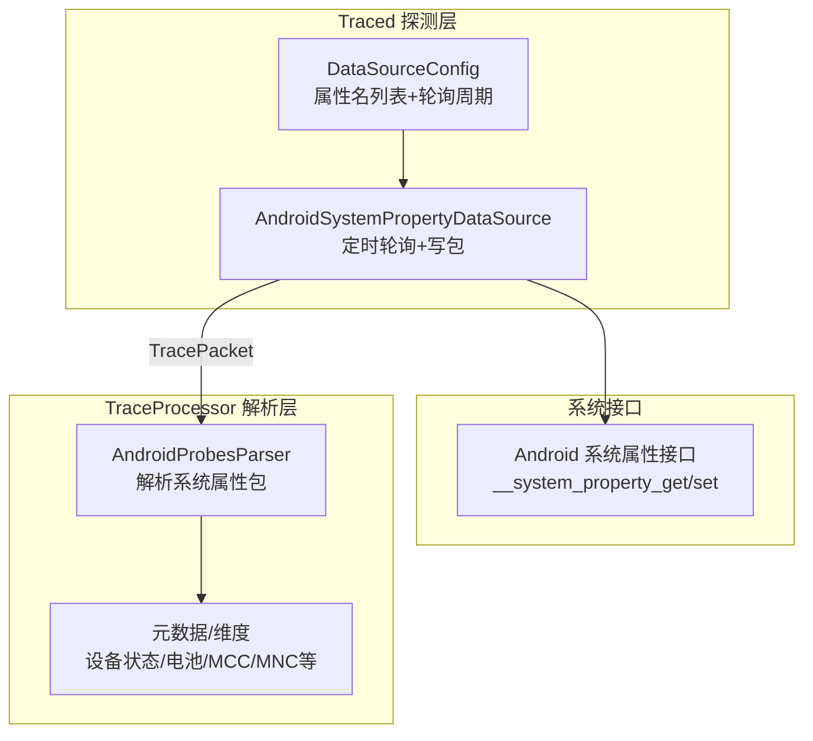
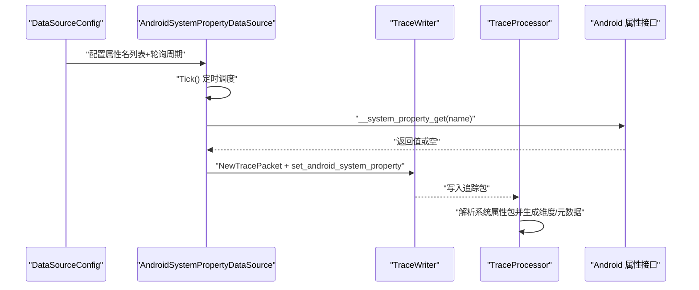
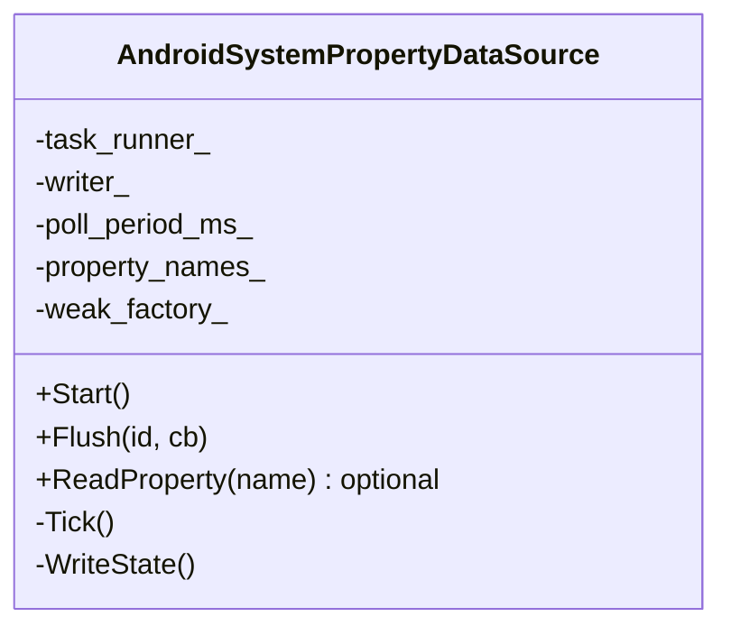
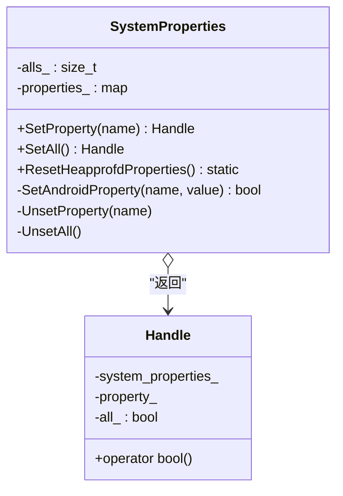
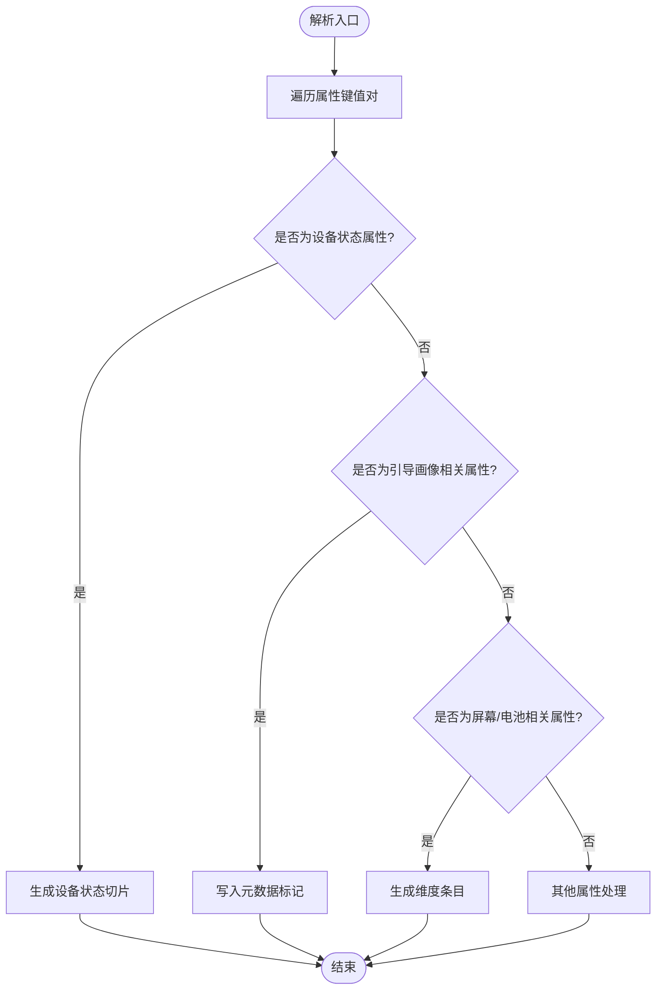
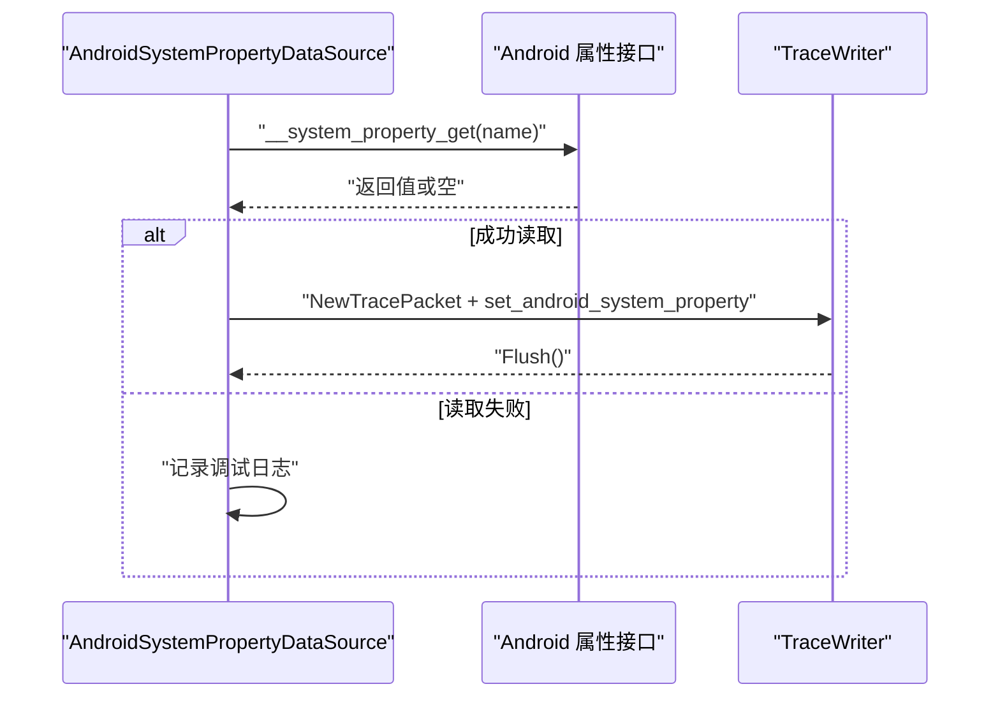
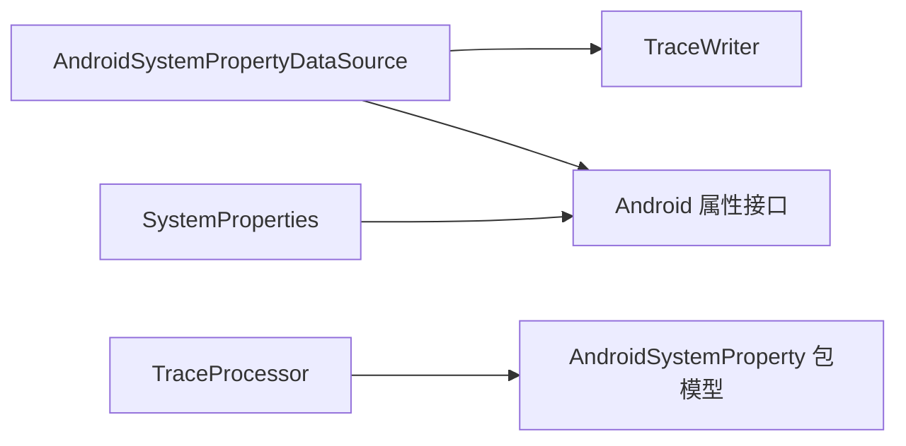

# 系统属性探测器

<cite>
**本文引用的文件**
- [android_system_property_data_source.cc](file://src/traced/probes/android_system_property/android_system_property_data_source.cc)
- [android_system_property_data_source.h](file://src/traced/probes/android_system_property/android_system_property_data_source.h)
- [android_system_property_data_source_unittest.cc](file://src/traced/probes/android_system_property/android_system_property_data_source_unittest.cc)
- [system_property.h](file://src/profiling/memory/system_property.h)
- [system_property.cc](file://src/profiling/memory/system_property.cc)
- [system_property_unittest.cc](file://src/profiling/memory/system_property_unittest.cc)
- [android_probes_parser.cc](file://src/trace_processor/importers/proto/android_probes_parser.cc)
- [android_system_property.proto](file://protos/perfetto/trace/android/android_system_property.proto)
- [android_boot_tracing.md](file://docs/case-studies/android-boot-tracing.md)
- [service.cc](file://src/traced/service/service.cc)
- [builtin_producer.cc](file://src/traced/service/builtin_producer.cc)
- [android_utils.cc](file://src/base/android_utils.cc)
</cite>

## 目录
1. [简介](#简介)
2. [项目结构](#项目结构)
3. [核心组件](#核心组件)
4. [架构总览](#架构总览)
5. [组件详解](#组件详解)
6. [依赖关系分析](#依赖关系分析)
7. [性能考量](#性能考量)
8. [故障排查指南](#故障排查指南)
9. [结论](#结论)
10. [附录](#附录)

## 简介
本技术文档聚焦于“系统属性探测器”，系统性阐述 Android 系统属性的获取、轮询与写入追踪流的机制，以及与之配套的属性设置与清理能力。内容涵盖：
- 如何读取系统属性值（含前缀校验、失败回退）
- 如何定时轮询并写入追踪包
- 属性设置与作用域管理（按进程名或全局启用）
- 属性在性能分析中的应用：系统配置检查、设备特性识别、运行时参数监控
- 错误处理策略与性能优化建议

## 项目结构
围绕系统属性探测器的关键文件组织如下：
- 探测数据源：负责解析配置、定时轮询、读取属性并写入追踪包
- 属性设置与生命周期管理：提供按需启用/禁用系统属性的能力，并自动维护主开关
- 追踪包模型：定义系统属性键值对的序列化结构
- 追踪处理器：解析系统属性包，生成可视化维度或元数据

图表来源
- [android_system_property_data_source.cc:42-118](file://src/traced/probes/android_system_property/android_system_property_data_source.cc#L42-L118)
- [android_probes_parser.cc:582-649](file://src/trace_processor/importers/proto/android_probes_parser.cc#L582-L649)
- [android_system_property.proto:20-27](file://protos/perfetto/trace/android/android_system_property.proto#L20-L27)

章节来源
- [android_system_property_data_source.cc:42-118](file://src/traced/probes/android_system_property/android_system_property_data_source.cc#L42-L118)
- [android_system_property_data_source.h:34-62](file://src/traced/probes/android_system_property/android_system_property_data_source.h#L34-L62)
- [android_system_property.proto:20-27](file://protos/perfetto/trace/android/android_system_property.proto#L20-L27)

## 核心组件
- AndroidSystemPropertyDataSource：探测数据源，负责解析配置、定时触发、读取属性并写入追踪包；支持最小轮询周期限制与前缀校验
- SystemProperties：属性设置与生命周期管理，提供按进程名启用/禁用与全局启用，并自动维护主开关
- 追踪包模型：AndroidSystemProperty 包含若干键值对，供 TraceProcessor 解析
- 追踪处理器：解析系统属性包，识别关键属性并映射到元数据或可视化维度

章节来源
- [android_system_property_data_source.h:34-62](file://src/traced/probes/android_system_property/android_system_property_data_source.h#L34-L62)
- [system_property.h:39-82](file://src/profiling/memory/system_property.h#L39-L82)
- [android_system_property.proto:20-27](file://protos/perfetto/trace/android/android_system_property.proto#L20-L27)
- [android_probes_parser.cc:582-649](file://src/trace_processor/importers/proto/android_probes_parser.cc#L582-L649)

## 架构总览
系统属性探测器由“探测层—系统接口—解析层”三层构成，形成从采集到可视化的完整链路。

图表来源
- [android_system_property_data_source.cc:80-118](file://src/traced/probes/android_system_property/android_system_property_data_source.cc#L80-L118)
- [android_probes_parser.cc:582-649](file://src/trace_processor/importers/proto/android_probes_parser.cc#L582-L649)
- [android_utils.cc:64-64](file://src/base/android_utils.cc#L64-L64)

## 组件详解

### 探测数据源：AndroidSystemPropertyDataSource
职责与行为：
- 解析配置：读取轮询周期与属性名列表，要求属性名必须以特定前缀开头
- 轮询控制：根据轮询周期计算延迟，确保对齐到周期边界
- 读取与写入：逐个读取属性值，成功则写入追踪包；为保证可预测性，每次写入后主动刷新
- 前缀校验与日志：不符合前缀的属性会记录错误日志

图表来源
- [android_system_property_data_source.h:34-62](file://src/traced/probes/android_system_property/android_system_property_data_source.h#L34-L62)

章节来源
- [android_system_property_data_source.cc:42-118](file://src/traced/probes/android_system_property/android_system_property_data_source.cc#L42-L118)
- [android_system_property_data_source_unittest.cc:80-96](file://src/traced/probes/android_system_property/android_system_property_data_source_unittest.cc#L80-L96)

### 属性设置与生命周期管理：SystemProperties
职责与行为：
- 按进程名启用/禁用：通过设置特定前缀属性，配合主开关属性统一管理
- 全局启用/禁用：支持一次性启用所有目标程序
- 引用计数：同一进程名多次启用仅一次实际设置，释放时递减计数，最终自动清理
- 主开关维护：当最后一个启用项释放时，自动清理主开关属性
- 清理工具：重置 heapprofd 相关属性，用于测试或异常恢复场景

图表来源
- [system_property.h:39-82](file://src/profiling/memory/system_property.h#L39-L82)
- [system_property.cc:66-165](file://src/profiling/memory/system_property.cc#L66-L165)

章节来源
- [system_property.h:26-82](file://src/profiling/memory/system_property.h#L26-L82)
- [system_property.cc:66-165](file://src/profiling/memory/system_property.cc#L66-L165)
- [system_property_unittest.cc:87-159](file://src/profiling/memory/system_property_unittest.cc#L87-L159)

### 追踪包模型与解析
- 追踪包模型：AndroidSystemProperty 包含若干键值对，便于在 TraceProcessor 中进行维度化展示与元数据注入
- 解析逻辑：TraceProcessor 将系统属性包解析为可视化维度或元数据，例如设备状态、电池状态、MCC/MNC、屏幕状态等

图表来源
- [android_probes_parser.cc:582-649](file://src/trace_processor/importers/proto/android_probes_parser.cc#L582-L649)
- [android_system_property.proto:20-27](file://protos/perfetto/trace/android/android_system_property.proto#L20-L27)

章节来源
- [android_probes_parser.cc:582-649](file://src/trace_processor/importers/proto/android_probes_parser.cc#L582-L649)
- [android_system_property.proto:20-27](file://protos/perfetto/trace/android/android_system_property.proto#L20-L27)

### 属性读取与写入流程
- 读取路径：探测数据源调用底层 Android 属性接口读取指定属性值，若为空则记录调试日志
- 写入路径：将属性键值对写入追踪包，随后刷新以避免缓冲区满导致的丢失

图表来源
- [android_system_property_data_source.cc:98-118](file://src/traced/probes/android_system_property/android_system_property_data_source.cc#L98-L118)
- [android_utils.cc:64-64](file://src/base/android_utils.cc#L64-L64)

章节来源
- [android_system_property_data_source.cc:98-118](file://src/traced/probes/android_system_property/android_system_property_data_source.cc#L98-L118)
- [android_utils.cc:64-64](file://src/base/android_utils.cc#L64-L64)

## 依赖关系分析
- 探测数据源依赖任务调度器进行定时触发，依赖追踪写入器输出包，依赖 Android 属性接口读取值
- SystemProperties 依赖 Android 属性接口进行设置与清理
- 追踪处理器依赖系统属性包模型进行解析与维度化

图表来源
- [android_system_property_data_source.cc:42-118](file://src/traced/probes/android_system_property/android_system_property_data_source.cc#L42-L118)
- [system_property.cc:132-142](file://src/profiling/memory/system_property.cc#L132-L142)
- [android_probes_parser.cc:582-649](file://src/trace_processor/importers/proto/android_probes_parser.cc#L582-L649)

章节来源
- [android_system_property_data_source.cc:42-118](file://src/traced/probes/android_system_property/android_system_property_data_source.cc#L42-L118)
- [system_property.cc:132-142](file://src/profiling/memory/system_property.cc#L132-L142)
- [android_probes_parser.cc:582-649](file://src/trace_processor/importers/proto/android_probes_parser.cc#L582-L649)

## 性能考量
- 轮询周期下限：探测数据源对轮询周期设置了最小阈值，避免过于频繁的读取造成开销
- 刷新策略：为保证系统属性包及时可见，每次写入后主动刷新，权衡了实时性与写入成本
- 批量读取：按配置列表顺序读取，建议合理规划属性数量与名称，减少不必要的读取
- 属性设置成本：SystemProperties 在启用/禁用时涉及系统调用，应避免过度频繁地切换

章节来源
- [android_system_property_data_source.cc:54-59](file://src/traced/probes/android_system_property/android_system_property_data_source.cc#L54-L59)
- [android_system_property_data_source.cc:111-118](file://src/traced/probes/android_system_property/android_system_property_data_source.cc#L111-L118)

## 故障排查指南
常见问题与处理建议：
- 属性读取为空
  - 现象：读取返回空值并记录调试日志
  - 处理：确认属性名正确、前缀符合要求、目标属性存在且可读
- 前缀不匹配
  - 现象：配置中属性名未满足前缀要求，记录错误日志
  - 处理：修正属性名为以特定前缀开头的形式
- 轮询周期过小
  - 现象：日志提示轮询周期低于最小阈值并被调整
  - 处理：提高轮询周期以降低开销
- 属性设置失败
  - 现象：SystemProperties 启用/禁用返回失败
  - 处理：检查权限与平台支持，必要时使用清理工具重置相关属性
- 追踪包未显示
  - 现象：追踪结束后未看到系统属性维度
  - 处理：确认探测数据源已启动、属性名正确、解析器已启用对应维度映射

章节来源
- [android_system_property_data_source.cc:54-68](file://src/traced/probes/android_system_property/android_system_property_data_source.cc#L54-L68)
- [android_system_property_data_source.cc:120-136](file://src/traced/probes/android_system_property/android_system_property_data_source.cc#L120-L136)
- [system_property.cc:132-142](file://src/profiling/memory/system_property.cc#L132-L142)
- [android_probes_parser.cc:582-649](file://src/trace_processor/importers/proto/android_probes_parser.cc#L582-L649)

## 结论
系统属性探测器通过“探测—写入—解析”的闭环，实现了对 Android 系统属性的稳定采集与可视化呈现。结合属性设置与生命周期管理，既能满足按需启用的灵活性，又能避免冗余设置带来的负担。在性能分析场景中，系统属性可用于设备特性识别、运行时参数监控与引导画像关联，为诊断与优化提供关键依据。

## 附录

### 数据类型与访问权限
- 数据类型：系统属性值为字符串类型，解析侧可进一步转换为整型等数值类型
- 访问权限：读取依赖底层 Android 属性接口；设置受平台与权限约束，部分操作在非 Android 平台不可用

章节来源
- [android_system_property.proto:20-27](file://protos/perfetto/trace/android/android_system_property.proto#L20-L27)
- [android_system_property_data_source.cc:120-136](file://src/traced/probes/android_system_property/android_system_property_data_source.cc#L120-L136)
- [system_property.cc:132-142](file://src/profiling/memory/system_property.cc#L132-L142)

### 应用场景示例
- 系统配置检查：读取设备状态、屏幕状态、电池状态等，辅助定位运行环境差异
- 设备特性识别：通过 MCC/MNC、桌面模式等属性识别设备归属与界面模式
- 运行时参数监控：在追踪过程中持续观察关键运行参数变化，结合可视化维度进行趋势分析

章节来源
- [android_probes_parser.cc:582-649](file://src/trace_processor/importers/proto/android_probes_parser.cc#L582-L649)

### 属性设置与清理
- 启用/禁用：按进程名启用或全局启用，内部维护主开关与引用计数
- 清理：重置 heapprofd 相关属性，便于测试或异常恢复
- 触发时机：服务启动时可能设置系统标志位，确保追踪服务可用性

章节来源
- [system_property.cc:66-165](file://src/profiling/memory/system_property.cc#L66-L165)
- [system_property_unittest.cc:87-159](file://src/profiling/memory/system_property_unittest.cc#L87-L159)
- [service.cc:260-260](file://src/traced/service/service.cc#L260-L260)
- [builtin_producer.cc:305-305](file://src/traced/service/builtin_producer.cc#L305-L305)