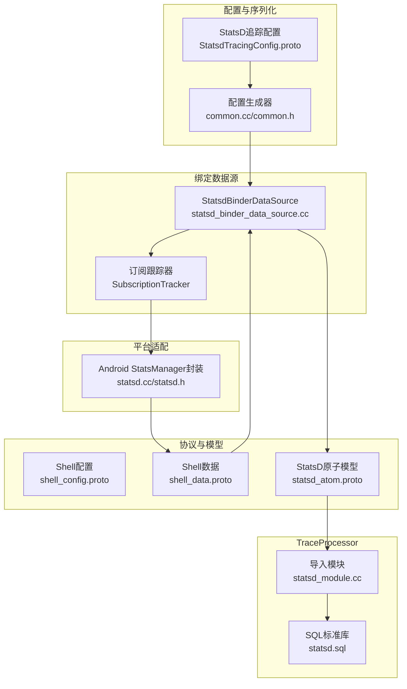
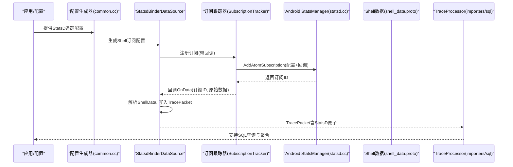
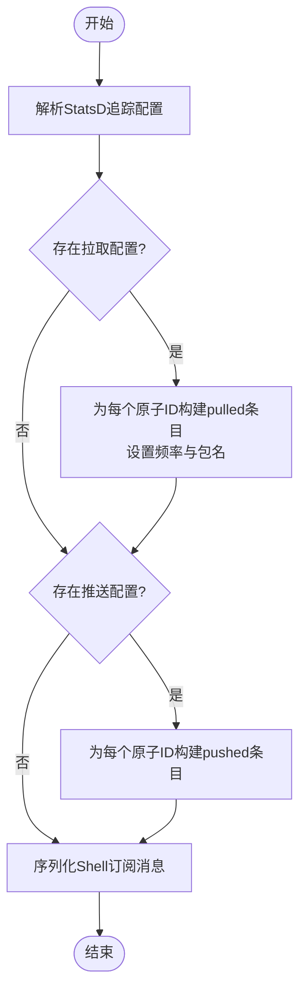
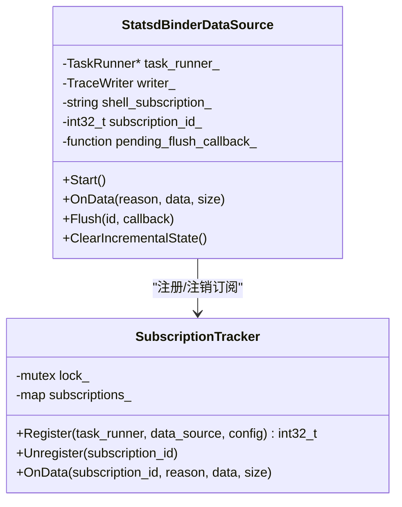
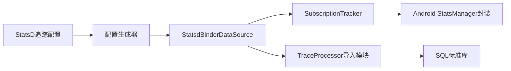

# StatsD客户端数据源

<cite>
**本文档引用的文件**
- [src/traced/probes/statsd_client/common.cc](file://src/traced/probes/statsd_client/common.cc)
- [src/traced/probes/statsd_client/common.h](file://src/traced/probes/statsd_client/common.h)
- [src/traced/probes/statsd_client/statsd_binder_data_source.cc](file://src/traced/probes/statsd_client/statsd_binder_data_source.cc)
- [src/traced/probes/statsd_client/BUILD.gn](file://src/traced/probes/statsd_client/BUILD.gn)
- [src/android_internal/statsd.cc](file://src/android_internal/statsd.cc)
- [src/android_internal/statsd.h](file://src/android_internal/statsd.h)
- [protos/perfetto/config/statsd/statsd_tracing_config.proto](file://protos/perfetto/config/statsd/statsd_tracing_config.proto)
- [protos/perfetto/trace/statsd/statsd_atom.proto](file://protos/perfetto/trace/statsd/statsd_atom.proto)
- [protos/third_party/statsd/shell_config.proto](file://protos/third_party/statsd/shell_config.proto)
- [protos/third_party/statsd/shell_data.proto](file://protos/third_party/statsd/shell_data.proto)
- [src/trace_processor/importers/proto/statsd_module.cc](file://src/trace_processor/importers/proto/statsd_module.cc)
- [src/trace_processor/perfetto_sql/stdlib/android/statsd.sql](file://src/trace_processor/perfetto_sql/stdlib/android/statsd.sql)
- [src/android_stats/statsd_logging_helper.cc](file://src/android_stats/statsd_logging_helper.cc)
- [src/android_stats/statsd_logging_helper.h](file://src/android_stats/statsd_logging_helper.h)
- [src/perfetto_cmd/perfetto_cmd.cc](file://src/perfetto_cmd/perfetto_cmd.cc)
- [src/perfetto_cmd/perfetto_cmd.h](file://src/perfetto_cmd/perfetto_cmd.h)
</cite>

## 目录
1. [简介](#简介)
2. [项目结构](#项目结构)
3. [核心组件](#核心组件)
4. [架构总览](#架构总览)
5. [详细组件分析](#详细组件分析)
6. [依赖关系分析](#依赖关系分析)
7. [性能考虑](#性能考虑)
8. [故障排查指南](#故障排查指南)
9. [结论](#结论)
10. [附录](#附录)

## 简介
本文件面向Perfetto中的StatsD客户端数据源，系统性阐述其在Android平台上的工作原理与集成方式，覆盖以下方面：
- StatsD指标采集能力：支持推送型（push）与拉取型（pull）原子指标，涵盖计数器、定时器与Gauge等常见指标类型。
- 数据流与传输：从StatsD服务端通过Binder回调接收原始原子数据，转换为Perfetto TracePacket并写入Trace缓冲区，供TraceProcessor解析与查询。
- 配置模型：基于StatsD追踪配置消息，生成Shell订阅配置，驱动底层StatsD订阅管理器建立连接。
- 实时性与可运维性：提供Flush机制、订阅生命周期管理与线程安全保障，确保在高并发Binder回调下的稳定性。
- 查询与可视化：TraceProcessor导入模块与SQL标准库支持对StatsD原子指标进行聚合、过滤与可视化。

该数据源为应用性能监控、业务指标跟踪与实时告警提供了统一的采集入口，便于与Perfetto整体可观测性体系融合。

## 项目结构
StatsD客户端数据源主要由三部分组成：
- 配置与序列化层：负责将Perfetto的StatsD追踪配置转换为StatsD Shell订阅消息。
- 绑定数据源层：通过Android StatsManager Binder接口注册订阅，处理异步回调，将原始原子数据写入Trace。
- 平台适配层：封装StatsManager的订阅/取消/刷新调用，确保线程池可用与回调安全。

**图表来源**
- [src/traced/probes/statsd_client/common.cc:65-76](file://src/traced/probes/statsd_client/common.cc#L65-L76)
- [src/traced/probes/statsd_client/statsd_binder_data_source.cc:203-226](file://src/traced/probes/statsd_client/statsd_binder_data_source.cc#L203-L226)
- [src/android_internal/statsd.cc:25-46](file://src/android_internal/statsd.cc#L25-L46)
- [protos/third_party/statsd/shell_config.proto](file://protos/third_party/statsd/shell_config.proto)
- [protos/third_party/statsd/shell_data.proto](file://protos/third_party/statsd/shell_data.proto)
- [protos/perfetto/trace/statsd/statsd_atom.proto](file://protos/perfetto/trace/statsd/statsd_atom.proto)
- [src/trace_processor/importers/proto/statsd_module.cc](file://src/trace_processor/importers/proto/statsd_module.cc)
- [src/trace_processor/perfetto_sql/stdlib/android/statsd.sql](file://src/trace_processor/perfetto_sql/stdlib/android/statsd.sql)

**章节来源**
- [src/traced/probes/statsd_client/BUILD.gn:17-37](file://src/traced/probes/statsd_client/BUILD.gn#L17-L37)

## 核心组件
- 配置生成器：将Perfetto的StatsD追踪配置转换为StatsD Shell订阅消息，支持push与pull两类原子ID，并可设置拉取频率与包名过滤。
- 绑定数据源：负责启动/停止订阅、处理回调、写入TracePacket、Flush协调与订阅生命周期管理。
- 平台适配：封装StatsManager的订阅/取消/刷新调用，确保Binder线程池可用与回调安全。
- 协议与模型：定义Shell配置、Shell数据与StatsD原子的消息格式，保证与Android StatsD服务端的数据一致性。
- TraceProcessor导入与查询：将StatsD原子映射到TraceProcessor表结构，提供SQL标准库函数以支持聚合与分析。

**章节来源**
- [src/traced/probes/statsd_client/common.cc:33-76](file://src/traced/probes/statsd_client/common.cc#L33-L76)
- [src/traced/probes/statsd_client/statsd_binder_data_source.cc:203-274](file://src/traced/probes/statsd_client/statsd_binder_data_source.cc#L203-L274)
- [src/android_internal/statsd.cc:25-46](file://src/android_internal/statsd.cc#L25-L46)
- [protos/perfetto/config/statsd/statsd_tracing_config.proto:28-44](file://protos/perfetto/config/statsd/statsd_tracing_config.proto#L28-L44)
- [protos/perfetto/trace/statsd/statsd_atom.proto](file://protos/perfetto/trace/statsd/statsd_atom.proto)
- [src/trace_processor/importers/proto/statsd_module.cc](file://src/trace_processor/importers/proto/statsd_module.cc)
- [src/trace_processor/perfetto_sql/stdlib/android/statsd.sql](file://src/trace_processor/perfetto_sql/stdlib/android/statsd.sql)

## 架构总览
下图展示了StatsD客户端数据源从配置到写入Trace的完整流程，以及与TraceProcessor的交互：

**图表来源**
- [src/traced/probes/statsd_client/common.cc:65-76](file://src/traced/probes/statsd_client/common.cc#L65-L76)
- [src/traced/probes/statsd_client/statsd_binder_data_source.cc:158-199](file://src/traced/probes/statsd_client/statsd_binder_data_source.cc#L158-L199)
- [src/android_internal/statsd.cc:25-46](file://src/android_internal/statsd.cc#L25-L46)
- [protos/third_party/statsd/shell_data.proto](file://protos/third_party/statsd/shell_data.proto)
- [src/trace_processor/importers/proto/statsd_module.cc](file://src/trace_processor/importers/proto/statsd_module.cc)
- [src/trace_processor/perfetto_sql/stdlib/android/statsd.sql](file://src/trace_processor/perfetto_sql/stdlib/android/statsd.sql)

## 详细组件分析

### 配置生成器（common.cc）
- 职责：将Perfetto的StatsD追踪配置转换为StatsD Shell订阅消息，支持push与pull两类原子ID；可设置默认拉取频率与包名过滤。
- 关键逻辑：
  - 拉取配置：遍历pull_config，为每个原子ID生成pulled条目，设置频率与包名列表。
  - 推送配置：遍历push_atom_id与raw_push_atom_id，生成pushed条目。
  - 序列化：将构建好的Shell订阅消息序列化为字符串返回给数据源。

**图表来源**
- [src/traced/probes/statsd_client/common.cc:33-76](file://src/traced/probes/statsd_client/common.cc#L33-L76)

**章节来源**
- [src/traced/probes/statsd_client/common.cc:33-76](file://src/traced/probes/statsd_client/common.cc#L33-L76)
- [protos/perfetto/config/statsd/statsd_tracing_config.proto:28-44](file://protos/perfetto/config/statsd/statsd_tracing_config.proto#L28-L44)

### 绑定数据源（statsd_binder_data_source.cc）
- 职责：作为Perfetto数据源，负责启动/停止订阅、处理来自StatsD的异步回调、将原始原子数据写入TracePacket、协调Flush请求。
- 关键点：
  - 订阅注册：通过SubscriptionTracker在单例中登记订阅ID与回调，确保线程安全。
  - 回调处理：在回调中复制数据并切换到主线程任务队列，避免竞态条件。
  - 数据写入：将ShellData解码后的原子数据直接Append到TracePacket的StatsD原子字段。
  - Flush协调：若StatsD侧发起Flush请求，则等待其完成后再触发TraceWriter.Flush。
  - 生命周期：当收到订阅结束回调时，自动注销订阅并清理状态。

**图表来源**
- [src/traced/probes/statsd_client/statsd_binder_data_source.cc:203-274](file://src/traced/probes/statsd_client/statsd_binder_data_source.cc#L203-L274)
- [src/traced/probes/statsd_client/statsd_binder_data_source.cc:86-199](file://src/traced/probes/statsd_client/statsd_binder_data_source.cc#L86-L199)

**章节来源**
- [src/traced/probes/statsd_client/statsd_binder_data_source.cc:203-298](file://src/traced/probes/statsd_client/statsd_binder_data_source.cc#L203-L298)

### 平台适配（android_internal/statsd.cc）
- 职责：封装StatsManager的订阅/取消/刷新调用，确保Binder线程池已启动，使回调消息能够被正确接收。
- 关键点：
  - 启动线程池：在首次订阅前确保Binder线程池可用。
  - 订阅管理：提供添加/移除/刷新订阅的轻量封装，供上层数据源调用。

**章节来源**
- [src/android_internal/statsd.cc:25-46](file://src/android_internal/statsd.cc#L25-L46)

### 协议与模型
- StatsD追踪配置：定义push与pull两类原子ID集合，以及可选的拉取频率与包名过滤。
- Shell配置/数据：定义StatsD与Perfetto之间传递的订阅与数据消息格式。
- StatsD原子：定义TracePacket中StatsD原子字段的数据结构，用于TraceProcessor解析。

**章节来源**
- [protos/perfetto/config/statsd/statsd_tracing_config.proto:28-44](file://protos/perfetto/config/statsd/statsd_tracing_config.proto#L28-L44)
- [protos/third_party/statsd/shell_config.proto](file://protos/third_party/statsd/shell_config.proto)
- [protos/third_party/statsd/shell_data.proto](file://protos/third_party/statsd/shell_data.proto)
- [protos/perfetto/trace/statsd/statsd_atom.proto](file://protos/perfetto/trace/statsd/statsd_atom.proto)

### TraceProcessor导入与查询
- 导入模块：将StatsD原子映射到TraceProcessor内部表结构，支持后续查询与聚合。
- SQL标准库：提供针对StatsD原子的SQL函数与视图，便于按时间窗口、维度分组进行统计分析。

**章节来源**
- [src/trace_processor/importers/proto/statsd_module.cc](file://src/trace_processor/importers/proto/statsd_module.cc)
- [src/trace_processor/perfetto_sql/stdlib/android/statsd.sql](file://src/trace_processor/perfetto_sql/stdlib/android/statsd.sql)

## 依赖关系分析
- 组件耦合：
  - 配置生成器仅依赖配置Proto与序列化工具，内聚性高。
  - 绑定数据源依赖配置生成器、平台适配与TraceWriter，承担数据流转职责。
  - 平台适配层薄封装，避免上层直接依赖系统API。
- 外部依赖：
  - Android StatsManager Binder接口，用于订阅与回调。
  - Perfetto ProtoZero序列化框架，用于消息编码与TracePacket写入。
- 可能的循环依赖：
  - 通过弱指针与单例模式避免SubscriptionTracker与数据源之间的循环引用。

**图表来源**
- [src/traced/probes/statsd_client/common.cc:65-76](file://src/traced/probes/statsd_client/common.cc#L65-L76)
- [src/traced/probes/statsd_client/statsd_binder_data_source.cc:203-226](file://src/traced/probes/statsd_client/statsd_binder_data_source.cc#L203-L226)
- [src/android_internal/statsd.cc:25-46](file://src/android_internal/statsd.cc#L25-L46)
- [src/trace_processor/importers/proto/statsd_module.cc](file://src/trace_processor/importers/proto/statsd_module.cc)

**章节来源**
- [src/traced/probes/statsd_client/BUILD.gn:17-37](file://src/traced/probes/statsd_client/BUILD.gn#L17-L37)

## 性能考虑
- 线程与锁：
  - 回调在Binder线程池中触发，数据源通过SubscriptionTracker在主线程任务队列中处理，避免跨线程竞态。
  - 使用互斥锁保护订阅映射，降低锁粒度，减少临界区开销。
- 数据拷贝与内存：
  - 在回调中先复制数据再加锁，缩短持有锁的时间。
  - 使用共享指针管理临时缓冲，避免重复分配。
- Flush协调：
  - 防止多个未决Flush堆积，避免因StatsD无响应导致的背压。
- 序列化与写入：
  - 将ShellData直接Append到TracePacket，减少额外拷贝与转换成本。

**章节来源**
- [src/traced/probes/statsd_client/statsd_binder_data_source.cc:125-156](file://src/traced/probes/statsd_client/statsd_binder_data_source.cc#L125-L156)
- [src/traced/probes/statsd_client/statsd_binder_data_source.cc:276-298](file://src/traced/probes/statsd_client/statsd_binder_data_source.cc#L276-L298)

## 故障排查指南
- 无数据或空配置：
  - 若StatsD追踪配置为空，数据源不会连接StatsD，检查配置是否正确设置push/pull原子ID。
- 订阅未生效：
  - 检查SubscriptionTracker是否成功注册并返回有效订阅ID；确认平台适配层的StatsManager调用是否成功。
- 回调丢失或崩溃：
  - 确认Binder线程池已启动；确保数据源在析构时正确注销订阅。
- Flush卡顿：
  - 观察是否存在多个未决Flush；确保回调中正确处理Flush完成信号并触发TraceWriter.Flush。
- TraceProcessor无法识别原子：
  - 检查导入模块与SQL标准库是否启用；确认StatsD原子字段与TracePacket映射一致。

**章节来源**
- [src/traced/probes/statsd_client/statsd_binder_data_source.cc:228-239](file://src/traced/probes/statsd_client/statsd_binder_data_source.cc#L228-L239)
- [src/traced/probes/statsd_client/statsd_binder_data_source.cc:125-156](file://src/traced/probes/statsd_client/statsd_binder_data_source.cc#L125-L156)
- [src/android_internal/statsd.cc:25-46](file://src/android_internal/statsd.cc#L25-L46)

## 结论
Perfetto的StatsD客户端数据源通过清晰的配置生成、稳健的订阅管理与高效的Trace写入，实现了对Android平台StatsD原子指标的可靠采集与实时传输。结合TraceProcessor的导入与SQL标准库，用户可以对应用性能与业务指标进行多维分析与实时告警，满足生产环境的可观测性需求。

## 附录

### 配置示例与使用场景
- 自定义指标上报：
  - 通过StatsD追踪配置声明push_atom_id或raw_push_atom_id，使应用侧的StatsD服务端将原子事件推送到Perfetto。
- 计数器与Gauge监控：
  - 利用StatsD计数器与Gauge原子，配合TraceProcessor的聚合函数进行趋势分析与阈值告警。
- 定时器采样：
  - 通过pull_config设置拉取频率与包名过滤，周期性获取特定原子数据，用于延迟分布与资源占用分析。
- 实时性能指标：
  - 结合Flush机制与订阅生命周期管理，确保在高负载场景下的低延迟与高吞吐。

**章节来源**
- [protos/perfetto/config/statsd/statsd_tracing_config.proto:28-44](file://protos/perfetto/config/statsd/statsd_tracing_config.proto#L28-L44)
- [src/trace_processor/perfetto_sql/stdlib/android/statsd.sql](file://src/trace_processor/perfetto_sql/stdlib/android/statsd.sql)

### 协议配置要点
- StatsD追踪配置：
  - push_atom_id/raw_push_atom_id：推送型原子ID集合。
  - pull_config：包含pull_atom_id/raw_pull_atom_id、pull_frequency_ms与packages。
- Shell配置/数据：
  - Shell订阅消息与Shell数据消息需与StatsD服务端保持一致，确保字段匹配与序列化兼容。

**章节来源**
- [protos/perfetto/config/statsd/statsd_tracing_config.proto:28-44](file://protos/perfetto/config/statsd/statsd_tracing_config.proto#L28-L44)
- [protos/third_party/statsd/shell_config.proto](file://protos/third_party/statsd/shell_config.proto)
- [protos/third_party/statsd/shell_data.proto](file://protos/third_party/statsd/shell_data.proto)

### 指标聚合策略与网络传输优化
- 聚合策略：
  - 使用TraceProcessor SQL标准库对StatsD原子进行时间窗口聚合、按维度分组与统计计算。
- 网络传输优化：
  - 通过合理的拉取频率与包名过滤减少不必要的数据传输；在回调中采用最小化拷贝与批量写入策略。

**章节来源**
- [src/trace_processor/perfetto_sql/stdlib/android/statsd.sql](file://src/trace_processor/perfetto_sql/stdlib/android/statsd.sql)

### 与应用日志与触发元数据的集成
- StatsD日志开关：可通过命令行参数控制StatsD日志记录行为，便于在调试与生产环境中灵活切换。
- 触发元数据：支持在Trace中携带StatsD触发相关的元数据，便于关联告警与配置信息。

**章节来源**
- [src/perfetto_cmd/perfetto_cmd.cc:768-775](file://src/perfetto_cmd/perfetto_cmd.cc#L768-L775)
- [src/perfetto_cmd/perfetto_cmd.cc:672-690](file://src/perfetto_cmd/perfetto_cmd.cc#L672-L690)