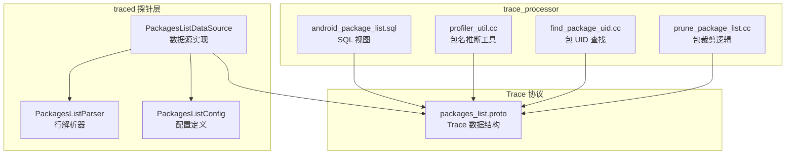
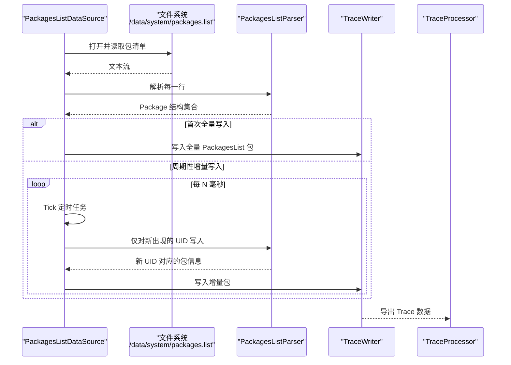
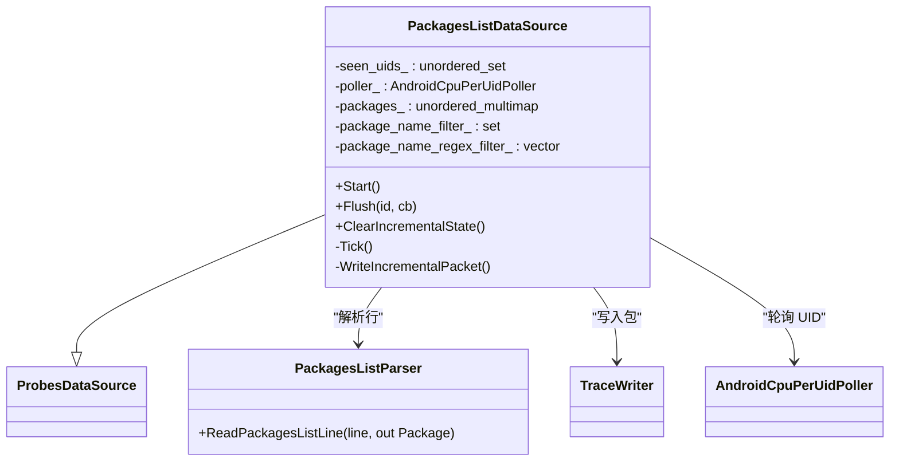
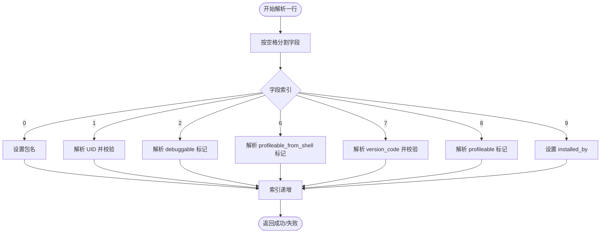
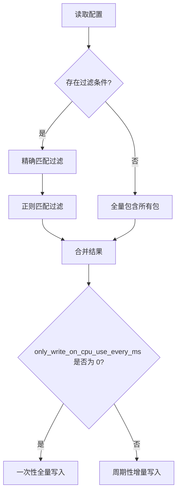
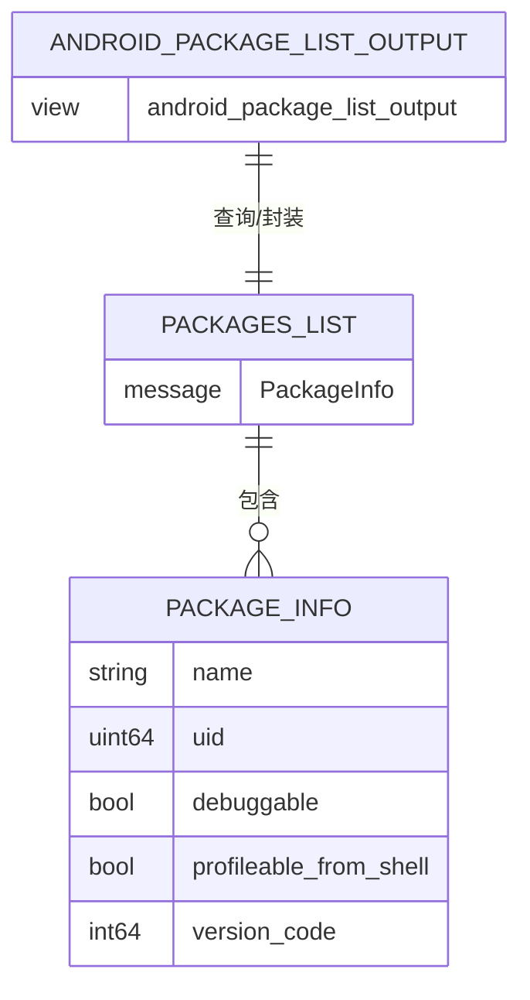
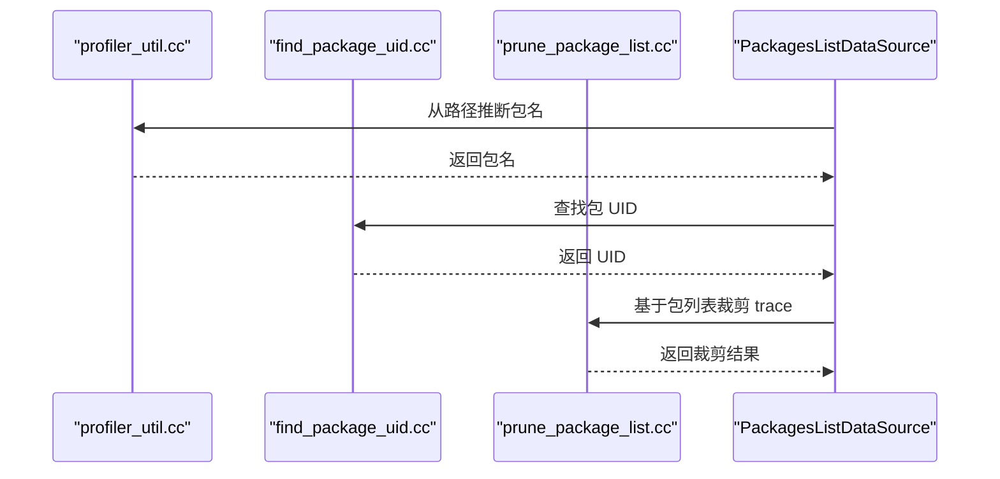
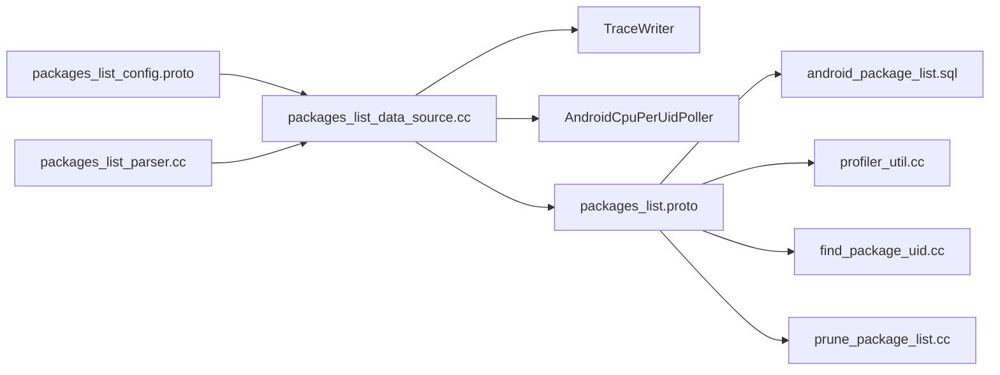

# 包信息数据源

<cite>
**本文引用的文件**
- [packages_list_data_source.h](file://src/traced/probes/packages_list/packages_list_data_source.h)
- [packages_list_data_source.cc](file://src/traced/probes/packages_list/packages_list_data_source.cc)
- [packages_list_parser.h](file://src/traced/probes/packages_list/packages_list_parser.h)
- [packages_list_parser.cc](file://src/traced/probes/packages_list/packages_list_parser.cc)
- [packages_list_config.proto](file://protos/perfetto/config/android/packages_list_config.proto)
- [packages_list.proto](file://protos/perfetto/trace/android/packages_list.proto)
- [packages_list_unittest.cc](file://src/traced/probes/packages_list/packages_list_unittest.cc)
- [android_package_list.sql](file://src/trace_processor/metrics/sql/android/android_package_list.sql)
- [profiler_util.cc](file://src/trace_processor/util/profiler_util.cc)
- [find_package_uid.cc](file://src/trace_redaction/find_package_uid.cc)
- [prune_package_list.cc](file://src/trace_redaction/prune_package_list.cc)
</cite>

## 目录
1. [简介](#简介)
2. [项目结构](#项目结构)
3. [核心组件](#核心组件)
4. [架构总览](#架构总览)
5. [详细组件分析](#详细组件分析)
6. [依赖关系分析](#依赖关系分析)
7. [性能考量](#性能考量)
8. [故障排查指南](#故障排查指南)
9. [结论](#结论)
10. [附录](#附录)

## 简介
本技术文档围绕 Perfetto 的“包信息数据源”展开，系统阐述其在 Android 设备上对已安装应用列表、包版本信息、调试与可剖析能力标记以及安装来源等元数据的采集与导出机制。该数据源既支持一次性全量导出，也支持基于 CPU 使用事件的增量导出，用于应用兼容性检查、包管理分析、依赖关系梳理与包冲突检测等场景。

## 项目结构
包信息数据源位于 traced 探针层，解析系统包清单并生成 Trace Packet；同时在 trace_processor 中提供 SQL 视图以供查询与分析。

**图表来源**
- [packages_list_data_source.cc:103-133](file://src/traced/probes/packages_list/packages_list_data_source.cc#L103-L133)
- [packages_list_parser.cc:26-92](file://src/traced/probes/packages_list/packages_list_parser.cc#L26-L92)
- [packages_list_config.proto:23-42](file://protos/perfetto/config/android/packages_list_config.proto#L23-L42)
- [packages_list.proto:20-36](file://protos/perfetto/trace/android/packages_list.proto#L20-L36)
- [android_package_list.sql:17-27](file://src/trace_processor/metrics/sql/android/android_package_list.sql#L17-L27)
- [profiler_util.cc:37-109](file://src/trace_processor/util/profiler_util.cc#L37-L109)
- [find_package_uid.cc:69-69](file://src/trace_redaction/find_package_uid.cc#L69-L69)
- [prune_package_list.cc:75-75](file://src/trace_redaction/prune_package_list.cc#L75-L75)

**章节来源**
- [packages_list_data_source.h:48-87](file://src/traced/probes/packages_list/packages_list_data_source.h#L48-L87)
- [packages_list_data_source.cc:103-133](file://src/traced/probes/packages_list/packages_list_data_source.cc#L103-L133)
- [packages_list_parser.h:25-33](file://src/traced/probes/packages_list/packages_list_parser.h#L25-L33)
- [packages_list_parser.cc:26-92](file://src/traced/probes/packages_list/packages_list_parser.cc#L26-L92)
- [packages_list_config.proto:23-42](file://protos/perfetto/config/android/packages_list_config.proto#L23-L42)
- [packages_list.proto:20-36](file://protos/perfetto/trace/android/packages_list.proto#L20-L36)
- [android_package_list.sql:17-27](file://src/trace_processor/metrics/sql/android/android_package_list.sql#L17-L27)
- [profiler_util.cc:37-109](file://src/trace_processor/util/profiler_util.cc#L37-L109)
- [find_package_uid.cc:69-69](file://src/trace_redaction/find_package_uid.cc#L69-L69)
- [prune_package_list.cc:75-75](file://src/trace_redaction/prune_package_list.cc#L75-L75)

## 核心组件
- 数据源实现：负责启动、解析包清单、按需写入全量或增量包信息，并通过 TraceWriter 输出到 Trace Packet。
- 行解析器：将系统包清单的一行文本解析为结构化 Package 对象（含名称、UID、调试标记、可从 Shell 剖析标记、版本号、是否可剖析、安装来源等）。
- 配置模型：支持精确包名过滤、正则过滤、仅在 CPU 使用时写入的周期间隔等参数。
- Trace 协议：定义了包信息的序列化结构，便于 trace_processor 进一步处理。
- SQL 视图：将包信息组织为 AndroidPackageList 结构，便于 SQL 查询与可视化。
- 工具与集成：提供包名推断、包 UID 查找、包裁剪等辅助逻辑，服务于更广泛的 trace 处理流程。

**章节来源**
- [packages_list_data_source.h:48-87](file://src/traced/probes/packages_list/packages_list_data_source.h#L48-L87)
- [packages_list_data_source.cc:103-133](file://src/traced/probes/packages_list/packages_list_data_source.cc#L103-L133)
- [packages_list_parser.h:25-33](file://src/traced/probes/packages_list/packages_list_parser.h#L25-L33)
- [packages_list_parser.cc:26-92](file://src/traced/probes/packages_list/packages_list_parser.cc#L26-L92)
- [packages_list_config.proto:23-42](file://protos/perfetto/config/android/packages_list_config.proto#L23-L42)
- [packages_list.proto:20-36](file://protos/perfetto/trace/android/packages_list.proto#L20-L36)
- [android_package_list.sql:17-27](file://src/trace_processor/metrics/sql/android/android_package_list.sql#L17-L27)

## 架构总览
包信息数据源的运行时流程如下：

**图表来源**
- [packages_list_data_source.cc:135-173](file://src/traced/probes/packages_list/packages_list_data_source.cc#L135-L173)
- [packages_list_data_source.cc:175-188](file://src/traced/probes/packages_list/packages_list_data_source.cc#L175-L188)
- [packages_list_data_source.cc:190-237](file://src/traced/probes/packages_list/packages_list_data_source.cc#L190-L237)
- [packages_list_parser.cc:26-92](file://src/traced/probes/packages_list/packages_list_parser.cc#L26-L92)

**章节来源**
- [packages_list_data_source.cc:135-173](file://src/traced/probes/packages_list/packages_list_data_source.cc#L135-L173)
- [packages_list_data_source.cc:175-188](file://src/traced/probes/packages_list/packages_list_data_source.cc#L175-L188)
- [packages_list_data_source.cc:190-237](file://src/traced/probes/packages_list/packages_list_data_source.cc#L190-L237)

## 详细组件分析

### 数据源类与生命周期
- 类型：PackagesListDataSource 继承自 ProbesDataSource，注册名为 android.packages_list。
- 启动阶段：打开系统包清单文件，解析为 Package 列表；根据配置决定一次性全量写入还是进入周期性增量模式。
- 增量模式：通过 AndroidCpuPerUidPoller 轮询 CPU 使用情况，仅对首次出现的 UID 写入对应包信息。
- 清理与刷新：支持 Flush 与 ClearIncrementalState，确保状态一致性。

**图表来源**
- [packages_list_data_source.h:48-87](file://src/traced/probes/packages_list/packages_list_data_source.h#L48-L87)
- [packages_list_data_source.cc:103-133](file://src/traced/probes/packages_list/packages_list_data_source.cc#L103-L133)
- [packages_list_data_source.cc:175-188](file://src/traced/probes/packages_list/packages_list_data_source.cc#L175-L188)
- [packages_list_data_source.cc:190-237](file://src/traced/probes/packages_list/packages_list_data_source.cc#L190-L237)
- [packages_list_parser.h:25-33](file://src/traced/probes/packages_list/packages_list_parser.h#L25-L33)

**章节来源**
- [packages_list_data_source.h:48-87](file://src/traced/probes/packages_list/packages_list_data_source.h#L48-L87)
- [packages_list_data_source.cc:103-133](file://src/traced/probes/packages_list/packages_list_data_source.cc#L103-L133)
- [packages_list_data_source.cc:175-188](file://src/traced/probes/packages_list/packages_list_data_source.cc#L175-L188)
- [packages_list_data_source.cc:190-237](file://src/traced/probes/packages_list/packages_list_data_source.cc#L190-L237)

### 行解析器与数据模型
- Package 结构包含：包名、UID、debuggable、profileable_from_shell、version_code、profileable、installed_by。
- 行解析器按固定字段索引提取各域，错误时记录日志并跳过该行。
- 支持正则预编译，提升过滤效率。

**图表来源**
- [packages_list_parser.cc:26-92](file://src/traced/probes/packages_list/packages_list_parser.cc#L26-L92)

**章节来源**
- [packages_list_parser.h:25-33](file://src/traced/probes/packages_list/packages_list_parser.h#L25-L33)
- [packages_list_parser.cc:26-92](file://src/traced/probes/packages_list/packages_list_parser.cc#L26-L92)

### 配置与过滤
- 支持两种过滤方式：精确包名过滤（package_name_filter）与正则过滤（package_name_regex_filter），二者可组合。
- 仅在 CPU 使用时写入（only_write_on_cpu_use_every_ms）：若设置且非零，则周期性轮询并仅对新出现的 UID 写入；若为 0 或未设置，则一次性全量写入。
- 最小轮询间隔限制：低于阈值会被强制提升至最小值。

**图表来源**
- [packages_list_config.proto:23-42](file://protos/perfetto/config/android/packages_list_config.proto#L23-L42)
- [packages_list_data_source.cc:113-133](file://src/traced/probes/packages_list/packages_list_data_source.cc#L113-L133)
- [packages_list_data_source.cc:135-173](file://src/traced/probes/packages_list/packages_list_data_source.cc#L135-L173)

**章节来源**
- [packages_list_config.proto:23-42](file://protos/perfetto/config/android/packages_list_config.proto#L23-L42)
- [packages_list_data_source.cc:113-133](file://src/traced/probes/packages_list/packages_list_data_source.cc#L113-L133)
- [packages_list_data_source.cc:135-173](file://src/traced/probes/packages_list/packages_list_data_source.cc#L135-L173)

### Trace 协议与 SQL 视图
- Trace 协议定义了 PackagesList 的包信息结构，包含包名、UID、debuggable、profileable_from_shell、version_code 等字段。
- SQL 视图将包信息封装为 AndroidPackageList，便于在 trace_processor 中进行查询与聚合。

**图表来源**
- [packages_list.proto:20-36](file://protos/perfetto/trace/android/packages_list.proto#L20-L36)
- [android_package_list.sql:17-27](file://src/trace_processor/metrics/sql/android/android_package_list.sql#L17-L27)

**章节来源**
- [packages_list.proto:20-36](file://protos/perfetto/trace/android/packages_list.proto#L20-L36)
- [android_package_list.sql:17-27](file://src/trace_processor/metrics/sql/android/android_package_list.sql#L17-L27)

### 包名推断与包管理集成
- profiler_util 提供从 APK 位置字符串中推断包名的工具函数，覆盖多种系统应用特例。
- find_package_uid 与 prune_package_list 在 trace 红化与包裁剪流程中使用包信息，保障分析准确性。

**图表来源**
- [profiler_util.cc:37-109](file://src/trace_processor/util/profiler_util.cc#L37-L109)
- [find_package_uid.cc:69-69](file://src/trace_redaction/find_package_uid.cc#L69-L69)
- [prune_package_list.cc:75-75](file://src/trace_redaction/prune_package_list.cc#L75-L75)

**章节来源**
- [profiler_util.cc:37-109](file://src/trace_processor/util/profiler_util.cc#L37-L109)
- [find_package_uid.cc:69-69](file://src/trace_redaction/find_package_uid.cc#L69-L69)
- [prune_package_list.cc:75-75](file://src/trace_redaction/prune_package_list.cc#L75-L75)

## 依赖关系分析
- 数据源依赖解析器完成行级解析，依赖 TraceWriter 输出 Trace Packet，依赖 TaskRunner 与 AndroidCpuPerUidPoller 实现定时与增量逻辑。
- 配置模型由 protobuf 定义，驱动数据源行为。
- trace_processor 侧通过 SQL 视图消费包信息，配合工具模块实现包名推断、UID 查找与包裁剪。

**图表来源**
- [packages_list_config.proto:23-42](file://protos/perfetto/config/android/packages_list_config.proto#L23-L42)
- [packages_list_data_source.cc:103-133](file://src/traced/probes/packages_list/packages_list_data_source.cc#L103-L133)
- [packages_list_parser.cc:26-92](file://src/traced/probes/packages_list/packages_list_parser.cc#L26-L92)
- [packages_list.proto:20-36](file://protos/perfetto/trace/android/packages_list.proto#L20-L36)
- [android_package_list.sql:17-27](file://src/trace_processor/metrics/sql/android/android_package_list.sql#L17-L27)
- [profiler_util.cc:37-109](file://src/trace_processor/util/profiler_util.cc#L37-L109)
- [find_package_uid.cc:69-69](file://src/trace_redaction/find_package_uid.cc#L69-L69)
- [prune_package_list.cc:75-75](file://src/trace_redaction/prune_package_list.cc#L75-L75)

**章节来源**
- [packages_list_data_source.cc:103-133](file://src/traced/probes/packages_list/packages_list_data_source.cc#L103-L133)
- [packages_list_parser.cc:26-92](file://src/traced/probes/packages_list/packages_list_parser.cc#L26-L92)
- [packages_list_config.proto:23-42](file://protos/perfetto/config/android/packages_list_config.proto#L23-L42)
- [packages_list.proto:20-36](file://protos/perfetto/trace/android/packages_list.proto#L20-L36)
- [android_package_list.sql:17-27](file://src/trace_processor/metrics/sql/android/android_package_list.sql#L17-L27)
- [profiler_util.cc:37-109](file://src/trace_processor/util/profiler_util.cc#L37-L109)
- [find_package_uid.cc:69-69](file://src/trace_redaction/find_package_uid.cc#L69-L69)
- [prune_package_list.cc:75-75](file://src/trace_redaction/prune_package_list.cc#L75-L75)

## 性能考量
- 解析与过滤：解析器对每行进行线性扫描，过滤采用预编译正则，避免重复编译开销。
- 增量写入：通过 AndroidCpuPerUidPoller 仅对新出现的 UID 写入，降低带宽与存储压力。
- 轮询间隔：最小轮询间隔限制防止过于频繁的 IO；合理设置 only_write_on_cpu_use_every_ms 可平衡实时性与资源消耗。
- 缓存策略：seen_uids_ 记录已见 UID，避免重复写入；ClearIncrementalState 可重置状态，适配长会话场景。

**章节来源**
- [packages_list_data_source.cc:50-54](file://src/traced/probes/packages_list/packages_list_data_source.cc#L50-L54)
- [packages_list_data_source.cc:175-188](file://src/traced/probes/packages_list/packages_list_data_source.cc#L175-L188)
- [packages_list_data_source.cc:250-252](file://src/traced/probes/packages_list/packages_list_data_source.cc#L250-L252)

## 故障排查指南
- 文件读取失败：当无法打开 /data/system/packages.list 时，数据源会记录错误并在包信息中标记 read_error。
- 解析失败：单行解析失败不会中断整体流程，但会在包信息中标记 parse_error。
- 无包信息：若仅在 CPU 使用模式下且首次轮询返回全部历史活动，数据源会跳过第一次写入，等待后续有实际运行证据后再写入。
- UID 缺失：对未知 UID 的包，数据源会记录日志提示。

**章节来源**
- [packages_list_data_source.cc:135-146](file://src/traced/probes/packages_list/packages_list_data_source.cc#L135-L146)
- [packages_list_data_source.cc:193-199](file://src/traced/probes/packages_list/packages_list_data_source.cc#L193-L199)
- [packages_list_data_source.cc:220-223](file://src/traced/probes/packages_list/packages_list_data_source.cc#L220-L223)

## 结论
包信息数据源通过解析系统包清单，提供静态与动态两方面的包元数据，既能满足一次性全量分析，也能在长时追踪中以较低成本输出增量信息。结合 trace_processor 的 SQL 视图与工具链，可高效支撑应用兼容性检查、版本管理与包冲突检测等关键场景。

## 附录

### 使用场景与配置示例
- 应用兼容性检查：通过 version_code 与 debuggable 字段筛选目标包，结合安装来源判断来源可信度。
- 版本管理：基于 version_code 进行版本分布统计与异常检测。
- 包冲突检测：结合 UID 与包名，识别同一 UID 下的多包实例或命名冲突。
- 包管理分析：利用 installed_by 字段与包名推断工具，定位系统包与用户包边界。

**章节来源**
- [packages_list.proto:20-36](file://protos/perfetto/trace/android/packages_list.proto#L20-L36)
- [packages_list_config.proto:23-42](file://protos/perfetto/config/android/packages_list_config.proto#L23-L42)
- [android_package_list.sql:17-27](file://src/trace_processor/metrics/sql/android/android_package_list.sql#L17-L27)
- [profiler_util.cc:37-109](file://src/trace_processor/util/profiler_util.cc#L37-L109)