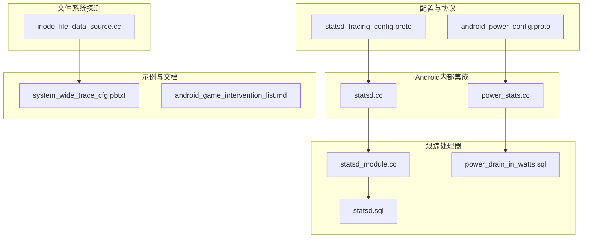
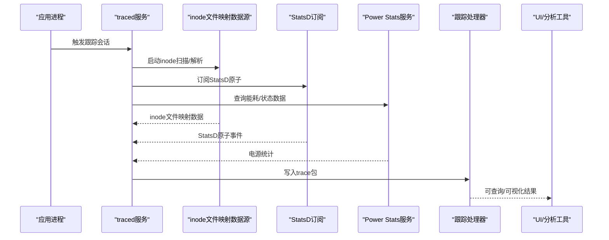
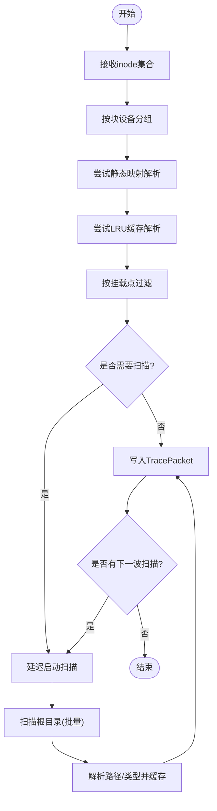
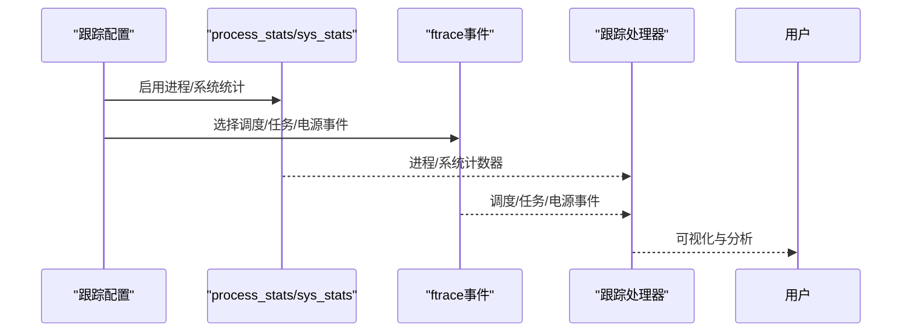
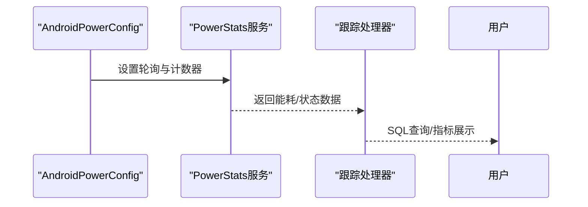
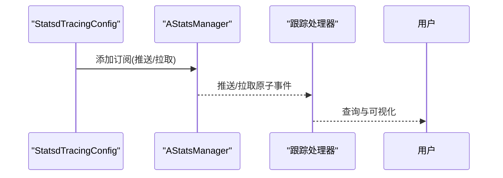
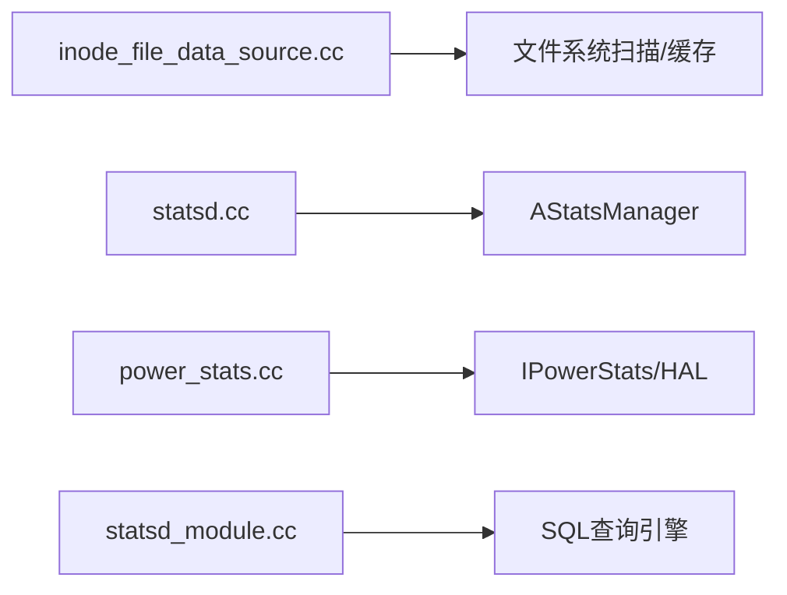

# 应用程序数据源

<cite>
**本文引用的文件**
- [android_power_config.proto](file://protos/perfetto/config/power/android_power_config.proto)
- [statsd_tracing_config.proto](file://protos/perfetto/config/statsd/statsd_tracing_config.proto)
- [statsd.cc](file://src/android_internal/statsd.cc)
- [power_stats.cc](file://src/android_internal/power_stats.cc)
- [inode_file_data_source.cc](file://src/traced/probes/filesystem/inode_file_data_source.cc)
- [system_wide_trace_cfg.pbtxt](file://examples/sdk/system_wide_trace_cfg.pbtxt)
- [statsd_module.cc](file://src/trace_processor/importers/proto/statsd_module.cc)
- [statsd.sql](file://src/trace_processor/perfetto_sql/stdlib/android/statsd.sql)
- [power_drain_in_watts.sql](file://src/trace_processor/metrics/sql/android/power_drain_in_watts.sql)
- [android_game_intervention_list.md](file://docs/data-sources/android-game-intervention-list.md)
</cite>

## 目录
1. [简介](#简介)
2. [项目结构](#项目结构)
3. [核心组件](#核心组件)
4. [架构总览](#架构总览)
5. [详细组件分析](#详细组件分析)
6. [依赖关系分析](#依赖关系分析)
7. [性能考量](#性能考量)
8. [故障排查指南](#故障排查指南)
9. [结论](#结论)
10. [附录](#附录)

## 简介
本文件聚焦于Perfetto中的“应用程序级别”数据源，涵盖以下能力：
- 文件系统活动监控：通过inode文件映射数据源，追踪与特定inode关联的路径与类型，辅助定位应用I/O热点与异常文件占用。
- 进程状态跟踪：结合系统级进程统计与内核调度事件，刻画应用进程生命周期、上下文切换与资源消耗。
- 电源使用统计：通过Android Power Stats服务采集电池计数器、能耗分解、实体状态驻留等数据，量化应用对功耗的影响。
- StatsD指标收集：订阅StatsD推送/拉取原子（Atom）指标，实现应用维度的性能与健康度观测。
- 包信息监控：结合包名过滤与UI插件特性，对特定应用的CPU、电量、干预策略等进行可视化与分析。

这些数据源共同帮助开发者在真实设备上捕获应用的运行时行为与性能特征，支撑性能分析与故障诊断。

## 项目结构
围绕应用程序数据源的关键目录与文件：
- 配置协议定义：用于在跟踪配置中启用与定制各数据源的行为。
- Android内部集成：封装StatsD订阅与Power Stats服务访问，桥接系统服务与Perfetto数据流。
- 文件系统探测：基于inode扫描与缓存，构建块设备到inode到路径的映射。
- 跟踪处理器模块：解析StatsD与电源相关trace数据，提供SQL查询与指标。
- 示例配置：展示如何组合多数据源以覆盖应用层I/O、进程、电源与事件跟踪。

**图示来源**
- [android_power_config.proto:1-54](file://protos/perfetto/config/power/android_power_config.proto#L1-54)
- [statsd_tracing_config.proto:1-45](file://protos/perfetto/config/statsd/statsd_tracing_config.proto#L1-45)
- [statsd.cc:1-50](file://src/android_internal/statsd.cc#L1-50)
- [power_stats.cc:1-510](file://src/android_internal/power_stats.cc#L1-510)
- [inode_file_data_source.cc:1-409](file://src/traced/probes/filesystem/inode_file_data_source.cc#L1-409)
- [statsd_module.cc](file://src/trace_processor/importers/proto/statsd_module.cc)
- [statsd.sql](file://src/trace_processor/perfetto_sql/stdlib/android/statsd.sql)
- [power_drain_in_watts.sql](file://src/trace_processor/metrics/sql/android/power_drain_in_watts.sql)
- [system_wide_trace_cfg.pbtxt:1-46](file://examples/sdk/system_wide_trace_cfg.pbtxt#L1-L46)
- [android_game_intervention_list.md:38-51](file://docs/data-sources/android-game-intervention-list.md#L38-L51)

**章节来源**
- [android_power_config.proto:1-54](file://protos/perfetto/config/power/android_power_config.proto#L1-54)
- [statsd_tracing_config.proto:1-45](file://protos/perfetto/config/statsd/statsd_tracing_config.proto#L1-45)
- [statsd.cc:1-50](file://src/android_internal/statsd.cc#L1-50)
- [power_stats.cc:1-510](file://src/android_internal/power_stats.cc#L1-510)
- [inode_file_data_source.cc:1-409](file://src/traced/probes/filesystem/inode_file_data_source.cc#L1-409)
- [statsd_module.cc](file://src/trace_processor/importers/proto/statsd_module.cc)
- [statsd.sql](file://src/trace_processor/perfetto_sql/stdlib/android/statsd.sql)
- [power_drain_in_watts.sql](file://src/trace_processor/metrics/sql/android/power_drain_in_watts.sql)
- [system_wide_trace_cfg.pbtxt:1-46](file://examples/sdk/system_wide_trace_cfg.pbtxt#L1-L46)
- [android_game_intervention_list.md:38-51](file://docs/data-sources/android-game-intervention-list.md#L38-L51)

## 核心组件
- Android电源配置（AndroidPowerConfig）
  - 支持轮询电池计数器（电荷、容量百分比、瞬时/平均电流、电压），可选开启电源分路测量、能耗估计分解、实体状态驻留等高级能力。
  - 适用于Android S及以上版本的AIDL接口，以及更早版本的HAL接口。
- StatsD追踪配置（StatsdTracingConfig）
  - 定义推送/拉取原子（Atom）ID列表，支持已知枚举与原始ID的混合配置，便于跨版本兼容与扩展。
- StatsD订阅与Power Stats服务
  - 通过AStatsManager订阅StatsD原子，按需移除或刷新订阅；Power Stats服务统一提供能耗、实体状态、状态驻留等数据。
- inode文件映射数据源
  - 基于挂载点扫描与静态映射/缓存解析inode，输出块设备ID、挂载点与路径集合，辅助定位应用I/O热点。
- 跟踪处理器与SQL
  - 解析StatsD与电源trace，提供标准SQL查询与指标（如功耗换算）。

**章节来源**
- [android_power_config.proto:21-53](file://protos/perfetto/config/power/android_power_config.proto#L21-L53)
- [statsd_tracing_config.proto:28-44](file://protos/perfetto/config/statsd/statsd_tracing_config.proto#L28-L44)
- [statsd.cc:25-46](file://src/android_internal/statsd.cc#L25-L46)
- [power_stats.cc:46-152](file://src/android_internal/power_stats.cc#L46-L152)
- [inode_file_data_source.cc:82-139](file://src/traced/probes/filesystem/inode_file_data_source.cc#L82-L139)

## 架构总览
下图展示了从配置到采集、处理与可视化的端到端流程，突出应用程序层面的数据源如何协同工作。

**图示来源**
- [inode_file_data_source.cc:143-267](file://src/traced/probes/filesystem/inode_file_data_source.cc#L143-L267)
- [statsd.cc:25-46](file://src/android_internal/statsd.cc#L25-L46)
- [power_stats.cc:127-152](file://src/android_internal/power_stats.cc#L127-L152)
- [statsd_module.cc](file://src/trace_processor/importers/proto/statsd_module.cc)
- [statsd.sql](file://src/trace_processor/perfetto_sql/stdlib/android/statsd.sql)

## 详细组件分析

### 文件系统活动监控（inode文件映射）
- 数据源名称与职责
  - 名称：linux.inode_file_map
  - 职责：在收到inode集合后，优先匹配静态映射与LRU缓存，再按需扫描挂载点根目录，填充路径与类型，并输出块设备ID与挂载点信息。
- 关键参数
  - 扫描间隔、延迟、批大小、挂载点过滤、映射根目录替换、禁用扫描等。
- 工作流
  - 接收来自内核/探测器的inode集合，按块设备聚合。
  - 优先从静态映射与缓存解析，剩余未解析inode进入延迟扫描队列。
  - 扫描完成后写入TracePacket并刷新。
- 性能要点
  - 扫描延迟与批大小控制I/O与CPU占用。
  - 挂载点过滤减少无关文件系统的扫描范围。
  - 静态映射与缓存显著降低重复解析成本。

**图示来源**
- [inode_file_data_source.cc:194-402](file://src/traced/probes/filesystem/inode_file_data_source.cc#L194-L402)

**章节来源**
- [inode_file_data_source.cc:82-139](file://src/traced/probes/filesystem/inode_file_data_source.cc#L82-L139)
- [inode_file_data_source.cc:143-267](file://src/traced/probes/filesystem/inode_file_data_source.cc#L143-L267)
- [inode_file_data_source.cc:269-402](file://src/traced/probes/filesystem/inode_file_data_source.cc#L269-L402)

### 进程状态跟踪（配合系统级统计与事件）
- 配置要点
  - 使用linux.process_stats与linux.sys_stats数据源，结合ftrace事件（调度、任务、电源）。
  - 示例配置展示如何启用进程统计与系统统计，并设置事件集。
- 典型用途
  - 结合进程树、线程切换、fork速率、CPU时间等，定位应用的CPU占用模式与阻塞点。
- 与文件系统监控联动
  - inode映射可与进程打开文件、内存映射等事件关联，形成I/O瓶颈定位闭环。

**图示来源**
- [system_wide_trace_cfg.pbtxt:5-46](file://examples/sdk/system_wide_trace_cfg.pbtxt#L5-L46)

**章节来源**
- [system_wide_trace_cfg.pbtxt:1-46](file://examples/sdk/system_wide_trace_cfg.pbtxt#L1-L46)

### 电源使用统计（Android Power）
- 配置项
  - 电池轮询周期与计数器集合；可选开启电源分路、能耗估计分解、实体状态驻留。
- 服务适配
  - 自动选择AIDL或HAL接口，兼容不同Android版本。
- 指标与分析
  - 功耗换算SQL可用于将能量单位转换为功率单位，辅助计算应用对整体功耗的贡献。
- 与StatsD联动
  - 可通过StatsD原子补充应用维度的CPU使用率等指标，结合电源数据进行综合分析。

**图示来源**
- [android_power_config.proto:21-53](file://protos/perfetto/config/power/android_power_config.proto#L21-L53)
- [power_stats.cc:127-152](file://src/android_internal/power_stats.cc#L127-L152)
- [power_drain_in_watts.sql](file://src/trace_processor/metrics/sql/android/power_drain_in_watts.sql)

**章节来源**
- [android_power_config.proto:21-53](file://protos/perfetto/config/power/android_power_config.proto#L21-L53)
- [power_stats.cc:127-152](file://src/android_internal/power_stats.cc#L127-L152)
- [power_drain_in_watts.sql](file://src/trace_processor/metrics/sql/android/power_drain_in_watts.sql)

### StatsD指标收集（应用维度观测）
- 配置方式
  - 通过StatsdTracingConfig指定推送/拉取原子ID，支持枚举与原始ID，便于扩展非上游原子。
- 订阅机制
  - 通过AStatsManager建立订阅，必要时移除或刷新，确保低开销与可控的数据流。
- 处理与查询
  - 跟踪处理器导入StatsD事件，提供标准SQL查询与可视化。
- 实战示例
  - 游戏干预列表数据源示例展示了如何按包名过滤并聚焦特定应用。

**图示来源**
- [statsd_tracing_config.proto:28-44](file://protos/perfetto/config/statsd/statsd_tracing_config.proto#L28-L44)
- [statsd.cc:25-46](file://src/android_internal/statsd.cc#L25-L46)
- [statsd_module.cc](file://src/trace_processor/importers/proto/statsd_module.cc)
- [statsd.sql](file://src/trace_processor/perfetto_sql/stdlib/android/statsd.sql)
- [android_game_intervention_list.md:38-51](file://docs/data-sources/android-game-intervention-list.md#L38-L51)

**章节来源**
- [statsd_tracing_config.proto:28-44](file://protos/perfetto/config/statsd/statsd_tracing_config.proto#L28-L44)
- [statsd.cc:25-46](file://src/android_internal/statsd.cc#L25-L46)
- [statsd_module.cc](file://src/trace_processor/importers/proto/statsd_module.cc)
- [statsd.sql](file://src/trace_processor/perfetto_sql/stdlib/android/statsd.sql)
- [android_game_intervention_list.md:38-51](file://docs/data-sources/android-game-intervention-list.md#L38-L51)

### 包信息监控（应用维度）
- 包名过滤
  - 在数据源配置中加入包名过滤，仅关注目标应用，降低噪声。
- UI插件特性
  - 利用UI插件特性检测与可视化，例如按UID/集群展示CPU占比，辅助定位高耗CPU应用。
- 与电源/StatsD联动
  - 将包维度的CPU使用与能耗分解结合，形成应用功耗画像。

**章节来源**
- [android_game_intervention_list.md:38-51](file://docs/data-sources/android-game-intervention-list.md#L38-L51)
- [statsd.sql](file://src/trace_processor/perfetto_sql/stdlib/android/statsd.sql)

## 依赖关系分析
- 组件耦合
  - inode文件映射数据源依赖挂载点解析与扫描器，同时与LRU缓存协作提升命中率。
  - StatsD与Power Stats分别依赖系统服务（AStatsManager与IPowerStats/HAL），通过轻量回调与轮询实现低侵入采集。
- 外部依赖
  - Android HAL/AIDL接口版本差异由Power Stats适配层自动处理。
  - 跟踪处理器依赖trace包格式与SQL引擎，提供统一查询入口。
- 潜在循环依赖
  - 当前实现采用单向数据流（探测器/服务 -> traced -> TP），无明显循环依赖风险。

**图示来源**
- [inode_file_data_source.cc:1-409](file://src/traced/probes/filesystem/inode_file_data_source.cc#L1-L409)
- [statsd.cc:19-46](file://src/android_internal/statsd.cc#L19-L46)
- [power_stats.cc:38-123](file://src/android_internal/power_stats.cc#L38-L123)
- [statsd_module.cc](file://src/trace_processor/importers/proto/statsd_module.cc)

**章节来源**
- [inode_file_data_source.cc:1-409](file://src/traced/probes/filesystem/inode_file_data_source.cc#L1-L409)
- [statsd.cc:19-46](file://src/android_internal/statsd.cc#L19-L46)
- [power_stats.cc:38-123](file://src/android_internal/power_stats.cc#L38-L123)
- [statsd_module.cc](file://src/trace_processor/importers/proto/statsd_module.cc)

## 性能考量
- 开销评估
  - inode扫描：扫描间隔与批大小直接影响I/O与CPU占用；建议根据设备存储规模与trace时长调整。
  - StatsD订阅：按需订阅原子，避免不必要的推送/拉取；及时移除不再需要的订阅。
  - 电源轮询：电池计数器轮询周期越短，精度越高但开销越大；可在长时间trace中适当增大周期。
- 优化建议
  - 使用挂载点过滤与映射根目录替换，缩小扫描范围。
  - 启用静态映射与LRU缓存，减少重复解析。
  - 合理设置ftrace事件集，仅保留与问题定位相关的事件。
  - 对于长时trace，优先使用拉取式StatsD配置，降低持续推送带来的带宽压力。
  - 在UI侧按需加载可视化轨道，避免一次性渲染过多数据。

[本节为通用指导，无需列出具体文件来源]

## 故障排查指南
- inode扫描未命中
  - 检查挂载点过滤与映射根目录配置，确认目标路径已被纳入扫描范围。
  - 查看扫描延迟与批大小设置，避免过早终止或批次过小导致遗漏。
- StatsD无数据
  - 确认订阅ID与包名过滤正确；检查订阅是否被移除或刷新。
  - 在UI插件中确认特性开关已启用相应指标。
- 电源数据缺失
  - 确认设备满足Android版本要求（AIDL接口可用）；检查服务声明与权限。
  - 若服务死亡，适配层会重置连接，可稍后重试或重启trace会话。
- 性能抖动
  - 降低扫描频率与批大小，或关闭不需要的事件与数据源。
  - 合理裁剪ftrace事件集，避免过多上下文切换事件影响吞吐。

**章节来源**
- [inode_file_data_source.cc:226-267](file://src/traced/probes/filesystem/inode_file_data_source.cc#L226-L267)
- [statsd.cc:40-46](file://src/android_internal/statsd.cc#L40-L46)
- [power_stats.cc:280-287](file://src/android_internal/power_stats.cc#L280-L287)
- [power_stats.cc:476-482](file://src/android_internal/power_stats.cc#L476-L482)

## 结论
Perfetto的应用程序数据源通过inode文件映射、进程/系统统计、电源统计、StatsD指标与包信息监控，形成了从I/O、CPU、电源到事件的全链路观测体系。合理配置与调优这些数据源，能够有效支撑应用性能分析与故障诊断。建议在实际使用中结合业务场景，按需启用数据源并动态调整参数，以平衡观测精度与系统开销。

[本节为总结性内容，无需列出具体文件来源]

## 附录
- 配置示例参考
  - 系统级跟踪配置示例展示了如何组合进程统计、系统统计与ftrace事件。
  - 游戏干预列表数据源示例展示了包名过滤的典型用法。
- 相关SQL与指标
  - StatsD与电源相关的SQL查询与指标，便于直接在跟踪处理器中执行。

**章节来源**
- [system_wide_trace_cfg.pbtxt:1-46](file://examples/sdk/system_wide_trace_cfg.pbtxt#L1-L46)
- [android_game_intervention_list.md:38-51](file://docs/data-sources/android-game-intervention-list.md#L38-L51)
- [statsd.sql](file://src/trace_processor/perfetto_sql/stdlib/android/statsd.sql)
- [power_drain_in_watts.sql](file://src/trace_processor/metrics/sql/android/power_drain_in_watts.sql)