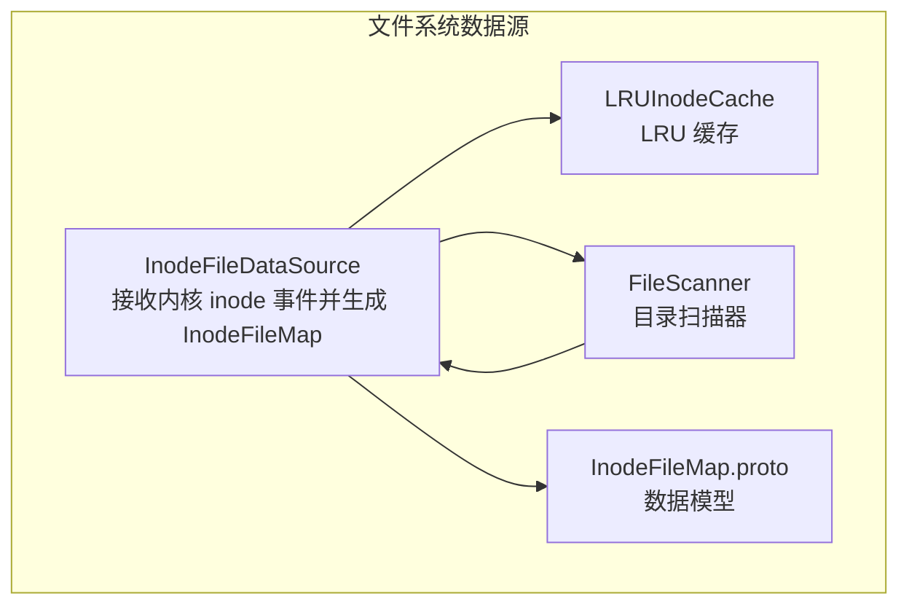
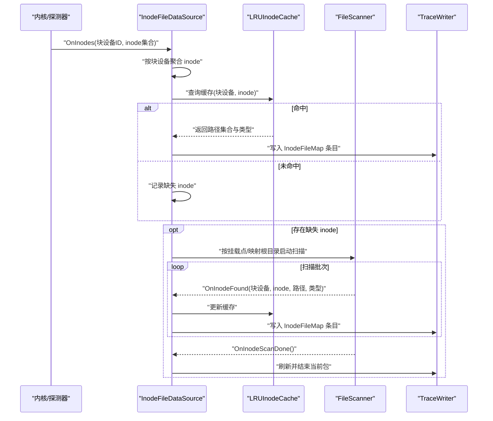
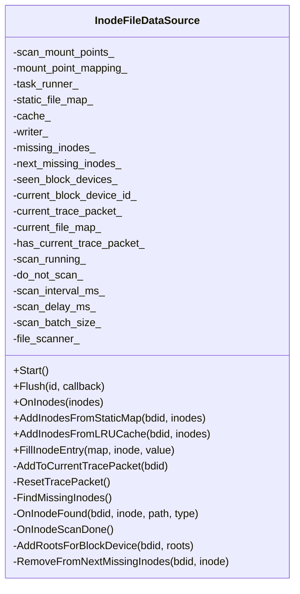
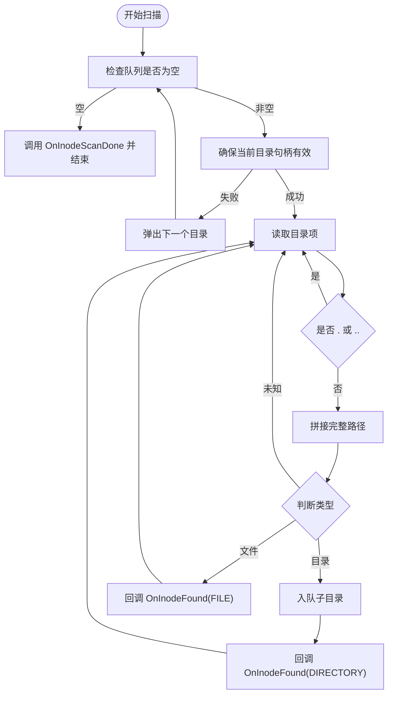
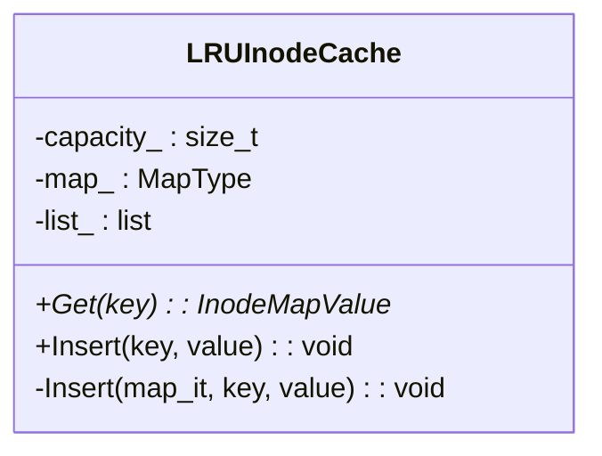
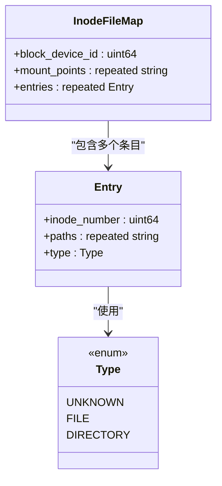
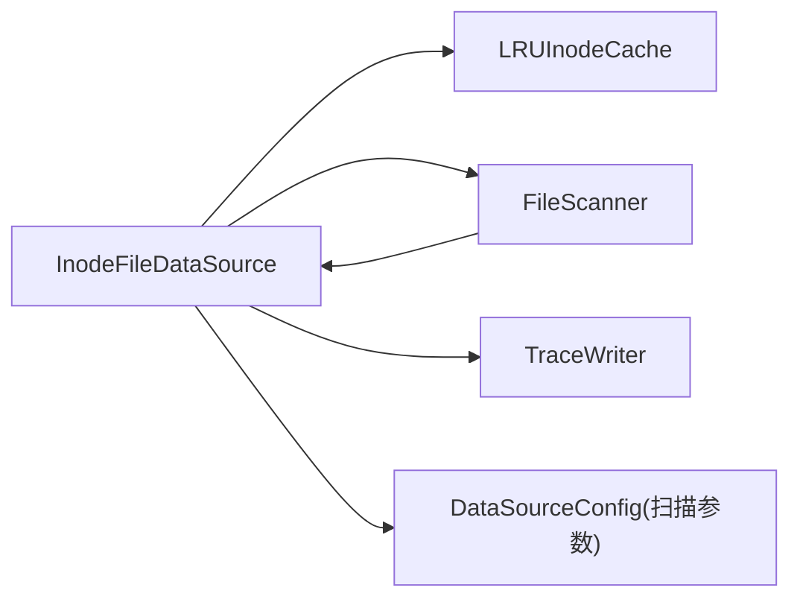

# 文件系统数据源

<cite>
**本文引用的文件**
- [inode_file_data_source.cc](file://src/traced/probes/filesystem/inode_file_data_source.cc)
- [inode_file_data_source.h](file://src/traced/probes/filesystem/inode_file_data_source.h)
- [file_scanner.cc](file://src/traced/probes/filesystem/file_scanner.cc)
- [file_scanner.h](file://src/traced/probes/filesystem/file_scanner.h)
- [lru_inode_cache.cc](file://src/traced/probes/filesystem/lru_inode_cache.cc)
- [lru_inode_cache.h](file://src/traced/probes/filesystem/lru_inode_cache.h)
- [inode_file_map.proto](file://protos/perfetto/trace/filesystem/inode_file_map.proto)
</cite>

## 目录
1. [引言](#引言)
2. [项目结构](#项目结构)
3. [核心组件](#核心组件)
4. [架构总览](#架构总览)
5. [详细组件分析](#详细组件分析)
6. [依赖关系分析](#依赖关系分析)
7. [性能考量](#性能考量)
8. [故障排查指南](#故障排查指南)
9. [结论](#结论)
10. [附录](#附录)

## 引言
本技术文档围绕 Perfetto 的“文件系统数据源”展开，重点解释其如何在系统级捕获与文件系统相关的活动，包括但不限于：文件 I/O 操作、目录访问、文件锁（通过内核 ftrace 路径关联）、以及文件系统事件（如创建、删除、权限变更等）。该数据源的核心目标是将内核层面的 inode 事件与用户态的文件路径映射结合，形成可被 Trace Processor 分析的结构化数据，从而支持 I/O 性能分析、文件访问模式分析与存储性能优化。

## 项目结构
文件系统数据源位于 traced 探针子系统中，围绕 inode 映射、扫描器与缓存三部分协作实现：
- inode 映射数据源：负责接收来自内核的 inode 列表，解析挂载点，按块设备聚合，并尝试从静态映射与 LRU 缓存中解析路径与类型，必要时触发动态扫描。
- 文件扫描器：对指定根目录进行广度优先遍历，按批次与延迟策略逐步扫描，回调委托以产出 inode 路径与类型。
- LRU inode 缓存：维护块设备+inode 到路径集合与类型的快速映射，降低重复解析成本。

图表来源
- [inode_file_data_source.cc:109-139](file://src/traced/probes/filesystem/inode_file_data_source.cc#L109-L139)
- [file_scanner.cc:42-77](file://src/traced/probes/filesystem/file_scanner.cc#L42-L77)
- [lru_inode_cache.cc:21-57](file://src/traced/probes/filesystem/lru_inode_cache.cc#L21-L57)
- [inode_file_map.proto:22-47](file://protos/perfetto/trace/filesystem/inode_file_map.proto#L22-L47)

章节来源
- [inode_file_data_source.cc:109-139](file://src/traced/probes/filesystem/inode_file_data_source.cc#L109-L139)
- [file_scanner.cc:42-77](file://src/traced/probes/filesystem/file_scanner.cc#L42-L77)
- [lru_inode_cache.cc:21-57](file://src/traced/probes/filesystem/lru_inode_cache.cc#L21-L57)
- [inode_file_map.proto:22-47](file://protos/perfetto/trace/filesystem/inode_file_map.proto#L22-L47)

## 核心组件
- InodeFileDataSource：作为探针数据源，接收内核传入的 inode 集合，按块设备分组，优先从静态映射与 LRU 缓存解析路径与类型；若仍缺失，则延迟调度 FileScanner 进行动态扫描，并将结果写入 TracePacket 中的 InodeFileMap。
- FileScanner：基于 opendir/readdir 的目录扫描器，支持批量步进与延迟调度，逐条回调委托，产出 inode、路径与类型。
- LRUInodeCache：以块设备+inode 为键的 LRU 缓存，用于快速复用已解析的路径集合与类型。
- InodeFileMap.proto：定义了块设备 ID、挂载点列表与条目列表的数据结构，条目包含 inode 号、路径集合与类型枚举。

章节来源
- [inode_file_data_source.h:53-132](file://src/traced/probes/filesystem/inode_file_data_source.h#L53-L132)
- [file_scanner.h:30-71](file://src/traced/probes/filesystem/file_scanner.h#L30-L71)
- [lru_inode_cache.h:29-51](file://src/traced/probes/filesystem/lru_inode_cache.h#L29-L51)
- [inode_file_map.proto:22-47](file://protos/perfetto/trace/filesystem/inode_file_map.proto#L22-L47)

## 架构总览
下图展示了从内核事件到最终 Trace 数据包的端到端流程：

图表来源
- [inode_file_data_source.cc:200-267](file://src/traced/probes/filesystem/inode_file_data_source.cc#L200-L267)
- [inode_file_data_source.cc:301-332](file://src/traced/probes/filesystem/inode_file_data_source.cc#L301-L332)
- [inode_file_data_source.cc:342-369](file://src/traced/probes/filesystem/inode_file_data_source.cc#L342-L369)
- [file_scanner.cc:59-77](file://src/traced/probes/filesystem/file_scanner.cc#L59-L77)
- [file_scanner.cc:108-146](file://src/traced/probes/filesystem/file_scanner.cc#L108-L146)

## 详细组件分析

### InodeFileDataSource 组件
职责与行为
- 接收内核事件：处理来自内核的 inode 集合，按块设备聚合，尝试从静态映射与 LRU 缓存解析路径与类型。
- 动态扫描调度：当存在未解析的 inode 时，根据挂载点或配置的扫描根目录，延迟调度 FileScanner 执行扫描。
- TracePacket 管理：按块设备生成独立的 InodeFileMap，填充块设备 ID 与挂载点列表，并将条目写入当前包。
- 缓存更新：将扫描结果写入 LRU 缓存，以便后续命中。

关键接口与成员
- OnInodes：入口事件处理，聚合与解析。
- AddInodesFromStaticMap / AddInodesFromLRUCache：分别从静态映射与缓存解析 inode。
- OnInodeFound / OnInodeScanDone：FileScanner 委托回调，更新缓存与写入数据。
- AddToCurrentTracePacket / ResetTracePacket：管理当前 TracePacket 生命周期。
- FindMissingInodes / AddRootsForBlockDevice：计算扫描根目录并启动扫描。

图表来源
- [inode_file_data_source.h:53-132](file://src/traced/probes/filesystem/inode_file_data_source.h#L53-L132)

章节来源
- [inode_file_data_source.cc:109-139](file://src/traced/probes/filesystem/inode_file_data_source.cc#L109-L139)
- [inode_file_data_source.cc:200-267](file://src/traced/probes/filesystem/inode_file_data_source.cc#L200-L267)
- [inode_file_data_source.cc:301-332](file://src/traced/probes/filesystem/inode_file_data_source.cc#L301-L332)
- [inode_file_data_source.cc:342-369](file://src/traced/probes/filesystem/inode_file_data_source.cc#L342-L369)
- [inode_file_data_source.h:53-132](file://src/traced/probes/filesystem/inode_file_data_source.h#L53-L132)

### FileScanner 组件
职责与行为
- 目录遍历：基于队列的广度优先遍历，跳过无效目录与符号链接，识别块设备 ID。
- 批量与延迟：支持按批次执行 Step 并通过 TaskRunner 延迟调度，避免阻塞。
- 委托回调：对每个文件/目录调用委托，传递 inode、路径与类型，允许中断扫描。

关键接口与成员
- Scan / Scan(TaskRunner)：同步与异步扫描入口。
- Step / Steps：单步与多步执行。
- NextDirectory：打开下一个目录并初始化块设备 ID。
- Delegate 回调：OnInodeFound / OnInodeScanDone。

图表来源
- [file_scanner.cc:59-77](file://src/traced/probes/filesystem/file_scanner.cc#L59-L77)
- [file_scanner.cc:108-146](file://src/traced/probes/filesystem/file_scanner.cc#L108-L146)

章节来源
- [file_scanner.cc:42-77](file://src/traced/probes/filesystem/file_scanner.cc#L42-L77)
- [file_scanner.cc:108-146](file://src/traced/probes/filesystem/file_scanner.cc#L108-L146)
- [file_scanner.h:30-71](file://src/traced/probes/filesystem/file_scanner.h#L30-L71)

### LRUInodeCache 组件
职责与行为
- 键值映射：以 (块设备 ID, inode) 为键，映射到路径集合与类型。
- LRU 更新：每次访问将条目移动至链表前端，容量超限时淘汰尾部。
- 插入与查询：支持插入新条目与按键查询并提升位置。

图表来源
- [lru_inode_cache.h:29-51](file://src/traced/probes/filesystem/lru_inode_cache.h#L29-L51)

章节来源
- [lru_inode_cache.cc:21-57](file://src/traced/probes/filesystem/lru_inode_cache.cc#L21-L57)
- [lru_inode_cache.h:29-51](file://src/traced/probes/filesystem/lru_inode_cache.h#L29-L51)

### 数据模型（InodeFileMap）
- 块设备 ID：标识所属块设备。
- 挂载点列表：记录该块设备的挂载点名称。
- 条目列表：每条目包含 inode 号、路径集合（支持硬链接）与类型枚举（文件/目录/未知）。

图表来源
- [inode_file_map.proto:22-47](file://protos/perfetto/trace/filesystem/inode_file_map.proto#L22-L47)

章节来源
- [inode_file_map.proto:22-47](file://protos/perfetto/trace/filesystem/inode_file_map.proto#L22-L47)

## 依赖关系分析
- InodeFileDataSource 依赖：
  - LRUInodeCache：用于快速解析 inode 路径与类型。
  - FileScanner：用于动态扫描缺失 inode 对应的路径。
  - TraceWriter：用于生成 TracePacket 与 InodeFileMap。
  - 配置解析：从 DataSourceConfig 中读取扫描间隔、延迟、批次大小与挂载点映射。
- FileScanner 依赖：
  - Delegate 接口：由 InodeFileDataSource 实现，负责接收扫描结果并写入缓存与 TracePacket。
  - TaskRunner：用于异步调度扫描任务。
- LRUInodeCache 依赖：
  - 标准容器：map 与 list，实现 O(log N) 查询与 O(1) 更新。

图表来源
- [inode_file_data_source.cc:109-139](file://src/traced/probes/filesystem/inode_file_data_source.cc#L109-L139)
- [file_scanner.cc:42-77](file://src/traced/probes/filesystem/file_scanner.cc#L42-L77)
- [lru_inode_cache.cc:21-57](file://src/traced/probes/filesystem/lru_inode_cache.cc#L21-L57)

章节来源
- [inode_file_data_source.cc:109-139](file://src/traced/probes/filesystem/inode_file_data_source.cc#L109-L139)
- [file_scanner.cc:42-77](file://src/traced/probes/filesystem/file_scanner.cc#L42-L77)
- [lru_inode_cache.cc:21-57](file://src/traced/probes/filesystem/lru_inode_cache.cc#L21-L57)

## 性能考量
- 扫描策略
  - 批次与延迟：通过 scan_batch_size 与 scan_interval_ms 控制扫描吞吐与 CPU 占用，避免一次性全量扫描造成抖动。
  - 延迟启动：首次发现缺失 inode 后延迟 scan_delay_ms 再启动，减少频繁抖动。
- 缓存命中
  - LRU 缓存显著降低重复解析成本，建议合理设置容量以平衡内存占用与命中率。
- 聚合写入
  - 按块设备聚合写入，减少 TracePacket 数量，提高序列化效率。
- I/O 影响
  - 目录扫描属于顺序读取，对磁盘压力有限；但大量并发扫描可能放大随机 I/O，需结合业务场景调整批次与延迟。
- 配置建议
  - 默认扫描间隔与延迟：适合通用场景；高负载服务器可适当增大间隔与批次，降低峰值影响。
  - 挂载点过滤：仅扫描必要挂载点，缩小扫描范围。
  - 关闭扫描：在不需要动态解析时启用 do_not_scan，完全依赖静态映射与缓存。

## 故障排查指南
- 扫描未生效
  - 检查是否设置了 scan_mount_points 或 mount_point_mapping，确认挂载点与根目录映射正确。
  - 确认 do_not_scan 未被错误启用。
- 解析路径为空
  - 若静态映射与缓存均未命中，需确认扫描根目录是否覆盖对应路径，或等待扫描完成。
  - 检查挂载点是否被过滤，导致扫描被跳过。
- 性能异常
  - 增大 scan_interval_ms 与 scan_batch_size，降低扫描频率与单次工作量。
  - 检查是否存在大量硬链接导致路径集合膨胀，必要时在上层聚合去重。
- Trace 包异常
  - 确保 Flush 正常触发，避免包未 Finalize 导致数据不完整。

章节来源
- [inode_file_data_source.cc:226-242](file://src/traced/probes/filesystem/inode_file_data_source.cc#L226-L242)
- [inode_file_data_source.cc:342-369](file://src/traced/probes/filesystem/inode_file_data_source.cc#L342-L369)
- [file_scanner.cc:64-77](file://src/traced/probes/filesystem/file_scanner.cc#L64-L77)

## 结论
文件系统数据源通过“静态映射 + LRU 缓存 + 动态扫描”的组合，实现了对内核 inode 事件的高效解析与输出。它既能满足低开销场景下的路径解析需求，又能在需要时通过延迟与批次控制进行可控的动态扫描。配合 Trace Processor，用户可以进行 I/O 性能分析、文件访问模式分析与存储性能优化。

## 附录

### 使用场景与配置要点
- I/O 性能分析
  - 通过 InodeFileMap 的路径与类型，定位热点文件与目录，结合内核 ftrace 的系统调用事件进行端到端分析。
- 文件访问模式分析
  - 基于路径集合与类型统计，识别频繁访问的文件与目录，辅助业务优化。
- 存储性能优化
  - 结合挂载点与块设备 ID，定位慢盘与高争用区域，指导容量与布局规划。

### 监控粒度与配置项
- 扫描间隔（scan_interval_ms）：控制扫描批次之间的延迟，默认值适合大多数场景。
- 扫描延迟（scan_delay_ms）：首次发现缺失 inode 后的延迟启动时间，避免瞬时抖动。
- 扫描批次（scan_batch_size）：单次扫描处理的目录项数量，平衡吞吐与响应性。
- 挂载点过滤（scan_mount_points）：限制扫描范围，仅对特定挂载点生效。
- 挂载点映射（mount_point_mapping）：将挂载点映射到实际扫描根目录，便于跨平台适配。
- 关闭扫描（do_not_scan）：禁用动态扫描，仅依赖静态映射与缓存。

章节来源
- [inode_file_data_source.cc:123-138](file://src/traced/probes/filesystem/inode_file_data_source.cc#L123-L138)
- [inode_file_data_source.h:110-129](file://src/traced/probes/filesystem/inode_file_data_source.h#L110-L129)