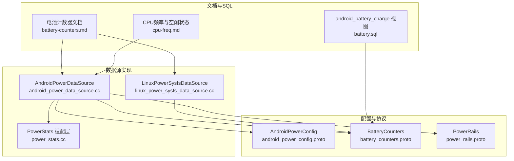
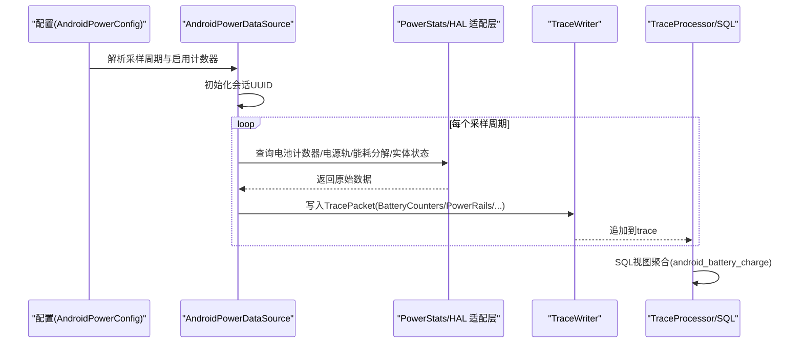
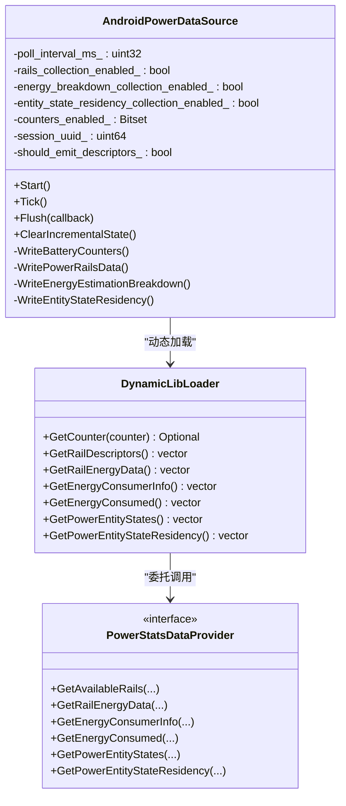
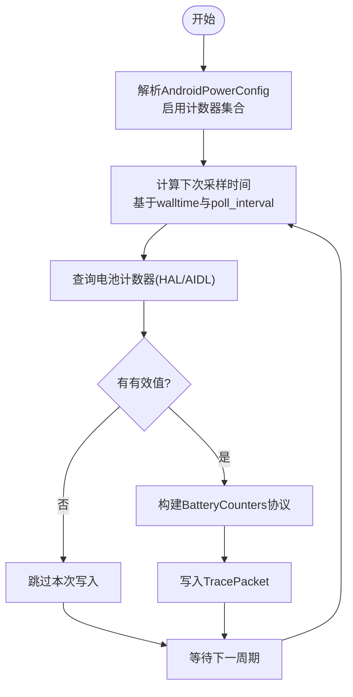
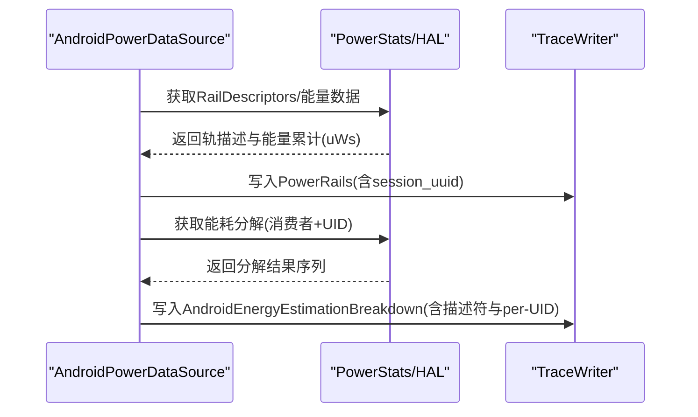
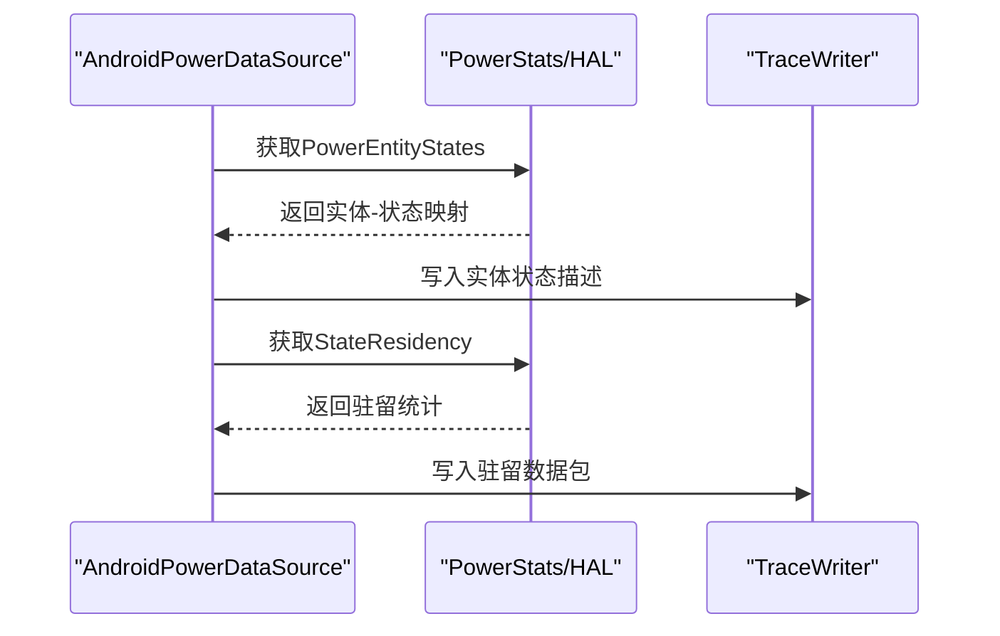
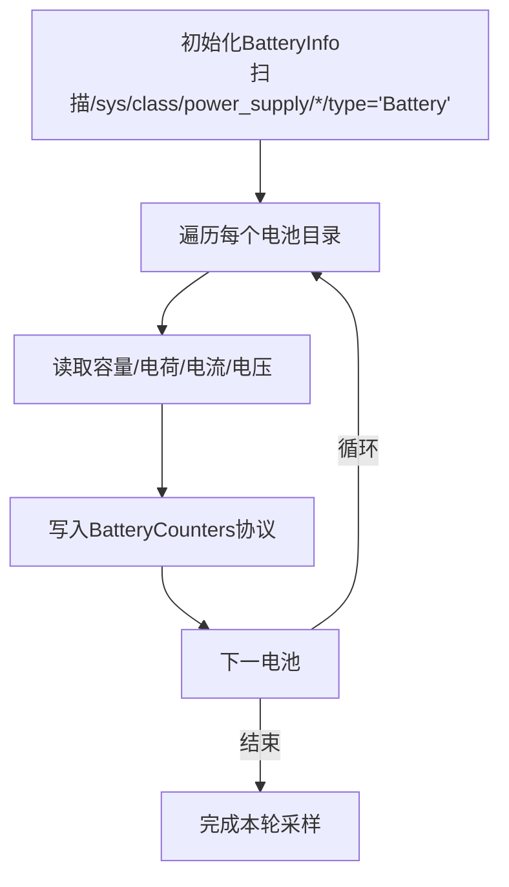
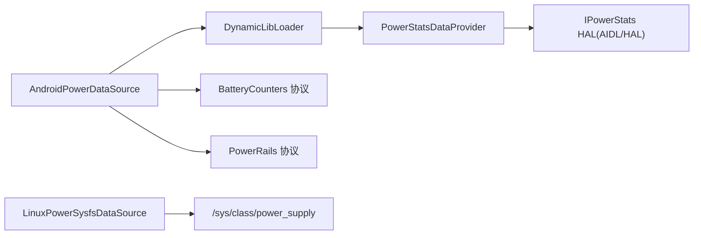

# 电源使用数据源

<cite>
**本文引用的文件**
- [android_power_data_source.cc](file://src/traced/probes/power/android_power_data_source.cc)
- [power_stats.cc](file://src/android_internal/power_stats.cc)
- [battery-counters.md](file://docs/data-sources/battery-counters.md)
- [battery.sql](file://src/trace_processor/perfetto_sql/stdlib/android/battery.sql)
- [linux_power_sysfs_data_source.cc](file://src/traced/probes/power/linux_power_sysfs_data_source.cc)
- [android_power_config.proto](file://protos/perfetto/config/power/android_power_config.proto)
- [battery_counters.proto](file://protos/perfetto/trace/power/battery_counters.proto)
- [power_rails.proto](file://protos/perfetto/trace/power/power_rails.proto)
- [cpu-freq.md](file://docs/data-sources/cpu-freq.md)
</cite>

## 目录
1. [简介](#简介)
2. [项目结构](#项目结构)
3. [核心组件](#核心组件)
4. [架构总览](#架构总览)
5. [详细组件分析](#详细组件分析)
6. [依赖关系分析](#依赖关系分析)
7. [性能考量](#性能考量)
8. [故障排查指南](#故障排查指南)
9. [结论](#结论)
10. [附录](#附录)

## 简介
本技术文档围绕 Perfetto 的电源使用数据源展开，系统性阐述设备电池电量、充电状态、功耗统计与电源管理事件的采集机制。文档重点覆盖以下方面：
- 电池计数器（容量百分比、剩余电荷、瞬时/平均电流、电压）的采集与建模
- 电源轨（Power Rails）与能耗分解（Energy Estimation Breakdown）的采集与分析
- 电源实体状态驻留（Entity State Residency）的采集与解读
- 在移动设备上对应用层面的电池影响进行溯源：CPU 频率调整、屏幕亮度、网络使用等电源相关因素
- 配置示例、使用场景与精度设置，以及功耗建模方法

该数据源在 Android 上通过 IHealth HAL 与 IPowerStats HAL 获取底层硬件计数器，在 Linux/ChromeOS 上通过 sysfs 能源接口采集。

## 项目结构
与电源使用数据源直接相关的代码与文档分布如下：
- 数据源实现
  - Android 电源数据源：src/traced/probes/power/android_power_data_source.cc
  - Linux 电源数据源（sysfs）：src/traced/probes/power/linux_power_sysfs_data_source.cc
  - Android 内部电源统计适配层：src/android_internal/power_stats.cc
- 配置与协议
  - Android 电源配置协议：protos/perfetto/config/power/android_power_config.proto
  - 电池计数器协议：protos/perfetto/trace/power/battery_counters.proto
  - 电源轨协议：protos/perfetto/trace/power/power_rails.proto
- 文档与 SQL 视图
  - 电池计数器文档：docs/data-sources/battery-counters.md
  - Android 电池视图 SQL：src/trace_processor/perfetto_sql/stdlib/android/battery.sql
  - CPU 频率与空闲状态文档：docs/data-sources/cpu-freq.md

**图表来源**
- [android_power_data_source.cc:174-237](file://src/traced/probes/power/android_power_data_source.cc#L174-L237)
- [linux_power_sysfs_data_source.cc:137-148](file://src/traced/probes/power/linux_power_sysfs_data_source.cc#L137-L148)
- [power_stats.cc:110-123](file://src/android_internal/power_stats.cc#L110-L123)
- [android_power_config.proto:21-53](file://protos/perfetto/config/power/android_power_config.proto#L21-L53)
- [battery_counters.proto:20-46](file://protos/perfetto/trace/power/battery_counters.proto#L20-L46)
- [power_rails.proto:20-56](file://protos/perfetto/trace/power/power_rails.proto#L20-L56)
- [battery-counters.md:1-169](file://docs/data-sources/battery-counters.md#L1-L169)
- [battery.sql:16-134](file://src/trace_processor/perfetto_sql/stdlib/android/battery.sql#L16-L134)
- [cpu-freq.md:1-171](file://docs/data-sources/cpu-freq.md#L1-L171)

**章节来源**
- [android_power_data_source.cc:174-237](file://src/traced/probes/power/android_power_data_source.cc#L174-L237)
- [linux_power_sysfs_data_source.cc:137-148](file://src/traced/probes/power/linux_power_sysfs_data_source.cc#L137-L148)
- [power_stats.cc:110-123](file://src/android_internal/power_stats.cc#L110-L123)
- [android_power_config.proto:21-53](file://protos/perfetto/config/power/android_power_config.proto#L21-L53)
- [battery_counters.proto:20-46](file://protos/perfetto/trace/power/battery_counters.proto#L20-L46)
- [power_rails.proto:20-56](file://protos/perfetto/trace/power/power_rails.proto#L20-L56)
- [battery-counters.md:1-169](file://docs/data-sources/battery-counters.md#L1-L169)
- [battery.sql:16-134](file://src/trace_processor/perfetto_sql/stdlib/android/battery.sql#L16-L134)
- [cpu-freq.md:1-171](file://docs/data-sources/cpu-freq.md#L1-L171)

## 核心组件
- Android 电源数据源（android.power）
  - 支持电池计数器采集（容量百分比、电荷量、瞬时/平均电流、电压）
  - 可选采集电源轨（Power Rails）与能耗分解（Energy Estimation Breakdown）
  - 可选采集电源实体状态驻留（Entity State Residency）
  - 通过 Android PowerStats HAL（AIDL/HAL）与 IHealth HAL 获取底层计数器
- Linux 电源数据源（linux.sysfs_power）
  - 通过 /sys/class/power_supply 读取电池计数器（容量、电荷、电流、电压）
  - 适用于多电池系统，并可按电池名称区分
- 电源统计适配层（power_stats）
  - 统一封装 HAL/AIDL 接口差异，向上提供统一的数据访问能力
  - 提供电源轨、能耗分解、实体状态等高级功能
- 配置与协议
  - AndroidPowerConfig 控制采样周期、启用的电池计数器类型、是否采集电源轨/能耗分解/实体状态
  - BatteryCounters、PowerRails 协议定义了 trace 中的字段与语义
- SQL 视图与文档
  - android_battery_charge 视图将分散的计数器聚合为统一查询接口
  - 文档说明采样原理、UI 展示与 TraceConfig 示例

**章节来源**
- [android_power_data_source.cc:52-57](file://src/traced/probes/power/android_power_data_source.cc#L52-L57)
- [android_power_data_source.cc:194-237](file://src/traced/probes/power/android_power_data_source.cc#L194-L237)
- [linux_power_sysfs_data_source.cc:130-135](file://src/traced/probes/power/linux_power_sysfs_data_source.cc#L130-L135)
- [power_stats.cc:110-123](file://src/android_internal/power_stats.cc#L110-L123)
- [android_power_config.proto:21-53](file://protos/perfetto/config/power/android_power_config.proto#L21-L53)
- [battery_counters.proto:20-46](file://protos/perfetto/trace/power/battery_counters.proto#L20-L46)
- [power_rails.proto:20-56](file://protos/perfetto/trace/power/power_rails.proto#L20-L56)
- [battery.sql:16-134](file://src/trace_processor/perfetto_sql/stdlib/android/battery.sql#L16-L134)
- [battery-counters.md:1-169](file://docs/data-sources/battery-counters.md#L1-L169)

## 架构总览
Android 电源数据源的运行流程如下：
- 初始化阶段：解析 AndroidPowerConfig，确定采样周期与启用的计数器类型；初始化会话 UUID
- 定时采样：基于 TaskRunner 按周期触发 Tick，向 HAL/AIDL 查询计数器与高级指标
- 数据写入：将电池计数器、电源轨、能耗分解、实体状态驻留写入 TracePacket
- 增量状态：首次或清空后发送描述符包，后续仅发送增量数据

**图表来源**
- [android_power_data_source.cc:194-237](file://src/traced/probes/power/android_power_data_source.cc#L194-L237)
- [android_power_data_source.cc:241-271](file://src/traced/probes/power/android_power_data_source.cc#L241-L271)
- [android_power_data_source.cc:273-315](file://src/traced/probes/power/android_power_data_source.cc#L273-L315)
- [android_power_data_source.cc:317-352](file://src/traced/probes/power/android_power_data_source.cc#L317-L352)
- [android_power_data_source.cc:354-403](file://src/traced/probes/power/android_power_data_source.cc#L354-L403)
- [android_power_data_source.cc:405-440](file://src/traced/probes/power/android_power_data_source.cc#L405-L440)
- [battery.sql:16-134](file://src/trace_processor/perfetto_sql/stdlib/android/battery.sql#L16-L134)

**章节来源**
- [android_power_data_source.cc:194-237](file://src/traced/probes/power/android_power_data_source.cc#L194-L237)
- [android_power_data_source.cc:241-271](file://src/traced/probes/power/android_power_data_source.cc#L241-L271)
- [android_power_data_source.cc:273-315](file://src/traced/probes/power/android_power_data_source.cc#L273-L315)
- [android_power_data_source.cc:317-352](file://src/traced/probes/power/android_power_data_source.cc#L317-L352)
- [android_power_data_source.cc:354-403](file://src/traced/probes/power/android_power_data_source.cc#L354-L403)
- [android_power_data_source.cc:405-440](file://src/traced/probes/power/android_power_data_source.cc#L405-L440)
- [battery.sql:16-134](file://src/trace_processor/perfetto_sql/stdlib/android/battery.sql#L16-L134)

## 详细组件分析

### Android 电源数据源类图

**图表来源**
- [android_power_data_source.cc:52-57](file://src/traced/probes/power/android_power_data_source.cc#L52-L57)
- [android_power_data_source.cc:61-172](file://src/traced/probes/power/android_power_data_source.cc#L61-L172)
- [power_stats.cc:46-61](file://src/android_internal/power_stats.cc#L46-L61)

**章节来源**
- [android_power_data_source.cc:52-57](file://src/traced/probes/power/android_power_data_source.cc#L52-L57)
- [android_power_data_source.cc:61-172](file://src/traced/probes/power/android_power_data_source.cc#L61-L172)
- [power_stats.cc:46-61](file://src/android_internal/power_stats.cc#L46-L61)

### 电池计数器采集流程
- 配置解析：根据 AndroidPowerConfig 启用的计数器类型，构建位掩码
- 采样周期：默认 1000ms，最小 100ms，避免过高的采样频率导致开销
- 数据写入：将当前时间戳与计数器值写入 BatteryCounters 协议消息
- 与 SQL 视图：android_battery_charge 将多个计数器 track 聚合为统一视图

**图表来源**
- [android_power_data_source.cc:194-237](file://src/traced/probes/power/android_power_data_source.cc#L194-L237)
- [android_power_data_source.cc:246-271](file://src/traced/probes/power/android_power_data_source.cc#L246-L271)
- [android_power_data_source.cc:273-315](file://src/traced/probes/power/android_power_data_source.cc#L273-L315)
- [battery.sql:16-134](file://src/trace_processor/perfetto_sql/stdlib/android/battery.sql#L16-L134)

**章节来源**
- [android_power_data_source.cc:194-237](file://src/traced/probes/power/android_power_data_source.cc#L194-L237)
- [android_power_data_source.cc:246-271](file://src/traced/probes/power/android_power_data_source.cc#L246-L271)
- [android_power_data_source.cc:273-315](file://src/traced/probes/power/android_power_data_source.cc#L273-L315)
- [battery.sql:16-134](file://src/trace_processor/perfetto_sql/stdlib/android/battery.sql#L16-L134)

### 电源轨与能耗分解采集
- 电源轨（Power Rails）
  - 通过 IPowerStats HAL 获取轨描述与能量累计值（uWs），并携带会话 UUID 以匹配描述符
- 能耗分解（Energy Estimation Breakdown）
  - 从 Android S 开始可用，按能耗消费者（如 GPU、NPU 等）聚合，并支持 UID 级别分解
  - 采用增量状态写入，首包发送描述符，后续包仅发送数据

**图表来源**
- [android_power_data_source.cc:317-352](file://src/traced/probes/power/android_power_data_source.cc#L317-L352)
- [android_power_data_source.cc:354-403](file://src/traced/probes/power/android_power_data_source.cc#L354-L403)
- [power_rails.proto:20-56](file://protos/perfetto/trace/power/power_rails.proto#L20-L56)

**章节来源**
- [android_power_data_source.cc:317-352](file://src/traced/probes/power/android_power_data_source.cc#L317-L352)
- [android_power_data_source.cc:354-403](file://src/traced/probes/power/android_power_data_source.cc#L354-L403)
- [power_rails.proto:20-56](file://protos/perfetto/trace/power/power_rails.proto#L20-L56)

### 实体状态驻留采集
- 通过 IPowerStats HAL 获取电源实体（如蓝牙、PCIe-Modem）及其状态（Idle/Active/UP/DOWN）
- 记录实体在各状态下的累计驻留时间、进入次数与最后进入时间
- 用于评估硬件子系统的活跃度与节能策略效果

**图表来源**
- [android_power_data_source.cc:405-440](file://src/traced/probes/power/android_power_data_source.cc#L405-L440)

**章节来源**
- [android_power_data_source.cc:405-440](file://src/traced/probes/power/android_power_data_source.cc#L405-L440)

### Linux sysfs 电源数据源
- 通过遍历 /sys/class/power_supply 下的电池目录，读取 charge_now、energy_now、current_now、voltage_now、capacity 等字段
- 多电池系统下按电池名区分输出
- 默认采样周期 1000ms

**图表来源**
- [linux_power_sysfs_data_source.cc:49-72](file://src/traced/probes/power/linux_power_sysfs_data_source.cc#L49-L72)
- [linux_power_sysfs_data_source.cc:171-202](file://src/traced/probes/power/linux_power_sysfs_data_source.cc#L171-L202)

**章节来源**
- [linux_power_sysfs_data_source.cc:49-72](file://src/traced/probes/power/linux_power_sysfs_data_source.cc#L49-L72)
- [linux_power_sysfs_data_source.cc:171-202](file://src/traced/probes/power/linux_power_sysfs_data_source.cc#L171-L202)

## 依赖关系分析
- 组件耦合
  - AndroidPowerDataSource 依赖 DynamicLibLoader，后者封装 HAL/AIDL 调用
  - PowerStatsDataProvider 抽象不同版本 HAL 的差异，向上提供统一接口
- 外部依赖
  - Android 平台：IPowerStats HAL（AIDL/HAL）、IHealth HAL
  - Linux 平台：/sys/class/power_supply 文件系统接口
- 协议依赖
  - BatteryCounters、PowerRails、AndroidEnergyEstimationBreakdown、EntityStateResidency 等协议定义了 trace 结构

**图表来源**
- [android_power_data_source.cc:61-172](file://src/traced/probes/power/android_power_data_source.cc#L61-L172)
- [power_stats.cc:110-123](file://src/android_internal/power_stats.cc#L110-L123)
- [linux_power_sysfs_data_source.cc:171-202](file://src/traced/probes/power/linux_power_sysfs_data_source.cc#L171-L202)
- [battery_counters.proto:20-46](file://protos/perfetto/trace/power/battery_counters.proto#L20-L46)
- [power_rails.proto:20-56](file://protos/perfetto/trace/power/power_rails.proto#L20-L56)

**章节来源**
- [android_power_data_source.cc:61-172](file://src/traced/probes/power/android_power_data_source.cc#L61-L172)
- [power_stats.cc:110-123](file://src/android_internal/power_stats.cc#L110-L123)
- [linux_power_sysfs_data_source.cc:171-202](file://src/traced/probes/power/linux_power_sysfs_data_source.cc#L171-L202)
- [battery_counters.proto:20-46](file://protos/perfetto/trace/power/battery_counters.proto#L20-L46)
- [power_rails.proto:20-56](file://protos/perfetto/trace/power/power_rails.proto#L20-L56)

## 性能考量
- 采样频率与开销
  - 默认采样周期 1000ms，最小 100ms；过低的频率会导致数据稀疏，过高则增加系统负担
  - 电池计数器通常由硬件直接测量，开销较低；电源轨与能耗分解涉及 HAL 调用，需谨慎启用
- 数据传输与存储
  - 采用 TracePacket 批量写入，配合增量状态减少冗余描述符
  - 多电池系统下建议按需启用名称字段，避免过多 track 导致 UI 与存储压力
- 能耗建模建议
  - 以 uWs（微瓦秒）为单位进行能耗累积更贴近硬件测量
  - 结合 CPU 频率与空闲状态（cpufreq/cpuidle）进行功率估算，参考 CPU 频率数据源文档

[本节为通用指导，无需特定文件来源]

## 故障排查指南
- 无法获取计数器
  - 检查设备是否支持相应硬件（如 IHealth HAL/IPowerStats HAL）
  - 确认配置中启用的计数器类型与设备能力匹配
- 采样频率过低或过高
  - 调整 AndroidPowerConfig 中的 battery_poll_ms，确保不低于最小值
- 充电状态干扰
  - 电池计数器在充电时显示正电流与电荷增长属正常现象；可在离线环境下测试或使用设备特定方法断开充电
- 多电池系统
  - 使用 linux.sysfs_power 时，注意按电池名称区分不同电池的计数器
- SQL 查询异常
  - 使用 android_battery_charge 视图进行聚合查询，确保计数器 track 名称一致

**章节来源**
- [battery-counters.md:37-60](file://docs/data-sources/battery-counters.md#L37-L60)
- [android_power_data_source.cc:207-212](file://src/traced/probes/power/android_power_data_source.cc#L207-L212)
- [linux_power_sysfs_data_source.cc:198-201](file://src/traced/probes/power/linux_power_sysfs_data_source.cc#L198-L201)
- [battery.sql:16-134](file://src/trace_processor/perfetto_sql/stdlib/android/battery.sql#L16-L134)

## 结论
Perfetto 的电源使用数据源提供了从设备级硬件计数器到应用级能耗分解的完整链路。通过合理配置采样周期与启用项，结合 SQL 视图与 UI，可以高效地进行移动应用的能耗分析、电池续航优化与电源效率评估。在实际使用中，应关注设备硬件支持情况、采样频率与系统开销之间的平衡，并结合 CPU 频率、空闲状态等数据源进行综合建模。

[本节为总结性内容，无需特定文件来源]

## 附录

### 配置示例与使用场景
- Android 电源数据源（启用多项电池计数器与电源轨）
  - 参考 TraceConfig 示例与协议字段定义
- Linux/ChromeOS 电源数据源（sysfs）
  - 适用于多电池系统与无专用 HAL 的环境
- 与 CPU 频率数据源联动
  - 结合 cpufreq/cpuidle 事件与空闲状态，评估 CPU 功率贡献

**章节来源**
- [battery-counters.md:88-113](file://docs/data-sources/battery-counters.md#L88-L113)
- [battery-counters.md:150-164](file://docs/data-sources/battery-counters.md#L150-L164)
- [cpu-freq.md:121-152](file://docs/data-sources/cpu-freq.md#L121-L152)

### 数据模型与协议要点
- 电池计数器
  - 字段：电荷（µAh）、容量（%）、瞬时/平均电流（µA）、电压（µV）、能量计数（µWh）
- 电源轨
  - 字段：轨索引、名称、子系统、采样率、累计能量（uWs）
- 能耗分解
  - 字段：消费者标识、UID 分解、能量（uWs）

**章节来源**
- [battery_counters.proto:20-46](file://protos/perfetto/trace/power/battery_counters.proto#L20-L46)
- [power_rails.proto:20-56](file://protos/perfetto/trace/power/power_rails.proto#L20-L56)
- [android_power_config.proto:21-53](file://protos/perfetto/config/power/android_power_config.proto#L21-L53)