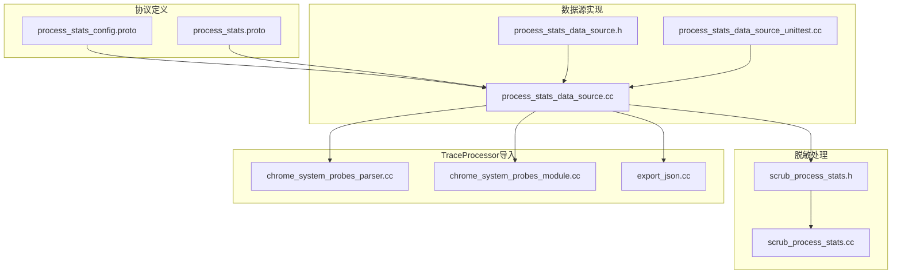
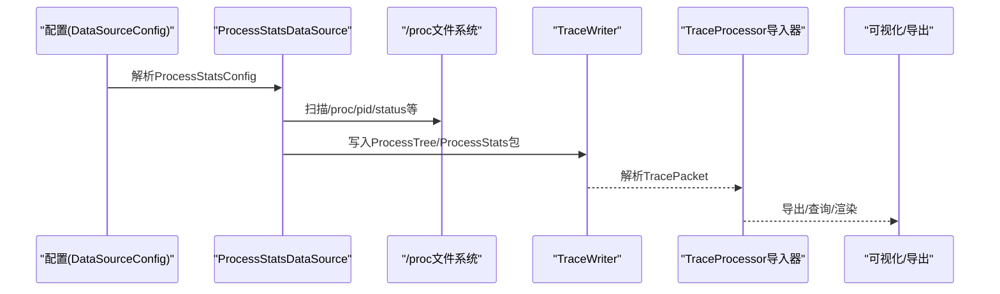
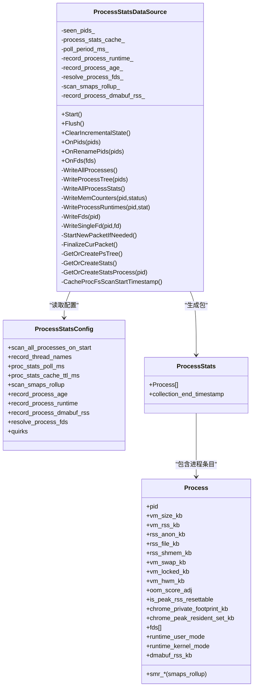
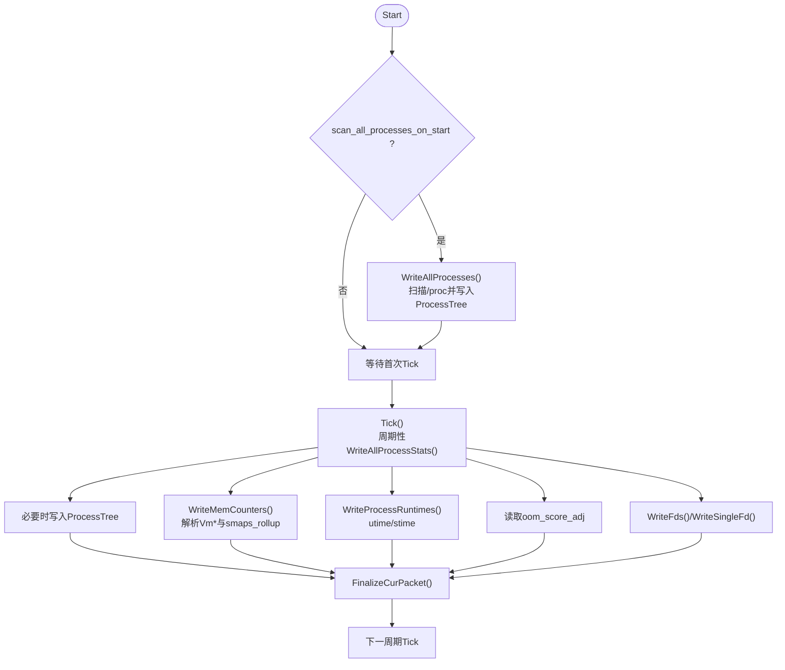
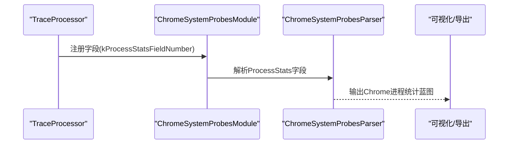
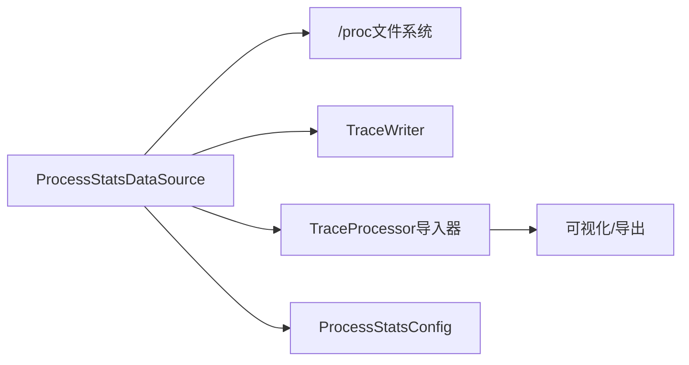

# 进程状态数据源

<cite>
**本文引用的文件**
- [process_stats_data_source.h](file://src/traced/probes/ps/process_stats_data_source.h)
- [process_stats_data_source.cc](file://src/traced/probes/ps/process_stats_data_source.cc)
- [process_stats_data_source_unittest.cc](file://src/traced/probes/ps/process_stats_data_source_unittest.cc)
- [process_stats_config.proto](file://protos/perfetto/config/process_stats/process_stats_config.proto)
- [process_stats.proto](file://protos/perfetto/trace/ps/process_stats.proto)
- [scrub_process_stats.cc](file://src/trace_redaction/scrub_process_stats.cc)
- [scrub_process_stats.h](file://src/trace_redaction/scrub_process_stats.h)
- [chrome_system_probes_parser.cc](file://src/trace_processor/importers/proto/chrome_system_probes_parser.cc)
- [chrome_system_probes_module.cc](file://src/trace_processor/importers/proto/chrome_system_probes_module.cc)
- [export_json.cc](file://src/trace_processor/export_json.cc)
- [android-trace-analysis.md](file://docs/getting-started/android-trace-analysis.md)
- [memory-counters.md](file://docs/data-sources/memory-counters.md)
- [cpu-profiling.md](file://docs/getting-started/cpu-profiling.md)
- [scheduling-blockages.md](file://docs/case-studies/scheduling-blockages.md)
</cite>

## 目录
1. [简介](#简介)
2. [项目结构](#项目结构)
3. [核心组件](#核心组件)
4. [架构总览](#架构总览)
5. [详细组件分析](#详细组件分析)
6. [依赖关系分析](#依赖关系分析)
7. [性能考量](#性能考量)
8. [故障排查指南](#故障排查指南)
9. [结论](#结论)
10. [附录](#附录)

## 简介
本技术文档围绕 Perfetto 的“进程状态数据源”（linux.process_stats）展开，系统性阐述其在进程生命周期监控中的作用：包括进程创建/终止/重命名、进程树结构、线程活动、内存与运行时统计等的采集与建模；解释数据源如何通过周期性扫描 /proc 文件系统实现资源使用情况的采样；并给出配置要点、使用场景、性能开销与采样频率建议，帮助读者在实际分析中高效利用该数据源进行进程分析、并发性能评估与资源竞争检测。

## 项目结构
与进程状态数据源直接相关的代码与配置位于以下位置：
- 数据源实现：src/traced/probes/ps/process_stats_data_source.{h,cc}
- 配置协议：protos/perfetto/config/process_stats/process_stats_config.proto
- 跟踪包协议：protos/perfetto/trace/ps/process_stats.proto
- 测试用例：src/traced/probes/ps/process_stats_data_source_unittest.cc
- 脱敏处理：src/trace_redaction/scrub_process_stats.{h,cc}
- TraceProcessor 导入器：src/trace_processor/importers/proto/chrome_system_probes_parser.cc、chrome_system_probes_module.cc
- 可视化导出：src/trace_processor/export_json.cc
- 文档示例：docs/getting-started/android-trace-analysis.md、docs/data-sources/memory-counters.md、docs/getting-started/cpu-profiling.md、docs/case-studies/scheduling-blockages.md

**图表来源**
- [process_stats_data_source.h:1-199](file://src/traced/probes/ps/process_stats_data_source.h#L1-L199)
- [process_stats_data_source.cc:1-847](file://src/traced/probes/ps/process_stats_data_source.cc#L1-L847)
- [process_stats_config.proto:1-99](file://protos/perfetto/config/process_stats/process_stats_config.proto#L1-L99)
- [process_stats.proto:1-108](file://protos/perfetto/trace/ps/process_stats.proto#L1-L108)
- [chrome_system_probes_parser.cc:29-71](file://src/trace_processor/importers/proto/chrome_system_probes_parser.cc#L29-L71)
- [chrome_system_probes_module.cc:33-43](file://src/trace_processor/importers/proto/chrome_system_probes_module.cc#L33-L43)
- [export_json.cc:1349-1377](file://src/trace_processor/export_json.cc#L1349-L1377)
- [scrub_process_stats.h](file://src/trace_redaction/scrub_process_stats.h)
- [scrub_process_stats.cc](file://src/trace_redaction/scrub_process_stats.cc)

**章节来源**
- [process_stats_data_source.h:1-199](file://src/traced/probes/ps/process_stats_data_source.h#L1-L199)
- [process_stats_data_source.cc:1-847](file://src/traced/probes/ps/process_stats_data_source.cc#L1-L847)
- [process_stats_config.proto:1-99](file://protos/perfetto/config/process_stats/process_stats_config.proto#L1-L99)
- [process_stats.proto:1-108](file://protos/perfetto/trace/ps/process_stats.proto#L1-L108)

## 核心组件
- 数据源类：ProcessStatsDataSource
  - 负责周期性扫描 /proc 并生成两类包：进程树（ProcessTree）与进程统计（ProcessStats）
  - 支持按需抓取（OnPids/OnRenamePids）与全量启动扫描（scan_all_processes_on_start）
  - 提供缓存与去重机制，降低重复写入与 I/O 压力
- 配置项：ProcessStatsConfig
  - 控制采样周期、是否记录线程名、是否扫描 smaps_rollup、是否记录进程年龄与用户/内核态运行时、是否记录 DMA-BUF RSS 等
- 协议模型：ProcessStats 与 ProcessTree
  - ProcessStats 包含内存计数器、OOM 分数调整、可选的 Chrome 私有占用与峰值 RSS、文件描述符列表、可选的 smaps_rollup 指标、用户/内核态运行时、DMA-BUF RSS 等
  - ProcessTree 包含进程与线程关系、命令行、父进程、UID、命名空间 PID、是否为内核线程等

**章节来源**
- [process_stats_data_source.h:49-194](file://src/traced/probes/ps/process_stats_data_source.h#L49-L194)
- [process_stats_data_source.cc:168-206](file://src/traced/probes/ps/process_stats_data_source.cc#L168-L206)
- [process_stats_config.proto:25-98](file://protos/perfetto/config/process_stats/process_stats_config.proto#L25-L98)
- [process_stats.proto:26-107](file://protos/perfetto/trace/ps/process_stats.proto#L26-L107)

## 架构总览
下图展示了从配置到采集、写包、导入与可视化的整体流程。

**图表来源**
- [process_stats_data_source.cc:210-219](file://src/traced/probes/ps/process_stats_data_source.cc#L210-L219)
- [process_stats_data_source.cc:543-617](file://src/traced/probes/ps/process_stats_data_source.cc#L543-L617)
- [chrome_system_probes_parser.cc:40-71](file://src/trace_processor/importers/proto/chrome_system_probes_parser.cc#L40-L71)
- [export_json.cc:1349-1377](file://src/trace_processor/export_json.cc#L1349-L1377)

## 详细组件分析

### 类关系与职责

**图表来源**
- [process_stats_data_source.h:49-194](file://src/traced/probes/ps/process_stats_data_source.h#L49-L194)
- [process_stats_config.proto:25-98](file://protos/perfetto/config/process_stats/process_stats_config.proto#L25-L98)
- [process_stats.proto:26-107](file://protos/perfetto/trace/ps/process_stats.proto#L26-L107)

**章节来源**
- [process_stats_data_source.h:49-194](file://src/traced/probes/ps/process_stats_data_source.h#L49-L194)
- [process_stats_data_source.cc:168-206](file://src/traced/probes/ps/process_stats_data_source.cc#L168-L206)
- [process_stats_config.proto:25-98](file://protos/perfetto/config/process_stats/process_stats_config.proto#L25-L98)
- [process_stats.proto:26-107](file://protos/perfetto/trace/ps/process_stats.proto#L26-L107)

### 生命周期与事件流
- 启动阶段
  - 若启用“启动时全量扫描”，则在 Start() 中调用 WriteAllProcesses()，扫描所有 /proc 下的 PID，填充进程树与线程关系，并可选地解析 smaps_rollup、dmabuf_rss 等
- 周期采样
  - 通过定时器以 poll_period_ms 为周期触发 Tick()，周期性读取 /proc/pid/stat 与 /proc/pid/status，更新内存计数器、OOM 分数、运行时等
  - 使用缓存与 TTL 降低重复写入与 I/O 开销
- 按需抓取
  - OnPids()/OnRenamePids() 在需要时抓取指定 PID 的进程树信息，避免全量扫描带来的开销
- 清理增量状态
  - ClearIncrementalState() 清空 seen_pids_/skip_mem_for_pids_/缓存等，同时在下一个包中标记增量状态已清理

**图表来源**
- [process_stats_data_source.cc:210-219](file://src/traced/probes/ps/process_stats_data_source.cc#L210-L219)
- [process_stats_data_source.cc:522-541](file://src/traced/probes/ps/process_stats_data_source.cc#L522-L541)
- [process_stats_data_source.cc:543-617](file://src/traced/probes/ps/process_stats_data_source.cc#L543-L617)
- [process_stats_data_source.cc:619-636](file://src/traced/probes/ps/process_stats_data_source.cc#L619-L636)
- [process_stats_data_source.cc:641-785](file://src/traced/probes/ps/process_stats_data_source.cc#L641-L785)
- [process_stats_data_source.cc:787-825](file://src/traced/probes/ps/process_stats_data_source.cc#L787-L825)
- [process_stats_data_source.cc:505-520](file://src/traced/probes/ps/process_stats_data_source.cc#L505-L520)

**章节来源**
- [process_stats_data_source.cc:210-219](file://src/traced/probes/ps/process_stats_data_source.cc#L210-L219)
- [process_stats_data_source.cc:522-541](file://src/traced/probes/ps/process_stats_data_source.cc#L522-L541)
- [process_stats_data_source.cc:543-617](file://src/traced/probes/ps/process_stats_data_source.cc#L543-L617)
- [process_stats_data_source.cc:619-636](file://src/traced/probes/ps/process_stats_data_source.cc#L619-L636)
- [process_stats_data_source.cc:641-785](file://src/traced/probes/ps/process_stats_data_source.cc#L641-L785)
- [process_stats_data_source.cc:787-825](file://src/traced/probes/ps/process_stats_data_source.cc#L787-L825)
- [process_stats_data_source.cc:505-520](file://src/traced/probes/ps/process_stats_data_source.cc#L505-L520)

### TraceProcessor 导入与可视化
- 导入器模块会注册对 ProcessStats 字段的解析，将 Chrome 特定指标（如 Chrome 私有占用、峰值 RSS）映射到可视化蓝图
- 导出 JSON 时，针对 ProcessStats 类型进行专门处理，确保前端可视化正确显示

**图表来源**
- [chrome_system_probes_module.cc:33-43](file://src/trace_processor/importers/proto/chrome_system_probes_module.cc#L33-L43)
- [chrome_system_probes_parser.cc:40-71](file://src/trace_processor/importers/proto/chrome_system_probes_parser.cc#L40-L71)
- [export_json.cc:1349-1377](file://src/trace_processor/export_json.cc#L1349-L1377)

**章节来源**
- [chrome_system_probes_module.cc:33-43](file://src/trace_processor/importers/proto/chrome_system_probes_module.cc#L33-L43)
- [chrome_system_probes_parser.cc:40-71](file://src/trace_processor/importers/proto/chrome_system_probes_parser.cc#L40-L71)
- [export_json.cc:1349-1377](file://src/trace_processor/export_json.cc#L1349-L1377)

### 脱敏与隐私保护
- 在 TraceRedaction 阶段，提供针对进程统计的脱敏逻辑，确保敏感信息在共享或发布前被清洗

**章节来源**
- [scrub_process_stats.h](file://src/trace_redaction/scrub_process_stats.h)
- [scrub_process_stats.cc](file://src/trace_redaction/scrub_process_stats.cc)

## 依赖关系分析
- 外部接口依赖
  - /proc 文件系统：status/stat/cmdline/smaps_rollup/dmabuf_rss 等
  - 内核时钟节拍：用于将 utime/stime 转换为纳秒
- 内部耦合
  - 与 TraceWriter 协作生成 TracePacket，区分 ProcessTree 与 ProcessStats
  - 与 TraceProcessor 导入器协作，将 ProcessStats 映射为可视化指标
- 配置驱动
  - ProcessStatsConfig 决定采样频率、是否记录线程名、是否扫描 smaps_rollup、是否记录运行时与 DMA-BUF RSS 等

**图表来源**
- [process_stats_data_source.cc:449-464](file://src/traced/probes/ps/process_stats_data_source.cc#L449-L464)
- [process_stats_data_source.cc:466-520](file://src/traced/probes/ps/process_stats_data_source.cc#L466-L520)
- [process_stats_config.proto:25-98](file://protos/perfetto/config/process_stats/process_stats_config.proto#L25-L98)
- [chrome_system_probes_module.cc:33-43](file://src/trace_processor/importers/proto/chrome_system_probes_module.cc#L33-L43)

**章节来源**
- [process_stats_data_source.cc:449-464](file://src/traced/probes/ps/process_stats_data_source.cc#L449-L464)
- [process_stats_data_source.cc:466-520](file://src/traced/probes/ps/process_stats_data_source.cc#L466-L520)
- [process_stats_config.proto:25-98](file://protos/perfetto/config/process_stats/process_stats_config.proto#L25-L98)
- [chrome_system_probes_module.cc:33-43](file://src/trace_processor/importers/proto/chrome_system_probes_module.cc#L33-L43)

## 性能考量
- 采样频率与最小阈值
  - 采样周期 proc_stats_poll_ms 必须 ≥ 100ms，低于此值会被自动提升，以避免过高 CPU 开销
- 缓存与去抖
  - 使用缓存与 TTL（proc_stats_cache_ttl_ms）减少重复写入；对无内存计数器的内核线程进行跳过，避免无效 I/O
- I/O 优化
  - 仅在必要时解析 smaps_rollup 与 dmabuf_rss，且后者需要特定内核支持
- 增量状态清理
  - ClearIncrementalState() 会在包头标记增量状态已清理，避免 UI/分析误判历史状态

**章节来源**
- [process_stats_data_source.cc:194-205](file://src/traced/probes/ps/process_stats_data_source.cc#L194-L205)
- [process_stats_data_source.cc:536-541](file://src/traced/probes/ps/process_stats_data_source.cc#L536-L541)
- [process_stats_data_source.cc:587-595](file://src/traced/probes/ps/process_stats_data_source.cc#L587-L595)
- [process_stats_config.proto:48-59](file://protos/perfetto/config/process_stats/process_stats_config.proto#L48-L59)

## 故障排查指南
- 常见问题与定位
  - 无法打开 /proc：检查挂载点与权限；OpenProcDir() 会在失败时记录日志
  - cmdline 非空终止：兼容非空终止的 cmdline，避免解析异常
  - 内核线程无内存计数：WriteMemCounters() 对无内存计数的内核线程进行跳过，并在后续不再尝试
  - smaps_rollup 权限不足：在某些发行版上需要 root 或调整 hidepid 等限制
- 关键路径验证
  - 使用单元测试覆盖 OnPids/OnRenamePids、WriteProcess/WriteThread、WriteMemCounters 等关键函数
  - 通过 FinalizeCurPacket() 检查包结束时间戳与增量状态标志位

**章节来源**
- [process_stats_data_source.cc:449-464](file://src/traced/probes/ps/process_stats_data_source.cc#L449-L464)
- [process_stats_data_source.cc:147-149](file://src/traced/probes/ps/process_stats_data_source.cc#L147-L149)
- [process_stats_data_source.cc:587-595](file://src/traced/probes/ps/process_stats_data_source.cc#L587-L595)
- [process_stats_data_source_unittest.cc:121-164](file://src/traced/probes/ps/process_stats_data_source_unittest.cc#L121-L164)

## 结论
linux.process_stats 数据源通过周期性扫描 /proc，结合按需抓取与缓存策略，在保证低开销的前提下，提供了进程树、线程活动、内存与运行时统计等关键指标。配合 TraceProcessor 导入器与可视化层，能够有效支撑进程分析、并发性能评估与资源竞争检测等场景。合理设置采样频率与功能开关，可在精度与开销之间取得平衡。

## 附录

### 配置示例与使用场景
- 典型配置要点
  - 设置 proc_stats_poll_ms≥100ms，避免过度采样
  - 如需查看进程年龄与用户/内核态运行时，开启 record_process_age 与 record_process_runtime
  - 如需内存细分与跨页共享统计，开启 scan_smaps_rollup（可能需要 root 权限）
  - 如需 DMA-BUF RSS，开启 record_process_dmabuf_rss（仅部分 Android 内核支持）
- 使用场景
  - 进程分析：结合 ProcessTree 与 ProcessStats，观察进程树、命令行、父进程、UID、线程名与内存变化
  - 并发性能评估：利用运行时统计与线程活动，定位热点与上下文切换
  - 资源竞争检测：通过内存计数器与 OOM 分数调整，识别资源瓶颈与回收压力

**章节来源**
- [process_stats_config.proto:41-98](file://protos/perfetto/config/process_stats/process_stats_config.proto#L41-L98)
- [android-trace-analysis.md:542-543](file://docs/getting-started/android-trace-analysis.md#L542-L543)
- [memory-counters.md:52-53](file://docs/data-sources/memory-counters.md#L52-L53)
- [cpu-profiling.md:92-93](file://docs/getting-started/cpu-profiling.md#L92-L93)
- [scheduling-blockages.md:466-467](file://docs/case-studies/scheduling-blockages.md#L466-L467)