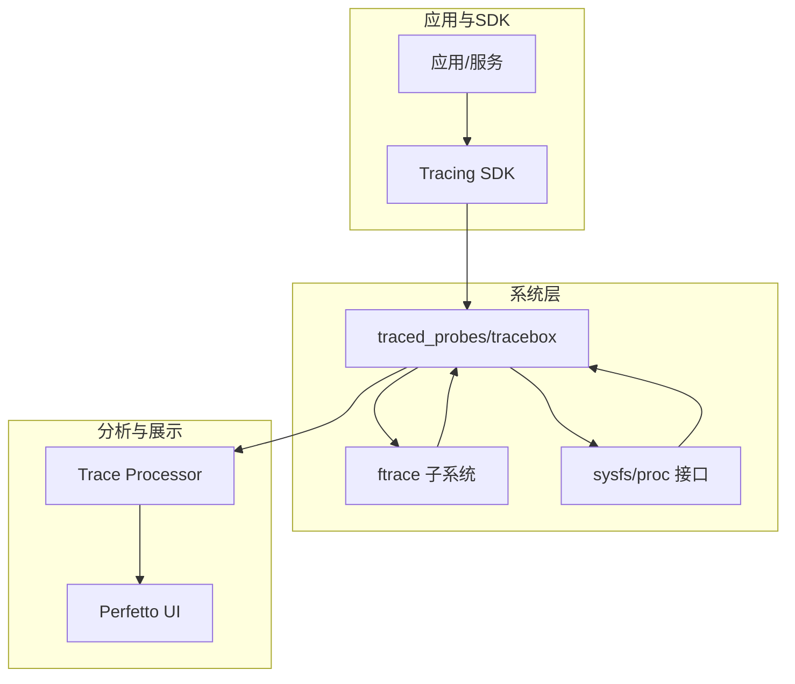
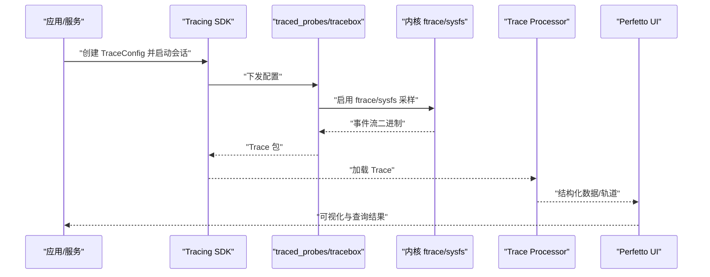
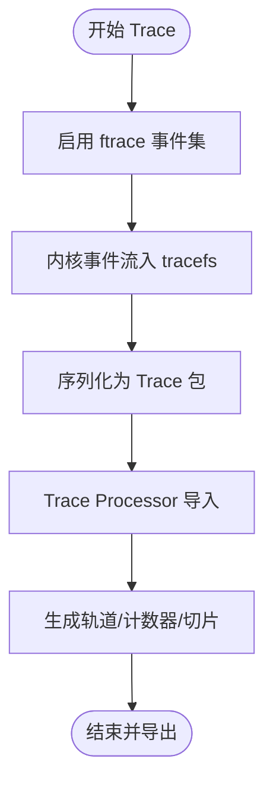
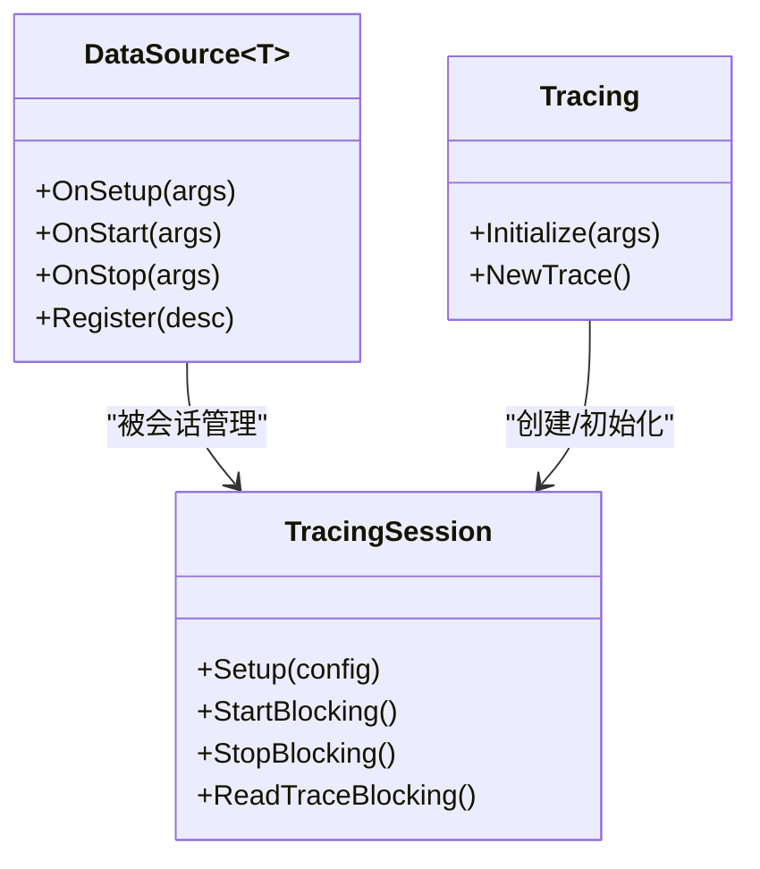
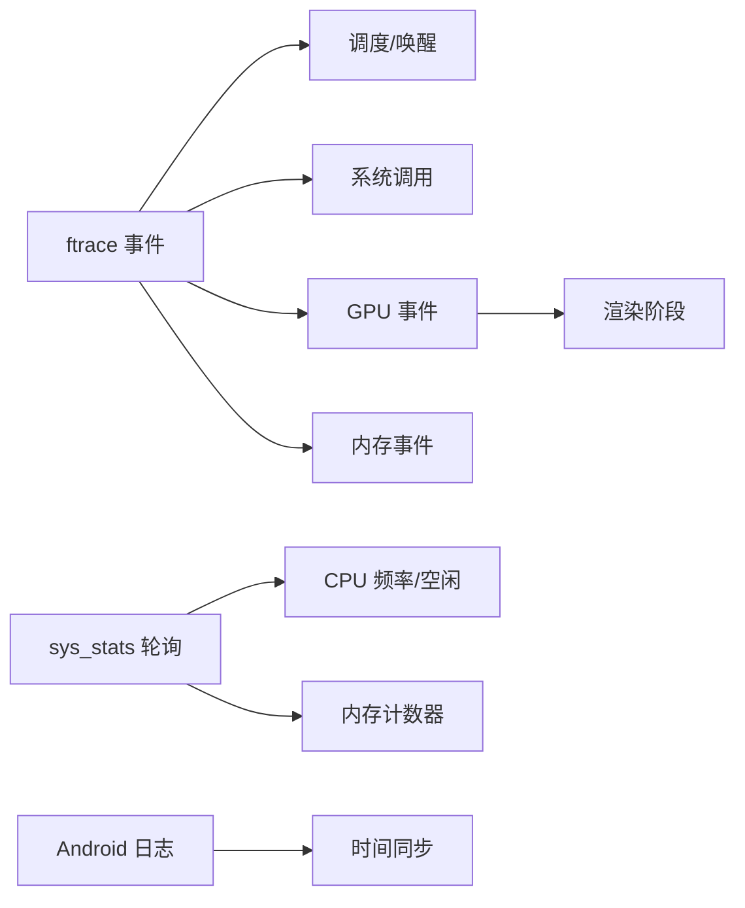

# 数据源和探测器

<cite>
**本文引用的文件**   
- [README.md](file://README.md)
- [cpu-freq.md](file://docs/data-sources/cpu-freq.md)
- [memory-counters.md](file://docs/data-sources/memory-counters.md)
- [android-log.md](file://docs/data-sources/android-log.md)
- [battery-counters.md](file://docs/data-sources/battery-counters.md)
- [syscalls.md](file://docs/data-sources/syscalls.md)
- [cpu-scheduling.md](file://docs/data-sources/cpu-scheduling.md)
- [gpu.md](file://docs/data-sources/gpu.md)
- [ftrace.md](file://docs/getting-started/ftrace.md)
- [example_custom_data_source.cc](file://examples/sdk/example_custom_data_source.cc)
- [ftrace_config.proto](file://protos/perfetto/config/ftrace/ftrace_config.proto)
- [data_source_descriptor.proto](file://protos/perfetto/common/data_source_descriptor.proto)
</cite>

## 目录
1. [简介](#简介)
2. [项目结构](#项目结构)
3. [核心组件](#核心组件)
4. [架构总览](#架构总览)
5. [详细组件分析](#详细组件分析)
6. [依赖关系分析](#依赖关系分析)
7. [性能考量](#性能考量)
8. [故障排查指南](#故障排查指南)
9. [结论](#结论)
10. [附录](#附录)

## 简介
本文件面向系统与平台开发者，系统性阐述 Perfetto 的数据源与探测器体系：涵盖 ftrace 内核跟踪、CPU 频率与空闲状态、内存计数器、Android 日志、电源统计、系统调用、CPU 调度以及 GPU 活动等关键数据源；解释其工作原理、数据格式与采样策略；给出配置方法（TraceConfig）与最佳实践；说明数据源间的依赖与冲突；并提供扩展自定义数据源的开发指南与性能优化建议。

## 项目结构
Perfetto 由“高性能记录守护进程”“低开销 SDK”“广泛的操作系统探测器”“浏览器端 UI”“SQL 分析引擎”等模块组成。数据源通常通过 traced_probes 或 tracebox 在内核侧采集（如 ftrace），再转换为统一的二进制 Trace 包，供 Trace Processor 解析并在 UI 中可视化。

图示来源
- [README.md:12-31](file://README.md#L12-L31)

章节来源
- [README.md:12-31](file://README.md#L12-L31)

## 核心组件
- ftrace 数据源：基于内核 ftrace 的事件采集，支持调度、系统调用、GPU、内存等事件族。
- 系统统计数据源（sys_stats）：周期性轮询 /proc 与 sysfs，输出系统级计数器。
- 进程统计数据源（process_stats）：周期性轮询 /proc/<pid> 统计，输出进程级计数器。
- Android 日志数据源：从 logd 抓取日志事件，支持过滤与缓冲区外持续记录。
- 电源数据源：电池电流/电量/容量与设备功耗轨道（需硬件支持）。
- GPU 数据源：计数器采样、渲染阶段时间线、Vulkan 内存跟踪等。
- 自定义数据源：通过 SDK 注册，按 TraceConfig 启用，写入 Trace 包。

章节来源
- [cpu-freq.md:1-171](file://docs/data-sources/cpu-freq.md#L1-L171)
- [memory-counters.md:1-428](file://docs/data-sources/memory-counters.md#L1-L428)
- [android-log.md:1-76](file://docs/data-sources/android-log.md#L1-L76)
- [battery-counters.md:1-169](file://docs/data-sources/battery-counters.md#L1-L169)
- [syscalls.md:1-55](file://docs/data-sources/syscalls.md#L1-L55)
- [cpu-scheduling.md:1-182](file://docs/data-sources/cpu-scheduling.md#L1-L182)
- [gpu.md:1-200](file://docs/data-sources/gpu.md#L1-L200)
- [ftrace.md:1-758](file://docs/getting-started/ftrace.md#L1-L758)
- [example_custom_data_source.cc:1-124](file://examples/sdk/example_custom_data_source.cc#L1-L124)

## 架构总览
下图展示了从内核到 UI 的典型数据流：应用侧或 SDK 触发 TraceConfig；traced_probes/tracebox 驱动 ftrace/sysfs；生成二进制 Trace；Trace Processor 解析为结构化表；UI 呈现为可交互的时间线与指标。

图示来源
- [ftrace.md:26-34](file://docs/getting-started/ftrace.md#L26-L34)
- [README.md:12-31](file://README.md#L12-L31)

## 详细组件分析

### ftrace 内核跟踪
- 工作原理：通过 tracefs 动态开启 tracepoint/probe，内核在运行时记录事件；Perfetto 将其转为二进制包。
- 数据格式：事件字段来自内核 format 文件；可生成专用 protobuf 描述以降低编码开销。
- 采样策略：事件驱动（如 sched_switch、raw_syscalls）或函数图（function_graph）。
- 配置要点：在 TraceConfig 中指定 ftrace_events 列表；可启用更紧凑的通用编码以减少体积。
- 使用示例：记录调度切换、系统调用进入/退出、GPU 频率、内存计数器等。
- 最佳实践：仅启用必要事件；对高吞吐事件采用聚合（如 mm_event）；结合 process_stats 获取进程名关联。

图示来源
- [ftrace.md:26-34](file://docs/getting-started/ftrace.md#L26-L34)
- [ftrace.md:576-594](file://docs/getting-started/ftrace.md#L576-L594)

章节来源
- [ftrace.md:1-758](file://docs/getting-started/ftrace.md#L1-L758)
- [ftrace_config.proto](file://protos/perfetto/config/ftrace/ftrace_config.proto)

### CPU 频率与空闲状态
- 记录方式：
  - 事件驱动：power/cpu_frequency、power/cpu_idle、power/suspend_resume。
  - 轮询：linux.sys_stats 的 cpufreq_period_ms。
  - 可选：linux.system_info 提供可用频率列表。
- 数据模型：频率与空闲深度作为计数器轨道；空闲状态 0 表示非空闲，大于 0 表示更深空闲层级。
- 注意事项：Intel 平台事件可能不可用；短时 trace 可能缺失初始频率；UI 对空闲轨道有显示依赖。

章节来源
- [cpu-freq.md:1-171](file://docs/data-sources/cpu-freq.md#L1-L171)

### 内存计数器与事件
- 进程级轮询：linux.process_stats 定期扫描 /proc/<pid>/status 与 oom_score_adj。
- ftrace 事件：
  - rss_stat：RSS 变化事件，适合捕捉短时内存峰值。
  - mm_event：周期性直方图汇总关键内存事件（缺页、回收等），降低开销。
- 系统级轮询：linux.sys_stats 轮询 /proc/stat、/proc/vmstat、/proc/meminfo。
- LMK（低内存杀进程）：支持内核 lowmemorykiller 与用户态 lmkd；可通过 ftrace/atrace 记录。
- 最佳实践：短时尖峰用 rss_stat，长期趋势用轮询；结合进程名关联与标准库 SQL 表。

章节来源
- [memory-counters.md:1-428](file://docs/data-sources/memory-counters.md#L1-L428)

### Android 日志
- 来源：logd；支持文本与二进制 EventLog。
- 配置：过滤优先级、标签与日志缓冲区；长 Trace 下可无限期抓取。
- 展示：概要轨道与时间窗表格；与其它轨道时间同步。

章节来源
- [android-log.md:1-76](file://docs/data-sources/android-log.md#L1-L76)

### 电源统计（电池与功耗）
- 电池计数器：容量百分比、剩余电荷、瞬时电流；USB 充电时电流方向反转需注意。
- 设备功耗（ODPM）：按硬件子系统测量能量消耗，不受充电状态影响。
- 配置：android.power 的 android_power_config；Linux/ChromeOS 可用 linux.sysfs_power。
- 最佳实践：实验室场景建议断开 USB 或使用专用设备；同时关注 CPU 频率与 LMK 关联。

章节来源
- [battery-counters.md:1-169](file://docs/data-sources/battery-counters.md#L1-L169)

### 系统调用
- 记录内容：syscall 编号（为控制 Trace 大小，不记录参数）。
- 导入映射：Trace Processor 使用内置 syscall 映射表（x86/x86_64/ArmEabi/aarch32/aarch64）。
- 展示：与线程切片混合显示；SQL 可按前缀 sys_ 过滤。

章节来源
- [syscalls.md:1-55](file://docs/data-sources/syscalls.md#L1-L55)

### CPU 调度事件
- 事件族：sched_switch、sched_waking/sched_wakeup、task_newtask/task_rename、进程生命周期事件。
- 数据模型：sched_slice 表；end_state 解码为人类可读状态。
- 展示：CPU 轨道切片与线程状态轨迹；可叠加唤醒事件进行延迟分析。

章节来源
- [cpu-scheduling.md:1-182](file://docs/data-sources/cpu-scheduling.md#L1-L182)

### GPU 活动
- 数据源：
  - gpu.counters：周期/指令式计数器采样。
  - gpu.renderstages：渲染/计算提交时间线。
  - vulkan.memory_tracker：Vulkan 内存分配/绑定。
  - linux.ftrace：GPU 频率、内存总量、DRM 调度事件。
- 多 GPU/多机：通过 gpu_id 与 machine_id 区分；硬件元数据记录于 GpuInfo。
- 配置示例：按厂商后缀启用具体数据源；设置采样周期与计数器 ID。

章节来源
- [gpu.md:1-200](file://docs/data-sources/gpu.md#L1-L200)

### 自定义数据源开发指南
- 注册与生命周期：实现 DataSource 子类，重载 OnSetup/OnStart/OnStop；通过 DataSourceDescriptor 暴露名称。
- TraceConfig 启用：在 TraceConfig.data_sources 中以 name 指定。
- 写入事件：在回调中获取 TraceContext，写入 TracePacket 并刷新/停止时确保落盘。
- 示例参考：示例工程展示了最小化自定义数据源的注册与写入流程。

图示来源
- [example_custom_data_source.cc:40-50](file://examples/sdk/example_custom_data_source.cc#L40-L50)
- [example_custom_data_source.cc:67-80](file://examples/sdk/example_custom_data_source.cc#L67-L80)
- [example_custom_data_source.cc:107-108](file://examples/sdk/example_custom_data_source.cc#L107-L108)

章节来源
- [example_custom_data_source.cc:1-124](file://examples/sdk/example_custom_data_source.cc#L1-L124)

## 依赖关系分析
- 事件驱动 vs 轮询：
  - ftrace 事件驱动：低延迟、高精度，但事件稀疏；适合关键路径（调度、系统调用、GPU）。
  - sys_stats 轮询：覆盖广、连续性强；适合系统/进程计数器与频率快照。
- 依赖与冲突：
  - 同一内核接口（如 ftrace）上过多事件会显著增大 Trace 体积与解析成本。
  - 轮询频率过低无法捕捉瞬态，过高增加 CPU 占用。
  - Android 日志与长 Trace：建议开启持续抓取以突破 logd 缓冲限制。
- 关联分析：
  - CPU 频率与内存 LMK：高负载下频繁降频与 LMK 交替出现，需结合二者分析。
  - GPU 频率与渲染阶段：渲染阶段长尾常伴随 GPU 频率波动。

图示来源
- [cpu-freq.md:121-152](file://docs/data-sources/cpu-freq.md#L121-L152)
- [memory-counters.md:147-166](file://docs/data-sources/memory-counters.md#L147-L166)
- [syscalls.md:42-54](file://docs/data-sources/syscalls.md#L42-L54)
- [gpu.md:27-37](file://docs/data-sources/gpu.md#L27-L37)
- [android-log.md:12-16](file://docs/data-sources/android-log.md#L12-L16)

## 性能考量
- 事件选择：优先保留关键事件，避免全量开启；对高吞吐事件采用聚合（如 mm_event）。
- 轮询频率：根据场景折中（如 CPU 频率轮询 200–500ms；内存计数器 1–2s）。
- Trace 大小：合理设置 buffers.size_kb 与 fill_policy；必要时启用压缩/过滤。
- 解析与 UI：复杂解析（如自定义 ftrace 事件）会增加 Trace Processor 时间；建议仅在需要时启用。
- 电源测试：USB 充电会抵消放电电流，实验需断开或特殊手段抑制。

章节来源
- [cpu-freq.md:25-29](file://docs/data-sources/cpu-freq.md#L25-L29)
- [memory-counters.md:45-46](file://docs/data-sources/memory-counters.md#L45-L46)
- [battery-counters.md:37-60](file://docs/data-sources/battery-counters.md#L37-L60)

## 故障排查指南
- 事件缺失：
  - ftrace 事件稀疏：结合轮询（sys_stats）补全初始值与空隙。
  - 平台差异：Intel 平台部分事件不可用；ARM 平台需确认驱动支持。
- UI 显示异常：
  - CPU 频率轨道依赖空闲状态；若 UI 不显示，仍可通过 SQL 查询。
  - Android 日志 UI：检查过滤条件与缓冲区选择。
- Trace 过大：
  - 减少事件数量与轮询频率；启用更紧凑编码；缩短时长。
- 自定义数据源：
  - 确认 DataSourceDescriptor 名称与 TraceConfig 一致；确保 Stop/Flush 正确调用。

章节来源
- [cpu-freq.md:73-84](file://docs/data-sources/cpu-freq.md#L73-L84)
- [android-log.md:17-18](file://docs/data-sources/android-log.md#L17-L18)
- [example_custom_data_source.cc:82-103](file://examples/sdk/example_custom_data_source.cc#L82-L103)

## 结论
Perfetto 的数据源体系以 ftrace 为核心，辅以内核 sysfs/proc 与用户态 SDK，形成从内核到 UI 的完整链路。针对不同目标（CPU、内存、GPU、电源、日志），应按“事件驱动 + 轮询”的组合策略选择数据源，并依据场景调整采样频率与事件集合，以平衡可观测性与性能开销。对于自定义需求，可通过 SDK 注册数据源并配合 TraceConfig 实现灵活扩展。

## 附录
- TraceConfig 参考：ftrace_config.proto 定义了事件列表、函数图、编码选项等；data_source_descriptor.proto 描述数据源能力与参数。
- 快速开始：参见 ftrace 指南中的示例模块与 tracebox 录制步骤，理解从内核事件到 UI 轨道的完整流程。

章节来源
- [ftrace_config.proto](file://protos/perfetto/config/ftrace/ftrace_config.proto)
- [data_source_descriptor.proto](file://protos/perfetto/common/data_source_descriptor.proto)
- [ftrace.md:576-594](file://docs/getting-started/ftrace.md#L576-L594)