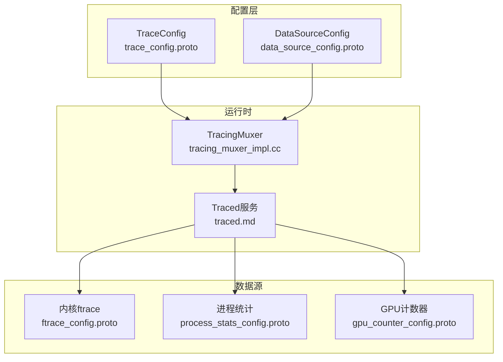
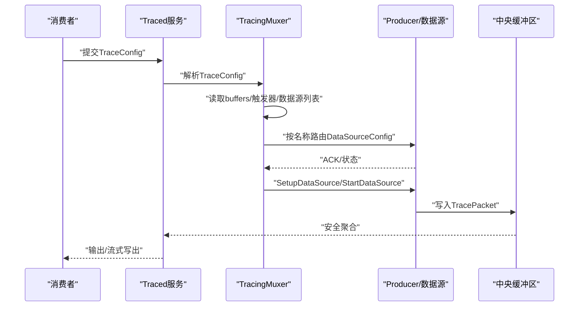
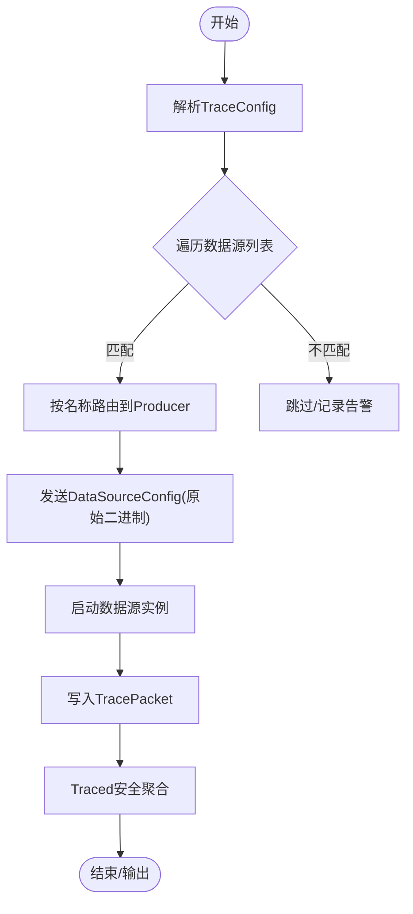

# 数据源配置和管理

<cite>
**本文引用的文件**
- [trace_config.proto](file://protos/perfetto/config/trace_config.proto)
- [data_source_config.proto](file://protos/perfetto/config/data_source_config.proto)
- [config.md](file://docs/concepts/config.md)
- [traced.md](file://docs/reference/traced.md)
- [traced_probes.md](file://docs/reference/traced_probes.md)
- [long_trace.cfg](file://test/configs/long_trace.cfg)
- [tracing_muxer_impl.cc](file://src/tracing/internal/tracing_muxer_impl.cc)
- [data_source_internal.h](file://include/perfetto/tracing/internal/data_source_internal.h)
- [tracing-101.md](file://docs/tracing-101.md)
</cite>

## 目录
1. [简介](#简介)
2. [项目结构](#项目结构)
3. [核心组件](#核心组件)
4. [架构总览](#架构总览)
5. [详细组件分析](#详细组件分析)
6. [依赖关系分析](#依赖关系分析)
7. [性能考量](#性能考量)
8. [故障排查指南](#故障排查指南)
9. [结论](#结论)
10. [附录](#附录)

## 简介
本文件面向需要在Perfetto中进行数据源配置与管理的工程师，系统性阐述TraceConfig与DataSourceConfig的结构、语义与使用方式；说明如何动态启用/禁用数据源、管理数据源间的依赖关系；给出常见与高级配置示例；并覆盖生命周期管理、错误处理与故障恢复、配置验证与调试、性能优化等最佳实践。

## 项目结构
围绕“配置—路由—执行—聚合”的主线，Perfetto的关键位置如下：
- 配置定义：TraceConfig与DataSourceConfig位于protos目录，描述缓冲区、触发器、数据源映射与各数据源专属配置。
- 文档与参考：docs/concepts与docs/reference对配置语义、服务职责、触发器模式等进行说明。
- 运行时调度：src/tracing/internal中的TracingMuxer负责解析TraceConfig、路由到对应Producer、启动/停止数据源实例，并处理缓冲区耗尽策略等。
- 示例配置：test/configs提供长时追踪等典型配置样例。

图表来源
- [trace_config.proto](file://protos/perfetto/config/trace_config.proto)
- [data_source_config.proto](file://protos/perfetto/config/data_source_config.proto)
- [tracing_muxer_impl.cc](file://src/tracing/internal/tracing_muxer_impl.cc)
- [traced.md](file://docs/reference/traced.md)

章节来源
- [trace_config.proto](file://protos/perfetto/config/trace_config.proto)
- [data_source_config.proto](file://protos/perfetto/config/data_source_config.proto)
- [config.md](file://docs/concepts/config.md)
- [traced.md](file://docs/reference/traced.md)

## 核心组件
- TraceConfig：顶层配置，定义缓冲区、全局行为（如写盘、超时、压缩）、数据源列表及其映射关系、触发器、内置数据源开关等。
- DataSource：描述单个数据源的启用与过滤条件（按Producer名称或正则过滤），以及其专属配置块。
- DataSourceConfig：每个数据源的专属配置容器，采用[lazy=true]避免编译期强耦合，以原始二进制形式传递给对应数据源。
- TracingMuxer/Traced：解析TraceConfig，将DataSourceConfig分发给匹配的Producer，管理数据源实例生命周期与缓冲区策略。

章节来源
- [trace_config.proto](file://protos/perfetto/config/trace_config.proto)
- [data_source_config.proto](file://protos/perfetto/config/data_source_config.proto)
- [tracing_muxer_impl.cc](file://src/tracing/internal/tracing_muxer_impl.cc)
- [traced.md](file://docs/reference/traced.md)

## 架构总览
下图展示从配置下发到数据源执行的关键流程：

图表来源
- [trace_config.proto](file://protos/perfetto/config/trace_config.proto)
- [tracing_muxer_impl.cc](file://src/tracing/internal/tracing_muxer_impl.cc)
- [traced.md](file://docs/reference/traced.md)

## 详细组件分析

### TraceConfig：全局行为与缓冲区
- 缓冲区配置（BufferConfig）：size_kb、fill_policy（RING_BUFFER/DISCARD）、transfer_on_clone、clear_before_clone、name、实验性模式等。
- 全局行为：duration_ms、prefer_suspend_clock_for_duration、write_into_file、output_path、file_write_period_ms、max_file_size_bytes、guardrail_overrides、deferred_start、flush_period_ms、flush_timeout_ms、data_source_stop_timeout_ms、trigger_config、activate_triggers、incremental_state_config、unique_session_name、compression_type、statsd_metadata、incident_report_config、android_report_config、cmd_trace_start_delay 等。
- 数据源列表（DataSource）：每个条目包含一个DataSourceConfig子块与可选的producer_name_filter/producer_name_regex_filter/machine_name_filter，用于限定目标Producer或机器。

章节来源
- [trace_config.proto](file://protos/perfetto/config/trace_config.proto)
- [config.md](file://docs/concepts/config.md)

### DataSourceConfig：数据源专属配置容器
- 基础字段：name（必须与数据源注册名一致）、target_buffer/target_buffer_name（映射到TraceConfig中某缓冲区）、trace_duration_ms、prefer_suspend_clock_for_duration、stop_timeout_ms、enable_extra_guardrails、session_initiator、tracing_session_id、buffer_exhausted_policy、priority_boost、protovm_config、interceptor_config、legacy_config、for_testing 等。
- 数据源专属配置：通过[lazy=true]的占位字段承载各数据源的专属配置（如ftrace_config、android_power_config、heapprofd_config、gpu_counter_config、track_event_config等）。这些字段在生成代码时仅暴露原始字节访问器，避免引入过多头文件依赖与二进制膨胀。
- 向后兼容：Traced会将DataSourceConfig的原始二进制透传给同名数据源，即使服务端未识别新增字段，也能支持新数据源无需升级服务端即可工作。

章节来源
- [data_source_config.proto](file://protos/perfetto/config/data_source_config.proto)
- [config.md](file://docs/concepts/config.md)

### 动态启用/禁用与多进程过滤
- 多进程数据源：同一数据源可在多个Producer上注册。默认情况下，Traced会对所有匹配的Producer广播启用请求。
- 进程过滤：通过DataSource.producer_name_filter与producer_name_regex_filter，可将启用范围限定到特定Producer集合。
- 机器过滤：通过machine_name_filter按机器名过滤，适用于跨主机/跨节点的场景。

章节来源
- [config.md](file://docs/concepts/config.md)
- [trace_config.proto](file://protos/perfetto/config/trace_config.proto)

### 触发器（Triggers）：按事件启停
- START_TRACING：会话保持空闲直到触发或超时；触发后按stop_delay_ms停止。
- STOP_TRACING：会话立即开始，触发后按stop_delay_ms提前结束。
- CLONE_SNAPSHOT：在不停止当前会话的前提下创建快照（需满足版本要求）。
- 触发器声明与激活：在TraceConfig中声明触发器集，由独立Producer或命令行工具激活；也可通过activate_triggers直接驱动已有配置。

章节来源
- [trace_config.proto](file://protos/perfetto/config/trace_config.proto)
- [config.md](file://docs/concepts/config.md)

### 缓冲区与数据源映射
- 单缓冲区：最简场景，所有数据源写入同一缓冲区。
- 多缓冲区：通过target_buffer或target_buffer_name将不同数据源映射到不同缓冲区，避免高吞吐数据源挤占低频数据源的采样窗口。
- 填充策略：RING_BUFFER（环形覆盖）与DISCARD（满即丢弃）。DISCARD可能影响某些在结束时提交的采样点。

章节来源
- [config.md](file://docs/concepts/config.md)
- [trace_config.proto](file://protos/perfetto/config/trace_config.proto)

### 生命周期管理与实例去重
- 实例去重：当存在多个同名数据源时，Traced会避免重复启动相同配置的实例，确保每个配置只启动一次。
- 停止与超时：支持显式停止与超时控制（flush_timeout_ms、data_source_stop_timeout_ms），保障资源回收与稳定性。

章节来源
- [tracing_muxer_impl.cc](file://src/tracing/internal/tracing_muxer_impl.cc)

### 缓冲区耗尽策略
- 支持DROP、STALL_THEN_ABORT、STALL_THEN_DROP三种策略，可通过DataSourceConfig.buffer_exhausted_policy显式指定，或沿用数据源默认策略。

章节来源
- [data_source_config.proto](file://protos/perfetto/config/data_source_config.proto)
- [tracing_muxer_impl.cc](file://src/tracing/internal/tracing_muxer_impl.cc)

### 配置示例与高级选项
- 基础示例：启用linux.ftrace并设置事件集，见文档示例。
- 多数据源示例：同时启用linux.ftrace、linux.process_stats、linux.sys_stats，见参考文档示例。
- 长时追踪：开启write_into_file、设置较长duration_ms与合适的file_write_period_ms与buffers大小，见long_trace.cfg。
- 触发器示例：START_TRACING/STOP_TRACING/CLONE_SNAPSHOT的配置要点见概念文档。

章节来源
- [config.md](file://docs/concepts/config.md)
- [traced_probes.md](file://docs/reference/traced_probes.md)
- [long_trace.cfg](file://test/configs/long_trace.cfg)

### 数据源依赖关系管理
- 依赖建模：通过增量状态清理（incremental_state_config.clear_period_ms）与ProtoVM（protovm_config）实现跨数据源的依赖处理与补丁应用。
- 互斥与协调：通过unique_session_name限制并发会话数量；通过优先级提升（priority_boost）与缓冲区策略协调高优先级数据源。

章节来源
- [trace_config.proto](file://protos/perfetto/config/trace_config.proto)
- [data_source_config.proto](file://protos/perfetto/config/data_source_config.proto)

## 依赖关系分析
- 配置到执行的依赖链：TraceConfig → DataSource → DataSourceConfig（原始二进制） → Producer → 数据源实例。
- 运行时依赖：TracingMuxer依赖Traced服务完成Producer注册表维护、缓冲区分配与安全聚合；数据源依赖其专属配置字段（lazy=true）实现解耦。
- 过滤与映射：DataSource.producer_name_filter/regex_filter与machine_name_filter决定目标Producer集合；target_buffer/target_buffer_name决定写入缓冲区。

图表来源
- [trace_config.proto](file://protos/perfetto/config/trace_config.proto)
- [tracing_muxer_impl.cc](file://src/tracing/internal/tracing_muxer_impl.cc)

章节来源
- [trace_config.proto](file://protos/perfetto/config/trace_config.proto)
- [tracing_muxer_impl.cc](file://src/tracing/internal/tracing_muxer_impl.cc)

## 性能考量
- 缓冲区大小与填充策略：根据数据源写入速率选择合适size_kb与fill_policy；高吞吐数据源建议独立缓冲区。
- 流式写出：write_into_file与file_write_period_ms降低峰值内存占用，但增加I/O开销；需权衡缓冲区大小与写盘周期。
- 触发器模式：STOP_TRACING适合飞行记录器模式，减少无关数据量；CLONE_SNAPSHOT在满足版本前提下可避免长时间会话。
- 超时与停止：合理设置flush_timeout_ms与data_source_stop_timeout_ms，避免资源泄漏与阻塞。
- 压缩与增量：compression_type与incremental_state_config在大体量追踪中可显著节省存储与处理成本。

章节来源
- [trace_config.proto](file://protos/perfetto/config/trace_config.proto)
- [config.md](file://docs/concepts/config.md)

## 故障排查指南
- 配置不生效
  - 检查DataSource.name是否与数据源注册名一致。
  - 若存在多个同名数据源，确认是否被正确过滤（producer_name_filter/regex_filter/machine_name_filter）。
  - 确认target_buffer/target_buffer_name指向同一缓冲区（若同时指定）。
- 缓冲区溢出
  - 将高吞吐数据源迁移到独立缓冲区；调整fill_policy为RING_BUFFER并增大size_kb。
  - 设置合理的buffer_exhausted_policy（DROP/STALL_THEN_DROP）。
- 触发器无效
  - 确认触发器名称与触发时机；START_TRACING需等待触发或超时；STOP_TRACING需在会话启动后触发。
  - 检查trigger_timeout_ms与stop_delay_ms设置是否合理。
- 长时追踪卡顿
  - 适当提高file_write_period_ms与buffers.size_kb；评估flush_period_ms对I/O的影响。
- 生命周期异常
  - 关注重复实例问题：同名同配置不会重复启动，但需检查配置哈希一致性。
  - 检查stop超时与异步停止回调是否正确处理。

章节来源
- [tracing_muxer_impl.cc](file://src/tracing/internal/tracing_muxer_impl.cc)
- [trace_config.proto](file://protos/perfetto/config/trace_config.proto)
- [config.md](file://docs/concepts/config.md)

## 结论
通过明确的TraceConfig/DataSourceConfig模型与Traced/TracingMuxer的协作，Perfetto实现了灵活、可扩展且高性能的数据源配置与管理能力。遵循本文的配置结构、动态启用/过滤、缓冲区与触发器策略、生命周期与错误处理最佳实践，可有效支撑从日常分析到大规模长时追踪的多样化场景。

## 附录

### 常见字段速查
- TraceConfig
  - buffers：size_kb、fill_policy、name、experimental_mode
  - duration_ms、prefer_suspend_clock_for_duration
  - write_into_file、output_path、file_write_period_ms、max_file_size_bytes
  - trigger_config、activate_triggers
  - data_sources：config、producer_name_filter、producer_name_regex_filter、machine_name_filter
- DataSourceConfig
  - name、target_buffer/target_buffer_name、trace_duration_ms、buffer_exhausted_policy
  - 各数据源专属配置（ftrace_config、android_power_config、heapprofd_config等，均lazy=true）

章节来源
- [trace_config.proto](file://protos/perfetto/config/trace_config.proto)
- [data_source_config.proto](file://protos/perfetto/config/data_source_config.proto)