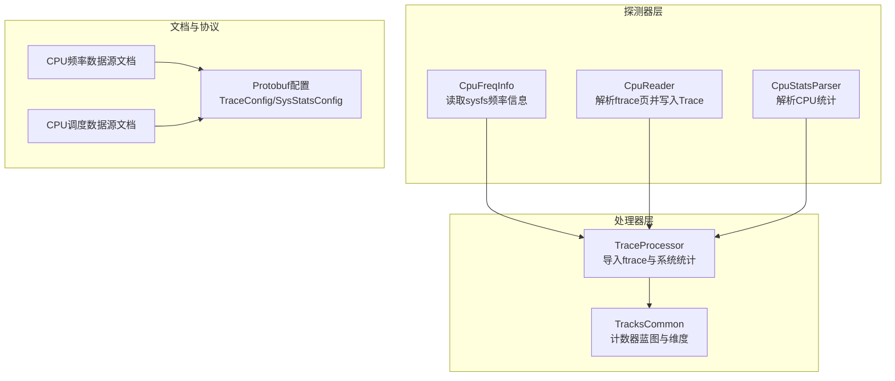
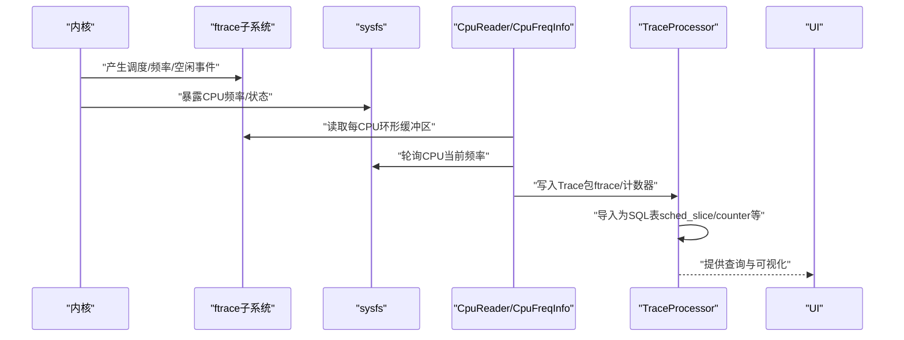
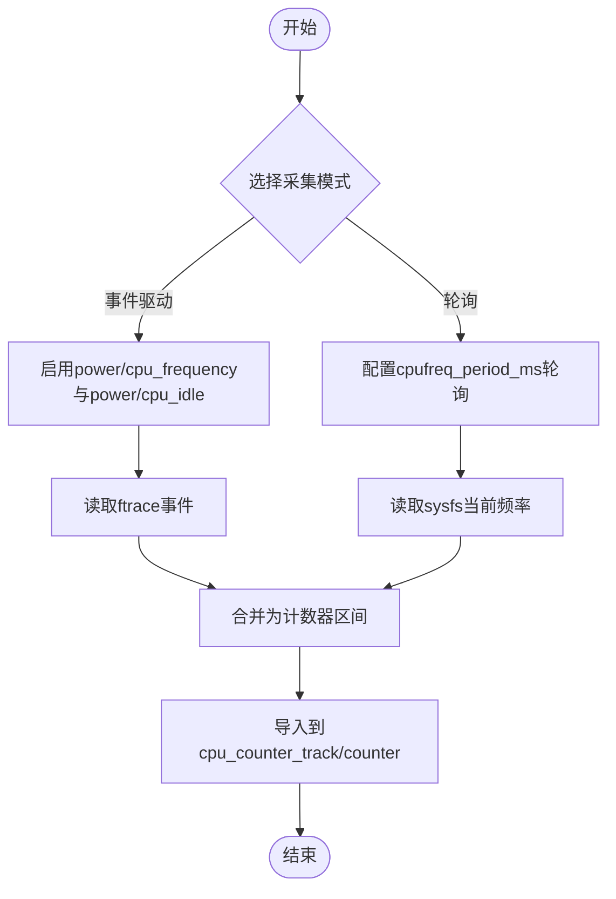
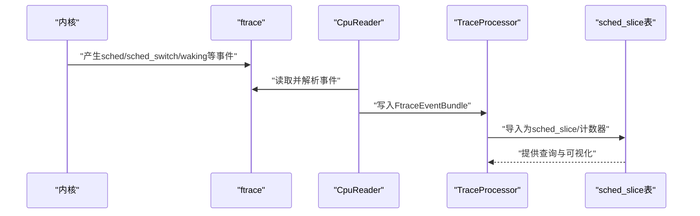
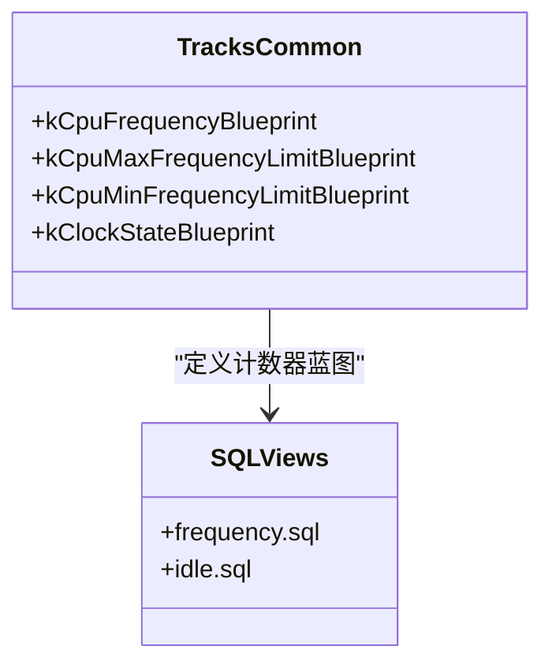
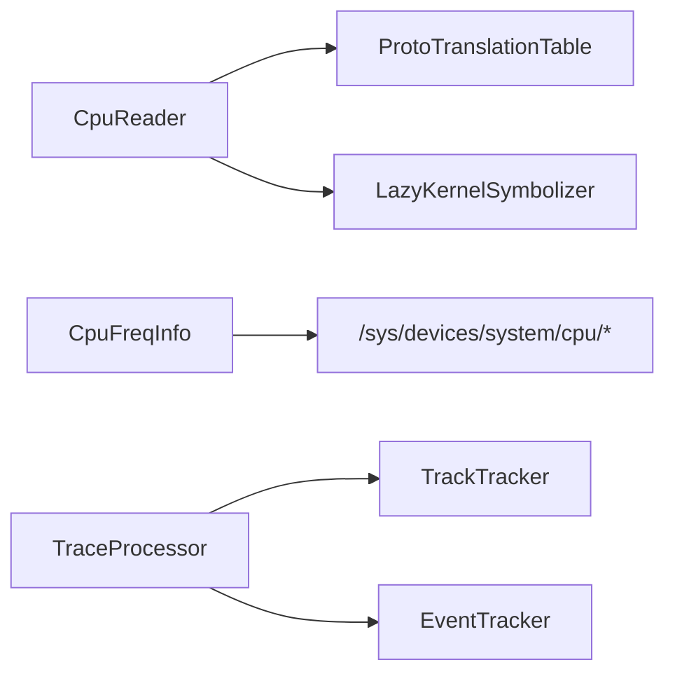

# CPU性能监控探测器

<cite>
**本文档引用的文件**
- [cpu_freq_info.h](file://src/traced/probes/common/cpu_freq_info.h)
- [cpu_freq_info.cc](file://src/traced/probes/common/cpu_freq_info.cc)
- [cpu_reader.h](file://src/traced/probes/ftrace/cpu_reader.h)
- [cpu_reader.cc](file://src/traced/probes/ftrace/cpu_reader.cc)
- [cpu_stats_parser.h](file://src/traced/probes/ftrace/cpu_stats_parser.h)
- [system_probes_parser.cc](file://src/trace_processor/importers/proto/system_probes_parser.cc)
- [ftrace_parser.cc](file://src/trace_processor/importers/ftrace/ftrace_parser.cc)
- [tracks_common.h](file://src/trace_processor/importers/common/tracks_common.h)
- [cpu-freq.md](file://docs/data-sources/cpu-freq.md)
- [cpu-scheduling.md](file://docs/data-sources/cpu-scheduling.md)
- [perfetto_trace.proto](file://protos/perfetto/trace/perfetto_trace.proto)
- [perfetto_config.proto](file://protos/perfetto/config/perfetto_config.proto)
- [frequency.sql](file://src/trace_processor/perfetto_sql/stdlib/linux/cpu/frequency.sql)
- [idle.sql](file://src/trace_processor/perfetto_sql/stdlib/linux/cpu/idle.sql)
</cite>

## 目录
1. [简介](#简介)
2. [项目结构](#项目结构)
3. [核心组件](#核心组件)
4. [架构总览](#架构总览)
5. [详细组件分析](#详细组件分析)
6. [依赖关系分析](#依赖关系分析)
7. [性能考量](#性能考量)
8. [故障排查指南](#故障排查指南)
9. [结论](#结论)
10. [附录](#附录)

## 简介
本文件面向Perfetto的CPU性能监控探测器，系统性阐述以下能力与实现：
- CPU频率监控：事件驱动（ftrace）与轮询（sysfs）双通道采集，频率变化检测、采样间隔配置与数据聚合策略
- CPU调度跟踪：进程切换、优先级变化、唤醒路径与调度延迟的捕获与分析
- 性能计数器：CPU利用率、容量、运行中线程数等计数器的导入与可视化
- 配置参数：采样率、过滤条件、数据输出格式与平台差异
- 使用场景与调优：针对不同分析目标（功耗、延迟、稳定性）的配置建议与性能影响评估

## 项目结构
围绕CPU监控的关键代码分布在以下模块：
- 探测器层（traced/probes）
  - CPU频率信息解析：读取sysfs频率列表与当前频率
  - Ftrace CPU读取器：解析内核环形缓冲区，写入Trace包
  - CPU统计解析器：解析CPU统计相关事件
- 处理器层（trace_processor）
  - 导入器：将ftrace与系统统计数据导入到SQL可查询表
  - 蓝图定义：为计数器与轨迹命名与维度建模
- 文档与协议
  - 数据源文档：CPU频率与调度的数据源说明
  - Protobuf配置：TraceConfig与SysStatsConfig中的CPU相关字段

**图表来源**
- [cpu_freq_info.cc:47-91](file://src/traced/probes/common/cpu_freq_info.cc#L47-L91)
- [cpu_reader.cc:230-263](file://src/traced/probes/ftrace/cpu_reader.cc#L230-L263)
- [system_probes_parser.cc:421-445](file://src/trace_processor/importers/proto/system_probes_parser.cc#L421-L445)
- [tracks_common.h:144-165](file://src/trace_processor/importers/common/tracks_common.h#L144-L165)
- [cpu-freq.md:121-152](file://docs/data-sources/cpu-freq.md#L121-L152)
- [cpu-scheduling.md:56-85](file://docs/data-sources/cpu-scheduling.md#L56-L85)

**章节来源**
- [cpu_freq_info.h:26-51](file://src/traced/probes/common/cpu_freq_info.h#L26-L51)
- [cpu_reader.h:55-120](file://src/traced/probes/ftrace/cpu_reader.h#L55-L120)
- [cpu_stats_parser.h:24-31](file://src/traced/probes/ftrace/cpu_stats_parser.h#L24-L31)
- [system_probes_parser.cc:421-445](file://src/trace_processor/importers/proto/system_probes_parser.cc#L421-L445)
- [tracks_common.h:144-165](file://src/trace_processor/importers/common/tracks_common.h#L144-L165)
- [cpu-freq.md:1-171](file://docs/data-sources/cpu-freq.md#L1-L171)
- [cpu-scheduling.md:1-182](file://docs/data-sources/cpu-scheduling.md#L1-L182)
- [perfetto_trace.proto:4085-4118](file://protos/perfetto/trace/perfetto_trace.proto#L4085-L4118)
- [perfetto_config.proto:4085-4118](file://protos/perfetto/config/perfetto_config.proto#L4085-L4118)

## 核心组件
- CPU频率信息（CpuFreqInfo）
  - 功能：扫描/sys/devices/system/cpu目录，读取每个CPU的可用频率与当前频率，构建有序索引，支持按CPU查询频率范围与索引定位
  - 关键接口：获取CPU频率范围、按CPU+频率查找索引、读取所有CPU当前频率
- Ftrace CPU读取器（CpuReader）
  - 功能：以批处理方式从每CPU的ftrace环形缓冲区读取原始页，解析事件头与事件体，按数据源过滤后写入Trace包；支持紧凑调度格式与符号化
  - 关键流程：分页读取、页头解析、事件解析、打包写入、错误记录
- CPU统计解析器（CpuStatsParser）
  - 功能：解析CPU统计文本或批量统计，生成CPU利用率、容量、运行中线程数等计数器
- TraceProcessor导入器
  - 功能：将ftrace事件与系统统计数据映射为SQL表，如sched_slice、cpu_counter_track、counter等，并建立计数器轨迹
  - 关键点：CPU利用率/容量/运行中线程数计数器的轨迹命名与维度

**章节来源**
- [cpu_freq_info.h:26-51](file://src/traced/probes/common/cpu_freq_info.h#L26-L51)
- [cpu_freq_info.cc:95-115](file://src/traced/probes/common/cpu_freq_info.cc#L95-L115)
- [cpu_reader.h:201-229](file://src/traced/probes/ftrace/cpu_reader.h#L201-L229)
- [cpu_reader.cc:486-563](file://src/traced/probes/ftrace/cpu_reader.cc#L486-L563)
- [cpu_stats_parser.h:24-31](file://src/traced/probes/ftrace/cpu_stats_parser.h#L24-L31)
- [system_probes_parser.cc:421-445](file://src/trace_processor/importers/proto/system_probes_parser.cc#L421-L445)
- [ftrace_parser.cc:3941-3969](file://src/trace_processor/importers/ftrace/ftrace_parser.cc#L3941-L3969)

## 架构总览
下图展示从内核到UI的CPU监控数据通路：内核通过ftrace与sysfs暴露CPU状态，Perfetto探测器读取并写入Trace，TraceProcessor导入为SQL表，最终在UI中可视化。

**图表来源**
- [cpu_reader.cc:230-263](file://src/traced/probes/ftrace/cpu_reader.cc#L230-L263)
- [cpu_freq_info.cc:124-146](file://src/traced/probes/common/cpu_freq_info.cc#L124-L146)
- [system_probes_parser.cc:421-445](file://src/trace_processor/importers/proto/system_probes_parser.cc#L421-L445)
- [ftrace_parser.cc:3941-3969](file://src/trace_processor/importers/ftrace/ftrace_parser.cc#L3941-L3969)

## 详细组件分析

### CPU频率探测器实现机制
- 频率变化检测
  - 事件驱动：启用power/cpu_frequency与power/cpu_idle事件，仅在频率变化时产生事件，适合捕捉动态变化
  - 轮询补充：启用linux.sys_stats并设置cpufreq_period_ms，定期读取/sys/devices/system/cpu/*/cpufreq/cpuinfo_cur_freq，确保初始值与稳定采样
- 采样间隔配置
  - cpufreq_period_ms：轮询周期（>10ms），避免过高CPU占用
  - devfreq_period_ms：设备频率轮询周期
- 数据聚合策略
  - CpuFreqInfo构建CPU频率索引，支持按CPU范围查询与索引定位
  - TraceProcessor将连续相同值合并为“前向填充”的计数器区间，减少冗余

**图表来源**
- [cpu_reader.cc:716-775](file://src/traced/probes/ftrace/cpu_reader.cc#L716-L775)
- [cpu_freq_info.cc:68-76](file://src/traced/probes/common/cpu_freq_info.cc#L68-L76)
- [cpu-freq.md:121-152](file://docs/data-sources/cpu-freq.md#L121-L152)
- [perfetto_trace.proto:4099-4101](file://protos/perfetto/trace/perfetto_trace.proto#L4099-L4101)

**章节来源**
- [cpu_freq_info.h:26-51](file://src/traced/probes/common/cpu_freq_info.h#L26-L51)
- [cpu_freq_info.cc:47-91](file://src/traced/probes/common/cpu_freq_info.cc#L47-L91)
- [cpu_reader.cc:716-775](file://src/traced/probes/ftrace/cpu_reader.cc#L716-L775)
- [cpu-freq.md:1-171](file://docs/data-sources/cpu-freq.md#L1-L171)
- [perfetto_trace.proto:4099-4101](file://protos/perfetto/trace/perfetto_trace.proto#L4099-L4101)

### CPU调度跟踪工作原理
- 事件捕获
  - 基础：sched/sched_switch（进程切换）、sched/sched_waking（唤醒）、sched/sched_wakeup_new（新唤醒）
  - 补充：task/task_newtask、task/task_rename、sched_process_exit/free（线程生命周期）
- 数据结构与导入
  - 导入为sched_slice表，包含时间戳、持续时间、CPU、线程UTID、结束状态、优先级等
  - TraceProcessor同时生成CPU利用率、容量、运行中线程数等计数器轨迹
- 可视化与分析
  - UI以切片展示调度活动，支持按进程/线程展开查看轨迹
  - 结合唤醒事件进行延迟分析（跨CPU唤醒路径）

**图表来源**
- [cpu_reader.cc:716-775](file://src/traced/probes/ftrace/cpu_reader.cc#L716-L775)
- [ftrace_parser.cc:3941-3969](file://src/trace_processor/importers/ftrace/ftrace_parser.cc#L3941-L3969)
- [cpu-scheduling.md:56-85](file://docs/data-sources/cpu-scheduling.md#L56-L85)

**章节来源**
- [cpu_reader.h:324-360](file://src/traced/probes/ftrace/cpu_reader.h#L324-L360)
- [cpu_reader.cc:486-563](file://src/traced/probes/ftrace/cpu_reader.cc#L486-L563)
- [ftrace_parser.cc:3941-3969](file://src/trace_processor/importers/ftrace/ftrace_parser.cc#L3941-L3969)
- [cpu-scheduling.md:1-182](file://docs/data-sources/cpu-scheduling.md#L1-L182)

### 性能计数器与轨迹建模
- 计数器类型
  - CPU频率：cpufreq，按CPU维度建模
  - CPU利用率：cpu_util，按CPU维度建模
  - CPU容量：cpu_capacity，按CPU维度建模
  - 运行中线程数：cpu_nr_running，按CPU维度建模
  - CPU空闲：cpuidle，按CPU维度建模
- 蓝图与维度
  - TracksCommon定义了计数器蓝图与维度（CPU维度），用于统一命名与归类
- SQL查询
  - 提供标准SQL查询模板，将计数器转换为频率/空闲等视图

**图表来源**
- [tracks_common.h:144-165](file://src/trace_processor/importers/common/tracks_common.h#L144-L165)
- [frequency.sql:35-54](file://src/trace_processor/perfetto_sql/stdlib/linux/cpu/frequency.sql#L35-L54)
- [idle.sql:32-49](file://src/trace_processor/perfetto_sql/stdlib/linux/cpu/idle.sql#L32-L49)

**章节来源**
- [tracks_common.h:132-165](file://src/trace_processor/importers/common/tracks_common.h#L132-L165)
- [frequency.sql:35-54](file://src/trace_processor/perfetto_sql/stdlib/linux/cpu/frequency.sql#L35-L54)
- [idle.sql:32-49](file://src/trace_processor/perfetto_sql/stdlib/linux/cpu/idle.sql#L32-L49)

## 依赖关系分析
- 组件耦合
  - CpuReader依赖ProtoTranslationTable与LazyKernelSymbolizer，负责事件解析与符号化
  - CpuFreqInfo独立于ftrace，直接读取sysfs，耦合度低
  - TraceProcessor导入器依赖TrackTracker与EventTracker，负责轨迹与计数器建立
- 外部依赖
  - 内核ftrace与sysfs接口
  - Protobuf消息定义与TraceConfig配置

**图表来源**
- [cpu_reader.h:41-53](file://src/traced/probes/ftrace/cpu_reader.h#L41-L53)
- [cpu_reader.cc:486-563](file://src/traced/probes/ftrace/cpu_reader.cc#L486-L563)
- [cpu_freq_info.cc:117-122](file://src/traced/probes/common/cpu_freq_info.cc#L117-L122)
- [system_probes_parser.cc:421-445](file://src/trace_processor/importers/proto/system_probes_parser.cc#L421-L445)

**章节来源**
- [cpu_reader.h:41-53](file://src/traced/probes/ftrace/cpu_reader.h#L41-L53)
- [cpu_freq_info.h:26-51](file://src/traced/probes/common/cpu_freq_info.h#L26-L51)
- [system_probes_parser.cc:421-445](file://src/trace_processor/importers/proto/system_probes_parser.cc#L421-L445)

## 性能考量
- 采样率与开销
  - 轮询周期需>10ms，避免过度CPU占用（见cpufreq_period_ms/devfreq_period_ms注释）
  - ftrace读取采用非阻塞模式与分页批处理，降低内存压力
- 过滤与压缩
  - 事件过滤（event_filter）与紧凑调度格式（compact_sched）减少带宽与存储
  - 符号化按需触发，避免不必要的内核符号映射
- 数据聚合
  - TraceProcessor对连续相同值进行前向填充，减少冗余，提升查询效率

[本节为通用性能指导，无需特定文件来源]

## 故障排查指南
- 常见问题
  - 频率事件缺失：部分平台（如现代Intel）不产生power/cpu_frequency事件，需结合轮询
  - UI未显示cpufreq：UI渲染依赖idle事件，建议同时启用power/cpu_idle
  - ftrace读取错误：检查非阻塞读取返回码与页头有效性，关注部分页读取与ABI不匹配
- 定位方法
  - 检查TraceConfig中数据源是否正确启用
  - 查看TraceProcessor导入日志与解析状态
  - 使用SQL查询验证计数器与轨迹是否存在

**章节来源**
- [cpu-freq.md:73-84](file://docs/data-sources/cpu-freq.md#L73-L84)
- [cpu_reader.cc:284-313](file://src/traced/probes/ftrace/cpu_reader.cc#L284-L313)
- [cpu_reader.cc:518-527](file://src/traced/probes/ftrace/cpu_reader.cc#L518-L527)

## 结论
Perfetto的CPU性能监控探测器通过事件驱动与轮询互补的方式，全面覆盖频率变化、空闲状态与调度行为；借助紧凑格式与符号化优化，兼顾精度与性能。配合TraceProcessor的轨迹建模与SQL视图，用户可在UI中直观分析CPU利用率、容量与调度延迟，满足从功耗优化到实时性分析的多场景需求。

[本节为总结，无需特定文件来源]

## 附录

### 配置参数说明
- TraceConfig
  - linux.ftrace：启用ftrace事件（如power/cpu_frequency、power/cpu_idle、sched/sched_switch等）
  - linux.sys_stats：启用系统统计轮询，设置cpufreq_period_ms/devfreq_period_ms等
- SysStatsConfig
  - cpufreq_period_ms：轮询CPU当前频率周期（>10ms）
  - devfreq_period_ms：轮询设备频率周期
  - 其他计数器周期：irq/softirq/fork、buddyinfo、diskstat、pressure、thermal等周期

**章节来源**
- [cpu-freq.md:121-152](file://docs/data-sources/cpu-freq.md#L121-L152)
- [cpu-scheduling.md:56-85](file://docs/data-sources/cpu-scheduling.md#L56-L85)
- [perfetto_trace.proto:4093-4118](file://protos/perfetto/trace/perfetto_trace.proto#L4093-L4118)
- [perfetto_config.proto:4093-4118](file://protos/perfetto/config/perfetto_config.proto#L4093-L4118)

### 实际使用场景与配置示例
- 场景一：功耗分析
  - 目标：观察频率变化与空闲状态，识别长时段高频率空闲
  - 配置：启用power/cpu_frequency、power/cpu_idle；设置cpufreq_period_ms轮询
- 场景二：调度延迟分析
  - 目标：定位唤醒延迟与跨CPU迁移
  - 配置：启用sched/sched_switch、sched/sched_waking；必要时启用task/newtask/rename
- 场景三：稳定性评估
  - 目标：统计CPU利用率、容量与运行中线程数
  - 配置：启用相应计数器导入，使用SQL视图分析

**章节来源**
- [cpu-freq.md:1-171](file://docs/data-sources/cpu-freq.md#L1-L171)
- [cpu-scheduling.md:1-182](file://docs/data-sources/cpu-scheduling.md#L1-L182)
- [system_probes_parser.cc:421-445](file://src/trace_processor/importers/proto/system_probes_parser.cc#L421-L445)