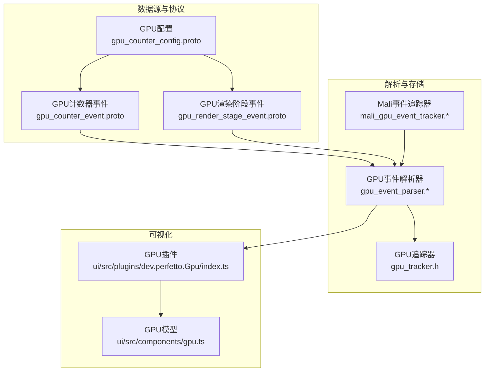
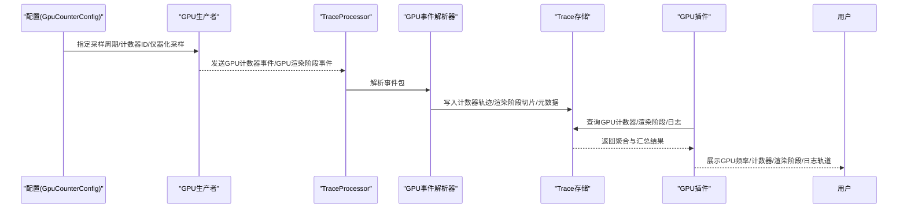
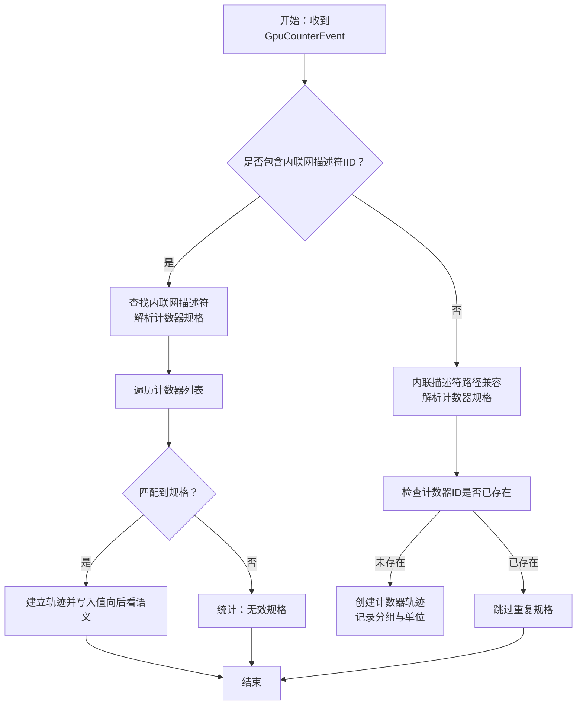
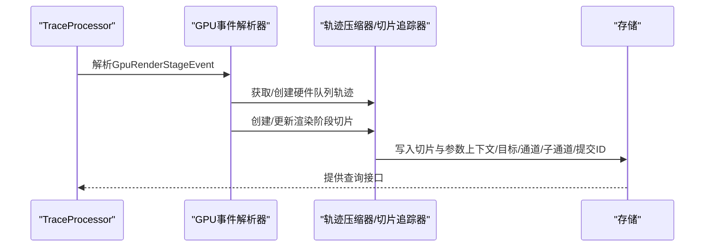
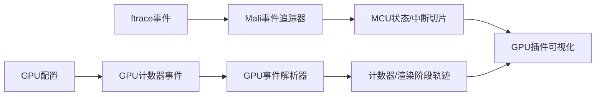
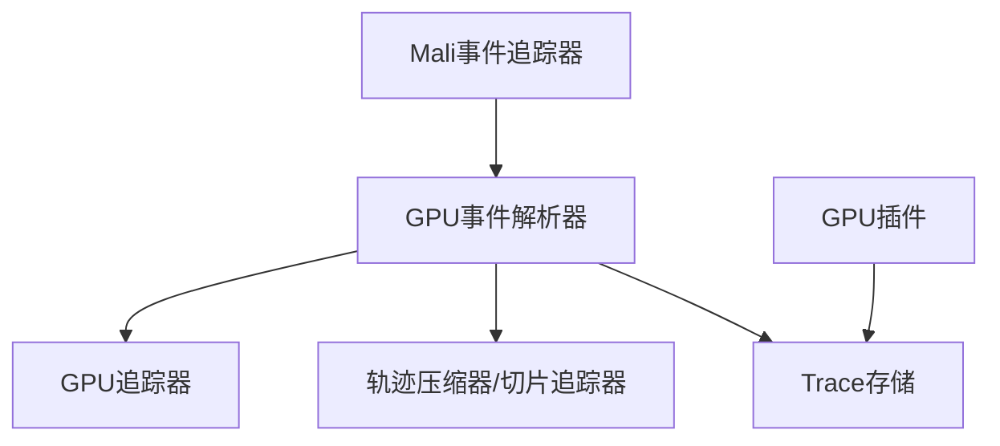

# GPU性能监控探测器

<cite>
**本文引用的文件**
- [gpu.md](file://docs/data-sources/gpu.md)
- [gpu_event_parser.h](file://src/trace_processor/importers/proto/gpu_event_parser.h)
- [gpu_event_parser.cc](file://src/trace_processor/importers/proto/gpu_event_parser.cc)
- [gpu_counter_event.proto](file://protos/perfetto/trace/gpu/gpu_counter_event.proto)
- [gpu_render_stage_event.proto](file://protos/perfetto/trace/gpu/gpu_render_stage_event.proto)
- [gpu_counter_config.proto](file://protos/perfetto/config/gpu/gpu_counter_config.proto)
- [gpu_tracker.h](file://src/trace_processor/importers/common/gpu_tracker.h)
- [mali_gpu_event_tracker.h](file://src/trace_processor/importers/ftrace/mali_gpu_event_tracker.h)
- [mali_gpu_event_tracker.cc](file://src/trace_processor/importers/ftrace/mali_gpu_event_tracker.cc)
- [index.ts（GPU插件）](file://ui/src/plugins/dev.perfetto.Gpu/index.ts)
- [gpu.ts](file://ui/src/components/gpu.ts)
</cite>

## 目录
1. [简介](#简介)
2. [项目结构](#项目结构)
3. [核心组件](#核心组件)
4. [架构总览](#架构总览)
5. [详细组件分析](#详细组件分析)
6. [依赖关系分析](#依赖关系分析)
7. [性能考量](#性能考量)
8. [故障排除指南](#故障排除指南)
9. [结论](#结论)
10. [附录](#附录)

## 简介
本技术文档面向Perfetto的GPU性能监控探测器，系统化阐述GPU计数器监控、渲染管线阶段跟踪与图形性能分析的实现原理与使用方法。重点覆盖以下方面：
- 如何采集GPU利用率、帧时间、顶点处理、像素填充等关键指标
- 与不同GPU厂商驱动的集成方式：ARM Mali、Qualcomm Adreno、NVIDIA等
- 配置参数说明：采样频率、计数器选择、事件过滤
- 实际分析场景与配置示例：如何定位渲染瓶颈并优化图形性能
- 跨平台兼容性与故障排除建议

## 项目结构
围绕GPU数据源，Perfetto在“数据源定义”“解析导入”“UI可视化”三个层面协同工作：
- 数据源定义：通过配置消息与追踪包协议定义GPU计数器、渲染阶段、日志等数据格式
- 解析导入：Trace Processor解析追踪包，构建计数器轨迹、渲染阶段切片、内存分配计数等
- 可视化：UI插件按GPU维度组织频率、计数器、渲染阶段与日志等可视化轨道

**图表来源**
- [gpu_counter_config.proto:21-34](file://protos/perfetto/config/gpu/gpu_counter_config.proto#L21-L34)
- [gpu_counter_event.proto:33-63](file://protos/perfetto/trace/gpu/gpu_counter_event.proto#L33-L63)
- [gpu_render_stage_event.proto:22-127](file://protos/perfetto/trace/gpu/gpu_render_stage_event.proto#L22-L127)
- [gpu_event_parser.h:58-188](file://src/trace_processor/importers/proto/gpu_event_parser.h#L58-L188)
- [gpu_event_parser.cc:343-772](file://src/trace_processor/importers/proto/gpu_event_parser.cc#L343-L772)
- [gpu_tracker.h:32-54](file://src/trace_processor/importers/common/gpu_tracker.h#L32-L54)
- [mali_gpu_event_tracker.h:32-68](file://src/trace_processor/importers/ftrace/mali_gpu_event_tracker.h#L32-L68)
- [mali_gpu_event_tracker.cc:55-199](file://src/trace_processor/importers/ftrace/mali_gpu_event_tracker.cc#L55-L199)
- [index.ts（GPU插件）:77-154](file://ui/src/plugins/dev.perfetto.Gpu/index.ts#L77-L154)
- [gpu.ts:17-36](file://ui/src/components/gpu.ts#L17-L36)

**章节来源**
- [gpu.md:1-200](file://docs/data-sources/gpu.md#L1-L200)
- [gpu_counter_config.proto:21-34](file://protos/perfetto/config/gpu/gpu_counter_config.proto#L21-L34)
- [gpu_counter_event.proto:33-63](file://protos/perfetto/trace/gpu/gpu_counter_event.proto#L33-L63)
- [gpu_render_stage_event.proto:22-127](file://protos/perfetto/trace/gpu/gpu_render_stage_event.proto#L22-L127)
- [gpu_event_parser.h:58-188](file://src/trace_processor/importers/proto/gpu_event_parser.h#L58-L188)
- [gpu_event_parser.cc:343-772](file://src/trace_processor/importers/proto/gpu_event_parser.cc#L343-L772)
- [gpu_tracker.h:32-54](file://src/trace_processor/importers/common/gpu_tracker.h#L32-L54)
- [mali_gpu_event_tracker.h:32-68](file://src/trace_processor/importers/ftrace/mali_gpu_event_tracker.h#L32-L68)
- [mali_gpu_event_tracker.cc:55-199](file://src/trace_processor/importers/ftrace/mali_gpu_event_tracker.cc#L55-L199)
- [index.ts（GPU插件）:77-154](file://ui/src/plugins/dev.perfetto.Gpu/index.ts#L77-L154)
- [gpu.ts:17-36](file://ui/src/components/gpu.ts#L17-L36)

## 核心组件
- GPU事件解析器：负责解析GPU计数器事件与渲染阶段事件，建立计数器轨迹、渲染阶段切片，并维护计数器分组与单位信息
- GPU追踪器：维护系统中各GPU实例的元数据，确保多GPU与多机器场景下的轨迹分组正确
- Mali事件追踪器：解析ARM Mali特定的ftrace事件（如MCU状态、CSF中断），生成专用切片轨道
- UI GPU插件：基于查询结果动态创建GPU频率、计数器、渲染阶段与日志等可视化轨道，并按GPU与机器维度组织显示

**章节来源**
- [gpu_event_parser.h:58-188](file://src/trace_processor/importers/proto/gpu_event_parser.h#L58-L188)
- [gpu_event_parser.cc:343-772](file://src/trace_processor/importers/proto/gpu_event_parser.cc#L343-L772)
- [gpu_tracker.h:32-54](file://src/trace_processor/importers/common/gpu_tracker.h#L32-L54)
- [mali_gpu_event_tracker.h:32-68](file://src/trace_processor/importers/ftrace/mali_gpu_event_tracker.h#L32-L68)
- [mali_gpu_event_tracker.cc:55-199](file://src/trace_processor/importers/ftrace/mali_gpu_event_tracker.cc#L55-L199)
- [index.ts（GPU插件）:77-154](file://ui/src/plugins/dev.perfetto.Gpu/index.ts#L77-L154)

## 架构总览
下图展示从配置到可视化的主要流程：配置指定数据源与采样策略；生产者产出GPU计数器与渲染阶段事件；Trace Processor解析并写入内部存储；UI插件读取并生成可视化轨道。

**图表来源**
- [gpu_counter_config.proto:21-34](file://protos/perfetto/config/gpu/gpu_counter_config.proto#L21-L34)
- [gpu_counter_event.proto:33-63](file://protos/perfetto/trace/gpu/gpu_counter_event.proto#L33-L63)
- [gpu_render_stage_event.proto:22-127](file://protos/perfetto/trace/gpu/gpu_render_stage_event.proto#L22-L127)
- [gpu_event_parser.cc:343-772](file://src/trace_processor/importers/proto/gpu_event_parser.cc#L343-L772)
- [index.ts（GPU插件）:77-154](file://ui/src/plugins/dev.perfetto.Gpu/index.ts#L77-L154)

## 详细组件分析

### GPU计数器监控
- 计数器事件格式与模式
  - 支持两种模式：内联描述符模式（全局ID，需协调）与内联网描述符模式（序列级ID，推荐用于多GPU/多生产者）
  - 计数器值可为整型或浮点型，事件携带计数器ID与值
- 解析与轨迹建立
  - 解析器根据描述符建立计数器轨迹，记录名称、描述、单位与分组
  - 计数器采用“向后看”语义：当前时间戳写占位0，回填上一事件的实际值，保证时序一致性
- 多GPU与多机器
  - 每个计数器轨迹绑定GPU标识与机器标识，UI按GPU与机器维度分组显示

**图表来源**
- [gpu_counter_event.proto:33-63](file://protos/perfetto/trace/gpu/gpu_counter_event.proto#L33-L63)
- [gpu_event_parser.cc:343-456](file://src/trace_processor/importers/proto/gpu_event_parser.cc#L343-L456)
- [gpu_event_parser.cc:325-341](file://src/trace_processor/importers/proto/gpu_event_parser.cc#L325-L341)

**章节来源**
- [gpu_counter_event.proto:25-63](file://protos/perfetto/trace/gpu/gpu_counter_event.proto#L25-L63)
- [gpu_event_parser.cc:325-341](file://src/trace_processor/importers/proto/gpu_event_parser.cc#L325-L341)
- [gpu_event_parser.cc:343-456](file://src/trace_processor/importers/proto/gpu_event_parser.cc#L343-L456)
- [gpu_tracker.h:32-54](file://src/trace_processor/importers/common/gpu_tracker.h#L32-L54)

### 渲染阶段跟踪与图形性能分析
- 渲染阶段事件
  - 包含硬件队列ID/内联网ID、渲染阶段ID/内联网ID、上下文、提交ID、渲染目标、命令缓冲句柄等
  - 支持额外数据字段与子通道掩码，便于关联同一渲染过程的不同阶段
- 切片与维度
  - 基于硬件队列与GPU维度压缩轨迹，生成渲染阶段切片
  - 切片参数包含上下文、渲染目标、渲染通道、子通道、提交ID等，便于定位瓶颈
- Vulkan专用能力
  - 支持VkDebugUtilsObjectName映射，自动补充对象名称
  - 支持驱动侧内存分配计数器更新

**图表来源**
- [gpu_render_stage_event.proto:22-127](file://protos/perfetto/trace/gpu/gpu_render_stage_event.proto#L22-L127)
- [gpu_event_parser.cc:575-772](file://src/trace_processor/importers/proto/gpu_event_parser.cc#L575-L772)
- [gpu_event_parser.cc:483-530](file://src/trace_processor/importers/proto/gpu_event_parser.cc#L483-L530)

**章节来源**
- [gpu_render_stage_event.proto:22-127](file://protos/perfetto/trace/gpu/gpu_render_stage_event.proto#L22-L127)
- [gpu_event_parser.cc:575-772](file://src/trace_processor/importers/proto/gpu_event_parser.cc#L575-L772)
- [gpu_event_parser.cc:483-530](file://src/trace_processor/importers/proto/gpu_event_parser.cc#L483-L530)

### GPU厂商驱动集成
- ARM Mali
  - 通过ftrace解析Mali特定事件，包括CSF中断起止与MCU状态机切换
  - 生成专用切片轨道，便于观察MCU状态与中断行为
- Qualcomm Adreno
  - 文档指出增强对Adreno GPU频率数据轮询的支持，结合计数器事件可进行频率与占用率关联分析
- NVIDIA
  - 通过通用GPU计数器与渲染阶段事件即可采集频率、占用率、内存等指标；具体计数器ID由厂商生产者提供

**图表来源**
- [mali_gpu_event_tracker.h:32-68](file://src/trace_processor/importers/ftrace/mali_gpu_event_tracker.h#L32-L68)
- [mali_gpu_event_tracker.cc:125-199](file://src/trace_processor/importers/ftrace/mali_gpu_event_tracker.cc#L125-L199)
- [gpu.md:20-26](file://docs/data-sources/gpu.md#L20-L26)
- [gpu_counter_event.proto:33-63](file://protos/perfetto/trace/gpu/gpu_counter_event.proto#L33-L63)

**章节来源**
- [mali_gpu_event_tracker.h:32-68](file://src/trace_processor/importers/ftrace/mali_gpu_event_tracker.h#L32-L68)
- [mali_gpu_event_tracker.cc:55-199](file://src/trace_processor/importers/ftrace/mali_gpu_event_tracker.cc#L55-L199)
- [gpu.md:20-26](file://docs/data-sources/gpu.md#L20-L26)

### 配置参数说明
- 采样频率
  - 通过配置项设置计数器采样周期（纳秒），影响数据密度与开销
- 计数器选择
  - 指定要采样的计数器ID集合；ID由描述符中的规格声明给出
- 仪器化采样
  - 以命令缓冲为粒度进行计数器采样，获得更细粒度的提交级指标
- 固定GPU时钟
  - 在会话期间固定GPU时钟，避免动态频率变化对指标的影响

**章节来源**
- [gpu_counter_config.proto:21-34](file://protos/perfetto/config/gpu/gpu_counter_config.proto#L21-L34)

### 实际分析场景与配置示例
- 场景一：Android应用帧时间与GPU占用率关联
  - 使用渲染阶段事件定位卡顿发生的阶段（如顶点装配、光栅化、片段着色）
  - 同时采集GPU频率与占用类计数器，结合UI频率轨道判断是否受限于频率或带宽
- 场景二：Vulkan渲染过程的资源与内存压力
  - 利用渲染阶段事件的上下文、命令缓冲与渲染通道信息，定位高负载子通道
  - 结合Vulkan驱动内存计数器，识别驱动层内存峰值与分配热点
- 场景三：Mali设备的MCU状态与中断行为
  - 通过Mali事件追踪器生成MCU状态与CSF中断切片，排查电源管理或调度问题

**章节来源**
- [gpu_render_stage_event.proto:66-84](file://protos/perfetto/trace/gpu/gpu_render_stage_event.proto#L66-L84)
- [gpu_event_parser.cc:774-800](file://src/trace_processor/importers/proto/gpu_event_parser.cc#L774-L800)
- [mali_gpu_event_tracker.cc:150-171](file://src/trace_processor/importers/ftrace/mali_gpu_event_tracker.cc#L150-L171)

## 依赖关系分析
- 组件耦合
  - GPU事件解析器依赖GPU追踪器与轨迹压缩器，确保计数器与渲染阶段的轨迹正确建立
  - UI GPU插件依赖查询引擎，按GPU与机器维度聚合计数器与切片
- 外部依赖
  - ftrace事件解析（如Mali）与GPU计数器/渲染阶段事件共同构成完整的图形性能画像
- 可能的循环依赖
  - 当前模块间为单向依赖（解析器→存储→UI），无明显循环

**图表来源**
- [gpu_event_parser.h:58-188](file://src/trace_processor/importers/proto/gpu_event_parser.h#L58-L188)
- [gpu_tracker.h:32-54](file://src/trace_processor/importers/common/gpu_tracker.h#L32-L54)
- [mali_gpu_event_tracker.h:32-68](file://src/trace_processor/importers/ftrace/mali_gpu_event_tracker.h#L32-L68)
- [index.ts（GPU插件）:77-154](file://ui/src/plugins/dev.perfetto.Gpu/index.ts#L77-L154)

**章节来源**
- [gpu_event_parser.h:58-188](file://src/trace_processor/importers/proto/gpu_event_parser.h#L58-L188)
- [gpu_tracker.h:32-54](file://src/trace_processor/importers/common/gpu_tracker.h#L32-L54)
- [mali_gpu_event_tracker.h:32-68](file://src/trace_processor/importers/ftrace/mali_gpu_event_tracker.h#L32-L68)
- [index.ts（GPU插件）:77-154](file://ui/src/plugins/dev.perfetto.Gpu/index.ts#L77-L154)

## 性能考量
- 采样频率与开销平衡
  - 更短的采样周期带来更高分辨率但增加解析与存储开销；应根据目标场景折中
- 计数器数量控制
  - 仅选择关键计数器，避免过多计数器导致轨迹膨胀与UI渲染压力
- 仪器化采样的权衡
  - 提交级采样可精确定位瓶颈，但需要在生产端注入计数器读取逻辑，可能引入额外开销
- 多GPU/多机器场景
  - 合理利用gpu_id与machine_id，避免跨设备比较带来的误判

## 故障排除指南
- 无法识别计数器规格
  - 检查是否使用了正确的描述符模式（内联网IID vs 内联描述符）
  - 确认首次包中已提供描述符，且计数器ID与规格一致
- 渲染阶段事件缺失或不完整
  - 确认生产者是否提供了硬件队列与阶段规格，或使用内联网ID引用
  - 检查上下文、提交ID与渲染目标字段是否正确
- 频率数据不可用
  - 对Adreno设备，确认已启用频率轮询；对其他厂商，确认生产者是否提供频率计数器
- UI显示异常
  - 检查GPU元数据是否正确写入（名称、厂商、UUID、PCI BDF），以便UI正确命名与分组

**章节来源**
- [gpu_counter_event.proto:33-63](file://protos/perfetto/trace/gpu/gpu_counter_event.proto#L33-L63)
- [gpu_render_stage_event.proto:22-127](file://protos/perfetto/trace/gpu/gpu_render_stage_event.proto#L22-L127)
- [gpu.md:20-26](file://docs/data-sources/gpu.md#L20-L26)

## 结论
Perfetto的GPU性能监控探测器通过统一的事件协议与解析框架，实现了跨厂商、跨平台的GPU计数器与渲染阶段跟踪。配合UI插件，用户可以直观地定位渲染瓶颈、评估资源占用并制定优化策略。建议在生产端按需选择计数器与采样策略，在消费端结合渲染阶段与频率数据进行综合分析。

## 附录
- 关键术语
  - 计数器：反映GPU资源使用情况的数值指标（如占用率、带宽、频率）
  - 渲染阶段：图形管线的关键阶段（如Binning、Draw、Fragment等）
  - 内联网描述符：序列作用域内的规格描述，支持多GPU/多生产者场景
- 参考文档
  - [GPU数据源文档:1-200](file://docs/data-sources/gpu.md#L1-L200)