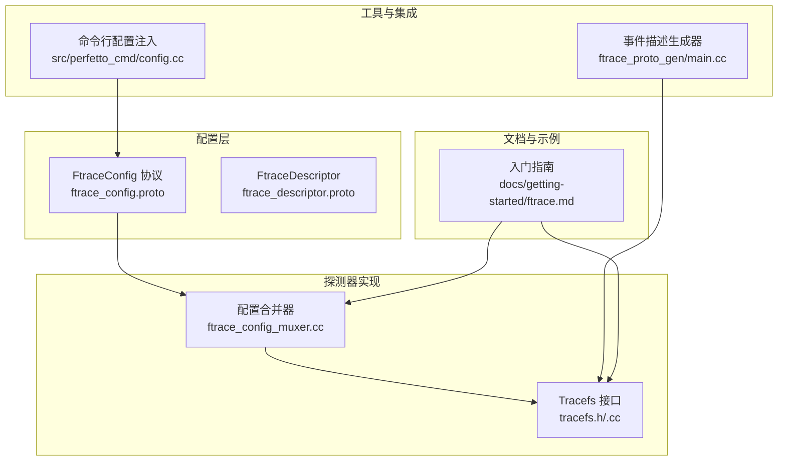
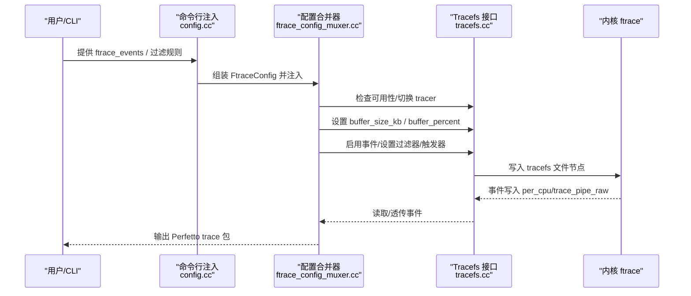
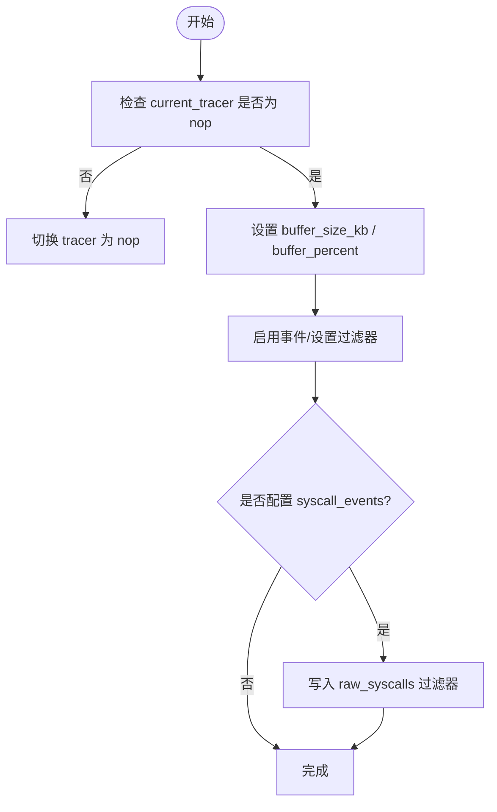
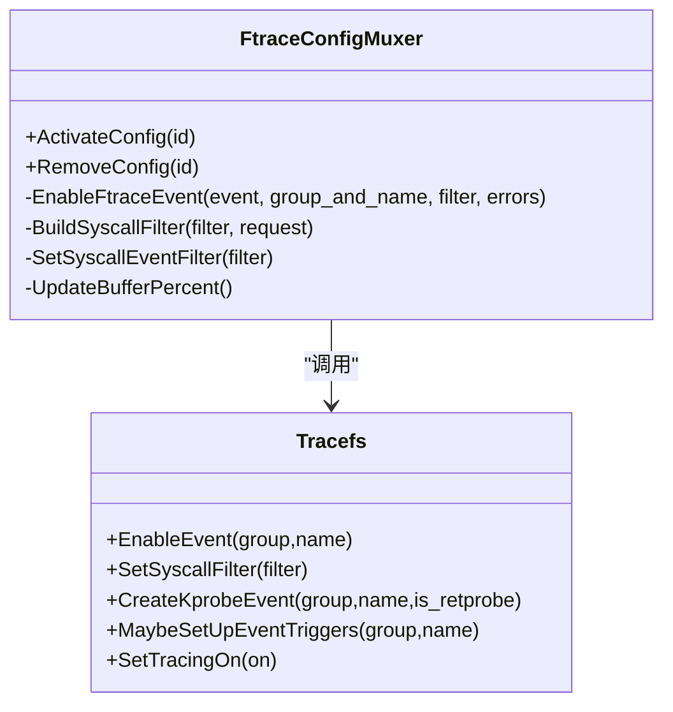
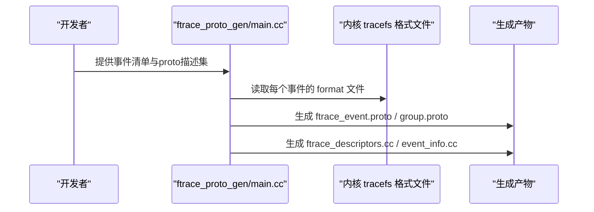
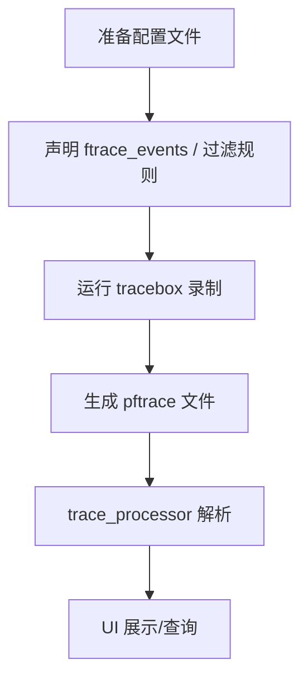
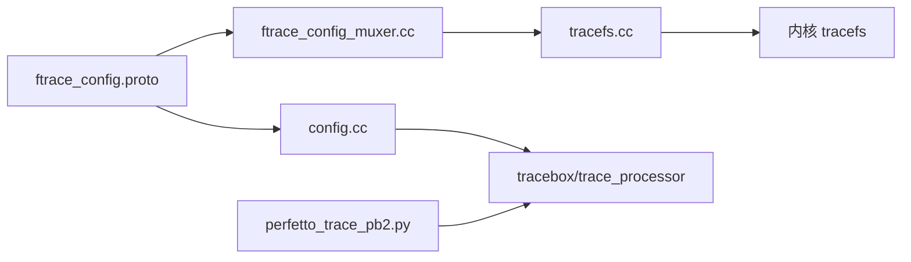

# ftrace内核跟踪探测器

<cite>
**本文引用的文件**   
- [ftrace.md](file://docs/getting-started/ftrace.md)
- [ftrace_config.proto](file://protos/perfetto/config/ftrace/ftrace_config.proto)
- [ftrace_descriptor.proto](file://protos/perfetto/common/ftrace_descriptor.proto)
- [tracefs.h](file://src/traced/probes/ftrace/tracefs.h)
- [tracefs.cc](file://src/traced/probes/ftrace/tracefs.cc)
- [ftrace_config_muxer.cc](file://src/traced/probes/ftrace/ftrace_config_muxer.cc)
- [ftrace_config_muxer_unittest.cc](file://src/traced/probes/ftrace/ftrace_config_muxer_unittest.cc)
- [ftrace_proto_gen/main.cc](file://src/tools/ftrace_proto_gen/main.cc)
- [config.cc](file://src/perfetto_cmd/config.cc)
- [perfetto_trace_pb2.py](file://python/protos/perfetto/trace/perfetto_trace_pb2.py)
</cite>

## 目录
1. [引言](#引言)
2. [项目结构](#项目结构)
3. [核心组件](#核心组件)
4. [架构总览](#架构总览)
5. [详细组件分析](#详细组件分析)
6. [依赖关系分析](#依赖关系分析)
7. [性能考量](#性能考量)
8. [故障排除指南](#故障排除指南)
9. [结论](#结论)
10. [附录](#附录)

## 引言
本技术文档围绕Perfetto中的ftrace内核跟踪探测器展开，系统阐述其工作原理、事件过滤机制、配置方法、数据格式与时间戳同步、解析流程以及性能优化策略。文档面向需要在Linux内核上进行深度系统级分析的工程师与研究者，既提供高层概览，也给出可操作的配置示例与排障建议。

## 项目结构
ftrace探测器相关代码主要分布在以下模块：
- 配置协议：定义用户侧可配置项（事件选择、过滤规则、采样策略等）
- 探测器实现：通过tracefs接口启用/禁用事件、设置过滤器、读取缓冲区
- 生成工具：从内核tracefs格式文件生成编译期事件描述与序列化类型
- 命令行集成：将ftrace配置注入到tracebox/trace_processor等工具链
- 文档与示例：官方入门指南，演示如何记录与可视化ftrace事件

**图表来源**
- [ftrace_config.proto](file://protos/perfetto/config/ftrace/ftrace_config.proto)
- [ftrace_descriptor.proto](file://protos/perfetto/common/ftrace_descriptor.proto)
- [tracefs.h](file://src/traced/probes/ftrace/tracefs.h)
- [tracefs.cc](file://src/traced/probes/ftrace/tracefs.cc)
- [ftrace_config_muxer.cc](file://src/traced/probes/ftrace/ftrace_config_muxer.cc)
- [ftrace_proto_gen/main.cc](file://src/tools/ftrace_proto_gen/main.cc)
- [config.cc](file://src/perfetto_cmd/config.cc)
- [ftrace.md](file://docs/getting-started/ftrace.md)

**章节来源**
- [ftrace_config.proto](file://protos/perfetto/config/ftrace/ftrace_config.proto)
- [ftrace_descriptor.proto](file://protos/perfetto/common/ftrace_descriptor.proto)
- [tracefs.h](file://src/traced/probes/ftrace/tracefs.h)
- [tracefs.cc](file://src/traced/probes/ftrace/tracefs.cc)
- [ftrace_config_muxer.cc](file://src/traced/probes/ftrace/ftrace_config_muxer.cc)
- [ftrace_proto_gen/main.cc](file://src/tools/ftrace_proto_gen/main.cc)
- [config.cc](file://src/perfetto_cmd/config.cc)
- [ftrace.md](file://docs/getting-started/ftrace.md)

## 核心组件
- 配置协议（FtraceConfig）：定义事件白名单、打印事件过滤、系统调用过滤、函数图追踪、kprobe/kretprobe、时钟与实例隔离、CPU掩码、线程过滤等
- Tracefs接口：封装对/sys/kernel/tracing（或/debug/tracing）的访问，提供事件启用/禁用、过滤器写入、触发器管理、缓冲区与时钟设置、CPU统计读取等能力
- 配置合并器（FtraceConfigMuxer）：负责将用户配置转换为对tracefs的实际操作，协调多个并发配置的激活与去激活，维护事件过滤集合
- 事件描述生成器：从内核tracefs格式文件生成编译期事件描述与序列化类型，支持通用事件编码与“更稠密”的调度事件编码
- 命令行集成：将用户输入的ftrace事件列表与过滤规则注入到tracebox/trace_processor的配置中

**章节来源**
- [ftrace_config.proto](file://protos/perfetto/config/ftrace/ftrace_config.proto)
- [tracefs.h](file://src/traced/probes/ftrace/tracefs.h)
- [tracefs.cc](file://src/traced/probes/ftrace/tracefs.cc)
- [ftrace_config_muxer.cc](file://src/traced/probes/ftrace/ftrace_config_muxer.cc)
- [ftrace_proto_gen/main.cc](file://src/tools/ftrace_proto_gen/main.cc)
- [config.cc](file://src/perfetto_cmd/config.cc)

## 架构总览
ftrace探测器以“配置协议 + tracefs接口 + 解析与可视化”三层协作：
- 配置层：用户通过FtraceConfig声明要采集的事件、过滤规则与采样策略
- 探测层：配置合并器根据配置调用Tracefs接口，启用事件、设置过滤器、切换tracer、调整缓冲区与时钟
- 数据层：内核将事件写入trace_pipe_raw，Perfetto读取并解析为二进制trace包，trace_processor进一步解析为UI可读的轨迹与SQL表

**图表来源**
- [config.cc](file://src/perfetto_cmd/config.cc)
- [ftrace_config_muxer.cc](file://src/traced/probes/ftrace/ftrace_config_muxer.cc)
- [tracefs.cc](file://src/traced/probes/ftrace/tracefs.cc)

**章节来源**
- [ftrace_config_muxer.cc](file://src/traced/probes/ftrace/ftrace_config_muxer.cc)
- [tracefs.cc](file://src/traced/probes/ftrace/tracefs.cc)
- [config.cc](file://src/perfetto_cmd/config.cc)

## 详细组件分析

### Tracefs 接口与事件过滤
- 事件启用/禁用：通过写入/events/<group>/<name>/enable或向/set_event追加“<group>:<name>”
- 系统调用过滤：针对raw_syscalls事件组，通过/events/raw_syscalls/{sys_enter,sys_exit}/filter写入表达式
- kprobe/kretprobe：通过/kprobe_events追加“p:<group>/<name> <func>”或“rN:<group>/<name> <func>”
- 触发器：对某些合成事件（如rss_stat_throttled、suspend_resume_minimal），自动/手动设置触发器以派生新事件
- 时钟与缓冲区：设置trace_clock、buffer_size_kb、buffer_percent；按CPU粒度清空缓冲区
- 进程/线程过滤：通过set_event_pid限制事件来源线程

**图表来源**
- [tracefs.cc](file://src/traced/probes/ftrace/tracefs.cc)

**章节来源**
- [tracefs.h](file://src/traced/probes/ftrace/tracefs.h)
- [tracefs.cc](file://src/traced/probes/ftrace/tracefs.cc)

### 配置合并器（FtraceConfigMuxer）
- 将用户配置映射为具体事件与过滤集合
- 处理通用事件（未知事件）与禁用通用事件的策略
- 计算并发配置下的最小buffer_percent并更新
- 在首次激活时开启tracing_on，并在移除配置时清理事件与触发器

**图表来源**
- [ftrace_config_muxer.cc](file://src/traced/probes/ftrace/ftrace_config_muxer.cc)
- [tracefs.cc](file://src/traced/probes/ftrace/tracefs.cc)

**章节来源**
- [ftrace_config_muxer.cc](file://src/traced/probes/ftrace/ftrace_config_muxer.cc)

### 事件描述生成器与协议扩展
- 从内核tracefs格式文件读取事件字段，生成编译期事件描述与序列化类型
- 支持通用事件编码（GenericFtraceEvent）与“更稠密”的调度事件编码
- 生成ftrace_descriptors与event_info，供解析器使用

**图表来源**
- [ftrace_proto_gen/main.cc](file://src/tools/ftrace_proto_gen/main.cc)

**章节来源**
- [ftrace_proto_gen/main.cc](file://src/tools/ftrace_proto_gen/main.cc)

### 配置示例与使用流程
- 使用tracebox录制指定事件（如“ticker/ticker_tick”）
- 通过FtraceConfig声明事件白名单、打印事件过滤、系统调用过滤、紧凑调度编码等
- 命令行工具将配置注入tracebox，最终输出pftrace文件供trace_processor/UI解析

**图表来源**
- [ftrace.md](file://docs/getting-started/ftrace.md)
- [ftrace_config.proto](file://protos/perfetto/config/ftrace/ftrace_config.proto)

**章节来源**
- [ftrace.md](file://docs/getting-started/ftrace.md)
- [ftrace_config.proto](file://protos/perfetto/config/ftrace/ftrace_config.proto)

## 依赖关系分析
- 配置协议依赖：FtraceConfig与PrintFilter、KprobeEvent、TracefsOption等消息类型
- 运行时依赖：Tracefs对tracefs文件系统的直接访问；配置合并器依赖事件表与错误收集
- 工具链依赖：命令行注入将FtraceConfig序列化后嵌入到tracebox配置；Python侧生成的trace包类型包含ftrace事件字段

**图表来源**
- [ftrace_config.proto](file://protos/perfetto/config/ftrace/ftrace_config.proto)
- [ftrace_config_muxer.cc](file://src/traced/probes/ftrace/ftrace_config_muxer.cc)
- [tracefs.cc](file://src/traced/probes/ftrace/tracefs.cc)
- [config.cc](file://src/perfetto_cmd/config.cc)
- [perfetto_trace_pb2.py](file://python/protos/perfetto/trace/perfetto_trace_pb2.py)

**章节来源**
- [ftrace_config.proto](file://protos/perfetto/config/ftrace/ftrace_config.proto)
- [ftrace_config_muxer.cc](file://src/traced/probes/ftrace/ftrace_config_muxer.cc)
- [tracefs.cc](file://src/traced/probes/ftrace/tracefs.cc)
- [config.cc](file://src/perfetto_cmd/config.cc)
- [perfetto_trace_pb2.py](file://python/protos/perfetto/trace/perfetto_trace_pb2.py)

## 性能考量
- 缓冲区与水位：buffer_size_kb与drain_buffer_percent共同决定内核缓冲区大小与主动拉取阈值，避免丢包但增加CPU占用
- 事件数量与过滤：仅启用必要事件，合理使用事件过滤与打印事件过滤，降低带宽与解析成本
- 采样与紧凑编码：对高频率事件（如调度）启用紧凑编码，减少序列化体积
- 函数图追踪：启用function_graph需配合函数过滤与最大深度限制，否则事件量会激增
- kprobe开销：kprobe/kretprobe会引入内核hook开销，应谨慎选择目标函数并控制数量
- 时钟选择：优先使用内核提供的单调时钟，避免跨时钟域同步误差

[本节为通用指导，无需列出具体文件来源]

## 故障排除指南
- 无法启用事件
  - 检查事件是否存在且enable文件可写
  - 若事件为合成事件，确认触发器已正确设置/清理
- 事件过滤无效
  - 确认raw_syscalls过滤器写入路径与表达式语法正确
  - 对于打印事件过滤，确保规则顺序与匹配逻辑符合预期
- 时钟不一致
  - 设置trace_clock为boot或对应平台推荐时钟
  - 在多源追踪场景下避免时钟漂移
- 缓冲区溢出
  - 调整buffer_size_kb与drain_buffer_percent，或减少事件数量
- 函数图追踪冲突
  - 确保与其他ftrace数据源不同时启用不同tracer
- kprobe重复/残留
  - 清理/kprobe_events中的残留条目，避免后续创建失败

**章节来源**
- [tracefs.cc](file://src/traced/probes/ftrace/tracefs.cc)
- [ftrace_config_muxer_unittest.cc](file://src/traced/probes/ftrace/ftrace_config_muxer_unittest.cc)

## 结论
Perfetto的ftrace探测器通过清晰的配置协议、稳健的tracefs接口与完善的生成工具链，实现了对内核事件的高效采集与解析。遵循本文的配置策略与性能优化建议，可在保证追踪精度的同时将系统开销控制在合理范围内，并借助trace_processor与UI获得直观的可视化结果。

[本节为总结性内容，无需列出具体文件来源]

## 附录

### 关键配置项速览
- 事件选择：ftrace_events（支持通配符）
- 打印事件过滤：print_filter（前缀/ATrace消息规则）
- 系统调用过滤：syscall_events（或raw_syscalls/sys_{enter,exit}）
- 缓冲区与拉取：buffer_size_kb、drain_buffer_percent
- 时钟与时序：trace_clock、use_monotonic_raw_clock
- 函数图追踪：enable_function_graph、function_filters、function_graph_roots、function_graph_max_depth
- kprobe/kretprobe：kprobe_events
- 实例与隔离：instance_name、preserve_ftrace_buffer
- 进程/线程过滤：tids_to_trace、tracefs_options（含event-fork）

**章节来源**
- [ftrace_config.proto](file://protos/perfetto/config/ftrace/ftrace_config.proto)