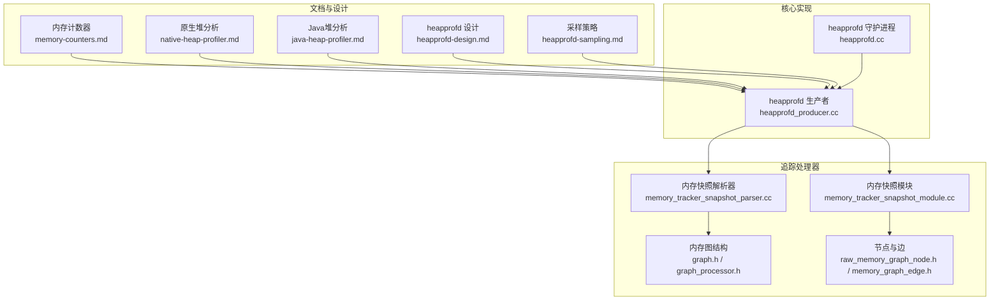
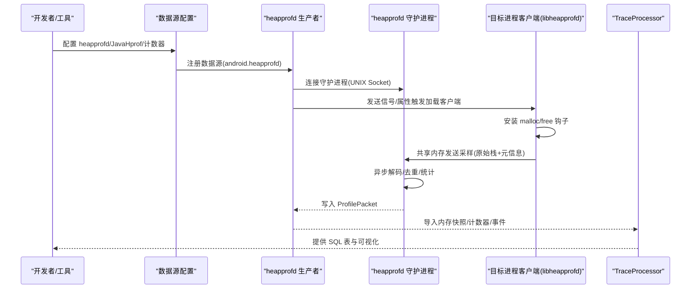
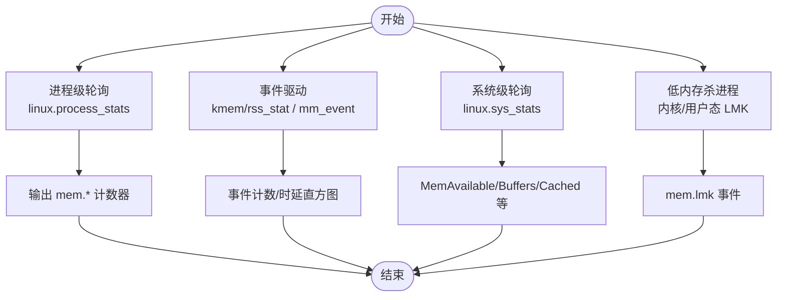
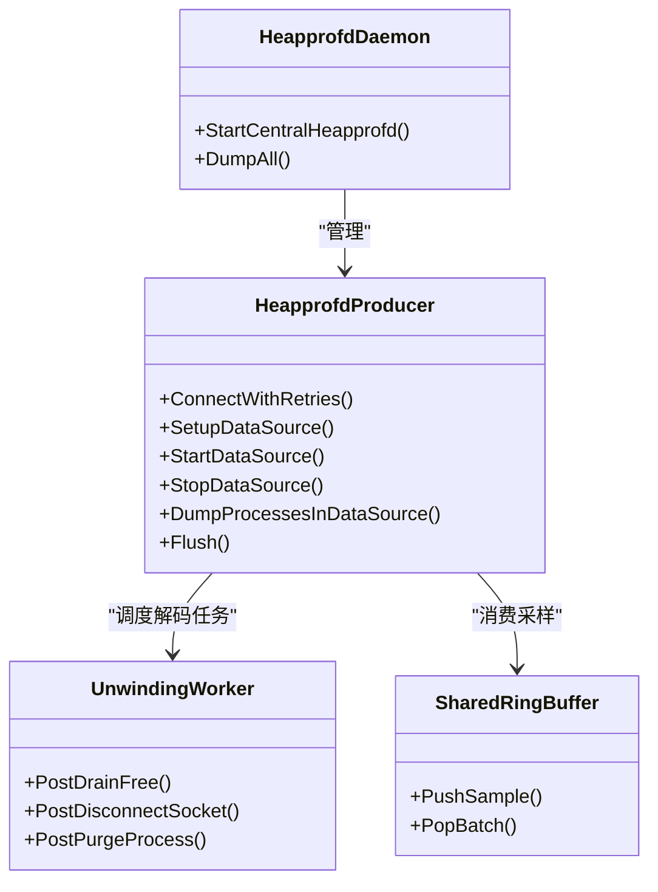
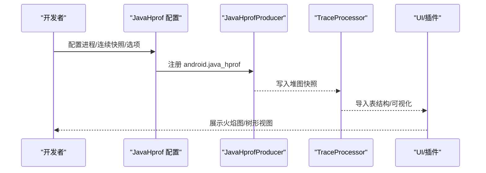
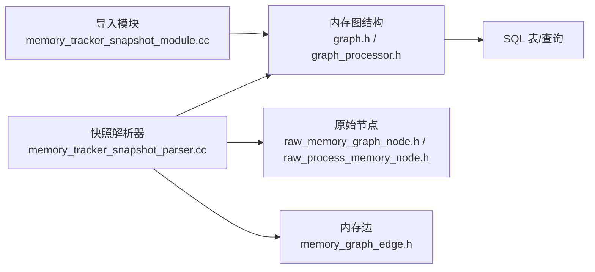
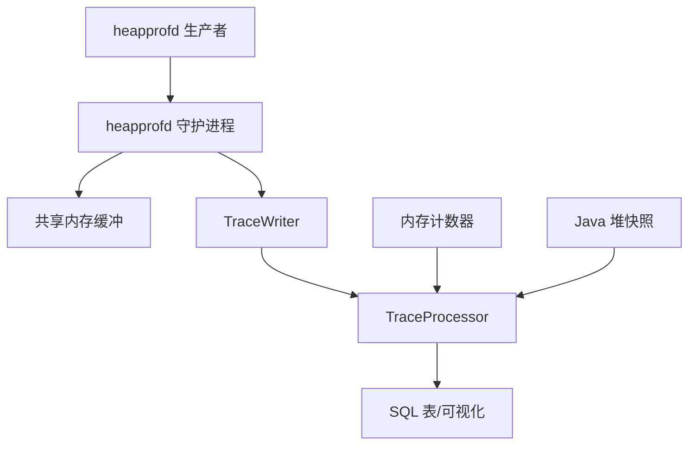

# 内存性能监控探测器

<cite>
**本文引用的文件**
- [memory-counters.md](file://docs/data-sources/memory-counters.md)
- [native-heap-profiler.md](file://docs/data-sources/native-heap-profiler.md)
- [java-heap-profiler.md](file://docs/data-sources/java-heap-profiler.md)
- [heapprofd-design.md](file://docs/design-docs/heapprofd-design.md)
- [heapprofd-sampling.md](file://docs/design-docs/heapprofd-sampling.md)
- [memory.md](file://docs/case-studies/memory.md)
- [heapprofd.cc](file://src/profiling/memory/heapprofd.cc)
- [heapprofd_producer.cc](file://src/profiling/memory/heapprofd_producer.cc)
- [memory_tracker_snapshot_parser.cc](file://src/trace_processor/importers/proto/memory_tracker_snapshot_parser.cc)
- [memory_tracker_snapshot_module.cc](file://src/trace_processor/importers/proto/memory_tracker_snapshot_module.cc)
- [memory_tracker/graph.h](file://include/perfetto/ext/trace_processor/importers/memory_tracker/graph.h)
- [memory_tracker/graph_processor.h](file://include/perfetto/ext/trace_processor/importers/memory_tracker/graph_processor.h)
- [memory_tracker/raw_memory_graph_node.h](file://include/perfetto/ext/trace_processor/importers/memory_tracker/raw_memory_graph_node.h)
- [memory_tracker/raw_process_memory_node.h](file://include/perfetto/ext/trace_processor/importers/memory_tracker/raw_process_memory_node.h)
- [memory_tracker/memory_allocator_node_id.h](file://include/perfetto/ext/trace_processor/importers/memory_tracker/memory_allocator_node_id.h)
- [memory_tracker/memory_graph_edge.h](file://include/perfetto/ext/trace_processor/importers/memory_tracker/memory_graph_edge.h)
</cite>

## 目录
1. [简介](#简介)
2. [项目结构](#项目结构)
3. [核心组件](#核心组件)
4. [架构总览](#架构总览)
5. [详细组件分析](#详细组件分析)
6. [依赖关系分析](#依赖关系分析)
7. [性能考量](#性能考量)
8. [故障排查指南](#故障排查指南)
9. [结论](#结论)
10. [附录](#附录)

## 简介
本技术文档围绕 Perfetto 的内存性能监控探测器，系统阐述三类能力：内存计数器监控（物理内存、缓存、页面错误等）、原生堆分析（内存分配跟踪、泄漏定位、性能影响评估）与 Java 堆分析（与 JVM 集成、GC 与对象分配事件捕获）。文档从架构设计、数据流、处理逻辑、配置参数到实际诊断场景与优化建议进行全链路解析，帮助读者在真实环境中高效定位内存问题。

## 项目结构
- 文档层：位于 docs/data-sources 与 docs/design-docs，覆盖数据源定义、设计原理与采样策略。
- 核心实现：位于 src/profiling/memory，包含 heapprofd 守护进程、生产者（Producer）与客户端配置转换。
- 追踪处理器：位于 src/trace_processor/importers，负责将内存快照与追踪数据导入标准表结构，便于查询与可视化。
- UI 与插件：位于 ui/plugins，提供内存快照与火焰图等可视化入口。

**图表来源**
- [memory-counters.md](file://docs/data-sources/memory-counters.md)
- [native-heap-profiler.md](file://docs/data-sources/native-heap-profiler.md)
- [java-heap-profiler.md](file://docs/data-sources/java-heap-profiler.md)
- [heapprofd-design.md](file://docs/design-docs/heapprofd-design.md)
- [heapprofd-sampling.md](file://docs/design-docs/heapprofd-sampling.md)
- [heapprofd.cc](file://src/profiling/memory/heapprofd.cc)
- [heapprofd_producer.cc](file://src/profiling/memory/heapprofd_producer.cc)
- [memory_tracker_snapshot_parser.cc](file://src/trace_processor/importers/proto/memory_tracker_snapshot_parser.cc)
- [memory_tracker_snapshot_module.cc](file://src/trace_processor/importers/proto/memory_tracker_snapshot_module.cc)
- [graph.h](file://include/perfetto/ext/trace_processor/importers/memory_tracker/graph.h)
- [graph_processor.h](file://include/perfetto/ext/trace_processor/importers/memory_tracker/graph_processor.h)
- [raw_memory_graph_node.h](file://include/perfetto/ext/trace_processor/importers/memory_tracker/raw_memory_graph_node.h)
- [memory_graph_edge.h](file://include/perfetto/ext/trace_processor/importers/memory_tracker/memory_graph_edge.h)

**章节来源**
- [memory-counters.md](file://docs/data-sources/memory-counters.md)
- [native-heap-profiler.md](file://docs/data-sources/native-heap-profiler.md)
- [java-heap-profiler.md](file://docs/data-sources/java-heap-profiler.md)
- [heapprofd-design.md](file://docs/design-docs/heapprofd-design.md)
- [heapprofd-sampling.md](file://docs/design-docs/heapprofd-sampling.md)
- [heapprofd.cc](file://src/profiling/memory/heapprofd.cc)
- [heapprofd_producer.cc](file://src/profiling/memory/heapprofd_producer.cc)
- [memory_tracker_snapshot_parser.cc](file://src/trace_processor/importers/proto/memory_tracker_snapshot_parser.cc)
- [memory_tracker_snapshot_module.cc](file://src/trace_processor/importers/proto/memory_tracker_snapshot_module.cc)
- [graph.h](file://include/perfetto/ext/trace_processor/importers/memory_tracker/graph.h)
- [graph_processor.h](file://include/perfetto/ext/trace_processor/importers/memory_tracker/graph_processor.h)
- [raw_memory_graph_node.h](file://include/perfetto/ext/trace_processor/importers/memory_tracker/raw_memory_graph_node.h)
- [memory_graph_edge.h](file://include/perfetto/ext/trace_processor/importers/memory_tracker/memory_graph_edge.h)

## 核心组件
- 内存计数器监控：通过 linux.process_stats、linux.ftrace 与 linux.sys_stats 汇聚进程级与系统级内存指标（如虚拟/常驻/匿名/文件页、缓存、交换、页面错误、低内存杀进程等），支持周期性轮询与事件驱动两种模式。
- 原生堆分析（heapprofd）：以“客户端钩子 + 中央守护进程”架构，对 malloc/new/delete/free 等调用进行采样记录，远程解码栈并统计存活分配，生成可与系统活动关联的火焰图。
- Java 堆分析：通过 android.java_hprof 数据源采集 Java 对象图快照，结合 GC 根路径与最短路径聚合，展示保留大小与对象数量视图。
- 追踪处理器：将内存快照与追踪包导入统一表结构，提供 SQL 查询接口与可视化树形/火焰图。

**章节来源**
- [memory-counters.md](file://docs/data-sources/memory-counters.md)
- [native-heap-profiler.md](file://docs/data-sources/native-heap-profiler.md)
- [java-heap-profiler.md](file://docs/data-sources/java-heap-profiler.md)
- [heapprofd-design.md](file://docs/design-docs/heapprofd-design.md)
- [heapprofd-sampling.md](file://docs/design-docs/heapprofd-sampling.md)
- [memory_tracker_snapshot_parser.cc](file://src/trace_processor/importers/proto/memory_tracker_snapshot_parser.cc)
- [memory_tracker_snapshot_module.cc](file://src/trace_processor/importers/proto/memory_tracker_snapshot_module.cc)

## 架构总览
heapprofd 采用“出站式”架构：在被探目标进程中安装最小化钩子，将原始栈拷贝至共享内存缓冲；中央守护进程异步解码、去重、统计，并写入 Perfetto 追踪包。内存计数器与 Java 堆快照分别由独立数据源按需采集，最终统一在 TraceProcessor 中导入与查询。

**图表来源**
- [heapprofd.cc](file://src/profiling/memory/heapprofd.cc)
- [heapprofd_producer.cc](file://src/profiling/memory/heapprofd_producer.cc)
- [heapprofd-design.md](file://docs/design-docs/heapprofd-design.md)

**章节来源**
- [heapprofd.cc](file://src/profiling/memory/heapprofd.cc)
- [heapprofd_producer.cc](file://src/profiling/memory/heapprofd_producer.cc)
- [heapprofd-design.md](file://docs/design-docs/heapprofd-design.md)

## 详细组件分析

### 内存计数器监控
- 进程级轮询：linux.process_stats 读取 /proc/<pid>/status 与 oom_score_adj，支持自定义轮询周期，输出 mem.* 计数器序列。
- 事件驱动：kmem/rss_stat 推送 RSS 变化事件；mm_event 记录页面错误、回收、压缩等直方图事件，显著降低高吞吐开销。
- 系统级轮询：linux.sys_stats 轮询 /proc/vmstat、/proc/meminfo、/proc/stat，支持选择性计数器与周期配置。
- 低内存杀进程(LMK)：支持内核低内存杀手与用户态 lmkd 事件，统一归一化为 instants.mem.lmk，配合 oom_score_adj 判断进程状态。

**图表来源**
- [memory-counters.md](file://docs/data-sources/memory-counters.md)

**章节来源**
- [memory-counters.md](file://docs/data-sources/memory-counters.md)

### 原生堆分析器（heapprofd）
- 启动与连接：守护进程通过环境变量继承监听套接字，注册 android.heapprofd 数据源，建立与 traced 的 Producer 连接。
- 客户端钩子：libc 在收到实时信号后动态加载客户端库，安装 malloc/new/delete/free 钩子；每次分配拷贝当前栈到共享内存，随后唤醒守护进程。
- 解码与统计：守护进程多线程解码原始栈，构建调用栈树与存活分配表，支持按进程/堆区分统计；连续快照支持时间轴火焰图。
- 配置与采样：支持采样间隔、阻塞策略、堆选择/排除、自适应阈值与最大采样间隔等；采样采用泊松分布近似，避免高频分配带来的性能抖动。
- 错误与回退：缓冲区溢出、客户端崩溃、fork/vfork 处理等均有明确失败模式与降级策略。

**图表来源**
- [heapprofd.cc](file://src/profiling/memory/heapprofd.cc)
- [heapprofd_producer.cc](file://src/profiling/memory/heapprofd_producer.cc)

**章节来源**
- [heapprofd.cc](file://src/profiling/memory/heapprofd.cc)
- [heapprofd_producer.cc](file://src/profiling/memory/heapprofd_producer.cc)
- [heapprofd-design.md](file://docs/design-docs/heapprofd-design.md)
- [heapprofd-sampling.md](file://docs/design-docs/heapprofd-sampling.md)

### Java 堆分析器
- 数据源：android.java_hprof，支持按进程名或 PID 触发堆快照，支持连续快照与 smaps 输出。
- 图结构：导出 heap_graph_class、heap_graph_object、heap_graph_reference 表，支持按最短路径/支配树聚合，展示保留大小与对象数量。
- 与系统集成：与 ART 运行时协作，捕获对象分配与 GC 根路径，辅助定位大对象与长生命周期持有。

**图表来源**
- [java-heap-profiler.md](file://docs/data-sources/java-heap-profiler.md)
- [memory_tracker_snapshot_parser.cc](file://src/trace_processor/importers/proto/memory_tracker_snapshot_parser.cc)
- [memory_tracker_snapshot_module.cc](file://src/trace_processor/importers/proto/memory_tracker_snapshot_module.cc)

**章节来源**
- [java-heap-profiler.md](file://docs/data-sources/java-heap-profiler.md)
- [memory_tracker_snapshot_parser.cc](file://src/trace_processor/importers/proto/memory_tracker_snapshot_parser.cc)
- [memory_tracker_snapshot_module.cc](file://src/trace_processor/importers/proto/memory_tracker_snapshot_module.cc)

### 追踪处理器与内存图结构
- 快照解析：将内存快照包解析为统一的内存图节点与边结构，支持进程维度与堆维度统计。
- 图结构：graph.h/graph_processor.h 定义内存图的节点、边与遍历算法；raw_memory_graph_node.h/raw_process_memory_node.h 描述原始内存节点与进程节点；memory_graph_edge.h 描述节点间关系。
- 模块化导入：memory_tracker_snapshot_module.cc 将快照模块注册到导入管线，与标准库表对接，便于 SQL 查询与可视化。

**图表来源**
- [memory_tracker_snapshot_parser.cc](file://src/trace_processor/importers/proto/memory_tracker_snapshot_parser.cc)
- [memory_tracker_snapshot_module.cc](file://src/trace_processor/importers/proto/memory_tracker_snapshot_module.cc)
- [graph.h](file://include/perfetto/ext/trace_processor/importers/memory_tracker/graph.h)
- [graph_processor.h](file://include/perfetto/ext/trace_processor/importers/memory_tracker/graph_processor.h)
- [raw_memory_graph_node.h](file://include/perfetto/ext/trace_processor/importers/memory_tracker/raw_memory_graph_node.h)
- [raw_process_memory_node.h](file://include/perfetto/ext/trace_processor/importers/memory_tracker/raw_process_memory_node.h)
- [memory_graph_edge.h](file://include/perfetto/ext/trace_processor/importers/memory_tracker/memory_graph_edge.h)

**章节来源**
- [memory_tracker_snapshot_parser.cc](file://src/trace_processor/importers/proto/memory_tracker_snapshot_parser.cc)
- [memory_tracker_snapshot_module.cc](file://src/trace_processor/importers/proto/memory_tracker_snapshot_module.cc)
- [graph.h](file://include/perfetto/ext/trace_processor/importers/memory_tracker/graph.h)
- [graph_processor.h](file://include/perfetto/ext/trace_processor/importers/memory_tracker/graph_processor.h)
- [raw_memory_graph_node.h](file://include/perfetto/ext/trace_processor/importers/memory_tracker/raw_memory_graph_node.h)
- [raw_process_memory_node.h](file://include/perfetto/ext/trace_processor/importers/memory_tracker/raw_process_memory_node.h)
- [memory_graph_edge.h](file://include/perfetto/ext/trace_processor/importers/memory_tracker/memory_graph_edge.h)

## 依赖关系分析
- 组件耦合：heapprofd 生产者与守护进程通过 UNIX 套接字通信，共享内存缓冲承载客户端与服务端之间的低延迟数据通道；客户端仅承担最小化钩子职责，降低被探进程的侵入性。
- 外部依赖：依赖 libunwindstack 进行远程栈解码；依赖 traced 作为统一的追踪服务；依赖 TraceProcessor 进行导入与查询。
- 数据流：计数器/事件经 ftrace/sysfs 聚合；原生堆采样经共享内存传输；Java 堆快照经数据源直接写入；最终统一导入标准表结构。

**图表来源**
- [heapprofd_producer.cc](file://src/profiling/memory/heapprofd_producer.cc)
- [heapprofd.cc](file://src/profiling/memory/heapprofd.cc)
- [memory-counters.md](file://docs/data-sources/memory-counters.md)
- [java-heap-profiler.md](file://docs/data-sources/java-heap-profiler.md)

**章节来源**
- [heapprofd_producer.cc](file://src/profiling/memory/heapprofd_producer.cc)
- [heapprofd.cc](file://src/profiling/memory/heapprofd.cc)
- [memory-counters.md](file://docs/data-sources/memory-counters.md)
- [java-heap-profiler.md](file://docs/data-sources/java-heap-profiler.md)

## 性能考量
- 采样策略：heapprofd 采用泊松采样，对大分配直接计入，小分配通过指数分布抽样估算，兼顾覆盖率与性能；默认采样间隔通常为 4KB 左右，可根据目标进程压力调整。
- 远程解码：将昂贵的栈解码与符号化移至守护进程，客户端仅拷贝栈帧，显著降低被探进程的 CPU 开销与抖动。
- 缓冲与背压：共享内存缓冲大小与阻塞策略可调；当缓冲区满时可选择阻塞客户端或丢弃样本，避免系统级雪崩。
- 并发与稳定性：多线程解码器与弱引用重启机制提升长时间运行的稳定性；针对 fork/vfork 场景有明确处理策略。

**章节来源**
- [heapprofd-sampling.md](file://docs/design-docs/heapprofd-sampling.md)
- [heapprofd-design.md](file://docs/design-docs/heapprofd-design.md)
- [heapprofd_producer.cc](file://src/profiling/memory/heapprofd_producer.cc)

## 故障排查指南
- heapprofd 缓冲溢出：若分配速率过高导致缓冲区满，采样会提前终止。可通过增大共享内存缓冲或提高采样间隔缓解；瞬时尖峰可用阻塞模式等待空间释放。
- 目标进程不可被探：检查应用是否具备 profileable/debuggable 标志，或设备是否为 userdebug 并已禁用 SELinux；必要时使用 --disable-selinux 或设置系统属性。
- 符号化失败：确认 llvm-symbolizer 可用且二进制 Build ID 匹配；或启用索引模式递归搜索；缺失 unwind 信息会导致帧展开不完整。
- Java 堆采样异常：确保 Android 版本满足要求（Java 堆采样需 Android 12+，Java 堆快照需 Android 11+）；关注 ART 版本差异导致的帧展开问题。
- LMK 事件异常：确认内核版本与设备配置是否支持 lmkd；必要时同时采集低内存杀手与 oom_score_adj 事件以便定位。

**章节来源**
- [native-heap-profiler.md](file://docs/data-sources/native-heap-profiler.md)
- [java-heap-profiler.md](file://docs/data-sources/java-heap-profiler.md)
- [memory-counters.md](file://docs/data-sources/memory-counters.md)
- [memory.md](file://docs/case-studies/memory.md)

## 结论
Perfetto 的内存监控体系通过“计数器+事件+原生堆+Java 堆”的组合，覆盖从宏观内存趋势到微观分配路径的全链路诊断需求。heapprofd 的出站式采样与远程解码架构在保证可观测性的同时，将对被探进程的影响降至最低；配合 TraceProcessor 的统一导入与 SQL 查询，能够快速定位内存热点与泄漏根因。

## 附录

### 配置参数说明（节选）
- heapprofd 通用
  - 采样间隔：采样字节数（默认约 4KB），越大越低开销但精度下降
  - 阻塞策略：达到缓冲上限时是否阻塞客户端
  - 堆选择：指定堆名称或排除特定堆
  - 自适应阈值：根据共享内存占用动态调整采样间隔
  - 连续快照：设置快照间隔与相位，生成时间轴火焰图
- Java 堆快照
  - 进程名/进程 ID：目标进程过滤
  - 连续快照：dump 间隔与相位
  - smaps 输出：附加映射信息
- 内存计数器
  - 进程轮询周期：proc_stats_poll_ms
  - 系统轮询周期：meminfo_period_ms/vmstat_period_ms/stat_period_ms
  - 事件开关：rss_stat/mm_event/低内存杀进程等

**章节来源**
- [native-heap-profiler.md](file://docs/data-sources/native-heap-profiler.md)
- [java-heap-profiler.md](file://docs/data-sources/java-heap-profiler.md)
- [memory-counters.md](file://docs/data-sources/memory-counters.md)

### 实际诊断场景与配置示例
- 场景一：定位突发内存峰值（短时数百 MB）导致 LMK
  - 使用 linux.ftrace 的 kmem/rss_stat 与 mm_event，结合 linux.process_stats 的 mem.rss.anon，观察峰值发生时刻与持续时间；必要时叠加低内存杀进程事件定位被杀进程状态。
- 场景二：原生堆泄漏定位（malloc/new）
  - 使用 heapprofd，设置较小采样间隔（如 1KB）以提升覆盖率；关注“未释放 malloc 大小”视图，聚焦高贡献调用栈；必要时开启连续快照观察泄漏随时间增长。
- 场景三：Java 堆大对象与长生命周期持有
  - 使用 Java 堆快照，打开“大小/对象数/支配树”视图，聚焦最长路径与支配树节点；结合 GC 根路径判断保留原因。
- 场景四：mmap 直接映射内存（如图形/媒体）
  - 使用 linux.ftrace 的 sys_mmap/sys_munmap 或 linux.perf 的 raw_syscalls:sys_enter，period=1 记录每次 mmap 的调用栈。

**章节来源**
- [memory.md](file://docs/case-studies/memory.md)
- [memory-counters.md](file://docs/data-sources/memory-counters.md)
- [native-heap-profiler.md](file://docs/data-sources/native-heap-profiler.md)
- [java-heap-profiler.md](file://docs/data-sources/java-heap-profiler.md)

### 最佳实践
- 采样策略：优先使用默认采样间隔，若出现缓冲溢出再逐步增大间隔；对高并发分配密集型服务可考虑阻塞模式以保证完整性。
- 目标选择：优先按进程名匹配，避免对所有进程采样造成过载；对 zygote 子进程可利用启动属性自动注入。
- 可视化与查询：结合 UI 火焰图与 SQL 聚合（如按类/函数/映射聚合），先定性后定量；对 Java 堆使用最短路径与支配树双视角交叉验证。
- 稳定性：长时间采样建议启用弱引用重启与连接重试；对 fork/vfork 场景保持关注，必要时关闭 fork 清理以避免误判。
- 符号化：在离线阶段完成符号化与混淆映射，减少在线开销；确保 Build ID 一致与 unwind 信息完备。

**章节来源**
- [heapprofd-design.md](file://docs/design-docs/heapprofd-design.md)
- [heapprofd-sampling.md](file://docs/design-docs/heapprofd-sampling.md)
- [native-heap-profiler.md](file://docs/data-sources/native-heap-profiler.md)
- [java-heap-profiler.md](file://docs/data-sources/java-heap-profiler.md)
- [memory.md](file://docs/case-studies/memory.md)