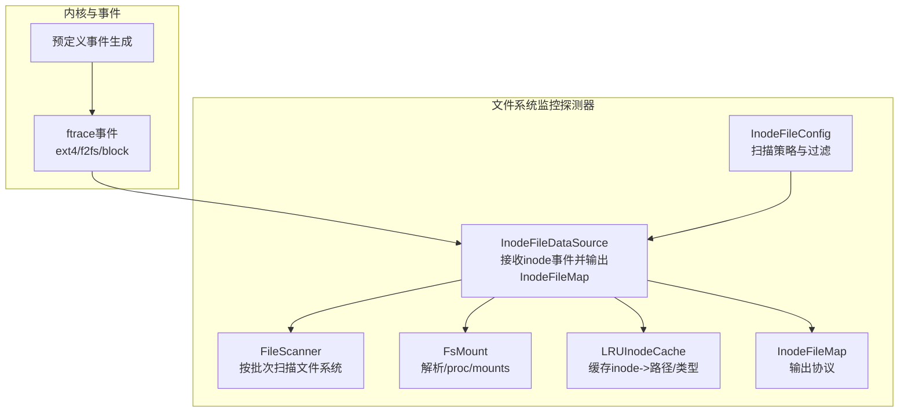
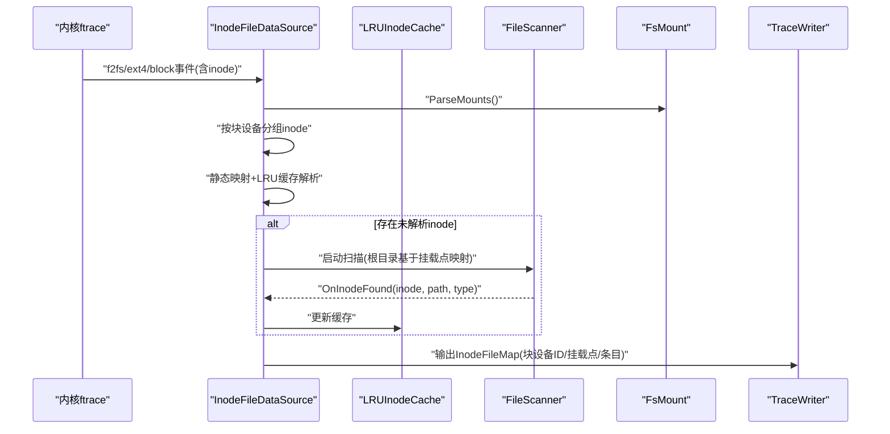
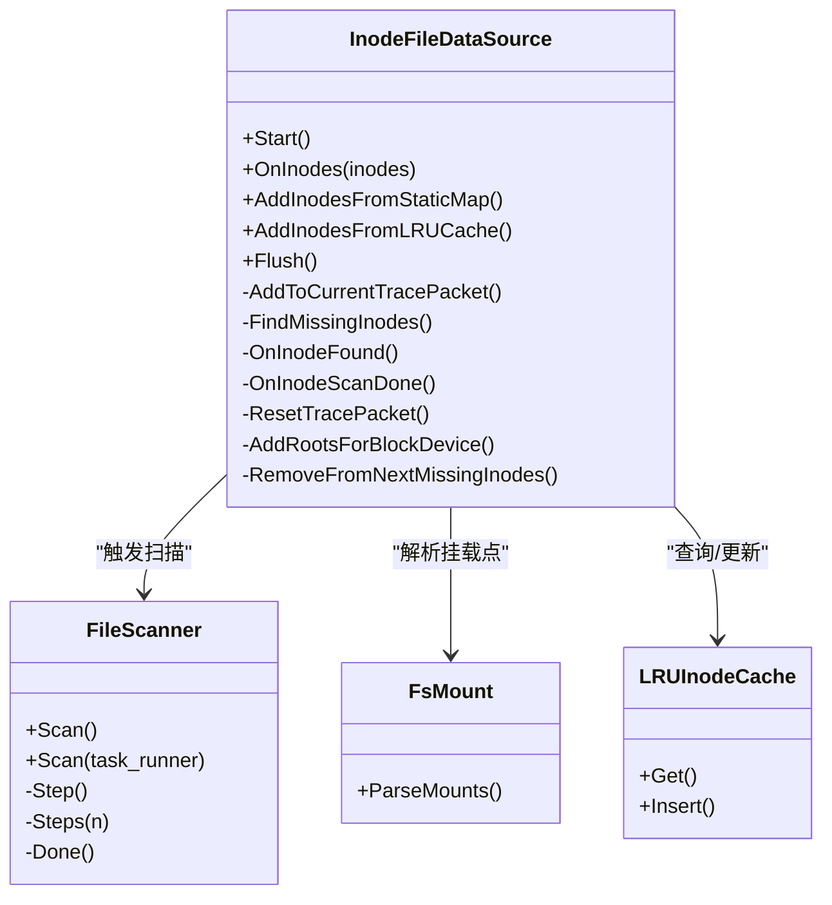
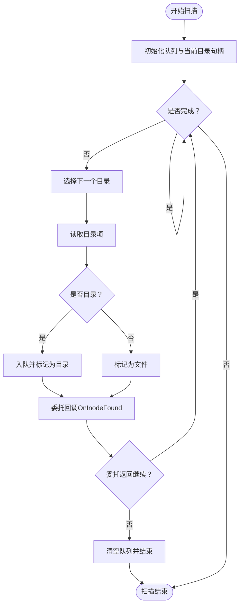
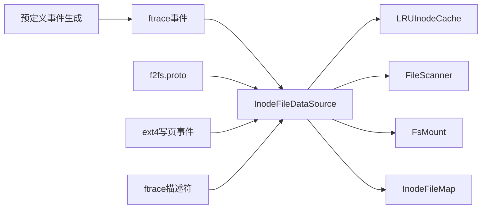

# 文件系统监控探测器

<cite>
**本文引用的文件**
- [inode_file_data_source.h](file://src/traced/probes/filesystem/inode_file_data_source.h)
- [inode_file_data_source.cc](file://src/traced/probes/filesystem/inode_file_data_source.cc)
- [file_scanner.h](file://src/traced/probes/filesystem/file_scanner.h)
- [file_scanner.cc](file://src/traced/probes/filesystem/file_scanner.cc)
- [fs_mount.h](file://src/traced/probes/filesystem/fs_mount.h)
- [fs_mount.cc](file://src/traced/probes/filesystem/fs_mount.cc)
- [inode_file_config.proto](file://protos/perfetto/config/inode_file/inode_file_config.proto)
- [inode_file_map.proto](file://protos/perfetto/trace/filesystem/inode_file_map.proto)
- [ftrace预定义事件生成](file://src/traced/probes/ftrace/predefined_tracepoints.cc)
- [f2fs.proto](file://protos/perfetto/trace/ftrace/f2fs.proto)
- [ext4写页事件](file://protos/perfetto/trace/perfetto_trace.proto)
- [trace_processor ftrace描述符](file://src/trace_processor/importers/ftrace/ftrace_descriptors.cc)
</cite>

## 目录
1. [简介](#简介)
2. [项目结构](#项目结构)
3. [核心组件](#核心组件)
4. [架构总览](#架构总览)
5. [详细组件分析](#详细组件分析)
6. [依赖关系分析](#依赖关系分析)
7. [性能考量](#性能考量)
8. [故障排查指南](#故障排查指南)
9. [结论](#结论)
10. [附录](#附录)

## 简介
本技术文档面向Perfetto的文件系统监控探测器，系统性阐述其工作原理、数据流与处理逻辑，重点覆盖以下方面：
- 文件系统事件监控：如何从内核ftrace事件中提取inode信息并映射到具体文件路径与类型。
- I/O操作跟踪与存储性能分析：结合不同文件系统（ext4、F2FS、XFS等）的ftrace事件，定位I/O瓶颈、争用与热点。
- 探测器工作机制：从事件接收、inode解析、路径扫描到缓存与映射输出的完整链路。
- 配置参数：路径过滤、事件类型选择与采样策略。
- 实战场景：如何利用探测器识别I/O瓶颈、文件系统争用与存储热点，并给出配置示例。

## 项目结构
文件系统监控探测器位于traced/probes/filesystem目录下，核心由以下模块组成：
- inode_file_data_source.*：文件系统inode映射数据源，负责接收ftrace中的inode事件，解析块设备与挂载点，触发路径扫描与缓存更新，并输出InodeFileMap。
- file_scanner.*：文件扫描器，按批次遍历指定根目录，枚举文件与目录，回调委托以产出inode-路径-类型映射。
- fs_mount.*：挂载点解析器，读取/proc/mounts，建立块设备ID到挂载点的映射。
- 配置与协议：
  - inode_file_config.proto：定义探测器配置项（扫描挂载点、挂载点映射、扫描间隔、批大小、禁用扫描等）。
  - inode_file_map.proto：定义输出的InodeFileMap协议格式（块设备ID、挂载点列表、条目集合）。
- ftrace事件集成：
  - ftrace预定义事件生成：声明需要启用的f2fs/ext4/block事件集合。
  - f2fs.proto、ext4写页事件：定义具体f2fs与ext4相关ftrace事件字段。
  - trace_processor ftrace描述符：为SQL查询提供schema支持。

**图表来源**
- [inode_file_data_source.cc:200-267](file://src/traced/probes/filesystem/inode_file_data_source.cc#L200-L267)
- [file_scanner.cc:59-77](file://src/traced/probes/filesystem/file_scanner.cc#L59-L77)
- [fs_mount.cc:30-53](file://src/traced/probes/filesystem/fs_mount.cc#L30-L53)
- [ftrace预定义事件生成:233-249](file://src/traced/probes/ftrace/predefined_tracepoints.cc#L233-L249)

**章节来源**
- [inode_file_data_source.h:53-132](file://src/traced/probes/filesystem/inode_file_data_source.h#L53-L132)
- [inode_file_data_source.cc:109-139](file://src/traced/probes/filesystem/inode_file_data_source.cc#L109-L139)
- [file_scanner.h:30-71](file://src/traced/probes/filesystem/file_scanner.h#L30-L71)
- [file_scanner.cc:42-77](file://src/traced/probes/filesystem/file_scanner.cc#L42-L77)
- [fs_mount.h:30-31](file://src/traced/probes/filesystem/fs_mount.h#L30-L31)
- [fs_mount.cc:30-53](file://src/traced/probes/filesystem/fs_mount.cc#L30-L53)

## 核心组件
- InodeFileDataSource：作为探测器核心，接收来自ftrace的inode集合，按块设备分组，优先从静态映射与LRU缓存解析，剩余未解析的inode通过FileScanner进行扫描，最终输出InodeFileMap。
- FileScanner：实现可中断、可延时的文件扫描，按批次处理目录项，回调委托产出inode-路径-类型映射。
- FsMount：解析/proc/mounts，建立块设备ID到挂载点的多映射，用于后续筛选与输出。
- LRUInodeCache：维护inode到路径集合与类型的缓存，提升重复解析效率。
- 配置与协议：InodeFileConfig控制扫描行为；InodeFileMap定义输出结构。

**章节来源**
- [inode_file_data_source.h:53-132](file://src/traced/probes/filesystem/inode_file_data_source.h#L53-L132)
- [inode_file_data_source.cc:148-192](file://src/traced/probes/filesystem/inode_file_data_source.cc#L148-L192)
- [file_scanner.h:30-71](file://src/traced/probes/filesystem/file_scanner.h#L30-L71)
- [file_scanner.cc:108-151](file://src/traced/probes/filesystem/file_scanner.cc#L108-L151)
- [fs_mount.h:30-31](file://src/traced/probes/filesystem/fs_mount.h#L30-L31)
- [fs_mount.cc:30-53](file://src/traced/probes/filesystem/fs_mount.cc#L30-L53)

## 架构总览
文件系统监控探测器的整体流程如下：
- 事件采集：ftrace启用ext4/f2fs/block事件，内核产生事件后传递给Perfetto。
- 事件解析：InodeFileDataSource接收事件中的inode集合，按块设备分组。
- 路径解析：
  - 优先使用静态映射（/system分区）与LRU缓存匹配。
  - 对未解析的inode，根据挂载点映射确定扫描根目录，启动FileScanner。
- 输出：每个块设备生成一个InodeFileMap包，包含块设备ID、挂载点列表与条目集合。

**图表来源**
- [inode_file_data_source.cc:200-267](file://src/traced/probes/filesystem/inode_file_data_source.cc#L200-L267)
- [file_scanner.cc:108-151](file://src/traced/probes/filesystem/file_scanner.cc#L108-L151)
- [fs_mount.cc:30-53](file://src/traced/probes/filesystem/fs_mount.cc#L30-L53)

## 详细组件分析

### InodeFileDataSource 组件
职责与关键流程：
- 接收inode事件：按块设备分组，统计每设备的唯一inode数量。
- 解析优先级：
  - 静态映射：针对/system分区构建的块设备->inode->路径映射。
  - LRU缓存：命中则直接填充条目并更新路径集合。
- 扫描触发：对未解析的inode，基于挂载点映射确定扫描根目录，延迟启动FileScanner。
- 输出：为每个块设备生成InodeFileMap包，包含块设备ID、挂载点列表与条目集合。

**图表来源**
- [inode_file_data_source.h:53-132](file://src/traced/probes/filesystem/inode_file_data_source.h#L53-L132)
- [inode_file_data_source.cc:200-352](file://src/traced/probes/filesystem/inode_file_data_source.cc#L200-L352)
- [file_scanner.h:30-71](file://src/traced/probes/filesystem/file_scanner.h#L30-L71)
- [fs_mount.h:30-31](file://src/traced/probes/filesystem/fs_mount.h#L30-L31)

**章节来源**
- [inode_file_data_source.cc:148-192](file://src/traced/probes/filesystem/inode_file_data_source.cc#L148-L192)
- [inode_file_data_source.cc:200-267](file://src/traced/probes/filesystem/inode_file_data_source.cc#L200-L267)
- [inode_file_data_source.cc:269-290](file://src/traced/probes/filesystem/inode_file_data_source.cc#L269-L290)
- [inode_file_data_source.cc:342-370](file://src/traced/probes/filesystem/inode_file_data_source.cc#L342-L370)
- [inode_file_data_source.cc:371-402](file://src/traced/probes/filesystem/inode_file_data_source.cc#L371-L402)

### FileScanner 组件
- 扫描策略：采用队列式目录遍历，支持阻塞与异步两种模式。
- 批次控制：通过scan_steps与scan_interval_ms控制扫描节奏，避免长时间占用CPU。
- 类型识别：根据d_type区分文件与目录，目录入队继续扫描。
- 委托回调：每发现一个inode即回调OnInodeFound，允许上层决定是否继续扫描。

**图表来源**
- [file_scanner.cc:59-77](file://src/traced/probes/filesystem/file_scanner.cc#L59-L77)
- [file_scanner.cc:108-151](file://src/traced/probes/filesystem/file_scanner.cc#L108-L151)

**章节来源**
- [file_scanner.h:30-71](file://src/traced/probes/filesystem/file_scanner.h#L30-L71)
- [file_scanner.cc:42-77](file://src/traced/probes/filesystem/file_scanner.cc#L42-L77)
- [file_scanner.cc:108-151](file://src/traced/probes/filesystem/file_scanner.cc#L108-L151)

### FsMount 组件
- 功能：读取/proc/mounts，逐行解析挂载点路径与对应设备号，建立块设备ID到挂载点的多映射。
- 用途：用于筛选目标块设备、为InodeFileMap补充挂载点信息。

**章节来源**
- [fs_mount.h:30-31](file://src/traced/probes/filesystem/fs_mount.h#L30-L31)
- [fs_mount.cc:30-53](file://src/traced/probes/filesystem/fs_mount.cc#L30-L53)

### 协议与配置
- InodeFileConfig：定义扫描挂载点集合、挂载点映射（将挂载点替换为自定义根目录）、扫描间隔、扫描批大小、禁用扫描等。
- InodeFileMap：输出协议，包含块设备ID、挂载点列表与条目集合（每个条目包含inode编号、类型与路径集合）。

**章节来源**
- [inode_file_data_source.cc:123-139](file://src/traced/probes/filesystem/inode_file_data_source.cc#L123-L139)
- [inode_file_map.proto](file://protos/perfetto/trace/filesystem/inode_file_map.proto)

## 依赖关系分析
- 事件来源：ftrace预定义事件生成器声明启用f2fs/ext4/block事件集合，确保内核侧事件可用。
- 事件字段：f2fs.proto与ext4写页事件定义了具体字段，trace_processor的ftrace描述符为SQL查询提供schema。
- 探测器依赖：InodeFileDataSource依赖FsMount解析挂载点、LRUInodeCache缓存、FileScanner扫描、TraceWriter输出。

**图表来源**
- [ftrace预定义事件生成:233-249](file://src/traced/probes/ftrace/predefined_tracepoints.cc#L233-L249)
- [f2fs.proto:56-98](file://protos/perfetto/trace/ftrace/f2fs.proto#L56-L98)
- [ext4写页事件:13381-13405](file://protos/perfetto/trace/perfetto_trace.proto#L13381-L13405)
- [trace_processor ftrace描述符:2927-2976](file://src/trace_processor/importers/ftrace/ftrace_descriptors.cc#L2927-L2976)

**章节来源**
- [ftrace预定义事件生成:233-249](file://src/traced/probes/ftrace/predefined_tracepoints.cc#L233-L249)
- [f2fs.proto:56-98](file://protos/perfetto/trace/ftrace/f2fs.proto#L56-L98)
- [ext4写页事件:13381-13405](file://protos/perfetto/trace/perfetto_trace.proto#L13381-L13405)
- [trace_processor ftrace描述符:2927-2976](file://src/trace_processor/importers/ftrace/ftrace_descriptors.cc#L2927-L2976)

## 性能考量
- 扫描策略：通过scan_interval_ms与scan_batch_size控制扫描节奏，避免长时间占用CPU；默认值可在实现中找到。
- 缓存机制：LRU缓存显著减少重复扫描成本，提高解析效率。
- 挂载点筛选：仅对配置中指定的挂载点进行扫描，缩小范围。
- 异步扫描：FileScanner支持异步扫描，结合TaskRunner延时调度，降低对主线程的影响。
- 输出粒度：按块设备生成独立的InodeFileMap包，便于后续聚合与分析。

**章节来源**
- [inode_file_data_source.cc:38-44](file://src/traced/probes/filesystem/inode_file_data_source.cc#L38-L44)
- [inode_file_data_source.cc:135-138](file://src/traced/probes/filesystem/inode_file_data_source.cc#L135-L138)
- [file_scanner.cc:64-77](file://src/traced/probes/filesystem/file_scanner.cc#L64-L77)

## 故障排查指南
- 无法读取/proc/mounts：FsMount解析失败会记录错误日志，检查权限与文件完整性。
- 扫描无结果：确认已启用相应f2fs/ext4/block事件；检查InodeFileConfig中的扫描挂载点与映射是否正确。
- 性能异常：适当增大scan_interval_ms与scan_batch_size，或启用do_not_scan以仅依赖缓存与静态映射。
- 路径缺失：对于未解析的inode，检查FileScanner的根目录映射与权限；必要时调整扫描策略。

**章节来源**
- [fs_mount.cc:32-35](file://src/traced/probes/filesystem/fs_mount.cc#L32-L35)
- [inode_file_data_source.cc:226-228](file://src/traced/probes/filesystem/inode_file_data_source.cc#L226-L228)
- [inode_file_data_source.cc:354-368](file://src/traced/probes/filesystem/inode_file_data_source.cc#L354-L368)

## 结论
文件系统监控探测器通过ftrace事件与文件系统扫描相结合，实现了对inode到文件路径的高效映射，并输出标准化的InodeFileMap供后续分析。借助配置参数与缓存机制，可在保证系统性能的前提下进行精准的存储性能分析与瓶颈定位。

## 附录

### 配置参数说明
- 扫描挂载点集合：仅对指定挂载点内的inode进行处理。
- 挂载点映射：将挂载点替换为自定义根目录，便于限定扫描范围或加速扫描。
- 扫描间隔（毫秒）：异步扫描的延时间隔。
- 扫描批大小：每次扫描处理的目录项数量。
- 禁用扫描：仅使用缓存与静态映射，不进行实时扫描。

**章节来源**
- [inode_file_data_source.cc:123-139](file://src/traced/probes/filesystem/inode_file_data_source.cc#L123-L139)
- [inode_file_config.proto](file://protos/perfetto/config/inode_file/inode_file_config.proto)

### 事件类型与文件系统集成
- f2fs事件：如f2fs_sync_file_enter/exit、f2fs_write_begin/end、f2fs_iostat/iostat_latency等，用于跟踪F2FS的同步与IO统计。
- ext4事件：如ext4_da_write_begin/end、ext4_sync_file_enter/exit等，用于跟踪ext4的延迟分配与同步。
- block事件：如block_bio_queue、block_bio_complete，用于跟踪块设备的排队与完成事件。

**章节来源**
- [ftrace预定义事件生成:233-249](file://src/traced/probes/ftrace/predefined_tracepoints.cc#L233-L249)
- [f2fs.proto:56-98](file://protos/perfetto/trace/ftrace/f2fs.proto#L56-L98)
- [ext4写页事件:13381-13405](file://protos/perfetto/trace/perfetto_trace.proto#L13381-L13405)

### 实际存储性能分析场景与配置示例
- 识别I/O瓶颈：
  - 启用block事件与ext4/f2fs相关事件，观察block_bio_queue与f2fs_iostat_latency的峰值时间点，结合InodeFileMap定位热点文件。
  - 使用trace_processor SQL模块进行聚合分析，定位高延迟写入或频繁同步操作。
- 识别文件系统争用：
  - 关注同一挂载点下多个进程对相同inode的并发访问，结合InodeFileMap的路径集合与类型判断热点文件类型（目录/文件）。
- 识别存储热点：
  - 通过InodeFileMap的条目集合统计热点inode，结合ext4/ext4写页事件定位热点区域。

**章节来源**
- [trace_processor ftrace描述符:2927-2976](file://src/trace_processor/importers/ftrace/ftrace_descriptors.cc#L2927-L2976)