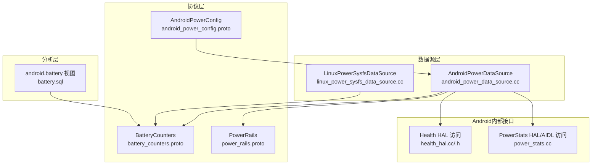
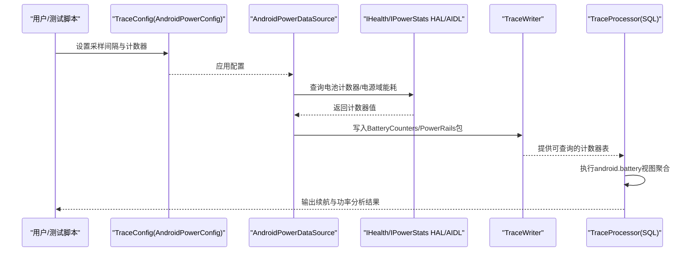
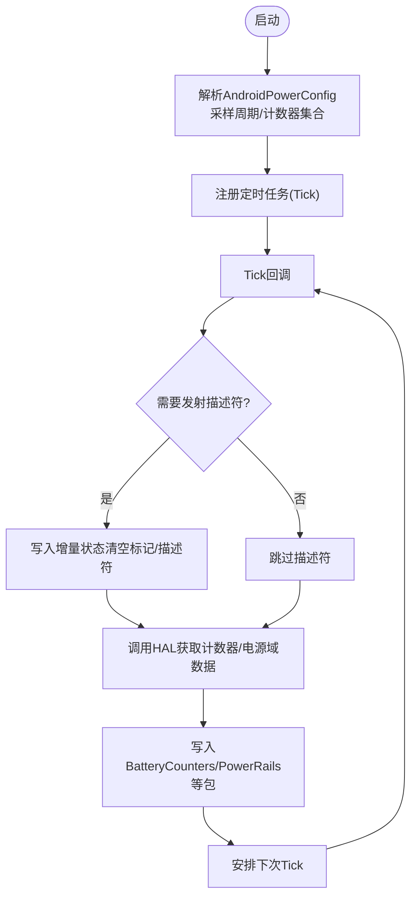
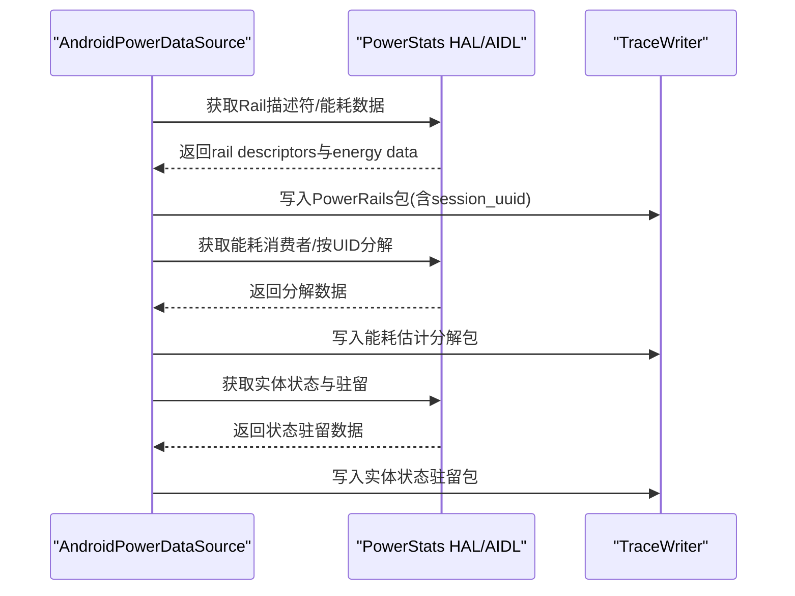
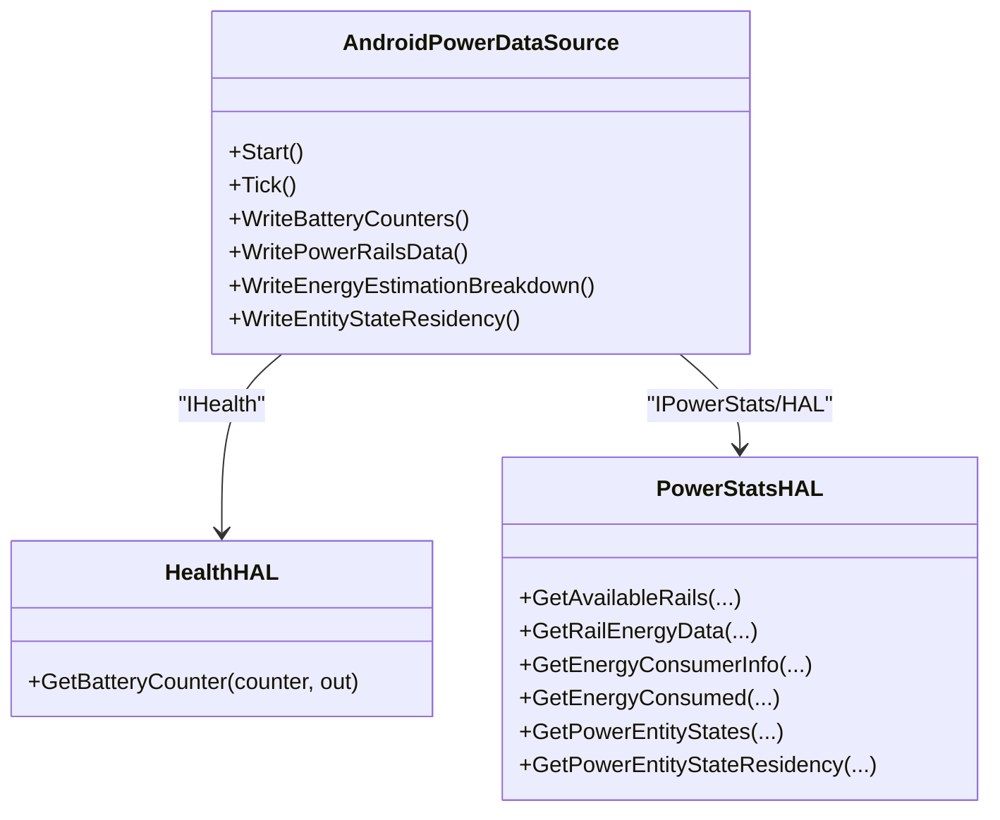
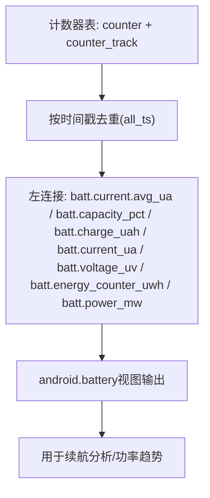
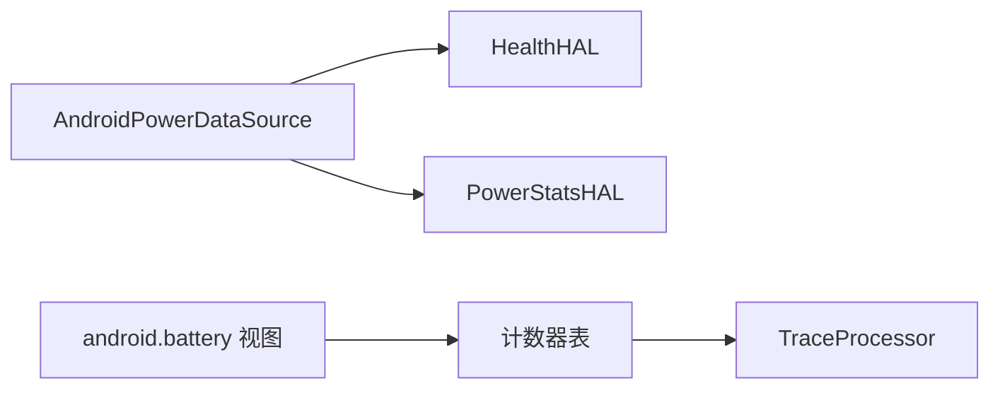

# 电池和电源监控探测器

<cite>
**本文引用的文件**
- [battery-counters.md](file://docs/data-sources/battery-counters.md)
- [battery_counters.proto](file://protos/perfetto/trace/power/battery_counters.proto)
- [power_rails.proto](file://protos/perfetto/trace/power/power_rails.proto)
- [android_power_config.proto](file://protos/perfetto/config/power/android_power_config.proto)
- [android_power_data_source.cc](file://src/traced/probes/power/android_power_data_source.cc)
- [power_stats.cc](file://src/android_internal/power_stats.cc)
- [health_hal.cc](file://src/android_internal/health_hal.cc)
- [health_hal.h](file://src/android_internal/health_hal.h)
- [battery.sql](file://src/trace_processor/perfetto_sql/stdlib/android/battery.sql)
- [linux_power_sysfs_data_source.cc](file://src/traced/probes/power/linux_power_sysfs_data_source.cc)
- [linux_power_sysfs_data_source_unittest.cc](file://src/traced/probes/power/linux_power_sysfs_data_source_unittest.cc)
- [tests_battery_stats.py](file://test/trace_processor/diff_tests/parser/power/tests_battery_stats.py)
- [tests_linux_sysfs_power.py](file://test/trace_processor/diff_tests/parser/power/tests_linux_sysfs_power.py)
- [battery_tests.py](file://test/trace_processor/diff_tests/stdlib/android/battery_tests.py)
</cite>

## 目录
1. [简介](#简介)
2. [项目结构](#项目结构)
3. [核心组件](#核心组件)
4. [架构总览](#架构总览)
5. [详细组件分析](#详细组件分析)
6. [依赖关系分析](#依赖关系分析)
7. [性能考量](#性能考量)
8. [故障排查指南](#故障排查指南)
9. [结论](#结论)
10. [附录](#附录)

## 简介
本技术文档聚焦于Perfetto在Android平台上的电池与电源监控探测器，系统性阐述以下内容：
- 电池统计监控：如何采集电池电量、充电状态、瞬时/平均电流、电压与能量计数等关键指标，并生成可用于能耗分析的时序数据。
- 电源管理跟踪：如何通过ODPM（On-Device Power Rails Monitor）对不同硬件子系统的功耗进行分域测量，以及如何获取能耗估计分解与实体状态驻留信息。
- 能耗分析：如何基于采集到的电流、电压与能量计数计算功率；如何利用SQL视图聚合多源计数器并生成续航分析报告。
- 与Android电源管理框架的集成：解析与IHealth HAL及IPowerStats HAL/AIDL的交互流程，说明PowerManager与BatteryManager在Perfetto中的作用边界与数据来源。
- 配置参数：采样间隔、计数器选择、阈值与事件触发条件的配置方法与最佳实践。
- 实战案例：给出典型续航分析场景与配置示例，指导如何定位高耗电组件并优化能耗。
- 兼容性与准确性：跨设备差异、驱动能力限制与校准建议。

## 项目结构
围绕电池与电源监控，Perfetto在如下层次协同工作：
- 数据源层：负责从Android HAL或Linux sysfs采集原始计数器与能耗数据。
- 协议层：定义Trace Packet中电池与电源域的数据结构。
- 配置层：通过TraceConfig控制采样行为与功能开关。
- 分析层：通过SQL标准库与Metrics对计数器进行聚合与可视化。

图表来源
- [android_power_data_source.cc:174-237](file://src/traced/probes/power/android_power_data_source.cc#L174-L237)
- [health_hal.cc:158-170](file://src/android_internal/health_hal.cc#L158-L170)
- [power_stats.cc:110-123](file://src/android_internal/power_stats.cc#L110-L123)
- [battery_counters.proto:20-46](file://protos/perfetto/trace/power/battery_counters.proto#L20-L46)
- [power_rails.proto:20-56](file://protos/perfetto/trace/power/power_rails.proto#L20-L56)
- [android_power_config.proto:21-53](file://protos/perfetto/config/power/android_power_config.proto#L21-L53)
- [battery.sql:16-134](file://src/trace_processor/perfetto_sql/stdlib/android/battery.sql#L16-L134)
- [linux_power_sysfs_data_source.cc:76-109](file://src/traced/probes/power/linux_power_sysfs_data_source.cc#L76-L109)

章节来源
- [battery-counters.md:1-169](file://docs/data-sources/battery-counters.md#L1-L169)
- [android_power_data_source.cc:174-237](file://src/traced/probes/power/android_power_data_source.cc#L174-L237)
- [health_hal.cc:158-170](file://src/android_internal/health_hal.cc#L158-L170)
- [power_stats.cc:110-123](file://src/android_internal/power_stats.cc#L110-L123)
- [battery_counters.proto:20-46](file://protos/perfetto/trace/power/battery_counters.proto#L20-L46)
- [power_rails.proto:20-56](file://protos/perfetto/trace/power/power_rails.proto#L20-L56)
- [android_power_config.proto:21-53](file://protos/perfetto/config/power/android_power_config.proto#L21-L53)
- [battery.sql:16-134](file://src/trace_processor/perfetto_sql/stdlib/android/battery.sql#L16-L134)
- [linux_power_sysfs_data_source.cc:76-109](file://src/traced/probes/power/linux_power_sysfs_data_source.cc#L76-L109)

## 核心组件
- 电池计数器探测器（AndroidPowerDataSource）
  - 周期性轮询IHealth HAL获取电池电荷、容量百分比、瞬时/平均电流、电压与能量计数。
  - 可选开启ODPM（PowerRails）以采集各电源域能耗。
  - 支持能耗估计分解（按能耗消费者）与实体状态驻留（Android U+）。
- Linux Sysfs 电池探测器（LinuxPowerSysfsDataSource）
  - 从/sys/class/power_supply读取容量、电压、能量/电荷等计数器，适用于非Android平台或特定Linux设备。
- 协议与配置
  - BatteryCounters与PowerRails消息定义了Trace Packet中的数据结构。
  - AndroidPowerConfig控制采样周期、启用的电池计数器、是否采集电源域能耗等。
- SQL分析视图
  - android.battery视图将多路计数器按时间戳对齐，便于续航分析与功率计算。

章节来源
- [android_power_data_source.cc:241-271](file://src/traced/probes/power/android_power_data_source.cc#L241-L271)
- [battery_counters.proto:20-46](file://protos/perfetto/trace/power/battery_counters.proto#L20-L46)
- [power_rails.proto:20-56](file://protos/perfetto/trace/power/power_rails.proto#L20-L56)
- [android_power_config.proto:21-53](file://protos/perfetto/config/power/android_power_config.proto#L21-L53)
- [battery.sql:16-134](file://src/trace_processor/perfetto_sql/stdlib/android/battery.sql#L16-L134)
- [linux_power_sysfs_data_source.cc:76-109](file://src/traced/probes/power/linux_power_sysfs_data_source.cc#L76-L109)

## 架构总览
下图展示从配置到采集、写入Trace Packet，再到Trace Processor分析的完整链路。

图表来源
- [android_power_data_source.cc:241-271](file://src/traced/probes/power/android_power_data_source.cc#L241-L271)
- [health_hal.cc:158-170](file://src/android_internal/health_hal.cc#L158-L170)
- [power_stats.cc:110-123](file://src/android_internal/power_stats.cc#L110-L123)
- [battery.sql:16-134](file://src/trace_processor/perfetto_sql/stdlib/android/battery.sql#L16-L134)

## 详细组件分析

### 电池计数器探测器（AndroidPowerDataSource）
- 职责
  - 解析AndroidPowerConfig，确定采样周期与启用的电池计数器集合。
  - 定时任务中调用IHealth HAL获取计数器值，并写入BatteryCounters包。
  - 可选地写入PowerRails、能耗估计分解与实体状态驻留数据。
- 关键流程
  - 启动时加载动态库，初始化采样周期与计数器位图。
  - Tick回调中根据周期调度下次任务，写入计数器与可选的电源域数据。
  - 对于首次采集或清空增量状态后，先发出描述符包再写入数据。

图表来源
- [android_power_data_source.cc:196-237](file://src/traced/probes/power/android_power_data_source.cc#L196-L237)
- [android_power_data_source.cc:246-271](file://src/traced/probes/power/android_power_data_source.cc#L246-L271)
- [android_power_data_source.cc:273-315](file://src/traced/probes/power/android_power_data_source.cc#L273-L315)
- [android_power_data_source.cc:317-352](file://src/traced/probes/power/android_power_data_source.cc#L317-L352)

章节来源
- [android_power_data_source.cc:174-237](file://src/traced/probes/power/android_power_data_source.cc#L174-L237)
- [android_power_data_source.cc:241-271](file://src/traced/probes/power/android_power_data_source.cc#L241-L271)
- [android_power_data_source.cc:273-315](file://src/traced/probes/power/android_power_data_source.cc#L273-L315)
- [android_power_data_source.cc:317-352](file://src/traced/probes/power/android_power_data_source.cc#L317-L352)

### 电源域能耗（ODPM）与能耗估计分解
- ODPM（PowerRails）
  - 通过IPowerStats HAL/AIDL查询可用电源域与能耗数据，写入PowerRails包。
  - 使用session_uuid关联描述符与能耗样本，支持多数据源并行。
- 能耗估计分解（Android S+）
  - 获取能耗消费者信息与按UID的能耗分解，用于定位应用级耗电。
- 实体状态驻留（Android U+）
  - 获取电源实体及其状态的驻留时间、进入次数等统计。

图表来源
- [android_power_data_source.cc:354-403](file://src/traced/probes/power/android_power_data_source.cc#L354-L403)
- [android_power_data_source.cc:405-440](file://src/traced/probes/power/android_power_data_source.cc#L405-L440)
- [power_stats.cc:127-152](file://src/android_internal/power_stats.cc#L127-L152)
- [power_stats.cc:337-416](file://src/android_internal/power_stats.cc#L337-L416)
- [power_stats.cc:418-504](file://src/android_internal/power_stats.cc#L418-L504)

章节来源
- [android_power_data_source.cc:354-403](file://src/traced/probes/power/android_power_data_source.cc#L354-L403)
- [android_power_data_source.cc:405-440](file://src/traced/probes/power/android_power_data_source.cc#L405-L440)
- [power_stats.cc:127-152](file://src/android_internal/power_stats.cc#L127-L152)
- [power_stats.cc:337-416](file://src/android_internal/power_stats.cc#L337-L416)
- [power_stats.cc:418-504](file://src/android_internal/power_stats.cc#L418-L504)

### 与Android电源管理框架的集成
- IHealth HAL（BatteryManager侧）
  - 通过IHealth HAL获取电池电荷、容量、电流、电压等计数器，作为Perfetto电池统计的核心数据源。
- IPowerStats HAL/AIDL（PowerManager侧）
  - 通过IPowerStats HAL或AIDL接口访问ODPM、能耗估计分解与实体状态驻留，实现对硬件子系统的能耗观测。
- 集成要点
  - AndroidPowerDataSource在启动时加载动态库，按需调用IHealth与IPowerStats接口。
  - 当服务不可用或死亡时，探测器会重置服务句柄并回退处理，保证稳定性。

图表来源
- [android_power_data_source.cc:174-237](file://src/traced/probes/power/android_power_data_source.cc#L174-L237)
- [health_hal.cc:158-170](file://src/android_internal/health_hal.cc#L158-L170)
- [power_stats.cc:110-123](file://src/android_internal/power_stats.cc#L110-L123)

章节来源
- [health_hal.cc:158-170](file://src/android_internal/health_hal.cc#L158-L170)
- [power_stats.cc:110-123](file://src/android_internal/power_stats.cc#L110-L123)
- [android_power_data_source.cc:174-237](file://src/traced/probes/power/android_power_data_source.cc#L174-L237)

### 能耗分析与SQL视图
- android.battery视图
  - 将batt.*计数器按时间戳对齐，输出容量、电荷、电流、电压、能量计数与功率等字段，便于续航分析。
- 功率计算
  - 在测试中验证了由电流与电压计算功率的逻辑，确保计数器一致性与正确性。

图表来源
- [battery.sql:16-134](file://src/trace_processor/perfetto_sql/stdlib/android/battery.sql#L16-L134)

章节来源
- [battery.sql:16-134](file://src/trace_processor/perfetto_sql/stdlib/android/battery.sql#L16-L134)
- [tests_battery_stats.py:136-164](file://test/trace_processor/diff_tests/parser/power/tests_battery_stats.py#L136-L164)
- [battery_tests.py:34-46](file://test/trace_processor/diff_tests/stdlib/android/battery_tests.py#L34-L46)

### Linux平台的电池计数器采集
- LinuxPowerSysfsDataSource
  - 从/sys/class/power_supply目录读取容量、电压、能量/电荷等计数器，适配非Android环境。
- 测试验证
  - 单元测试覆盖多电池场景与缺失字段的处理，确保在不同设备上具备鲁棒性。

章节来源
- [linux_power_sysfs_data_source.cc:76-109](file://src/traced/probes/power/linux_power_sysfs_data_source.cc#L76-L109)
- [linux_power_sysfs_data_source_unittest.cc:91-121](file://src/traced/probes/power/linux_power_sysfs_data_source_unittest.cc#L91-L121)

## 依赖关系分析
- 组件耦合
  - AndroidPowerDataSource依赖android_internal模块提供的HAL代理函数，实现与IHealth与IPowerStats的解耦。
  - TraceProcessor通过SQL标准库对计数器进行聚合，形成稳定的分析接口。
- 外部依赖
  - Android HAL/AIDL接口版本差异导致能力差异（如能耗估计分解与实体状态驻留仅在较新平台可用）。
- 潜在循环依赖
  - 探测器与HAL之间通过动态库加载避免直接编译期依赖，降低循环依赖风险。

图表来源
- [android_power_data_source.cc:174-237](file://src/traced/probes/power/android_power_data_source.cc#L174-L237)
- [health_hal.cc:158-170](file://src/android_internal/health_hal.cc#L158-L170)
- [power_stats.cc:110-123](file://src/android_internal/power_stats.cc#L110-L123)
- [battery.sql:16-134](file://src/trace_processor/perfetto_sql/stdlib/android/battery.sql#L16-L134)

章节来源
- [android_power_data_source.cc:174-237](file://src/traced/probes/power/android_power_data_source.cc#L174-L237)
- [health_hal.cc:158-170](file://src/android_internal/health_hal.cc#L158-L170)
- [power_stats.cc:110-123](file://src/android_internal/power_stats.cc#L110-L123)
- [battery.sql:16-134](file://src/trace_processor/perfetto_sql/stdlib/android/battery.sql#L16-L134)

## 性能考量
- 采样开销
  - 采样周期过短会增加HAL调用频率与Trace写入压力，建议结合目标分辨率调整battery_poll_ms。
- 数据量控制
  - 仅启用必要的电池计数器与电源域，避免冗余字段带来的带宽与存储压力。
- 并发与稳定性
  - HAL服务可能因进程重启而“死亡”，探测器内置重置逻辑，应关注服务可用性与异常恢复。
- SQL聚合成本
  - 大时间窗口的视图聚合可能带来内存与执行时间开销，建议按需切片与索引优化。

## 故障排查指南
- 无计数器数据
  - 检查AndroidPowerConfig中是否选择了对应计数器；确认设备是否支持相应HAL能力。
- 采样周期无效
  - 若配置小于最小阈值，探测器会自动上限裁剪；请检查日志中的告警信息。
- ODPM不可用
  - 若设备未提供IPowerStats HAL或返回空描述符，探测器会禁用该功能；确认设备固件与驱动版本。
- 电压/电流异常
  - 核对IHealth HAL返回值单位与换算（如电压从mV到µV），并在SQL中核对功率计算一致性。
- Linux平台不支持
  - 确认/sys/class/power_supply路径存在且具备读权限；参考单元测试用例构造模拟sysfs树。

章节来源
- [android_power_data_source.cc:204-212](file://src/traced/probes/power/android_power_data_source.cc#L204-L212)
- [power_stats.cc:127-152](file://src/android_internal/power_stats.cc#L127-L152)
- [tests_linux_sysfs_power.py:123-164](file://test/trace_processor/diff_tests/parser/power/tests_linux_sysfs_power.py#L123-L164)

## 结论
Perfetto的电池与电源监控探测器通过标准化的配置与协议，实现了对电池计数器与电源域能耗的统一采集与分析。借助IHealth与IPowerStats HAL，探测器能够在Android平台上覆盖从整体电池到具体硬件子系统的能耗观测。配合SQL视图与测试用例，开发者可以快速构建续航分析与高耗电定位方案，并在不同设备与平台间保持一致的可观测性体验。

## 附录

### 配置参数说明
- AndroidPowerConfig
  - battery_poll_ms：采样周期（毫秒），最小值有约束；为0时使用默认值。
  - battery_counters：启用的电池计数器集合（容量%、电荷、瞬时/平均电流、电压等）。
  - collect_power_rails：是否采集电源域能耗（ODPM）。
  - collect_energy_estimation_breakdown：是否采集能耗估计分解（Android S+）。
  - collect_entity_state_residency：是否采集实体状态驻留（Android U+）。

章节来源
- [android_power_config.proto:21-53](file://protos/perfetto/config/power/android_power_config.proto#L21-L53)
- [android_power_data_source.cc:196-212](file://src/traced/probes/power/android_power_data_source.cc#L196-L212)

### 数据结构与字段
- BatteryCounters
  - charge_counter_uah、capacity_percent、current_ua、current_avg_ua、energy_counter_uwh、voltage_uv。
- PowerRails
  - rail_descriptor、energy_data、session_uuid。

章节来源
- [battery_counters.proto:20-46](file://protos/perfetto/trace/power/battery_counters.proto#L20-L46)
- [power_rails.proto:20-56](file://protos/perfetto/trace/power/power_rails.proto#L20-L56)

### 实战场景与配置示例
- 场景一：基础续航分析
  - 启用容量%、电荷、瞬时电流、电压与能量计数，设置合理采样周期，使用android.battery视图生成续航曲线。
- 场景二：高耗电定位
  - 在Android S+设备上启用能耗估计分解，按UID聚合能耗，识别高耗电应用或服务。
- 场景三：硬件子系统分析
  - 启用collect_power_rails，结合PowerRails描述符与能耗样本，分析GPU/CPU/射频等子系统的功耗贡献。
- 场景四：Linux平台采集
  - 使用linux.sysfs_power数据源读取/sys/class/power_supply下的计数器，验证与Android端的一致性。

章节来源
- [battery-counters.md:80-113](file://docs/data-sources/battery-counters.md#L80-L113)
- [battery.sql:16-134](file://src/trace_processor/perfetto_sql/stdlib/android/battery.sql#L16-L134)
- [tests_battery_stats.py:136-164](file://test/trace_processor/diff_tests/parser/power/tests_battery_stats.py#L136-L164)
- [linux_power_sysfs_data_source.cc:76-109](file://src/traced/probes/power/linux_power_sysfs_data_source.cc#L76-L109)

### 跨设备兼容性与准确性验证
- 设备差异
  - 不同厂商的HAL实现与驱动能力存在差异，部分计数器可能不可用或精度不同。
- 校准建议
  - 在实验室环境下断开USB充电或采用专用设备以消除外部供电影响，确保电流方向与电荷变化符合预期。
- 测试验证
  - 通过Diff Tests与单元测试覆盖典型场景与边界条件，确保SQL聚合与功率计算的正确性。

章节来源
- [battery-counters.md:37-60](file://docs/data-sources/battery-counters.md#L37-L60)
- [tests_linux_sysfs_power.py:123-164](file://test/trace_processor/diff_tests/parser/power/tests_linux_sysfs_power.py#L123-L164)
- [linux_power_sysfs_data_source_unittest.cc:91-121](file://src/traced/probes/power/linux_power_sysfs_data_source_unittest.cc#L91-L121)