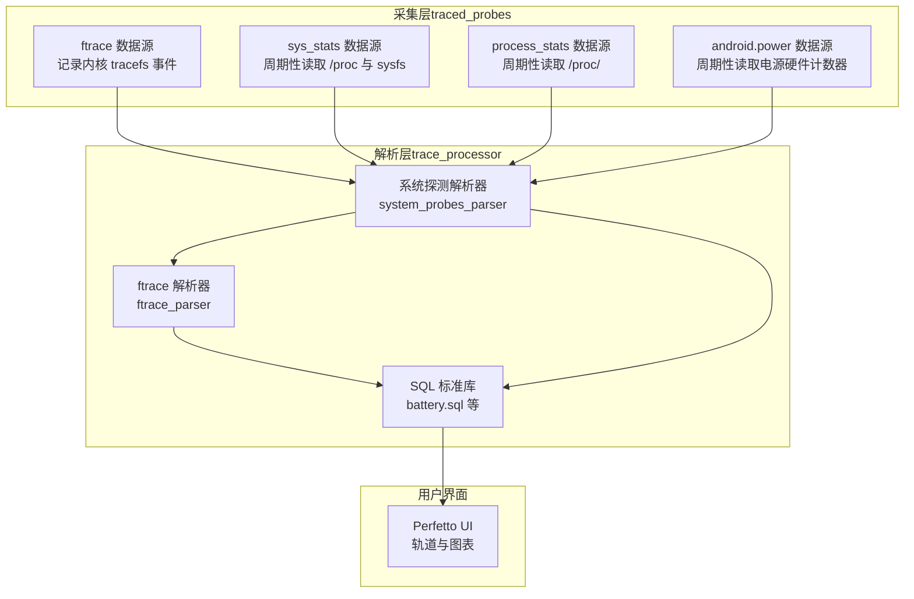
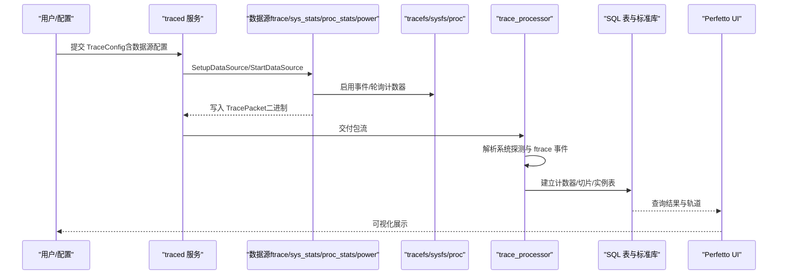
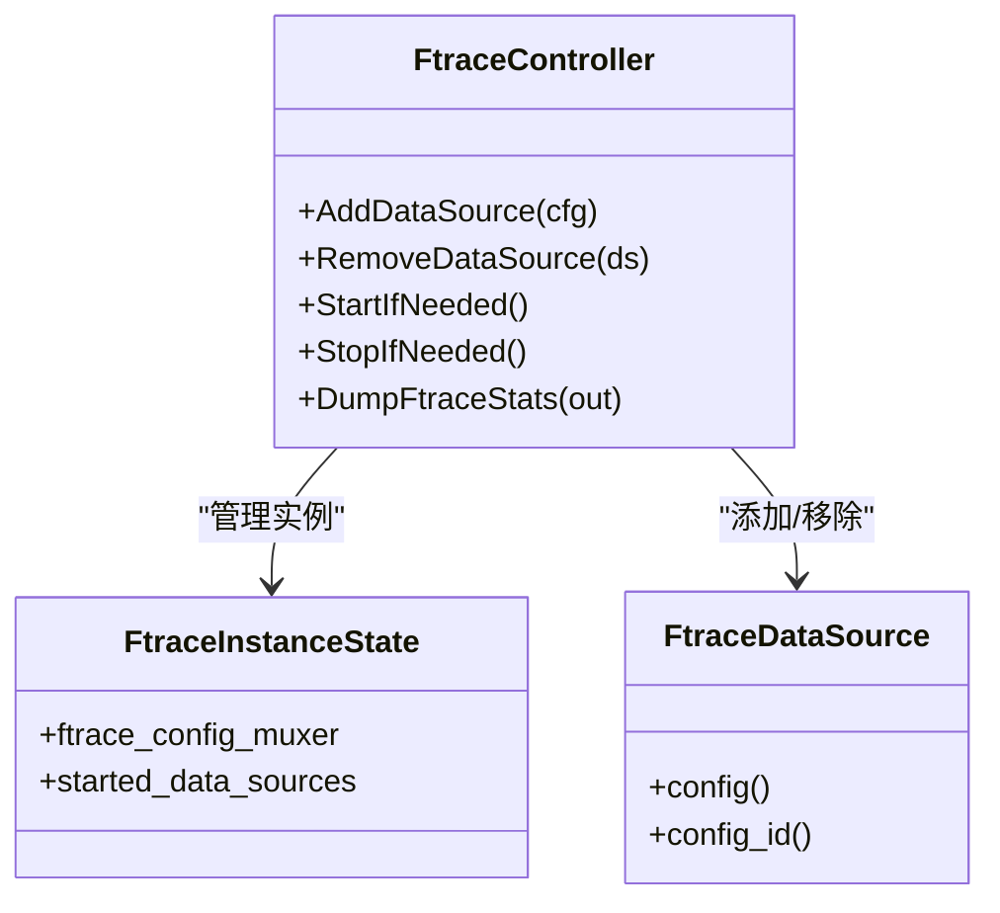
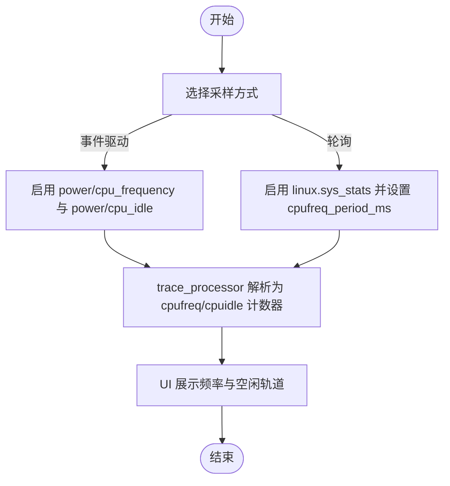
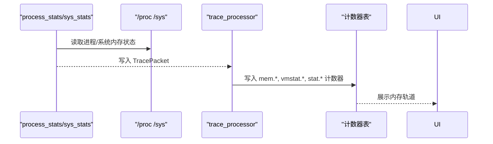
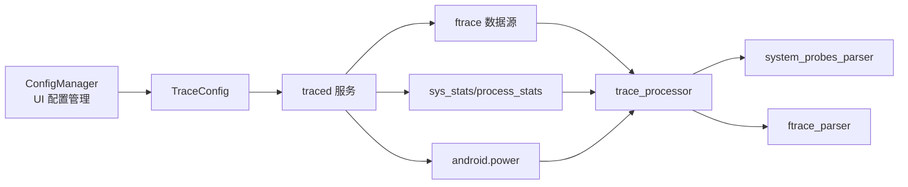

# 系统级探测器

<cite>
**本文引用的文件**
- [cpu-freq.md](file://docs/data-sources/cpu-freq.md)
- [memory-counters.md](file://docs/data-sources/memory-counters.md)
- [syscalls.md](file://docs/data-sources/syscalls.md)
- [gpu.md](file://docs/data-sources/gpu.md)
- [battery-counters.md](file://docs/data-sources/battery-counters.md)
- [ftrace.md](file://docs/getting-started/ftrace.md)
- [traced_probes.md](file://docs/reference/traced_probes.md)
- [config.md](file://docs/concepts/config.md)
- [ftrace_controller.cc](file://src/traced/probes/ftrace/ftrace_controller.cc)
- [ftrace_controller_unittest.cc](file://src/traced/probes/ftrace/ftrace_controller_unittest.cc)
- [ftrace_data_source.h](file://src/traced/probes/ftrace/ftrace_data_source.h)
- [ftrace_metadata.h](file://src/traced/probes/ftrace/ftrace_metadata.h)
- [system_probes_parser.cc](file://src/trace_processor/importers/proto/system_probes_parser.cc)
- [system_probes_parser.h](file://src/trace_processor/importers/proto/system_probes_parser.h)
- [system_probes_module.cc](file://src/trace_processor/importers/proto/system_probes_module.cc)
- [system_probes_module.h](file://src/trace_processor/importers/proto/system_probes_module.h)
- [ftrace_parser.cc](file://src/trace_processor/importers/ftrace/ftrace_parser.cc)
- [tracks_common.h](file://src/trace_processor/importers/common/tracks_common.h)
- [battery.sql](file://src/trace_processor/permutohedron/android/battery.sql)
- [tests_linux_sysfs_power.py](file://test/trace_processor/diff_tests/parser/power/tests_linux_sysfs_power.py)
- [config_manager.ts](file://ui/src/plugins/dev.perfetto.RecordTraceV2/config/config_manager.ts)
</cite>

## 目录
1. [简介](#简介)
2. [项目结构](#项目结构)
3. [核心组件](#核心组件)
4. [架构总览](#架构总览)
5. [详细组件分析](#详细组件分析)
6. [依赖关系分析](#依赖关系分析)
7. [性能考量](#性能考量)
8. [故障排查指南](#故障排查指南)
9. [结论](#结论)
10. [附录](#附录)

## 简介
本文件面向系统与内核开发者，系统性阐述 Perfetto 的系统级探测器（内核 ftrace 探测器、CPU 频率与空闲、内存计数器、系统调用、GPU 性能计数器、电池统计）的工作原理、事件过滤与性能影响，并给出配置参数、数据格式与采样策略。文档同时提供组合使用建议、依赖关系与冲突处理、性能优化与最佳实践，帮助在不同分析目标下选择合适的探测器组合。

## 项目结构
Perfetto 将系统级数据采集分为两类：
- traced_probes：内核与系统接口层的数据源，负责从 tracefs、sysfs、/proc 等内核接口读取事件或计数器，写入 trace 包。
- trace_processor：解析 trace 包，将原始事件映射为可查询的 SQL 表与可视化轨道（tracks），并提供 SQL 标准库函数与视图。

**图示来源**
- [system_probes_module.cc:34-71](file://src/trace_processor/importers/proto/system_probes_module.cc#L34-L71)
- [system_probes_parser.cc:1-38](file://src/trace_processor/importers/proto/system_probes_parser.cc#L1-L38)
- [ftrace_parser.cc:1874-1899](file://src/trace_processor/importers/ftrace/ftrace_parser.cc#L1874-L1899)

**章节来源**
- [traced_probes.md:38-110](file://docs/reference/traced_probes.md#L38-L110)
- [config.md:276-320](file://docs/concepts/config.md#L276-L320)

## 核心组件
- 内核 ftrace 探测器：通过 traced_probes 的 linux.ftrace 数据源启用特定 tracefs 事件，支持 atrace 分类、内核跟踪事件、kprobe/uprobe、以及函数图等高级模式。
- CPU 频率与空闲：通过 power/cpu_frequency 事件与 sysfs 轮询结合，提供频率变化与空闲状态计数器；支持 per-cluster 频率与多 CPU 空闲深度。
- 内存计数器与事件：/proc 与 ftrace 双通道，包括 RSS、页错误、低内存杀进程（LMK）、线程/进程内存指标等。
- 系统调用：记录 raw_syscalls/sys_enter 与 sys_exit，便于定位阻塞点与热点系统调用。
- GPU 性能计数器与渲染阶段：支持 GPU 计数器采样、渲染阶段时间线、Vulkan 内存分配与绑定追踪。
- 电池统计：Android 平台通过 IHealth HAL 获取电池容量、剩余电荷、瞬时电流；Linux/ChromeOS 通过 sysfs 读取电源轨计数器。

**章节来源**
- [cpu-freq.md:1-171](file://docs/data-sources/cpu-freq.md#L1-L171)
- [memory-counters.md:1-428](file://docs/data-sources/memory-counters.md#L1-L428)
- [syscalls.md:1-55](file://docs/data-sources/syscalls.md#L1-L55)
- [gpu.md:1-200](file://docs/data-sources/gpu.md#L1-L200)
- [battery-counters.md:1-169](file://docs/data-sources/battery-counters.md#L1-L169)

## 架构总览
下图展示从配置到采集、解析与可视化的端到端流程。

**图示来源**
- [config.md:276-320](file://docs/concepts/config.md#L276-L320)
- [traced_probes.md:38-110](file://docs/reference/traced_probes.md#L38-L110)

## 详细组件分析

### 内核 ftrace 探测器
- 工作原理
  - traced_probes 的 FtraceController 管理 tracefs 实例与事件开关，按需激活/停用配置，避免重复开启。
  - 支持 atrace 分类、内核跟踪事件、kprobe/uprobe、函数图（function_graph）等模式。
  - 事件解析由 trace_processor 的 FtraceParser 完成，将二进制事件映射为切片、计数器与实例轨道。
- 事件过滤与性能影响
  - 事件粒度越细，开销越大；建议仅启用必要事件与分类。
  - kprobe/uprobe 统计可通过控制器导出命中/未命中计数，辅助评估开销。
  - 符号解析（ksyms）可能为 CPU 密集型操作，控制器会延迟返回启动确认以隔离对频率缩放的影响。
- 配置参数与数据格式
  - TraceConfig 中的 FtraceConfig 字段控制事件列表、分类、poll 模式、符号解析策略等。
  - 事件字段由 tracefs format 文件描述，tracebox/trace_processor 使用生成的 protobuf 类型进行序列化与解析。
- 采样策略
  - 对于高吞吐事件（如 mm_event），trace_processor 采用直方图/聚合方式降低开销。
- 依赖与冲突
  - 多个数据源共享同一 tracefs 实例时，控制器会合并配置并避免重复启停。
  - 不同实例路径有严格校验，防止越权访问。

**图示来源**
- [ftrace_controller.cc:603-642](file://src/traced/probes/ftrace/ftrace_controller.cc#L603-L642)
- [ftrace_controller_unittest.cc:849-886](file://src/traced/probes/ftrace/ftrace_controller_unittest.cc#L849-L886)
- [ftrace_data_source.h:1-41](file://src/traced/probes/ftrace/ftrace_data_source.h#L1-L41)

**章节来源**
- [ftrace.md:1-758](file://docs/getting-started/ftrace.md#L1-L758)
- [ftrace_controller.cc:603-674](file://src/traced/probes/ftrace/ftrace_controller.cc#L603-L674)
- [ftrace_controller_unittest.cc:849-886](file://src/traced/probes/ftrace/ftrace_controller_unittest.cc#L849-L886)

### CPU 频率与空闲状态
- 工作原理
  - power/cpu_frequency：内核 cpufreq 驱动变更频率时产生事件（部分平台不支持）。
  - power/cpu_idle：CPU 进入/退出空闲状态，值 0xffffffff 表示回到非空闲。
  - sysfs 轮询：通过 linux.sys_stats 的 cpufreq_period_ms 周期读取当前频率，保证初始值与稳定采样。
  - trace_processor 将频率与空闲状态映射为计数器轨道，名称分别为 cpufreq 与 cpuidle。
- 配置参数与数据格式
  - ftrace_events: power/cpu_frequency, power/cpu_idle, power/suspend_resume
  - sys_stats_config: cpufreq_period_ms > 0
  - 可选：linux.system_info 在开始时记录每个 CPU 的可用频率列表。
- 采样策略
  - 事件驱动适合捕捉突发频率变化；轮询确保初始值与低频变化可见。
- 使用场景
  - 分析热节流、DVFS 行为、深度空闲占比与能耗。

**图示来源**
- [cpu-freq.md:121-152](file://docs/data-sources/cpu-freq.md#L121-L152)
- [system_probes_parser.cc:376-395](file://src/trace_processor/importers/proto/system_probes_parser.cc#L376-L395)

**章节来源**
- [cpu-freq.md:1-171](file://docs/data-sources/cpu-freq.md#L1-L171)
- [system_probes_parser.cc:376-395](file://src/trace_processor/importers/proto/system_probes_parser.cc#L376-L395)

### 内存计数器与事件
- 工作原理
  - /proc 轮询：linux.process_stats 读取 /proc/<pid>/status 与 oom_score_adj，支持 per-process 与全量扫描。
  - /proc 与 /sys 轮询：linux.sys_stats 读取 /proc/meminfo、/proc/vmstat、/proc/stat，周期性写入计数器。
  - ftrace 事件：rss_stat 与 mm_event 记录 RSS 变化与关键内存事件直方图，降低高吞吐事件的开销。
  - trace_processor 将这些数据统一映射为 mem.*、vmstat.*、stat.* 等计数器轨道。
- 配置参数与数据格式
  - process_stats_config: scan_all_processes_on_start, proc_stats_poll_ms
  - sys_stats_config: meminfo_period_ms, vmstat_period_ms, stat_period_ms 以及对应计数器集合
  - ftrace_events: kmem/rss_stat, mm_event/mm_event_record
- 采样策略
  - proc_stats_poll_ms ≥ 100ms 以避免过高 CPU 占用。
  - mm_event 采用周期直方图，仅记录自上次事件以来的计数、最小/最大延迟。
- 使用场景
  - 定位短时内存峰值、页错误风暴、低内存杀进程（LMK）与进程内存状态。

**图示来源**
- [memory-counters.md:44-60](file://docs/data-sources/memory-counters.md#L44-L60)
- [memory-counters.md:200-227](file://docs/data-sources/memory-counters.md#L200-L227)
- [memory-counters.md:147-166](file://docs/data-sources/memory-counters.md#L147-L166)

**章节来源**
- [memory-counters.md:1-428](file://docs/data-sources/memory-counters.md#L1-L428)
- [system_probes_parser.cc:363-375](file://src/trace_processor/importers/proto/system_probes_parser.cc#L363-L375)

### 系统调用跟踪
- 工作原理
  - 通过 raw_syscalls/sys_enter 与 sys_exit 事件记录系统调用编号，参数未存储以控制开销。
  - trace_processor 使用内置 syscall 映射表（x86/x86_64/ARM）进行名称解析。
- 配置参数与数据格式
  - ftrace_events: raw_syscalls/sys_enter, raw_syscalls/sys_exit
- 采样策略
  - 仅记录编号，避免大字段开销；通过 SQL 过滤 sys_ 前缀快速定位。
- 使用场景
  - 定位阻塞调用、热点系统调用、异常频繁的调用。

**章节来源**
- [syscalls.md:1-55](file://docs/data-sources/syscalls.md#L1-L55)
- [ftrace_parser.cc:1874-1899](file://src/trace_processor/importers/ftrace/ftrace_parser.cc#L1874-L1899)

### GPU 性能计数器与渲染阶段
- 工作原理
  - linux.ftrace：power/gpu_frequency、gpu_mem/gpu_mem_total 等事件。
  - gpu.counters：周期采样或指令缓冲区插桩采样，支持全局/受信序列计数器 ID。
  - gpu.renderstages：图形与计算提交时间线。
  - vulkan.memory_tracker：Vulkan 内存分配与绑定事件。
  - trace_processor 将计数器映射为 gpufreq、gpu_* 等轨道。
- 配置参数与数据格式
  - gpu_counter_config: counter_period_ns、counter_ids 列表
  - gpu.renderstages、vulkan.memory_tracker、gpu.log
  - ftrace_events: power/gpu_frequency、gpu_mem/gpu_mem_total
- 采样策略
  - 周期采样与插桩采样结合，插桩采样提供更精细的提交级计数。
- 使用场景
  - GPU 利用率、频率与功耗关联分析、渲染阶段瓶颈定位。

**章节来源**
- [gpu.md:1-200](file://docs/data-sources/gpu.md#L1-L200)
- [ftrace_parser.cc:1887-1899](file://src/trace_processor/importers/ftrace/ftrace_parser.cc#L1887-L1899)
- [tracks_common.h:162-193](file://src/trace_processor/importers/common/tracks_common.h#L162-L193)

### 电池统计与电源计数器
- 工作原理
  - Android：android.power 通过 IHealth HAL 轮询电池容量、电荷、电流、电压等。
  - Linux/ChromeOS：linux.sysfs_power 通过 sysfs 读取电源轨计数器。
  - trace_processor 将计数器标准化为 batt.* 名称，并可计算功率（电流×电压）。
- 配置参数与数据格式
  - android_power_config: battery_poll_ms、battery_counters 列表、collect_power_rails
  - 或 linux.sysfs_power 数据源
- 采样策略
  - 电池轮询间隔建议 ≥ 100ms；USB 充电状态下电流方向需注意。
- 使用场景
  - 能耗分析、充电/放电过程观察、ODPM 电源轨拆分分析。

**章节来源**
- [battery-counters.md:80-113](file://docs/data-sources/battery-counters.md#L80-L113)
- [battery-counters.md:142-164](file://docs/data-sources/battery-counters.md#L142-L164)
- [battery.sql:41-133](file://src/trace_processor/permutohedron/android/battery.sql#L41-L133)
- [tests_linux_sysfs_power.py:35-164](file://test/trace_processor/diff_tests/parser/power/tests_linux_sysfs_power.py#L35-L164)

## 依赖关系分析
- 数据源依赖
  - traced_probes 的数据源在 TraceConfig 中声明，由 traced 服务路由到具体实现。
  - UI 侧通过配置管理器（ConfigManager）维护探针与数据源的映射关系，最终生成 TraceConfig。
- 解析依赖
  - system_probes_module 与 system_probes_parser 负责解析系统信息、CPU/GPU 信息与 sys_stats 计数器。
  - ftrace_parser 将 ftrace 事件映射为切片、计数器与实例轨道。
- 冲突与去重
  - 多个数据源可能启用相同事件，控制器通过 muxer 合并配置并避免重复启停。
  - 实例路径校验防止非法访问（如 ../、.. 之外的命名）。

**图示来源**
- [config_manager.ts:28-63](file://ui/src/plugins/dev.perfetto.RecordTraceV2/config/config_manager.ts#L28-L63)
- [traced_probes.md:38-110](file://docs/reference/traced_probes.md#L38-L110)

**章节来源**
- [system_probes_module.cc:34-71](file://src/trace_processor/importers/proto/system_probes_module.cc#L34-L71)
- [system_probes_parser.h:32-84](file://src/trace_processor/importers/proto/system_probes_parser.h#L32-L84)
- [ftrace_controller.cc:603-642](file://src/traced/probes/ftrace/ftrace_controller.cc#L603-L642)

## 性能考量
- 事件选择
  - 优先启用必要的 ftrace 事件，避免高吞吐事件（如大量 sched/sched_waking）导致缓冲区压力。
  - 对高频事件采用直方图/聚合（如 mm_event）以降低开销。
- 轮询策略
  - proc_stats_poll_ms ≥ 100ms；sys_stats 的 meminfo/vmstat/stat 轮询周期按需设置，避免 CPU 占用过高。
- 符号解析与启动确认
  - 启用 ksyms 符号解析时，控制器会延迟返回启动确认，避免在基准测试中影响频率缩放。
- 实例与路径
  - 合理使用 tracefs 实例名，避免非法路径导致的权限与稳定性问题。

[本节为通用指导，无需特定文件引用]

## 故障排查指南
- 事件未出现
  - 检查内核是否支持相应事件（如 power/cpu_frequency 在部分 Intel 平台不产生事件）。
  - 确认 ftrace_events 是否正确配置，且 tracefs 事件 enable 文件已打开。
- 频率/空闲显示异常
  - 事件驱动模式下频率仅在变化时记录，建议结合 sysfs 轮询确保初始值。
  - UI 显示依赖 cpuidle 轨道，若缺失请检查是否启用 power/cpu_idle。
- 电池计数器异常
  - 设备 USB 连接时电流方向与充电状态会影响读数，必要时断开充电或使用专用设备。
- 性能抖动
  - 减少事件数量与轮询频率；避免同时启用过多数据源；检查 kprobe 命中/未命中统计。

**章节来源**
- [cpu-freq.md:73-84](file://docs/data-sources/cpu-freq.md#L73-L84)
- [battery-counters.md:37-60](file://docs/data-sources/battery-counters.md#L37-L60)
- [ftrace_controller.cc:611-628](file://src/traced/probes/ftrace/ftrace_controller.cc#L611-L628)

## 结论
Perfetto 的系统级探测器通过 traced_probes 与 trace_processor 的协同，实现了从内核 tracefs、sysfs、/proc 到可查询 SQL 与可视化轨道的完整链路。合理选择与组合探测器（ftrace 事件、轮询计数器、GPU 采样、电池统计）是获得高质量分析结果的关键。遵循本文的配置参数、数据格式、采样策略与性能优化建议，可在不同场景下取得更优的诊断效果。

[本节为总结，无需特定文件引用]

## 附录
- 探测器组合建议
  - 性能基线：linux.ftrace（power/cpu_frequency、power/cpu_idle）+ linux.sys_stats（meminfo/vmstat）+ linux.process_stats（按需）
  - 系统调用热点：在上述基础上增加 raw_syscalls/sys_enter/sys_exit
  - GPU 分析：在 ftrace 基础上增加 gpu.counters 与 gpu.renderstages；Android 上可叠加 vulkan.memory_tracker
  - 能耗分析：android.power（电池计数器）+ sysfs 电源轨（如可用）
- 依赖与冲突
  - 多数据源共享实例时，控制器自动合并配置；实例路径严格校验，避免越权访问
- 最佳实践
  - 从最小事件集开始，逐步扩展
  - 控制轮询频率，避免过高的 CPU 占用
  - 使用 SQL 标准库函数进行聚合与派生指标（如电池功率）

[本节为补充说明，无需特定文件引用]