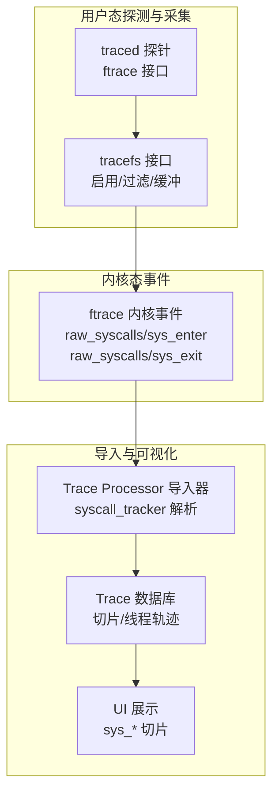
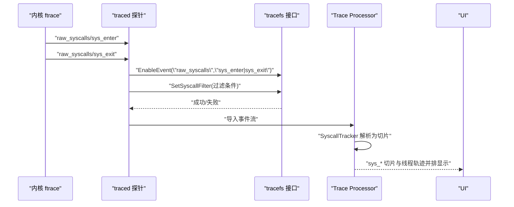
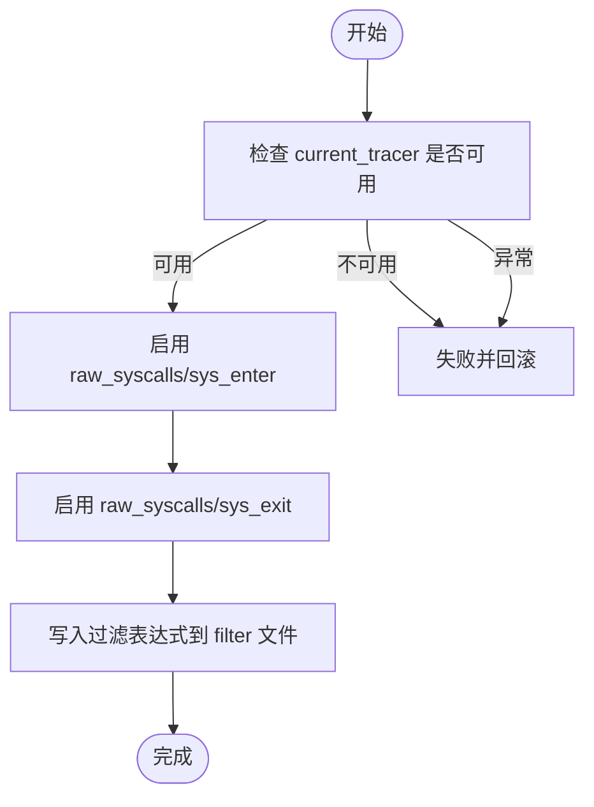
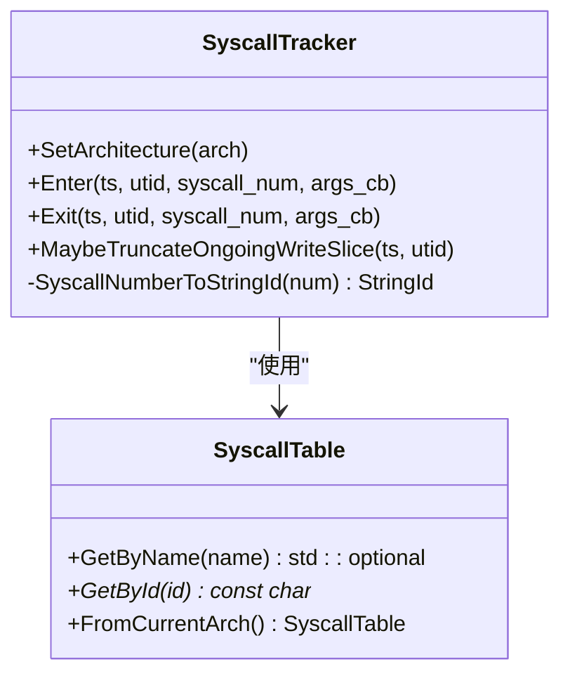
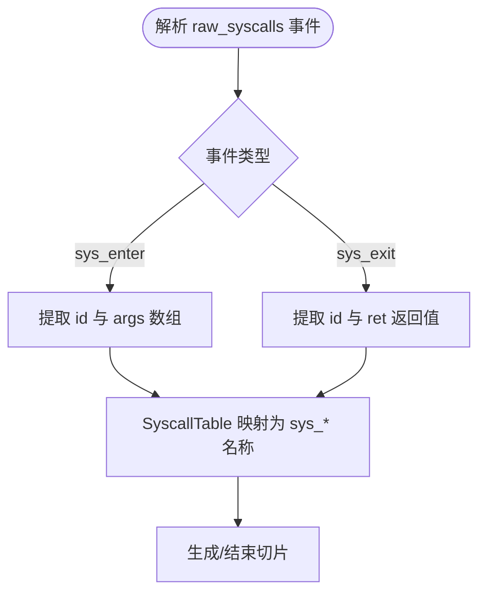

# 系统调用监控探测器

<cite>
**本文引用的文件**
- [syscalls.md](file://docs/data-sources/syscalls.md)
- [syscall_table.h](file://src/kernel_utils/syscall_table.h)
- [syscall_table.cc](file://src/kernel_utils/syscall_table.cc)
- [syscall_tracker.h](file://src/trace_processor/importers/syscalls/syscall_tracker.h)
- [syscall_tracker.cc](file://src/trace_processor/importers/syscalls/syscall_tracker.cc)
- [tracefs.h](file://src/traced/probes/ftrace/tracefs.h)
- [tracefs.cc](file://src/traced/probes/ftrace/tracefs.cc)
- [raw_syscalls.proto](file://protos/perfetto/trace/ftrace/raw_syscalls.proto)
- [sys_enter/format](file://src/traced/probes/ftrace/test/data/android_raven_AOSP.MASTER_5.10.43/events/raw_syscalls/sys_enter/format)
- [sys_exit/format](file://src/traced/probes/ftrace/test/data/android_raven_AOSP.MASTER_5.10.43/events/raw_syscalls/sys_exit/format)
- [ftrace_config_muxer_unittest.cc](file://src/traced/probes/ftrace/ftrace_config_muxer_unittest.cc)
</cite>

## 目录
1. [简介](#简介)
2. [项目结构](#项目结构)
3. [核心组件](#核心组件)
4. [架构总览](#架构总览)
5. [详细组件分析](#详细组件分析)
6. [依赖关系分析](#依赖关系分析)
7. [性能考量](#性能考量)
8. [故障排查指南](#故障排查指南)
9. [结论](#结论)
10. [附录](#附录)

## 简介
本技术文档聚焦于Perfetto的系统调用（syscalls）监控探测器，系统性阐述其拦截、过滤与分析机制。该探测器基于Linux ftrace的raw_syscalls事件，通过内核tracefs接口启用sys_enter/sys_exit事件，捕获系统调用号与少量参数，再由Trace Processor在导入阶段解析为可读的切片事件，并在UI中与线程切片并行展示。本文将从拦截路径、过滤策略、数据解析、配置参数、性能影响与优化建议等方面进行深入说明。

## 项目结构
围绕syscalls探测器的关键目录与文件如下：
- 文档与UI展示：docs/data-sources/syscalls.md
- 内核系统调用表：src/kernel_utils/syscall_table.{h,cc}
- Trace导入与切片追踪：src/trace_processor/importers/syscalls/syscall_tracker.{h,cc}
- ftrace拦截与过滤：src/traced/probes/ftrace/tracefs.{h,cc}
- ftrace事件格式与协议：protos/perfetto/trace/ftrace/raw_syscalls.proto
- ftrace事件格式样例：src/traced/probes/ftrace/test/data/*/events/raw_syscalls/sys_{enter,exit}/format
- 配置与过滤单元测试：src/traced/probes/ftrace/ftrace_config_muxer_unittest.cc

**图示来源**
- [tracefs.h:32-73](file://src/traced/probes/ftrace/tracefs.h#L32-L73)
- [tracefs.cc:116-136](file://src/traced/probes/ftrace/tracefs.cc#L116-L136)
- [raw_syscalls.proto:8-15](file://protos/perfetto/trace/ftrace/raw_syscalls.proto#L8-L15)
- [syscall_tracker.h:33-99](file://src/trace_processor/importers/syscalls/syscall_tracker.h#L33-L99)
- [syscalls.md:1-55](file://docs/data-sources/syscalls.md#L1-L55)

**章节来源**
- [syscalls.md:1-55](file://docs/data-sources/syscalls.md#L1-L55)
- [syscall_table.h:38-74](file://src/kernel_utils/syscall_table.h#L38-L74)
- [syscall_table.cc:29-76](file://src/kernel_utils/syscall_table.cc#L29-L76)
- [syscall_tracker.h:33-136](file://src/trace_processor/importers/syscalls/syscall_tracker.h#L33-L136)
- [syscall_tracker.cc:42-61](file://src/trace_processor/importers/syscalls/syscall_tracker.cc#L42-L61)
- [tracefs.h:32-73](file://src/traced/probes/ftrace/tracefs.h#L32-L73)
- [tracefs.cc:116-136](file://src/traced/probes/ftrace/tracefs.cc#L116-L136)
- [raw_syscalls.proto:8-15](file://protos/perfetto/trace/ftrace/raw_syscalls.proto#L8-L15)

## 核心组件
- 系统调用表（SyscallTable）
  - 负责根据当前架构加载对应的系统调用名称到编号映射，支持按名查ID、按ID查名。
  - 支持架构包括ARM64、ARM32、x86_64、x86等。
- 系统调用追踪器（SyscallTracker）
  - 在Trace Processor侧将sys_enter/sys_exit事件转换为线程切片，记录开始/结束时间与名称（sys_*）。
  - 特殊处理如sys_rt_sigreturn（即时事件）、sys_write（写入切片嵌套与截断）。
- ftrace接口（Tracefs）
  - 提供启用/禁用事件、设置过滤、缓冲控制、触发器管理等能力。
  - 专门实现SetSyscallFilter用于raw_syscalls/sys_enter与sys_exit的过滤表达式写入。

**章节来源**
- [syscall_table.h:38-74](file://src/kernel_utils/syscall_table.h#L38-L74)
- [syscall_table.cc:29-92](file://src/kernel_utils/syscall_table.cc#L29-L92)
- [syscall_tracker.h:33-136](file://src/trace_processor/importers/syscalls/syscall_tracker.h#L33-L136)
- [syscall_tracker.cc:42-61](file://src/trace_processor/importers/syscalls/syscall_tracker.cc#L42-L61)
- [tracefs.h:49-50](file://src/traced/probes/ftrace/tracefs.h#L49-L50)
- [tracefs.cc:116-136](file://src/traced/probes/ftrace/tracefs.cc#L116-L136)

## 架构总览
下图展示了从内核到UI的完整链路：内核ftrace产生raw_syscalls事件，traced通过tracefs启用并设置过滤，Trace Processor解析为切片，最终在UI中以sys_*切片形式呈现。

**图示来源**
- [tracefs.cc:138-149](file://src/traced/probes/ftrace/tracefs.cc#L138-L149)
- [tracefs.cc:116-136](file://src/traced/probes/ftrace/tracefs.cc#L116-L136)
- [syscall_tracker.h:47-99](file://src/trace_processor/importers/syscalls/syscall_tracker.h#L47-L99)
- [syscalls.md:14-18](file://docs/data-sources/syscalls.md#L14-L18)

## 详细组件分析

### 组件A：系统调用拦截与过滤（ftrace + tracefs）
- 拦截点
  - 使用ftrace的raw_syscalls事件族，分别在进入与退出时生成事件。
  - 通过tracefs的events/raw_syscalls/*/enable启用事件；通过events/raw_syscalls/*/filter写入过滤表达式。
- 过滤策略
  - 支持基于syscall编号集合的布尔表达式拼接（例如“id == 0 || id == 1”），对sys_enter与sys_exit同时生效。
  - 过滤器为空表示不过滤全部syscall。
- 关键接口
  - EnableEvent：启用指定组/事件。
  - SetSyscallFilter：写入过滤表达式至sys_enter/sys_exit的filter文件。
  - SetTracingOn：开启/关闭内核事件写入。
  - SetBufferPercent/SetCpuBufferSizeInPages：控制缓冲区占用比例与大小。

**图示来源**
- [tracefs.cc:138-149](file://src/traced/probes/ftrace/tracefs.cc#L138-L149)
- [tracefs.cc:116-136](file://src/traced/probes/ftrace/tracefs.cc#L116-L136)
- [tracefs.cc:642-654](file://src/traced/probes/ftrace/tracefs.cc#L642-L654)

**章节来源**
- [tracefs.h:49-50](file://src/traced/probes/ftrace/tracefs.h#L49-L50)
- [tracefs.cc:116-136](file://src/traced/probes/ftrace/tracefs.cc#L116-L136)
- [ftrace_config_muxer_unittest.cc:482-508](file://src/traced/probes/ftrace/ftrace_config_muxer_unittest.cc#L482-L508)

### 组件B：系统调用数据解析与切片生成（Trace Processor）
- 原始事件
  - raw_syscalls.proto定义了sys_enter/sys_exit事件的字段：sys_enter包含syscall编号与最多6个参数，sys_exit包含syscall编号与返回值。
- 解析流程
  - SyscallTracker根据当前架构加载syscall表，将编号映射为字符串名称（sys_*）。
  - sys_enter触发切片开始，sys_exit触发切片结束；特殊处理sys_rt_sigreturn为即时事件。
  - 对sys_write进行写入切片嵌套与截断逻辑，避免跨切片统计失真。
- 字段与行为
  - Enter/Exit方法接收时间戳、线程ID、syscall编号与可选参数回调，内部通过切片追踪器生成切片。
  - 写入切片状态按线程维度维护，确保跨切片正确截断。

**图示来源**
- [syscall_table.h:59-65](file://src/kernel_utils/syscall_table.h#L59-L65)
- [syscall_table.cc:78-92](file://src/kernel_utils/syscall_table.cc#L78-L92)
- [syscall_tracker.h:45-99](file://src/trace_processor/importers/syscalls/syscall_tracker.h#L45-L99)
- [syscall_tracker.cc:42-61](file://src/trace_processor/importers/syscalls/syscall_tracker.cc#L42-L61)

**章节来源**
- [raw_syscalls.proto:8-15](file://protos/perfetto/trace/ftrace/raw_syscalls.proto#L8-L15)
- [syscall_tracker.h:47-99](file://src/trace_processor/importers/syscalls/syscall_tracker.h#L47-L99)
- [syscall_tracker.cc:29-61](file://src/trace_processor/importers/syscalls/syscall_tracker.cc#L29-L61)

### 组件C：事件格式与参数提取
- 事件格式
  - sys_enter格式包含id与args数组（最多6个参数），sys_exit格式包含id与ret返回值。
  - 这些格式来自内核ftrace事件的format文件，用于解析原始trace数据。
- 参数提取
  - 当前Trace Processor仅使用syscall编号与返回值，不展开参数字段，以降低trace体积与解析开销。
- 错误处理
  - 未知syscall编号映射将被忽略或标记为未知名称，不影响整体追踪流程。

**图示来源**
- [sys_enter/format:3-12](file://src/traced/probes/ftrace/test/data/android_raven_AOSP.MASTER_5.10.43/events/raw_syscalls/sys_enter/format#L3-L12)
- [sys_exit/format:3-12](file://src/traced/probes/ftrace/test/data/android_raven_AOSP.MASTER_5.10.43/events/raw_syscalls/sys_exit/format#L3-L12)
- [raw_syscalls.proto:8-15](file://protos/perfetto/trace/ftrace/raw_syscalls.proto#L8-L15)

**章节来源**
- [syscalls.md:6-7](file://docs/data-sources/syscalls.md#L6-L7)
- [sys_enter/format:3-12](file://src/traced/probes/ftrace/test/data/android_raven_AOSP.MASTER_5.10.43/events/raw_syscalls/sys_enter/format#L3-L12)
- [sys_exit/format:3-12](file://src/traced/probes/ftrace/test/data/android_raven_AOSP.MASTER_5.10.43/events/raw_syscalls/sys_exit/format#L3-L12)

## 依赖关系分析
- 组件耦合
  - SyscallTracker依赖SyscallTable进行名称映射；二者通过Trace Processor上下文连接。
  - traced探针通过Tracefs与内核交互，Tracefs负责事件启用、过滤与缓冲控制。
- 外部依赖
  - 依赖内核ftrace的raw_syscalls事件与tracefs接口。
  - 依赖架构特定的syscall表生成与加载。

**图示来源**
- [tracefs.h:32-73](file://src/traced/probes/ftrace/tracefs.h#L32-L73)
- [syscall_tracker.h:33-43](file://src/trace_processor/importers/syscalls/syscall_tracker.h#L33-L43)
- [syscall_table.h:38-57](file://src/kernel_utils/syscall_table.h#L38-L57)

**章节来源**
- [syscall_table.cc:29-47](file://src/kernel_utils/syscall_table.cc#L29-L47)
- [syscall_tracker.cc:42-61](file://src/trace_processor/importers/syscalls/syscall_tracker.cc#L42-L61)

## 性能考量
- 开销来源
  - 启用ftrace与raw_syscalls事件会带来内核事件写入与用户态导入的CPU与内存开销。
  - 过滤器越精细，事件数量越少，开销越低。
  - 缓冲区大小与溢出策略直接影响trace体积与丢包率。
- 优化建议
  - 使用SetSyscallFilter仅捕获关键syscall（如open/read/write等），避免全量捕获。
  - 合理设置buffer_percent与buffer_size_kb，平衡保留率与内存占用。
  - 在高负载环境优先选择“按需启用”的策略，避免长时间全局追踪。
  - 使用UI/SQ查询时配合索引列（ts、utid、name）进行过滤，减少渲染压力。

[本节为通用性能指导，无需具体文件分析]

## 故障排查指南
- 常见问题
  - 无法启用事件：检查current_tracer是否为nop，或events/enable/set_event权限。
  - 过滤无效：确认filter文件写入成功且表达式语法正确。
  - 无数据：确认tracing_on为1，缓冲未被其他tracer占用。
- 定位手段
  - 通过单元测试中的期望调用验证过滤写入与事件启用是否按预期执行。
  - 检查tracefs接口返回值与日志输出，定位失败步骤。

**章节来源**
- [tracefs.cc:642-654](file://src/traced/probes/ftrace/tracefs.cc#L642-L654)
- [tracefs.cc:138-149](file://src/traced/probes/ftrace/tracefs.cc#L138-L149)
- [ftrace_config_muxer_unittest.cc:482-508](file://src/traced/probes/ftrace/ftrace_config_muxer_unittest.cc#L482-L508)

## 结论
Perfetto的syscalls探测器通过ftrace的raw_syscalls事件族实现对系统调用的高效捕获，结合tracefs的过滤与缓冲控制，在保证可观测性的同时尽量降低开销。Trace Processor侧通过SyscallTable与SyscallTracker将原始事件映射为直观的sys_*切片，便于在UI中与线程轨迹并行分析。通过合理配置过滤、缓冲与采样策略，可在高负载环境下获得稳定、可控的系统调用观测结果。

[本节为总结性内容，无需具体文件分析]

## 附录

### 配置参数说明（基于现有实现）
- 数据源配置要点
  - 启用事件：ftrace_events包含“raw_syscalls/sys_enter”和“raw_syscalls/sys_exit”。
  - 过滤配置：通过syscall_events指定要捕获的syscall名称（如sys_open、sys_read），内部转换为编号过滤表达式。
- tracefs相关控制
  - SetSyscallFilter：写入sys_enter/sys_exit的filter文件，支持“id == N”组合。
  - SetTracingOn：开启/关闭内核事件写入。
  - SetBufferPercent/SetCpuBufferSizeInPages：控制缓冲区占用与大小。
- SQL与UI
  - UI层面sys_*切片与线程切片并排显示。
  - SQL层面可通过slices表按名称前缀sys_进行筛选与聚合。

**章节来源**
- [syscalls.md:42-54](file://docs/data-sources/syscalls.md#L42-L54)
- [ftrace_config_muxer_unittest.cc:482-508](file://src/traced/probes/ftrace/ftrace_config_muxer_unittest.cc#L482-L508)
- [tracefs.cc:116-136](file://src/traced/probes/ftrace/tracefs.cc#L116-L136)
- [tracefs.cc:617-640](file://src/traced/probes/ftrace/tracefs.cc#L617-L640)

### 实际场景与配置示例（概念性说明）
- 识别阻塞调用
  - 关注sys_read、sys_write、sys_futex、sys_poll/select等事件的持续时间与频率。
  - 在UI中查看对应线程切片堆叠，定位热点路径。
- I/O瓶颈
  - 重点观察sys_open、sys_read、sys_write、sys_preadv/pwritev等事件的分布与累积耗时。
- 资源竞争
  - 观察sys_futex、sys_rt_sigreturn等事件的出现频次与等待时间，结合调度切片分析。

[本节为概念性说明，无需具体文件分析]