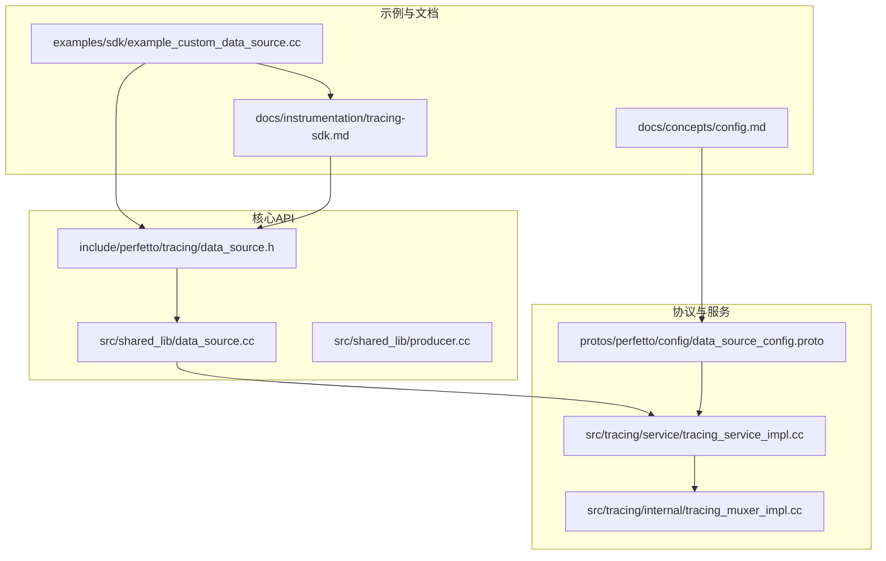
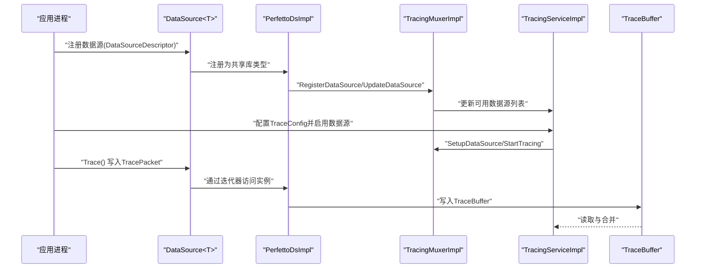
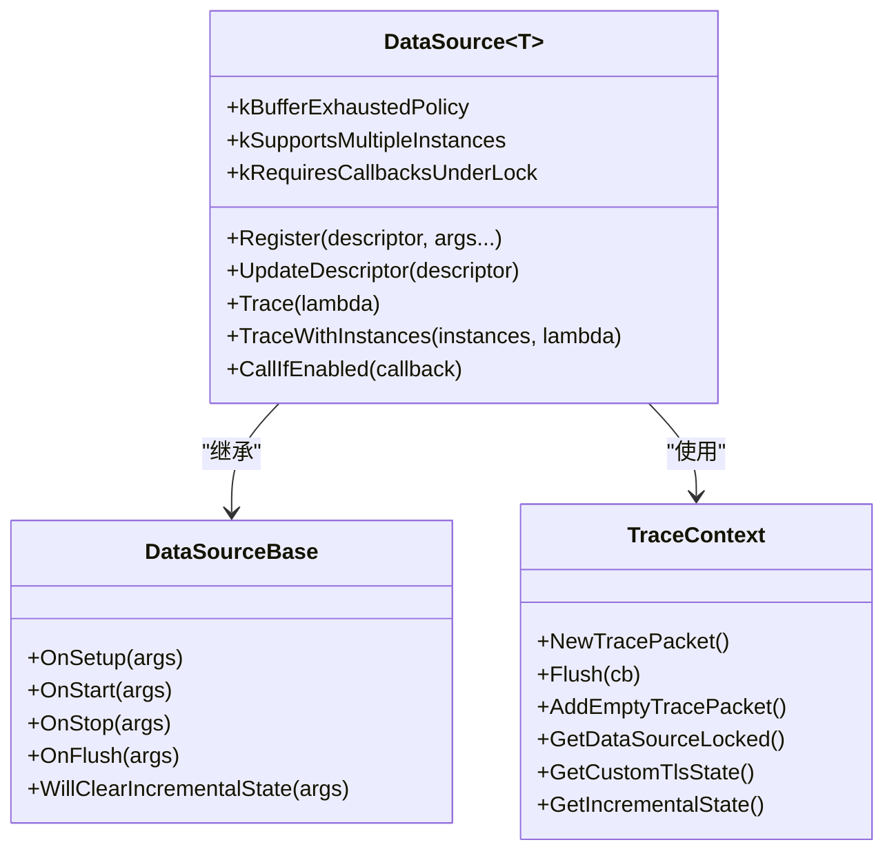
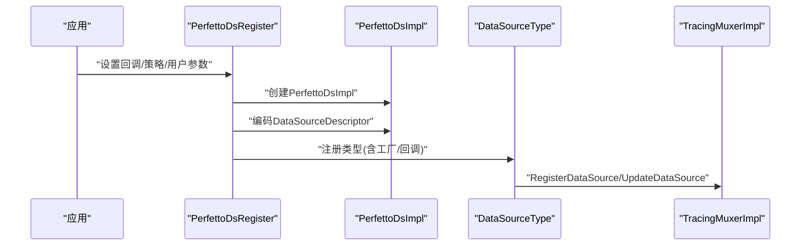
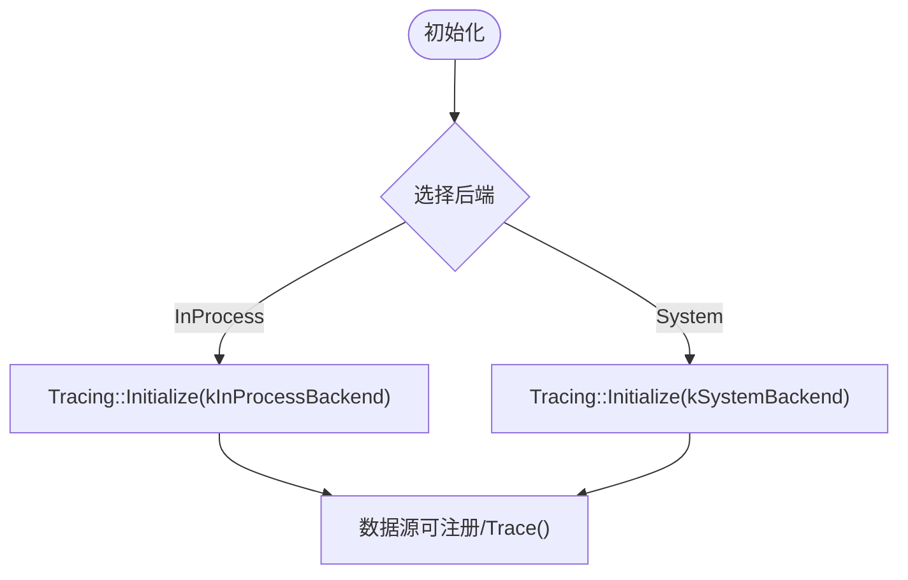
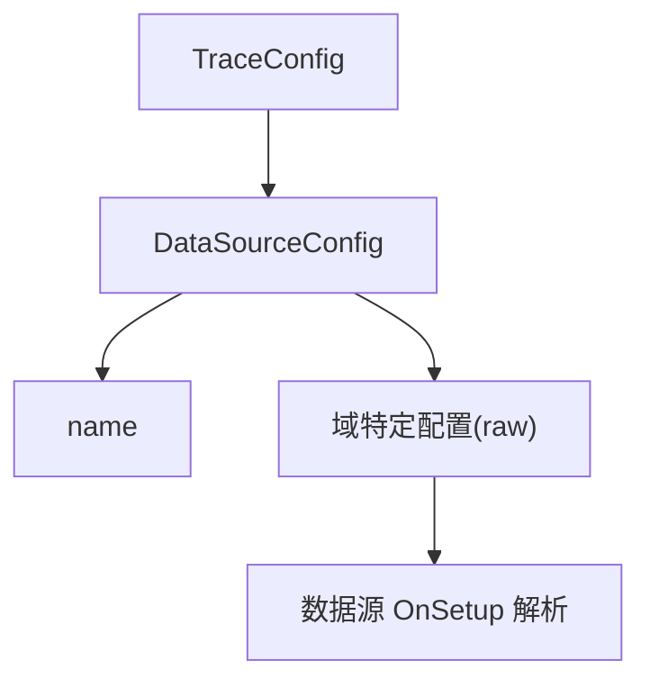
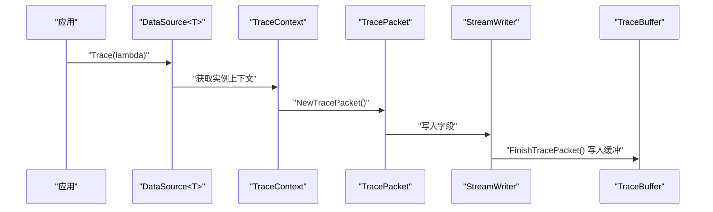
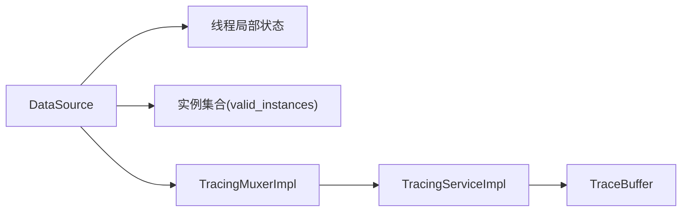

# 自定义数据源开发

<cite>
**本文引用的文件**
- [example_custom_data_source.cc](file://examples/sdk/example_custom_data_source.cc)
- [data_source.h](file://include/perfetto/tracing/data_source.h)
- [data_source.cc](file://src/shared_lib/data_source.cc)
- [producer.cc](file://src/shared_lib/producer.cc)
- [tracing-sdk.md](file://docs/instrumentation/tracing-sdk.md)
- [config.md](file://docs/concepts/config.md)
- [client_api_example.cc](file://test/client_api_example.cc)
- [trace_buffer_v1.h](file://src/tracing/service/trace_buffer_v1.h)
- [trace_buffer_v2_unittest.cc](file://src/tracing/service/trace_buffer_v2_unittest.cc)
- [trace_stats.proto](file://protos/perfetto/common/trace_stats.proto)
- [data_source_config.proto](file://protos/perfetto/config/data_source_config.proto)
- [tracing_service_impl.cc](file://src/tracing/service/tracing_service_impl.cc)
- [tracing_muxer_impl.cc](file://src/tracing/internal/tracing_muxer_impl.cc)
- [data_source_internal.h](file://include/perfetto/tracing/internal/data_source_internal.h)
- [api_integrationtest.cc](file://src/shared_lib/test/api_integrationtest.cc)
- [testing.md](file://docs/contributing/testing.md)
</cite>

## 目录
1. [简介](#简介)
2. [项目结构](#项目结构)
3. [核心组件](#核心组件)
4. [架构总览](#架构总览)
5. [详细组件分析](#详细组件分析)
6. [依赖关系分析](#依赖关系分析)
7. [性能考量](#性能考量)
8. [故障排查指南](#故障排查指南)
9. [结论](#结论)
10. [附录](#附录)

## 简介
本指南面向需要在 Perfetto 中开发自定义数据源（Custom Data Source）的工程师，覆盖从“Hello World”级示例到复杂功能模块的完整开发流程。内容包括：
- 数据源接口与生命周期回调的实现要点
- 事件生成与 TracePacket 写入
- 数据格式与序列化策略
- 注册机制、多实例支持与与追踪服务的集成
- 缓冲区管理与溢出策略
- 调试技巧、测试方法与部署注意事项

## 项目结构
围绕自定义数据源开发，以下目录与文件最为关键：
- 示例与文档：examples/sdk、docs/instrumentation、docs/concepts
- 核心 API：include/perfetto/tracing、src/shared_lib
- 配置协议：protos/perfetto/config
- 服务端集成：src/tracing/service、src/tracing/internal

**图表来源**
- [example_custom_data_source.cc:1-124](file://examples/sdk/example_custom_data_source.cc#L1-L124)
- [tracing-sdk.md:1-419](file://docs/instrumentation/tracing-sdk.md#L1-L419)
- [config.md:276-320](file://docs/concepts/config.md#L276-L320)
- [data_source.h:1-684](file://include/perfetto/tracing/data_source.h#L1-L684)
- [data_source.cc:1-612](file://src/shared_lib/data_source.cc#L1-L612)
- [producer.cc:1-84](file://src/shared_lib/producer.cc#L1-L84)
- [data_source_config.proto:290-325](file://protos/perfetto/config/data_source_config.proto#L290-L325)
- [tracing_service_impl.cc:3359-3388](file://src/tracing/service/tracing_service_impl.cc#L3359-L3388)
- [tracing_muxer_impl.cc:1907-1949](file://src/tracing/internal/tracing_muxer_impl.cc#L1907-L1949)

**章节来源**
- [example_custom_data_source.cc:1-124](file://examples/sdk/example_custom_data_source.cc#L1-L124)
- [tracing-sdk.md:1-419](file://docs/instrumentation/tracing-sdk.md#L1-L419)
- [config.md:276-320](file://docs/concepts/config.md#L276-L320)

## 核心组件
- 数据源基类与模板：DataSource<T> 提供 Trace() 快路径、回调生命周期、TLS 状态与增量状态管理等能力。
- 共享库数据源桥接：PerfettoDs* 接口用于以 C ABI 方式注册与调用数据源，内部映射到 DataSourceType。
- 生产者初始化：Producer 后端初始化负责选择 in-process 或 system 模式，并与 Tracing 服务对接。
- 配置协议：TraceConfig/DataSourceConfig 定义启用数据源、目标缓冲区与域特定配置的格式。

关键职责与接口位置：
- DataSource 回调与 Trace 上下文：[data_source.h:88-201](file://include/perfetto/tracing/data_source.h#L88-L201)
- Trace 快路径与实例遍历：[data_source.h:402-469](file://include/perfetto/tracing/data_source.h#L402-L469)
- 共享库注册与回调桥接：[data_source.cc:377-428](file://src/shared_lib/data_source.cc#L377-L428)
- 生产者后端初始化：[producer.cc:60-84](file://src/shared_lib/producer.cc#L60-L84)
- 配置路由与原始二进制透传：[config.md:276-320](file://docs/concepts/config.md#L276-L320)

**章节来源**
- [data_source.h:88-201](file://include/perfetto/tracing/data_source.h#L88-L201)
- [data_source.h:402-469](file://include/perfetto/tracing/data_source.h#L402-L469)
- [data_source.cc:377-428](file://src/shared_lib/data_source.cc#L377-L428)
- [producer.cc:60-84](file://src/shared_lib/producer.cc#L60-L84)
- [config.md:276-320](file://docs/concepts/config.md#L276-L320)

## 架构总览
自定义数据源从应用侧注册开始，经由共享库桥接到核心 Tracing 系统，最终写入 TraceBuffer 并被 TraceProcessor 处理。

**图表来源**
- [data_source.h:471-521](file://include/perfetto/tracing/data_source.h#L471-L521)
- [data_source.cc:377-428](file://src/shared_lib/data_source.cc#L377-L428)
- [tracing_muxer_impl.cc:1907-1949](file://src/tracing/internal/tracing_muxer_impl.cc#L1907-L1949)
- [tracing_service_impl.cc:3359-3388](file://src/tracing/service/tracing_service_impl.cc#L3359-L3388)
- [trace_buffer_v1.h:135-160](file://src/tracing/service/trace_buffer_v1.h#L135-L160)

## 详细组件分析

### 组件A：DataSource<T> 与 TraceContext
- 生命周期回调：OnSetup、OnStart、OnStop、OnFlush、WillClearIncrementalState。
- Trace 快路径：CallIfEnabled → TraceWithInstances → 遍历活动实例 → 调用用户回调。
- TraceContext 提供 NewTracePacket、Flush、AddEmptyTracePacket、锁定访问实例状态等。

**图表来源**
- [data_source.h:88-201](file://include/perfetto/tracing/data_source.h#L88-L201)
- [data_source.h:264-392](file://include/perfetto/tracing/data_source.h#L264-L392)

**章节来源**
- [data_source.h:88-201](file://include/perfetto/tracing/data_source.h#L88-L201)
- [data_source.h:264-392](file://include/perfetto/tracing/data_source.h#L264-L392)

### 组件B：共享库数据源桥接（PerfettoDs）
- PerfettoDsImpl 封装回调、用户参数、缓冲区耗尽策略与实例位图。
- PerfettoDsRegister 将 C ABI 的参数转换为 DataSourceDescriptor 并注册。
- 迭代器 PerfettoDsTraceIterateBegin/Next/Break 驱动实例遍历。
- TracePacket 写入通过 PerfettoDsTracerImplPacketBegin/End 完成。

**图表来源**
- [data_source.cc:106-121](file://src/shared_lib/data_source.cc#L106-L121)
- [data_source.cc:377-428](file://src/shared_lib/data_source.cc#L377-L428)
- [tracing_muxer_impl.cc:1907-1922](file://src/tracing/internal/tracing_muxer_impl.cc#L1907-L1922)

**章节来源**
- [data_source.cc:106-121](file://src/shared_lib/data_source.cc#L106-L121)
- [data_source.cc:377-428](file://src/shared_lib/data_source.cc#L377-L428)
- [tracing_muxer_impl.cc:1907-1922](file://src/tracing/internal/tracing_muxer_impl.cc#L1907-L1922)

### 组件C：生产者后端初始化与模式选择
- in-process 模式：仅记录应用内事件，无需系统守护进程。
- system 模式：连接 traced 服务，可融合系统事件，需守护进程运行。

**图表来源**
- [producer.cc:60-84](file://src/shared_lib/producer.cc#L60-L84)
- [tracing-sdk.md:269-331](file://docs/instrumentation/tracing-sdk.md#L269-L331)

**章节来源**
- [producer.cc:60-84](file://src/shared_lib/producer.cc#L60-L84)
- [tracing-sdk.md:269-331](file://docs/instrumentation/tracing-sdk.md#L269-L331)

### 组件D：配置与域特定参数传递
- TraceConfig.data_sources[].config.name 指定启用的数据源。
- 域特定配置（如 GPU 计数器配置）通过 raw 字段透传至数据源。
- 服务端不解析这些字段，直接转发给匹配名称的数据源。

**图表来源**
- [config.md:276-320](file://docs/concepts/config.md#L276-L320)
- [data_source_config.proto:290-325](file://protos/perfetto/config/data_source_config.proto#L290-L325)

**章节来源**
- [config.md:276-320](file://docs/concepts/config.md#L276-L320)
- [data_source_config.proto:290-325](file://protos/perfetto/config/data_source_config.proto#L290-L325)

### 组件E：事件生成与数据格式
- 使用 TraceContext.NewTracePacket() 获取 TracePacket 句柄。
- 通过 protozero 写入 TracePacket 字段，最终由服务端写入 TraceBuffer。
- 支持异步 Flush 与空包保障，确保最后事件被读取。

**图表来源**
- [data_source.h:293-347](file://include/perfetto/tracing/data_source.h#L293-L347)
- [data_source.cc:577-598](file://src/shared_lib/data_source.cc#L577-L598)
- [trace_buffer_v1.h:135-160](file://src/tracing/service/trace_buffer_v1.h#L135-L160)

**章节来源**
- [data_source.h:293-347](file://include/perfetto/tracing/data_source.h#L293-L347)
- [data_source.cc:577-598](file://src/shared_lib/data_source.cc#L577-L598)
- [trace_buffer_v1.h:135-160](file://src/tracing/service/trace_buffer_v1.h#L135-L160)

## 依赖关系分析
- DataSource<T> 依赖 TracingMuxer 与内部静态状态，支持多实例与 TLS。
- 共享库桥接层将 C ABI 与 C++ 类型绑定，负责回调与增量状态生命周期。
- 服务端在收到 TraceConfig 后，为每个 Producer 创建 DataSource 实例并进入 CONFIGURED/STARTED 状态。

**图表来源**
- [data_source_internal.h:148-187](file://include/perfetto/tracing/internal/data_source_internal.h#L148-L187)
- [tracing_muxer_impl.cc:1286-1319](file://src/tracing/internal/tracing_muxer_impl.cc#L1286-L1319)
- [tracing_service_impl.cc:3359-3388](file://src/tracing/service/tracing_service_impl.cc#L3359-L3388)

**章节来源**
- [data_source_internal.h:148-187](file://include/perfetto/tracing/internal/data_source_internal.h#L148-L187)
- [tracing_muxer_impl.cc:1286-1319](file://src/tracing/internal/tracing_muxer_impl.cc#L1286-L1319)
- [tracing_service_impl.cc:3359-3388](file://src/tracing/service/tracing_service_impl.cc#L3359-L3388)

## 性能考量
- Trace 快路径：使用 valid_instances 位图与线程局部缓存减少锁竞争。
- 异步停止与刷新：OnStop/OnFlush 可返回延后完成闭包，避免阻塞服务端。
- 缓冲区耗尽策略：支持 Drop、StallThenAbort、StallThenDrop；可配置是否允许配置覆盖。
- TraceBuffer：支持分片与重排，避免碎片导致的读取顺序差异；注意溢出丢弃策略。

**章节来源**
- [data_source.h:414-436](file://include/perfetto/tracing/data_source.h#L414-L436)
- [data_source.h:172-195](file://include/perfetto/tracing/data_source.h#L172-L195)
- [trace_buffer_v2_unittest.cc:2193-2212](file://src/tracing/service/trace_buffer_v2_unittest.cc#L2193-L2212)
- [trace_stats.proto:39-66](file://protos/perfetto/common/trace_stats.proto#L39-L66)

## 故障排查指南
- 回调未触发：确认已调用 DataSource::Register 并在 TraceConfig 中启用；检查 will_notify_on_start/stop 设置。
- Trace 无输出：检查 TraceContext.Flush 是否在 OnStop 异步路径中显式调用；确保最后事件写入后 Flush。
- 多实例冲突：若 kSupportsMultipleInstances=false，重复启动会失败；服务端会去重相同配置实例。
- 缓冲区溢出：根据业务调整 BufferExhaustedPolicy；必要时增大缓冲或降低采样频率。
- 测试与回归：使用单元测试与集成测试验证数据源行为；参考测试框架与命令。

**章节来源**
- [tracing_muxer_impl.cc:1286-1319](file://src/tracing/internal/tracing_muxer_impl.cc#L1286-L1319)
- [data_source.h:172-195](file://include/perfetto/tracing/data_source.h#L172-L195)
- [testing.md:72-124](file://docs/contributing/testing.md#L72-L124)

## 结论
通过 DataSource<T> 与共享库桥接，开发者可以以最小成本实现高性能、可扩展的自定义数据源。遵循本文的注册、生命周期、事件生成与缓冲区策略，结合完善的测试与调试手段，可在多种后端模式下稳定集成并交付高质量的追踪数据。

## 附录

### 开发步骤速查
- 初始化后端：选择 in-process 或 system 模式。
- 定义数据源类，重载 OnSetup/OnStart/OnStop/OnFlush。
- 在 main 中注册 DataSourceDescriptor 并调用 Register。
- 在 TraceConfig 中启用该数据源。
- 在 Trace() 回调中写入 TracePacket。
- 如需域特定配置，使用 DataSourceConfig.raw 字段透传并在 OnSetup 解析。

**章节来源**
- [tracing-sdk.md:175-274](file://docs/instrumentation/tracing-sdk.md#L175-L274)
- [example_custom_data_source.cc:52-103](file://examples/sdk/example_custom_data_source.cc#L52-L103)

### 示例参考
- Hello World 数据源示例：[example_custom_data_source.cc:36-124](file://examples/sdk/example_custom_data_source.cc#L36-L124)
- 系统模式示例（GPU 计数器）：[client_api_example.cc:37-114](file://test/client_api_example.cc#L37-L114)

**章节来源**
- [example_custom_data_source.cc:36-124](file://examples/sdk/example_custom_data_source.cc#L36-L124)
- [client_api_example.cc:37-114](file://test/client_api_example.cc#L37-L114)