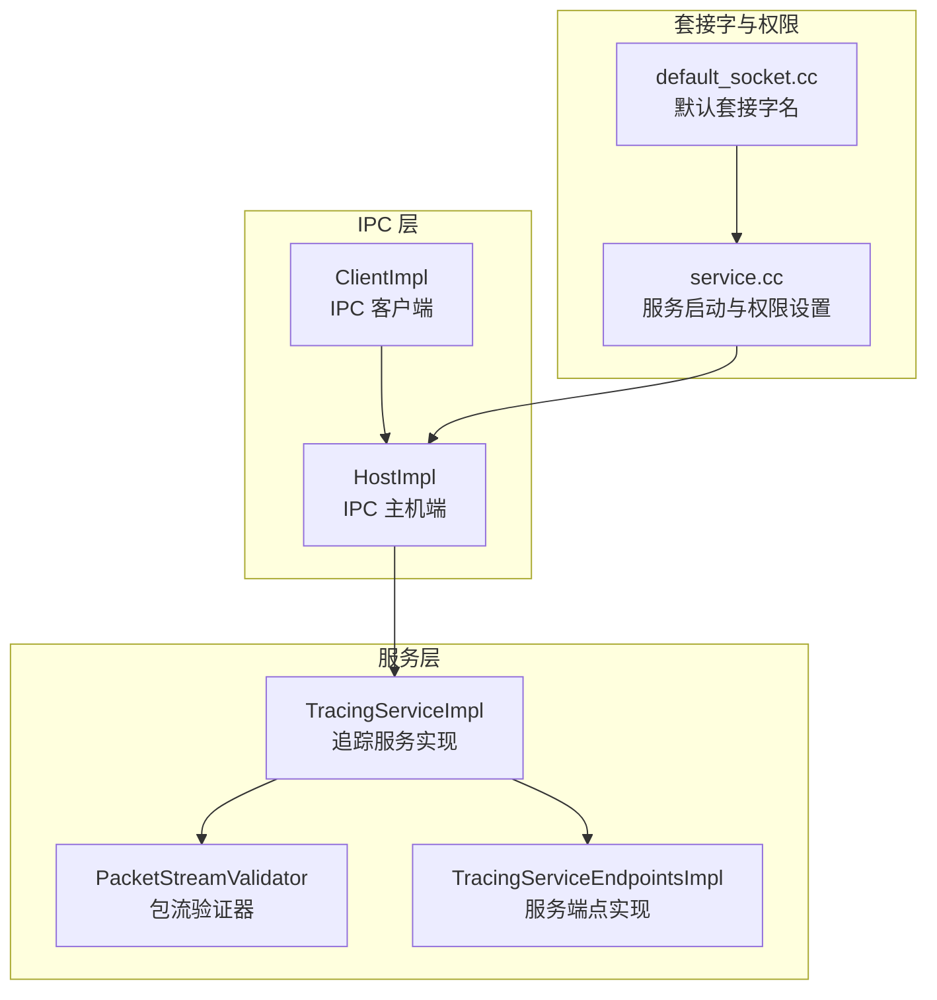
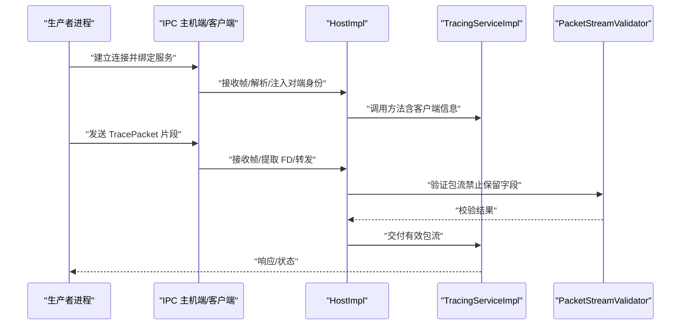
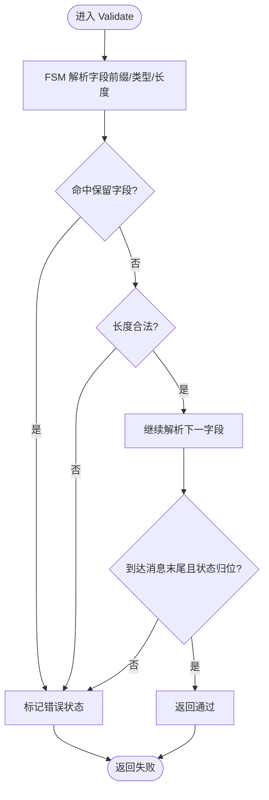
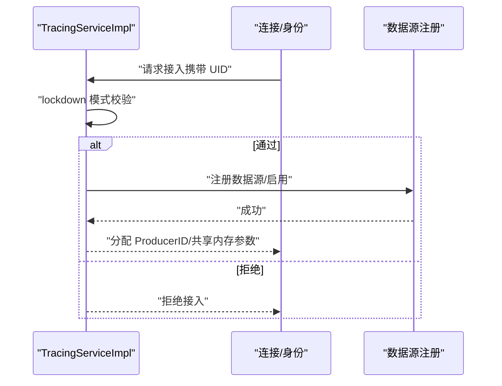
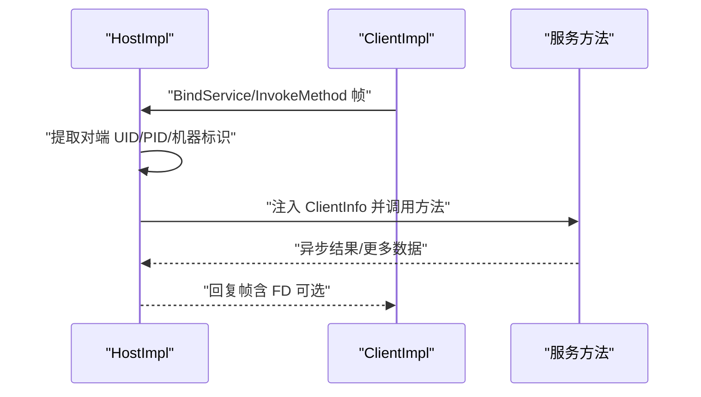
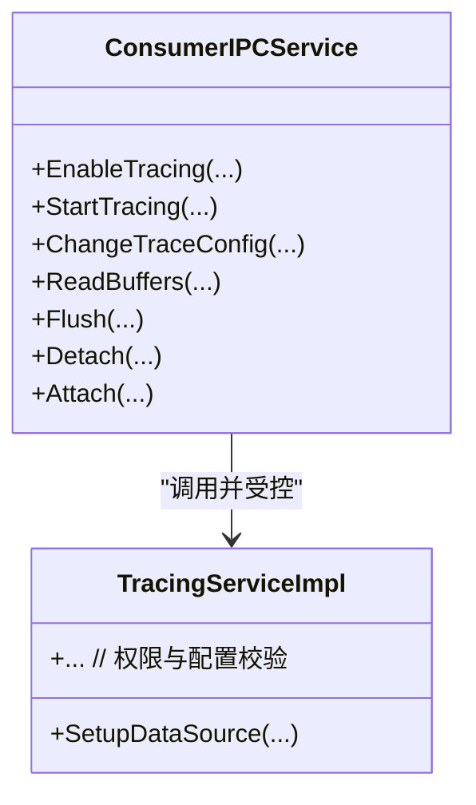
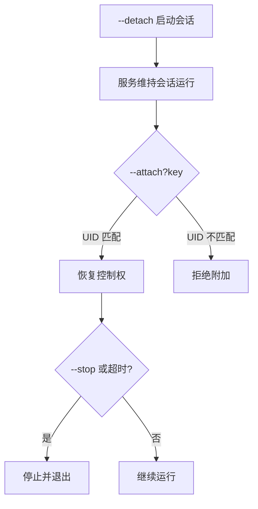
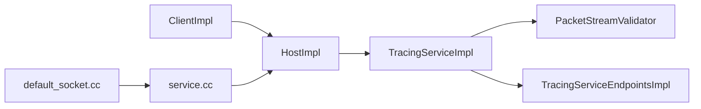

# 安全隔离机制

<cite>
**本文引用的文件**
- [安全模型（设计文档）](file://docs/design-docs/security-model.md)
- [Detached 模式（概念）](file://docs/concepts/detached-mode.md)
- [包流验证器头文件](file://src/tracing/service/packet_stream_validator.h)
- [包流验证器实现](file://src/tracing/service/packet_stream_validator.cc)
- [包流验证器单元测试](file://src/tracing/service/packet_stream_validator_unittest.cc)
- [追踪服务实现（生产者接入与锁屏模式）](file://src/tracing/service/tracing_service_impl.cc)
- [追踪服务端点实现](file://src/tracing/service/tracing_service_endpoints_impl.cc)
- [IPC 主机端实现（客户端身份与机器标识）](file://src/ipc/host_impl.cc)
- [IPC 客户端实现（请求帧与回复处理）](file://src/ipc/client_impl.cc)
- [消费者 IPC 服务接口定义](file://src/tracing/ipc/service/consumer_ipc_service.h)
- [默认套接字名称（生产者/消费者）](file://src/tracing/ipc/default_socket.cc)
- [服务启动与套接字权限设置](file://src/traced/service/service.cc)
- [API 与 ABI（套接字暴露范围）](file://docs/design-docs/api-and-abi.md)
</cite>

## 目录
1. [引言](#引言)
2. [项目结构](#项目结构)
3. [核心组件](#核心组件)
4. [架构总览](#架构总览)
5. [详细组件分析](#详细组件分析)
6. [依赖关系分析](#依赖关系分析)
7. [性能考量](#性能考量)
8. [故障排查指南](#故障排查指南)
9. [结论](#结论)
10. [附录](#附录)

## 引言
本文件系统化梳理 Perfetto 的安全隔离机制，围绕生产者与消费者的信任边界、非信任实体处理策略、权限控制模型、沙箱与资源约束、消费者权限验证与数据读取控制、IPC 通信安全（消息验证、身份认证、访问控制）、Detached 模式的安全考虑与使用场景、威胁模型与防护措施，以及安全配置与审计建议进行深入说明。

## 项目结构
- 安全模型与概念：位于 docs/design-docs 与 docs/concepts，明确生产者/消费者信任边界、共享内存隔离、内容可追溯性等原则。
- 核心服务与验证：位于 src/tracing/service，包含包流验证器、追踪服务实现与端点实现。
- IPC 层：位于 src/ipc，负责主机端与客户端的连接、帧序列化/反序列化、身份注入与机器标识生成。
- 套接字与权限：位于 src/traced/service 与 src/tracing/ipc，默认套接字路径与权限设置。
- 概念与参考：detached-mode 文档说明高级运行模式及其安全限制。

**图表来源**
- [追踪服务实现（生产者接入与锁屏模式）](file://src/tracing/service/tracing_service_impl.cc)
- [包流验证器实现](file://src/tracing/service/packet_stream_validator.cc)
- [追踪服务端点实现](file://src/tracing/service/tracing_service_endpoints_impl.cc)
- [IPC 主机端实现（客户端身份与机器标识）](file://src/ipc/host_impl.cc)
- [IPC 客户端实现（请求帧与回复处理）](file://src/ipc/client_impl.cc)
- [默认套接字名称（生产者/消费者）](file://src/tracing/ipc/default_socket.cc)
- [服务启动与套接字权限设置](file://src/traced/service/service.cc)

**章节来源**
- [安全模型（设计文档）](file://docs/design-docs/security-model.md)
- [Detached 模式（概念）](file://docs/concepts/detached-mode.md)
- [默认套接字名称（生产者/消费者）](file://src/tracing/ipc/default_socket.cc)
- [服务启动与套接字权限设置](file://src/traced/service/service.cc)

## 核心组件
- 生产者与消费者信任模型
  - 生产者永远不被信任，需假设其会尝试 DoS/崩溃/利用服务；服务对所有输入进行严格校验。
  - 消费者始终受信任，但仍不应能崩溃或利用服务；DoS 在所难免。
- 共享内存隔离
  - 内存仅在每个生产者与服务之间点对点共享，禁止跨生产者或生产者与消费者之间的共享，避免未受信与受信实体间不可审计的数据通道。
- 包流验证与内容可追溯性
  - 服务保证由自身写入的 TracePacket 字段不可被生产者伪造；保留字段（如 trusted_uid 等）不得由生产者设置；服务追加生产者的 POSIX UID 以支持离线内容归属证明。
- IPC 身份与访问控制
  - 主机端从 UNIX 套接字获取对端 UID/PID，并在非 UNIX 套接字时允许中继服务设置对端身份；消费者套接字仅限特权进程访问（Android 上通过 SELinux 限制）。
- Detached 模式
  - 高风险模式，用于后台长时采样；重新附加需要原始发起者 UID 匹配；需配合写入文件配置以避免泄漏会话。

**章节来源**
- [安全模型（设计文档）](file://docs/design-docs/security-model.md)
- [包流验证器头文件](file://src/tracing/service/packet_stream_validator.h)
- [包流验证器实现](file://src/tracing/service/packet_stream_validator.cc)
- [包流验证器单元测试](file://src/tracing/service/packet_stream_validator_unittest.cc)
- [IPC 主机端实现（客户端身份与机器标识）](file://src/ipc/host_impl.cc)
- [API 与 ABI（套接字暴露范围）](file://docs/design-docs/api-and-abi.md)
- [Detached 模式（概念）](file://docs/concepts/detached-mode.md)

## 架构总览
下图展示生产者/消费者与服务的交互，以及 IPC 身份注入与包流验证的关键节点。

**图表来源**
- [IPC 主机端实现（客户端身份与机器标识）](file://src/ipc/host_impl.cc)
- [IPC 客户端实现（请求帧与回复处理）](file://src/ipc/client_impl.cc)
- [包流验证器实现](file://src/tracing/service/packet_stream_validator.cc)
- [追踪服务实现（生产者接入与锁屏模式）](file://src/tracing/service/tracing_service_impl.cc)

## 详细组件分析

### 组件一：包流验证器（PacketStreamValidator）
- 设计目标
  - 校验生产者提交的 TracePacket 序列是否完整、无截断、无多余字节；禁止设置保留字段（如 trusted_uid、trusted_pid、machine_id 等），确保服务侧字段不可被伪造。
- 关键机制
  - 基于有限状态机解析 Protobuf 字段前缀与长度，逐字段跳过负载，最终确认消息格式正确且未命中保留字段。
  - 对超大消息长度进行上限检查，防止内存滥用。
- 安全意义
  - 作为最后一道防线，阻止恶意生产者通过构造非法包流进行内存破坏或逃逸。

**图表来源**
- [包流验证器实现](file://src/tracing/service/packet_stream_validator.cc)

**章节来源**
- [包流验证器头文件](file://src/tracing/service/packet_stream_validator.h)
- [包流验证器实现](file://src/tracing/service/packet_stream_validator.cc)
- [包流验证器单元测试](file://src/tracing/service/packet_stream_validator_unittest.cc)

### 组件二：追踪服务实现（生产者接入与锁屏模式）
- 生产者接入
  - 严格校验连接来源 UID；在 lockdown 模式下仅允许当前用户 UID 接入，拒绝其他 UID。
  - 限制最大生产者数量，防止资源耗尽。
- 数据源启用与多机过滤
  - 在 lockdown 模式下，若生产者 UID 不匹配服务 UID，则拒绝启用该生产者注册的数据源。
  - 支持按机器名过滤，避免跨机器误启数据源。
- 内容可追溯性
  - 服务追加生产者的 POSIX UID 至每条 TracePacket，便于离线审计与溯源。

**图表来源**
- [追踪服务实现（生产者接入与锁屏模式）](file://src/tracing/service/tracing_service_impl.cc)

**章节来源**
- [追踪服务实现（生产者接入与锁屏模式）](file://src/tracing/service/tracing_service_impl.cc)
- [追踪服务端点实现](file://src/tracing/service/tracing_service_endpoints_impl.cc)

### 组件三：IPC 主机端与客户端（身份注入与帧处理）
- 主机端（HostImpl）
  - 从 UNIX 套接字提取对端 UID/PID；在非 UNIX 套接字时允许中继服务设置对端身份与机器标识。
  - 将客户端信息注入到服务方法调用上下文中，供服务侧鉴权与审计使用。
- 客户端（ClientImpl）
  - 发送/接收帧，维护请求队列与回调；对异常帧进行断连处理；支持 FD 透传（在特定平台）。

**图表来源**
- [IPC 主机端实现（客户端身份与机器标识）](file://src/ipc/host_impl.cc)
- [IPC 客户端实现（请求帧与回复处理）](file://src/ipc/client_impl.cc)

**章节来源**
- [IPC 主机端实现（客户端身份与机器标识）](file://src/ipc/host_impl.cc)
- [IPC 客户端实现（请求帧与回复处理）](file://src/ipc/client_impl.cc)

### 组件四：消费者权限验证与数据读取控制
- 套接字暴露范围
  - 消费者套接字仅对特权进程开放（Android 上通过 SELinux 限制），避免敏感 Trace 数据泄露。
- RPC 方法与权限
  - 消费者通过 ConsumerIPCService 执行启用/开始/变更配置/读缓冲/刷新/分离/附加等操作；服务端根据客户端身份与权限决定放行。
- 默认套接字与权限设置
  - 默认套接字名称可在不同平台覆盖；服务启动时可设置消费者与生产者套接字的组与权限，确保最小暴露面。

**图表来源**
- [消费者 IPC 服务接口定义](file://src/tracing/ipc/service/consumer_ipc_service.h)
- [追踪服务实现（生产者接入与锁屏模式）](file://src/tracing/service/tracing_service_impl.cc)

**章节来源**
- [API 与 ABI（套接字暴露范围）](file://docs/design-docs/api-and-abi.md)
- [默认套接字名称（生产者/消费者）](file://src/tracing/ipc/default_socket.cc)
- [服务启动与套接字权限设置](file://src/traced/service/service.cc)
- [消费者 IPC 服务接口定义](file://src/tracing/ipc/service/consumer_ipc_service.h)

### 组件五：Detached 模式安全考虑与使用场景
- 使用场景
  - 需要后台长时间采样（如 Traceur 应用），避免因应用生命周期导致采样中断。
- 安全限制
  - 重新附加必须使用原始发起者的 UID；否则拒绝。
  - 仅允许传递 --stop 参数；其他命令行参数在 --attach 时不生效。
  - 需配合写入文件配置，避免会话泄漏与无限运行。
- 风险提示
  - 高度不推荐使用；存在泄漏会话与长期运行的风险。

**图表来源**
- [Detached 模式（概念）](file://docs/concepts/detached-mode.md)

**章节来源**
- [Detached 模式（概念）](file://docs/concepts/detached-mode.md)

## 依赖关系分析
- 组件耦合
  - TracingServiceImpl 依赖 PacketStreamValidator 进行包流校验；依赖 TracingServiceEndpointsImpl 管理生产者端点。
  - IPC HostImpl/ClientImpl 提供身份注入与帧处理，贯穿服务调用链。
- 外部依赖
  - 套接字权限与 SELinux 策略在 Android 上限制消费者访问；默认套接字路径与权限在服务启动阶段设置。
- 循环依赖
  - 代码组织上未见循环依赖；IPC 与服务层通过接口解耦。

**图表来源**
- [IPC 客户端实现（请求帧与回复处理）](file://src/ipc/client_impl.cc)
- [IPC 主机端实现（客户端身份与机器标识）](file://src/ipc/host_impl.cc)
- [追踪服务实现（生产者接入与锁屏模式）](file://src/tracing/service/tracing_service_impl.cc)
- [包流验证器实现](file://src/tracing/service/packet_stream_validator.cc)
- [追踪服务端点实现](file://src/tracing/service/tracing_service_endpoints_impl.cc)
- [默认套接字名称（生产者/消费者）](file://src/tracing/ipc/default_socket.cc)
- [服务启动与套接字权限设置](file://src/traced/service/service.cc)

**章节来源**
- [IPC 主机端实现（客户端身份与机器标识）](file://src/ipc/host_impl.cc)
- [IPC 客户端实现（请求帧与回复处理）](file://src/ipc/client_impl.cc)
- [追踪服务实现（生产者接入与锁屏模式）](file://src/tracing/service/tracing_service_impl.cc)
- [包流验证器实现](file://src/tracing/service/packet_stream_validator.cc)
- [追踪服务端点实现](file://src/tracing/service/tracing_service_endpoints_impl.cc)
- [默认套接字名称（生产者/消费者）](file://src/tracing/ipc/default_socket.cc)
- [服务启动与套接字权限设置](file://src/traced/service/service.cc)

## 性能考量
- 包流验证器采用高效状态机解析，避免深拷贝与复杂结构体遍历；在关键路径上保持低开销。
- IPC 层对发送/接收进行超时控制与背压处理，避免阻塞导致的崩溃与资源占用。
- 共享内存隔离减少跨进程共享带来的同步成本与潜在竞争。

## 故障排查指南
- 包流验证失败
  - 现象：服务拒绝包流，日志显示验证错误状态。
  - 排查：确认生产者未设置保留字段；检查包大小与完整性；核对 Protobuf 编码。
- 生产者接入被拒
  - 现象：连接后立即断开或被拒绝。
  - 排查：确认 lockdown 模式下 UID 是否匹配；检查最大生产者数量限制。
- IPC 断连与超时
  - 现象：客户端/服务端频繁断连。
  - 排查：检查套接字权限与 SELinux 策略；确认发送超时设置合理；核对 FD 透传逻辑。
- Detached 模式无法附加
  - 现象：--attach 返回拒绝。
  - 排查：确认使用原始发起者 UID；仅传递 --stop；检查配置是否启用写入文件。

**章节来源**
- [包流验证器单元测试](file://src/tracing/service/packet_stream_validator_unittest.cc)
- [追踪服务实现（生产者接入与锁屏模式）](file://src/tracing/service/tracing_service_impl.cc)
- [IPC 主机端实现（客户端身份与机器标识）](file://src/ipc/host_impl.cc)
- [IPC 客户端实现（请求帧与回复处理）](file://src/ipc/client_impl.cc)
- [Detached 模式（概念）](file://docs/concepts/detached-mode.md)

## 结论
Perfetto 的安全隔离以“生产者不信任、消费者受信任但受限”为核心，通过严格的包流验证、点对点共享内存、UNIX 套接字身份注入与 SELinux 访问控制、以及 Detached 模式的严格附加约束，构建了多层次的安全防线。遵循本文的安全配置与审计建议，可显著降低 Trace 数据泄露与服务被滥用的风险。

## 附录

### 安全威胁模型与防护措施
- 威胁向量
  - 生产者注入非法包流、伪造保留字段、越界写入。
  - 跨进程共享内存导致数据泄露。
  - 消费者套接字被非特权进程访问。
  - Detached 模式被滥用导致会话泄漏。
- 防护措施
  - 严格包流验证与保留字段拦截。
  - 禁止跨生产者/生产者与消费者共享内存。
  - 限制消费者套接字访问范围（SELinux/权限）。
  - Detached 模式仅允许原始 UID 附加，且仅支持 --stop。

**章节来源**
- [安全模型（设计文档）](file://docs/design-docs/security-model.md)
- [包流验证器实现](file://src/tracing/service/packet_stream_validator.cc)
- [IPC 主机端实现（客户端身份与机器标识）](file://src/ipc/host_impl.cc)
- [API 与 ABI（套接字暴露范围）](file://docs/design-docs/api-and-abi.md)
- [Detached 模式（概念）](file://docs/concepts/detached-mode.md)

### 安全配置指南
- 套接字与权限
  - 设置消费者与生产者套接字的组与权限，最小化暴露面。
  - 在 Android 上通过 SELinux 限制消费者套接字访问域。
- 生产者接入
  - 启用 lockdown 模式时，仅允许当前用户 UID 接入。
  - 控制最大并发生产者数量，防止资源耗尽。
- Detached 模式
  - 必须启用写入文件配置；仅在必要时使用；严格限制附加 UID。
- 审计与日志
  - 记录生产者 UID、机器标识、请求/回复摘要与错误事件，便于事后审计。

**章节来源**
- [服务启动与套接字权限设置](file://src/traced/service/service.cc)
- [默认套接字名称（生产者/消费者）](file://src/tracing/ipc/default_socket.cc)
- [追踪服务实现（生产者接入与锁屏模式）](file://src/tracing/service/tracing_service_impl.cc)
- [IPC 主机端实现（客户端身份与机器标识）](file://src/ipc/host_impl.cc)
- [Detached 模式（概念）](file://docs/concepts/detached-mode.md)