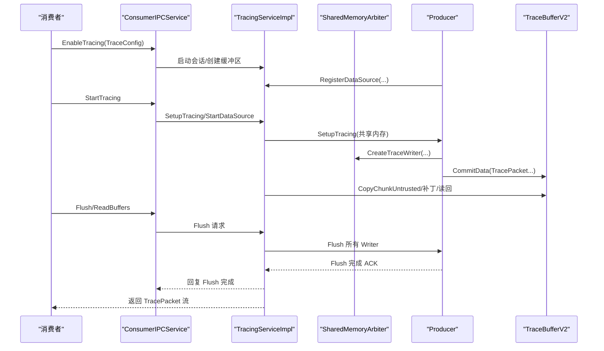
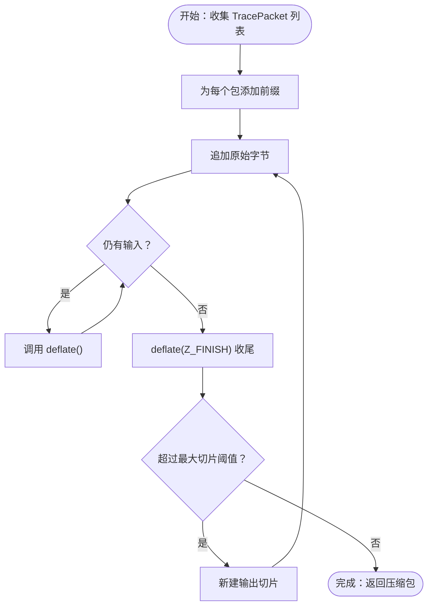
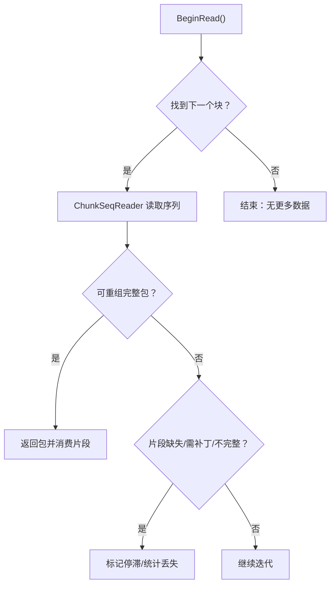
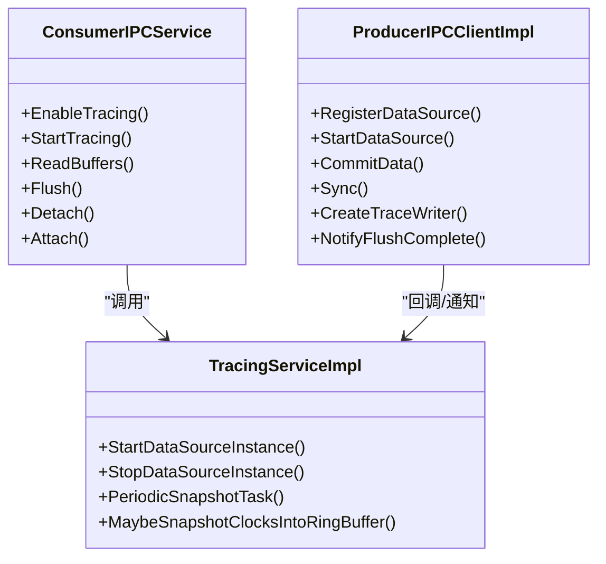
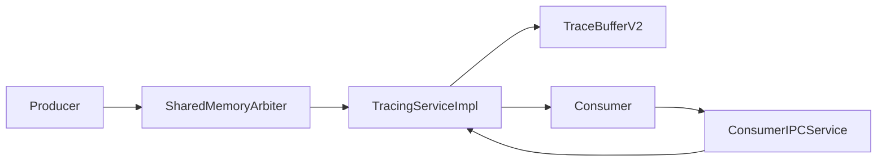

# 数据流处理

<cite>
**本文引用的文件**
- [life-of-a-tracing-session.md](file://docs/design-docs/life-of-a-tracing-session.md)
- [concurrent-tracing-sessions.md](file://docs/concepts/concurrent-tracing-sessions.md)
- [trace-buffer.md](file://docs/design-docs/trace-buffer.md)
- [clock-sync.md](file://docs/concepts/clock-sync.md)
- [traced.md](file://docs/reference/traced.md)
- [consumer_ipc_service.h](file://src/tracing/ipc/service/consumer_ipc_service.h)
- [producer_ipc_client_impl.h](file://src/tracing/ipc/producer/producer_ipc_client_impl.h)
- [producer_ipc_client_impl.cc](file://src/tracing/ipc/producer/producer_ipc_client_impl.cc)
- [tracing_service_impl.h](file://src/tracing/service/tracing_service_impl.h)
- [tracing_service_impl.cc](file://src/tracing/service/tracing_service_impl.cc)
- [zlib_compressor.cc](file://src/tracing/service/zlib_compressor.cc)
- [zlib_compressor_unittest.cc](file://src/tracing/service/zlib_compressor_unittest.cc)
- [streaming_line_reader.h](file://src/trace_processor/util/streaming_line_reader.h)
- [verify_integrity.cc](file://src/trace_redaction/verify_integrity.cc)
- [metrics.md](file://docs/analysis/metrics.md)
- [README.md](file://test/stress_test/README.md)
</cite>

## 目录
1. [引言](#引言)
2. [项目结构](#项目结构)
3. [核心组件](#核心组件)
4. [架构总览](#架构总览)
5. [详细组件分析](#详细组件分析)
6. [依赖关系分析](#依赖关系分析)
7. [性能考量](#性能考量)
8. [故障排查指南](#故障排查指南)
9. [结论](#结论)
10. [附录](#附录)

## 引言
本文件系统性梳理 Perfetto 的数据流处理管道，覆盖从数据采集、缓冲区写入、IPC 传输到最终存储与分析的全链路。重点解释并发追踪会话的协调机制、数据包（TracePacket）的序列化与压缩、实时/批处理模式差异、时钟同步策略、数据完整性保障与错误恢复，并给出性能监控与瓶颈分析方法。

## 项目结构
Perfetto 采用服务化架构：核心守护进程 traced 负责会话管理、缓冲区与安全隔离；生产者（Producer）通过共享内存高速写入 TracePacket；消费者（Consumer）通过 IPC 控制与读取。数据在 traced 内部以 TraceBufferV2 环形缓冲组织，支持碎片重组、补丁修复与跨序列 FIFO 读回。

```mermaid
graph TB
subgraph "服务端"
traced["traced 守护进程"]
tsi["TracingServiceImpl"]
tb["TraceBufferV2"]
end
subgraph "生产者侧"
prod["Producer 进程"]
arbiter["SharedMemoryArbiter"]
writer["TraceWriter"]
end
subgraph "消费者侧"
cons["Consumer 进程"]
cip["ConsumerIPCService"]
end
prod --> arbiter
arbiter --> writer
writer --> tb
tsi <- --> tb
cip <- --> traced
cons --> cip
```

图示来源
- [traced.md:1-114](file://docs/reference/traced.md#L1-L114)
- [consumer_ipc_service.h:41-63](file://src/tracing/ipc/service/consumer_ipc_service.h#L41-L63)
- [producer_ipc_client_impl.h:64-90](file://src/tracing/ipc/producer/producer_ipc_client_impl.h#L64-L90)
- [tracing_service_impl.h:219-247](file://src/tracing/service/tracing_service_impl.h#L219-L247)
- [trace-buffer.md:1-736](file://docs/design-docs/trace-buffer.md#L1-L736)

章节来源
- [traced.md:1-114](file://docs/reference/traced.md#L1-L114)
- [trace-buffer.md:1-736](file://docs/design-docs/trace-buffer.md#L1-L736)

## 核心组件
- traced 服务：统一调度、缓冲区管理、生产者/数据源注册、配置路由与安全隔离。
- TracingServiceImpl：会话生命周期、数据源启停、触发器、周期快照与内存保护。
- TraceBufferV2：环形缓冲、碎片重组、补丁修复、跨序列 FIFO 读回与覆盖。
- ProducerIPCClientImpl：生产者侧 IPC 客户端，封装 CommitData、Flush、Writer 创建等。
- ConsumerIPCService：消费者侧 IPC 服务端口，暴露 Enable/Start/Read/Flush/Detach 等接口。
- 压缩器：ZlibPacketCompressor 将 TracePacket 序列按包前缀进行压缩，便于网络/磁盘传输。
- 时钟同步：TracePacket.timestamp_clock_id 与 ClockSnapshot 协作，Trace Processor 导入时重建时钟图并重同步。
- 完整性校验：Trace Redaction 验证 BufferStats 中补丁失败、ABI 违规与丢包标志。

章节来源
- [traced.md:36-58](file://docs/reference/traced.md#L36-L58)
- [tracing_service_impl.h:219-247](file://src/tracing/service/tracing_service_impl.h#L219-L247)
- [trace-buffer.md:1-736](file://docs/design-docs/trace-buffer.md#L1-L736)
- [producer_ipc_client_impl.h:64-90](file://src/tracing/ipc/producer/producer_ipc_client_impl.h#L64-L90)
- [consumer_ipc_service.h:41-63](file://src/tracing/ipc/service/consumer_ipc_service.h#L41-L63)
- [zlib_compressor.cc:83-121](file://src/tracing/service/zlib_compressor.cc#L83-L121)
- [clock-sync.md:1-242](file://docs/concepts/clock-sync.md#L1-L242)
- [verify_integrity.cc:143-174](file://src/trace_redaction/verify_integrity.cc#L143-L174)

## 架构总览
下图展示一次完整追踪会话从消费者发起到数据落盘/回放的端到端流程。



图示来源
- [life-of-a-tracing-session.md:1-84](file://docs/design-docs/life-of-a-tracing-session.md#L1-L84)
- [consumer_ipc_service.h:41-63](file://src/tracing/ipc/service/consumer_ipc_service.h#L41-L63)
- [producer_ipc_client_impl.h:64-90](file://src/tracing/ipc/producer/producer_ipc_client_impl.h#L64-L90)
- [tracing_service_impl.cc:3615-3684](file://src/tracing/service/tracing_service_impl.cc#L3615-L3684)
- [trace-buffer.md:77-91](file://docs/design-docs/trace-buffer.md#L77-L91)

## 详细组件分析

### 组件一：并发追踪会话与多生产者协调
- 会话隔离：每个会话独立配置，互不干扰；支持多个并发会话，但部分数据源不支持并发或存在全局限制。
- 设置分层：部分参数按会话生效（如缓冲大小），部分按生产者/全局生效（如共享内存布局、内核缓冲）。
- 全局 atrace 行为：由于系统属性全局生效，任一会话启用 atrace 类别或包名都会导致设备上该类别/包的全部事件被采集。
- 服务端限制：最大并发会话数、每 UID 最大并发会话数等。

章节来源
- [concurrent-tracing-sessions.md:1-77](file://docs/concepts/concurrent-tracing-sessions.md#L1-L77)

### 组件二：数据包序列化、压缩与传输优化
- TracePacket 序列化：TraceWriter 使用共享内存写入 TracePacket，TraceBufferV2 以可变长块形式复制并维护片段边界。
- 压缩策略：ZlibPacketCompressor 对包序列进行压缩，每个包前加协议头以便解码；输出切分为不超过阈值的切片，提升网络/磁盘吞吐。
- 传输优化：共享内存零拷贝写入，IPC 仅传递控制消息与补丁偏移；压缩后整体体积显著降低，适合长距离传输与大文件落盘。



图示来源
- [zlib_compressor.cc:94-121](file://src/tracing/service/zlib_compressor.cc#L94-L121)
- [zlib_compressor_unittest.cc:150-179](file://src/tracing/service/zlib_compressor_unittest.cc#L150-L179)

章节来源
- [zlib_compressor.cc:83-121](file://src/tracing/service/zlib_compressor.cc#L83-L121)
- [zlib_compressor_unittest.cc:125-179](file://src/tracing/service/zlib_compressor_unittest.cc#L125-L179)

### 组件三：缓冲区写入与读回（TraceBufferV2）
- 写入路径：Producer 通过 CommitData 请求将共享内存中的块提交至 TraceBufferV2；若扫描共享内存（SMB Scraping）可能产生乱序提交。
- 读回路径：按“缓冲区顺序+序列顺序”双层遍历，实现近似 FIFO 输出；对碎片、缺失片段、补丁等待、不完整块进行稳健处理。
- 覆盖与 ProtoVM：删除旧块时严格按读回逻辑重建有效包，供 ProtoVM 处理，避免丢失语义信息。



图示来源
- [trace-buffer.md:583-621](file://docs/design-docs/trace-buffer.md#L583-L621)
- [trace-buffer.md:623-681](file://docs/design-docs/trace-buffer.md#L623-L681)

章节来源
- [trace-buffer.md:107-142](file://docs/design-docs/trace-buffer.md#L107-L142)
- [trace-buffer.md:146-292](file://docs/design-docs/trace-buffer.md#L146-L292)
- [trace-buffer.md:293-332](file://docs/design-docs/trace-buffer.md#L293-L332)
- [trace-buffer.md:366-582](file://docs/design-docs/trace-buffer.md#L366-L582)

### 组件四：IPC 控制面（消费者/生产者）
- 消费者端：ConsumerIPCService 实现 Enable/Start/Read/Flush/Detach 等 RPC，驱动服务端会话生命周期。
- 生产者端：ProducerIPCClientImpl 提供 RegisterDataSource/StartDataSource/CommitData/Sync 等能力，负责 Writer 创建与 Flush 完成通知。
- 同步语义：Sync 请求作为弱线性化栅栏，即使服务不支持也视为已看到请求，确保可见性。



图示来源
- [consumer_ipc_service.h:41-63](file://src/tracing/ipc/service/consumer_ipc_service.h#L41-L63)
- [producer_ipc_client_impl.h:64-90](file://src/tracing/ipc/producer/producer_ipc_client_impl.h#L64-L90)
- [tracing_service_impl.h:219-247](file://src/tracing/service/tracing_service_impl.h#L219-L247)

章节来源
- [consumer_ipc_service.h:41-63](file://src/tracing/ipc/service/consumer_ipc_service.h#L41-L63)
- [producer_ipc_client_impl.cc:572-605](file://src/tracing/ipc/producer/producer_ipc_client_impl.cc#L572-L605)
- [tracing_service_impl.cc:3615-3684](file://src/tracing/service/tracing_service_impl.cc#L3615-L3684)

### 组件五：实时处理与批处理模式
- 实时模式：消费者在 Trace 结束后通过 ReadBuffers 获取 TracePacket 流，适合低延迟分析与交互式体验。
- 批处理模式：服务端可定期将缓冲区内容写入文件描述符（长追踪），或 Trace Processor 在离线环境下批量执行查询与度量。
- 流式读取：StreamingLineReader 支持分块增量解析，避免一次性加载大文件带来的内存压力。

章节来源
- [trace-buffer.md:77-91](file://docs/design-docs/trace-buffer.md#L77-L91)
- [streaming_line_reader.h:33-57](file://src/trace_processor/util/streaming_line_reader.h#L33-L57)

### 组件六：时钟同步与全局时间对齐
- TracePacket.timestamp_clock_id 指定包时间戳所属时钟域；支持内置时钟、序列作用域与全局作用域自定义时钟。
- ClockSnapshot 提供跨时钟域快照点，Trace Processor 导入时基于快照构建时钟图并进行最近邻插值转换。
- 非单调检测：若路径中出现非单调，将限制转换方向，确保解析稳定性。

章节来源
- [clock-sync.md:1-242](file://docs/concepts/clock-sync.md#L1-L242)

### 组件七：数据过滤、重定向与聚合（概念性说明）
- 过滤：在 UI 或 Trace Processor 中基于列条件筛选行，保留满足表达式的记录，其余丢弃。
- 重定向：将输入数据映射到新的列或派生字段，保持原有列不变。
- 聚合：按组字段汇总计算（求和、均值、百分位等），生成摘要视图。
- 注意：上述为通用分析范式，具体实现位于 Trace Processor 与 UI 插件中，不在本数据流核心代码范围内。

## 依赖关系分析
- 生产者依赖共享内存仲裁器（SharedMemoryArbiter）分配/回收块，再通过 CommitData 请求提交至服务端。
- 服务端 TracingServiceImpl 维护会话与数据源状态机，驱动 TraceBufferV2 的读写与覆盖。
- 消费者通过 IPC 控制面驱动服务端行为，最终读取 TracePacket 流。
- TraceProcessor 与 UI 依赖 TraceBufferV2 的稳定输出进行后续分析与可视化。



图示来源
- [producer_ipc_client_impl.h:64-90](file://src/tracing/ipc/producer/producer_ipc_client_impl.h#L64-L90)
- [consumer_ipc_service.h:41-63](file://src/tracing/ipc/service/consumer_ipc_service.h#L41-L63)
- [tracing_service_impl.h:219-247](file://src/tracing/service/tracing_service_impl.h#L219-L247)
- [trace-buffer.md:1-736](file://docs/design-docs/trace-buffer.md#L1-L736)

章节来源
- [producer_ipc_client_impl.h:64-90](file://src/tracing/ipc/producer/producer_ipc_client_impl.h#L64-L90)
- [consumer_ipc_service.h:41-63](file://src/tracing/ipc/service/consumer_ipc_service.h#L41-L63)
- [tracing_service_impl.h:219-247](file://src/tracing/service/tracing_service_impl.h#L219-L247)

## 性能考量
- 写入性能：TraceBufferV2 在多 Writer 场景下仍保持高吞吐，覆盖路径与读回路径共享复杂度设计，减少重复逻辑。
- 压缩收益：Zlib 压缩显著降低网络/磁盘占用，配合切片阈值控制单包大小，平衡吞吐与延迟。
- 内存保护：服务端根据共享内存与缓冲使用情况动态更新内存护栏，避免 OOM。
- 分析性能：Trace Processor 支持交互式热加载 SQL、批量运行度量，结合系统级指标（CPU/上下文切换/RSS）评估回归。

章节来源
- [trace-buffer.md:713-736](file://docs/design-docs/trace-buffer.md#L713-L736)
- [zlib_compressor.cc:83-121](file://src/tracing/service/zlib_compressor.cc#L83-L121)
- [tracing_service_impl.cc:3638-3652](file://src/tracing/service/tracing_service_impl.cc#L3638-L3652)
- [metrics.md:1-578](file://docs/analysis/metrics.md#L1-L578)
- [README.md:46-84](file://test/stress_test/README.md#L46-L84)

## 故障排查指南
- 数据丢失定位：检查 BufferStats 中补丁失败、ABI 违规与丢包标志；关注碎片链断裂、补丁未达、不完整块导致的停滞。
- IPC 同步问题：确认 Sync 请求是否被服务端看到（即使版本不支持也视为已见），避免误判为阻塞。
- 时钟错位：导入时若出现非单调路径，检查 ClockSnapshot 是否足够密集，必要时增加采样频率。
- 压缩异常：验证压缩包前缀与切片长度是否符合阈值；确认解压后子 Trace 结构正确。

章节来源
- [verify_integrity.cc:143-174](file://src/trace_redaction/verify_integrity.cc#L143-L174)
- [producer_ipc_client_impl.cc:572-586](file://src/tracing/ipc/producer/producer_ipc_client_impl.cc#L572-L586)
- [clock-sync.md:218-242](file://docs/concepts/clock-sync.md#L218-L242)
- [zlib_compressor_unittest.cc:150-179](file://src/tracing/service/zlib_compressor_unittest.cc#L150-L179)

## 结论
Perfetto 的数据流处理管道以 traced 为核心，通过共享内存与 IPC 实现高吞吐、低延迟的数据采集与传输；TraceBufferV2 提供稳健的碎片重组与覆盖策略；时钟同步与完整性校验保障跨域一致性与可观测性；实时与批处理模式灵活适配不同场景；结合 Trace Processor 与 UI，形成从采集到分析的完整闭环。

## 附录
- 参考文档：服务模型、追踪会话生命周期、缓冲区设计、时钟同步、traced 手册页等。
- 关键流程参考：Life of a Tracing Session、并发追踪会话、TraceBufferV2 设计、Clock Sync 概念。

章节来源
- [life-of-a-tracing-session.md:1-84](file://docs/design-docs/life-of-a-tracing-session.md#L1-L84)
- [concurrent-tracing-sessions.md:1-77](file://docs/concepts/concurrent-tracing-sessions.md#L1-L77)
- [trace-buffer.md:1-736](file://docs/design-docs/trace-buffer.md#L1-L736)
- [clock-sync.md:1-242](file://docs/concepts/clock-sync.md#L1-L242)
- [traced.md:1-114](file://docs/reference/traced.md#L1-L114)