# 服务模型

<cite>
**本文引用的文件**
- [traced.md](file://docs/reference/traced.md)
- [service-model.md](file://docs/concepts/service-model.md)
- [traced.h](file://include/perfetto/ext/traced/traced.h)
- [tracing_service_impl.cc](file://src/tracing/service/tracing_service_impl.cc)
- [tracing_service.h](file://include/perfetto/ext/tracing/core/tracing_service.h)
- [producer_ipc_client_impl.h](file://src/tracing/ipc/producer/producer_ipc_client_impl.h)
- [producer_ipc_service.cc](file://src/tracing/ipc/service/producer_ipc_service.cc)
- [tracing_protocol.ts](file://ui/src/plugins/dev.perfetto.RecordTraceV2/tracing_protocol/tracing_protocol.ts)
- [traced_websocket_target.ts](file://ui/src/plugins/dev.perfetto.RecordTraceV2/traced_over_websocket/traced_websocket_target.ts)
- [main.cc](file://src/traced/service/main.cc)
- [tracing_service_impl_unittest.cc](file://src/tracing/service/tracing_service_impl_unittest.cc)
</cite>

## 目录
1. [引言](#引言)
2. [项目结构](#项目结构)
3. [核心组件](#核心组件)
4. [架构总览](#架构总览)
5. [详细组件分析](#详细组件分析)
6. [依赖关系分析](#依赖关系分析)
7. [性能考量](#性能考量)
8. [故障排查指南](#故障排查指南)
9. [结论](#结论)
10. [附录](#附录)

## 引言
本文件系统化阐述 Perfetto 的服务模型，聚焦追踪服务（Traced Service）的架构设计与职责分工，覆盖服务、生产者（Producer）、消费者（Consumer）三者角色与交互模式；详解服务注册表管理、会话多路复用、数据路由机制；解释生产者与消费者的解耦设计（共享内存缓冲区与 IPC 通道）；说明数据源（Data Source）概念与配置机制，以及不同进程模型下的实现差异；并给出在 Chrome 与 Android 环境中的集成要点与端到端流程（服务启动、配置下发、数据收集、缓冲区管理）。

## 项目结构
围绕服务模型的关键目录与文件：
- 文档层：服务参考与概念说明
  - docs/reference/traced.md
  - docs/concepts/service-model.md
- 核心接口与实现：
  - include/perfetto/ext/tracing/core/tracing_service.h
  - src/tracing/service/tracing_service_impl.cc
  - include/perfetto/ext/traced/traced.h
  - src/traced/service/main.cc
- IPC 与传输：
  - src/tracing/ipc/producer/producer_ipc_client_impl.h
  - src/tracing/ipc/service/producer_ipc_service.cc
  - ui/src/plugins/dev.perfetto.RecordTraceV2/tracing_protocol/tracing_protocol.ts
  - ui/src/plugins/dev.perfetto.RecordTraceV2/traced_over_websocket/traced_websocket_target.ts
- 测试与验证：
  - src/tracing/service/tracing_service_impl_unittest.cc

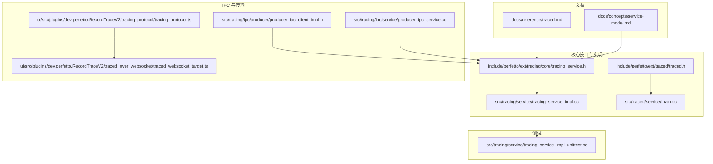

**图示来源**
- [traced.md:1-87](file://docs/reference/traced.md#L1-L87)
- [service-model.md:1-40](file://docs/concepts/service-model.md#L1-L40)
- [tracing_service.h:366-483](file://include/perfetto/ext/tracing/core/tracing_service.h#L366-L483)
- [tracing_service_impl.cc:149-160](file://src/tracing/service/tracing_service_impl.cc#L149-L160)
- [traced.h:20-27](file://include/perfetto/ext/traced/traced.h#L20-L27)
- [main.cc:20-22](file://src/traced/service/main.cc#L20-L22)
- [producer_ipc_client_impl.h:45-66](file://src/tracing/ipc/producer/producer_ipc_client_impl.h#L45-L66)
- [producer_ipc_service.cc:132-169](file://src/tracing/ipc/service/producer_ipc_service.cc#L132-L169)
- [tracing_protocol.ts:30-93](file://ui/src/plugins/dev.perfetto.RecordTraceV2/tracing_protocol/tracing_protocol.ts#L30-L93)
- [traced_websocket_target.ts:108-135](file://ui/src/plugins/dev.perfetto.RecordTraceV2/traced_over_websocket/traced_websocket_target.ts#L108-L135)
- [tracing_service_impl_unittest.cc:368-404](file://src/tracing/service/tracing_service_impl_unittest.cc#L368-L404)

**章节来源**
- [traced.md:1-87](file://docs/reference/traced.md#L1-L87)
- [service-model.md:1-40](file://docs/concepts/service-model.md#L1-L40)
- [tracing_service.h:366-483](file://include/perfetto/ext/tracing/core/tracing_service.h#L366-L483)
- [tracing_service_impl.cc:149-160](file://src/tracing/service/tracing_service_impl.cc#L149-L160)
- [traced.h:20-27](file://include/perfetto/ext/traced/traced.h#L20-L27)
- [main.cc:20-22](file://src/traced/service/main.cc#L20-L22)
- [producer_ipc_client_impl.h:45-66](file://src/tracing/ipc/producer/producer_ipc_client_impl.h#L45-L66)
- [producer_ipc_service.cc:132-169](file://src/tracing/ipc/service/producer_ipc_service.cc#L132-L169)
- [tracing_protocol.ts:30-93](file://ui/src/plugins/dev.perfetto.RecordTraceV2/tracing_protocol/tracing_protocol.ts#L30-L93)
- [traced_websocket_target.ts:108-135](file://ui/src/plugins/dev.perfetto.RecordTraceV2/traced_over_websocket/traced_websocket_target.ts#L108-L135)
- [tracing_service_impl_unittest.cc:368-404](file://src/tracing/service/tracing_service_impl_unittest.cc#L368-L404)

## 核心组件
- 追踪服务（TracingService）
  - 职责：维护生产者与数据源注册表、集中式缓冲区、会话多路复用、配置路由、数据安全汇聚。
  - 接口：ProducerEndpoint、ConsumerEndpoint、RelayEndpoint。
- 生产者（Producer）
  - 角色：提供数据源能力，通过共享内存缓冲区向服务提交 TracePacket，通过 IPC 通道进行控制交互。
- 消费者（Consumer）
  - 角色：发起/控制追踪会话，接收最终 Trace 数据，支持克隆、分离/附加、统计查询等。

关键接口与实现要点：
- ProducerEndpoint/ConsumerEndpoint 定义了生产者与消费者与服务交互的统一 API。
- ConnectProducer/ConnectConsumer 提供连接与生命周期管理。
- EnableTracing/StartTracing/DisableTracing/ReadBuffers 等构成完整的数据收集与缓冲区管理流程。
- 共享内存缓冲区与页面大小约束、页数必须为 2 的幂等规则确保高效与安全的数据搬运。

**章节来源**
- [tracing_service.h:52-155](file://include/perfetto/ext/tracing/core/tracing_service.h#L52-L155)
- [tracing_service.h:157-307](file://include/perfetto/ext/tracing/core/tracing_service.h#L157-L307)
- [tracing_service.h:356-483](file://include/perfetto/ext/tracing/core/tracing_service.h#L356-L483)
- [tracing_service_impl.cc:366-451](file://src/tracing/service/tracing_service_impl.cc#L366-L451)
- [tracing_service_impl.cc:495-510](file://src/tracing/service/tracing_service_impl.cc#L495-L510)
- [tracing_service_impl.cc:596-807](file://src/tracing/service/tracing_service_impl.cc#L596-L807)

## 架构总览
服务模型以“服务为中心”的三段式架构：
- 服务（Traced Service）：长驻守护进程，负责会话编排、缓冲区管理、注册表维护与数据汇聚。
- 生产者（Producer）：非受信客户端，按需提供数据源，通过专用共享内存与服务通信。
- 消费者（Consumer）：受信客户端，下发 TraceConfig 并读取最终 Trace 数据。

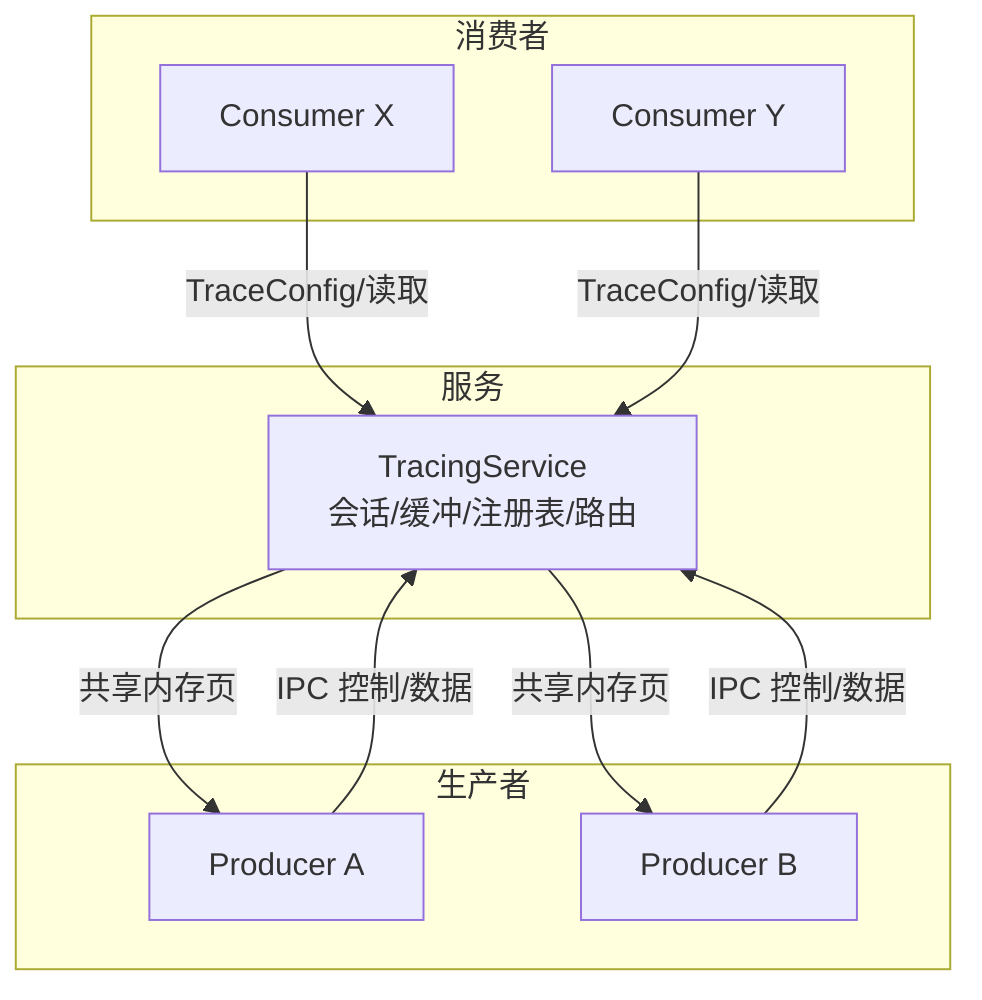

**图示来源**
- [service-model.md:5-40](file://docs/concepts/service-model.md#L5-L40)
- [tracing_service.h:52-155](file://include/perfetto/ext/tracing/core/tracing_service.h#L52-L155)
- [tracing_service.h:157-307](file://include/perfetto/ext/tracing/core/tracing_service.h#L157-L307)

## 详细组件分析

### 组件一：服务（TracingService）与端点
- ProducerEndpoint
  - 注册/更新/注销数据源、注册/注销 TraceWriter、CommitData、共享内存访问、Flush/Notify、触发器激活、同步屏障等。
- ConsumerEndpoint
  - EnableTracing/StartTracing/DisableTracing、变更配置、克隆会话、Flush、读取缓冲、分离/附加、统计查询、事件观察、状态查询、能力查询、保存 Bugreport。
- RelayEndpoint
  - 系统信息缓存、时钟快照同步、断开。

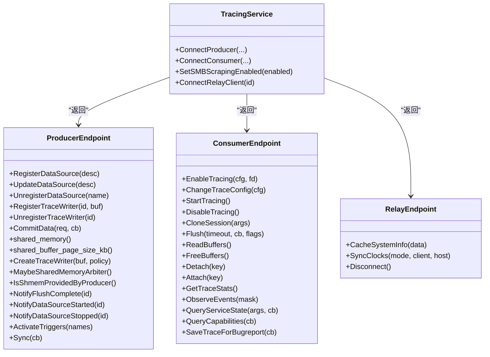

**图示来源**
- [tracing_service.h:52-155](file://include/perfetto/ext/tracing/core/tracing_service.h#L52-L155)
- [tracing_service.h:157-307](file://include/perfetto/ext/tracing/core/tracing_service.h#L157-L307)
- [tracing_service.h:334-354](file://include/perfetto/ext/tracing/core/tracing_service.h#L334-L354)

**章节来源**
- [tracing_service.h:52-155](file://include/perfetto/ext/tracing/core/tracing_service.h#L52-L155)
- [tracing_service.h:157-307](file://include/perfetto/ext/tracing/core/tracing_service.h#L157-L307)
- [tracing_service.h:334-354](file://include/perfetto/ext/tracing/core/tracing_service.h#L334-L354)

### 组件二：生产者端点与共享内存
- Producer 端点负责：
  - 注册数据源、更新/注销数据源描述；
  - CommitData 请求与回调，确保共享内存页变更被服务感知；
  - 访问共享内存缓冲区与页面大小；
  - 在进程内模式下创建 TraceWriter，直接写入共享内存；
  - Flush 完成通知、数据源启停通知、触发器激活、同步屏障。

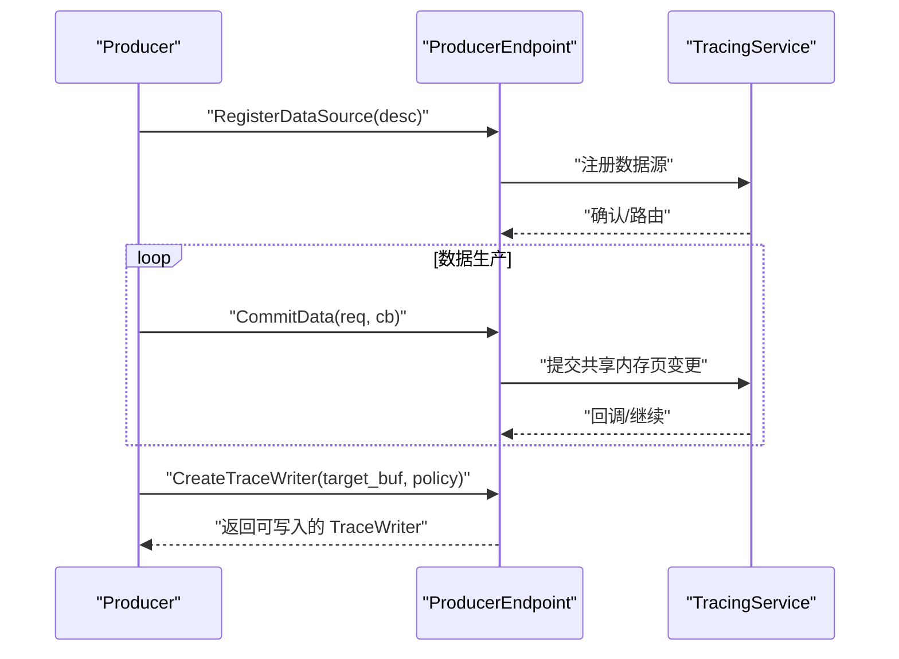

**图示来源**
- [tracing_service.h:67-96](file://include/perfetto/ext/tracing/core/tracing_service.h#L67-L96)
- [tracing_service.h:104-117](file://include/perfetto/ext/tracing/core/tracing_service.h#L104-L117)

**章节来源**
- [tracing_service.h:67-96](file://include/perfetto/ext/tracing/core/tracing_service.h#L67-L96)
- [tracing_service.h:104-117](file://include/perfetto/ext/tracing/core/tracing_service.h#L104-L117)

### 组件三：消费者端点与会话生命周期
- 消费者端点负责：
  - EnableTracing 下发 TraceConfig，支持延迟启动；
  - StartTracing 启动已配置的数据源；
  - DisableTracing 停止并释放缓冲；
  - ReadBuffers 拉取 Trace 数据；
  - CloneSession 克隆现有会话只读快照；
  - Flush 请求所有数据源立即刷新；
  - Detach/Attach 支持分离与附加；
  - QueryServiceState/QueryCapabilities 获取服务状态与能力；
  - SaveTraceForBugreport 保存 Bugreport。

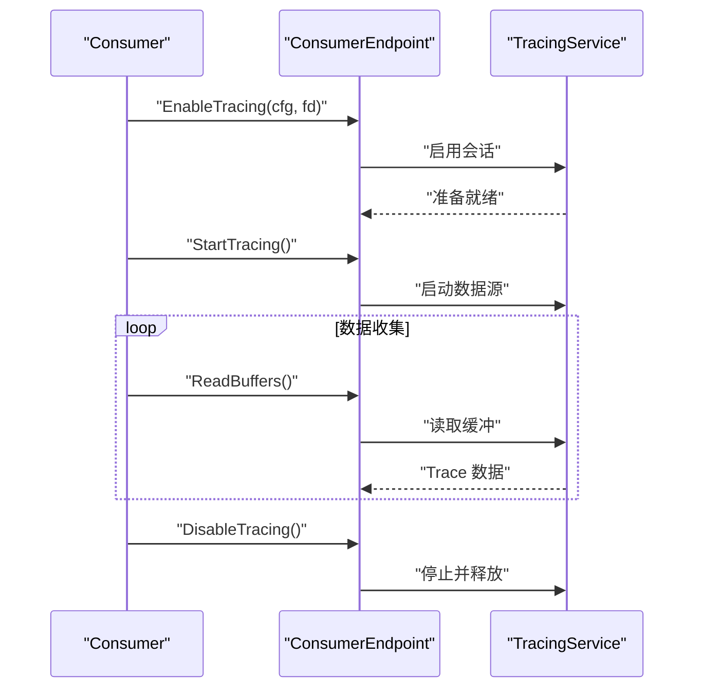

**图示来源**
- [tracing_service.h:168-190](file://include/perfetto/ext/tracing/core/tracing_service.h#L168-L190)
- [tracing_service.h:192-256](file://include/perfetto/ext/tracing/core/tracing_service.h#L192-L256)

**章节来源**
- [tracing_service.h:168-190](file://include/perfetto/ext/tracing/core/tracing_service.h#L168-L190)
- [tracing_service.h:192-256](file://include/perfetto/ext/tracing/core/tracing_service.h#L192-L256)

### 组件四：IPC 通道与传输层
- ProducerIPCClientImpl
  - 作为 Producer 侧的 Service 端点代理，桥接通用 Service 接口与实际 IPC 传输。
- ProducerIPCService
  - 服务侧处理 Producer 初始化、数据源注册、共享内存策略协商等。

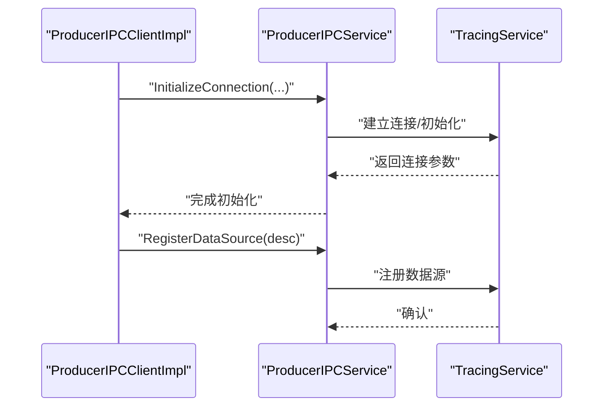

**图示来源**
- [producer_ipc_client_impl.h:45-66](file://src/tracing/ipc/producer/producer_ipc_client_impl.h#L45-L66)
- [producer_ipc_service.cc:132-169](file://src/tracing/ipc/service/producer_ipc_service.cc#L132-L169)

**章节来源**
- [producer_ipc_client_impl.h:45-66](file://src/tracing/ipc/producer/producer_ipc_client_impl.h#L45-L66)
- [producer_ipc_service.cc:132-169](file://src/tracing/ipc/service/producer_ipc_service.cc#L132-L169)

### 组件五：UI/WebSocket 集成（Chrome/前端）
- TracingProtocol
  - 通过字节流与 traced 的消费者端口通信，绑定服务后获取可用方法集。
- traced_websocket_target
  - 建立 WebSocket 连接，创建消费者 IPC 通道并启动追踪。

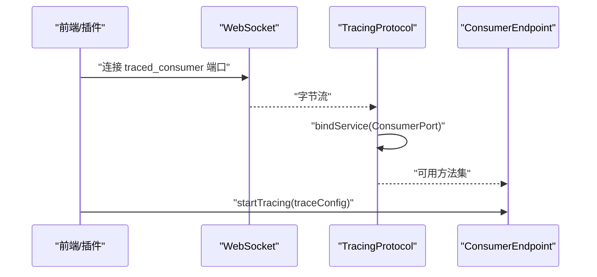

**图示来源**
- [tracing_protocol.ts:30-93](file://ui/src/plugins/dev.perfetto.RecordTraceV2/tracing_protocol/tracing_protocol.ts#L30-L93)
- [traced_websocket_target.ts:108-135](file://ui/src/plugins/dev.perfetto.RecordTraceV2/traced_over_websocket/traced_websocket_target.ts#L108-L135)

**章节来源**
- [tracing_protocol.ts:30-93](file://ui/src/plugins/dev.perfetto.RecordTraceV2/tracing_protocol/tracing_protocol.ts#L30-L93)
- [traced_websocket_target.ts:108-135](file://ui/src/plugins/dev.perfetto.RecordTraceV2/traced_over_websocket/traced_websocket_target.ts#L108-L135)

### 组件六：服务启动与守护
- traced.h 暴露 ServiceMain/RelayServiceMain/ProbesMain 等入口。
- src/traced/service/main.cc 将命令行参数转发给 ServiceMain。

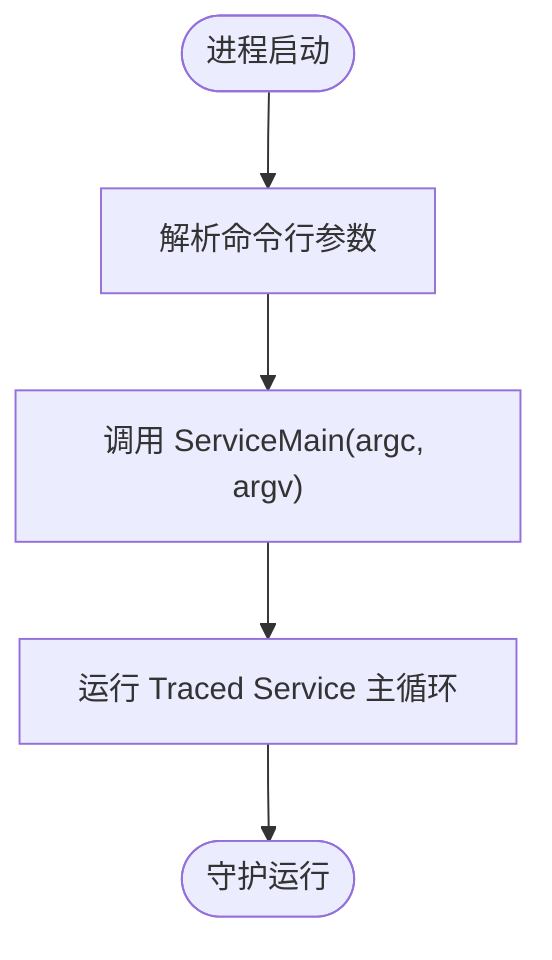

**图示来源**
- [traced.h:20-27](file://include/perfetto/ext/traced/traced.h#L20-L27)
- [main.cc:20-22](file://src/traced/service/main.cc#L20-L22)

**章节来源**
- [traced.h:20-27](file://include/perfetto/ext/traced/traced.h#L20-L27)
- [main.cc:20-22](file://src/traced/service/main.cc#L20-L22)

### 组件七：数据源与配置机制
- 数据源（Data Source）由生产者注册，描述名称、目标缓冲、是否通知启停等。
- TraceConfig 中包含数据源列表、缓冲区配置、触发器、写文件策略、保护栅栏等。
- 服务在 EnableTracing 时校验配置（如持续时间、缓冲大小、触发器合法性），并为每个数据源路由到对应生产者。

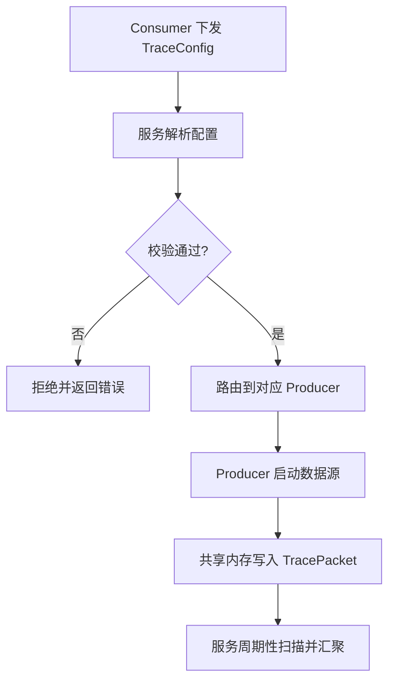

**图示来源**
- [tracing_service_impl.cc:596-807](file://src/tracing/service/tracing_service_impl.cc#L596-L807)
- [tracing_service.h:67-71](file://include/perfetto/ext/tracing/core/tracing_service.h#L67-L71)

**章节来源**
- [tracing_service_impl.cc:596-807](file://src/tracing/service/tracing_service_impl.cc#L596-L807)
- [tracing_service.h:67-71](file://include/perfetto/ext/tracing/core/tracing_service.h#L67-L71)

### 组件八：缓冲区管理与共享内存约束
- 共享内存页面大小必须为 4K 的倍数，且页数为 2 的幂；默认页大小与总大小有常量定义。
- 服务在 ConnectProducer 时可接受生产者提供的 SMB，若尺寸不合法则回退到服务分配。
- 服务负责将生产者共享内存中的有效包复制到集中式 TraceBuffer，并支持 SMB 抢抓（SMB Scraping）以回收未提交块。

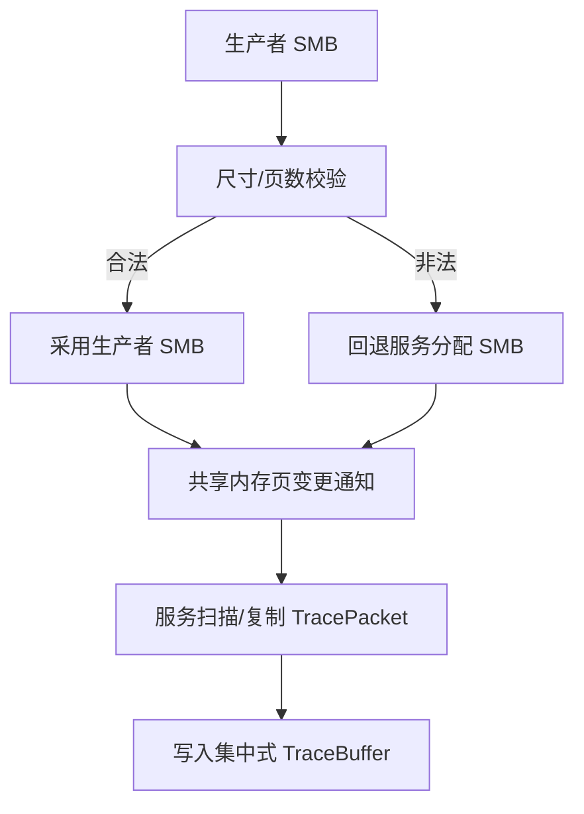

**图示来源**
- [tracing_service_impl.cc:223-262](file://src/tracing/service/tracing_service_impl.cc#L223-L262)
- [tracing_service_impl.cc:419-448](file://src/tracing/service/tracing_service_impl.cc#L419-L448)
- [tracing_service.h:374-375](file://include/perfetto/ext/tracing/core/tracing_service.h#L374-L375)

**章节来源**
- [tracing_service_impl.cc:223-262](file://src/tracing/service/tracing_service_impl.cc#L223-L262)
- [tracing_service_impl.cc:419-448](file://src/tracing/service/tracing_service_impl.cc#L419-L448)
- [tracing_service.h:374-375](file://include/perfetto/ext/tracing/core/tracing_service.h#L374-L375)

### 组件九：会话多路复用与并发控制
- 服务限制最大并发会话数量与每 UID 的并发上限，防止资源滥用。
- 支持按 UID 与特殊 UID（如 statsd）差异化配额。
- 支持锁定模式（lockdown_mode）仅允许当前用户连接。

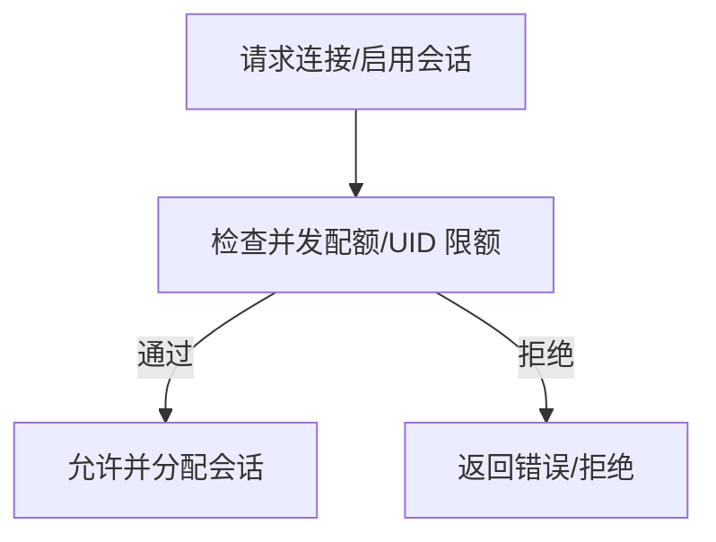

**图示来源**
- [tracing_service_impl.cc:164-175](file://src/tracing/service/tracing_service_impl.cc#L164-L175)
- [tracing_service_impl.cc:379-384](file://src/tracing/service/tracing_service_impl.cc#L379-L384)

**章节来源**
- [tracing_service_impl.cc:164-175](file://src/tracing/service/tracing_service_impl.cc#L164-L175)
- [tracing_service_impl.cc:379-384](file://src/tracing/service/tracing_service_impl.cc#L379-L384)

### 组件十：注册表管理与状态查询
- 服务维护生产者与数据源注册表，消费者可通过 QueryServiceState 查询当前状态。
- 单元测试验证注册与注销行为及服务状态一致性。

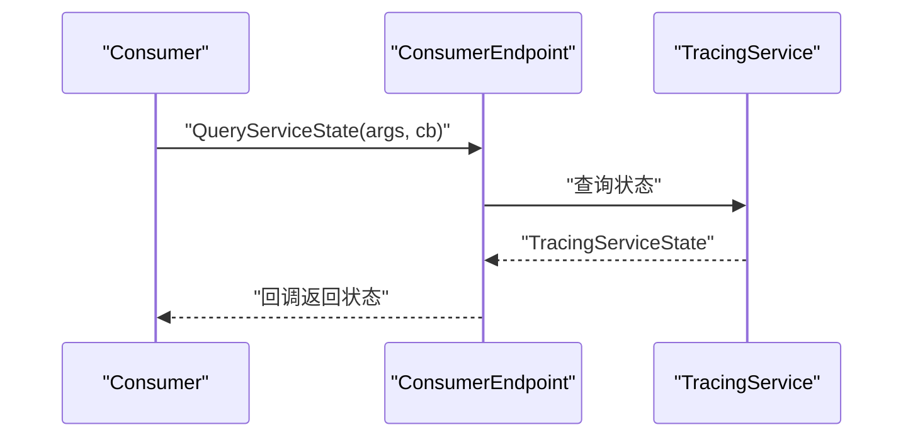

**图示来源**
- [tracing_service.h:277-286](file://include/perfetto/ext/tracing/core/tracing_service.h#L277-L286)
- [tracing_service_impl_unittest.cc:391-404](file://src/tracing/service/tracing_service_impl_unittest.cc#L391-L404)

**章节来源**
- [tracing_service.h:277-286](file://include/perfetto/ext/tracing/core/tracing_service.h#L277-L286)
- [tracing_service_impl_unittest.cc:391-404](file://src/tracing/service/tracing_service_impl_unittest.cc#L391-L404)

## 依赖关系分析
- 组件耦合与内聚
  - TracingService 对外暴露统一接口，ProducerEndpoint/ConsumerEndpoint/RelayEndpoint 作为端点隔离具体传输细节。
  - Producer 与 Consumer 通过服务解耦，彼此无需感知对方存在。
- 外部依赖与集成点
  - IPC 层（UNIX 套接字/WebSocket）承载低频控制信号与方法绑定。
  - 共享内存用于高频数据传输，服务负责安全汇聚。
- 可能的循环依赖
  - 通过端点抽象避免直接耦合，降低循环依赖风险。

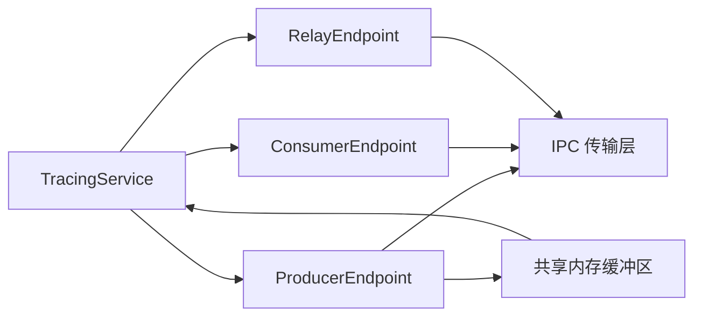

**图示来源**
- [tracing_service.h:52-155](file://include/perfetto/ext/tracing/core/tracing_service.h#L52-L155)
- [tracing_service.h:157-307](file://include/perfetto/ext/tracing/core/tracing_service.h#L157-L307)
- [tracing_service.h:334-354](file://include/perfetto/ext/tracing/core/tracing_service.h#L334-L354)

**章节来源**
- [tracing_service.h:52-155](file://include/perfetto/ext/tracing/core/tracing_service.h#L52-L155)
- [tracing_service.h:157-307](file://include/perfetto/ext/tracing/core/tracing_service.h#L157-L307)
- [tracing_service.h:334-354](file://include/perfetto/ext/tracing/core/tracing_service.h#L334-L354)

## 性能考量
- 共享内存页大小与页数约束（4K 倍数、2 的幂）减少碎片与提高拷贝效率。
- SMB 抢抓（SMB Scraping）在 Flush/断开/禁用会话时回收未提交块，提升鲁棒性。
- 保护栅栏（guardrails）限制缓冲大小与持续时间，避免资源耗尽。
- 写文件周期与快照间隔可配置，平衡 I/O 压力与数据完整性。

[本节为通用指导，无需特定文件来源]

## 故障排查指南
- 常见错误与定位
  - 配置校验失败：持续时间超限、缓冲大小非法、触发器配置不合法、重复触发器名等。
  - 并发配额不足：超过最大并发会话或每 UID 上限。
  - 共享内存尺寸不合法：页大小/页数不符合约束，服务回退分配。
  - 连接被拒绝：锁定模式仅允许当前用户，或生产者过多。
- 建议排查步骤
  - 检查 TraceConfig 合法性与保护栅栏设置。
  - 查看服务日志与状态查询结果。
  - 验证共享内存页大小与页数是否满足约束。
  - 使用单元测试样例验证注册/注销与状态一致性。

**章节来源**
- [tracing_service_impl.cc:631-752](file://src/tracing/service/tracing_service_impl.cc#L631-L752)
- [tracing_service_impl.cc:164-175](file://src/tracing/service/tracing_service_impl.cc#L164-L175)
- [tracing_service_impl.cc:223-262](file://src/tracing/service/tracing_service_impl.cc#L223-L262)
- [tracing_service_impl.cc:379-384](file://src/tracing/service/tracing_service_impl.cc#L379-L384)
- [tracing_service_impl_unittest.cc:391-404](file://src/tracing/service/tracing_service_impl_unittest.cc#L391-L404)

## 结论
Perfetto 的服务模型通过“服务中心”实现生产者与消费者的完全解耦：生产者专注数据源与共享内存写入，消费者专注配置与数据消费，服务负责会话编排、缓冲区管理与安全汇聚。该设计在 Android/Linux/Chrome 等多平台具备良好扩展性与安全性，配合严格的配置校验与保护栅栏，确保大规模环境下的稳定性与可靠性。

[本节为总结，无需特定文件来源]

## 附录

### A. Chrome 环境集成要点
- 使用 WebSocket 或本地套接字与 traced 通信，绑定消费者端口后发起 TraceConfig。
- 在进程内模式下，生产者可直接创建 TraceWriter 写入共享内存，减少 IPC 开销。
- 启动前可提供生产者 SMB（需满足页大小与页数约束），实现启动时采样。

**章节来源**
- [tracing_protocol.ts:30-93](file://ui/src/plugins/dev.perfetto.RecordTraceV2/tracing_protocol/tracing_protocol.ts#L30-L93)
- [tracing_service.h:423-436](file://include/perfetto/ext/tracing/core/tracing_service.h#L423-L436)

### B. Android 环境集成要点
- traced 作为系统守护进程随系统启动，提供全局追踪能力。
- traced_probes 等生产者通过 IPC 注册数据源，服务根据 TraceConfig 路由到相应生产者。
- 输出文件路径在 Android 上受 SELinux 约束，需位于允许目录。

**章节来源**
- [traced.md:15-16](file://docs/reference/traced.md#L15-L16)
- [traced.md:28-30](file://docs/reference/traced.md#L28-L30)
- [tracing_service_impl.cc:278-307](file://src/tracing/service/tracing_service_impl.cc#L278-L307)

### C. 端到端流程（服务启动 → 配置下发 → 数据收集 → 缓冲区管理）
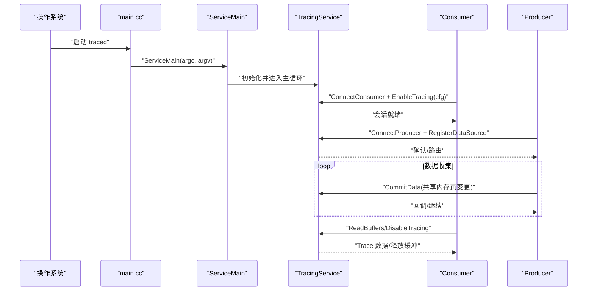

**图示来源**
- [main.cc:20-22](file://src/traced/service/main.cc#L20-L22)
- [traced.h:20-27](file://include/perfetto/ext/traced/traced.h#L20-L27)
- [tracing_service.h:453-460](file://include/perfetto/ext/tracing/core/tracing_service.h#L453-L460)
- [tracing_service.h:400-451](file://include/perfetto/ext/tracing/core/tracing_service.h#L400-L451)
- [tracing_service.h:168-190](file://include/perfetto/ext/tracing/core/tracing_service.h#L168-L190)
- [tracing_service_impl.cc:596-807](file://src/tracing/service/tracing_service_impl.cc#L596-L807)