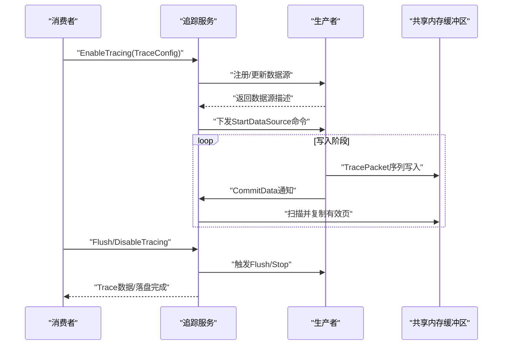
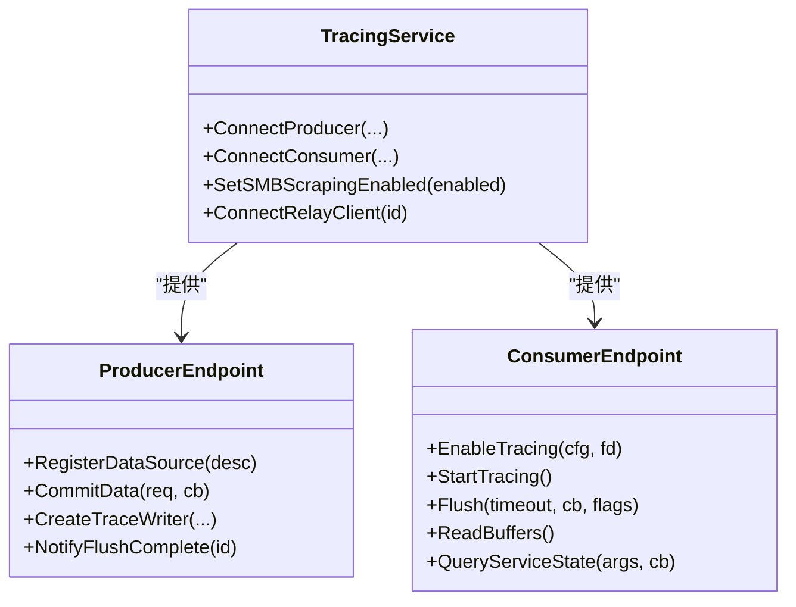
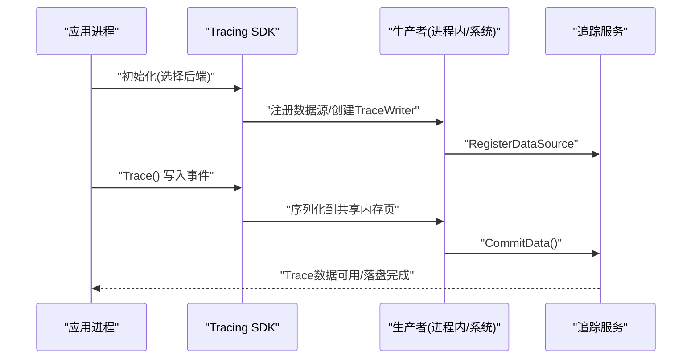
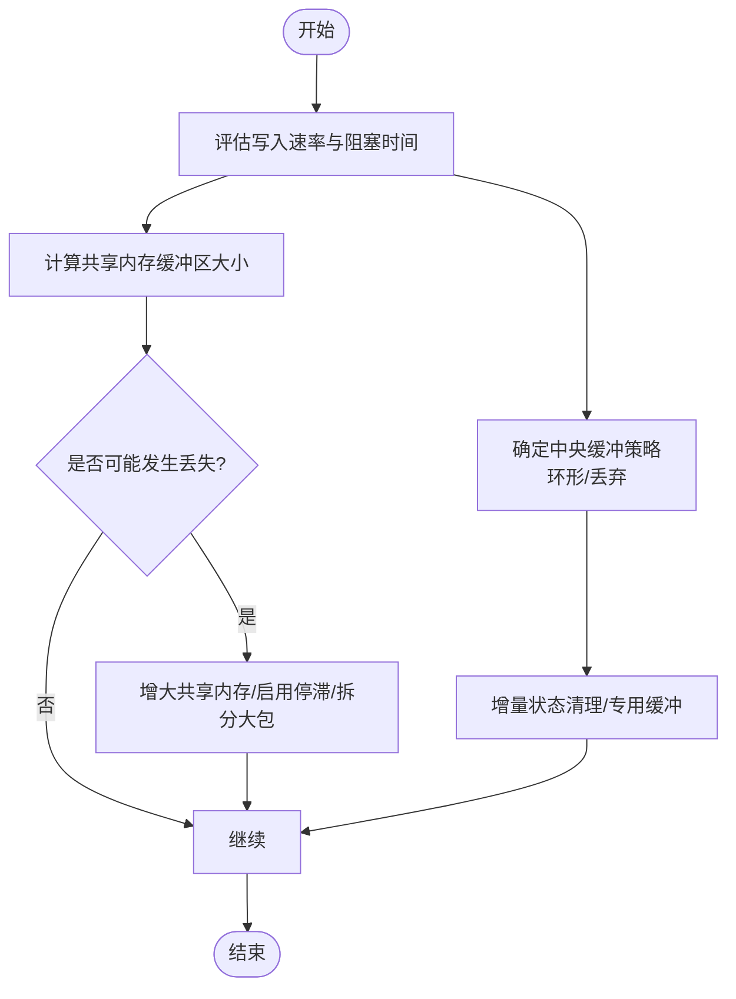
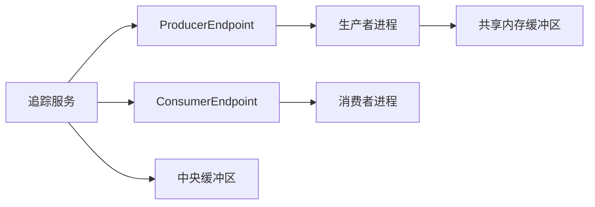

# 核心架构

<cite>
**本文引用的文件**
- [README.md](file://README.md)
- [service-model.md](file://docs/concepts/service-model.md)
- [buffers.md](file://docs/concepts/buffers.md)
- [traced.md](file://docs/reference/traced.md)
- [traced_probes.md](file://docs/reference/traced_probes.md)
- [tracing-sdk.md](file://docs/instrumentation/tracing-sdk.md)
- [security-model.md](file://docs/design-docs/security-model.md)
- [detached-mode.md](file://docs/concepts/detached-mode.md)
- [tracing_service.h](file://include/perfetto/ext/tracing/core/tracing_service.h)
</cite>

## 目录
1. [引言](#引言)
2. [项目结构](#项目结构)
3. [核心组件](#核心组件)
4. [架构总览](#架构总览)
5. [详细组件分析](#详细组件分析)
6. [依赖关系分析](#依赖关系分析)
7. [性能考量](#性能考量)
8. [故障排查指南](#故障排查指南)
9. [结论](#结论)
10. [附录](#附录)

## 引言
本文件面向Perfetto的核心架构，聚焦于服务模型、组件交互与数据流，系统化阐述追踪服务（Traced Service）的设计与实现要点，覆盖会话管理、缓冲区与内存策略、数据源注册与管理、IPC通信机制、安全隔离与权限控制，并给出架构图与组件分解，帮助读者在工程实践中高效落地与优化。

## 项目结构
Perfetto是一个多组件协同的系统，围绕“服务端守护进程 + 多生产者 + 多消费者”的架构展开。核心概念与职责如下：
- 服务端守护进程：负责会话编排、缓冲区管理、数据汇聚与安全隔离。
- 生产者：非可信实体，提供各类数据源（如内核探针、应用自定义事件等），通过共享内存缓冲区向服务端提交TracePacket。
- 消费者：可信实体，发起配置、启动/停止会话、读取或落盘Trace数据。
- 数据源：由生产者暴露的能力单元，定义协议化的TracePacket结构与配置项。
- IPC通道：用于握手、配置下发、启停控制等低频控制面；高吞吐写入通过共享内存完成。

章节来源
- [service-model.md:1-119](file://docs/concepts/service-model.md#L1-L119)
- [traced.md:18-58](file://docs/reference/traced.md#L18-L58)

## 核心组件
- 追踪服务（TracingService）
  - 负责生产者注册与数据源目录维护、会话调度与路由、缓冲区分配与回收、数据汇聚与安全隔离。
  - 提供ProducerEndpoint/ConsumerEndpoint接口以适配不同嵌入场景（本地或IPC）。
- 生产者（Producer）
  - 每个生产者拥有独立的共享内存缓冲区，按TracePacket序列写入，支持多数据源共享同一缓冲区。
  - 通过CommitData等回调将已写入页通知服务端复制到中心缓冲区。
- 消费者（Consumer）
  - 发送TraceConfig，启用/停止会话，读取或落盘Trace数据，查询服务状态与能力。
- 数据源（Data Source）
  - 由生产者声明，定义TracePacket结构与配置，可被多个生产者同时暴露。
- 缓冲区体系
  - 共享内存缓冲区（每生产者1份）：零拷贝与解耦写入/读取。
  - 中央缓冲区（按会话配置划分）：最终聚合与持久化目标。
  - ftrace缓冲区（可选，按CPU维度）：内核侧临时缓冲，周期性由探针进程搬运。

章节来源
- [tracing_service.h:366-483](file://include/perfetto/ext/tracing/core/tracing_service.h#L366-L483)
- [buffers.md:23-74](file://docs/concepts/buffers.md#L23-L74)
- [service-model.md:18-119](file://docs/concepts/service-model.md#L18-L119)

## 架构总览
下图展示服务端、生产者与消费者之间的交互路径，以及共享内存与中央缓冲区的数据流。

图表来源
- [tracing_service.h:164-307](file://include/perfetto/ext/tracing/core/tracing_service.h#L164-L307)
- [buffers.md:75-98](file://docs/concepts/buffers.md#L75-L98)

章节来源
- [tracing_service.h:400-461](file://include/perfetto/ext/tracing/core/tracing_service.h#L400-L461)
- [buffers.md:27-74](file://docs/concepts/buffers.md#L27-L74)

## 详细组件分析

### 追踪服务（Traced Service）架构
- 会话管理
  - 支持多会话并发，按TraceConfig进行动态路由与目标缓冲映射。
  - 支持延迟启动（deferred_start）、克隆会话（CloneSession）与附加/分离（Attach/Detach）。
- 缓冲区管理
  - 中央缓冲区大小与填充策略（环形/丢弃）由TraceConfig决定。
  - 共享内存缓冲区默认页大小与总大小有约定，避免跨生产者共享，确保隔离。
- IPC通信机制
  - 控制面使用UNIX域套接字（POSIX）或嵌入方自定义传输（如Chromium的Mojo）。
  - 高频写入不走IPC，通过共享内存实现低开销。
- 安全与权限
  - 生产者非可信，服务端对所有输入进行严格校验；服务最小化系统调用面，运行在受限账户。
  - 通过UNIX Socket权限与SELinux策略限制消费者接入。

图表来源
- [tracing_service.h:366-483](file://include/perfetto/ext/tracing/core/tracing_service.h#L366-L483)

章节来源
- [traced.md:18-114](file://docs/reference/traced.md#L18-L114)
- [service-model.md:76-119](file://docs/concepts/service-model.md#L76-L119)
- [security-model.md:10-60](file://docs/design-docs/security-model.md#L10-L60)

### 追踪SDK与服务协作模式
- SDK模式
  - In-Process模式：完全在进程内生成Trace，适合仅采集应用自身事件。
  - System模式：连接系统traced服务，融合系统事件（如ftrace、syscalls）。
- 数据源注册与管理
  - 应用侧通过DataSource派生类注册自定义数据源；服务端通过ProducerEndpoint接收注册/更新/注销请求。
  - 数据源配置在TraceConfig中声明，服务端按需下发Start/Stop。
- 写入路径
  - SDK通过TraceWriter将事件序列化到共享内存页，随后CommitData通知服务端复制。

图表来源
- [tracing-sdk.md:269-419](file://docs/instrumentation/tracing-sdk.md#L269-L419)
- [tracing_service.h:58-155](file://include/perfetto/ext/tracing/core/tracing_service.h#L58-L155)

章节来源
- [tracing-sdk.md:107-274](file://docs/instrumentation/tracing-sdk.md#L107-L274)
- [tracing_service.h:440-461](file://include/perfetto/ext/tracing/core/tracing_service.h#L440-L461)

### 缓冲区策略、内存管理与数据保留
- 共享内存缓冲区
  - 默认页大小与总大小有约定；按CPU阻塞时间与峰值写入速率估算容量，避免丢失。
  - 支持突发写入时采用“停滞”策略或拆分大包，降低丢失风险。
- 中央缓冲区
  - 环形缓冲（RING_BUFFER）与丢弃策略（DISCARD）两种填充策略；可通过增量状态清理与专用缓冲降低关键上下文丢失影响。
- ftrace缓冲区
  - 按CPU维度的内核缓冲，周期性由探针进程搬运至用户态，需根据drain周期与缓冲大小平衡丢失风险。
- 数据保留与窗口化导入
  - 长Trace建议设置flush周期，避免极长时间跨度导致UI/解析器异常；必要时使用全量排序选项。

图表来源
- [buffers.md:100-179](file://docs/concepts/buffers.md#L100-L179)
- [buffers.md:238-299](file://docs/concepts/buffers.md#L238-L299)

章节来源
- [buffers.md:100-299](file://docs/concepts/buffers.md#L100-L299)

### 安全隔离与权限控制
- 生产者非可信：服务端对输入进行严格校验，最小化系统调用面，运行在受限账户，避免横向攻击面。
- 共享内存隔离：生产者间不共享内存，防止信息泄露；服务端不与消费者共享生产者内存。
- 消费者信任：消费者可DoS但不应越权；通过UNIX Socket权限与SELinux策略限制接入。
- 证据链与溯源：服务端为TracePacket附加生产者UID，便于离线审计与溯源。

章节来源
- [security-model.md:10-60](file://docs/design-docs/security-model.md#L10-L60)

### 系统边界、集成模式与技术权衡
- 系统边界
  - 生产者与消费者通过服务端中转，形成清晰的控制面与数据面分离。
- 集成模式
  - 嵌入方可替换IPC传输（如Mojo），或在单进程内短路调用，以满足不同平台与性能需求。
- 技术权衡
  - 低开销写入优先：共享内存零拷贝与异步复制，牺牲实时读取以换取写入吞吐。
  - 可观测性与可诊断：通过统计字段与TraceProcessor SQL定位丢失与乱序问题。

章节来源
- [service-model.md:76-91](file://docs/concepts/service-model.md#L76-L91)
- [buffers.md:361-414](file://docs/concepts/buffers.md#L361-L414)

## 依赖关系分析
- 组件耦合
  - 服务端与生产者/消费者通过Endpoint接口解耦，支持本地或IPC两种形态。
  - 生产者内部可承载多个数据源，但共享同一共享内存缓冲区。
- 外部依赖
  - IPC层可替换为嵌入方自定义传输（如Mojo）。
  - 在Android/Linux上通过UNIX域套接字与权限策略实现接入控制。

图表来源
- [tracing_service.h:366-483](file://include/perfetto/ext/tracing/core/tracing_service.h#L366-L483)

章节来源
- [tracing_service.h:366-483](file://include/perfetto/ext/tracing/core/tracing_service.h#L366-L483)

## 性能考量
- 写入路径优化
  - 使用共享内存零拷贝，减少锁竞争与上下文切换。
  - 合理设置共享内存大小与写入速率上限，避免阻塞导致的丢失。
- 读取与落盘
  - 流式模式下需保证中央缓冲足以容纳两次文件写周期的数据量。
  - 长Trace建议定期Flush，避免窗口化导入失败与UI异常。
- 并发与顺序
  - 不同数据源/生产者的包无全局时序保证，但单序列内包有序且原子，有助于解析一致性。

章节来源
- [buffers.md:100-179](file://docs/concepts/buffers.md#L100-L179)
- [buffers.md:267-300](file://docs/concepts/buffers.md#L267-L300)

## 故障排查指南
- 数据丢失定位
  - ftrace内核缓冲丢失：检查FtraceCpuStats与SQL统计表中的overrun字段。
  - 共享内存丢失：检查TraceStats.BufferStats.trace_writer_packet_loss与首包标记。
  - 中央缓冲丢失：区分环形覆盖与丢弃策略，查看chunks_overwritten/chunks_discarded。
- 导入异常
  - 长Trace乱序：设置flush周期或使用全量排序选项。
- 会话生命周期
  - 长期后台采集：使用detached/attach模式，结合write_into_file与定时停止。

章节来源
- [buffers.md:180-266](file://docs/concepts/buffers.md#L180-L266)
- [detached-mode.md:1-175](file://docs/concepts/detached-mode.md#L1-L175)

## 结论
Perfetto以服务端为中心的三方模型实现了高扩展、低开销与强隔离的追踪体系。通过共享内存写入与中央缓冲聚合，兼顾了高频写入与最终一致性；通过严格的生产者隔离与消费者信任模型，保障了系统安全与可审计性。在工程实践中，应重点关注缓冲区容量规划、Flush策略与导入参数配置，以获得稳定可靠的追踪体验。

## 附录
- 关键参考
  - 服务模型与IPC、共享内存规范参见服务模型与缓冲区文档。
  - 追踪服务公共API接口定义参见头文件。
  - 系统守护进程与探针进程职责参见参考手册。

章节来源
- [service-model.md:1-119](file://docs/concepts/service-model.md#L1-L119)
- [buffers.md:1-423](file://docs/concepts/buffers.md#L1-L423)
- [tracing_service.h:1-488](file://include/perfetto/ext/tracing/core/tracing_service.h#L1-L488)
- [traced.md:1-114](file://docs/reference/traced.md#L1-L114)
- [traced_probes.md:1-464](file://docs/reference/traced_probes.md#L1-L464)
- [tracing-sdk.md:1-419](file://docs/instrumentation/tracing-sdk.md#L1-L419)
- [security-model.md:1-60](file://docs/design-docs/security-model.md#L1-L60)
- [detached-mode.md:1-175](file://docs/concepts/detached-mode.md#L1-L175)
- [README.md:1-101](file://README.md#L1-L101)