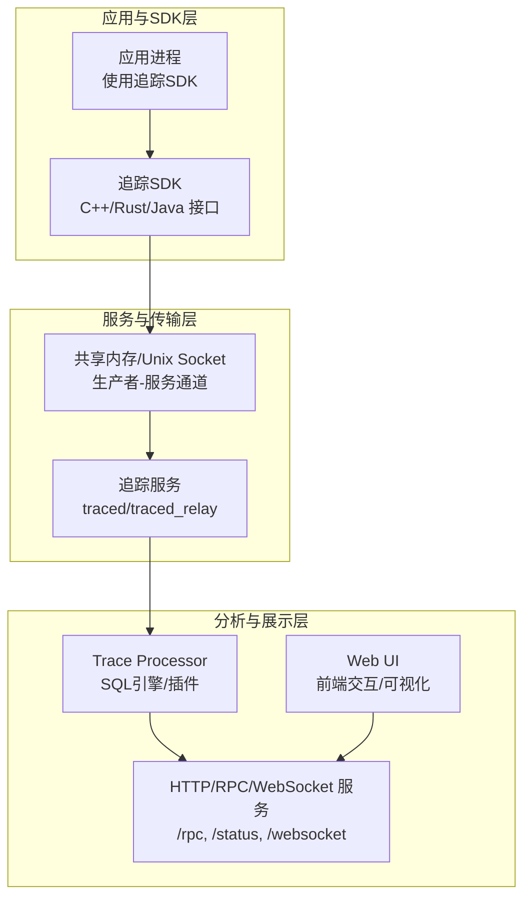
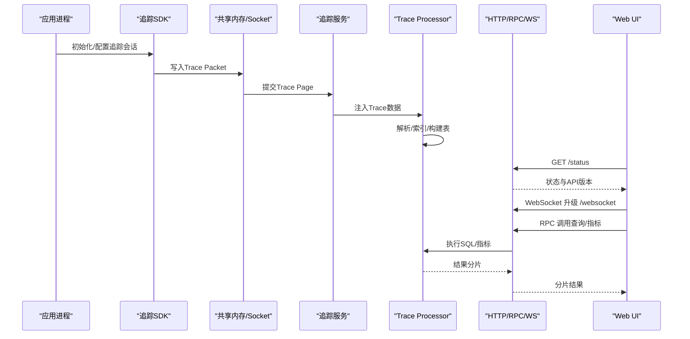
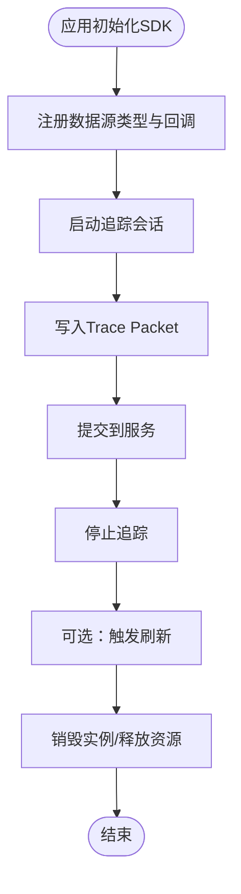
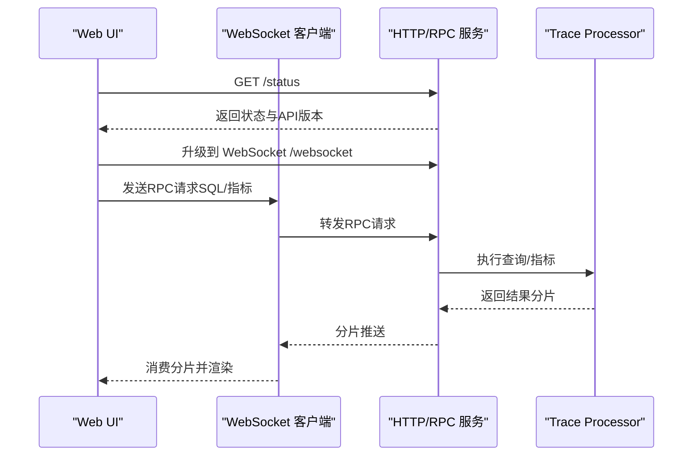
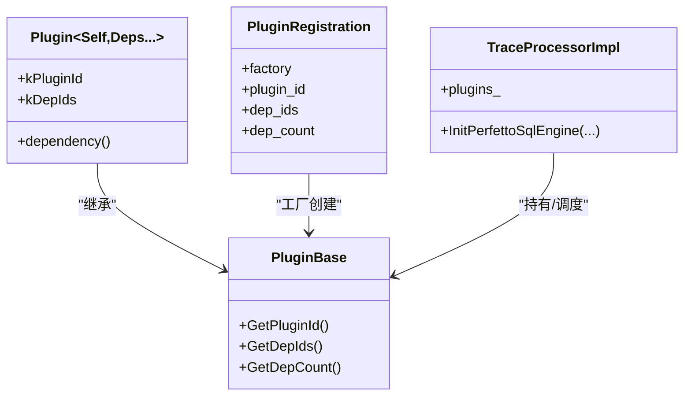

# 组件交互模式

<cite>
**本文引用的文件**
- [README.md](file://README.md)
- [tracing.h](file://include/perfetto/tracing.h)
- [data_source_abi.h](file://include/perfetto/public/abi/data_source_abi.h)
- [producer_abi.h](file://include/perfetto/public/abi/producer_abi.h)
- [trace_processor_impl.h](file://src/trace_processor/trace_processor_impl.h)
- [plugin.h](file://src/trace_processor/core/plugin/plugin.h)
- [plugin.cc](file://src/trace_processor/core/plugin/plugin.cc)
- [http_server.cc](file://src/base/http/http_server.cc)
- [httpd.cc](file://src/trace_processor/rpc/httpd.cc)
- [trace_processor.proto](file://protos/perfetto/trace_processor/trace_processor.proto)
- [rpc_http_dialog.ts](file://ui/src/frontend/rpc_http_dialog.ts)
- [async_websocket.ts](file://ui/src/plugins/dev.perfetto.RecordTraceV2/websocket/async_websocket.ts)
- [websocket_stream.ts](file://ui/src/plugins/dev.perfetto.RecordTraceV2/websocket/websocket_stream.ts)
- [wdp_websocket_stream .ts](file://ui/src/plugins/dev.perfetto.RecordTraceV2/adb/web_device_proxy/wdp_websocket_stream .ts)
- [trace_processor_shell.rs](file://contrib/rust-sdk/perfetto-protos-trace-processor/examples/trace_processor_shell.rs)
</cite>

## 目录
1. [引言](#引言)
2. [项目结构](#项目结构)
3. [核心组件](#核心组件)
4. [架构总览](#架构总览)
5. [组件详解](#组件详解)
6. [依赖关系分析](#依赖关系分析)
7. [性能考量](#性能考量)
8. [故障排查指南](#故障排查指南)
9. [结论](#结论)
10. [附录](#附录)

## 引言
本文件面向Perfetto在多平台（Android、Linux、Chrome）下的组件交互与集成，系统化梳理追踪SDK与追踪服务、Trace Processor与Web UI之间的接口、协议与通信机制；阐述插件架构与扩展点；说明版本兼容性管理与API演进策略；并给出生命周期管理、状态同步与错误传播机制的最佳实践。

## 项目结构
Perfetto由多个子系统协同工作：追踪SDK（用户态低开销API）、追踪服务（收集与汇聚）、Trace Processor（SQL分析引擎）、Web UI（可视化与交互）、以及跨平台工具链与协议栈。下图概览了主要模块及其职责边界：

图表来源
- [README.md:12-31](file://README.md#L12-L31)
- [tracing.h:20-41](file://include/perfetto/tracing.h#L20-L41)
- [httpd.cc:53-71](file://src/trace_processor/rpc/httpd.cc#L53-L71)

章节来源
- [README.md:12-31](file://README.md#L12-L31)
- [tracing.h:20-41](file://include/perfetto/tracing.h#L20-L41)

## 核心组件
- 追踪SDK：提供低开销的用户态追踪API，支持自定义数据源、跟踪事件、缓冲区策略等。
- 追踪服务：负责接收来自SDK的数据包，进行缓冲、聚合与持久化，同时作为RPC/WS入口供Trace Processor与UI访问。
- Trace Processor：解析Trace、构建SQLite/内部存储，并通过SQL与指标系统提供查询能力。
- Web UI：通过HTTP/RPC与WebSocket与Trace Processor交互，实现可视化与分析。
- 插件体系：Trace Processor支持以插件形式注册静态表、函数与度量，形成可扩展的分析生态。

章节来源
- [README.md:12-31](file://README.md#L12-L31)
- [trace_processor_impl.h:51-100](file://src/trace_processor/trace_processor_impl.h#L51-L100)

## 架构总览
下图展示了从应用侧到UI侧的端到端交互路径，包括SDK调用、服务中转、Trace Processor处理与UI展示的关键节点与消息流。

图表来源
- [httpd.cc:149-158](file://src/trace_processor/rpc/httpd.cc#L149-L158)
- [httpd.cc:261-266](file://src/trace_processor/rpc/httpd.cc#L261-L266)
- [rpc_http_dialog.ts:85-100](file://ui/src/frontend/rpc_http_dialog.ts#L85-L100)

## 组件详解

### 追踪SDK与追踪服务的集成模式
- SDK接口与ABI
  - 数据源ABI：定义数据源类型、实例生命周期回调（设置/启动/停止/销毁/刷新）、线程局部状态与增量状态、缓冲耗尽策略等。
  - 生产者ABI：提供系统/进程内初始化、触发器激活等接口。
  - SDK头文件聚合：统一对外头文件，便于嵌入式工程按需包含。
- 集成流程
  - 应用通过SDK初始化追踪会话，注册数据源类型与回调。
  - SDK通过共享内存或Unix Socket将Trace Packet写入服务。
  - 服务接收后进入Trace Processor进行解析与索引。
- 回调机制
  - OnSetup/OnStart/OnStop/OnDestroy/OnFlush等回调贯穿数据源生命周期，支持异步停止/刷新。
  - 缓冲耗尽策略可配置为丢弃、停顿后丢弃或停顿后中止，避免阻塞。

图表来源
- [data_source_abi.h:47-278](file://include/perfetto/public/abi/data_source_abi.h#L47-L278)
- [producer_abi.h:49-80](file://include/perfetto/public/abi/producer_abi.h#L49-L80)
- [tracing.h:20-41](file://include/perfetto/tracing.h#L20-L41)

章节来源
- [data_source_abi.h:47-278](file://include/perfetto/public/abi/data_source_abi.h#L47-L278)
- [producer_abi.h:49-80](file://include/perfetto/public/abi/producer_abi.h#L49-L80)
- [tracing.h:20-41](file://include/perfetto/tracing.h#L20-L41)

### Trace Processor与Web UI的交互协议
- HTTP/RPC/WS服务
  - /status：返回Trace Processor状态与API版本。
  - /rpc：基于分块传输的单端点RPC，兼容Python API。
  - /websocket：WebSocket升级，用于UI实时RPC调用与分片回传。
- WebSocket通信细节
  - 前端提供AsyncWebsocket封装，支持await风格的顺序调用与字节流等待。
  - WebSocketStream直接桥接浏览器WebSocket，按二进制帧传递。
  - 设备代理场景（如ADB）使用专用WebSocket流，对二进制帧进行透明解码。
- 协议与数据交换
  - 请求/响应采用Protobuf消息体，通过HTTP头部与分片传输。
  - UI与本地加速器之间存在API版本校验，不匹配时提示更新或降级。

图表来源
- [httpd.cc:149-158](file://src/trace_processor/rpc/httpd.cc#L149-L158)
- [httpd.cc:261-266](file://src/trace_processor/rpc/httpd.cc#L261-L266)
- [async_websocket.ts:32-101](file://ui/src/plugins/dev.perfetto.RecordTraceV2/websocket/async_websocket.ts#L32-L101)
- [websocket_stream.ts:18-40](file://ui/src/plugins/dev.perfetto.RecordTraceV2/websocket/websocket_stream.ts#L18-L40)
- [wdp_websocket_stream .ts:33-62](file://ui/src/plugins/dev.perfetto.RecordTraceV2/adb/web_device_proxy/wdp_websocket_stream .ts#L33-L62)

章节来源
- [httpd.cc:53-71](file://src/trace_processor/rpc/httpd.cc#L53-L71)
- [httpd.cc:149-158](file://src/trace_processor/rpc/httpd.cc#L149-L158)
- [httpd.cc:261-266](file://src/trace_processor/rpc/httpd.cc#L261-L266)
- [async_websocket.ts:32-101](file://ui/src/plugins/dev.perfetto.RecordTraceV2/websocket/async_websocket.ts#L32-L101)
- [websocket_stream.ts:18-40](file://ui/src/plugins/dev.perfetto.RecordTraceV2/websocket/websocket_stream.ts#L18-L40)
- [wdp_websocket_stream .ts:33-62](file://ui/src/plugins/dev.perfetto.RecordTraceV2/adb/web_device_proxy/wdp_websocket_stream .ts#L33-L62)

### 不同平台（Android/Linux/Chrome）下的适配与集成策略
- Android
  - 使用系统级追踪服务与HAL桥接，结合StatsD/Health HAL等实现平台级探针。
  - SDK通过JNI与Java绑定，支持应用内追踪与系统Wide采集。
- Linux
  - 通过ftrace、perf、CPU采样等内核探针与用户态SDK结合，支持系统级与应用级追踪。
- Chrome
  - 作为默认追踪后端，与chrome://tracing深度集成，支持Web UI与DevTools联动。

章节来源
- [README.md:37-56](file://README.md#L37-L56)

### 插件架构与扩展机制
- 插件注册与依赖
  - 插件以模板类声明依赖，运行时按拓扑排序装配，确保依赖先于被依赖加载。
  - 通过全局注册表维护工厂与依赖索引，构建可解析的插件集合。
- Trace Processor中的插件化
  - TraceProcessorImpl持有插件列表，参与SQL引擎初始化、静态表与函数注册等阶段。
  - 支持度量包、SQL包与指标描述符的动态注册，形成可扩展的分析能力。

图表来源
- [plugin.h:144-179](file://src/trace_processor/core/plugin/plugin.h#L144-L179)
- [plugin.cc:84-125](file://src/trace_processor/core/plugin/plugin.cc#L84-L125)
- [trace_processor_impl.h:177-187](file://src/trace_processor/trace_processor_impl.h#L177-L187)

章节来源
- [plugin.h:144-179](file://src/trace_processor/core/plugin/plugin.h#L144-L179)
- [plugin.cc:84-125](file://src/trace_processor/core/plugin/plugin.cc#L84-L125)
- [trace_processor_impl.h:177-187](file://src/trace_processor/trace_processor_impl.h#L177-L187)

### 版本兼容性管理、API演进策略与向后兼容
- API版本字段与校验
  - Trace Processor在状态消息中携带API版本，前端在连接时进行对比，若不匹配则提示更新或降级。
  - 协议定义中明确记录API版本变更与新增特性，避免UI与服务端不一致导致的功能缺失。
- 演进策略
  - 通过API版本号与状态检查，前端引导用户使用匹配版本的UI或服务端二进制，降低不兼容风险。
  - 对于破坏性变更，优先提供迁移路径与兼容开关，保障既有工作流稳定。

章节来源
- [trace_processor.proto:40-59](file://protos/perfetto/trace_processor/trace_processor.proto#L40-L59)
- [rpc_http_dialog.ts:48-83](file://ui/src/frontend/rpc_http_dialog.ts#L48-L83)

### 组件生命周期管理、状态同步与错误传播
- 生命周期
  - 数据源：OnSetup → OnStart → OnFlush/OnStop → OnDestroy。
  - 生产者：初始化（系统/进程内）→ 触发器激活 → 会话提交 → 清理。
- 状态同步
  - HTTP服务在WebSocket握手时执行CORS校验与协议升级，确保客户端与服务端状态一致。
  - Trace Processor通过NotifyEndOfFile与缓存的时间戳边界，保证查询一致性。
- 错误传播
  - 前端在连接失败或握手失败时进行显式判定与降级处理。
  - RPC层通过分片与错误码向上抛出，UI根据状态提示用户操作。

章节来源
- [data_source_abi.h:64-127](file://include/perfetto/public/abi/data_source_abi.h#L64-L127)
- [producer_abi.h:56-80](file://include/perfetto/public/abi/producer_abi.h#L56-L80)
- [http_server.cc:338-368](file://src/base/http/http_server.cc#L338-L368)
- [trace_processor_impl.h:202-213](file://src/trace_processor/trace_processor_impl.h#L202-L213)

## 依赖关系分析
- 组件耦合
  - SDK与服务通过共享内存/Socket解耦，服务与Trace Processor通过统一的Trace数据接口对接。
  - Trace Processor与UI通过HTTP/RPC/WS解耦，协议层屏蔽具体实现差异。
- 外部依赖
  - WebSocket握手遵循标准流程，HTTP服务内置CORS白名单控制。
  - Rust SDK示例演示了通过HTTP RPC与Trace Processor交互的方式。

图表来源
- [httpd.cc:53-71](file://src/trace_processor/rpc/httpd.cc#L53-L71)
- [trace_processor_shell.rs:391-416](file://contrib/rust-sdk/perfetto-protos-trace-processor/examples/trace_processor_shell.rs#L391-L416)

章节来源
- [httpd.cc:53-71](file://src/trace_processor/rpc/httpd.cc#L53-L71)
- [trace_processor_shell.rs:391-416](file://contrib/rust-sdk/perfetto-protos-trace-processor/examples/trace_processor_shell.rs#L391-L416)

## 性能考量
- 缓冲与背压
  - 数据源支持多种缓冲耗尽策略，平衡吞吐与延迟。
  - 共享内存大小可调，需在内存占用与突发写入能力间权衡。
- 查询中断与并发
  - Trace Processor提供查询中断能力，避免长时间阻塞。
  - 插件化与静态表/函数注册应尽量减少运行时开销。
- 传输优化
  - WebSocket分片传输与HTTP分块提升大结果集传输效率。
  - 前端按需等待与缓冲合并减少网络往返。

## 故障排查指南
- 连接与握手
  - 若WebSocket握手失败，检查CSP与CORS白名单配置。
  - 前端连接失败时，区分即时失败与稍后失败场景并分别处理。
- 版本不匹配
  - UI检测到API版本不一致时，优先引导用户使用匹配版本的服务端或下载对应UI。
- 查询异常
  - 使用Ctrl+C中断长时间查询；确认Trace Processor已收到NotifyEndOfFile并完成表构建。
- 设备代理
  - ADB设备代理场景下，确认WebSocket二进制帧解码逻辑正确，避免数据错位。

章节来源
- [http_server.cc:338-368](file://src/base/http/http_server.cc#L338-L368)
- [rpc_http_dialog.ts:48-83](file://ui/src/frontend/rpc_http_dialog.ts#L48-L83)
- [trace_processor_impl.h:192-194](file://src/trace_processor/trace_processor_impl.h#L192-L194)

## 结论
Perfetto通过清晰的SDK-服务-分析-UI分层与严格的协议与版本管理，实现了跨平台的高性能追踪与分析闭环。插件化架构进一步增强了Trace Processor的可扩展性。遵循本文的接口定义、通信协议与最佳实践，可在Android/Linux/Chrome等平台上稳定集成并持续演进。

## 附录
- 集成示例参考
  - Rust SDK示例展示了如何通过HTTP RPC连接Trace Processor并执行查询。
- 关键接口速查
  - 数据源回调：OnSetup/OnStart/OnStop/OnDestroy/OnFlush
  - 生产者初始化：系统/进程内初始化与触发器激活
  - Trace Processor RPC：/status、/rpc、/websocket
  - WebSocket：握手、分片传输、错误处理

章节来源
- [trace_processor_shell.rs:391-416](file://contrib/rust-sdk/perfetto-protos-trace-processor/examples/trace_processor_shell.rs#L391-L416)
- [data_source_abi.h:64-127](file://include/perfetto/public/abi/data_source_abi.h#L64-L127)
- [producer_abi.h:56-80](file://include/perfetto/public/abi/producer_abi.h#L56-L80)
- [httpd.cc:149-158](file://src/trace_processor/rpc/httpd.cc#L149-L158)
- [httpd.cc:261-266](file://src/trace_processor/rpc/httpd.cc#L261-L266)