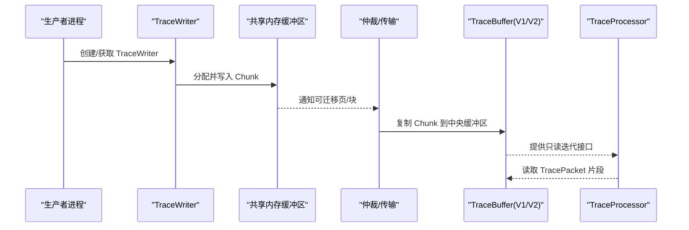
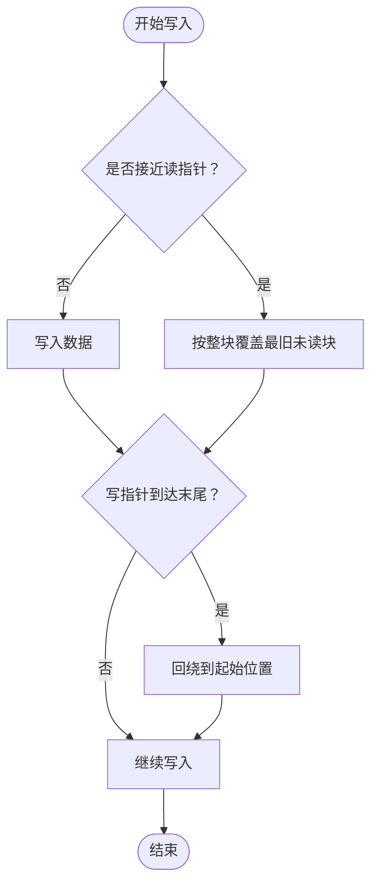
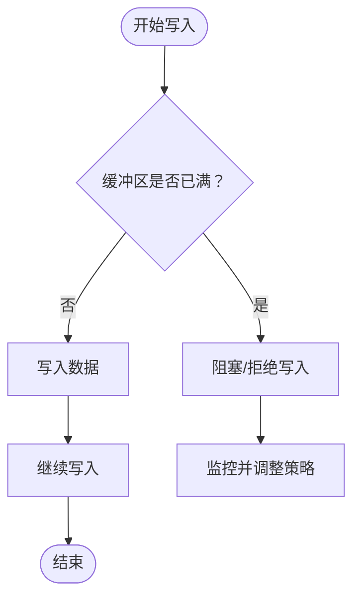
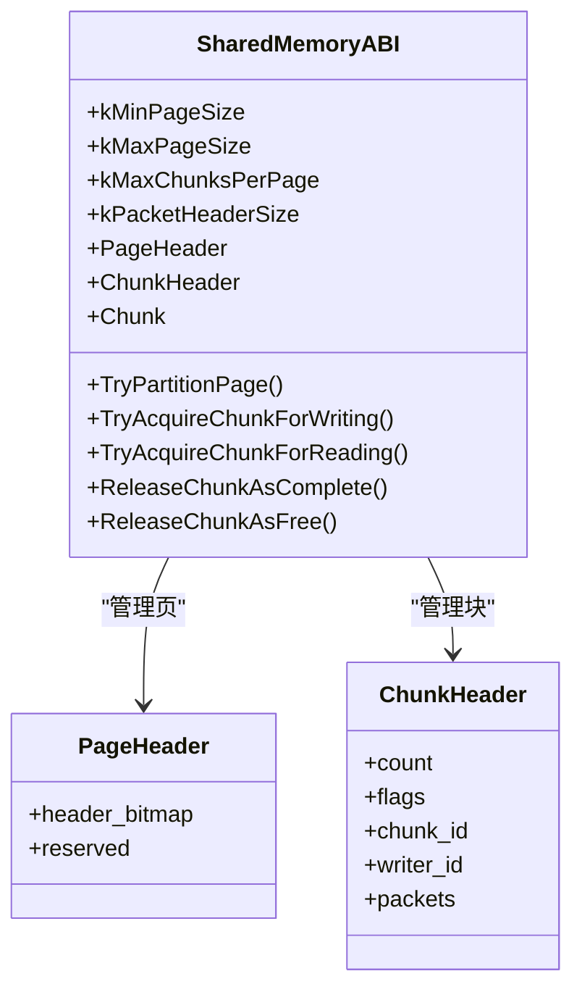
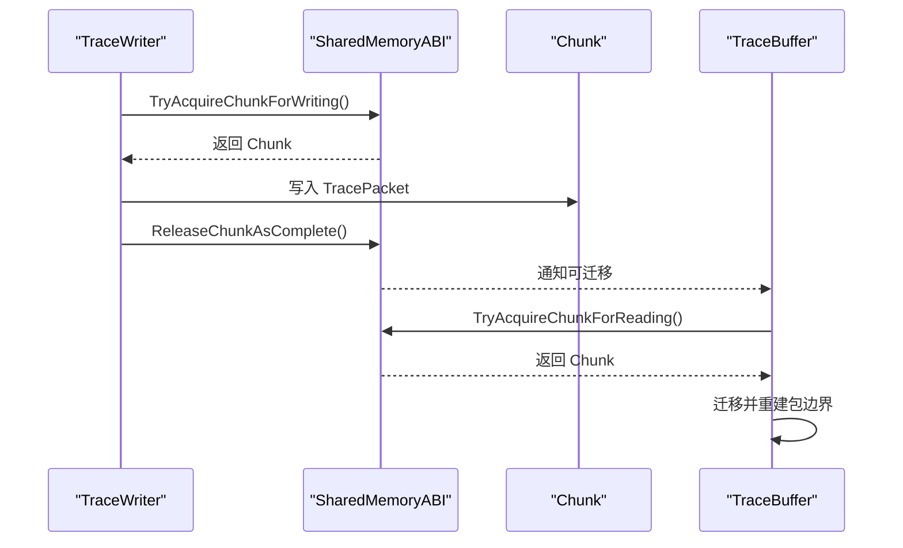
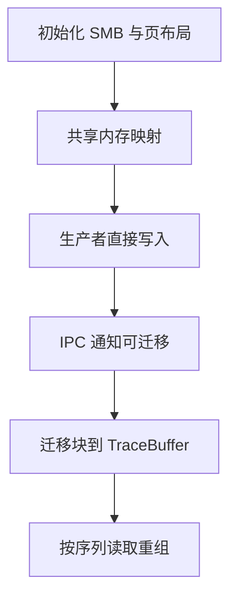
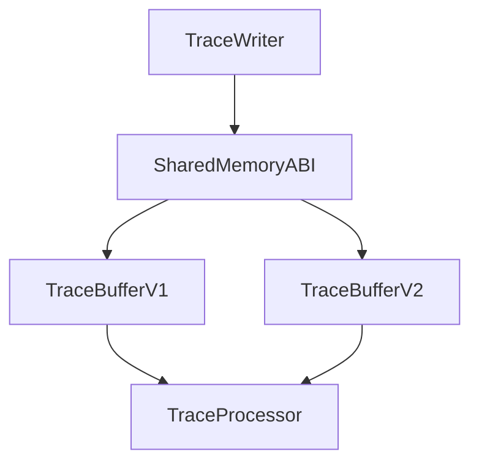

# 缓冲区管理

<cite>
**本文引用的文件**
- [trace_buffer.h](file://src/tracing/service/trace_buffer.h)
- [trace_buffer_v1.h](file://src/tracing/service/trace_buffer_v1.h)
- [trace_buffer_v1.cc](file://src/tracing/service/trace_buffer_v1.cc)
- [trace_buffer_v2.h](file://src/tracing/service/trace_buffer_v2.h)
- [trace_buffer_v2.cc](file://src/tracing/service/trace_buffer_v2.cc)
- [shared_memory_abi.h](file://include/perfetto/ext/tracing/core/shared_memory_abi.h)
- [trace_writer.h](file://include/perfetto/ext/tracing/core/trace_writer.h)
- [buffers.md](file://docs/concepts/buffers.md)
- [trace_writer_base.h](file://include/perfetto/tracing/trace_writer_base.h)
- [trace_buffer.md](file://docs/design-docs/trace-buffer.md)
- [trace_buffer.proto](file://protos/perfetto/common/trace_buffer.proto)
- [trace_stats.proto](file://protos/perfetto/common/trace_stats.proto)
- [stats.h](file://src/trace_processor/storage/stats.h)
- [proto_trace_reader.cc](file://src/trace_processor/importers/proto/proto_trace_reader.cc)
- [shared_ring_buffer.h](file://src/profiling/memory/shared_ring_buffer.h)
- [shared_ring_buffer.cc](file://src/profiling/memory/shared_ring_buffer.cc)
- [shared_ring_buffer_unittest.cc](file://src/profiling/memory/shared_ring_buffer_unittest.cc)
- [tp_metatrace.cc](file://src/trace_processor/metatrace.cc)
</cite>

## 目录
1. [简介](#简介)
2. [项目结构](#项目结构)
3. [核心组件](#核心组件)
4. [架构总览](#架构总览)
5. [详细组件分析](#详细组件分析)
6. [依赖关系分析](#依赖关系分析)
7. [性能考量](#性能考量)
8. [故障排除指南](#故障排除指南)
9. [结论](#结论)
10. [附录](#附录)

## 简介
本文件系统化阐述 Perfetto 的缓冲区管理系统，覆盖以下主题：
- 环形缓冲区（Ring Buffer）与“满时停止”（Stop-When-Full）两种策略的设计原理、适用场景与权衡
- 共享内存缓冲区的 ABI 兼容性要求与二进制格式规范
- 缓冲区分区机制、数据块（Chunk）管理与写入器（TraceWriter）并发控制
- 缓冲区生命周期管理、内存映射与零拷贝传输优化
- 溢出处理、数据保留策略与性能调优参数
- 配置选项、监控指标与故障排除指南，并提供可操作的最佳实践

## 项目结构
Perfetto 的缓冲区体系由三层组成：生产者侧共享内存缓冲区（SMB）、服务端中央缓冲区（TraceBuffer），以及内核 ftrace 缓冲区（可选）。数据流从生产者直接写入 SMB，再由服务端异步复制到中央缓冲区，最终输出到文件或分析管线。

```mermaid
graph TB
subgraph "生产者进程"
DS["数据源<br/>TraceWriter"]
SMB["共享内存缓冲区(SMB)<br/>页(Page)与块(Chunk)"]
end
subgraph "服务端"
ARB["共享内存仲裁器/传输层"]
TB["中央缓冲区<br/>TraceBufferV1/V2"]
TP["TraceProcessor/分析管线"]
end
DS --> SMB
SMB < --> ARB
ARB --> TB
TB --> TP
```

图中关键点：
- TraceWriter 在生产者侧直接序列化到 SMB 的 Chunk 中，实现零拷贝写入
- 服务端通过 IPC 触发复制，将 SMB 的完整页或块迁移到 TraceBuffer
- TraceBuffer 支持环形覆盖与丢弃两种策略，保障高吞吐下的低延迟读取

**图表来源**
- [buffers.md:23-98](file://docs/concepts/buffers.md#L23-L98)
- [shared_memory_abi.h:35-86](file://include/perfetto/ext/tracing/core/shared_memory_abi.h#L35-L86)

**章节来源**
- [buffers.md:1-423](file://docs/concepts/buffers.md#L1-L423)

## 核心组件
- TraceBuffer 接口：定义缓冲区抽象，支持复制 Chunk、补丁应用、只读克隆、统计查询等能力
- TraceBufferV1：基于索引与记录的环形缓冲区实现，支持补丁与重排序
- TraceBufferV2：面向未来的缓冲区实现，采用更灵活的序列状态与片段迭代器
- SharedMemoryABI：共享内存缓冲区的 ABI 定义，包括页布局、块头、状态机与对齐约束
- TraceWriter：生产者侧写入器抽象，负责在 SMB 上分配 Chunk 并写入 TracePacket

**章节来源**
- [trace_buffer.h:35-128](file://src/tracing/service/trace_buffer.h#L35-L128)
- [trace_buffer_v1.h:144-266](file://src/tracing/service/trace_buffer_v1.h#L144-L266)
- [trace_buffer_v2.h:382-524](file://src/tracing/service/trace_buffer_v2.h#L382-L524)
- [shared_memory_abi.h:144-634](file://include/perfetto/ext/tracing/core/shared_memory_abi.h#L144-L634)
- [trace_writer.h:36-49](file://include/perfetto/ext/tracing/core/trace_writer.h#L36-L49)

## 架构总览
下图展示缓冲区在生产者与服务端之间的交互流程，以及两种缓冲区类型（V1/V2）的差异：



**图表来源**
- [trace_buffer.h:75-110](file://src/tracing/service/trace_buffer.h#L75-L110)
- [trace_buffer_v1.h:157-186](file://src/tracing/service/trace_buffer_v1.h#L157-L186)
- [trace_buffer_v2.h:410-437](file://src/tracing/service/trace_buffer_v2.h#L410-L437)

## 详细组件分析

### 环形缓冲区（Ring Buffer）策略
- 设计目标：最大化写入吞吐，允许旧数据被新数据覆盖，适合持续追踪且容忍部分历史丢失的场景
- 行为特征：
  - 写指针追上读指针时，按整块覆盖策略丢弃最旧的未读块
  - 保证包完整性：仅在确认所有片段都可用后才对外输出
  - 读顺序：同一序列按 ChunkID FIFO 顺序读取；跨序列不保证全局时间序
- 适用场景：系统级长期追踪、高频事件采集、实时分析



**图表来源**
- [trace_buffer_v1.h:65-81](file://src/tracing/service/trace_buffer_v1.h#L65-L81)
- [trace_buffer_v1.cc:550-569](file://src/tracing/service/trace_buffer_v1.cc#L550-L569)

**章节来源**
- [trace_buffer_v1.h:65-81](file://src/tracing/service/trace_buffer_v1.h#L65-L81)
- [trace_buffer_v1.cc:550-569](file://src/tracing/service/trace_buffer_v1.cc#L550-L569)

### 停止填充缓冲区（Stop-When-Full）策略
- 设计目标：在缓冲区满时拒绝新写入，避免覆盖未消费数据，确保数据完整性优先
- 行为特征：
  - 当写入会覆盖未读数据时，写操作被标记为失败或被阻塞（取决于 BufferExhaustedPolicy）
  - 适用于对数据完整性敏感的场景，如关键事件捕获
- 适用场景：关键路径事件记录、审计日志、严格一致性要求



**图表来源**
- [buffers.md:142-178](file://docs/concepts/buffers.md#L142-L178)

**章节来源**
- [buffers.md:142-178](file://docs/concepts/buffers.md#L142-L178)

### 共享内存缓冲区 ABI 与二进制格式
- 页（Page）与块（Chunk）划分：
  - 页大小固定且为 4KB 对齐，页内按布局划分为若干块
  - 块头包含包数量、标志位（首包续前/尾包续后/需要补丁）、ChunkID、WriterID 等
- 对齐与布局：
  - 块对齐粒度为 4 字节，页头与块头占用固定空间
  - 支持多种布局（Div1/Div2/Div4/Div7/Div14），以减少碎片
- 状态机：
  - 块状态：空闲、正在写入、正在读取、已完成
  - 页头位图记录每块状态与布局信息
- 变长包头：
  - 包大小以变长整数编码，最大支持 4 字节头部
- 传输模式：
  - 默认模式：生产者与服务端共享内存
  - 模拟模式：无共享内存时由生产者本地完成状态转换



**图表来源**
- [shared_memory_abi.h:146-634](file://include/perfetto/ext/tracing/core/shared_memory_abi.h#L146-L634)

**章节来源**
- [shared_memory_abi.h:87-137](file://include/perfetto/ext/tracing/core/shared_memory_abi.h#L87-L137)
- [shared_memory_abi.h:246-291](file://include/perfetto/ext/tracing/core/shared_memory_abi.h#L246-L291)
- [shared_memory_abi.h:312-454](file://include/perfetto/ext/tracing/core/shared_memory_abi.h#L312-L454)

### 数据块（Chunk）管理与写入器并发控制
- Chunk 生命周期：
  - 获取：生产者尝试原子地将某块标记为“正在写入”，并设置 ChunkHeader
  - 写入：TraceWriter 将 TracePacket 序列化到块中，更新包计数
  - 完成：生产者释放块为“已完成”，服务端随后迁移
- 并发控制：
  - 生产者内：块独占写，避免跨线程交错写入
  - 跨进程：无互斥，通过页头位图与原子操作协调
- 片段与补丁：
  - 跨块包通过标志位标识续传关系
  - 需要补丁的块在完成后由服务端进行外带补丁



**图表来源**
- [shared_memory_abi.h:537-573](file://include/perfetto/ext/tracing/core/shared_memory_abi.h#L537-L573)
- [trace_buffer_v1.h:178-186](file://src/tracing/service/trace_buffer_v1.h#L178-L186)
- [trace_buffer_v2.h:429-437](file://src/tracing/service/trace_buffer_v2.h#L429-L437)

**章节来源**
- [shared_memory_abi.h:168-203](file://include/perfetto/ext/tracing/core/shared_memory_abi.h#L168-L203)
- [shared_memory_abi.h:537-573](file://include/perfetto/ext/tracing/core/shared_memory_abi.h#L537-L573)
- [trace_buffer_v1.h:178-186](file://src/tracing/service/trace_buffer_v1.h#L178-L186)
- [trace_buffer_v2.h:429-437](file://src/tracing/service/trace_buffer_v2.h#L429-L437)

### 缓冲区生命周期管理、内存映射与零拷贝
- 生命周期：
  - 初始化：分配页表与块布局，设置页头位图
  - 写入：按页扫描，批量迁移块到中央缓冲区
  - 读取：按序列 FIFO 顺序消费，支持跨块重组
- 内存映射与零拷贝：
  - SMB 通过共享内存映射，生产者直接写入用户态地址
  - 中央缓冲区使用分页内存（PagedMemory），支持按需提交
- 传输优化：
  - 全页移动优化：在特定条件下可直接移动整页数据
  - 页头与块头对齐，减少碎片与复制



**图表来源**
- [shared_memory_abi.h:246-291](file://include/perfetto/ext/tracing/core/shared_memory_abi.h#L246-L291)
- [trace_buffer_v1.h:280-287](file://src/tracing/service/trace_buffer_v1.h#L280-L287)
- [trace_buffer_v2.h:545-547](file://src/tracing/service/trace_buffer_v2.h#L545-L547)

**章节来源**
- [shared_memory_abi.h:246-291](file://include/perfetto/ext/tracing/core/shared_memory_abi.h#L246-L291)
- [trace_buffer_v1.h:280-287](file://src/tracing/service/trace_buffer_v1.h#L280-L287)
- [trace_buffer_v2.h:545-547](file://src/tracing/service/trace_buffer_v2.h#L545-L547)

### 溢出处理、数据保留策略与性能调优
- 溢出处理：
  - 环形覆盖：整块丢弃最旧未读块，保证吞吐
  - 丢弃策略：满时拒绝新写入，保留未读数据
- 数据保留策略：
  - 增量状态定期失效：降低因环形覆盖导致的描述符缺失
  - 专用缓冲区：将关键描述符放入更少覆盖的缓冲区
- 性能调优参数：
  - 中央缓冲区大小：根据聚合写入速率与采样周期估算
  - 共享内存缓冲区大小：考虑调度阻塞与峰值写入速率
  - flush 周期：减少长间隔导致的时间错位与导入错误

**章节来源**
- [buffers.md:100-179](file://docs/concepts/buffers.md#L100-L179)
- [buffers.md:240-265](file://docs/concepts/buffers.md#L240-L265)

### 配置选项、监控指标与故障排除
- 配置选项：
  - 中央缓冲区大小：TraceConfig.buffers[].size_kb
  - 共享内存大小提示：TracingInitArgs.shmem_size_hint_kb
  - flush 周期：TraceConfig.flush_period_ms
  - 增量状态失效周期：TraceConfig.IncrementalStateConfig.clear_period_ms
- 监控指标：
  - traced_buf_chunks_overwritten / traced_buf_chunks_discarded
  - traced_buf_trace_writer_packet_loss / traced_buf_sequence_packet_loss
  - traced_buf_readaheads_succeeded / traced_buf_readaheads_failed
- 故障排除：
  - 使用 TraceProcessor 查询 stats 表定位数据丢失
  - 检查共享内存页布局与块状态位图
  - 调整共享内存与中央缓冲区大小，或启用 flush 周期

**章节来源**
- [buffers.md:100-179](file://docs/concepts/buffers.md#L100-L179)
- [stats.h:207-223](file://src/trace_processor/storage/stats.h#L207-L223)
- [proto_trace_reader.cc:983-1020](file://src/trace_processor/importers/proto/proto_trace_reader.cc#L983-L1020)

## 依赖关系分析
- TraceBufferV1/V2 依赖 SharedMemoryABI 的页/块布局与状态机
- TraceWriter 通过 TraceWriterBase 与共享内存 ABI 协作
- TraceProcessor 通过 proto_trace_reader 读取统计与缓冲区状态



**图表来源**
- [trace_writer.h:36-49](file://include/perfetto/ext/tracing/core/trace_writer.h#L36-L49)
- [shared_memory_abi.h:456-474](file://include/perfetto/ext/tracing/core/shared_memory_abi.h#L456-L474)
- [trace_buffer_v1.h:157-186](file://src/tracing/service/trace_buffer_v1.h#L157-L186)
- [trace_buffer_v2.h:410-437](file://src/tracing/service/trace_buffer_v2.h#L410-L437)

**章节来源**
- [trace_writer.h:36-49](file://include/perfetto/ext/tracing/core/trace_writer.h#L36-L49)
- [shared_memory_abi.h:456-474](file://include/perfetto/ext/tracing/core/shared_memory_abi.h#L456-L474)
- [trace_buffer_v1.h:157-186](file://src/tracing/service/trace_buffer_v1.h#L157-L186)
- [trace_buffer_v2.h:410-437](file://src/tracing/service/trace_buffer_v2.h#L410-L437)

## 性能考量
- 写入路径优化：
  - 直接写入共享内存，避免内核态切换
  - 批量迁移整页，减少 IPC 次数
- 读取路径优化：
  - 按序列 FIFO 顺序消费，降低乱序重组成本
  - 片段迭代器与补丁机制减少重复解析
- 内存使用：
  - 中央缓冲区按需提交，避免一次性占用过多内存
  - 块对齐与布局选择减少内部碎片

[本节为通用指导，无需具体文件分析]

## 故障排除指南
- 数据丢失定位：
  - 查询 traced_buf_chunks_overwritten / traced_buf_chunks_discarded
  - 检查 traced_buf_trace_writer_packet_loss 与 sequence_packet_loss
- 共享内存问题：
  - 核对页布局与块状态位图
  - 确认共享内存大小与页大小对齐
- 性能瓶颈：
  - 增大共享内存缓冲区或中央缓冲区
  - 启用 flush 周期，减少长间隔导致的导入错误
  - 调整增量状态失效周期，平衡数据完整性与存储开销

**章节来源**
- [stats.h:207-223](file://src/trace_processor/storage/stats.h#L207-L223)
- [proto_trace_reader.cc:983-1020](file://src/trace_processor/importers/proto/proto_trace_reader.cc#L983-L1020)
- [buffers.md:180-265](file://docs/concepts/buffers.md#L180-L265)

## 结论
Perfetto 的缓冲区管理体系通过 SMB 与 TraceBuffer 的协同，实现了高吞吐、低延迟的追踪数据管道。V1/V2 实现分别满足了稳定与未来的扩展需求；共享内存 ABI 提供了强健的跨进程协作基础。通过合理的配置与监控，可在不同场景下取得最佳的数据完整性与性能平衡。

[本节为总结性内容，无需具体文件分析]

## 附录

### 最佳实践建议
- 优先使用环形覆盖策略以获得更高吞吐，必要时启用丢弃策略保护关键数据
- 根据峰值写入速率与调度阻塞时间估算共享内存与中央缓冲区大小
- 启用 flush 周期，避免长间隔导致的时间错位与导入错误
- 定期失效增量状态，降低因环形覆盖导致的描述符缺失风险
- 使用 TraceProcessor 统计指标持续监控缓冲区健康状况

**章节来源**
- [buffers.md:100-179](file://docs/concepts/buffers.md#L100-L179)
- [buffers.md:344-360](file://docs/concepts/buffers.md#L344-L360)

### 关键设计文档参考
- TraceBuffer 设计文档：/docs/design-docs/trace-buffer.md
- 共享内存 ABI 规范：include/perfetto/ext/tracing/core/shared_memory_abi.h
- TraceWriter 抽象：include/perfetto/ext/tracing/core/trace_writer.h

**章节来源**
- [trace_buffer.md](file://docs/design-docs/trace-buffer.md)
- [shared_memory_abi.h:1-639](file://include/perfetto/ext/tracing/core/shared_memory_abi.h#L1-L639)
- [trace_writer.h:1-54](file://include/perfetto/ext/tracing/core/trace_writer.h#L1-L54)