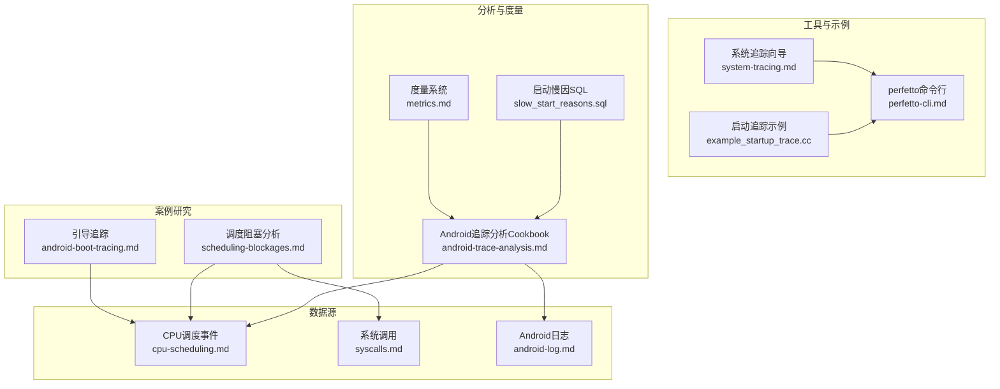
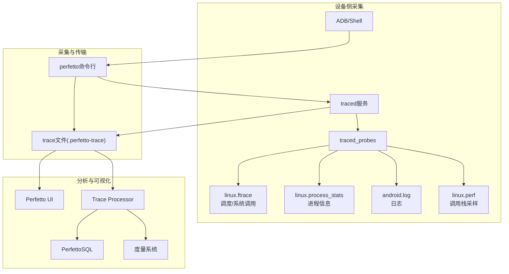
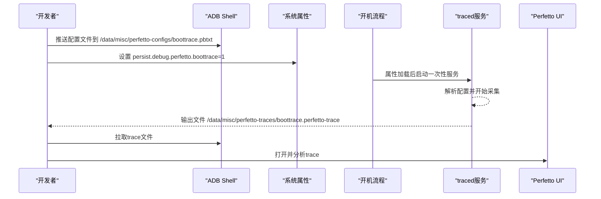
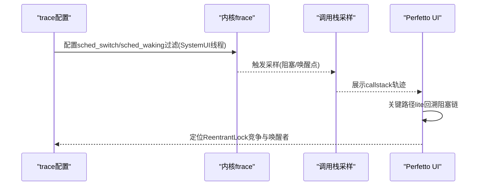
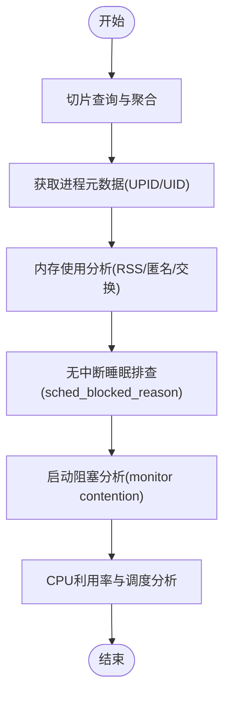
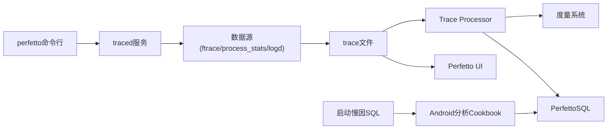

# Android性能分析案例

<cite>
**本文引用的文件**
- [android-boot-tracing.md](file://docs/case-studies/android-boot-tracing.md)
- [scheduling-blockages.md](file://docs/case-studies/scheduling-blockages.md)
- [android-trace-analysis.md](file://docs/getting-started/android-trace-analysis.md)
- [cpu-scheduling.md](file://docs/data-sources/cpu-scheduling.md)
- [syscalls.md](file://docs/data-sources/syscalls.md)
- [android-log.md](file://docs/data-sources/android-log.md)
- [perfetto-cli.md](file://docs/reference/perfetto-cli.md)
- [system-tracing.md](file://docs/getting-started/system-tracing.md)
- [example_startup_trace.cc](file://examples/sdk/example_startup_trace.cc)
- [metrics.md](file://docs/analysis/metrics.md)
- [slow_start_reasons.sql](file://src/trace_processor/metrics/sql/android/startup/slow_start_reasons.sql)
</cite>

## 目录
1. [引言](#引言)
2. [项目结构](#项目结构)
3. [核心组件](#核心组件)
4. [架构总览](#架构总览)
5. [详细组件分析](#详细组件分析)
6. [依赖关系分析](#依赖关系分析)
7. [性能考量](#性能考量)
8. [故障排查指南](#故障排查指南)
9. [结论](#结论)
10. [附录](#附录)

## 引言
本案例研究围绕Android性能分析，聚焦以下目标：
- 系统引导过程的性能瓶颈识别与关键启动阶段时间测量
- ANR（应用无响应）问题的诊断：主线程阻塞分析、卡顿原因定位与解决方案
- 完整分析流程：从trace数据采集到性能指标解读
- 配置示例、命令行工具使用与结果验证方法
- Android特有性能问题与调试技巧：Binder调用分析、GC停顿检测、CPU调度分析
- 可复现测试场景与实际性能提升数据

## 项目结构
本仓库提供了从trace采集、可视化、SQL查询到度量计算的完整能力，覆盖Android系统与应用层的性能分析需求。关键路径如下：
- 案例研究：引导追踪、调度阻塞分析
- 数据源：CPU调度、系统调用、Android日志
- 工具：perfetto命令行、系统追踪向导
- 示例：自定义启动追踪SDK示例
- 分析：Android追踪分析Cookbook、度量系统

**图表来源**
- [android-boot-tracing.md](file://docs/case-studies/android-boot-tracing.md)
- [scheduling-blockages.md](file://docs/case-studies/scheduling-blockages.md)
- [cpu-scheduling.md](file://docs/data-sources/cpu-scheduling.md)
- [syscalls.md](file://docs/data-sources/syscalls.md)
- [android-log.md](file://docs/data-sources/android-log.md)
- [perfetto-cli.md](file://docs/reference/perfetto-cli.md)
- [system-tracing.md](file://docs/getting-started/system-tracing.md)
- [example_startup_trace.cc](file://examples/sdk/example_startup_trace.cc)
- [android-trace-analysis.md](file://docs/getting-started/android-trace-analysis.md)
- [metrics.md](file://docs/analysis/metrics.md)
- [slow_start_reasons.sql](file://src/trace_processor/metrics/sql/android/startup/slow_start_reasons.sql)

**章节来源**
- [android-boot-tracing.md](file://docs/case-studies/android-boot-tracing.md)
- [scheduling-blockages.md](file://docs/case-studies/scheduling-blockages.md)
- [cpu-scheduling.md](file://docs/data-sources/cpu-scheduling.md)
- [syscalls.md](file://docs/data-sources/syscalls.md)
- [android-log.md](file://docs/data-sources/android-log.md)
- [perfetto-cli.md](file://docs/reference/perfetto-cli.md)
- [system-tracing.md](file://docs/getting-started/system-tracing.md)
- [example_startup_trace.cc](file://examples/sdk/example_startup_trace.cc)
- [android-trace-analysis.md](file://docs/getting-started/android-trace-analysis.md)
- [metrics.md](file://docs/analysis/metrics.md)
- [slow_start_reasons.sql](file://src/trace_processor/metrics/sql/android/startup/slow_start_reasons.sql)

## 核心组件
- 引导追踪配置与自动录制：支持在Android 13+上通过属性触发开机自动录制，采集内核ftrace与进程统计，用于分析引导阶段调度事件与进程生命周期。
- 调度阻塞分析：结合sched_switch/sched_waking事件与调用栈采样，精确定位锁竞争、优先级反转等导致主线程阻塞的问题。
- Android追踪分析Cookbook：提供基于SQL的切片查询、进程元数据、内存使用、无中断睡眠、启动阻塞、CPU利用率等分析方法。
- 数据源：CPU调度、系统调用、Android日志；支持过滤与聚合，便于定位具体线程与进程。
- 命令行工具：perfetto支持轻量模式与正常模式，可直接通过ADB进行trace采集与上传。
- 启动追踪示例：演示如何使用SDK设置系统后端的启动追踪，注册自定义数据源并在启动前后写入事件。

**章节来源**
- [android-boot-tracing.md](file://docs/case-studies/android-boot-tracing.md)
- [scheduling-blockages.md](file://docs/case-studies/scheduling-blockages.md)
- [android-trace-analysis.md](file://docs/getting-started/android-trace-analysis.md)
- [cpu-scheduling.md](file://docs/data-sources/cpu-scheduling.md)
- [syscalls.md](file://docs/data-sources/syscalls.md)
- [android-log.md](file://docs/data-sources/android-log.md)
- [perfetto-cli.md](file://docs/reference/perfetto-cli.md)
- [example_startup_trace.cc](file://examples/sdk/example_startup_trace.cc)

## 架构总览
下图展示从设备侧采集到UI/SQL分析的整体流程，以及关键数据源与分析模块的关系。

**图表来源**
- [system-tracing.md](file://docs/getting-started/system-tracing.md)
- [perfetto-cli.md](file://docs/reference/perfetto-cli.md)
- [cpu-scheduling.md](file://docs/data-sources/cpu-scheduling.md)
- [syscalls.md](file://docs/data-sources/syscalls.md)
- [android-log.md](file://docs/data-sources/android-log.md)

## 详细组件分析

### 组件A：引导追踪（Boot Trace）
- 目标：在Android 13+上自动记录开机trace，聚焦内核调度事件与进程生命周期，辅助定位引导阶段性能瓶颈。
- 关键步骤：
  - 准备pbtxt配置文件，包含缓冲区、ftrace事件（如sched_switch/sched_waking等）、进程统计与持续时长。
  - 将配置推送至设备指定路径，并通过属性启用开机自动录制。
  - 重启设备后等待trace生成，拉取到本地并通过UI打开分析。
- 实施细节：trace在持久属性加载后启动，采用一次性init服务实现。

**图表来源**
- [android-boot-tracing.md](file://docs/case-studies/android-boot-tracing.md)

**章节来源**
- [android-boot-tracing.md](file://docs/case-studies/android-boot-tracing.md)

### 组件B：调度阻塞分析（Scheduling Blockages）
- 问题背景：SystemUI主动画在下拉通知栏时出现1-10ms阻塞，导致帧动画抖动。
- 方法论：
  - 使用sched_switch/sched_waking事件触发调用栈采样，精确捕获线程阻塞与唤醒点。
  - 通过过滤SystemUI主/后台线程，减少采样压力并聚焦关键路径。
  - 利用“关键路径lite”快速回溯阻塞链路，定位锁竞争与优先级反转。
- 关键洞察：
  - Kotlin协程内部依赖ScheduledThreadPoolExecutor，enqueue任务需要ReentrantLock。
  - 锁被后台线程持有且按队列顺序唤醒，导致主线程等待时间延长。
  - ReentrantLock不考虑CPU亲和性，可能造成同核串行化，放大阻塞。
  - CFS调度器非严格工作可保性，可能延迟迁移以平衡功耗与延迟。
- 结果：通过调用栈采样与sys_futex事件增强，重建完整事件序列，确认锁竞争与唤醒链路。

**图表来源**
- [scheduling-blockages.md](file://docs/case-studies/scheduling-blockages.md)

**章节来源**
- [scheduling-blockages.md](file://docs/case-studies/scheduling-blockages.md)

### 组件C：Android追踪分析（Android Trace Analysis）
- 切片查询与聚合：使用GLOB/LIKE/REGEXP匹配，结合COUNT/SUM/PERCENTILE等聚合函数定位异常切片。
- 进程元数据与UPID：通过android_process_metadata获取进程名、包名、UID与UPID，用于跨表JOIN与筛选。
- 内存使用分析：利用android.memory.process模块查询RSS/匿名内存/交换等指标，定位峰值内存。
- 无中断睡眠排查：启用sched_blocked_reason事件，汇总阻塞函数并按时长排序。
- 启动阻塞分析：结合android.monitor_contention与android.startup.startups，交集分析主线程在启动期间的monitor contention。
- CPU利用率与调度：通过linux.cpu.utilization模块与sched_slice/cpuidle计数器，评估进程CPU占用与频繁唤醒。

**图表来源**
- [android-trace-analysis.md](file://docs/getting-started/android-trace-analysis.md)

**章节来源**
- [android-trace-analysis.md](file://docs/getting-started/android-trace-analysis.md)

### 组件D：命令行工具与系统追踪
- perfetto命令行：
  - 轻量模式：通过命令行参数选择ftrace/atrace类别，适合快速采集。
  - 正常模式：以pbtxt配置文件指定数据源与缓冲策略，支持复杂场景。
  - 支持后台录制、克隆会话、添加注释、上传等选项。
- 系统追踪向导：提供Android/命令行/Linux三种采集方式，支持UI与CLI两种入口，便于不同环境下的trace采集与可视化。

**章节来源**
- [perfetto-cli.md](file://docs/reference/perfetto-cli.md)
- [system-tracing.md](file://docs/getting-started/system-tracing.md)

### 组件E：启动追踪示例（SDK）
- 使用系统后端初始化Tracing，注册自定义数据源，设置TraceConfig并启动/停止追踪。
- 在启动前后写入事件，便于在UI中对齐关键时刻。
- 适用于需要在应用启动前后注入自定义事件的场景。

**章节来源**
- [example_startup_trace.cc](file://examples/sdk/example_startup_trace.cc)

### 组件F：度量系统与启动慢因SQL
- 度量系统：通过trace_processor运行内置或自定义度量，输出结构化指标，便于回归检测与对比。
- 启动慢因SQL：针对启动阶段的锁竞争（monitor contention）等慢因进行阈值判定与统计，辅助定位主线程阻塞占比高的切片。

**章节来源**
- [metrics.md](file://docs/analysis/metrics.md)
- [slow_start_reasons.sql](file://src/trace_processor/metrics/sql/android/startup/slow_start_reasons.sql)

## 依赖关系分析
- 数据源依赖：
  - CPU调度事件依赖ftrace；系统调用依赖raw_syscalls；Android日志依赖logd。
- 工具链依赖：
  - perfetto命令行依赖traced/traced_probes；UI依赖浏览器渲染；Trace Processor负责SQL执行与度量。
- 分析模块依赖：
  - Android追踪分析Cookbook依赖标准库模块（如android.memory.process、android.monitor_contention等）。

**图表来源**
- [perfetto-cli.md](file://docs/reference/perfetto-cli.md)
- [system-tracing.md](file://docs/getting-started/system-tracing.md)
- [android-trace-analysis.md](file://docs/getting-started/android-trace-analysis.md)
- [metrics.md](file://docs/analysis/metrics.md)

**章节来源**
- [perfetto-cli.md](file://docs/reference/perfetto-cli.md)
- [system-tracing.md](file://docs/getting-started/system-tracing.md)
- [android-trace-analysis.md](file://docs/getting-started/android-trace-analysis.md)
- [metrics.md](file://docs/analysis/metrics.md)

## 性能考量
- 采样频率与缓冲：高密度调度事件（如每秒数万次sched_switch）需谨慎配置采样与环形缓冲大小，避免过载。
- 过滤策略：通过进程/线程过滤显著降低采样压力，提高关键路径可见性。
- 指标选择：CPU利用率、无中断睡眠、monitor contention、锁竞争等指标组合，有助于快速定位瓶颈。
- 工具开销：命令行与UI均应关注trace大小与解析时间，合理设置缓冲与持续时长。

## 故障排查指南
- ANR/卡顿定位：
  - 使用sched_switch/sched_waking事件与调用栈采样，定位主线程阻塞与唤醒者。
  - 结合sys_futex事件，观察底层同步原语的等待/唤醒行为。
- 主线程阻塞分析：
  - 使用android.monitor_contention与android.startup.startups交集分析，量化主线程阻塞时长与次数。
- 日志关联：
  - 通过android.log数据源将日志与trace时间轴对齐，辅助定位异常上下文。
- 性能回归检测：
  - 使用度量系统定期运行指标，发现异常趋势并回溯trace。

**章节来源**
- [scheduling-blockages.md](file://docs/case-studies/scheduling-blockages.md)
- [android-trace-analysis.md](file://docs/getting-started/android-trace-analysis.md)
- [android-log.md](file://docs/data-sources/android-log.md)
- [metrics.md](file://docs/analysis/metrics.md)

## 结论
本案例展示了从trace采集到指标解读的完整Android性能分析闭环。通过引导追踪、调度阻塞分析与Android追踪分析Cookbook，能够有效识别系统引导与应用启动阶段的性能瓶颈；结合命令行工具与度量系统，可实现可复现、可验证的性能优化流程。建议在日常开发中：
- 建立标准化trace配置模板与分析脚本
- 将关键性能指标纳入CI回归检测
- 对热点路径采用多维度指标交叉验证

## 附录

### A. 引导追踪配置要点
- 缓冲区与填充策略
- ftrace事件集合（调度、进程生命周期、任务重命名等）
- 进程统计与持续时长
- 开机自动录制属性与输出路径

**章节来源**
- [android-boot-tracing.md](file://docs/case-studies/android-boot-tracing.md)

### B. 调度阻塞分析配置要点
- 两路linux.perf数据源分别针对sched_switch/sched_waking
- tracepoint过滤（SystemUI主/后台线程）
- ring_buffer_pages大小与过滤策略
- sys_futex事件增强

**章节来源**
- [scheduling-blockages.md](file://docs/case-studies/scheduling-blockages.md)

### C. 命令行工具使用要点
- 轻量模式：atrace类别与ftrace事件
- 正常模式：pbtxt配置与读取stdin
- 后台录制、克隆会话、上传与注释

**章节来源**
- [perfetto-cli.md](file://docs/reference/perfetto-cli.md)

### D. 启动追踪示例要点
- 系统后端初始化
- 自定义数据源注册
- 启动前后事件写入
- TraceConfig与会话管理

**章节来源**
- [example_startup_trace.cc](file://examples/sdk/example_startup_trace.cc)