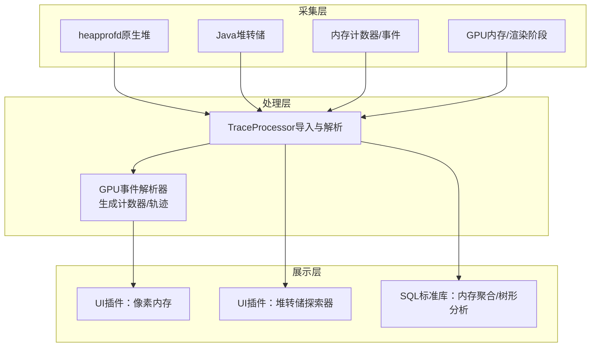
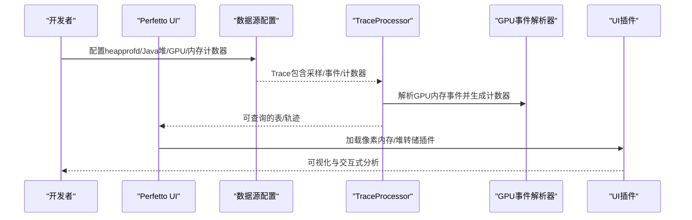
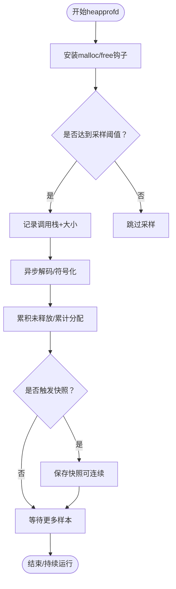
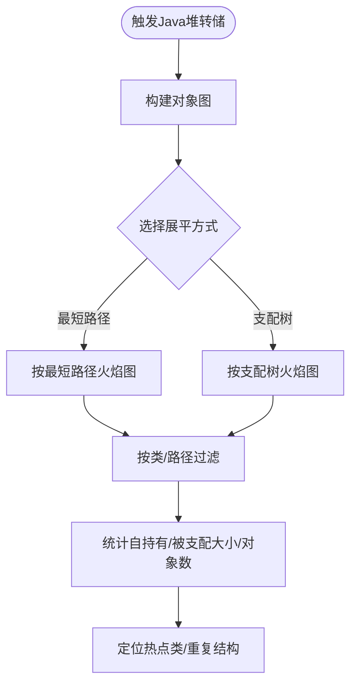
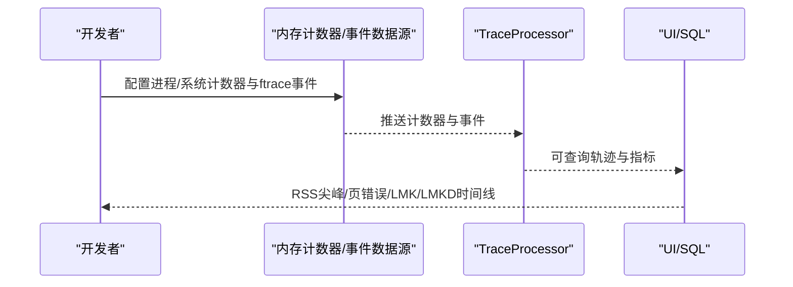
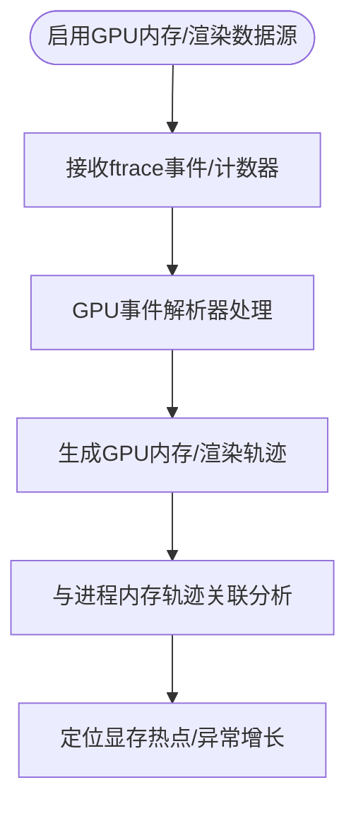
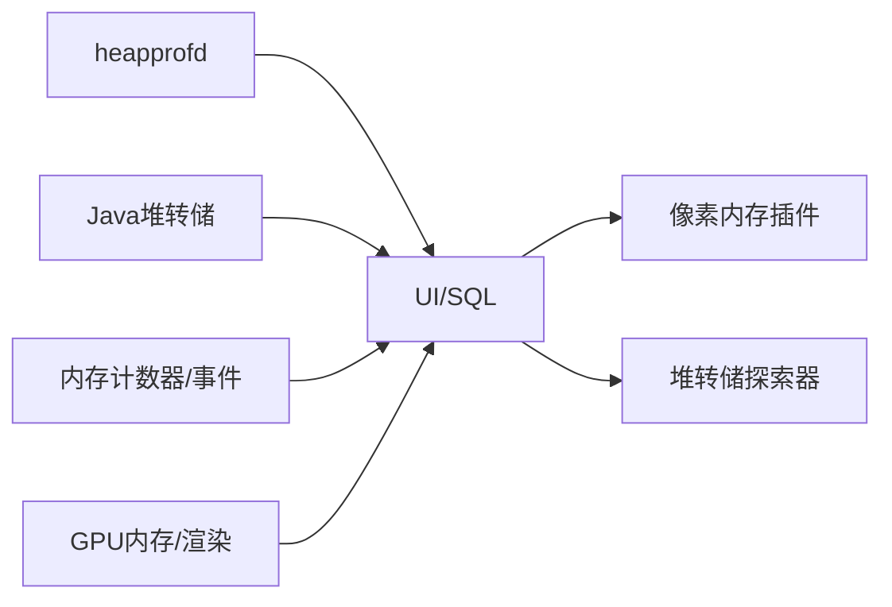

# 内存分析案例

<cite>
**本文引用的文件**
- [内存：Java堆转储](file://docs/data-sources/java-heap-profiler.md)
- [内存：原生堆剖析](file://docs/data-sources/native-heap-profiler.md)
- [内存计数器与事件](file://docs/data-sources/memory-counters.md)
- [GPU](file://docs/data-sources/gpu.md)
- [记录内存剖析](file://docs/getting-started/memory-profiling.md)
- [Android内存使用案例研究](file://docs/case-studies/memory.md)
- [Android OutOfMemoryError案例研究](file://docs/case-studies/android-outofmemoryerror.md)
- [heapprofd：Android堆剖析设计](file://docs/design-docs/heapprofd-design.md)
- [heapprofd：内存剖析采样](file://docs/design-docs/heapprofd-sampling.md)
- [GPU内存事件解析器](file://src/trace_processor/importers/proto/gpu_event_parser.cc)
- [像素内存插件（UI）](file://ui/src/plugins/com.google.PixelMemory/index.ts)
- [堆转储查询（UI）](file://ui/src/plugins/com.android.HeapDumpExplorer/queries.ts)
</cite>

## 目录
1. [引言](#引言)
2. [项目结构](#项目结构)
3. [核心组件](#核心组件)
4. [架构总览](#架构总览)
5. [详细组件分析](#详细组件分析)
6. [依赖关系分析](#依赖关系分析)
7. [性能考量](#性能考量)
8. [故障排查指南](#故障排查指南)
9. [结论](#结论)
10. [附录](#附录)

## 引言
本案例研究围绕内存分析的完整流程展开，覆盖从heapprofd采样到堆图分析与泄漏路径追踪，涵盖Java堆、原生堆与GPU内存三类内存类型的采集与分析方法，并结合OOM场景、内存抖动与频繁GC等典型问题，给出可操作的诊断步骤、优化建议与最佳实践。读者无需深入底层实现，即可按步骤完成端到端的内存问题定位与修复。

## 项目结构
本仓库提供了从数据采集、导入、可视化到SQL查询分析的全链路能力，重点模块如下：
- 数据源与采集
  - 原生堆剖析（heapprofd）
  - Java堆转储
  - 内存计数器与事件（RSS、页错误、LMK/LMKD）
  - GPU内存与渲染阶段
- 导入与处理
  - TraceProcessor对GPU内存事件的解析与计数器生成
- 可视化与查询
  - UI插件：像素内存插件、堆转储探索器
  - SQL标准库：内存相关聚合与树形分析

**图表来源**
- [原生堆剖析](file://docs/data-sources/native-heap-profiler.md)
- [Java堆转储](file://docs/data-sources/java-heap-profiler.md)
- [内存计数器与事件](file://docs/data-sources/memory-counters.md)
- [GPU](file://docs/data-sources/gpu.md)
- [GPU内存事件解析器](file://src/trace_processor/importers/proto/gpu_event_parser.cc)
- [像素内存插件（UI）](file://ui/src/plugins/com.google.PixelMemory/index.ts)
- [堆转储查询（UI）](file://ui/src/plugins/com.android.HeapDumpExplorer/queries.ts)

**章节来源**
- [记录内存剖析](file://docs/getting-started/memory-profiling.md)
- [Android内存使用案例研究](file://docs/case-studies/memory.md)

## 核心组件
- heapprofd（原生堆剖析）
  - 通过拦截malloc/free/new/delete，采样调用栈，构建未释放/累计分配的火焰图，支持连续快照与符号化解析。
  - 支持Java堆采样（Android 12+），显示对象创建路径与类型。
- Java堆转储
  - 截取运行时对象图，展示可达性与保留集，支持“最短路径”和“支配树”两种展平方式。
- 内存计数器与事件
  - 通过ftrace与/proc接口收集RSS、页错误、LMK/LMKD等事件，用于发现短时尖峰与低内存回收行为。
- GPU内存与渲染
  - 通过ftrace与专用数据源跟踪GPU内存总量、驱动/设备内存分配与绑定、渲染阶段与频率等。

**章节来源**
- [原生堆剖析](file://docs/data-sources/native-heap-profiler.md)
- [Java堆转储](file://docs/data-sources/java-heap-profiler.md)
- [内存计数器与事件](file://docs/data-sources/memory-counters.md)
- [GPU](file://docs/data-sources/gpu.md)

## 架构总览
下图展示了从采集到可视化的整体架构，以及关键数据流与依赖关系。

**图表来源**
- [记录内存剖析](file://docs/getting-started/memory-profiling.md)
- [原生堆剖析](file://docs/data-sources/native-heap-profiler.md)
- [Java堆转储](file://docs/data-sources/java-heap-profiler.md)
- [内存计数器与事件](file://docs/data-sources/memory-counters.md)
- [GPU](file://docs/data-sources/gpu.md)
- [GPU内存事件解析器](file://src/trace_processor/importers/proto/gpu_event_parser.cc)
- [像素内存插件（UI）](file://ui/src/plugins/com.google.PixelMemory/index.ts)
- [堆转储查询（UI）](file://ui/src/plugins/com.android.HeapDumpExplorer/queries.ts)

## 详细组件分析

### 组件A：原生堆剖析（heapprofd）
- 采样与统计
  - 默认以4096字节为采样间隔，大分配直接记录真实大小；小分配按概率采样并放大计数，平衡精度与开销。
  - 支持连续快照（周期性保存），便于观察泄漏随时间增长的趋势。
- 调用栈与符号化
  - 远程解码调用栈，支持原生与ART三种执行模式；可离线符号化与反混淆。
- 工作流
  - 通过UI或命令行启动，目标进程启动后自动注入钩子；支持阻塞初始化避免遗漏启动期分配。
- 典型用途
  - 定位原生内存泄漏、识别高压力分配路径、评估分配抖动与碎片化影响。

**图表来源**
- [heapprofd：Android堆剖析设计](file://docs/design-docs/heapprofd-design.md)
- [heapprofd：内存剖析采样](file://docs/design-docs/heapprofd-sampling.md)
- [原生堆剖析](file://docs/data-sources/native-heap-profiler.md)

**章节来源**
- [heapprofd：Android堆剖析设计](file://docs/design-docs/heapprofd-design.md)
- [heapprofd：内存剖析采样](file://docs/design-docs/heapprofd-sampling.md)
- [原生堆剖析](file://docs/data-sources/native-heap-profiler.md)

### 组件B：Java堆转储与支配树分析
- 快照与对象图
  - 截取运行时对象图，展示对象间的保留关系；默认按“最短路径”展平，也可切换“支配树”以查看独占保留量。
- 分析维度
  - 按类名聚合“自持有大小/对象数”、“被支配大小/对象数”，聚焦大对象与重复结构（字符串、数组、位图）。
- 实战要点
  - 使用焦点过滤快速缩小范围；结合反混淆映射提升可读性；关注“native”节点以识别JNI侧原生占用。

**图表来源**
- [Java堆转储](file://docs/data-sources/java-heap-profiler.md)
- [堆转储查询（UI）](file://ui/src/plugins/com.android.HeapDumpExplorer/queries.ts)

**章节来源**
- [Java堆转储](file://docs/data-sources/java-heap-profiler.md)
- [堆转储查询（UI）](file://ui/src/plugins/com.android.HeapDumpExplorer/queries.ts)

### 组件C：内存计数器与事件（RSS、页错误、LMK/LMKD）
- 计数器采集
  - 通过进程/系统级计数器（mem.virt/rss/anon/file/swap、页错误、压缩/回收事件）观测内存水位与波动。
- 事件采集
  - ftrace事件（rss_stat、mm_event、lowmemorykiller/lowmemory_kill、lmkd kill_one_process、oom_score_adj_update）捕捉瞬时尖峰与回收行为。
- 应用场景
  - 发现短时内存尖峰导致LMK风暴、评估碎片化与回收压力、定位OOM前兆。

**图表来源**
- [内存计数器与事件](file://docs/data-sources/memory-counters.md)

**章节来源**
- [内存计数器与事件](file://docs/data-sources/memory-counters.md)

### 组件D：GPU内存与渲染阶段
- GPU内存
  - 通过ftrace事件（gpu_mem_total）与vulkan.memory_tracker（驱动/设备内存分配/绑定）跟踪进程内GPU内存变化。
- 渲染阶段
  - 提供图形与计算提交的时间线，辅助关联GPU内存增长与渲染负载。
- 实战要点
  - 结合进程内存断面与GPU内存计数器，定位显存占用异常；关注驱动/设备内存类型分布。

**图表来源**
- [GPU](file://docs/data-sources/gpu.md)
- [GPU内存事件解析器](file://src/trace_processor/importers/proto/gpu_event_parser.cc)
- [像素内存插件（UI）](file://ui/src/plugins/com.google.PixelMemory/index.ts)

**章节来源**
- [GPU](file://docs/data-sources/gpu.md)
- [GPU内存事件解析器](file://src/trace_processor/importers/proto/gpu_event_parser.cc)
- [像素内存插件（UI）](file://ui/src/plugins/com.google.PixelMemory/index.ts)

## 依赖关系分析
- heapprofd依赖
  - 运行时注入（信号/属性）、共享内存缓冲、libunwindstack远程解码、符号化与反混淆。
  - 与TraceProcessor协作输出可查询表与可视化。
- Java堆转储依赖
  - 与ART深度集成，需Android版本满足要求；UI插件提供交互式浏览与SQL聚合。
- 内存计数器/事件依赖
  - ftrace与/proc接口；TraceProcessor统一导入为可查询轨迹。
- GPU内存依赖
  - 专用数据源与事件解析器；UI插件进行可视化与注释标注。

**图表来源**
- [原生堆剖析](file://docs/data-sources/native-heap-profiler.md)
- [Java堆转储](file://docs/data-sources/java-heap-profiler.md)
- [内存计数器与事件](file://docs/data-sources/memory-counters.md)
- [GPU](file://docs/data-sources/gpu.md)
- [像素内存插件（UI）](file://ui/src/plugins/com.google.PixelMemory/index.ts)
- [堆转储查询（UI）](file://ui/src/plugins/com.android.HeapDumpExplorer/queries.ts)

**章节来源**
- [记录内存剖析](file://docs/getting-started/memory-profiling.md)
- [Android内存使用案例研究](file://docs/case-studies/memory.md)

## 性能考量
- heapprofd采样
  - 通过概率采样与大分配直录降低开销；采样间隔越大，越易漏掉小分配，但更稳定。
  - 缓冲区溢出时会提前终止，可通过增大共享内存或提高采样间隔缓解。
- 远程解码
  - 将昂贵的解码移至服务端，客户端仅拷贝栈帧，显著降低应用侧延迟与抖动。
- 计数器与事件
  - 合理设置采样周期（>100ms）避免CPU开销过大；ftrace事件量大时优先选择关键事件组合。
- GPU内存
  - 仅在需要时开启vulkan.memory_tracker，避免额外开销；结合渲染阶段定位热点。

[本节为通用指导，不直接分析具体文件]

## 故障排查指南
- heapprofd空快照
  - 检查目标进程是否允许被剖析（用户版需profileable/debuggable）；确认缓冲区大小与采样间隔配置。
- 符号化失败
  - 确保llvm-symbolizer可用；提供PERFETTO_BINARY_PATH与匹配Build ID的调试文件；必要时使用索引模式。
- 反混淆映射
  - 通过PERFETTO_PROGUARD_MAP提供映射文件；或使用traceconv生成去混淆后的trace。
- LMK/LMKD风暴
  - 关注rss_stat与lmkd计数器，结合OOM调整分与进程状态推断回收动机。
- OOM场景
  - 使用等待OOM模式自动捕获堆转储；下载trace后在UI中打开并分析对象图。

**章节来源**
- [原生堆剖析](file://docs/data-sources/native-heap-profiler.md)
- [内存计数器与事件](file://docs/data-sources/memory-counters.md)
- [Android OutOfMemoryError案例研究](file://docs/case-studies/android-outofmemoryerror.md)

## 结论
本案例研究提供了从采样、导入、可视化到SQL分析的完整内存诊断闭环。针对原生堆、Java堆与GPU内存，结合RSS尖峰、页错误与LMK/LMKD事件，可高效定位泄漏、抖动与碎片化问题。建议在开发与回归测试中常态化采集内存数据，配合UI插件与SQL标准库进行自动化巡检与基线对比。

[本节为总结性内容，不直接分析具体文件]

## 附录

### A. 典型内存问题案例与流程
- 内存泄漏（原生）
  - 步骤：启动heapprofd → 观察“未释放malloc大小”视图 → 连续快照对比 → 焦点过滤热点路径 → 定位函数/类 → 代码重构。
  - 参考：原生堆剖析、heapprofd设计与采样文档。
- Java内存泄漏
  - 步骤：触发堆转储 → “最短路径/支配树”火焰图 → 聚合类名 → 焦点过滤 → 定位重复结构/长生命周期缓存。
  - 参考：Java堆转储、堆转储查询。
- 内存抖动与频繁GC
  - 步骤：采集内存计数器（mem.rss.anon、页错误） → 观察尖峰与回收事件 → 关联主线程卡顿/掉帧 → 优化分配节奏/复用对象。
  - 参考：内存计数器与事件。
- OOM崩溃
  - 步骤：等待OOM自动捕获堆转储 → 下载trace → UI分析对象图 → 定位超大对象/重复结构 → 限流/分页/池化。
  - 参考：Android OutOfMemoryError案例研究。
- GPU内存异常
  - 步骤：启用GPU内存/渲染数据源 → 对比进程内存与GPU内存轨迹 → 定位显存热点（纹理/缓冲） → 优化资源生命周期。
  - 参考：GPU数据源、GPU事件解析器、像素内存插件。

**章节来源**
- [记录内存剖析](file://docs/getting-started/memory-profiling.md)
- [Android内存使用案例研究](file://docs/case-studies/memory.md)
- [Android OutOfMemoryError案例研究](file://docs/case-studies/android-outofmemoryerror.md)
- [GPU](file://docs/data-sources/gpu.md)
- [GPU内存事件解析器](file://src/trace_processor/importers/proto/gpu_event_parser.cc)
- [像素内存插件（UI）](file://ui/src/plugins/com.google.PixelMemory/index.ts)

### B. 最佳实践与常见陷阱
- 最佳实践
  - 在关键用户路径前后采集heapprofd与Java堆转储；对GPU内存仅在问题复现场景开启。
  - 使用连续快照观察泄漏趋势；结合符号化与反混淆提升可读性。
  - 将内存指标纳入CI基线，定期巡检。
- 常见陷阱
  - 误以为heapprofd能回溯历史分配；应尽早启动采集。
  - 忽略RSS与malloc_info/碎片化差异；需综合判断。
  - 仅看“总数”忽略“未释放数”；关注泄漏而非总量。

**章节来源**
- [原生堆剖析](file://docs/data-sources/native-heap-profiler.md)
- [内存计数器与事件](file://docs/data-sources/memory-counters.md)