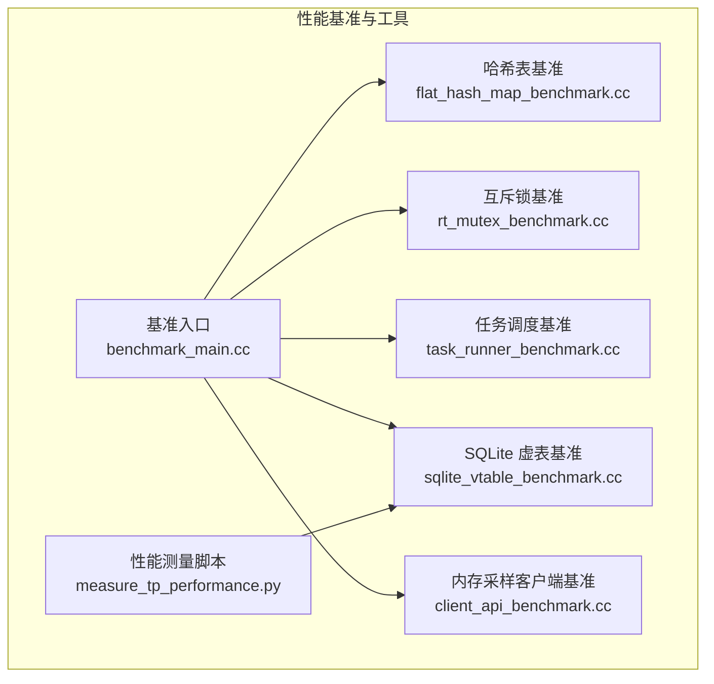
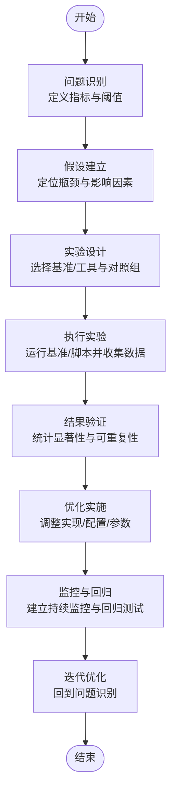
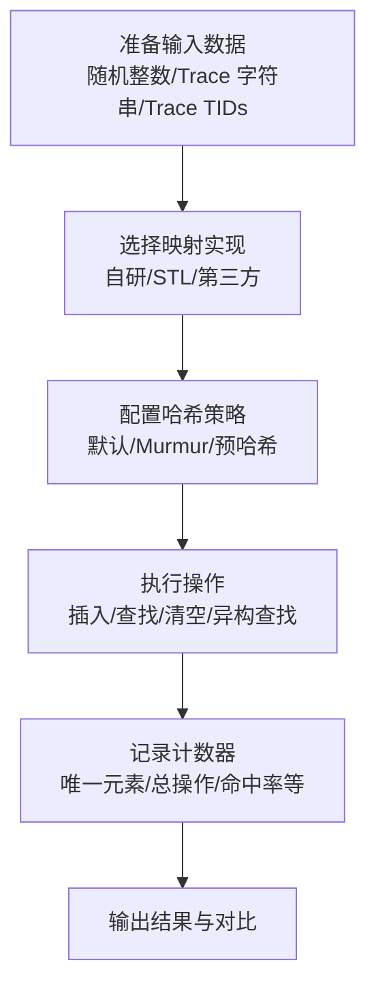
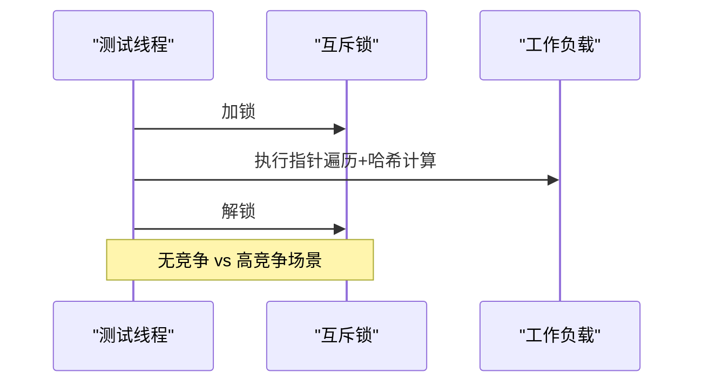
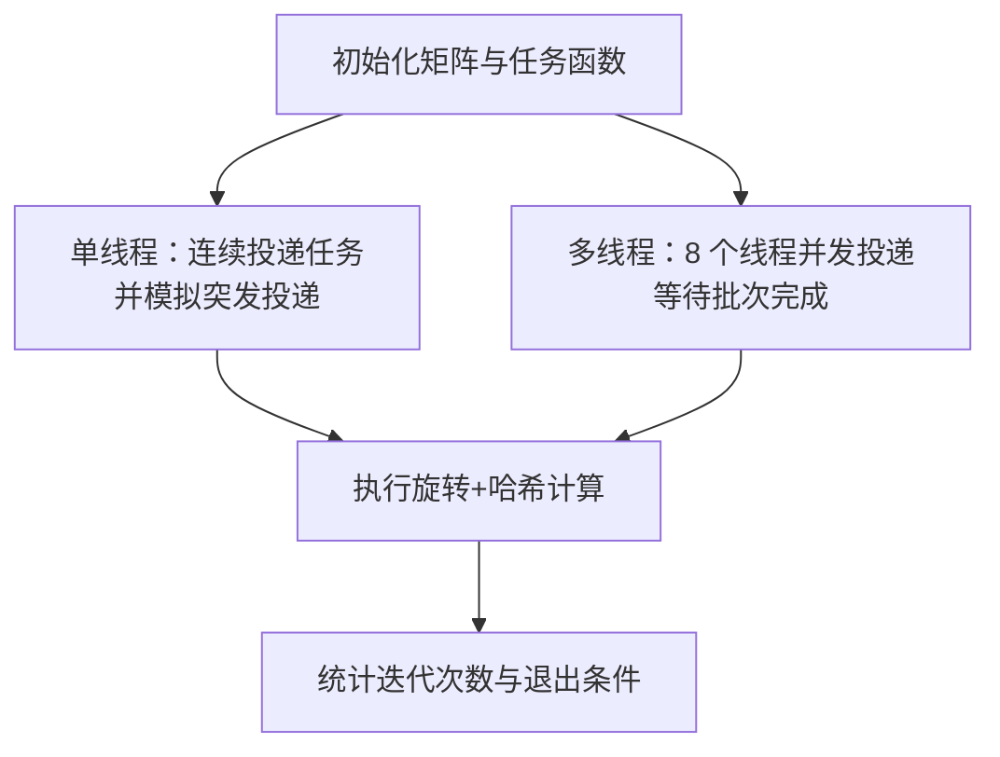
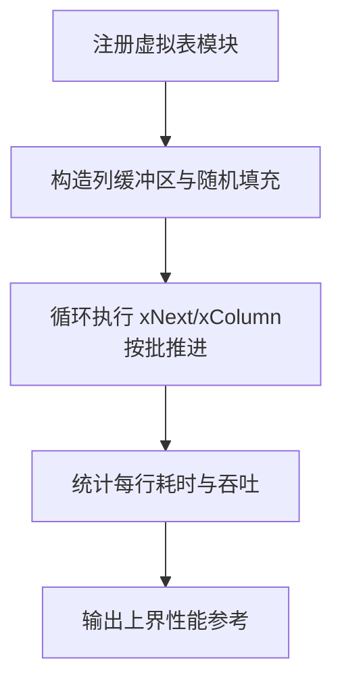
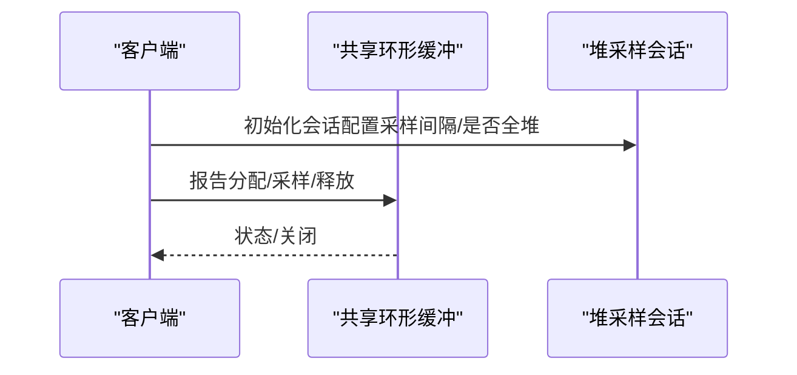
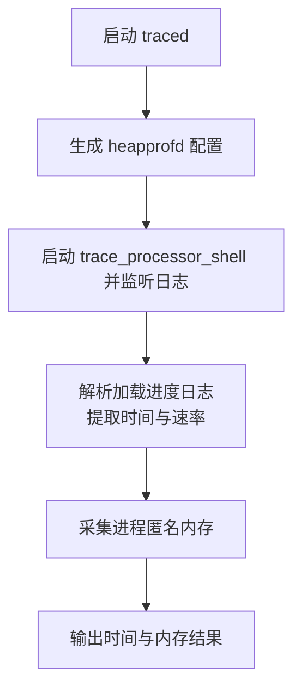
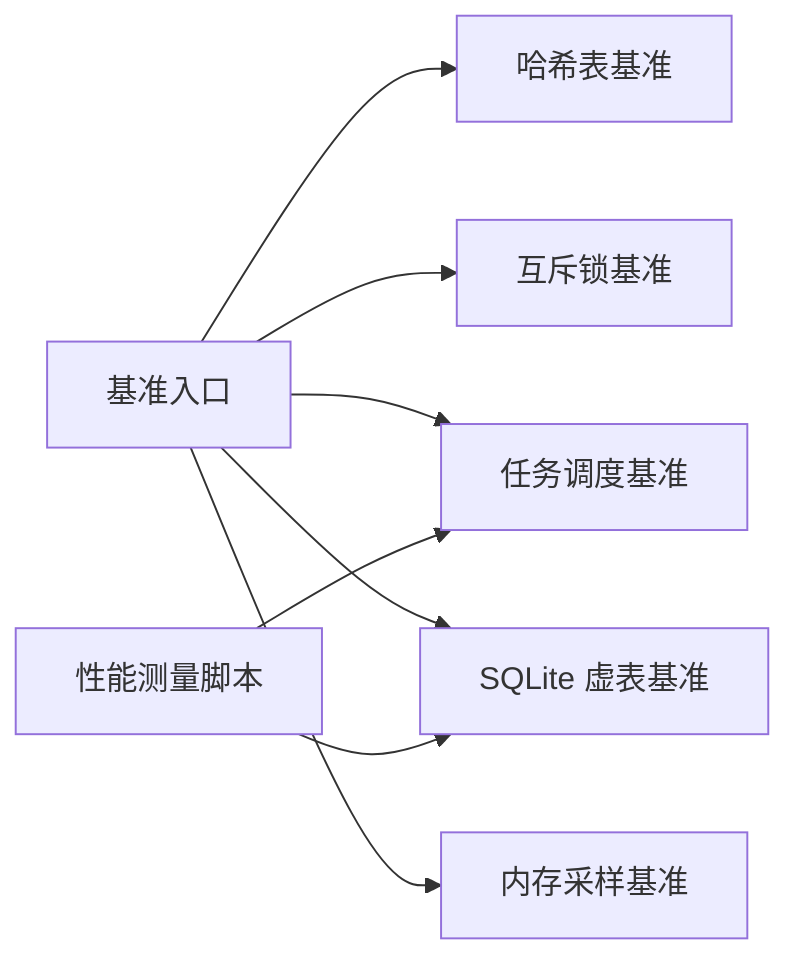

# 性能调优方法论

<cite>
**本文引用的文件**
- [README.md](file://README.md)
- [benchmark_main.cc（src/base）](file://src/base/test/benchmark_main.cc)
- [benchmark_main.cc（test）](file://test/benchmark_main.cc)
- [flat_hash_map_benchmark.cc](file://src/base/flat_hash_map_benchmark.cc)
- [rt_mutex_benchmark.cc](file://src/base/rt_mutex_benchmark.cc)
- [task_runner_benchmark.cc](file://src/base/task_runner_benchmark.cc)
- [sqlite_vtable_benchmark.cc](file://src/trace_processor/sqlite/sqlite_vtable_benchmark.cc)
- [client_api_benchmark.cc](file://src/profiling/memory/client_api_benchmark.cc)
- [measure_tp_performance.py](file://tools/measure_tp_performance.py)
</cite>

## 目录
1. [引言](#引言)
2. [项目结构](#项目结构)
3. [核心组件](#核心组件)
4. [架构总览](#架构总览)
5. [详细组件分析](#详细组件分析)
6. [依赖关系分析](#依赖关系分析)
7. [性能考量](#性能考量)
8. [故障排查指南](#故障排查指南)
9. [结论](#结论)
10. [附录](#附录)

## 引言
本方法论面向跨平台与多场景的性能调优工作，结合仓库中已有的基准测试、性能测量脚本与核心子系统，构建一套可复用的“问题识别—假设建立—实验设计—结果验证—持续优化”的闭环流程。文档强调：
- 建立标准化的性能问题诊断框架与思维模型
- 制定可量化的性能基准与评估标准
- 明确优化优先级与风险评估方法
- 提供跨平台通用原则与特殊注意事项
- 设计性能测试与回归验证方案
- 建立监控与持续优化流程
- 规范团队协作与知识传递

## 项目结构
Perfetto 是一个由多个子系统协同工作的高性能追踪与分析平台，涵盖内核/系统探针、用户态追踪 SDK、SQL 分析引擎、UI 可视化与工具链等。在性能调优方面，仓库提供了丰富的基准测试与性能测量工具，覆盖基础数据结构、并发原语、任务调度器、SQLite 虚表接口以及内存采样客户端 API 等关键路径。

图示来源
- [benchmark_main.cc（src/base）:15-17](file://src/base/test/benchmark_main.cc#L15-L17)
- [benchmark_main.cc（test）:15-17](file://test/benchmark_main.cc#L15-L17)
- [flat_hash_map_benchmark.cc:568-637](file://src/base/flat_hash_map_benchmark.cc#L568-L637)
- [rt_mutex_benchmark.cc:102-115](file://src/base/rt_mutex_benchmark.cc#L102-L115)
- [task_runner_benchmark.cc:90-147](file://src/base/task_runner_benchmark.cc#L90-L147)
- [sqlite_vtable_benchmark.cc:242-273](file://src/trace_processor/sqlite/sqlite_vtable_benchmark.cc#L242-L273)
- [client_api_benchmark.cc:90-216](file://src/profiling/memory/client_api_benchmark.cc#L90-L216)
- [measure_tp_performance.py:137-184](file://tools/measure_tp_performance.py#L137-L184)

章节来源
- [README.md: 1-101:1-101](file://README.md#L1-L101)

## 核心组件
- 基准测试框架与入口：通过 Google Benchmark 的 BENCHMARK_MAIN 宏统一启动各模块基准，确保可重复、可对比的性能测量。
- 基础设施与数据结构：哈希表、互斥锁、任务调度器等底层组件的基准，用于评估不同实现对吞吐与延迟的影响。
- SQL 引擎与虚拟表：SQLite 虚表基准用于估计上界性能，指导实际表实现的优化方向。
- 内存采样客户端：针对堆采样客户端 API 的基准，评估分配/采样开销与配置参数（如采样间隔、是否采集所有堆）对性能的影响。
- 性能测量脚本：对 trace_processor 的加载与排序阶段进行时间与内存消耗测量，并支持堆分析器集成。

章节来源
- [benchmark_main.cc（src/base）: 15-17:15-17](file://src/base/test/benchmark_main.cc#L15-L17)
- [benchmark_main.cc（test）: 15-17:15-17](file://test/benchmark_main.cc#L15-L17)
- [flat_hash_map_benchmark.cc: 568-637:568-637](file://src/base/flat_hash_map_benchmark.cc#L568-L637)
- [rt_mutex_benchmark.cc: 102-115:102-115](file://src/base/rt_mutex_benchmark.cc#L102-L115)
- [task_runner_benchmark.cc: 90-147:90-147](file://src/base/task_runner_benchmark.cc#L90-L147)
- [sqlite_vtable_benchmark.cc: 242-273:242-273](file://src/trace_processor/sqlite/sqlite_vtable_benchmark.cc#L242-L273)
- [client_api_benchmark.cc: 90-216:90-216](file://src/profiling/memory/client_api_benchmark.cc#L90-L216)
- [measure_tp_performance.py: 137-184:137-184](file://tools/measure_tp_performance.py#L137-L184)

## 架构总览
下图展示了性能调优方法论中的关键流程：从问题识别到实验设计、执行与验证，再到持续优化与回归测试。

## 详细组件分析

### 哈希表基准（flat_hash_map_benchmark）
该基准覆盖多种键类型与哈希策略（默认、MurmurHash、预哈希），并测试插入、查找、清空、碰撞与重复键等典型场景，同时支持变规模与缺失率参数化，便于评估缓存行为与哈希质量对性能的影响。

图示来源
- [flat_hash_map_benchmark.cc: 214-230:214-230](file://src/base/flat_hash_map_benchmark.cc#L214-L230)
- [flat_hash_map_benchmark.cc: 232-286:232-286](file://src/base/flat_hash_map_benchmark.cc#L232-L286)
- [flat_hash_map_benchmark.cc: 288-356:288-356](file://src/base/flat_hash_map_benchmark.cc#L288-L356)
- [flat_hash_map_benchmark.cc: 358-403:358-403](file://src/base/flat_hash_map_benchmark.cc#L358-L403)
- [flat_hash_map_benchmark.cc: 405-424:405-424](file://src/base/flat_hash_map_benchmark.cc#L405-L424)
- [flat_hash_map_benchmark.cc: 426-465:426-465](file://src/base/flat_hash_map_benchmark.cc#L426-L465)
- [flat_hash_map_benchmark.cc: 467-510:467-510](file://src/base/flat_hash_map_benchmark.cc#L467-L510)

章节来源
- [flat_hash_map_benchmark.cc: 568-637:568-637](file://src/base/flat_hash_map_benchmark.cc#L568-L637)

### 实时互斥锁基准（rt_mutex_benchmark）
该基准比较标准互斥锁与实时互斥锁（RtFutex/RtPosix）在无竞争与高竞争下的表现，帮助评估线程同步策略对延迟与吞吐的影响。

图示来源
- [rt_mutex_benchmark.cc: 36-67:36-67](file://src/base/rt_mutex_benchmark.cc#L36-L67)
- [rt_mutex_benchmark.cc: 69-100:69-100](file://src/base/rt_mutex_benchmark.cc#L69-L100)

章节来源
- [rt_mutex_benchmark.cc: 102-115:102-115](file://src/base/rt_mutex_benchmark.cc#L102-L115)

### 任务调度器基准（task_runner_benchmark）
该基准对比基于 Unix 与无锁实现的任务调度器在单线程与多线程突发提交场景下的表现，评估 PostTask 延迟与吞吐。

图示来源
- [task_runner_benchmark.cc: 56-88:56-88](file://src/base/task_runner_benchmark.cc#L56-L88)
- [task_runner_benchmark.cc: 98-147:98-147](file://src/base/task_runner_benchmark.cc#L98-L147)

章节来源
- [task_runner_benchmark.cc: 90-147:90-147](file://src/base/task_runner_benchmark.cc#L90-L147)

### SQLite 虚表基准（sqlite_vtable_benchmark）
该基准通过理想化的虚拟表实现估算 SQLite 虚表接口的“速度上限”，指导真实表实现的缓存与指针访问优化。

图示来源
- [sqlite_vtable_benchmark.cc: 132-208:132-208](file://src/trace_processor/sqlite/sqlite_vtable_benchmark.cc#L132-L208)
- [sqlite_vtable_benchmark.cc: 210-242:210-242](file://src/trace_processor/sqlite/sqlite_vtable_benchmark.cc#L210-L242)
- [sqlite_vtable_benchmark.cc: 244-273:244-273](file://src/trace_processor/sqlite/sqlite_vtable_benchmark.cc#L244-L273)

章节来源
- [sqlite_vtable_benchmark.cc: 242-273:242-273](file://src/trace_processor/sqlite/sqlite_vtable_benchmark.cc#L242-L273)

### 内存采样客户端基准（client_api_benchmark）
该基准覆盖不同采样频率、是否采集所有堆、分配/释放等场景，评估客户端 API 在不同配置下的开销。

图示来源
- [client_api_benchmark.cc: 54-69:54-69](file://src/profiling/memory/client_api_benchmark.cc#L54-L69)
- [client_api_benchmark.cc: 71-88:71-88](file://src/profiling/memory/client_api_benchmark.cc#L71-L88)
- [client_api_benchmark.cc: 92-132:92-132](file://src/profiling/memory/client_api_benchmark.cc#L92-L132)
- [client_api_benchmark.cc: 134-153:134-153](file://src/profiling/memory/client_api_benchmark.cc#L134-L153)
- [client_api_benchmark.cc: 155-174:155-174](file://src/profiling/memory/client_api_benchmark.cc#L155-L174)
- [client_api_benchmark.cc: 176-195:176-195](file://src/profiling/memory/client_api_benchmark.cc#L176-L195)
- [client_api_benchmark.cc: 197-216:197-216](file://src/profiling/memory/client_api_benchmark.cc#L197-L216)
- [client_api_benchmark.cc: 218-228:218-228](file://src/profiling/memory/client_api_benchmark.cc#L218-L228)

章节来源
- [client_api_benchmark.cc: 90-216:90-216](file://src/profiling/memory/client_api_benchmark.cc#L90-L216)

### 性能测量脚本（measure_tp_performance.py）
该脚本驱动 trace_processor 的加载过程，采集加载时间与内存占用，并支持仅排序阶段的对比，辅助评估解析与排序阶段的性能瓶颈。

图示来源
- [measure_tp_performance.py: 31-65:31-65](file://tools/measure_tp_performance.py#L31-L65)
- [measure_tp_performance.py: 68-108:68-108](file://tools/measure_tp_performance.py#L68-L108)
- [measure_tp_performance.py: 110-134:110-134](file://tools/measure_tp_performance.py#L110-L134)
- [measure_tp_performance.py: 137-184:137-184](file://tools/measure_tp_performance.py#L137-L184)

章节来源
- [measure_tp_performance.py: 137-184:137-184](file://tools/measure_tp_performance.py#L137-L184)

## 依赖关系分析
- 基准测试统一依赖 Google Benchmark 框架，通过基准入口集中管理生命周期与输出。
- 各子系统基准相互独立，但共同服务于整体性能画像：基础设施（哈希/互斥/任务调度）→ SQL 引擎（虚表上界）→ 采样客户端（内存开销）→ TraceProcessor（端到端加载与排序）。
- 测量脚本与 TraceProcessor 子系统耦合，用于端到端性能度量与内存分析。

图示来源
- [benchmark_main.cc（src/base）:15-17](file://src/base/test/benchmark_main.cc#L15-L17)
- [benchmark_main.cc（test）:15-17](file://test/benchmark_main.cc#L15-L17)
- [flat_hash_map_benchmark.cc:568-637](file://src/base/flat_hash_map_benchmark.cc#L568-L637)
- [rt_mutex_benchmark.cc:102-115](file://src/base/rt_mutex_benchmark.cc#L102-L115)
- [task_runner_benchmark.cc:90-147](file://src/base/task_runner_benchmark.cc#L90-L147)
- [sqlite_vtable_benchmark.cc:242-273](file://src/trace_processor/sqlite/sqlite_vtable_benchmark.cc#L242-L273)
- [client_api_benchmark.cc:90-216](file://src/profiling/memory/client_api_benchmark.cc#L90-L216)
- [measure_tp_performance.py:137-184](file://tools/measure_tp_performance.py#L137-L184)

## 性能考量
- 基准设计原则
  - 控制变量：每次只改变一个关键变量（如哈希策略、负载类型、竞争程度、采样频率）。
  - 参数化：使用 Range/Arg 组织不同规模与比例的测试场景。
  - 计数器：记录唯一元素、总操作数、命中率、每行耗时等关键指标。
  - 可重复性：通过固定随机种子与环境变量（如 BENCHMARK_FUNCTIONAL_TEST_ONLY）保证结果稳定。
- 工具组合策略
  - 基础设施层：哈希表、互斥锁、任务调度器基准用于评估底层开销。
  - 引擎层：SQLite 虚表基准用于估计上界，指导真实实现的缓存与指针优化。
  - 应用层：内存采样客户端基准评估不同配置的开销。
  - 端到端：trace_processor 性能测量脚本评估加载与排序阶段的整体表现。
- 评估标准
  - 时间：加载/排序/查询/采样的平均/分位耗时。
  - 吞吐：每秒处理行数/操作数。
  - 内存：匿名内存峰值、驻留集大小。
  - 稳定性：多次运行的标准差与异常检测。
- 优先级排序
  - 首选影响面大且成本低的优化（如减少不必要的哈希、降低锁粒度）。
  - 其次是热点路径的算法/数据结构优化（如改进哈希探测或采用更合适的容器）。
  - 最后是系统级优化（如 I/O、内存映射、批处理策略）。
- 风险评估
  - 回归风险：通过回归测试与基线对比，确保优化不引入新问题。
  - 平台差异：关注不同平台的编译器、库版本与内核特性带来的差异。
  - 配置敏感性：对采样频率、批大小等参数进行敏感性分析，给出推荐范围。

## 故障排查指南
- 基准未运行或跳过
  - 检查环境变量与外部数据文件是否存在（如 trace_strings、tids 文件）。
  - 确认第三方库开关（如比较第三方库）是否正确配置。
- 结果不稳定
  - 使用固定随机种子与稳定的硬件环境；必要时启用功能测试模式以缩短运行时间。
- 端到端测量失败
  - 确保 traced、trace_processor_shell 正常启动，检查日志正则匹配是否成功。
  - 关闭现有服务后再运行，避免资源冲突。

章节来源
- [flat_hash_map_benchmark.cc: 163-188:163-188](file://src/base/flat_hash_map_benchmark.cc#L163-L188)
- [flat_hash_map_benchmark.cc: 253-263:253-263](file://src/base/flat_hash_map_benchmark.cc#L253-L263)
- [measure_tp_performance.py: 31-65:31-65](file://tools/measure_tp_performance.py#L31-L65)
- [measure_tp_performance.py: 163-172:163-172](file://tools/measure_tp_performance.py#L163-L172)

## 结论
通过将仓库中的基准测试与性能测量脚本系统化地应用于问题诊断与优化验证，可以形成一套可复制、可扩展的性能调优方法论。建议在团队内部推广该流程，结合持续集成与回归测试，确保优化成果的长期稳定性与可维护性。

## 附录
- 基准入口与运行
  - 基准入口宏统一管理生命周期与输出。
- 基准组织方式
  - 使用模板化实现不同容器/策略的对比。
  - 使用参数化接口控制规模与比例。
- 端到端测量
  - 通过脚本驱动 trace_processor，采集时间与内存指标，支持仅排序阶段对比。

章节来源
- [benchmark_main.cc（src/base）: 15-17:15-17](file://src/base/test/benchmark_main.cc#L15-L17)
- [benchmark_main.cc（test）: 15-17:15-17](file://test/benchmark_main.cc#L15-L17)
- [flat_hash_map_benchmark.cc: 518-563:518-563](file://src/base/flat_hash_map_benchmark.cc#L518-L563)
- [sqlite_vtable_benchmark.cc: 46-60:46-60](file://src/trace_processor/sqlite/sqlite_vtable_benchmark.cc#L46-L60)
- [measure_tp_performance.py: 137-184:137-184](file://tools/measure_tp_performance.py#L137-L184)