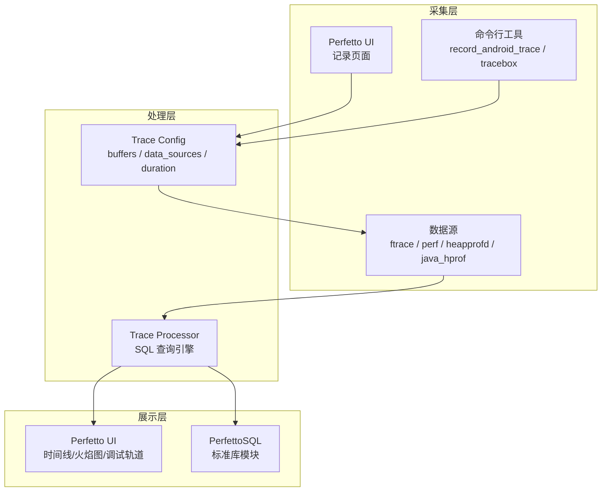
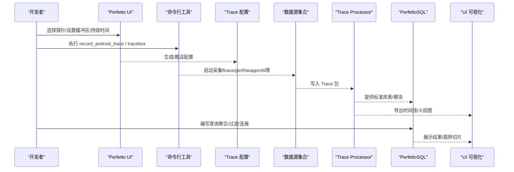
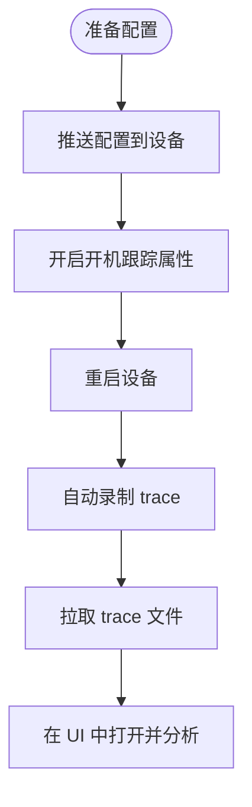
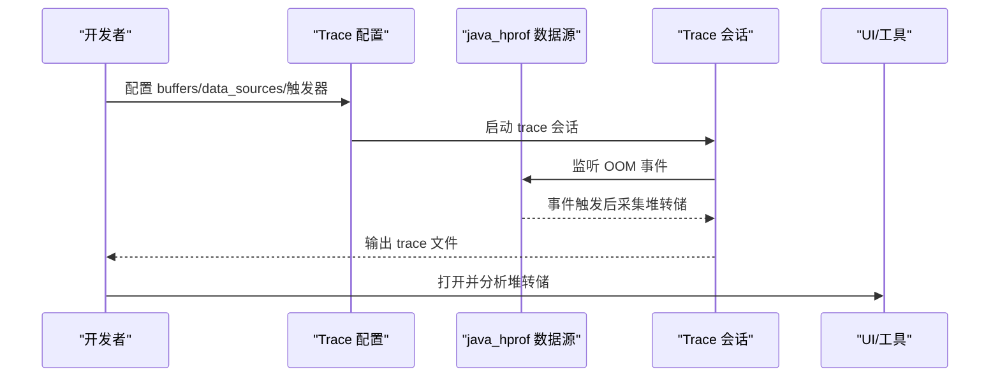
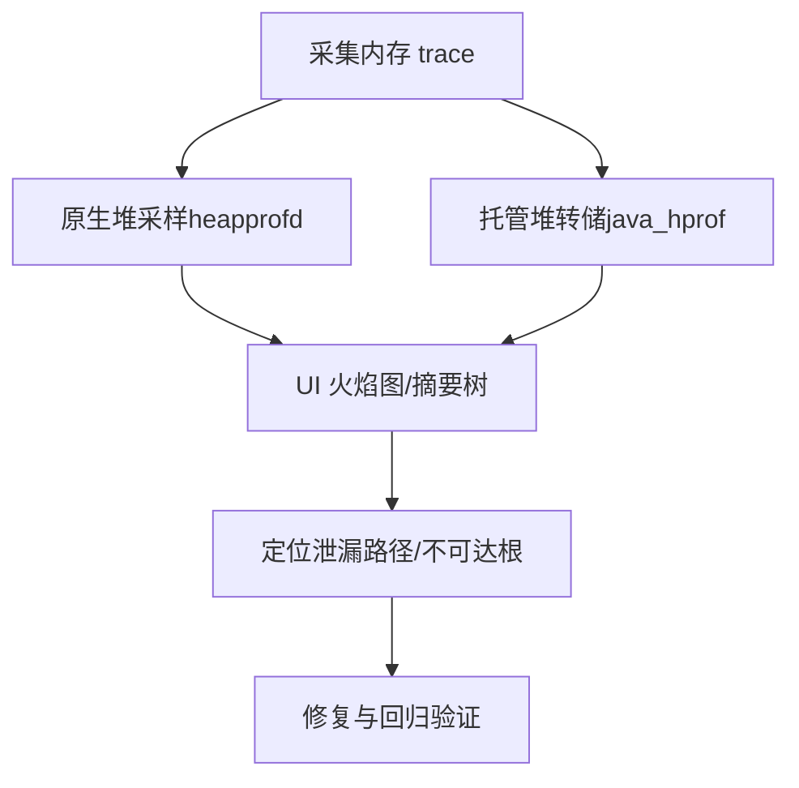
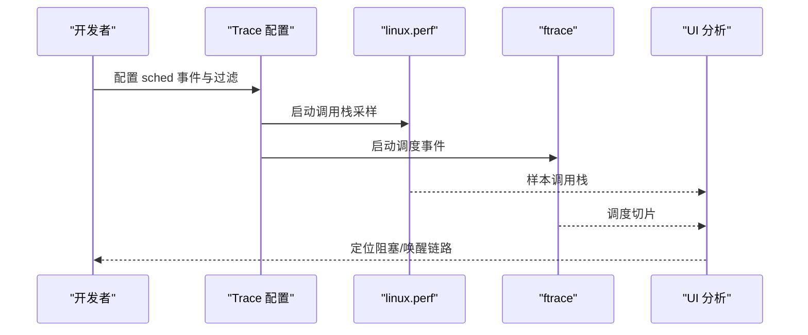
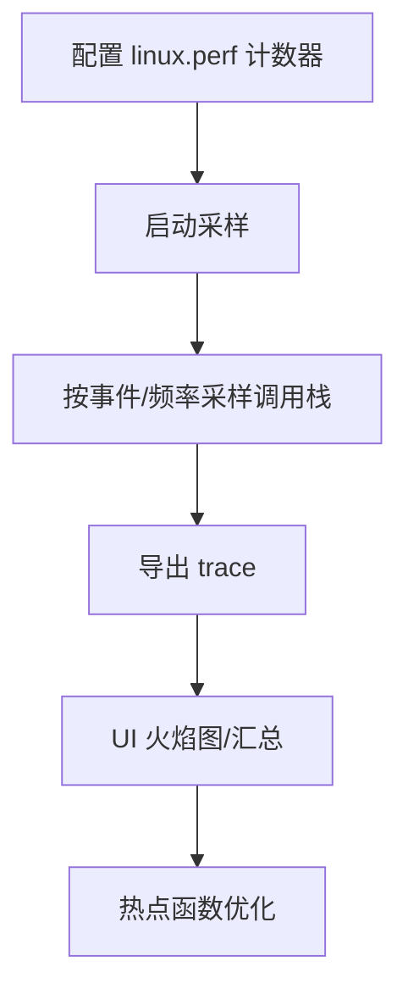
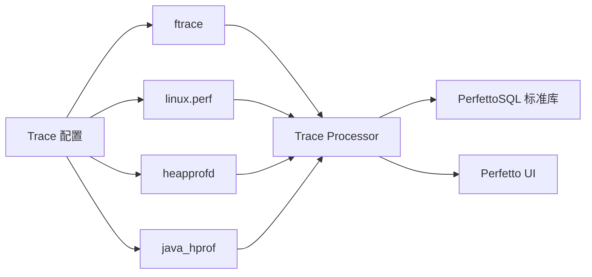

# 案例研究和最佳实践

<cite>
**本文引用的文件**
- [android-boot-tracing.md](file://docs/case-studies/android-boot-tracing.md)
- [android-outofmemoryerror.md](file://docs/case-studies/android-outofmemoryerror.md)
- [memory.md](file://docs/case-studies/memory.md)
- [scheduling-blockages.md](file://docs/case-studies/scheduling-blockages.md)
- [system-tracing.md](file://docs/getting-started/system-tracing.md)
- [android-trace-analysis.md](file://docs/getting-started/android-trace-analysis.md)
- [memory-profiling.md](file://docs/getting-started/memory-profiling.md)
- [cpu-profiling.md](file://docs/getting-started/cpu-profiling.md)
- [native-heap-profiler.md](file://docs/data-sources/native-heap-profiler.md)
- [java-heap-profiler.md](file://docs/data-sources/java-heap-profiler.md)
- [scheduling.cfg](file://test/configs/scheduling.cfg)
- [heapprofd.cfg](file://test/configs/heapprofd.cfg)
- [java_hprof.cfg](file://test/configs/java_hprof.cfg)
- [heap_profile](file://tools/heap_profile)
- [cpu_profile](file://tools/cpu_profile)
</cite>

## 目录
1. [引言](#引言)
2. [项目结构](#项目结构)
3. [核心组件](#核心组件)
4. [架构总览](#架构总览)
5. [详细案例分析](#详细案例分析)
6. [依赖关系分析](#依赖关系分析)
7. [性能考量](#性能考量)
8. [故障排除指南](#故障排除指南)
9. [结论](#结论)
10. [附录](#附录)

## 引言
本文件面向使用 Perfetto 的工程师与性能工程师，提供系统化的案例研究与最佳实践。内容覆盖 Android 应用性能优化、系统级性能诊断、内存泄漏检测与 CPU 瓶颈分析等典型场景，配套可复现的步骤、配置与工具，帮助读者快速定位问题、制定调优方案，并形成可迁移的方法论。

## 项目结构
Perfetto 提供了从“记录-可视化-查询-分析”的完整链路：通过 UI 或命令行工具采集 trace，借助 Trace Processor 与 PerfettoSQL 进行结构化分析，再结合 UI 可视化进行深入洞察。官方文档中包含多类“案例研究”与“入门指南”，涵盖系统跟踪、内存分析、CPU 分析、调度阻塞等主题；同时提供了多种数据源（如 heapprofd、java heap dump、ftrace、perf 等）与配置样例，便于按需组合。

章节来源
- [system-tracing.md: 22-171:22-171](file://docs/getting-started/system-tracing.md#L22-L171)
- [scheduling.cfg: 1-42:1-42](file://test/configs/scheduling.cfg#L1-L42)

## 核心组件
- 数据源与配置
  - 调度与内核事件：ftrace（如 sched_switch、sched_waking）、进程统计（process_stats）
  - 内存分析：heapprofd（原生堆采样）、java heap dump（托管堆转储）
  - 性能计数器与调用栈采样：linux.perf（基于硬件事件或软件时钟）
- 工具与脚本
  - 命令行：record_android_trace、tracebox、traceconv
  - Python 辅助：heap_profile、cpu_profile
- 分析与可视化
  - Trace Processor + PerfettoSQL
  - UI 时间线、火焰图、调试轨道（Debug Tracks）

章节来源
- [native-heap-profiler.md: 50-90:50-90](file://docs/data-sources/native-heap-profiler.md#L50-L90)
- [java-heap-profiler.md: 85-102:85-102](file://docs/data-sources/java-heap-profiler.md#L85-L102)
- [cpu-profiling.md: 19-100:19-100](file://docs/getting-started/cpu-profiling.md#L19-L100)
- [system-tracing.md: 154-171:154-171](file://docs/getting-started/system-tracing.md#L154-L171)

## 架构总览
下图展示了从配置到采集、处理与可视化的端到端流程，以及关键数据源与工具之间的交互关系。

图表来源
- [system-tracing.md: 22-171:22-171](file://docs/getting-started/system-tracing.md#L22-L171)
- [cpu-profiling.md: 173-256:173-256](file://docs/getting-started/cpu-profiling.md#L173-L256)
- [memory-profiling.md: 66-157:66-157](file://docs/getting-started/memory-profiling.md#L66-L157)

## 详细案例分析

### 案例一：Android 启动阶段跟踪与分析
- 背景
  - 自 Android 13 起，可在设备启动时自动开始录制系统跟踪，用于分析启动路径上的调度、进程生命周期与关键事件。
- 问题识别
  - 启动卡顿、关键服务延迟、调度阻塞等问题。
- 分析方法
  - 使用文本格式的 Trace 配置，启用 ftrace 的调度事件与进程统计，设置合理缓冲区与持续时间。
  - 通过 UI 打开输出 trace，观察调度切片、进程状态与关键事件序列。
- 解决方案
  - 结合调度事件与进程统计，定位阻塞点与热点线程；必要时扩展配置以包含更多内核事件或用户空间注解。
- 步骤与要点
  - 准备配置文件并推送到设备指定路径
  - 开启开机自动跟踪属性
  - 重启设备后拉取 trace 并在 UI 中打开
- 参考
  - 配置示例与步骤详见“Android 启动跟踪”文档

图表来源
- [android-boot-tracing.md: 6-69:6-69](file://docs/case-studies/android-boot-tracing.md#L6-L69)

章节来源
- [android-boot-tracing.md: 1-80:1-80](file://docs/case-studies/android-boot-tracing.md#L1-L80)

### 案例二：OOM 场景下的 Java 堆转储采集
- 背景
  - 自 Android 14 起，可配置在发生 java.lang.OutOfMemoryError 时自动采集堆转储，辅助定位内存泄漏。
- 问题识别
  - 应用频繁崩溃、内存占用异常升高。
- 分析方法
  - 使用工具脚本或命令行参数配置 heapprofd 的触发模式与超时，等待 OOM 事件触发后停止并导出堆转储。
- 解决方案
  - 通过堆转储火焰图与最短/支配树分析，定位持有对象的路径与类型，修复长生命周期持有或未释放资源。
- 步骤与要点
  - 配置 buffers、data_sources（含 android.java_hprof）、触发器与超时
  - 等待 OOM 触发并拉取转储文件
- 参考
  - OOM 堆转储采集与触发配置详见文档

图表来源
- [android-outofmemoryerror.md: 6-57:6-57](file://docs/case-studies/android-outofmemoryerror.md#L6-L57)

章节来源
- [android-outofmemoryerror.md: 1-58:1-58](file://docs/case-studies/android-outofmemoryerror.md#L1-L58)

### 案例三：内存使用与泄漏排查（原生与托管堆）
- 背景
  - 需要区分匿名内存、文件映射内存与垃圾回收影响，结合 heapprofd 与 Java 堆转储进行综合分析。
- 问题识别
  - RSS 高水位波动、低内存回收（LMK）风险、特定场景内存尖峰。
- 分析方法
  - 使用 ftrace 事件（如 mm_event、rss_stat、lowmemory_kill）与进程统计，配合 heapprofd 与 Java 堆转储，分别定位原生与托管堆的泄漏路径。
- 解决方案
  - 对原生堆：通过 heapprofd 火焰图定位未释放分配；对托管堆：通过堆转储火焰图与支配树定位不可达根路径。
- 步骤与要点
  - 采集内存 trace（ftrace + process_stats）
  - 使用 heapprofd 与 java_heap_dump 采集快照
  - 在 UI 中查看火焰图与调试轨道，结合 SQL 聚合分析
- 参考
  - 内存分析与堆转储采集详见“内存使用”与“内存分析”文档

图表来源
- [memory.md: 172-301:172-301](file://docs/case-studies/memory.md#L172-L301)
- [memory-profiling.md: 66-157:66-157](file://docs/getting-started/memory-profiling.md#L66-L157)
- [java-heap-profiler.md: 16-40:16-40](file://docs/data-sources/java-heap-profiler.md#L16-L40)

章节来源
- [memory.md: 1-553:1-553](file://docs/case-studies/memory.md#L1-L553)
- [memory-profiling.md: 1-515:1-515](file://docs/getting-started/memory-profiling.md#L1-L515)
- [java-heap-profiler.md: 1-102:1-102](file://docs/data-sources/java-heap-profiler.md#L1-L102)

### 案例四：调度阻塞与锁竞争分析（基于调用栈采样）
- 背景
  - 主线程动画卡顿，怀疑由锁竞争或优先级反转导致的调度阻塞。
- 问题识别
  - 动画帧间断、主线程 deschedule、唤醒链路不清晰。
- 分析方法
  - 使用 linux.perf 在 sched_switch/sched_waking 上采样调用栈，结合 ftrace 与进程统计，精确定位阻塞点与唤醒者。
- 解决方案
  - 通过“关键路径”与“唤醒者”回溯，识别锁实现细节与线程亲和性问题，优化锁策略或线程调度。
- 步骤与要点
  - 配置 linux.perf 与 ftrace，设置过滤仅关注目标线程
  - 在 UI 中点击阻塞/唤醒切片，查看调用栈
  - 使用“关键路径 lite”快速梳理事件链
- 参考
  - 调度阻塞分析与配置详见“调度阻塞”文档

图表来源
- [scheduling-blockages.md: 400-473:400-473](file://docs/case-studies/scheduling-blockages.md#L400-L473)
- [scheduling.cfg: 8-38:8-38](file://test/configs/scheduling.cfg#L8-L38)

章节来源
- [scheduling-blockages.md: 1-502:1-502](file://docs/case-studies/scheduling-blockages.md#L1-L502)
- [scheduling.cfg: 1-42:1-42](file://test/configs/scheduling.cfg#L1-L42)

### 案例五：CPU 瓶颈与热点函数定位
- 背景
  - CPU 占用高、指令/缓存事件异常，需要基于硬件计数器的调用栈采样定位热点。
- 问题识别
  - CPU 利用率高、缓存命中率低、热路径集中在特定函数。
- 分析方法
  - 使用 linux.perf 基于硬件事件（如 HW_INSTRUCTIONS、HW_CACHE_MISSES）采样调用栈，结合调度与频率数据源，定位热点切片与热函数。
- 解决方案
  - 通过火焰图与 SQL 聚合，识别热函数与调用链，优化算法、减少分支预测失败或缓存抖动。
- 步骤与要点
  - 配置 linux.perf 计数器与采样频率
  - 设置目标进程范围，避免过度解码成本
  - 使用 UI 火焰图与 SQL 汇总分析
- 参考
  - CPU 采样与性能计数器详见“CPU 分析”文档

图表来源
- [cpu-profiling.md: 173-256:173-256](file://docs/getting-started/cpu-profiling.md#L173-L256)

章节来源
- [cpu-profiling.md: 1-452:1-452](file://docs/getting-started/cpu-profiling.md#L1-L452)

## 依赖关系分析
- 组件耦合
  - Trace 配置驱动数据源采集，Trace Processor 将原始包解析为结构化表，UI 与 SQL 查询共同完成分析。
- 关键依赖
  - heapprofd 依赖 Android 版本与 SELinux 策略；java heap dump 依赖 ART 版本。
  - linux.perf 采样受 PMU 能力限制，需注意事件组复用与采样频率。
- 外部集成
  - UI 与 Trace Processor 通过标准库模块提供统一查询接口；traceconv 支持符号化与 pprof 转换。

图表来源
- [native-heap-profiler.md: 50-90:50-90](file://docs/data-sources/native-heap-profiler.md#L50-L90)
- [java-heap-profiler.md: 85-102:85-102](file://docs/data-sources/java-heap-profiler.md#L85-L102)
- [cpu-profiling.md: 19-100:19-100](file://docs/getting-started/cpu-profiling.md#L19-L100)

章节来源
- [native-heap-profiler.md: 507-561:507-561](file://docs/data-sources/native-heap-profiler.md#L507-L561)
- [java-heap-profiler.md: 30-50:30-50](file://docs/data-sources/java-heap-profiler.md#L30-L50)
- [cpu-profiling.md: 41-47:41-47](file://docs/getting-started/cpu-profiling.md#L41-L47)

## 性能考量
- 采样与开销平衡
  - heapprofd 采样间隔越大，开销越低但精度下降；建议先用默认间隔，再根据负载调优。
  - linux.perf 事件组数量受限，避免同时监控过多硬件事件导致复用与漏计。
- 缓冲区与填充策略
  - 长时间 trace 建议使用环形缓冲区（RING_BUFFER），避免丢包；短时高频 trace 使用 DISCARD 并增大缓冲区。
- 符号化与去混淆
  - 提前准备二进制符号与 ProGuard 映射，提升火焰图可读性与可追溯性。
- 并发会话与目标进程
  - 多会话并发时注意 heapprofd 的并发限制与拒绝提示，必要时清理残留会话。

章节来源
- [native-heap-profiler.md: 142-158:142-158](file://docs/data-sources/native-heap-profiler.md#L142-L158)
- [native-heap-profiler.md: 395-462:395-462](file://docs/data-sources/native-heap-profiler.md#L395-L462)
- [cpu-profiling.md: 41-47:41-47](file://docs/getting-started/cpu-profiling.md#L41-L47)

## 故障排除指南
- heapprofd 常见问题
  - 空快照：检查目标进程是否允许被采样（SELinux/构建类型），确认采样间隔与缓冲区大小。
  - 调用栈不完整：检查库是否具备必要的调试帧信息（.eh_frame 等）。
- OOM 堆转储未触发
  - 确认触发器配置与超时设置；确保 ART 版本满足要求。
- 调度阻塞分析误报
  - 检查过滤条件是否过于宽泛；必要时缩小到具体线程或命令行。
- CPU 采样无效
  - 检查 PMU 事件可用性与事件组复用；降低采样频率或减少事件数量。

章节来源
- [native-heap-profiler.md: 395-462:395-462](file://docs/data-sources/native-heap-profiler.md#L395-L462)
- [android-outofmemoryerror.md: 6-57:6-57](file://docs/case-studies/android-outofmemoryerror.md#L6-L57)
- [scheduling-blockages.md: 475-501:475-501](file://docs/case-studies/scheduling-blockages.md#L475-L501)
- [cpu-profiling.md: 41-47:41-47](file://docs/getting-started/cpu-profiling.md#L41-L47)

## 结论
通过系统化的案例与工具链，Perfetto 能够覆盖从启动跟踪、内存泄漏、调度阻塞到 CPU 瓶颈的全场景性能问题。建议在日常开发中：
- 建立标准化 trace 配置模板，按场景组合数据源；
- 将 UI 与 SQL 查询结合，形成“可视化 + 结构化分析”的闭环；
- 注重可复现性与可追溯性（符号化、去混淆、配置版本化）；
- 将成功案例沉淀为团队规范，避免重复踩坑。

## 附录
- 可复现示例与测试数据
  - 调度跟踪配置样例：[scheduling.cfg](file://test/configs/scheduling.cfg)
  - heapprofd 配置样例：[heapprofd.cfg](file://test/configs/heapprofd.cfg)
  - Java 堆转储配置样例：[java_hprof.cfg](file://test/configs/java_hprof.cfg)
- 工具脚本
  - 原生堆采样：[heap_profile](file://tools/heap_profile)
  - CPU 采样与符号化：[cpu_profile](file://tools/cpu_profile)
- 进一步阅读
  - 系统跟踪入门：[system-tracing.md](file://docs/getting-started/system-tracing.md)
  - Android 跟踪分析手册：[android-trace-analysis.md](file://docs/getting-started/android-trace-analysis.md)
  - 内存分析与堆采样：[memory-profiling.md](file://docs/getting-started/memory-profiling.md)
  - CPU 采样与性能计数器：[cpu-profiling.md](file://docs/getting-started/cpu-profiling.md)