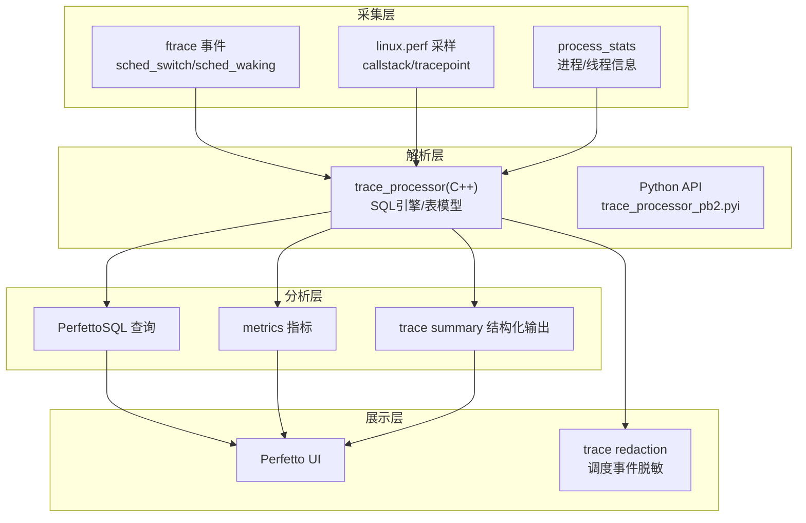
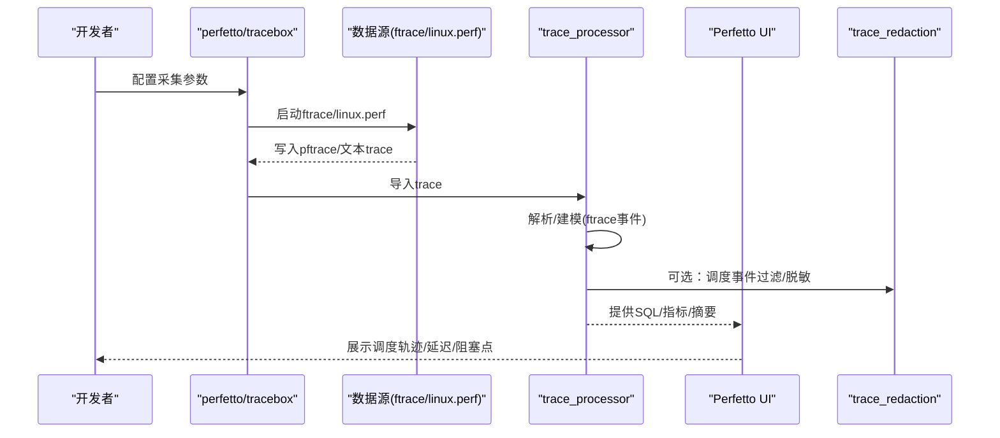
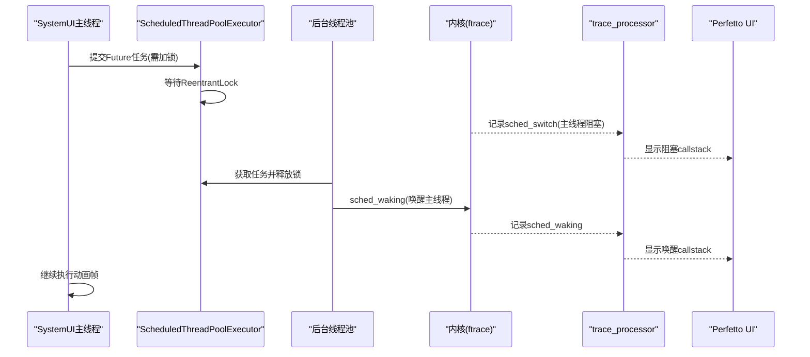
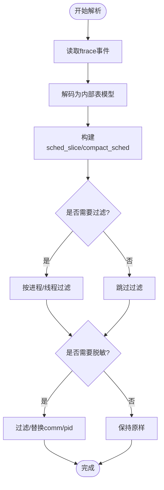
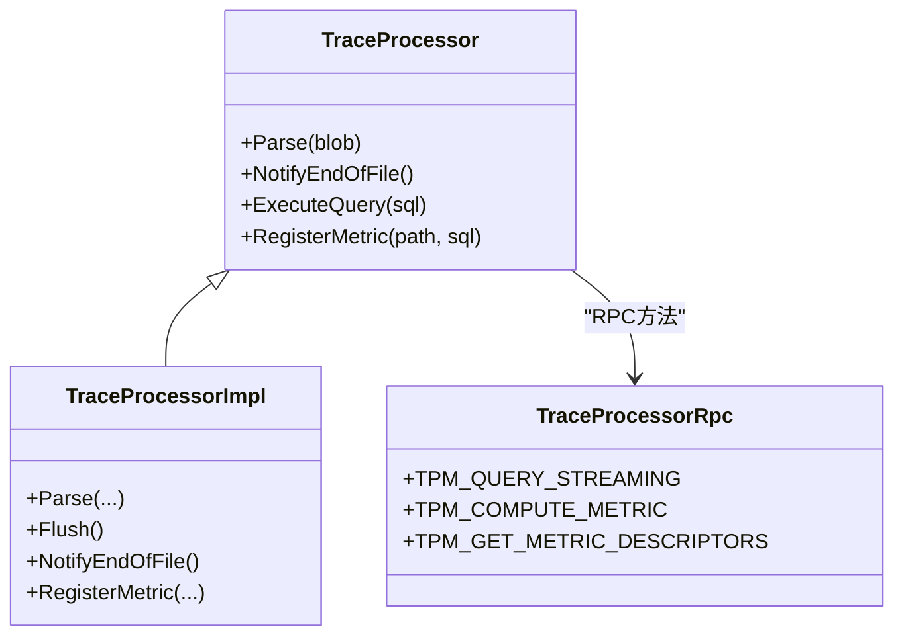
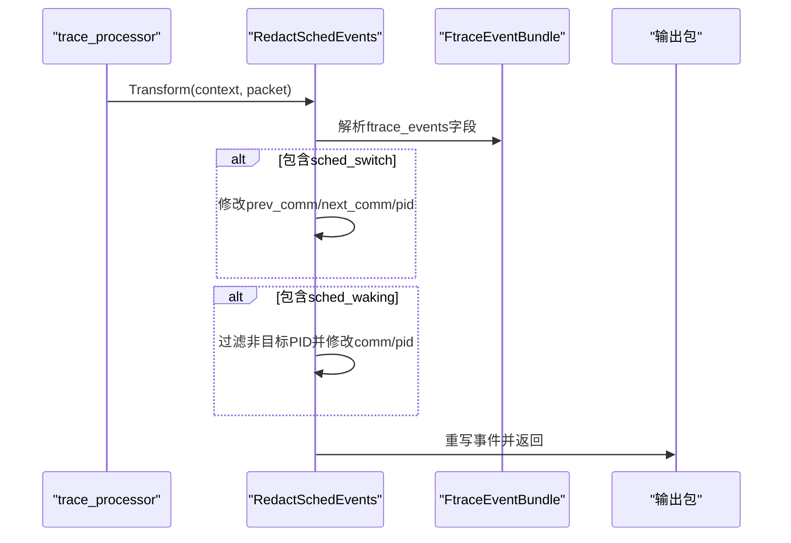
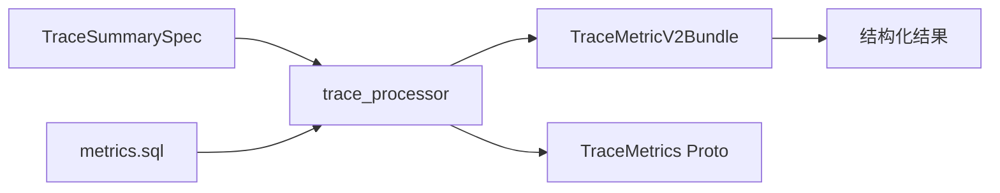
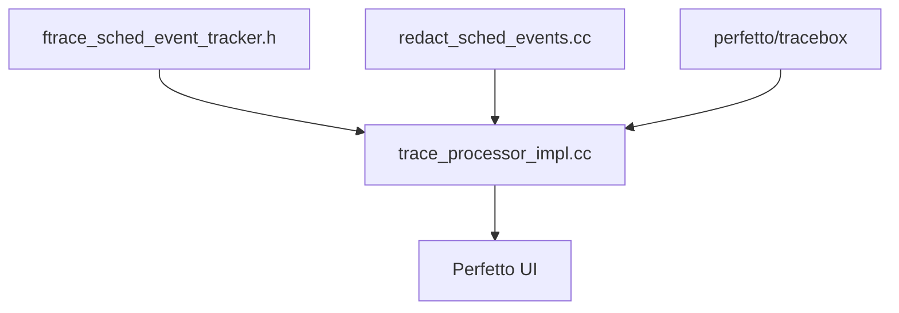

# 系统性能分析案例

<cite>
**本文引用的文件**
- [scheduling-blockages.md](file://docs/case-studies/scheduling-blockages.md)
- [ftrace.md](file://docs/getting-started/ftrace.md)
- [cpu-scheduling.md](file://docs/data-sources/cpu-scheduling.md)
- [system-tracing.md](file://docs/getting-started/system-tracing.md)
- [trace-processor.md](file://docs/analysis/trace-processor.md)
- [metrics.md](file://docs/analysis/metrics.md)
- [trace-summary.md](file://docs/analysis/trace-summary.md)
- [perfetto-cli.md](file://docs/reference/perfetto-cli.md)
- [ftrace_sched_event_tracker.h](file://src/trace_processor/importers/ftrace/ftrace_sched_event_tracker.h)
- [redact_sched_events.cc](file://src/trace_redaction/redact_sched_events.cc)
- [redact_sched_events.h](file://src/trace_redaction/redact_sched_events.h)
- [trace_processor_impl.cc](file://src/trace_processor/trace_processor_impl.cc)
- [trace_processor_pb2.pyi](file://python/perfetto/bigtrace/protos/perfetto/trace_processor/trace_processor_pb2.pyi)
- [trace_processor_shell_integrationtest.cc](file://src/trace_processor/trace_database_integrationtest.cc)
- [scoped_sched_boost_unittest.cc](file://src/base/scoped_sched_boost_unittest.cc)
</cite>

## 目录
1. [引言](#引言)
2. [项目结构](#项目结构)
3. [核心组件](#核心组件)
4. [架构总览](#架构总览)
5. [详细组件分析](#详细组件分析)
6. [依赖关系分析](#依赖关系分析)
7. [性能考量](#性能考量)
8. [故障排查指南](#故障排查指南)
9. [结论](#结论)
10. [附录](#附录)

## 引言
本案例研究围绕系统级性能分析中的CPU调度阻塞问题展开，结合ftrace内核跟踪与Perfetto的trace采集、解析与可视化能力，提供从数据采集到瓶颈定位、根因分析与优化建议的完整流程。我们将重点覆盖以下主题：
- 进程调度延迟与上下文切换开销分析
- 调度器事件（sched_switch、sched_waking）的采集与解读
- 高负载下调度竞争、I/O等待与中断处理延迟的识别
- CPU亲和性与线程优先级对调度行为的影响
- 基于callstack采样的精确阻塞点定位
- trace redaction在隐私保护场景下的调度事件过滤与脱敏
- trace summarization与metrics在大规模回归检测中的应用

## 项目结构
本仓库以“trace采集—解析—查询—可视化—总结”的分层架构组织，围绕ftrace调度事件与系统trace进行性能分析。关键路径如下：
- 数据采集：ftrace、linux.perf、process_stats等数据源
- 解析与建模：trace_processor（C++）与Python API
- 查询与指标：PerfettoSQL、metrics、trace summary
- 可视化：Perfetto UI
- 性能优化与脱敏：trace redaction

图示来源
- [ftrace.md:1-758](file://docs/getting-started/ftrace.md#L1-L758)
- [cpu-scheduling.md:1-182](file://docs/data-sources/cpu-scheduling.md#L1-L182)
- [trace-processor.md:1-226](file://docs/analysis/trace-processor.md#L1-L226)
- [metrics.md:1-578](file://docs/analysis/metrics.md#L1-L578)
- [trace-summary.md:1-800](file://docs/analysis/trace-summary.md#L1-L800)

章节来源
- [ftrace.md:1-758](file://docs/getting-started/ftrace.md#L1-L758)
- [cpu-scheduling.md:1-182](file://docs/data-sources/cpu-scheduling.md#L1-L182)
- [system-tracing.md:1-302](file://docs/getting-started/system-tracing.md#L1-L302)
- [trace-processor.md:1-226](file://docs/analysis/trace-processor.md#L1-L226)
- [metrics.md:1-578](file://docs/analysis/metrics.md#L1-L578)
- [trace-summary.md:1-800](file://docs/analysis/trace-summary.md#L1-L800)

## 核心组件
- ftrace调度事件采集与解析
  - sched_switch：上下文切换事件，记录前/后进程、状态、优先级等
  - sched_waking：唤醒事件，记录被唤醒线程、目标CPU、优先级等
- trace_processor：统一解析trace，暴露PerfettoSQL接口，支持metrics与trace summary
- trace redaction：对调度事件进行过滤与脱敏，保护隐私
- Perfetto UI：交互式可视化与探索
- perfetto命令行与tracebox：trace采集与转换工具

章节来源
- [cpu-scheduling.md:1-182](file://docs/data-sources/cpu-scheduling.md#L1-L182)
- [ftrace.md:1-758](file://docs/getting-started/ftrace.md#L1-L758)
- [trace-processor.md:1-226](file://docs/analysis/trace-processor.md#L1-L226)
- [redact_sched_events.cc:1-627](file://src/trace_redaction/redact_sched_events.cc#L1-L627)

## 架构总览
下图展示了从ftrace事件采集到调度器分析与可视化的关键路径，以及trace redaction在其中的作用。

图示来源
- [system-tracing.md:1-302](file://docs/getting-started/system-tracing.md#L1-L302)
- [ftrace.md:1-758](file://docs/getting-started/ftrace.md#L1-L758)
- [trace-processor.md:1-226](file://docs/analysis/trace-processor.md#L1-L226)
- [redact_sched_events.cc:1-627](file://src/trace_redaction/redact_sched_events.cc#L1-L627)

## 详细组件分析

### 组件A：调度阻塞案例（基于sched_switch/sched_waking）
本案例聚焦于Android SystemUI主线程在拉起通知面板时出现1-10ms卡顿的问题。通过在sched_switch与sched_waking事件上触发callstack采样，精确定位阻塞与唤醒路径，最终发现ReentrantLock导致的优先级反转与唤醒策略不当。

图示来源
- [scheduling-blockages.md:1-502](file://docs/case-studies/scheduling-blockages.md#L1-L502)
- [cpu-scheduling.md:1-182](file://docs/data-sources/cpu-scheduling.md#L1-L182)

章节来源
- [scheduling-blockages.md:1-502](file://docs/case-studies/scheduling-blockages.md#L1-L502)
- [cpu-scheduling.md:1-182](file://docs/data-sources/cpu-scheduling.md#L1-L182)

### 组件B：ftrace调度事件解析与建模
trace_processor负责将原始ftrace事件解析为结构化表，从而支持SQL查询与UI可视化。关键点包括：
- sched_slice表：记录每个线程的运行切片、结束状态、CPU、优先级等
- compact_sched：压缩编码的调度事件，提升吞吐
- 过滤与脱敏：仅保留目标进程/线程的调度事件，降低噪声

图示来源
- [cpu-scheduling.md:1-182](file://docs/data-sources/cpu-scheduling.md#L1-L182)
- [redact_sched_events.cc:1-627](file://src/trace_redaction/redact_sched_events.cc#L1-L627)

章节来源
- [cpu-scheduling.md:1-182](file://docs/data-sources/cpu-scheduling.md#L1-L182)
- [redact_sched_events.cc:1-627](file://src/trace_redaction/redact_sched_events.cc#L1-L627)

### 组件C：trace_processor实现与查询执行
trace_processor以C++实现，提供Parse/NotifyEndOfFile/ExecuteQuery等核心接口；Python API通过trace_processor_pb2.pyi暴露RPC方法，支持流式查询与指标计算。

图示来源
- [trace_processor_impl.cc:664-1027](file://src/trace_processor/trace_processor_impl.cc#L664-L1027)
- [trace_processor_pb2.pyi:22-36](file://python/perfetto/bigtrace/protos/perfetto/trace_processor/trace_processor_pb2.pyi#L22-L36)

章节来源
- [trace-processor.md:1-226](file://docs/analysis/trace-processor.md#L1-L226)
- [trace_processor_impl.cc:664-1027](file://src/trace_processor/trace_processor_impl.cc#L664-L1027)
- [trace_processor_pb2.pyi:22-36](file://python/perfetto/bigtrace/protos/perfetto/trace_processor/trace_processor_pb2.pyi#L22-L36)

### 组件D：trace redaction在调度事件上的应用
trace redaction对调度事件进行过滤与脱敏，确保敏感信息不泄露，同时保留分析所需的调度轨迹。核心流程包括：
- 解析FtraceEventBundle
- 对sched_switch/sched_waking字段进行过滤/修改
- 重建intern_table与压缩字段

图示来源
- [redact_sched_events.cc:1-627](file://src/trace_redaction/redact_sched_events.cc#L1-L627)
- [redact_sched_events.h:1-121](file://src/trace_redaction/redact_sched_events.h#L1-L121)

章节来源
- [redact_sched_events.cc:1-627](file://src/trace_redaction/redact_sched_events.cc#L1-L627)
- [redact_sched_events.h:1-121](file://src/trace_redaction/redact_sched_events.h#L1-L121)

### 组件E：trace summary与metrics在性能监控中的作用
- trace summary：定义稳定的结构化输出，便于跨trace聚合与自动化分析
- metrics：快速生成可复用的性能指标（如CPU使用、内存占用），支持热加载与迭代开发

图示来源
- [trace-summary.md:1-800](file://docs/analysis/trace-summary.md#L1-L800)
- [metrics.md:1-578](file://docs/analysis/metrics.md#L1-L578)

章节来源
- [trace-summary.md:1-800](file://docs/analysis/trace-summary.md#L1-L800)
- [metrics.md:1-578](file://docs/analysis/metrics.md#L1-L578)

## 依赖关系分析
- trace_processor依赖ftrace解析器与调度事件追踪器，将原始事件映射为结构化表
- trace redaction依赖trace_processor的解析结果，对特定事件进行过滤与修改
- Perfetto UI依赖trace_processor提供的SQL与指标，进行可视化展示
- perfetto/tracebox作为采集前端，连接设备端trace服务与本地解析器

图示来源
- [ftrace_sched_event_tracker.h:36-67](file://src/trace_processor/importers/ftrace/ftrace_sched_event_tracker.h#L36-L67)
- [trace_processor_impl.cc:664-1027](file://src/trace_processor/trace_processor_impl.cc#L664-L1027)
- [redact_sched_events.cc:1-627](file://src/trace_redaction/redact_sched_events.cc#L1-L627)

章节来源
- [ftrace_sched_event_tracker.h:36-67](file://src/trace_processor/importers/ftrace/ftrace_sched_event_tracker.h#L36-L67)
- [trace_processor_impl.cc:664-1027](file://src/trace_processor/trace_processor_impl.cc#L664-L1027)
- [redact_sched_events.cc:1-627](file://src/trace_redaction/redact_sched_events.cc#L1-L627)

## 性能考量
- 采样频率与缓冲区大小
  - 在高负载场景下，过度采样会导致内核/trace服务过载。应通过过滤器缩小采样范围，或增大ring buffer页数以缓解溢出
- 上下文切换开销
  - 频繁的sched_switch可能由锁竞争、I/O等待或中断处理引起。可通过end_state字段识别阻塞原因（睡眠、不可中断睡眠、停止等）
- 优先级反转与唤醒策略
  - ReentrantLock的唤醒顺序可能导致高优先级线程长时间等待低优先级线程释放锁。建议优化锁粒度或采用更公平的同步原语
- CPU亲和性与迁移
  - CFS调度器默认非严格工作可保性，可能不会强制迁移以避免跨核开销。在关键路径上考虑绑定CPU或调整优先级

章节来源
- [scheduling-blockages.md:1-502](file://docs/case-studies/scheduling-blockages.md#L1-L502)
- [cpu-scheduling.md:1-182](file://docs/data-sources/cpu-scheduling.md#L1-L182)

## 故障排查指南
- 采样溢出与丢包
  - 现象：recording errors、callstack采样丢失
  - 处理：降低采样率（period:1）、启用过滤器、增大ring_buffer_pages
- 调度事件缺失
  - 现象：缺少sched_waking/sched_switch
  - 处理：确认ftrace_events配置、检查tracefs权限、验证内核版本兼容性
- trace redaction错误
  - 现象：Transform返回错误（如缺少timeline/package_uid）
  - 处理：确保上下文完整、检查包格式与字段完整性
- Python API查询异常
  - 现象：RPC方法未找到或查询失败
  - 处理：确认trace_processor_pb2.pyi中方法枚举、检查trace_processor实例状态

章节来源
- [scheduling-blockages.md:1-502](file://docs/case-studies/scheduling-blockages.md#L1-L502)
- [ftrace.md:1-758](file://docs/getting-started/ftrace.md#L1-L758)
- [redact_sched_events.cc:1-627](file://src/trace_redaction/redact_sched_events.cc#L1-L627)
- [trace_processor_pb2.pyi:22-36](file://python/perfetto/bigtrace/protos/perfetto/trace_processor/trace_processor_pb2.pyi#L22-L36)

## 结论
本案例展示了如何利用ftrace调度事件与callstack采样，结合trace_processor的SQL与metrics能力，系统性地定位并分析CPU调度阻塞问题。通过trace redaction在隐私保护场景下的应用，以及trace summary在大规模回归检测中的价值，Perfetto为系统级性能分析提供了从采集、解析、查询到可视化的完整工具链。

## 附录
- 实用工具与命令
  - perfetto/tracebox：trace采集与转换
  - trace_processor_shell：命令行SQL查询与summary
  - Perfetto UI：交互式可视化
- 关键配置要点
  - ftrace_events：sched/sched_switch、sched/sched_waking、sched/sched_process_exit等
  - linux.perf：period=1、ring_buffer_pages、过滤器
  - process_stats：进程/线程关系与名称解析

章节来源
- [perfetto-cli.md:1-215](file://docs/reference/perfetto-cli.md#L1-L215)
- [system-tracing.md:1-302](file://docs/getting-started/system-tracing.md#L1-L302)
- [cpu-scheduling.md:1-182](file://docs/data-sources/cpu-scheduling.md#L1-L182)