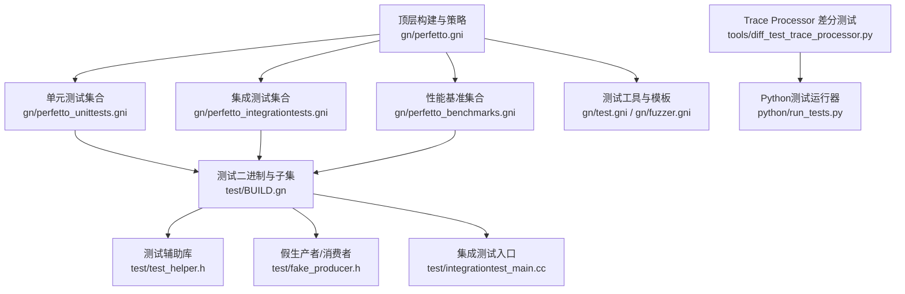
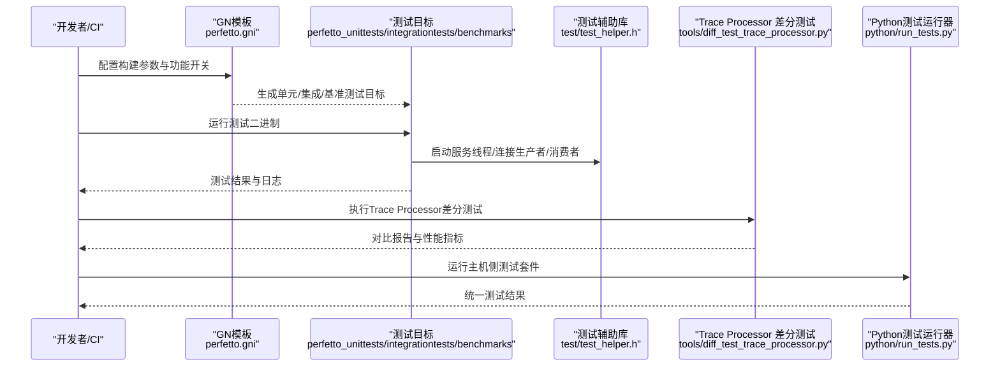
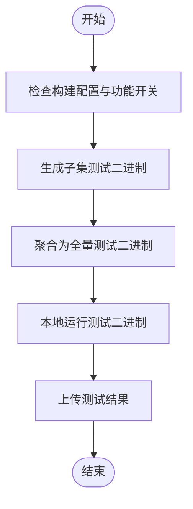
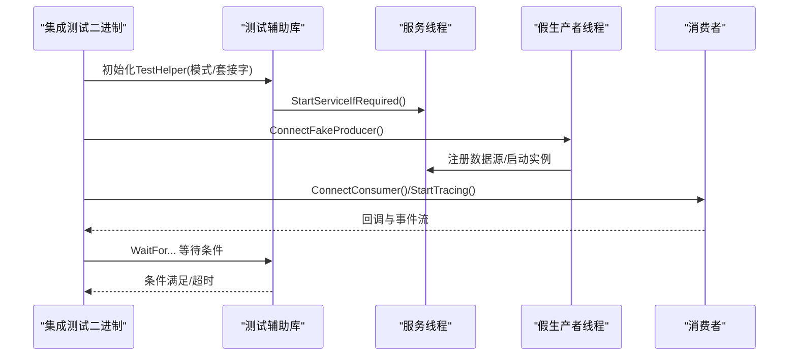
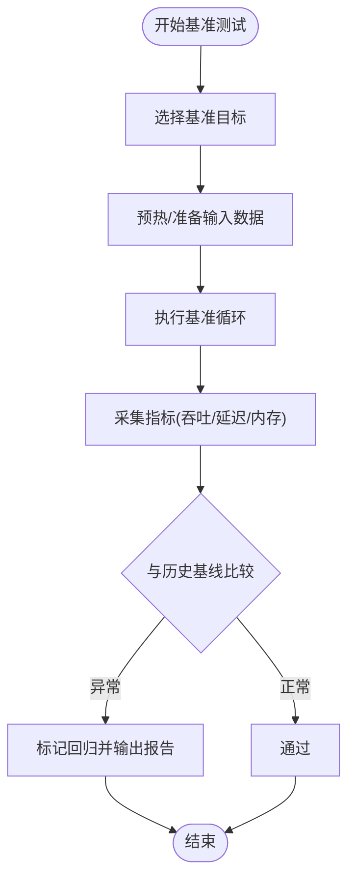
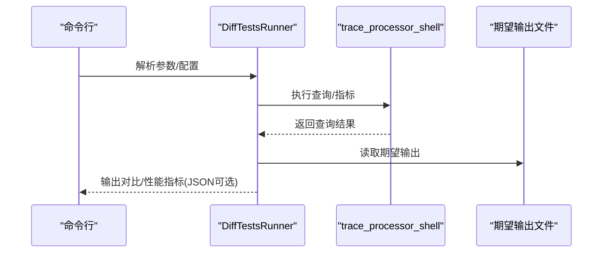
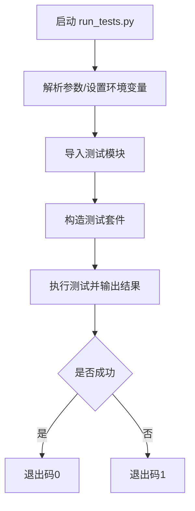
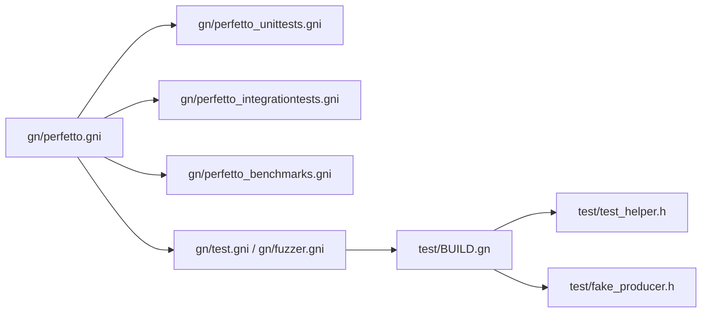

# 测试框架和质量保证

<cite>
**本文引用的文件**
- [docs/贡献指南/测试.md](file://docs/contributing/testing.md)
- [docs/设计文档/持续集成.md](file://docs/design-docs/continuous-integration.md)
- [gn/perfetto_unittests.gni](file://gn/perfetto_unittests.gni)
- [gn/perfetto_integrationtests.gni](file://gn/perfetto_integrationtests.gni)
- [gn/perfetto_benchmarks.gni](file://gn/perfetto_benchmarks.gni)
- [gn/test.gni](file://gn/test.gni)
- [gn/fuzzer.gni](file://gn/fuzzer.gni)
- [gn/perfetto.gni](file://gn/perfetto.gni)
- [test/BUILD.gn](file://test/BUILD.gn)
- [test/test_helper.h](file://test/test_helper.h)
- [test/integrationtest_main.cc](file://test/integrationtest_main.cc)
- [test/fake_producer.h](file://test/fake_producer.h)
- [python/run_tests.py](file://python/run_tests.py)
- [tools/diff_test_trace_processor.py](file://tools/diff_test_trace_processor.py)
</cite>

## 目录
1. [引言](#引言)
2. [项目结构](#项目结构)
3. [核心组件](#核心组件)
4. [架构总览](#架构总览)
5. [详细组件分析](#详细组件分析)
6. [依赖关系分析](#依赖关系分析)
7. [性能考量](#性能考量)
8. [故障排查指南](#故障排查指南)
9. [结论](#结论)
10. [附录](#附录)

## 引言
本文件面向Perfetto测试框架与质量保证体系，系统阐述测试策略（单元测试、集成测试、性能基准测试、端到端测试）、测试环境搭建与隔离、持续集成（CI）流程与自动化执行、测试用例编写规范（覆盖度、数据管理、断言策略）、性能基准测试方法（指标定义、基线建立、回归检测）、代码质量检查工具（静态分析、格式化、安全扫描），以及测试调试技巧与常见问题解决方案。内容以仓库现有构建与测试脚本、GN模板与测试辅助库为依据，确保可操作性与可追溯性。

## 项目结构
Perfetto采用多层组织方式：顶层通过GN模板统一生成测试目标；测试辅助库提供IPC连接、服务启动、共享内存等基础设施；Python工具链负责Trace Processor差分测试与主机侧集成测试；CI基于GitHub Actions与自托管Runner实现跨平台自动化。

图示来源
- [gn/perfetto.gni:1-520](file://gn/perfetto.gni#L1-L520)
- [gn/perfetto_unittests.gni:1-169](file://gn/perfetto_unittests.gni#L1-L169)
- [gn/perfetto_integrationtests.gni:1-62](file://gn/perfetto_integrationtests.gni#L1-L62)
- [gn/perfetto_benchmarks.gni:1-41](file://gn/perfetto_benchmarks.gni#L1-L41)
- [gn/test.gni:1-50](file://gn/test.gni#L1-L50)
- [gn/fuzzer.gni:1-28](file://gn/fuzzer.gni#L1-L28)
- [test/BUILD.gn:1-222](file://test/BUILD.gn#L1-L222)
- [test/test_helper.h:1-540](file://test/test_helper.h#L1-L540)
- [test/integrationtest_main.cc:1-51](file://test/integrationtest_main.cc#L1-L51)
- [test/fake_producer.h:1-113](file://test/fake_producer.h#L1-L113)
- [tools/diff_test_trace_processor.py:1-202](file://tools/diff_test_trace_processor.py#L1-L202)
- [python/run_tests.py:1-69](file://python/run_tests.py#L1-L69)

章节来源
- [gn/perfetto.gni:1-520](file://gn/perfetto.gni#L1-L520)
- [gn/perfetto_unittests.gni:1-169](file://gn/perfetto_unittests.gni#L1-L169)
- [gn/perfetto_integrationtests.gni:1-62](file://gn/perfetto_integrationtests.gni#L1-L62)
- [gn/perfetto_benchmarks.gni:1-41](file://gn/perfetto_benchmarks.gni#L1-L41)
- [gn/test.gni:1-50](file://gn/test.gni#L1-L50)
- [gn/fuzzer.gni:1-28](file://gn/fuzzer.gni#L1-L28)
- [test/BUILD.gn:1-222](file://test/BUILD.gn#L1-L222)

## 核心组件
- 单元测试子集与聚合
  - 按模块拆分为基础、追踪、Trace Processor、性能分析、杂项等子集，最终聚合为全量测试二进制，便于CI快速反馈。
- 集成测试
  - 覆盖IPC、ftrace探测、Trace Redaction、Trace Processor与traceconv等端到端场景；支持“生产模式”（使用系统服务）与“独立模式”（测试中自启服务）。
- 性能基准
  - 覆盖写入、回放、ftrace原始管道到protobuf转换等关键路径，支持在CI上进行冒烟级回归检测。
- 测试辅助库
  - 提供服务线程、假生产者线程、共享内存仲裁、消费者连接与等待条件、进程派生与同步等能力，屏蔽平台差异。
- Trace Processor差分测试
  - 基于查询或指标输出与期望文件对比，支持过滤、并发、慢测试统计与性能指标导出。
- Python测试运行器
  - 统一加载并执行主机侧Trace Processor相关测试套件，设置Shell与BigTrace主程序路径。

章节来源
- [gn/perfetto_unittests.gni:115-169](file://gn/perfetto_unittests.gni#L115-L169)
- [gn/perfetto_integrationtests.gni:17-62](file://gn/perfetto_integrationtests.gni#L17-L62)
- [gn/perfetto_benchmarks.gni:17-41](file://gn/perfetto_benchmarks.gni#L17-L41)
- [test/test_helper.h:118-414](file://test/test_helper.h#L118-L414)
- [tools/diff_test_trace_processor.py:56-197](file://tools/diff_test_trace_processor.py#L56-L197)
- [python/run_tests.py:31-64](file://python/run_tests.py#L31-L64)

## 架构总览
下图展示从测试目标到执行与结果的总体流程，涵盖本地与CI两种运行形态。

图示来源
- [gn/perfetto.gni:157-316](file://gn/perfetto.gni#L157-L316)
- [gn/perfetto_unittests.gni:141-169](file://gn/perfetto_unittests.gni#L141-L169)
- [gn/perfetto_integrationtests.gni:17-62](file://gn/perfetto_integrationtests.gni#L17-L62)
- [gn/perfetto_benchmarks.gni:17-41](file://gn/perfetto_benchmarks.gni#L17-L41)
- [test/test_helper.h:118-414](file://test/test_helper.h#L118-L414)
- [tools/diff_test_trace_processor.py:56-197](file://tools/diff_test_trace_processor.py#L56-L197)
- [python/run_tests.py:31-64](file://python/run_tests.py#L31-L64)

## 详细组件分析

### 单元测试体系
- 子集划分与聚合
  - 将不同模块的单元测试拆分为独立二进制，便于按需运行与CI加速；最终聚合为全量测试二进制。
- 平台与功能开关
  - 受构建变量控制，仅在满足条件时生成对应子集，避免非目标平台的无意义构建。
- CI与本地运行
  - 在Perfetto CI与Chromium CI上分别运行，支持在本地通过ninja与测试二进制直接执行。

图示来源
- [gn/perfetto_unittests.gni:115-169](file://gn/perfetto_unittests.gni#L115-L169)
- [gn/perfetto.gni:213-222](file://gn/perfetto.gni#L213-L222)

章节来源
- [gn/perfetto_unittests.gni:115-169](file://gn/perfetto_unittests.gni#L115-L169)
- [gn/perfetto.gni:213-222](file://gn/perfetto.gni#L213-L222)

### 集成测试体系
- 目标与场景
  - 覆盖客户端API、共享库、IPC、ftrace探测、Trace Redaction、Trace Processor与traceconv等。
- 运行模式
  - 生产模式：依赖系统已运行的traced/traced_probes；独立模式：测试中自启服务与探测器。
- 测试入口与初始化
  - 提供集成测试主程序与初始化桩，支持注册额外初始化逻辑。

图示来源
- [gn/perfetto_integrationtests.gni:17-62](file://gn/perfetto_integrationtests.gni#L17-L62)
- [test/test_helper.h:118-414](file://test/test_helper.h#L118-L414)
- [test/integrationtest_main.cc:24-50](file://test/integrationtest_main.cc#L24-L50)

章节来源
- [gn/perfetto_integrationtests.gni:17-62](file://gn/perfetto_integrationtests.gni#L17-L62)
- [test/test_helper.h:118-414](file://test/test_helper.h#L118-L414)
- [test/integrationtest_main.cc:24-50](file://test/integrationtest_main.cc#L24-L50)

### 性能基准测试体系
- 覆盖路径
  - Trace写入、回放、ftrace原始管道到protobuf转换等关键路径。
- CI冒烟回归
  - 在独立构建上运行简化版基准，作为冒烟检测。

图示来源
- [gn/perfetto_benchmarks.gni:17-41](file://gn/perfetto_benchmarks.gni#L17-L41)
- [docs/贡献指南/测试.md:15-17](file://docs/contributing/testing.md#L15-L17)

章节来源
- [gn/perfetto_benchmarks.gni:17-41](file://gn/perfetto_benchmarks.gni#L17-L41)
- [docs/贡献指南/测试.md:15-17](file://docs/contributing/testing.md#L15-L17)

### Trace Processor差分测试
- 工作原理
  - 解析已知trace并执行查询/指标，将输出与期望文件对比，高亮差异；支持过滤、并发、慢测试统计与性能指标导出。
- 使用方式
  - 通过命令行指定trace_processor路径与描述符，支持并行与详细输出。

图示来源
- [tools/diff_test_trace_processor.py:56-197](file://tools/diff_test_trace_processor.py#L56-L197)

章节来源
- [tools/diff_test_trace_processor.py:56-197](file://tools/diff_test_trace_processor.py#L56-L197)

### Python测试运行器
- 功能
  - 设置trace_processor_shell与BigTrace主程序路径，加载多个测试模块并统一运行。
- 依赖
  - 需要numpy/pandas等依赖，缺失时给出提示。

图示来源
- [python/run_tests.py:31-64](file://python/run_tests.py#L31-L64)

章节来源
- [python/run_tests.py:31-64](file://python/run_tests.py#L31-L64)

### 测试辅助库与假生产者
- 测试辅助库
  - 提供ServiceThread、ProbesProducerThread、FakeProducerThread、TestHelper等，封装服务启动、IPC连接、共享内存仲裁、等待条件与进程派生。
- 假生产者
  - 实现Producer接口，支持启动前事件批、批量事件产生、数据提交与同步。

```mermaid
classDiagram
class ServiceThread {
+Start() TestEnvCleaner
+Stop() void
+runner() ThreadTaskRunner*
}
class ProbesProducerThread {
+Connect() void
+~ProbesProducerThread()
}
class FakeProducerThread {
+Connect() void
+CreateProducerProvidedSmb() void
+ProduceStartupEventBatch() void
+producer() FakeProducer*
}
class TestHelper {
+StartServiceIfRequired() void
+ConnectFakeProducer() FakeProducer*
+ConnectConsumer() void
+StartTracing() void
+WaitFor...() void
}
class FakeProducer {
+Connect() void
+ProduceStartupEventBatch() void
+CommitData() void
+Sync() void
}
TestHelper --> ServiceThread : "使用"
TestHelper --> FakeProducerThread : "使用"
FakeProducerThread --> FakeProducer : "持有"
```

图示来源
- [test/test_helper.h:118-414](file://test/test_helper.h#L118-L414)
- [test/fake_producer.h:40-108](file://test/fake_producer.h#L40-L108)

章节来源
- [test/test_helper.h:118-414](file://test/test_helper.h#L118-L414)
- [test/fake_producer.h:40-108](file://test/fake_producer.h#L40-L108)

## 依赖关系分析
- 构建配置与目标生成
  - perfetto.gni定义功能开关与默认行为，决定是否启用IPC、平台服务、Trace Processor、基准与fuzzer等；各*.gni根据该配置生成具体测试目标。
- 测试目标与依赖
  - test/BUILD.gn汇总测试相关依赖（proto、IPC、base、tracing核心等），并按条件添加trace_processor shell、cmdline工具等数据依赖。
- 测试模板与平台差异
  - test.gni与fuzzer.gni在不同构建树（独立/嵌入/Chromium）下采用不同模板，避免不兼容目标被发现与构建。

图示来源
- [gn/perfetto.gni:157-316](file://gn/perfetto.gni#L157-L316)
- [gn/perfetto_unittests.gni:141-169](file://gn/perfetto_unittests.gni#L141-L169)
- [gn/perfetto_integrationtests.gni:17-62](file://gn/perfetto_integrationtests.gni#L17-L62)
- [gn/perfetto_benchmarks.gni:17-41](file://gn/perfetto_benchmarks.gni#L17-L41)
- [gn/test.gni:17-34](file://gn/test.gni#L17-L34)
- [gn/fuzzer.gni:17-27](file://gn/fuzzer.gni#L17-L27)
- [test/BUILD.gn:18-83](file://test/BUILD.gn#L18-L83)

章节来源
- [gn/perfetto.gni:157-316](file://gn/perfetto.gni#L157-L316)
- [test/BUILD.gn:18-83](file://test/BUILD.gn#L18-L83)

## 性能考量
- 基准范围与指标
  - 关注Trace写入/回放/转换等关键路径的吞吐与延迟；支持将性能指标导出为JSON，便于CI收集与趋势分析。
- 基线与回归
  - 建议在CI中保留历史基线，对新变更进行阈值比较；冒烟阶段可降低运行规模，确保快速反馈。
- 并发与稳定性
  - 差分测试支持并行执行与慢测试统计，有助于定位热点与不稳定用例。

章节来源
- [gn/perfetto_benchmarks.gni:17-41](file://gn/perfetto_benchmarks.gni#L17-L41)
- [tools/diff_test_trace_processor.py:165-197](file://tools/diff_test_trace_processor.py#L165-L197)

## 故障排查指南
- 集成测试权限与环境
  - Linux/Android上ftrace调试目录需要当前用户读写权限；独立模式需要正确设置套接字与环境变量。
- Android设备与模拟器
  - 需要adb连接设备或启动模拟器；部分测试需要推送测试数据或系统二进制。
- 差分测试失败
  - 检查期望输出文件与实际输出差异；必要时更新基线（需特定权限与工具链）。
- Python测试依赖
  - 缺少numpy/pandas会阻塞测试运行，需安装并激活虚拟环境后重试。
- CI沙箱与可信性
  - CI产物仅用于功能性与性能回归验证，不视为外部信任制品；沙箱存在逃逸风险，应谨慎对待产物。

章节来源
- [docs/贡献指南/测试.md:28-33](file://docs/contributing/testing.md#L28-L33)
- [docs/贡献指南/测试.md:158-180](file://docs/contributing/testing.md#L158-L180)
- [tools/diff_test_trace_processor.py:28-49](file://tools/diff_test_trace_processor.py#L28-L49)
- [docs/设计文档/持续集成.md:100-131](file://docs/design-docs/continuous-integration.md#L100-L131)

## 结论
Perfetto测试框架通过清晰的模块化目标、完善的测试辅助库与Python工具链，实现了从单元到端到端、从功能到性能的全栈覆盖。结合GitHub Actions与自托管Runner的CI体系，能够在多平台与多构建配置下稳定运行测试并产出可复现的结果。建议在日常开发中遵循本文档的测试策略与最佳实践，确保变更质量与回归防护。

## 附录
- 测试策略与方法论
  - 单元测试：类级别与模块级别，强调快速反馈与平台无关性。
  - 集成测试：覆盖IPC、ftrace、Trace Redaction与Trace Processor等端到端场景。
  - 性能基准：聚焦关键路径，支持基线与回归检测。
  - 端到端测试：结合系统服务与独立服务两种模式，覆盖真实使用场景。
- 测试环境搭建与隔离
  - 本地：使用ninja生成目标并运行；Android：adb连接设备或模拟器；Linux：确保ftrace目录权限。
  - CI：基于GitHub Actions与自托管Runner，容器化沙箱隔离，状态最小化。
- 持续集成流程与自动化
  - 分析入口触发多工作流；Worker/GCE VM/Privileged容器/沙箱容器逐层解耦；只保留UI工件。
- 测试用例编写指南
  - 覆盖率：优先保障关键路径与错误分支；数据管理：使用测试辅助库生成/注入测试数据；断言策略：结合回调、事件与超时等待。
- 代码质量检查工具
  - 静态分析：clang-tidy等（仓库内含配置文件）；格式化：clang-format/yapf等；安全扫描：结合CI沙箱与依赖审计。
- 测试调试技巧
  - 利用测试辅助库的等待条件与检查点；在独立模式下自启服务便于定位问题；差分测试输出与慢测试统计帮助识别瓶颈。

章节来源
- [docs/贡献指南/测试.md:72-249](file://docs/contributing/testing.md#L72-L249)
- [docs/设计文档/持续集成.md:10-131](file://docs/design-docs/continuous-integration.md#L10-L131)
- [gn/perfetto.gni:157-316](file://gn/perfetto.gni#L157-L316)
- [test/test_helper.h:340-365](file://test/test_helper.h#L340-L365)
- [tools/diff_test_trace_processor.py:139-164](file://tools/diff_test_trace_processor.py#L139-L164)