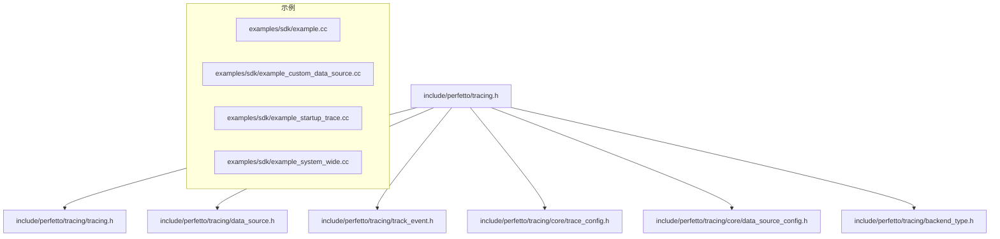
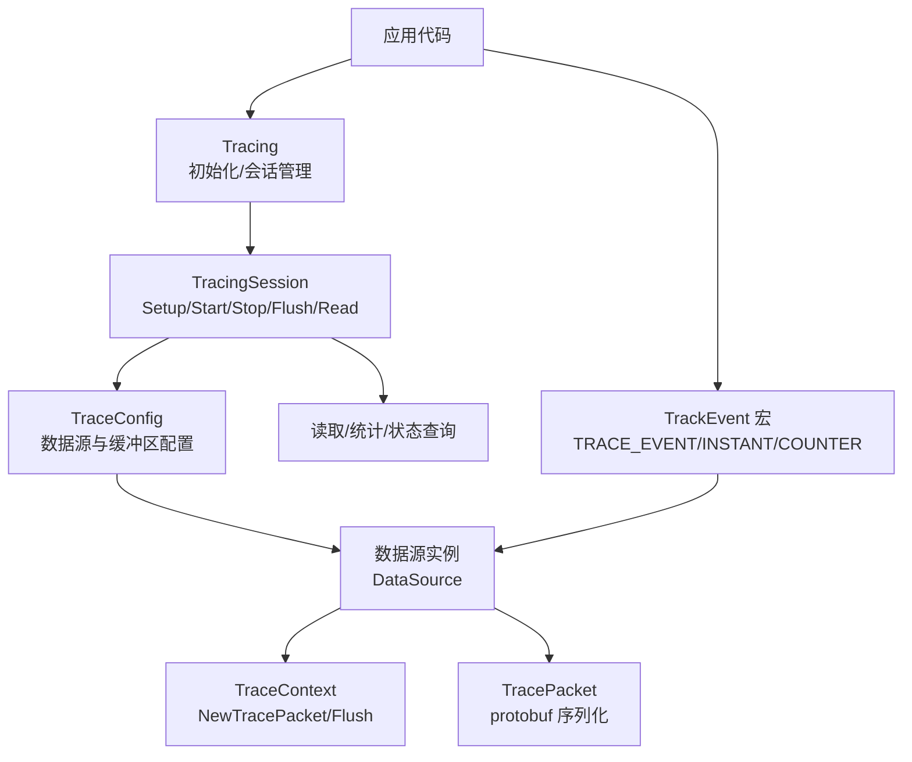
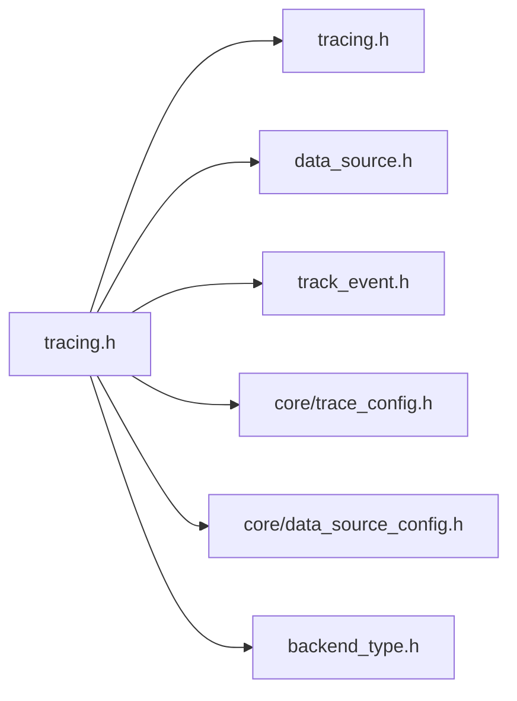
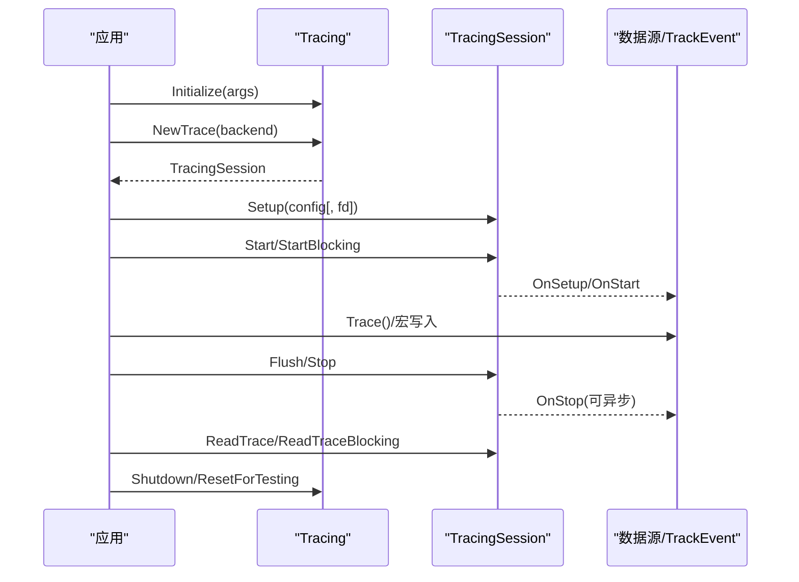

# SDK API参考

<cite>
**本文引用的文件**
- [include/perfetto/tracing.h](file://include/perfetto/tracing.h)
- [include/perfetto/tracing/tracing.h](file://include/perfetto/tracing/tracing.h)
- [include/perfetto/tracing/data_source.h](file://include/perfetto/tracing/data_source.h)
- [include/perfetto/tracing/track_event.h](file://include/perfetto/tracing/track_event.h)
- [include/perfetto/tracing/core/trace_config.h](file://include/perfetto/tracing/core/trace_config.h)
- [include/perfetto/tracing/core/data_source_config.h](file://include/perfetto/tracing/core/data_source_config.h)
- [include/perfetto/tracing/backend_type.h](file://include/perfetto/tracing/backend_type.h)
- [examples/sdk/example.cc](file://examples/sdk/example.cc)
- [examples/sdk/example_custom_data_source.cc](file://examples/sdk/example_custom_data_source.cc)
- [examples/sdk/example_startup_trace.cc](file://examples/sdk/example_startup_trace.cc)
- [examples/sdk/example_system_wide.cc](file://examples/sdk/example_system_wide.cc)
</cite>

## 目录
1. [简介](#简介)
2. [项目结构](#项目结构)
3. [核心组件](#核心组件)
4. [架构总览](#架构总览)
5. [详细组件分析](#详细组件分析)
6. [依赖分析](#依赖分析)
7. [性能考量](#性能考量)
8. [故障排查指南](#故障排查指南)
9. [结论](#结论)
10. [附录](#附录)

## 简介
本参考文档面向使用 Perfetto 追踪 SDK 的开发者，系统梳理并详解以下公共 API：
- Tracing 类：初始化、会话管理、启动/停止/刷新、读取/统计查询、触发器激活、启动追踪（Startup Tracing）等。
- DataSource 基类与模板：自定义数据源的生命周期回调、注册、快速路径 Trace()、异步停止/刷新等。
- TrackEvent 宏族：TRACE_EVENT、TRACE_EVENT_BEGIN/END、TRACE_EVENT_INSTANT、TRACE_COUNTER 等，以及分类注册与静态存储。
- 配置类：TraceConfig、DataSourceConfig 及其别名化类型；BackendType 枚举。

文档提供每个 API 的参数、返回值、使用场景、注意事项，并结合示例工程展示初始化、配置、启动/停止追踪、读取结果等完整流程。同时说明 API 间的关系、调用顺序、线程安全与性能考虑，以及常见错误处理与最佳实践。

## 项目结构
本仓库中与 SDK API 相关的关键头文件位于 include/perfetto/tracing 及其子目录，核心入口头文件 tracing.h 汇聚了常用 API。示例工程 examples/sdk 展示了典型用法。

**图表来源**
- [include/perfetto/tracing.h:1-43](file://include/perfetto/tracing.h#L1-L43)
- [include/perfetto/tracing/tracing.h:1-566](file://include/perfetto/tracing/tracing.h#L1-L566)
- [include/perfetto/tracing/data_source.h:1-684](file://include/perfetto/tracing/data_source.h#L1-L684)
- [include/perfetto/tracing/track_event.h:1-444](file://include/perfetto/tracing/track_event.h#L1-L444)
- [include/perfetto/tracing/core/trace_config.h:1-41](file://include/perfetto/tracing/core/trace_config.h#L1-L41)
- [include/perfetto/tracing/core/data_source_config.h:1-29](file://include/perfetto/tracing/core/data_source_config.h#L1-L29)
- [include/perfetto/tracing/backend_type.h:1-45](file://include/perfetto/tracing/backend_type.h#L1-L45)

**章节来源**
- [include/perfetto/tracing.h:17-42](file://include/perfetto/tracing.h#L17-L42)

## 核心组件
- Tracing：SDK 入口点，负责初始化后端、创建追踪会话、启动/停止/刷新、读取/统计查询、触发器激活、启动追踪等。
- TracingSession：单次追踪会话的生命周期控制与数据读取。
- StartupTracingSession：在服务端会话建立前进行“预热”记录，随后被接管。
- DataSourceBase/DataSource<T>：自定义数据源基类与模板，提供 OnSetup/OnStart/OnStop/OnFlush 生命周期回调，支持快速路径 Trace() 与异步处理。
- TrackEvent 宏族：用于应用内插桩，涵盖切片、即时事件、计数器等。
- 配置类：TraceConfig、DataSourceConfig 及别名类型；BackendType 枚举。

**章节来源**
- [include/perfetto/tracing/tracing.h:188-330](file://include/perfetto/tracing/tracing.h#L188-L330)
- [include/perfetto/tracing/data_source.h:88-201](file://include/perfetto/tracing/data_source.h#L88-L201)
- [include/perfetto/tracing/track_event.h:30-444](file://include/perfetto/tracing/track_event.h#L30-L444)
- [include/perfetto/tracing/core/trace_config.h:26-39](file://include/perfetto/tracing/core/trace_config.h#L26-L39)
- [include/perfetto/tracing/core/data_source_config.h:24-28](file://include/perfetto/tracing/core/data_source_config.h#L24-L28)
- [include/perfetto/tracing/backend_type.h:24-40](file://include/perfetto/tracing/backend_type.h#L24-L40)

## 架构总览
下图展示了 SDK 的高层交互：应用通过 Tracing 初始化后端，创建 TracingSession 并配置 TraceConfig；数据源（内置或自定义）在启用时接收 OnSetup/OnStart 回调并通过 TraceContext 写入 TracePacket；TrackEvent 宏在编译期/运行期决定是否写入；最终通过 ReadTrace 或直接写文件的方式导出 trace 数据。

**图表来源**
- [include/perfetto/tracing/tracing.h:188-561](file://include/perfetto/tracing/tracing.h#L188-L561)
- [include/perfetto/tracing/data_source.h:264-520](file://include/perfetto/tracing/data_source.h#L264-L520)
- [include/perfetto/tracing/track_event.h:20-444](file://include/perfetto/tracing/track_event.h#L20-L444)

## 详细组件分析

### Tracing 类 API 规范
- 初始化
  - 方法：Initialize(const TracingInitArgs&)
  - 参数：TracingInitArgs 包含后端选择、平台实现、共享内存大小/页大小/批提交时延、策略对象、日志回调、时钟覆盖、进程 UUID、系统消费者开关、连接套接字工厂等。
  - 返回：无
  - 使用场景：首次进入追踪功能前调用；可多次调用以叠加不同后端。
  - 注意事项：后续调用忽略已初始化后端的参数；启用系统消费者会引入 IPC 依赖。
- 会话创建
  - 方法：NewTrace(BackendType backend = kUnspecifiedBackend)
  - 返回：std::unique_ptr<TracingSession>
  - 使用场景：在 Initialize 后创建会话；支持自动选择可用后端。
- 启动追踪（Startup Tracing）
  - 方法：SetupStartupTracing/SetupStartupTracingBlocking
  - 参数：TraceConfig、后端、超时、回调（setup/aborted/adopted）
  - 返回：std::unique_ptr<StartupTracingSession>
  - 使用场景：在服务端会话建立前进行预热记录；仅支持系统后端。
- 触发器激活
  - 方法：ActivateTriggers(const std::vector<std::string>&, uint32_t ttl_ms)
  - 作用：向已连接且在未来 ttl_ms 内连接的后端广播触发信号。
- 关闭/重置
  - 方法：Shutdown()/ResetForTesting()
  - 作用：释放资源/测试重置；Shutdown 后不可再次初始化同一进程。

调用顺序建议：
1) Initialize(args) → 2) NewTrace(backend) → 3) Setup(config[, fd]) → 4) Start/StartBlocking → 5) 追踪期间写入 → 6) Flush/Stop → 7) ReadTrace/ReadTraceBlocking → 8) Shutdown

线程安全与性能：
- Initialize/NewTrace 在内部对未使用的后端分支做内联优化，避免链接无关代码。
- Flush 为栅栏语义，确保可见性；建议在 Stop 前显式调用以保证尾包可见。
- 读取 trace 是破坏性操作，需在 Stop 后进行。

**章节来源**
- [include/perfetto/tracing/tracing.h:188-330](file://include/perfetto/tracing/tracing.h#L188-L330)
- [include/perfetto/tracing/tracing.h:332-561](file://include/perfetto/tracing/tracing.h#L332-L561)

### TracingSession 接口 API 规范
- Setup(config, fd=-1)
  - 作用：配置会话；若提供 fd，则自动写入文件。
- Start()/StartBlocking()
  - Start：异步启动；SetOnStartCallback 获取完成通知。
  - StartBlocking：阻塞直到启动完成（可能早于其他生产者/系统会话的数据源）。
- CloneTrace(args, callback)
  - 作用：克隆同后端只读会话，用于快照读取。
- SetOnStartCallback/SetOnErrorCallback/SetOnStopCallback
  - 作用：会话生命周期回调。
- Flush(callback, timeout_ms)/FlushBlocking(timeout_ms)
  - 作用：Flush 栅栏；Known issue：尾包可见性需配合 DataSource::Trace([]){ ctx.Flush(); }。
- Stop()/StopBlocking()
  - 作用：异步/阻塞停止。
- ChangeTraceConfig(config)
  - 作用：变更活动会话的部分配置字段。
- ReadTrace(callback)/ReadTraceBlocking()
  - 作用：异步/同步读取 trace 数据（原始 protobuf 字节）。
- GetTraceStats/QueryServiceState
  - 作用：统计与服务状态查询。

注意：
- ReadTrace 前通常需要 Flush；读取是破坏性的、非幂等的。
- GetTraceStats/QueryServiceState 一次只能有一个活跃请求。

**章节来源**
- [include/perfetto/tracing/tracing.h:332-519](file://include/perfetto/tracing/tracing.h#L332-L519)

### StartupTracingSession 接口 API 规范
- Abort()/AbortBlocking()
  - 作用：中止仍处于“未绑定”状态的数据源实例；销毁对象不会自动中止。
- 使用场景：在系统后端会话尚未绑定时提前写入事件，随后由服务端接管。

**章节来源**
- [include/perfetto/tracing/tracing.h:521-536](file://include/perfetto/tracing/tracing.h#L521-L536)

### DataSource 基类与模板 API 规范
- 生命周期回调
  - OnSetup(const SetupArgs&)：配置生效时机；可多线程调用。
  - OnStart(const StartArgs&)：实际开始；可多线程调用。
  - OnStop(const StopArgs&)：停止前；可通过 HandleAsynchronously() 延迟停止。
  - OnFlush(const FlushArgs&)：Flush 请求；可通过 HandleFlushAsynchronously() 延迟确认。
  - WillClearIncrementalState：增量状态清理前。
- 快速路径与上下文
  - Trace(Lambda)：当数据源启用且选中时，同步调用 Lambda；可多次调用（并发会话/多实例）。
  - CallIfEnabled + TraceWithInstances：更细粒度的启用位控制与迭代。
  - TraceContext：
    - NewTracePacket()：获取 TracePacket 句柄。
    - Flush(callback?)：强制提交；有性能开销。
    - AddEmptyTracePacket()：确保服务可安全读取最后事件。
    - GetDataSourceLocked()：RAII 锁定当前实例。
    - GetCustomTlsState()/GetIncrementalState()/instance_index()。
- 注册与描述符
  - Register(descriptor, args...)：注册数据源类型；返回是否成功。
  - UpdateDescriptor(descriptor)：更新描述符。
- 配置项
  - kBufferExhaustedPolicy/kBufferExhaustedPolicyConfigurable：缓冲耗尽策略。
  - kSupportsMultipleInstances：是否允许多实例。
  - kRequiresCallbacksUnderLock：回调是否在锁内执行（默认 true，兼容历史但易死锁）。

线程安全与性能：
- 回调可能在任意线程被调用；长时间阻塞会导致死锁风险，应使用 HandleAsynchronously。
- Flush 性能代价高，仅在必要时调用（如异步 Stop 前）。
- IncrementalState 支持可选的就地清理以减少分配。

**章节来源**
- [include/perfetto/tracing/data_source.h:88-201](file://include/perfetto/tracing/data_source.h#L88-L201)
- [include/perfetto/tracing/data_source.h:264-520](file://include/perfetto/tracing/data_source.h#L264-L520)

### TrackEvent 宏 API 规范
- 分类注册与静态存储
  - PERFETTO_DEFINE_CATEGORIES(...) / PERFETTO_TRACK_EVENT_STATIC_STORAGE()
  - 作用：声明分类集合与数据源静态存储，供宏使用。
- 宏族
  - TRACE_EVENT_BEGIN(category, name, ...)/TRACE_EVENT_END(category, ...)
    - 作用：成对开启/关闭切片；嵌套必须匹配。
  - TRACE_EVENT(category, name, ...)（带作用域自动结束）
    - 作用：便捷的切片宏，自动在作用域结束时关闭。
  - TRACE_EVENT_INSTANT(category, name, ...)
    - 作用：零持续时间事件。
  - TRACE_COUNTER(category, track, ...)
    - 作用：计数器采样；支持 CounterTrack 单位/倍率等属性。
- 辅助
  - TRACE_EVENT_CATEGORY_ENABLED(category)：高效判断分类是否启用。
  - TrackEvent::Register()/Flush()/SetTrackDescriptor()/GetTraceTimeNs() 等。

使用要点：
- 切片必须成对、正确嵌套；动态名称需通过 EventContext 写入。
- 计数器支持单位与缩放，便于 UI 展示。
- 分类可按构建期/运行期区分，测试分类可标记为动态。

**章节来源**
- [include/perfetto/tracing/track_event.h:30-444](file://include/perfetto/tracing/track_event.h#L30-L444)

### 配置类与枚举 API 规范
- TraceConfig
  - 作用：定义缓冲区、数据源列表、触发器、持续时间、过滤等。
  - 别名：通过 core/trace_config.h 将 protos::gen::TraceConfig 映射到 ::perfetto 命名空间。
- DataSourceConfig
  - 作用：定义单个数据源的配置（如 track_event_config_raw）。
  - 别名：通过 core/data_source_config.h 将 protos::gen::DataSourceConfig 映射到 ::perfetto 命名空间。
- BackendType
  - 作用：后端选择枚举（kUnspecifiedBackend/kInProcessBackend/kSystemBackend/kCustomBackend）。

**章节来源**
- [include/perfetto/tracing/core/trace_config.h:26-39](file://include/perfetto/tracing/core/trace_config.h#L26-L39)
- [include/perfetto/tracing/core/data_source_config.h:24-28](file://include/perfetto/tracing/core/data_source_config.h#L24-L28)
- [include/perfetto/tracing/backend_type.h:24-40](file://include/perfetto/tracing/backend_type.h#L24-L40)

## 依赖分析
- 头文件聚合
  - tracing.h 聚合了 Tracing、DataSource、TrackEvent、配置与平台相关头文件，便于嵌入方统一包含。
- 组件耦合
  - Tracing 对后端工厂与平台抽象有依赖；TracingSession 与 TraceConfig 强耦合；DataSource<T> 与 TraceContext/TracePacket 紧密关联；TrackEvent 宏依赖分类注册与数据源增量状态。
- 外部依赖
  - Protobuf 生成的配置与事件消息类型；IPC 层（系统后端）；平台线程/日志/时钟等。

**图表来源**
- [include/perfetto/tracing.h:26-41](file://include/perfetto/tracing.h#L26-L41)

**章节来源**
- [include/perfetto/tracing.h:17-42](file://include/perfetto/tracing.h#L17-L42)

## 性能考量
- 初始化与后端选择
  - 通过 TracingInitArgs 的后端标志按需拉起后端，避免加载不使用的 IPC/系统消费者代码。
  - 共享内存参数（大小、页大小、批提交时延、直写修补）影响吞吐与延迟权衡。
- 写入路径
  - TraceContext::Flush 会强制提交，带来 IPC/刷新成本；仅在必要时调用（如异步 Stop 前）。
  - 新建 TracePacket 成本较低，但频繁 Flush 会显著增加开销。
- 读取与统计
  - ReadTraceBlocking 会复制数据，效率较低；优先使用异步 ReadTrace。
  - 统计与服务状态查询一次仅允许一个活跃请求。
- TrackEvent
  - 分类启用检查在宏层做短路，避免无效序列化；动态分类略低效。
  - 计数器采样建议使用单位/倍率减少二进制体积。

[本节为通用性能建议，无需特定文件来源]

## 故障排查指南
- 初始化失败
  - 症状：Initialize 后无法创建会话或启动失败。
  - 排查：检查 TracingInitArgs 的后端标志、平台实现、共享内存参数是否合理；确认系统消费者启用与 IPC 权限。
- 启动追踪（Startup Tracing）不生效
  - 症状：启动追踪未被服务端接管或超时。
  - 排查：仅系统后端支持；确保配置与后续服务端会话匹配；检查超时设置与回调。
- 读取不到尾包
  - 症状：Trace 结束后最后事件缺失。
  - 排查：在 Stop 前调用 DataSource::Trace([]){ ctx.Flush(); } 或 TrackEvent::Flush()。
- 死锁/卡顿
  - 症状：OnStop/OnFlush 阻塞导致死锁。
  - 排查：使用 StopArgs::HandleAsynchronously()/FlushArgs::HandleFlushAsynchronously 延迟处理；避免在回调中做重工作。
- 日志与诊断
  - 使用 TracingInitArgs::log_message_callback 捕获 SDK 日志；使用 GetTraceStats/QueryServiceState 辅助定位问题。

**章节来源**
- [include/perfetto/tracing/tracing.h:51-68](file://include/perfetto/tracing/tracing.h#L51-L68)
- [include/perfetto/tracing/tracing.h:394-413](file://include/perfetto/tracing/tracing.h#L394-L413)
- [include/perfetto/tracing/data_source.h:127-159](file://include/perfetto/tracing/data_source.h#L127-L159)

## 结论
Perfetto SDK 提供了从初始化、会话管理、数据源扩展到应用级插桩的完整能力。Tracing/TracingSession 负责生命周期与数据导出；DataSource<T> 提供灵活的自定义数据源扩展；TrackEvent 宏族简化了应用内插桩。通过合理的后端选择、共享内存参数与 Flush 策略，可在性能与可观测性之间取得平衡。遵循本文的调用顺序、线程安全与错误处理建议，可有效提升追踪质量与稳定性。

[本节为总结，无需特定文件来源]

## 附录

### API 调用序列图（初始化与会话）

**图表来源**
- [include/perfetto/tracing/tracing.h:188-330](file://include/perfetto/tracing/tracing.h#L188-L330)
- [include/perfetto/tracing/tracing.h:332-519](file://include/perfetto/tracing/tracing.h#L332-L519)
- [include/perfetto/tracing/data_source.h:88-201](file://include/perfetto/tracing/data_source.h#L88-L201)
- [include/perfetto/tracing/track_event.h:372-444](file://include/perfetto/tracing/track_event.h#L372-L444)

### 示例工程用法概览
- 基础示例（in-process）
  - 初始化 → 注册 TrackEvent → 创建会话 → 配置 TraceConfig → StartBlocking → 写入 TRACE_EVENT/TRACE_COUNTER → Flush → StopBlocking → ReadTraceBlocking → 写文件。
- 自定义数据源示例
  - 初始化 → Register 自定义数据源 → 配置 TraceConfig → StartBlocking → DataSource::Trace 写包 → Flush → StopBlocking → ReadTraceBlocking → 写文件。
- 启动追踪示例（system）
  - 初始化（kSystemBackend）→ SetupStartupTracingBlocking → 写入 Startup 事件 → NewTrace → StartBlocking → 写入主事件 → StopBlocking → ReadTraceBlocking → 写文件。
- 系统宽追踪示例
  - 初始化（kSystemBackend，禁用系统消费者）→ 注册 TrackEvent → 等待外部命令启动 → 插桩 → Flush → 退出。

**章节来源**
- [examples/sdk/example.cc:35-131](file://examples/sdk/example.cc#L35-L131)
- [examples/sdk/example_custom_data_source.cc:52-124](file://examples/sdk/example_custom_data_source.cc#L52-L124)
- [examples/sdk/example_startup_trace.cc:46-138](file://examples/sdk/example_startup_trace.cc#L46-L138)
- [examples/sdk/example_system_wide.cc:88-131](file://examples/sdk/example_system_wide.cc#L88-L131)