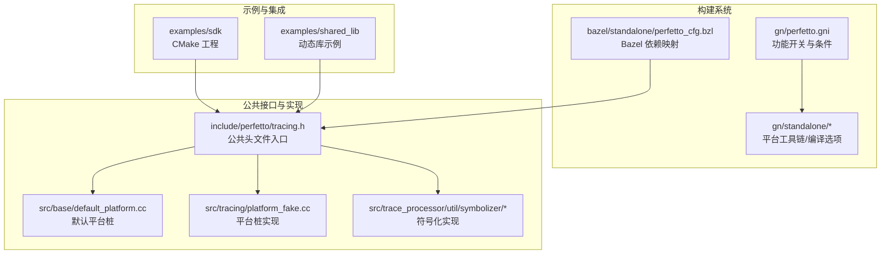
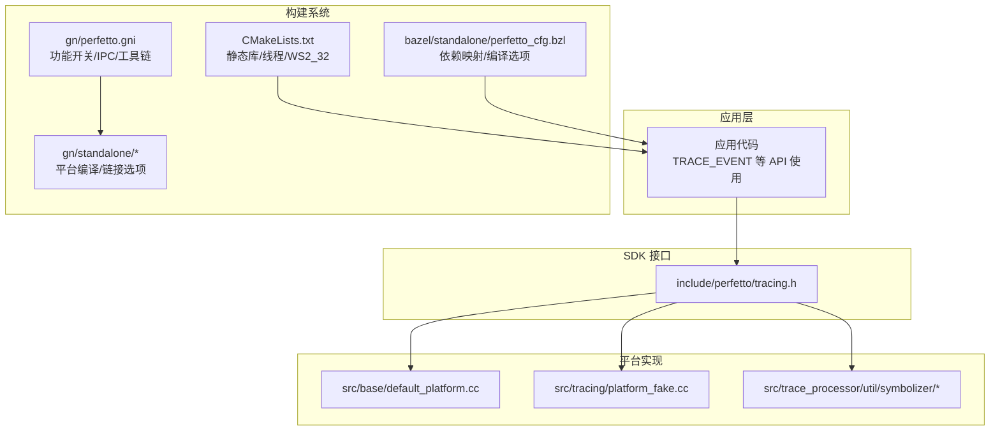
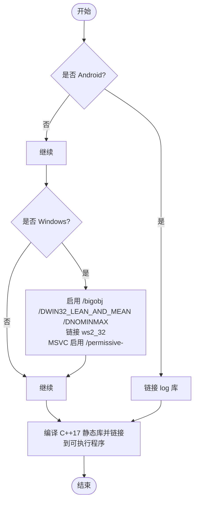
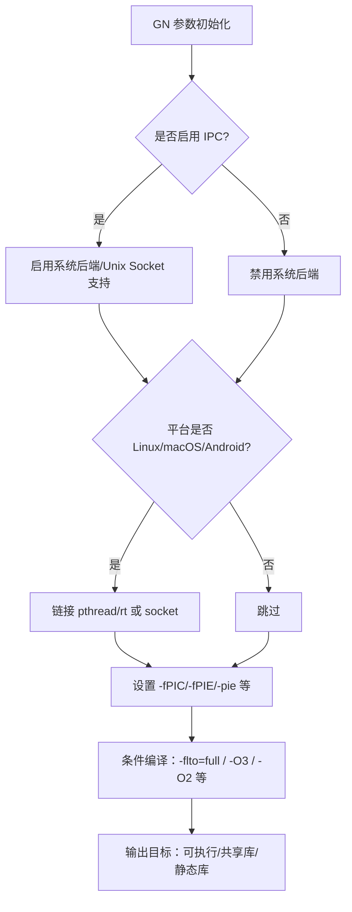
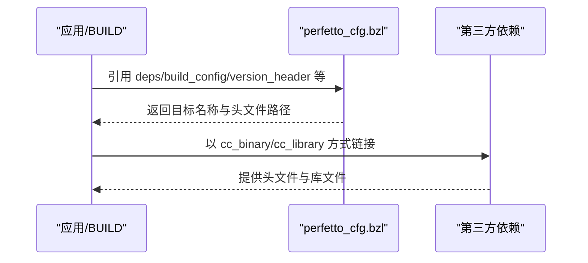
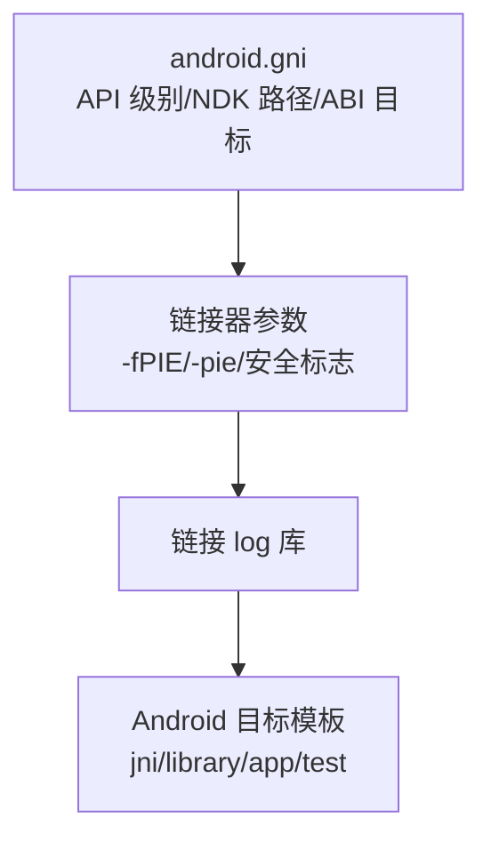
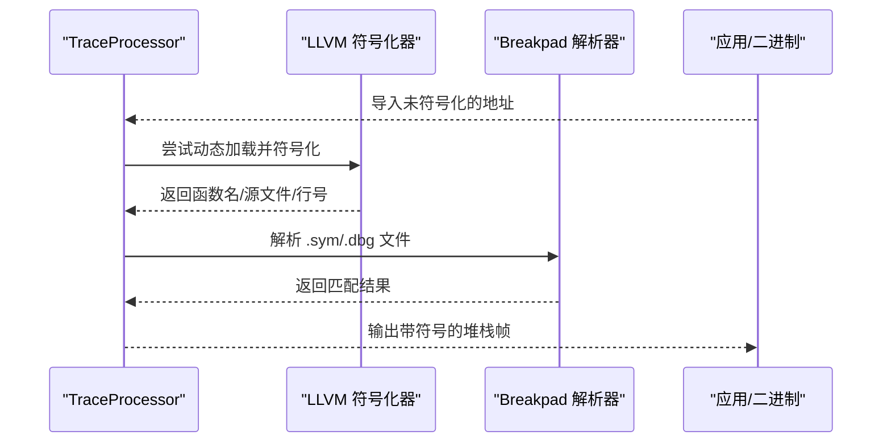
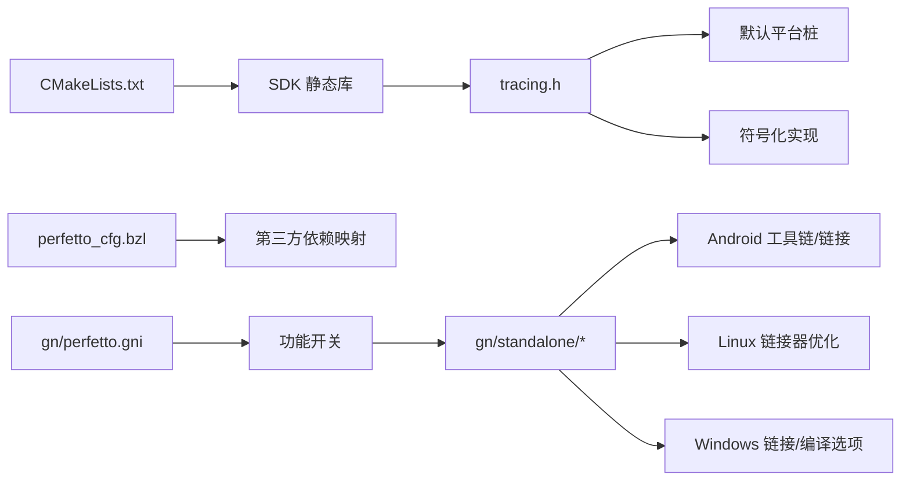

# 平台集成和部署

<cite>
**本文引用的文件**
- [README.md](file://README.md)
- [examples/sdk/README.md](file://examples/sdk/README.md)
- [examples/sdk/CMakeLists.txt](file://examples/sdk/CMakeLists.txt)
- [examples/sdk/example.cc](file://examples/sdk/example.cc)
- [examples/shared_lib/README.md](file://examples/shared_lib/README.md)
- [gn/perfetto.gni](file://gn/perfetto.gni)
- [gn/standalone/BUILD.gn](file://gn/standalone/BUILD.gn)
- [gn/standalone/android.gni](file://gn/standalone/android.gni)
- [gn/standalone/libc++.gni](file://gn/standalone/libc++.gni)
- [gn/standalone/toolchain/llvm.gni](file://gn/standalone/toolchain/llvm.gni)
- [gn/perfetto_android_sdk.gni](file://gn/perfetto_android_sdk.gni)
- [bazel/standalone/perfetto_cfg.bzl](file://bazel/standalone/perfetto_cfg.bzl)
- [include/perfetto/tracing.h](file://include/perfetto/tracing.h)
- [src/base/default_platform.cc](file://src/base/default_platform.cc)
- [src/tracing/platform_fake.cc](file://src/tracing/platform_fake.cc)
- [src/trace_processor/util/symbolizer/llvm_symbolizer.cc](file://src/trace_processor/util/symbolizer/llvm_symbolizer.cc)
- [src/trace_processor/util/symbolizer/breakpad_symbolizer_unittest.cc](file://src/trace_processor/util/symbolizer/breakpad_symbolizer_unittest.cc)
</cite>

## 目录
1. [简介](#简介)
2. [项目结构](#项目结构)
3. [核心组件](#核心组件)
4. [架构总览](#架构总览)
5. [详细组件分析](#详细组件分析)
6. [依赖关系分析](#依赖关系分析)
7. [性能考量](#性能考量)
8. [故障排查指南](#故障排查指南)
9. [结论](#结论)
10. [附录](#附录)

## 简介
本文件面向在多平台（Linux、Android、Windows、macOS）集成 Perfetto 追踪 SDK 的工程团队，提供从构建系统（CMake、Bazel、GN）到平台特定配置与链接要求的完整技术指南。内容覆盖：
- 各平台集成步骤与差异
- 构建系统配置要点
- 静态/动态链接与共享库使用方式
- 版本管理与依赖处理
- 调试符号、符号化与崩溃转储支持
- 跨平台最佳实践与性能注意事项

## 项目结构
仓库包含 SDK 示例、构建系统配置与平台工具链定义，核心目录如下：
- examples/sdk：CMake 示例工程，演示如何在应用中注入跟踪事件并生成可读 trace 文件
- gn：GN 构建参数与条件开关，覆盖平台特性、IPC、工具链、警告级别、链接器优化等
- gn/standalone：平台相关工具链与编译选项（Android、Linux、Windows、macOS、QNX）
- bazel/standalone：Bazel 配置模板，定义第三方依赖映射与默认编译选项
- include/perfetto：公共头文件入口，统一暴露 SDK API
- src：运行时实现与平台适配层，含默认平台桩与符号化实现

**图表来源**
- [examples/sdk/CMakeLists.txt:15-78](file://examples/sdk/CMakeLists.txt#L15-L78)
- [gn/perfetto.gni:15-520](file://gn/perfetto.gni#L15-L520)
- [gn/standalone/BUILD.gn:42-565](file://gn/standalone/BUILD.gn#L42-L565)
- [bazel/standalone/perfetto_cfg.bzl:19-160](file://bazel/standalone/perfetto_cfg.bzl#L19-L160)
- [include/perfetto/tracing.h:20-42](file://include/perfetto/tracing.h#L20-L42)
- [src/base/default_platform.cc:17-34](file://src/base/default_platform.cc#L17-L34)
- [src/tracing/platform_fake.cc:17-29](file://src/tracing/platform_fake.cc#L17-L29)
- [src/trace_processor/util/symbolizer/llvm_symbolizer.cc:82-114](file://src/trace_processor/util/symbolizer/llvm_symbolizer.cc#L82-L114)

**章节来源**
- [README.md:1-101](file://README.md#L1-L101)
- [examples/sdk/README.md:1-137](file://examples/sdk/README.md#L1-L137)
- [gn/perfetto.gni:15-520](file://gn/perfetto.gni#L15-L520)
- [gn/standalone/BUILD.gn:42-565](file://gn/standalone/BUILD.gn#L42-L565)

## 核心组件
- 公共头文件入口：通过单一头文件集中暴露 SDK API，便于嵌入式项目按需包含或严格按需引入（IWYU）
- 构建系统配置：以 GN 为核心，配合 Bazel 与 CMake 提供一致的跨平台体验；通过 declare_args 与条件分支控制功能开关与平台能力
- 平台适配层：默认平台桩与假实现确保在无宿主平台支持时仍可编译与运行最小功能集
- 符号化与崩溃转储：提供基于 LLVM 与 Breakpad 的符号化实现，支持调试符号解析与崩溃堆栈回溯

**章节来源**
- [include/perfetto/tracing.h:20-42](file://include/perfetto/tracing.h#L20-L42)
- [gn/perfetto.gni:157-420](file://gn/perfetto.gni#L157-L420)
- [src/base/default_platform.cc:17-34](file://src/base/default_platform.cc#L17-L34)
- [src/tracing/platform_fake.cc:17-29](file://src/tracing/platform_fake.cc#L17-L29)
- [src/trace_processor/util/symbolizer/llvm_symbolizer.cc:82-114](file://src/trace_processor/util/symbolizer/llvm_symbolizer.cc#L82-L114)

## 架构总览
下图展示了 SDK 在不同平台与构建系统中的集成路径，以及平台特定的编译/链接选项与依赖。

**图表来源**
- [examples/sdk/CMakeLists.txt:15-78](file://examples/sdk/CMakeLists.txt#L15-L78)
- [gn/perfetto.gni:157-420](file://gn/perfetto.gni#L157-L420)
- [gn/standalone/BUILD.gn:42-565](file://gn/standalone/BUILD.gn#L42-L565)
- [bazel/standalone/perfetto_cfg.bzl:19-160](file://bazel/standalone/perfetto_cfg.bzl#L19-L160)
- [include/perfetto/tracing.h:20-42](file://include/perfetto/tracing.h#L20-L42)
- [src/base/default_platform.cc:17-34](file://src/base/default_platform.cc#L17-L34)
- [src/tracing/platform_fake.cc:17-29](file://src/tracing/platform_fake.cc#L17-L29)
- [src/trace_processor/util/symbolizer/llvm_symbolizer.cc:82-114](file://src/trace_processor/util/symbolizer/llvm_symbolizer.cc#L82-L114)

## 详细组件分析

### CMake 集成（Linux/Windows/macOS）
- 构建类型：示例工程将 SDK 源码打包为静态库并链接至可执行程序
- 线程库：在所有平台均链接线程库
- Android：额外链接 log 库
- Windows：启用大对象格式、禁用旧式 Windows 头部宏、链接 WinSock2
- 编译标准：C++17
- 可选：MSVC 启用标准兼容模式

**图表来源**
- [examples/sdk/CMakeLists.txt:15-78](file://examples/sdk/CMakeLists.txt#L15-L78)

**章节来源**
- [examples/sdk/CMakeLists.txt:15-78](file://examples/sdk/CMakeLists.txt#L15-L78)
- [examples/sdk/README.md:13-30](file://examples/sdk/README.md#L13-L30)

### GN 集成（Linux/Android/Windows/macOS/QNX）
- 功能开关：通过 declare_args 控制 IPC、Trace Processor、SQLite、RE2、PCRE2、LLVM 符号化等特性
- 平台条件：根据 is_linux/is_android/is_win/is_mac/is_qnx 等变量启用/禁用相应功能
- 工具链：Hermetic Clang/LLD 配置，支持 Linux/macOS/Windows 主机环境
- 编译选项：统一警告级别、异常/RTTI 控制、调试/发布优化、CPU 特定优化
- 链接器：POSIX 平台设置 --gc-sections/--icf 等，Android 设置 -fPIE/-pie 与安全标志

**图表来源**
- [gn/perfetto.gni:157-420](file://gn/perfetto.gni#L157-L420)
- [gn/standalone/BUILD.gn:42-565](file://gn/standalone/BUILD.gn#L42-L565)

**章节来源**
- [gn/perfetto.gni:157-420](file://gn/perfetto.gni#L157-L420)
- [gn/standalone/BUILD.gn:42-565](file://gn/standalone/BUILD.gn#L42-L565)

### Bazel 集成（依赖映射与编译选项）
- 依赖映射：通过 perfetto_cfg.bzl 将 perfetto 内部目标映射到第三方仓库（如 zlib、expat、sqlite、protobuf、llvm_demangle 等）
- 编译选项：默认 C++17 标准，允许 embedder 自定义 copts 与规则覆盖
- 可见性：提供 public_visibility/proto_library_visibility 等字段以满足不同嵌入场景

**图表来源**
- [bazel/standalone/perfetto_cfg.bzl:19-160](file://bazel/standalone/perfetto_cfg.bzl#L19-L160)

**章节来源**
- [bazel/standalone/perfetto_cfg.bzl:19-160](file://bazel/standalone/perfetto_cfg.bzl#L19-L160)

### 平台特定配置与差异

#### Android
- 工具链：使用 NDK 的 Clang/LLD，设置 sysroot、ABI 目标与 API 级别
- 链接：启用 -fPIE/-pie、安全相关链接标志、静态 libstdc++
- 依赖：Android 平台日志库 log
- GN 模板：提供 Android 库/应用/仪器测试生成模板

**图表来源**
- [gn/standalone/android.gni:15-62](file://gn/standalone/android.gni#L15-L62)
- [gn/perfetto_android_sdk.gni:20-161](file://gn/perfetto_android_sdk.gni#L20-L161)
- [gn/standalone/BUILD.gn:406-434](file://gn/standalone/BUILD.gn#L406-L434)

**章节来源**
- [gn/standalone/android.gni:15-62](file://gn/standalone/android.gni#L15-L62)
- [gn/perfetto_android_sdk.gni:20-161](file://gn/perfetto_android_sdk.gni#L20-L161)
- [gn/standalone/BUILD.gn:406-434](file://gn/standalone/BUILD.gn#L406-L434)

#### Linux
- 系统库：链接 pthread/rt
- 链接器：--gc-sections/--icf 等优化
- 可选：启用 LFS 宏定义

**章节来源**
- [gn/standalone/BUILD.gn:354-383](file://gn/standalone/BUILD.gn#L354-L383)

#### Windows
- 编译器：MSVC/clang-cl，启用 /bigobj、/permissive-、/std:c++17
- 链接：/DEBUG:GHASH、/OPT:REF/ICF、/INCREMENTAL:NO、/FIXED:NO
- 依赖：ws2_32

**章节来源**
- [gn/standalone/BUILD.gn:242-404](file://gn/standalone/BUILD.gn#L242-L404)
- [examples/sdk/CMakeLists.txt:56-77](file://examples/sdk/CMakeLists.txt#L56-L77)

#### macOS
- 警告级别：针对较新 Clang 行为进行补充
- 可选：启用 -dead_strip 剪枝

**章节来源**
- [gn/standalone/BUILD.gn:57-108](file://gn/standalone/BUILD.gn#L57-L108)

#### QNX
- 系统库：socket
- 特殊：x64 下 -O2 降级以避免分配大小错误

**章节来源**
- [gn/standalone/BUILD.gn:374-383](file://gn/standalone/BUILD.gn#L374-L383)

### 构建系统集成示例

#### CMake 示例（Linux/Windows/macOS）
- 步骤：准备 SDK 源（下载或生成），使用 CMake 配置并构建
- 关键点：C++17、线程库、Android 额外 log、Windows ws2_32

**章节来源**
- [examples/sdk/README.md:13-30](file://examples/sdk/README.md#L13-L30)
- [examples/sdk/CMakeLists.txt:15-78](file://examples/sdk/CMakeLists.txt#L15-L78)

#### Android 示例（CMake + NDK）
- 步骤：设置 ANDROID_NDK、ANDROID_ABI、ANDROID_PLATFORM、ANDROID_LD，构建并推送示例到设备，同时通过 perfetto 命令行采集系统级 trace
- 输出：生成 .perfetto-trace 文件，可在 UI 中打开

**章节来源**
- [examples/sdk/README.md:62-108](file://examples/sdk/README.md#L62-L108)

#### Bazel 示例（依赖映射）
- 步骤：在 Bazel 中引用 perfetto_cfg.bzl，映射第三方依赖并以 cc_binary/cc_library 形式链接
- 适用：需要与现有 Bazel 生态集成的项目

**章节来源**
- [bazel/standalone/perfetto_cfg.bzl:19-160](file://bazel/standalone/perfetto_cfg.bzl#L19-L160)

### 静态链接、动态链接与共享库
- 静态链接：示例工程将 SDK 打包为静态库并链接到可执行程序，适合单体应用与嵌入式场景
- 动态链接：示例 shared_lib 目录演示链接动态库的方式，适用于需要共享 SDK 的多模块场景
- 共享库：在 Linux/macOS 上可通过 -fPIC 生成共享库；Android 默认要求 PIE

**章节来源**
- [examples/sdk/CMakeLists.txt:23-26](file://examples/sdk/CMakeLists.txt#L23-L26)
- [examples/shared_lib/README.md:1-5](file://examples/shared_lib/README.md#L1-L5)
- [gn/standalone/BUILD.gn:499-529](file://gn/standalone/BUILD.gn#L499-L529)

### 调试符号处理、符号化与崩溃转储
- 符号化实现：提供基于 LLVM 的动态加载符号化器与 Breakpad 解析器单元测试
- 崩溃转储：在部分平台启用 stderr 崩溃转储，便于快速定位问题
- 使用建议：在开发/调试阶段启用更详细的日志与符号化，生产环境可关闭冗余日志以降低开销

**图表来源**
- [src/trace_processor/util/symbolizer/llvm_symbolizer.cc:82-114](file://src/trace_processor/util/symbolizer/llvm_symbolizer.cc#L82-L114)
- [src/trace_processor/util/symbolizer/breakpad_symbolizer_unittest.cc:67-93](file://src/trace_processor/util/symbolizer/breakpad_symbolizer_unittest.cc#L67-L93)

**章节来源**
- [src/trace_processor/util/symbolizer/llvm_symbolizer.cc:82-114](file://src/trace_processor/util/symbolizer/llvm_symbolizer.cc#L82-L114)
- [src/trace_processor/util/symbolizer/breakpad_symbolizer_unittest.cc:67-93](file://src/trace_processor/util/symbolizer/breakpad_symbolizer_unittest.cc#L67-L93)
- [gn/perfetto.gni:259-264](file://gn/perfetto.gni#L259-L264)

## 依赖关系分析
- 构建系统耦合：GN 作为核心配置中心，Bazel 通过配置模板映射第三方依赖，CMake 作为独立示例工程
- 平台耦合：Android 依赖 NDK 工具链与 log 库；Windows 依赖 ws2_32；Linux/macOS/QNX 依赖系统库与链接器优化
- 功能耦合：Trace Processor 与 IPC、SQLite、RE2、PCRE2、LLVM 符号化等特性相互影响，由 declare_args 统一开关

**图表来源**
- [examples/sdk/CMakeLists.txt:15-78](file://examples/sdk/CMakeLists.txt#L15-L78)
- [bazel/standalone/perfetto_cfg.bzl:19-160](file://bazel/standalone/perfetto_cfg.bzl#L19-L160)
- [gn/perfetto.gni:157-420](file://gn/perfetto.gni#L157-L420)
- [gn/standalone/BUILD.gn:42-565](file://gn/standalone/BUILD.gn#L42-L565)
- [include/perfetto/tracing.h:20-42](file://include/perfetto/tracing.h#L20-L42)
- [src/base/default_platform.cc:17-34](file://src/base/default_platform.cc#L17-L34)
- [src/trace_processor/util/symbolizer/llvm_symbolizer.cc:82-114](file://src/trace_processor/util/symbolizer/llvm_symbolizer.cc#L82-L114)

**章节来源**
- [examples/sdk/CMakeLists.txt:15-78](file://examples/sdk/CMakeLists.txt#L15-L78)
- [bazel/standalone/perfetto_cfg.bzl:19-160](file://bazel/standalone/perfetto_cfg.bzl#L19-L160)
- [gn/perfetto.gni:157-420](file://gn/perfetto.gni#L157-L420)
- [gn/standalone/BUILD.gn:42-565](file://gn/standalone/BUILD.gn#L42-L565)

## 性能考量
- 编译优化：Release 模式下启用 -O3/-O2，链接器裁剪与合并（--gc-sections/--icf）
- CPU 特定优化：x64 可启用 AVX2/BMI 等指令集优化（条件开启）
- 线程与同步：在非 Chromium 场景可启用优先继承互斥锁与 inotify 重连机制
- 日志与断言：默认关闭 DLOG，仅在调试构建中按需开启；断言策略受平台与构建类型影响
- 体积控制：可禁用系统消费者支持以节省约 300KB

**章节来源**
- [gn/standalone/BUILD.gn:449-497](file://gn/standalone/BUILD.gn#L449-L497)
- [gn/perfetto.gni:265-308](file://gn/perfetto.gni#L265-L308)

## 故障排查指南
- 构建失败（Windows）：确认启用 /bigobj、/permissive- 与 /std:c++17；检查 ws2_32 链接
- Android 构建失败：核对 ANDROID_NDK、ANDROID_ABI、ANDROID_PLATFORM 与 ANDROID_LD；确保 API 级别满足需求
- 符号化失败：确认已正确加载 libllvm_symbolizer_wrapper.so 或具备 Breakpad 符号文件；检查映射与构建 ID
- 崩溃转储：在调试构建中启用 stderr 崩溃转储，确保有足够权限与符号文件

**章节来源**
- [examples/sdk/CMakeLists.txt:56-77](file://examples/sdk/CMakeLists.txt#L56-L77)
- [gn/standalone/BUILD.gn:242-404](file://gn/standalone/BUILD.gn#L242-L404)
- [gn/standalone/android.gni:15-62](file://gn/standalone/android.gni#L15-L62)
- [src/trace_processor/util/symbolizer/llvm_symbolizer.cc:82-114](file://src/trace_processor/util/symbolizer/llvm_symbolizer.cc#L82-L114)
- [gn/perfetto.gni:259-264](file://gn/perfetto.gni#L259-L264)

## 结论
Perfetto SDK 在多平台与多构建系统上提供了统一且可配置的集成路径。通过 GN 的 declare_args 与平台工具链配置，结合 CMake/Bazel 的示例工程，开发者可以快速完成静态/动态链接与共享库的部署。建议在开发阶段启用符号化与详细日志，在生产阶段关闭冗余日志并启用编译器与链接器优化，以获得最佳性能与可维护性。

## 附录
- 示例工程：参考 examples/sdk 与 examples/shared_lib，了解静态/动态链接与平台差异
- 公共头文件：include/perfetto/tracing.h 作为统一入口
- 平台桩：src/base/default_platform.cc 与 src/tracing/platform_fake.cc 提供默认实现
- 符号化：src/trace_processor/util/symbolizer/* 实现 LLVM 与 Breakpad 解析

**章节来源**
- [examples/sdk/README.md:1-137](file://examples/sdk/README.md#L1-L137)
- [examples/shared_lib/README.md:1-5](file://examples/shared_lib/README.md#L1-L5)
- [include/perfetto/tracing.h:20-42](file://include/perfetto/tracing.h#L20-L42)
- [src/base/default_platform.cc:17-34](file://src/base/default_platform.cc#L17-L34)
- [src/tracing/platform_fake.cc:17-29](file://src/tracing/platform_fake.cc#L17-L29)
- [src/trace_processor/util/symbolizer/llvm_symbolizer.cc:82-114](file://src/trace_processor/util/symbolizer/llvm_symbolizer.cc#L82-L114)