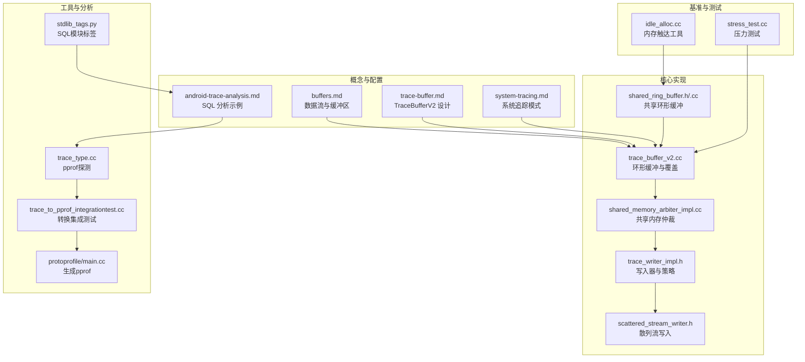
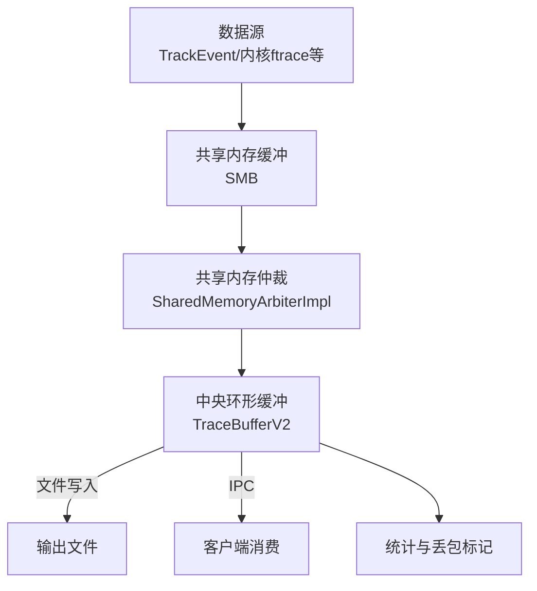
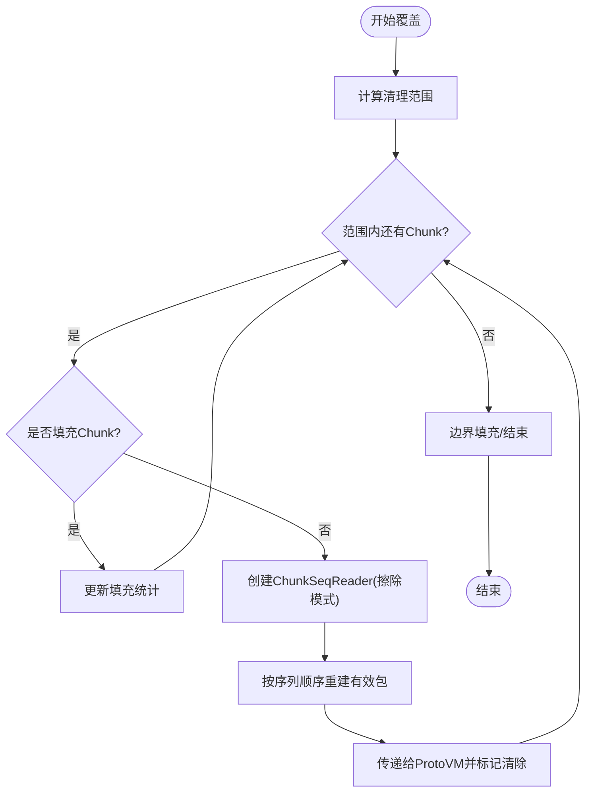
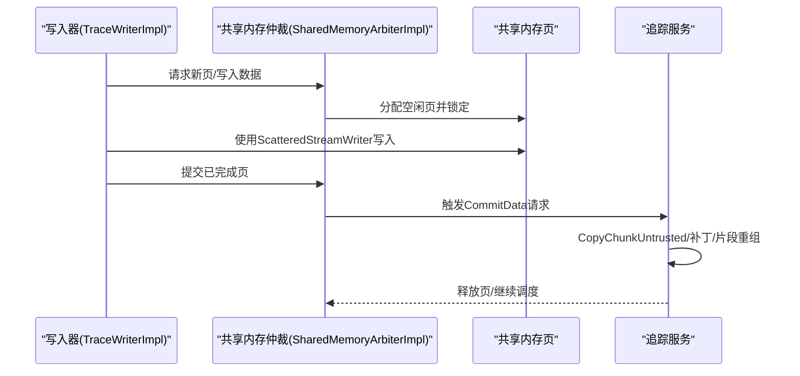
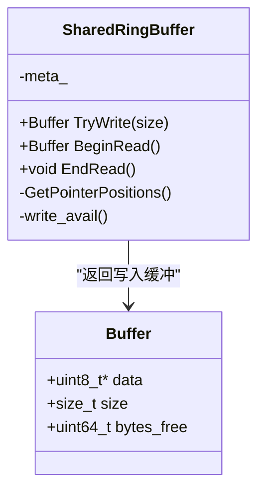
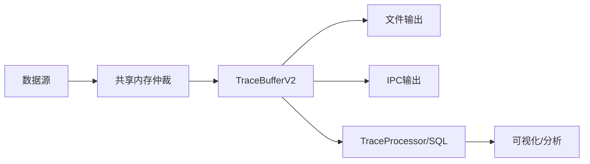

# 性能优化和最佳实践

<cite>
**本文引用的文件**
- [docs/concepts/buffers.md](file://docs/concepts/buffers.md)
- [docs/design-docs/trace-buffer.md](file://docs/design-docs/trace-buffer.md)
- [docs/getting-started/system-tracing.md](file://docs/getting-started/system-tracing.md)
- [docs/getting-started/android-trace-analysis.md](file://docs/getting-started/android-trace-analysis.md)
- [docs/tracing-101.md](file://docs/tracing-101.md)
- [src/tracing/service/trace_buffer_v2.cc](file://src/tracing/service/trace_buffer_v2.cc)
- [src/tracing/service/trace_buffer_v2_unittest.cc](file://src/tracing/service/trace_buffer_v2_unittest.cc)
- [src/tracing/core/shared_memory_arbiter_impl.cc](file://src/tracing/core/shared_memory_arbiter_impl.cc)
- [src/tracing/core/trace_writer_impl.h](file://src/tracing/core/trace_writer_impl.h)
- [src/profiling/memory/shared_ring_buffer.h](file://src/profiling/memory/shared_ring_buffer.h)
- [src/profiling/memory/shared_ring_buffer.cc](file://src/profiling/memory/shared_ring_buffer.cc)
- [include/perfetto/protozero/scattered_stream_writer.h](file://include/perfetto/protozero/scattered_stream_writer.h)
- [src/tools/idle_alloc.cc](file://src/tools/idle_alloc.cc)
- [src/trace_processor/util/trace_type.cc](file://src/trace_processor/util/trace_type.cc)
- [src/traceconv/trace_to_pprof_integrationtest.cc](file://src/traceconv/trace_to_pprof_integrationtest.cc)
- [src/tools/protoprofile/main.cc](file://src/tools/protoprofile/main.cc)
- [python/generators/sql_processing/stdlib_tags.py](file://python/generators/sql_processing/stdlib_tags.py)
- [test/stress_test/stress_test.cc](file://test/stress_test/stress_test.cc)
- [ui/src/plugins/dev.perfetto.RecordTraceV2/config/trace_config_builder.ts](file://ui/src/plugins/dev.perfetto.RecordTraceV2/config/trace_config_builder.ts)
- [src/tracing/test/api_integrationtest.cc](file://src/tracing/test/api_integrationtest.cc)
- [src/traced/probes/ftrace/tracefs_integrationtest.cc](file://src/traced/probes/ftrace/tracefs_integrationtest.cc)
</cite>

## 目录
1. [引言](#引言)
2. [项目结构](#项目结构)
3. [核心组件](#核心组件)
4. [架构总览](#架构总览)
5. [详细组件分析](#详细组件分析)
6. [依赖关系分析](#依赖关系分析)
7. [性能考量](#性能考量)
8. [故障排查指南](#故障排查指南)
9. [结论](#结论)
10. [附录](#附录)

## 引言
本技术文档聚焦于Perfetto追踪SDK在性能优化方面的设计与实践，覆盖缓冲区管理、事件采样、内存使用、零拷贝与异步写入、追踪模式权衡、基准测试与回归检测、以及跨平台（移动设备、服务器、嵌入式）的优化策略。文档以代码级实证为基础，结合官方设计文档与测试用例，帮助读者系统掌握如何在高负载场景下稳定、低开销地采集与分析追踪数据。

## 项目结构
- 概念与设计文档：buffers.md、trace-buffer.md、system-tracing.md、android-trace-analysis.md、tracing-101.md 等，定义了缓冲区模型、数据流、追踪模式与分析方法。
- 核心实现：trace_buffer_v2.cc、shared_memory_arbiter_impl.cc、trace_writer_impl.h、scattered_stream_writer.h 等，体现零拷贝、异步写入、环形缓冲区覆盖与读回一致性等关键机制。
- 内存共享环形缓冲：shared_ring_buffer.h/.cc，展示无阻塞原子写入、丢弃策略与顺序一致性保障。
- 工具链与分析：trace_type.cc、trace_to_pprof_integrationtest.cc、protoprofile/main.cc、stdlib_tags.py 等，支撑从trace到pprof/profile的转换与可视化。
- 基准与压力测试：stress_test.cc、idle_alloc.cc 等，用于评估吞吐与稳定性。

图示来源
- [docs/concepts/buffers.md:1-423](file://docs/concepts/buffers.md#L1-L423)
- [docs/design-docs/trace-buffer.md:1-736](file://docs/design-docs/trace-buffer.md#L1-L736)
- [src/tracing/service/trace_buffer_v2.cc:567-603](file://src/tracing/service/trace_buffer_v2.cc#L567-L603)
- [src/tracing/core/shared_memory_arbiter_impl.cc:138-164](file://src/tracing/core/shared_memory_arbiter_impl.cc#L138-L164)
- [src/tracing/core/trace_writer_impl.h:94-127](file://src/tracing/core/trace_writer_impl.h#L94-L127)
- [include/perfetto/protozero/scattered_stream_writer.h:94-124](file://include/perfetto/protozero/scattered_stream_writer.h#L94-L124)
- [src/profiling/memory/shared_ring_buffer.h:39-78](file://src/profiling/memory/shared_ring_buffer.h#L39-L78)
- [src/trace_processor/util/trace_type.cc:105-143](file://src/trace_processor/util/trace_type.cc#L105-L143)
- [src/traceconv/trace_to_pprof_integrationtest.cc:40-73](file://src/traceconv/trace_to_pprof_integrationtest.cc#L40-L73)
- [src/tools/protoprofile/main.cc:150-184](file://src/tools/protoprofile/main.cc#L150-L184)
- [python/generators/sql_processing/stdlib_tags.py:254-300](file://python/generators/sql_processing/stdlib_tags.py#L254-L300)
- [test/stress_test/stress_test.cc:468-495](file://test/stress_test/stress_test.cc#L468-L495)
- [src/tools/idle_alloc.cc:83-178](file://src/tools/idle_alloc.cc#L83-L178)

章节来源
- [docs/concepts/buffers.md:1-423](file://docs/concepts/buffers.md#L1-L423)
- [docs/design-docs/trace-buffer.md:1-736](file://docs/design-docs/trace-buffer.md#L1-L736)

## 核心组件
- 中央环形缓冲区（TraceBufferV2）
  - 支持多生产者/多序列写入，具备环形覆盖与读回一致性保证；提供DISCARD与RING_BUFFER两种填充策略；对片段化、补丁（patch）、乱序提交进行稳健处理。
- 共享内存仲裁（SharedMemoryArbiterImpl）
  - 协调多线程写入，避免写者阻塞；在特定条件下触发同步提交，降低写者停滞概率。
- 写入器（TraceWriterImpl）
  - 负责直接向共享内存页写入，使用ScatteredStreamWriter进行零拷贝散列写入；支持缓冲耗尽策略（stall/丢弃）。
- 散列流写入器（ScatteredStreamWriter）
  - 高速写入路径，提供预留空间与回退重写能力，确保写入连续性与原子性。
- 共享环形缓冲（SharedRingBuffer）
  - 基于非阻塞套接字语义的环形缓冲，保证写入原子性与读取顺序一致性，满则丢弃。
- 工具与分析
  - trace_type.cc用于识别pprof；trace_to_pprof_*与protoprofile用于将trace转换为pprof；stdlib_tags.py组织SQL分析模块；stress_test与idle_alloc用于性能与稳定性评估。

章节来源
- [src/tracing/service/trace_buffer_v2.cc:567-603](file://src/tracing/service/trace_buffer_v2.cc#L567-L603)
- [src/tracing/core/shared_memory_arbiter_impl.cc:138-164](file://src/tracing/core/shared_memory_arbiter_impl.cc#L138-L164)
- [src/tracing/core/trace_writer_impl.h:94-127](file://src/tracing/core/trace_writer_impl.h#L94-L127)
- [include/perfetto/protozero/scattered_stream_writer.h:94-124](file://include/perfetto/protozero/scattered_stream_writer.h#L94-L124)
- [src/profiling/memory/shared_ring_buffer.h:39-78](file://src/profiling/memory/shared_ring_buffer.h#L39-L78)
- [src/trace_processor/util/trace_type.cc:105-143](file://src/trace_processor/util/trace_type.cc#L105-L143)
- [src/traceconv/trace_to_pprof_integrationtest.cc:40-73](file://src/traceconv/trace_to_pprof_integrationtest.cc#L40-L73)
- [src/tools/protoprofile/main.cc:150-184](file://src/tools/protoprofile/main.cc#L150-L184)
- [python/generators/sql_processing/stdlib_tags.py:254-300](file://python/generators/sql_processing/stdlib_tags.py#L254-L300)
- [test/stress_test/stress_test.cc:468-495](file://test/stress_test/stress_test.cc#L468-L495)
- [src/tools/idle_alloc.cc:83-178](file://src/tools/idle_alloc.cc#L83-L178)

## 架构总览
下图展示了从数据源到中央缓冲、再到文件或IPC输出的端到端数据流，强调零拷贝写入、共享内存解耦与环形缓冲覆盖。

图示来源
- [docs/concepts/buffers.md:75-98](file://docs/concepts/buffers.md#L75-L98)
- [src/tracing/core/shared_memory_arbiter_impl.cc:138-164](file://src/tracing/core/shared_memory_arbiter_impl.cc#L138-L164)
- [src/tracing/service/trace_buffer_v2.cc:567-603](file://src/tracing/service/trace_buffer_v2.cc#L567-L603)

## 详细组件分析

### 组件A：TraceBufferV2（环形缓冲与覆盖）
- 关键特性
  - 多序列（ProducerID, WriterID）管理，按ChunkID排序维护序列状态，支持乱序提交与片段化重组。
  - 读回时严格保证包的原子性与顺序一致性；对缺失片段、补丁等待、不完整块进行稳健处理。
  - 覆盖删除流程与读回逻辑高度对称，确保ProtoVM可正确重建即将被覆盖的数据包。
- 性能要点
  - 写入采用增长指针与对齐策略，减少碎片；覆盖时通过ChunkSeqReader逐包重建，避免全表扫描。
  - 基准测试显示V2在单写者/多写者场景下的写入吞吐优于V1，读回吞吐在不同平台上表现稳定。

图示来源
- [docs/design-docs/trace-buffer.md:524-582](file://docs/design-docs/trace-buffer.md#L524-L582)
- [src/tracing/service/trace_buffer_v2.cc:567-603](file://src/tracing/service/trace_buffer_v2.cc#L567-L603)

章节来源
- [docs/design-docs/trace-buffer.md:1-736](file://docs/design-docs/trace-buffer.md#L1-L736)
- [src/tracing/service/trace_buffer_v2.cc:567-603](file://src/tracing/service/trace_buffer_v2.cc#L567-L603)
- [src/tracing/service/trace_buffer_v2_unittest.cc:1594-2195](file://src/tracing/service/trace_buffer_v2_unittest.cc#L1594-L2195)

### 组件B：共享内存仲裁与写入器（零拷贝与异步写入）
- 共享内存仲裁
  - 在写者线程与服务线程之间协调页面分配与提交；当待提交页超过阈值且在同一任务运行器线程上时，触发同步提交以降低写者停滞。
- 写入器与散列流写入
  - 写入器持有当前Chunk，使用ScatteredStreamWriter直接写入共享内存页；支持预留空间与回退重写，保证写入连续性。
  - 写入器可配置缓冲耗尽策略：stall或返回无效Chunk，避免无界阻塞。

图示来源
- [src/tracing/core/shared_memory_arbiter_impl.cc:138-164](file://src/tracing/core/shared_memory_arbiter_impl.cc#L138-L164)
- [src/tracing/core/trace_writer_impl.h:94-127](file://src/tracing/core/trace_writer_impl.h#L94-L127)
- [include/perfetto/protozero/scattered_stream_writer.h:94-124](file://include/perfetto/protozero/scattered_stream_writer.h#L94-L124)

章节来源
- [src/tracing/core/shared_memory_arbiter_impl.cc:138-164](file://src/tracing/core/shared_memory_arbiter_impl.cc#L138-L164)
- [src/tracing/core/trace_writer_impl.h:94-127](file://src/tracing/core/trace_writer_impl.h#L94-L127)
- [include/perfetto/protozero/scattered_stream_writer.h:94-124](file://include/perfetto/protozero/scattered_stream_writer.h#L94-L124)

### 组件C：共享环形缓冲（零拷贝与丢弃策略）
- 特性
  - 基于非阻塞套接字语义：写入原子、满则丢弃、读取原子且无碎片；写入顺序在丢弃后仍保持。
  - 写入路径采用对齐与头信息布局，确保读端安全解析；错误状态统计完善。
- 适用场景
  - 适用于高频小包写入、需要强顺序与原子性的场景；在满载时自动丢弃新写入，避免阻塞。

图示来源
- [src/profiling/memory/shared_ring_buffer.h:39-78](file://src/profiling/memory/shared_ring_buffer.h#L39-L78)
- [src/profiling/memory/shared_ring_buffer.cc:191-235](file://src/profiling/memory/shared_ring_buffer.cc#L191-L235)

章节来源
- [src/profiling/memory/shared_ring_buffer.h:39-78](file://src/profiling/memory/shared_ring_buffer.h#L39-L78)
- [src/profiling/memory/shared_ring_buffer.cc:191-235](file://src/profiling/memory/shared_ring_buffer.cc#L191-L235)

### 组件D：事件采样与内存使用优化
- 采样策略
  - heapprofd采样文档描述了基于指数分布的高效抽样策略，避免对每个分配都进行昂贵的泊松抽样，从而在低采样率下显著降低开销。
- 内存使用
  - 通过共享内存仲裁的阈值触发同步提交，减少写者停滞；通过ScatteredStreamWriter的预留与回退重写，降低碎片与复制成本。
  - idle_alloc工具用于在压力测试中触达内存，验证写入器与仲裁器在极端条件下的稳定性。

章节来源
- [docs/design-docs/heapprofd-sampling.md:25-55](file://docs/design-docs/heapprofd-sampling.md#L25-L55)
- [src/tools/idle_alloc.cc:83-178](file://src/tools/idle_alloc.cc#L83-L178)

### 组件E：追踪模式与配置（系统范围 vs 局部追踪）
- 追踪模式
  - 停止时满：适合一次性抓取，满载即停止。
  - 环形缓冲：适合长时间追踪，旧数据被新数据覆盖。
  - 长追踪：周期性将内存中的数据写入文件，适合超长追踪。
- 配置建议
  - 通过UI构建器设置缓冲区模式、压缩与文件写入周期；合理选择目标缓冲与增量状态清理周期，降低丢失风险。

章节来源
- [docs/getting-started/system-tracing.md:55-67](file://docs/getting-started/system-tracing.md#L55-L67)
- [ui/src/plugins/dev.perfetto.RecordTraceV2/config/trace_config_builder.ts:73-111](file://ui/src/plugins/dev.perfetto.RecordTraceV2/config/trace_config_builder.ts#L73-L111)

## 依赖关系分析
- 数据源 → 共享内存仲裁 → 中央环形缓冲 → 文件/IPC
- TraceBufferV2依赖共享内存仲裁提供的Chunk提交与补丁机制；写入器依赖ScatteredStreamWriter实现零拷贝写入。
- 工具链层通过trace_type识别pprof，trace_to_pprof完成转换，protoprofile生成pprof，stdlib_tags组织SQL模块，便于分析。

图示来源
- [docs/concepts/buffers.md:75-98](file://docs/concepts/buffers.md#L75-L98)
- [src/tracing/service/trace_buffer_v2.cc:567-603](file://src/tracing/service/trace_buffer_v2.cc#L567-L603)
- [src/trace_processor/util/trace_type.cc:105-143](file://src/trace_processor/util/trace_type.cc#L105-L143)
- [src/traceconv/trace_to_pprof_integrationtest.cc:40-73](file://src/traceconv/trace_to_pprof_integrationtest.cc#L40-L73)
- [src/tools/protoprofile/main.cc:150-184](file://src/tools/protoprofile/main.cc#L150-L184)
- [python/generators/sql_processing/stdlib_tags.py:254-300](file://python/generators/sql_processing/stdlib_tags.py#L254-L300)

章节来源
- [docs/concepts/buffers.md:1-423](file://docs/concepts/buffers.md#L1-L423)
- [src/trace_processor/util/trace_type.cc:105-143](file://src/trace_processor/util/trace_type.cc#L105-L143)
- [src/traceconv/trace_to_pprof_integrationtest.cc:40-73](file://src/traceconv/trace_to_pprof_integrationtest.cc#L40-L73)
- [src/tools/protoprofile/main.cc:150-184](file://src/tools/protoprofile/main.cc#L150-L184)
- [python/generators/sql_processing/stdlib_tags.py:254-300](file://python/generators/sql_processing/stdlib_tags.py#L254-L300)

## 性能考量
- 缓冲区管理
  - 中央缓冲大小应覆盖最大写速率与最长间隔（含长追踪周期）；共享内存缓冲需容纳写者突发与服务调度延迟。
  - 参考公式：缓冲大小 ≥ 写速率 × 时间间隔；共享内存缓冲 ≥ 最大写速率 × 调度阻塞时间。
- 事件采样
  - 对高频事件采用统计采样（如指数分布），在低采样率下显著降低开销；对大对象直接采样，避免对小对象的过度采样。
- 内存与零拷贝
  - ScatteredStreamWriter的预留与回退重写减少碎片；共享环形缓冲的原子写入避免锁竞争。
- 追踪模式权衡
  - 系统范围追踪覆盖更广但开销更大；局部追踪聚焦热点，开销更低但可能遗漏全局上下文。
- 基准测试
  - 使用内置基准与stress_test评估写入/读回吞吐；利用idle_alloc模拟极端内存压力；通过UI与SQL查询定位瓶颈。

章节来源
- [docs/concepts/buffers.md:100-179](file://docs/concepts/buffers.md#L100-L179)
- [docs/design-docs/trace-buffer.md:713-735](file://docs/design-docs/trace-buffer.md#L713-L735)
- [docs/design-docs/heapprofd-sampling.md:25-55](file://docs/design-docs/heapprofd-sampling.md#L25-L55)
- [test/stress_test/stress_test.cc:468-495](file://test/stress_test/stress_test.cc#L468-L495)
- [src/tools/idle_alloc.cc:83-178](file://src/tools/idle_alloc.cc#L83-L178)

## 故障排查指南
- 数据丢失定位
  - ftrace内核缓冲丢失：检查FtraceCpuStats与FtraceEventBundle.lost_events；调整drain_period_ms或增大buffer_size_kb。
  - 共享内存丢失：查看TraceStats.BufferStats.trace_writer_packet_loss与TracePacket.previous_packet_dropped。
  - 中央缓冲丢失：RING_BUFFER模式下查看chunks_overwritten；DISCARD模式下查看chunks_discarded。
- 顺序与原子性
  - TracePacket保证包的原子性；若出现丢失，后续包将被延迟直到gap被填补（长追踪模式会定期消费，缓解此问题）。
- SQL分析
  - 使用stdlib_tags.py组织的SQL模块进行进程/线程/切片/计数器分析；通过android-trace-analysis示例查询CPU利用率、阻塞原因等。

章节来源
- [docs/concepts/buffers.md:180-266](file://docs/concepts/buffers.md#L180-L266)
- [docs/getting-started/android-trace-analysis.md:156-208](file://docs/getting-started/android-trace-analysis.md#L156-L208)
- [python/generators/sql_processing/stdlib_tags.py:254-300](file://python/generators/sql_processing/stdlib_tags.py#L254-L300)

## 结论
Perfetto在追踪SDK层面通过共享内存仲裁、ScatteredStreamWriter零拷贝写入、TraceBufferV2环形覆盖与读回一致性、以及pprof转换链路，构建了高性能、可扩展的追踪体系。结合合理的缓冲区配置、采样策略与追踪模式选择，可在移动设备、服务器与嵌入式系统中获得稳定的低开销追踪能力。配套的基准测试与SQL分析工具进一步提升了性能评估与问题定位效率。

## 附录
- 实战建议
  - 移动设备：优先局部追踪与长追踪，合理设置缓冲与文件写入周期；启用增量状态清理降低丢失。
  - 服务器：扩大中央缓冲与共享内存缓冲，采用环形缓冲模式；开启压缩以降低IO压力。
  - 嵌入式：严格控制采样率与数据源数量，使用DISCARD模式避免长时间停顿。
- 工具与脚本
  - 使用record_android_trace与tracebox进行命令行录制；通过trace_to_pprof与protoprofile生成可视化profile；利用SQL模块进行深度分析。

章节来源
- [docs/getting-started/system-tracing.md:1-302](file://docs/getting-started/system-tracing.md#L1-L302)
- [src/traceconv/trace_to_pprof_integrationtest.cc:40-73](file://src/traceconv/trace_to_pprof_integrationtest.cc#L40-L73)
- [src/tools/protoprofile/main.cc:150-184](file://src/tools/protoprofile/main.cc#L150-L184)
- [docs/getting-started/android-trace-analysis.md:1-672](file://docs/getting-started/android-trace-analysis.md#L1-L672)