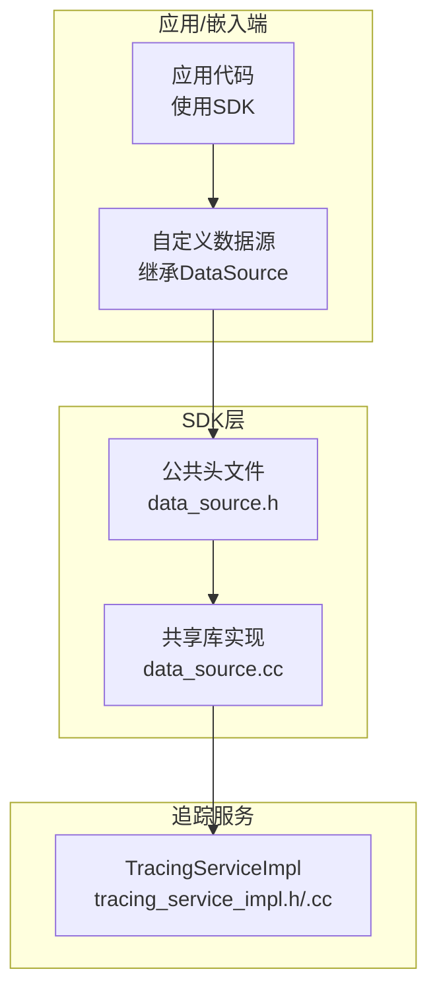
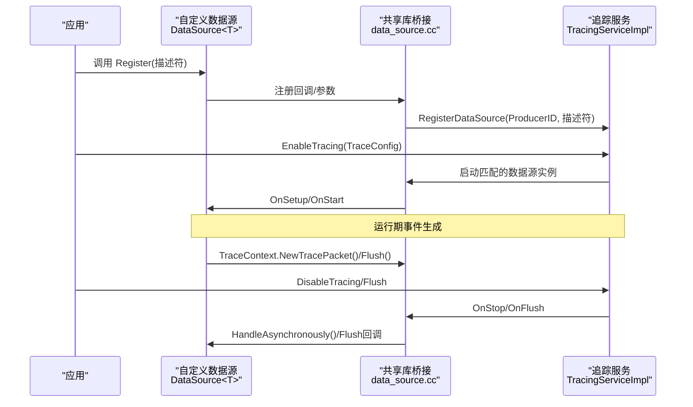
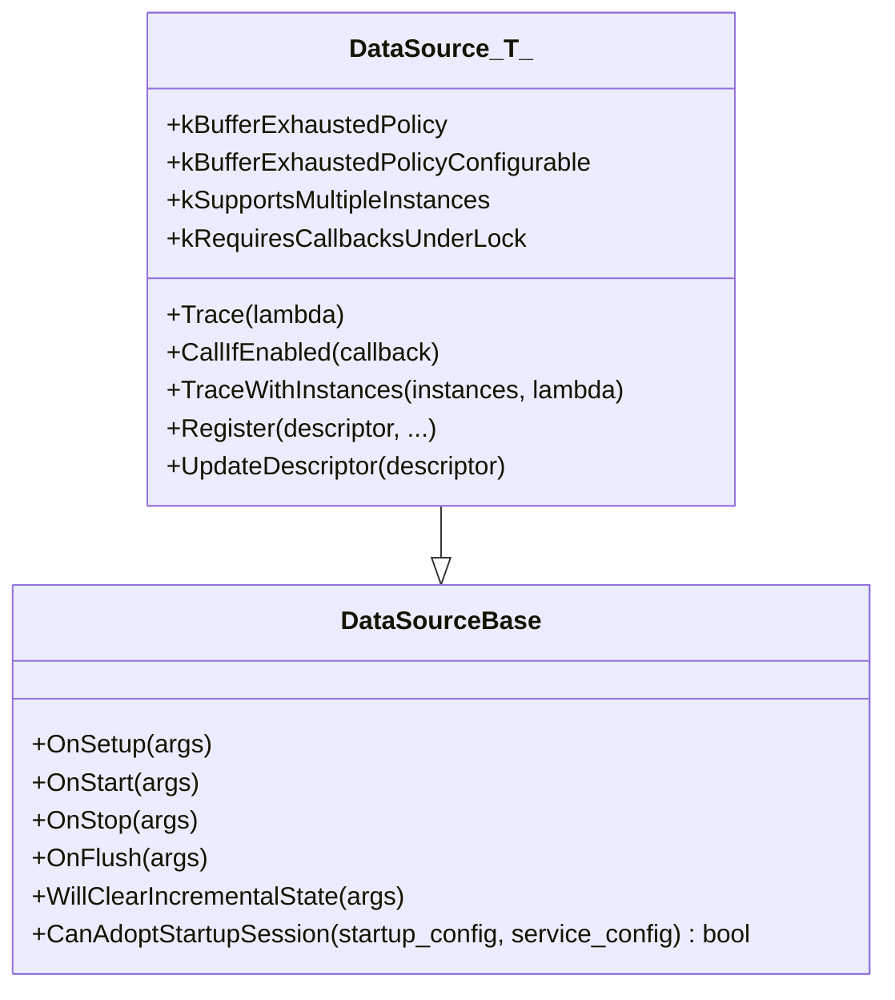
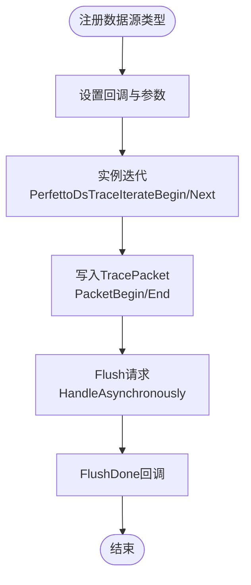
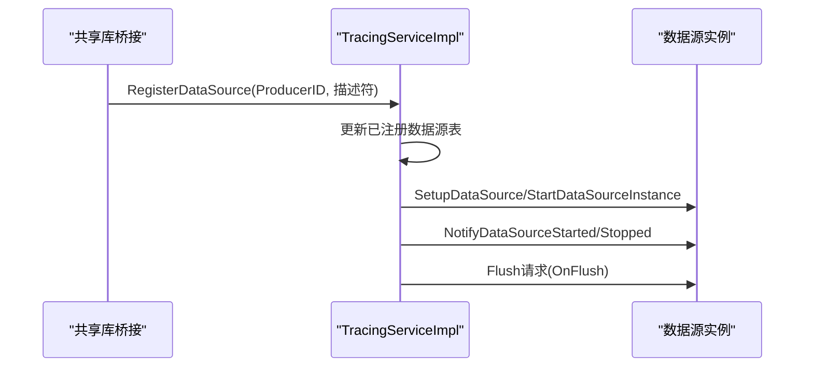
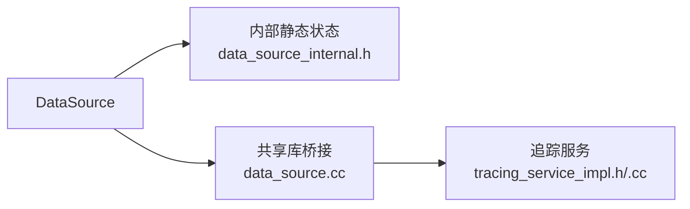

# 自定义数据源开发

<cite>
**本文档引用的文件**
- [example_custom_data_source.cc](file://examples/sdk/example_custom_data_source.cc)
- [data_source.h](file://include/perfetto/tracing/data_source.h)
- [data_source.cc](file://src/shared_lib/data_source.cc)
- [tracing_service_impl.h](file://src/tracing/service/tracing_service_impl.h)
- [tracing_service_impl.cc](file://src/tracing/service/tracing_service_impl.cc)
- [data_source.h（公共接口）](file://include/perfetto/public/data_source.h)
- [buffers.md](file://docs/concepts/buffers.md)
- [config.md](file://docs/concepts/config.md)
- [cpu-scheduling.md](file://docs/data-sources/cpu-scheduling.md)
- [memory-counters.md](file://docs/data-sources/memory-counters.md)
- [buffer_exhausted_policy.h](file://include/perfetto/tracing/buffer_exhausted_policy.h)
- [shared_memory_arbiter_impl.cc](file://src/tracing/core/shared_memory_arbiter_impl.cc)
- [data_source_internal.h](file://include/perfetto/tracing/internal/data_source_internal.h)
</cite>

## 目录
1. [简介](#简介)
2. [项目结构](#项目结构)
3. [核心组件](#核心组件)
4. [架构总览](#架构总览)
5. [详细组件分析](#详细组件分析)
6. [依赖关系分析](#依赖关系分析)
7. [性能考量](#性能考量)
8. [故障排查指南](#故障排查指南)
9. [结论](#结论)
10. [附录](#附录)

## 简介
本文件面向希望在Perfetto中开发自定义数据源的工程师，系统阐述DataSource基类的继承方式、生命周期管理、事件生成机制，以及与追踪服务的交互协议与通信机制。文档同时提供可直接参考的完整示例路径、性能优化策略、内存管理与线程安全注意事项，并覆盖配置选项、过滤机制与调试方法，帮助开发者将自定义数据源与现有内置数据源进行集成与兼容。

## 项目结构
围绕自定义数据源开发，Perfetto在以下层次提供支撑：
- 公共SDK与头文件：提供DataSource模板类、公共ABI接口、数据源描述符等。
- 共享库实现：封装C ABI桥接、回调注册、实例迭代、TraceWriter访问等。
- 追踪服务：负责会话管理、数据源注册/更新、启停通知、缓冲区调度与数据汇聚。
- 文档与示例：提供配置规范、内置数据源用法、缓冲区与性能指导。

**图表来源**
- [data_source.h:256-520](file://include/perfetto/tracing/data_source.h#L256-L520)
- [data_source.cc:274-428](file://src/shared_lib/data_source.cc#L274-L428)
- [tracing_service_impl.h:90-130](file://src/tracing/service/tracing_service_impl.h#L90-L130)

**章节来源**
- [data_source.h:256-520](file://include/perfetto/tracing/data_source.h#L256-L520)
- [data_source.cc:274-428](file://src/shared_lib/data_source.cc#L274-L428)
- [tracing_service_impl.h:90-130](file://src/tracing/service/tracing_service_impl.h#L90-L130)

## 核心组件
- DataSource模板类：定义数据源生命周期回调（OnSetup/OnStart/OnStop/OnFlush）、Trace上下文、注册与描述符更新等。
- 共享库桥接：将C ABI回调映射到DataSource生命周期，支持增量状态与自定义TLS、异步停止/刷新处理。
- 追踪服务：接收数据源注册、按TraceConfig启用数据源、分发启停与刷新请求、管理缓冲区与会话。

关键职责与接口要点：
- 生命周期回调：OnSetup在配置阶段调用；OnStart在实际开始时调用；OnStop在停止前调用，支持HandleAsynchronously推迟停止；OnFlush用于触发数据源侧的清理或跨线程Flush。
- Trace上下文：提供NewTracePacket、Flush、AddEmptyTracePacket、GetDataSourceLocked、GetCustomTlsState、GetIncrementalState等能力。
- 注册与描述符：Register/UpdateDescriptor，描述符包含名称、是否需要显式停止通知等元信息。
- 共享库接口：PerfettoDsRegister/Params、回调设置、实例迭代、包写入与Flush。

**章节来源**
- [data_source.h:88-201](file://include/perfetto/tracing/data_source.h#L88-L201)
- [data_source.h:292-479](file://include/perfetto/tracing/data_source.h#L292-L479)
- [data_source.h:471-521](file://include/perfetto/tracing/data_source.h#L471-L521)
- [data_source.cc:140-210](file://src/shared_lib/data_source.cc#L140-L210)
- [data_source.cc:274-428](file://src/shared_lib/data_source.cc#L274-L428)
- [data_source.h（公共接口）:32-104](file://include/perfetto/public/data_source.h#L32-L104)

## 架构总览
下图展示了从应用发起Trace到追踪服务分发启停与刷新的关键交互：

**图表来源**
- [data_source.h:471-521](file://include/perfetto/tracing/data_source.h#L471-L521)
- [data_source.cc:140-210](file://src/shared_lib/data_source.cc#L140-L210)
- [tracing_service_impl.h:90-130](file://src/tracing/service/tracing_service_impl.h#L90-L130)
- [tracing_service_impl.cc:3113-3147](file://src/tracing/service/tracing_service_impl.cc#L3113-L3147)

## 详细组件分析

### DataSource模板类与生命周期
- 继承与注册：派生类需继承DataSource<Template>，通过Register传入DataSourceDescriptor，随后在TraceConfig启用后接收OnSetup/OnStart；停止时OnStop可选择异步推迟。
- Trace上下文：TraceContext提供NewTracePacket、Flush、AddEmptyTracePacket、GetDataSourceLocked、GetCustomTlsState、GetIncrementalState等。
- 多实例与回调锁：kSupportsMultipleInstances控制多实例；kRequiresCallbacksUnderLock影响回调是否在内部锁下执行。
- 缓冲耗尽策略：kBufferExhaustedPolicy与kBufferExhaustedPolicyConfigurable决定默认行为与可配置性。

**图表来源**
- [data_source.h:88-201](file://include/perfetto/tracing/data_source.h#L88-L201)
- [data_source.h:256-520](file://include/perfetto/tracing/data_source.h#L256-L520)

**章节来源**
- [data_source.h:88-201](file://include/perfetto/tracing/data_source.h#L88-L201)
- [data_source.h:256-520](file://include/perfetto/tracing/data_source.h#L256-L520)

### 共享库桥接与C ABI
- 回调注册：PerfettoDsRegister设置on_setup/on_start/on_stop/on_flush等回调，以及用户参数与缓冲耗尽策略。
- 实例迭代：提供PerfettoDsTraceIterateBegin/Next/Break，遍历当前线程活跃实例。
- 包写入：PerfettoDsTracerPacketBegin/End绑定到TraceWriter，Flush支持异步完成回调。
- 异步停止/刷新：OnStopArgsPostpone/StopDone、OnFlushArgsPostpone/FlushDone用于延迟完成。

**图表来源**
- [data_source.h（公共接口）:106-188](file://include/perfetto/public/data_source.h#L106-L188)
- [data_source.h（公共接口）:190-292](file://include/perfetto/public/data_source.h#L190-L292)
- [data_source.cc:439-463](file://src/shared_lib/data_source.cc#L439-L463)

**章节来源**
- [data_source.h（公共接口）:32-104](file://include/perfetto/public/data_source.h#L32-L104)
- [data_source.h（公共接口）:106-188](file://include/perfetto/public/data_source.h#L106-L188)
- [data_source.h（公共接口）:190-292](file://include/perfetto/public/data_source.h#L190-L292)
- [data_source.cc:439-463](file://src/shared_lib/data_source.cc#L439-L463)

### 追踪服务与会话管理
- 数据源注册/更新：RegisterDataSource/UpdateDataSource由共享库桥接调用，追踪服务维护已注册数据源列表与会话状态。
- 启停流程：EnableTracing后，追踪服务根据TraceConfig匹配数据源并启动；DisableTracing/Flush触发OnStop/OnFlush。
- 实例管理：SetupDataSource/StartDataSourceInstance负责为现有会话启用新注册的数据源实例。

**图表来源**
- [tracing_service_impl.h:90-130](file://src/tracing/service/tracing_service_impl.h#L90-L130)
- [tracing_service_impl.cc:3113-3147](file://src/tracing/service/tracing_service_impl.cc#L3113-L3147)

**章节来源**
- [tracing_service_impl.h:90-130](file://src/tracing/service/tracing_service_impl.h#L90-L130)
- [tracing_service_impl.cc:3113-3147](file://src/tracing/service/tracing_service_impl.cc#L3113-L3147)

### 完整开发示例（路径）
以下示例展示了如何定义、注册、启用并生成事件的完整流程：
- 定义数据源类并继承DataSource<Template>
- 在初始化后调用Register注册
- 配置TraceConfig启用该数据源
- 使用TraceContext写入TracePacket
- 停止时调用Flush确保最后事件落盘

示例文件路径：
- [example_custom_data_source.cc:38-108](file://examples/sdk/example_custom_data_source.cc#L38-L108)
- [example_custom_data_source.cc:110-124](file://examples/sdk/example_custom_data_source.cc#L110-L124)

**章节来源**
- [example_custom_data_source.cc:38-108](file://examples/sdk/example_custom_data_source.cc#L38-L108)
- [example_custom_data_source.cc:110-124](file://examples/sdk/example_custom_data_source.cc#L110-L124)

### 数据源配置与过滤
- TraceConfig中的DataSource字段包含name、target_buffer、trace_duration_ms等通用字段，以及各数据源特定的配置段（如ftrace_config、android_power_config等）。
- 追踪服务将原始二进制的DataSourceConfig传递给匹配名称的数据源，不强制解码，保证向前兼容。
- 可通过target_buffer将增量状态或关键描述符放入更少被覆盖的缓冲区，减少丢失风险。

**章节来源**
- [config.md:276-320](file://docs/concepts/config.md#L276-L320)
- [protos配置片段:309-325](file://protos/perfetto/config/data_source_config.proto#L309-L325)

### 与内置数据源的集成与兼容
- 内置数据源（如linux.ftrace、linux.process_stats、linux.sys_stats等）通过相同注册/启停协议接入追踪服务。
- 示例：CPU调度事件与内存计数器均通过TraceConfig启用相应数据源，并在UI/SQL中呈现。
- 自定义数据源应遵循相同的生命周期与缓冲策略，以确保与内置数据源一致的行为。

**章节来源**
- [cpu-scheduling.md:56-85](file://docs/data-sources/cpu-scheduling.md#L56-L85)
- [memory-counters.md:147-166](file://docs/data-sources/memory-counters.md#L147-L166)

## 依赖关系分析
- DataSource模板类依赖内部静态状态与TLS，支持快速路径判断与实例迭代。
- 共享库桥接依赖DataSourceType工厂与回调，将C ABI映射到C++生命周期。
- 追踪服务依赖ProducerEndpoint/ConsumerEndpoint，协调数据源启停与缓冲区调度。

**图表来源**
- [data_source.h:256-520](file://include/perfetto/tracing/data_source.h#L256-L520)
- [data_source_internal.h:148-187](file://include/perfetto/tracing/internal/data_source_internal.h#L148-L187)
- [data_source.cc:274-428](file://src/shared_lib/data_source.cc#L274-L428)
- [tracing_service_impl.h:90-130](file://src/tracing/service/tracing_service_impl.h#L90-L130)

**章节来源**
- [data_source_internal.h:148-187](file://include/perfetto/tracing/internal/data_source_internal.h#L148-L187)
- [data_source.cc:274-428](file://src/shared_lib/data_source.cc#L274-L428)
- [tracing_service_impl.h:90-130](file://src/tracing/service/tracing_service_impl.h#L90-L130)

## 性能考量
- 缓冲耗尽策略：kDrop、kStall、kStallThenDrop三种策略，分别对应丢弃、阻塞等待与先阻塞再丢弃。kStall要求系统具备足够调度保障，否则可能超时导致数据丢失。
- 共享内存缓冲区大小：应覆盖峰值写入速率与追踪服务调度阻塞时间的乘积；对于大包突发，建议增大共享内存或采用kStall策略。
- Flush周期：长时录制建议设置flush_period_ms，避免事件过长时间滞留共享内存导致顺序错乱与导入失败。
- 增量状态清理：通过IncrementalStateConfig.clear_period_ms定期清理，或将其放入专用缓冲区，降低环形缓冲覆盖带来的描述符丢失风险。

**章节来源**
- [buffer_exhausted_policy.h:29-54](file://include/perfetto/tracing/buffer_exhausted_policy.h#L29-L54)
- [shared_memory_arbiter_impl.cc:104-141](file://src/tracing/core/shared_memory_arbiter_impl.cc#L104-L141)
- [buffers.md:100-180](file://docs/concepts/buffers.md#L100-L180)
- [buffers.md:361-414](file://docs/concepts/buffers.md#L361-L414)

## 故障排查指南
- 数据丢失定位：通过统计字段（如ftrace_cpu_overrun_end、traced_buf_trace_writer_packet_loss、traced_buf_chunks_overwritten/chunks_discarded）定位损失发生在内核ftrace、共享内存还是中心缓冲区。
- 事件顺序问题：长时录制未设置flush_period_ms可能导致TraceProcessor窗口排序失败，可通过--full-sort或设置flush_period_ms缓解。
- 增量状态丢失：当ring-buffer模式下关键描述符被覆盖，可开启增量状态清理或放入专用缓冲区。

**章节来源**
- [buffers.md:180-266](file://docs/concepts/buffers.md#L180-L266)
- [buffers.md:361-414](file://docs/concepts/buffers.md#L361-L414)

## 结论
通过DataSource模板类与共享库桥接，自定义数据源可以无缝接入Perfetto的生命周期与缓冲体系。遵循统一的注册/启停协议、合理配置缓冲策略与Flush周期、正确处理异步停止/刷新，即可实现高性能、低侵入的自定义追踪数据采集，并与内置数据源保持良好兼容。

## 附录
- 关键宏与静态成员声明/定义：PERFETTO_DECLARE_DATA_SOURCE_STATIC_MEMBERS与PERFETTO_DEFINE_DATA_SOURCE_STATIC_MEMBERS用于模板实例化与静态存储分配。
- 示例参考：自定义数据源示例文件提供了从注册到事件生成再到停止落盘的完整路径。

**章节来源**
- [data_source.h:651-682](file://include/perfetto/tracing/data_source.h#L651-L682)
- [example_custom_data_source.cc:107-108](file://examples/sdk/example_custom_data_source.cc#L107-L108)