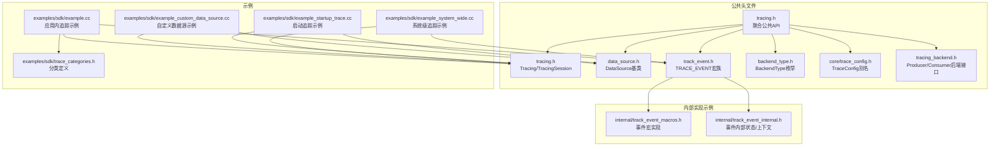
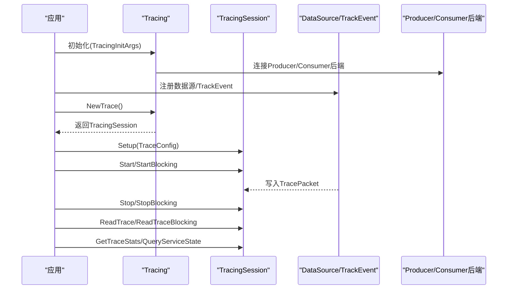
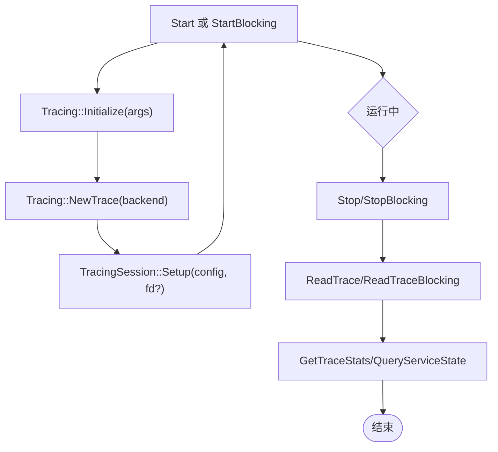
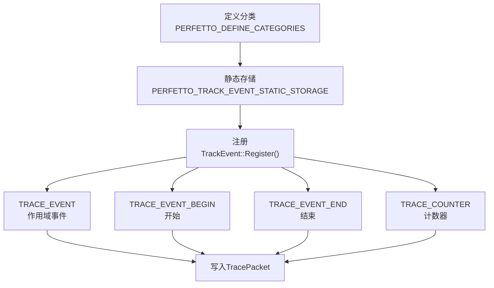
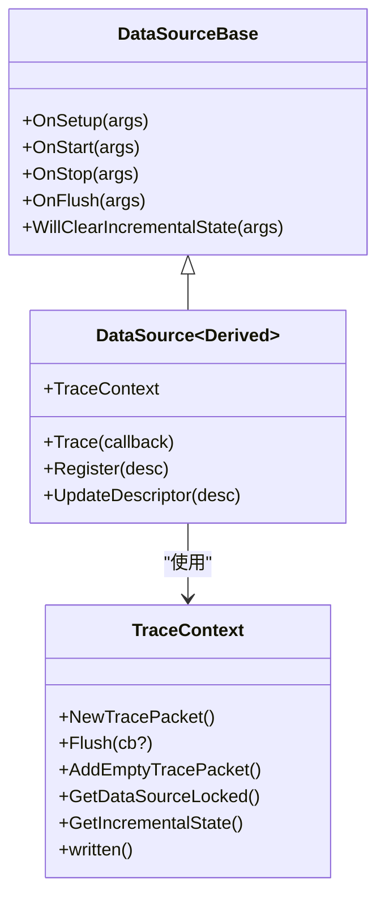
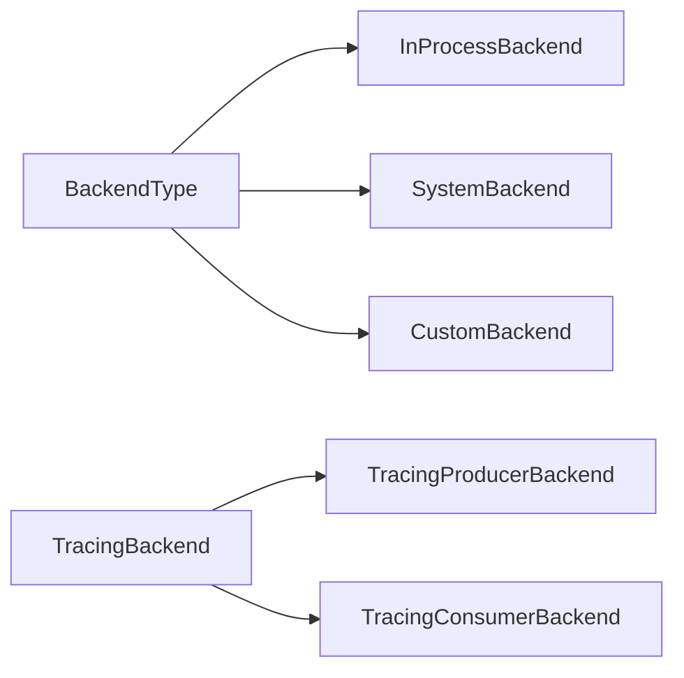
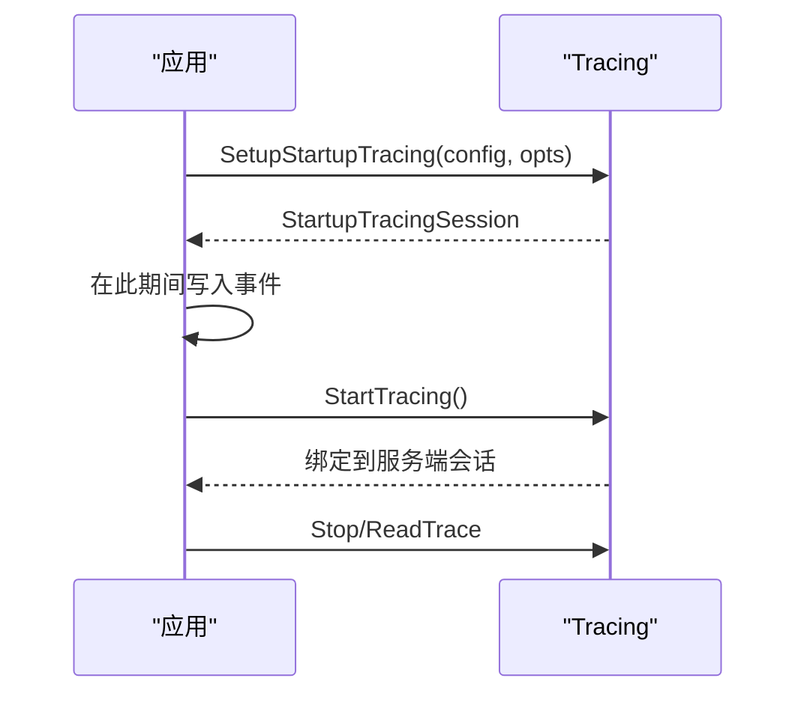
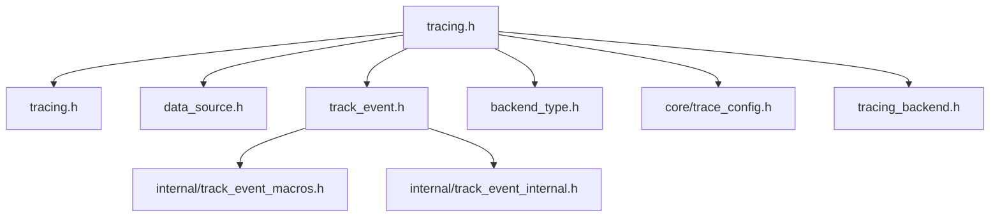

# 追踪SDK

<cite>
**本文引用的文件**
- [include/perfetto/tracing.h](file://include/perfetto/tracing.h)
- [include/perfetto/tracing/tracing.h](file://include/perfetto/tracing/tracing.h)
- [include/perfetto/tracing/data_source.h](file://include/perfetto/tracing/data_source.h)
- [include/perfetto/tracing/track_event.h](file://include/perfetto/tracing/track_event.h)
- [include/perfetto/tracing/backend_type.h](file://include/perfetto/tracing/backend_type.h)
- [include/perfetto/tracing/core/trace_config.h](file://include/perfetto/tracing/core/trace_config.h)
- [include/perfetto/tracing/tracing_backend.h](file://include/perfetto/tracing/tracing_backend.h)
- [include/perfetto/tracing/internal/track_event_macros.h](file://include/perfetto/tracing/internal/track_event_macros.h)
- [include/perfetto/tracing/internal/track_event_internal.h](file://include/perfetto/tracing/internal/track_event_internal.h)
- [examples/sdk/example.cc](file://examples/sdk/example.cc)
- [examples/sdk/example_custom_data_source.cc](file://examples/sdk/example_custom_data_source.cc)
- [examples/sdk/example_system_wide.cc](file://examples/sdk/example_system_wide.cc)
- [examples/sdk/example_startup_trace.cc](file://examples/sdk/example_startup_trace.cc)
- [examples/sdk/trace_categories.h](file://examples/sdk/trace_categories.h)
- [docs/getting-started/in-app-tracing.md](file://docs/getting-started/in-app-tracing.md)
</cite>

## 目录
1. [简介](#简介)
2. [项目结构](#项目结构)
3. [核心组件](#核心组件)
4. [架构总览](#架构总览)
5. [详细组件分析](#详细组件分析)
6. [依赖关系分析](#依赖关系分析)
7. [性能考量](#性能考量)
8. [故障排除指南](#故障排除指南)
9. [结论](#结论)
10. [附录](#附录)

## 简介
本文件面向希望在C++17应用中集成Perfetto追踪SDK的开发者，系统性讲解SDK的API与使用方法，覆盖以下主题：
- 追踪事件的创建、配置与记录：同步事件、异步事件与参数化事件
- 自定义数据源开发与注册
- 追踪会话管理：初始化、启动、停止、读取与统计查询
- SDK与追踪服务的交互机制：数据源注册、事件流控制与缓冲区策略
- 配置选项、最佳实践与常见陷阱
- 调试技巧、性能调优与故障排除

## 项目结构
Perfetto SDK以头文件形式提供公共API，核心入口位于公共头文件集合，示例与文档位于examples与docs目录。下图给出与追踪SDK相关的关键文件与模块关系。

**图表来源**
- [include/perfetto/tracing.h:26-41](file://include/perfetto/tracing.h#L26-L41)
- [include/perfetto/tracing/tracing.h:188-331](file://include/perfetto/tracing/tracing.h#L188-L331)
- [include/perfetto/tracing/data_source.h:88-201](file://include/perfetto/tracing/data_source.h#L88-L201)
- [include/perfetto/tracing/track_event.h:30-116](file://include/perfetto/tracing/track_event.h#L30-L116)
- [include/perfetto/tracing/backend_type.h:24-40](file://include/perfetto/tracing/backend_type.h#L24-L40)
- [include/perfetto/tracing/core/trace_config.h:20-38](file://include/perfetto/tracing/core/trace_config.h#L20-L38)
- [include/perfetto/tracing/tracing_backend.h:52-114](file://include/perfetto/tracing/tracing_backend.h#L52-L114)
- [include/perfetto/tracing/internal/track_event_macros.h:132-168](file://include/perfetto/tracing/internal/track_event_macros.h#L132-L168)
- [include/perfetto/tracing/internal/track_event_internal.h:84-100](file://include/perfetto/tracing/internal/track_event_internal.h#L84-L100)
- [examples/sdk/example.cc:35-83](file://examples/sdk/example.cc#L35-L83)
- [examples/sdk/example_custom_data_source.cc:40-108](file://examples/sdk/example_custom_data_source.cc#L40-L108)
- [examples/sdk/example_system_wide.cc:67-86](file://examples/sdk/example_system_wide.cc#L67-L86)
- [examples/sdk/example_startup_trace.cc:44-111](file://examples/sdk/example_startup_trace.cc#L44-L111)
- [examples/sdk/trace_categories.h:33-41](file://examples/sdk/trace_categories.h#L33-L41)

**章节来源**
- [include/perfetto/tracing.h:26-41](file://include/perfetto/tracing.h#L26-L41)
- [docs/getting-started/in-app-tracing.md:1-200](file://docs/getting-started/in-app-tracing.md#L1-L200)

## 核心组件
- Tracing/TracingSession：追踪初始化、会话生命周期管理、配置、启动/停止、读取、统计与错误回调
- DataSource/DataSourceBase：自定义数据源基类，提供OnSetup/OnStart/OnStop/OnFlush等回调
- TrackEvent：事件宏族（TRACE_EVENT、TRACE_EVENT_BEGIN/END、TRACE_COUNTER），支持分类、参数、时间戳与跟踪对象
- BackendType/TracingBackend：后端类型与自定义后端接口，支持进程内、系统级与自定义IPC
- TraceConfig：追踪配置的生成器别名，用于缓冲区、数据源与触发器等设置

**章节来源**
- [include/perfetto/tracing/tracing.h:188-331](file://include/perfetto/tracing/tracing.h#L188-L331)
- [include/perfetto/tracing/data_source.h:88-201](file://include/perfetto/tracing/data_source.h#L88-L201)
- [include/perfetto/tracing/track_event.h:269-443](file://include/perfetto/tracing/track_event.h#L269-L443)
- [include/perfetto/tracing/backend_type.h:24-40](file://include/perfetto/tracing/backend_type.h#L24-L40)
- [include/perfetto/tracing/core/trace_config.h:20-38](file://include/perfetto/tracing/core/trace_config.h#L20-L38)

## 架构总览
下图展示了从应用侧到追踪服务的典型调用链：应用初始化SDK、注册数据源、创建追踪会话、配置缓冲区与数据源、开始/停止追踪、读取与统计查询。

**图表来源**
- [include/perfetto/tracing/tracing.h:198-225](file://include/perfetto/tracing/tracing.h#L198-L225)
- [include/perfetto/tracing/tracing.h:332-519](file://include/perfetto/tracing/tracing.h#L332-L519)
- [include/perfetto/tracing/data_source.h:471-521](file://include/perfetto/tracing/data_source.h#L471-L521)
- [include/perfetto/tracing/tracing_backend.h:52-108](file://include/perfetto/tracing/tracing_backend.h#L52-L108)

## 详细组件分析

### 组件一：追踪会话管理（Tracing/TracingSession）
- 初始化：Tracing::Initialize接收TracingInitArgs，按位或选择后端（kInProcessBackend/kSystemBackend/kCustomBackend），可配置共享内存大小、页大小、批提交时延、日志回调、策略等
- 会话创建：Tracing::NewTrace返回TracingSession实例；支持阻塞/非阻塞Start/Stop
- 配置：Setup传入TraceConfig，可指定buffers、data_sources、duration等；支持直接写文件描述符
- 读取与统计：ReadTrace/ReadTraceBlocking读取原始trace数据；GetTraceStats/QueryServiceState查询统计与服务状态
- 错误处理：SetOnErrorCallback接收TracingError（断连、配置错误等）

**图表来源**
- [include/perfetto/tracing/tracing.h:198-225](file://include/perfetto/tracing/tracing.h#L198-L225)
- [include/perfetto/tracing/tracing.h:332-519](file://include/perfetto/tracing/tracing.h#L332-L519)

**章节来源**
- [include/perfetto/tracing/tracing.h:198-225](file://include/perfetto/tracing/tracing.h#L198-L225)
- [include/perfetto/tracing/tracing.h:332-519](file://include/perfetto/tracing/tracing.h#L332-L519)

### 组件二：追踪事件宏族（TrackEvent）
- 分类与注册：通过PERFETTO_DEFINE_CATEGORIES声明分类，PERFETTO_TRACK_EVENT_STATIC_STORAGE分配静态存储，随后在main中调用TrackEvent::Register
- 同步事件：TRACE_EVENT记录作用域事件，自动在作用域结束时关闭
- 异步事件：TRACE_EVENT_BEGIN/TRACE_EVENT_END手动配对，支持跨线程/跨进程跟踪
- 参数化事件：支持最多两个调试注解键值对，或通过lambda写入复杂字段
- 计数器：TRACE_COUNTER记录数值随时间变化的计数器，支持单位与倍数配置
- 时间戳：可显式传入自定义时间戳，或使用默认跟踪时钟

**图表来源**
- [include/perfetto/tracing/track_event.h:43-72](file://include/perfetto/tracing/track_event.h#L43-L72)
- [include/perfetto/tracing/track_event.h:269-443](file://include/perfetto/tracing/track_event.h#L269-L443)
- [include/perfetto/tracing/internal/track_event_macros.h:132-168](file://include/perfetto/tracing/internal/track_event_macros.h#L132-L168)
- [examples/sdk/trace_categories.h:33-41](file://examples/sdk/trace_categories.h#L33-L41)

**章节来源**
- [include/perfetto/tracing/track_event.h:269-443](file://include/perfetto/tracing/track_event.h#L269-L443)
- [include/perfetto/tracing/internal/track_event_macros.h:132-168](file://include/perfetto/tracing/internal/track_event_macros.h#L132-L168)
- [examples/sdk/trace_categories.h:33-41](file://examples/sdk/trace_categories.h#L33-L41)

### 组件三：自定义数据源（DataSource）
- 继承模板类DataSource<Derived>，重写OnSetup/OnStart/OnStop/OnFlush等回调
- Trace()是写入事件的主要入口，支持TraceContext获取TracePacket、Flush、AddEmptyTracePacket等
- Register()注册数据源描述符（名称等），支持多实例与回调锁策略
- 支持异步停止/刷新：OnStop/OnFlush可返回HandleAsynchronously()延迟完成

**图表来源**
- [include/perfetto/tracing/data_source.h:88-201](file://include/perfetto/tracing/data_source.h#L88-L201)
- [include/perfetto/tracing/data_source.h:293-392](file://include/perfetto/tracing/data_source.h#L293-L392)

**章节来源**
- [include/perfetto/tracing/data_source.h:88-201](file://include/perfetto/tracing/data_source.h#L88-L201)
- [include/perfetto/tracing/data_source.h:293-392](file://include/perfetto/tracing/data_source.h#L293-L392)

### 组件四：后端与系统集成（BackendType/TracingBackend）
- BackendType：kInProcessBackend（进程内）、kSystemBackend（系统服务）、kCustomBackend（自定义IPC）
- TracingBackend：统一Producer/Consumer后端接口，支持连接参数（共享内存提示、socket创建回调等）
- 系统后端：示例中通过traced服务进行系统级追踪，支持会话观察者与启用状态查询

**图表来源**
- [include/perfetto/tracing/backend_type.h:24-40](file://include/perfetto/tracing/backend_type.h#L24-L40)
- [include/perfetto/tracing/tracing_backend.h:52-114](file://include/perfetto/tracing/tracing_backend.h#L52-L114)
- [examples/sdk/example_system_wide.cc:67-86](file://examples/sdk/example_system_wide.cc#L67-L86)

**章节来源**
- [include/perfetto/tracing/backend_type.h:24-40](file://include/perfetto/tracing/backend_type.h#L24-L40)
- [include/perfetto/tracing/tracing_backend.h:52-114](file://include/perfetto/tracing/tracing_backend.h#L52-L114)
- [examples/sdk/example_system_wide.cc:67-86](file://examples/sdk/example_system_wide.cc#L67-L86)

### 组件五：配置与启动追踪（TraceConfig/StartupTracing）
- TraceConfig：buffers、data_sources、duration、trigger等字段；示例中启用track_event并配置分类
- StartupTracing：在系统服务就绪前预热数据源，等待服务端匹配配置后接管；不支持进程内后端

**图表来源**
- [include/perfetto/tracing/tracing.h:253-313](file://include/perfetto/tracing/tracing.h#L253-L313)
- [examples/sdk/example_startup_trace.cc:71-82](file://examples/sdk/example_startup_trace.cc#L71-L82)

**章节来源**
- [include/perfetto/tracing/core/trace_config.h:20-38](file://include/perfetto/tracing/core/trace_config.h#L20-L38)
- [examples/sdk/example_startup_trace.cc:63-82](file://examples/sdk/example_startup_trace.cc#L63-L82)

## 依赖关系分析
- 公共聚合头文件tracing.h将常用组件集中导出，便于嵌入式使用
- TrackEvent依赖内部宏与事件内部状态，提供高性能事件写入路径
- DataSource与TracingSession通过后端接口与服务通信，支持共享内存与批提交优化

**图表来源**
- [include/perfetto/tracing.h:26-41](file://include/perfetto/tracing.h#L26-L41)
- [include/perfetto/tracing/track_event.h:20-26](file://include/perfetto/tracing/track_event.h#L20-L26)
- [include/perfetto/tracing/internal/track_event_macros.h:132-168](file://include/perfetto/tracing/internal/track_event_macros.h#L132-L168)
- [include/perfetto/tracing/internal/track_event_internal.h:84-100](file://include/perfetto/tracing/internal/track_event_internal.h#L84-L100)

**章节来源**
- [include/perfetto/tracing.h:26-41](file://include/perfetto/tracing.h#L26-L41)

## 性能考量
- 缓冲与批提交：TracingInitArgs提供共享内存大小、页大小与批提交时延配置，平衡吞吐与延迟
- 事件写入路径：DataSource::TraceContext::Flush需谨慎使用，仅在必要时强制提交
- 分类与参数：合理使用分类与调试注解，避免在禁用状态下评估昂贵参数
- 启动追踪：StartupTracing在系统服务未就绪时预热，减少首帧延迟

[本节为通用指导，无需具体文件引用]

## 故障排除指南
- 断连与配置错误：通过SetOnErrorCallback接收TracingError，区分断连与配置失败
- 事件丢失：确保在Stop前调用Flush或在OnStop中HandleAsynchronously()返回的闭包
- 分类未生效：确认已调用TrackEvent::Register，并在TraceConfig中正确启用目标分类
- 系统后端不可用：检查traced是否运行，或在初始化时开启enable_system_consumer

**章节来源**
- [include/perfetto/tracing/tracing.h:420-422](file://include/perfetto/tracing/tracing.h#L420-L422)
- [include/perfetto/tracing/data_source.h:131-149](file://include/perfetto/tracing/data_source.h#L131-L149)

## 结论
Perfetto追踪SDK提供了从应用内到系统级的完整追踪能力。通过Tracing/TracingSession管理会话，使用TrackEvent宏族记录事件，以及自定义DataSource扩展数据源，开发者可以灵活地集成性能分析与问题定位流程。结合合理的配置与性能调优策略，可在保证低开销的同时获得高质量的追踪数据。

[本节为总结，无需具体文件引用]

## 附录

### 使用示例与最佳实践
- 应用内追踪：参考示例，定义分类、注册TrackEvent、创建会话、配置buffers与data_sources、记录事件并读取trace
- 自定义数据源：继承DataSource，实现OnSetup/OnStart/OnStop，使用TraceContext写入TracePacket
- 系统级追踪：使用kSystemBackend，配合traced服务与perfetto客户端进行会话控制
- 启动追踪：在系统服务就绪前预热，等待服务端匹配配置后接管

**章节来源**
- [examples/sdk/example.cc:35-83](file://examples/sdk/example.cc#L35-L83)
- [examples/sdk/example_custom_data_source.cc:40-108](file://examples/sdk/example_custom_data_source.cc#L40-L108)
- [examples/sdk/example_system_wide.cc:88-98](file://examples/sdk/example_system_wide.cc#L88-L98)
- [examples/sdk/example_startup_trace.cc:46-59](file://examples/sdk/example_startup_trace.cc#L46-L59)
- [docs/getting-started/in-app-tracing.md:93-163](file://docs/getting-started/in-app-tracing.md#L93-L163)