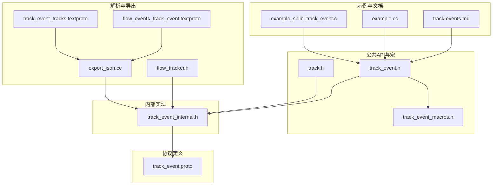
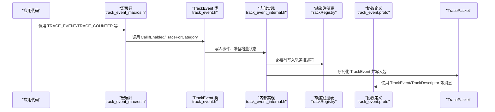
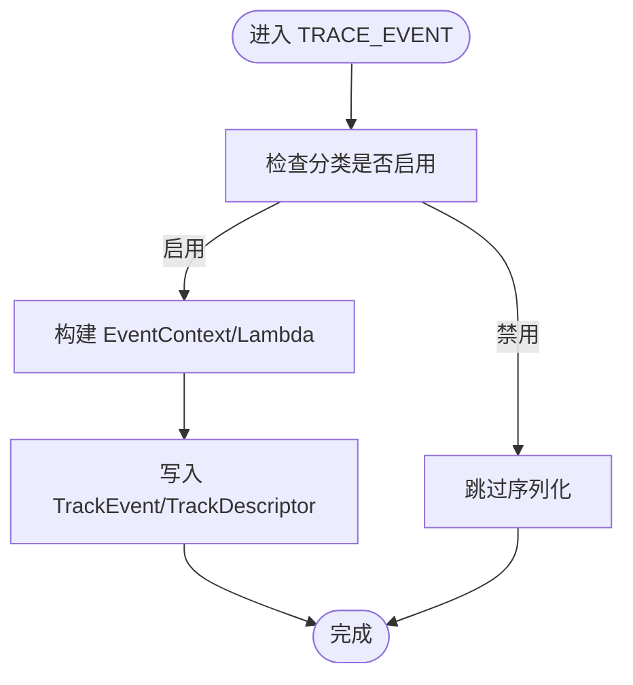
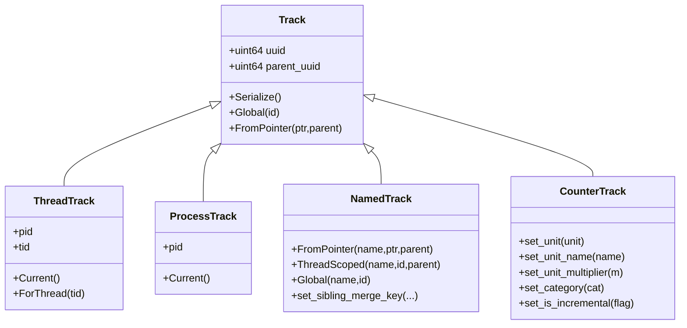
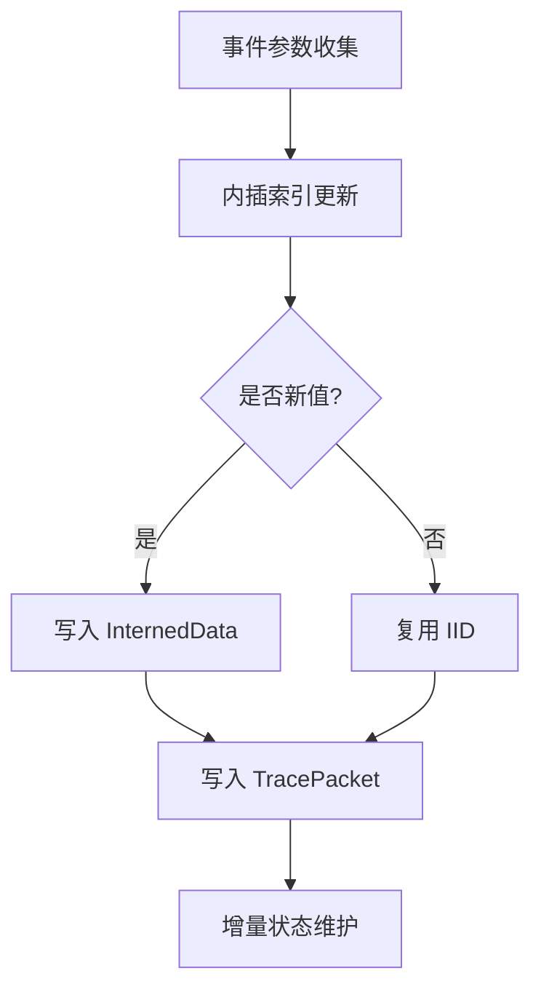
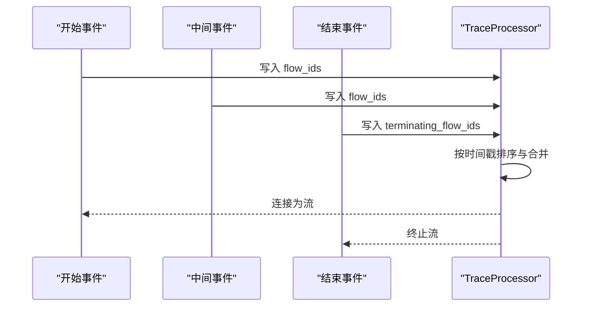
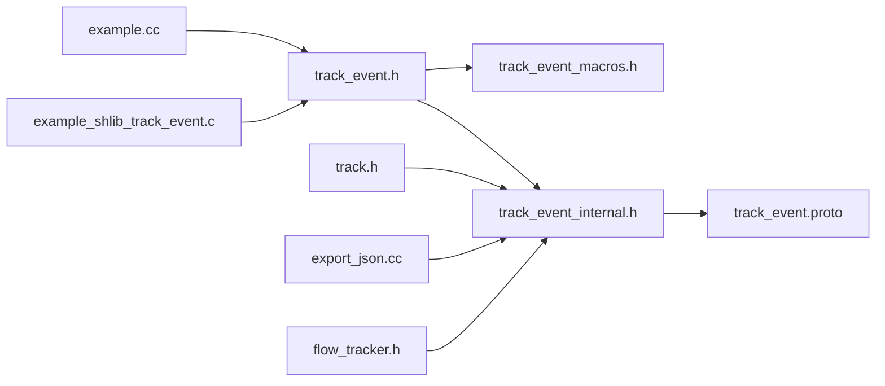

# 追踪事件记录

<cite>
**本文引用的文件**
- [include/perfetto/tracing.h](file://include/perfetto/tracing.h)
- [include/perfetto/tracing/track_event.h](file://include/perfetto/tracing/track_event.h)
- [include/perfetto/tracing/track.h](file://include/perfetto/tracing/track.h)
- [include/perfetto/tracing/internal/track_event_macros.h](file://include/perfetto/tracing/internal/track_event_macros.h)
- [include/perfetto/tracing/internal/track_event_internal.h](file://include/perfetto/tracing/internal/track_event_internal.h)
- [docs/instrumentation/track-events.md](file://docs/instrumentation/track-events.md)
- [examples/sdk/example.cc](file://examples/sdk/example.cc)
- [examples/shared_lib/example_shlib_track_event.c](file://examples/shared_lib/example_shlib_track_event.c)
- [protos/perfetto/trace/track_event/track_event.proto](file://protos/perfetto/trace/track_event/track_event.proto)
- [src/tracing/test/api_integrationtest.cc](file://src/tracing/test/api_integrationtest.cc)
- [src/trace_processor/importers/common/flow_tracker.h](file://src/trace_processor/importers/common/flow_tracker.h)
- [src/trace_processor/export_json.cc](file://src/trace_processor/export_json.cc)
- [test/trace_processor/diff_tests/parser/track_event/flow_events_track_event.textproto](file://test/trace_processor/diff_tests/parser/track_event/flow_events_track_event.textproto)
- [test/trace_processor/diff_tests/parser/track_event/track_event_tracks.textproto](file://test/trace_processor/diff_tests/parser/track_event/track_event_tracks.textproto)
</cite>

## 目录
1. [简介](#简介)
2. [项目结构](#项目结构)
3. [核心组件](#核心组件)
4. [架构总览](#架构总览)
5. [详细组件分析](#详细组件分析)
6. [依赖关系分析](#依赖关系分析)
7. [性能考量](#性能考量)
8. [故障排查指南](#故障排查指南)
9. [结论](#结论)
10. [附录](#附录)

## 简介
本技术文档围绕 Perfetto 的追踪事件记录能力，系统阐述如何在应用中创建、配置与记录不同类型的追踪事件（同步切片、即时事件、计数器、流式事件），并详解其宏系统（如 TRACE_EVENT、TRACE_EVENT_BEGIN/END、TRACE_EVENT_INSTANT、TRACE_COUNTER 等）的使用方式、参数与行为。文档同时覆盖事件参数的类型系统、序列化与内插优化、事件过滤与采样策略、以及调试与排障技巧，帮助读者在性能关键路径上高效地进行事件标注与分析。

## 项目结构
与追踪事件相关的关键位置如下：
- 公共头文件：包含对外公开的 API 与宏，位于 include/perfetto/tracing 下
- 内部实现：包含事件宏展开、增量状态、时间戳与序列化逻辑，位于 include/perfetto/tracing/internal 下
- 协议定义：事件消息结构、字段与扩展点定义于 protos/perfetto/trace/track_event/track_event.proto
- 文档与示例：docs/instrumentation/track-events.md 提供快速入门与最佳实践；examples/sdk 与 examples/shared_lib 展示 C++ 与 C 的使用范例
- 解析与导出：trace_processor 中包含事件解析、合并与导出逻辑，用于验证事件顺序与流式连接

**图表来源**
- [include/perfetto/tracing/track_event.h:1-444](file://include/perfetto/tracing/track_event.h#L1-L444)
- [include/perfetto/tracing/track.h:1-586](file://include/perfetto/tracing/track.h#L1-L586)
- [include/perfetto/tracing/internal/track_event_macros.h:1-276](file://include/perfetto/tracing/internal/track_event_macros.h#L1-L276)
- [include/perfetto/tracing/internal/track_event_internal.h:1-425](file://include/perfetto/tracing/internal/track_event_internal.h#L1-L425)
- [protos/perfetto/trace/track_event/track_event.proto:1-527](file://protos/perfetto/trace/track_event/track_event.proto#L1-L527)
- [docs/instrumentation/track-events.md:1-738](file://docs/instrumentation/track-events.md#L1-L738)
- [examples/sdk/example.cc:1-131](file://examples/sdk/example.cc#L1-L131)
- [examples/shared_lib/example_shlib_track_event.c:1-113](file://examples/shared_lib/example_shlib_track_event.c#L1-L113)
- [src/trace_processor/importers/common/flow_tracker.h:39-68](file://src/trace_processor/importers/common/flow_tracker.h#L39-L68)
- [src/trace_processor/export_json.cc:215-275](file://src/trace_processor/export_json.cc#L215-L275)
- [test/trace_processor/diff_tests/parser/track_event/flow_events_track_event.textproto:143-218](file://test/trace_processor/diff_tests/parser/track_event/flow_events_track_event.textproto#L143-L218)
- [test/trace_processor/diff_tests/parser/track_event/track_event_tracks.textproto:59-131](file://test/trace_processor/diff_tests/parser/track_event/track_event_tracks.textproto#L59-L131)

**章节来源**
- [include/perfetto/tracing.h:1-43](file://include/perfetto/tracing.h#L1-L43)
- [docs/instrumentation/track-events.md:1-738](file://docs/instrumentation/track-events.md#L1-L738)

## 核心组件
- 跟踪事件宏系统
  - 基础宏：TRACE_EVENT、TRACE_EVENT_BEGIN/END、TRACE_EVENT_INSTANT、TRACE_COUNTER
  - 分类与启用控制：PERFETTO_DEFINE_CATEGORIES、PERFETTO_TRACK_EVENT_STATIC_STORAGE、TRACE_EVENT_CATEGORY_ENABLED
  - 高级用法：动态分类、动态事件名、自定义参数写入、时间戳覆盖、流式事件、计数器轨道
- 轨迹与轨道
  - Track、ThreadTrack、ProcessTrack、NamedTrack、CounterTrack 及其元数据描述与父子关系
  - 轨迹注册与描述符序列化、增量状态中的轨迹去重与父链回溯
- 事件内核与序列化
  - 增量状态（InternedData、seen_tracks、last_*）、默认时钟选择（增量/绝对）、包边界与空包注入
  - 事件写入路径、调试注解、调用栈、扩展字段与遗留字段兼容
- 协议与解析
  - TrackEvent 消息结构、类型枚举、流式 ID、关联 ID、计数器附加值、遗留事件兼容
  - TraceProcessor 对异步事件、流式事件的合并与排序逻辑

**章节来源**
- [include/perfetto/tracing/track_event.h:269-443](file://include/perfetto/tracing/track_event.h#L269-L443)
- [include/perfetto/tracing/track.h:51-153](file://include/perfetto/tracing/track.h#L51-L153)
- [include/perfetto/tracing/internal/track_event_internal.h:139-211](file://include/perfetto/tracing/internal/track_event_internal.h#L139-L211)
- [protos/perfetto/trace/track_event/track_event.proto:107-527](file://protos/perfetto/trace/track_event/track_event.proto#L107-L527)

## 架构总览
下图展示了从应用侧的 TRACE_EVENT 宏到最终写入 TracePacket 的整体流程，以及与协议、增量状态、轨道注册的关系。

**图表来源**
- [include/perfetto/tracing/internal/track_event_macros.h:132-168](file://include/perfetto/tracing/internal/track_event_macros.h#L132-L168)
- [include/perfetto/tracing/track_event.h:372-443](file://include/perfetto/tracing/track_event.h#L372-L443)
- [include/perfetto/tracing/internal/track_event_internal.h:257-275](file://include/perfetto/tracing/internal/track_event_internal.h#L257-L275)
- [include/perfetto/tracing/track.h:500-582](file://include/perfetto/tracing/track.h#L500-L582)
- [protos/perfetto/trace/track_event/track_event.proto:107-163](file://protos/perfetto/trace/track_event/track_event.proto#L107-L163)

## 详细组件分析

### 事件宏系统与使用模式
- 同步切片（TRACE_EVENT）
  - 语义：自动闭合的切片，适合函数级或作用域级的耗时测量
  - 参数：可选轨道、时间戳、调试注解、自定义字段 Lambda
  - 示例参考：[examples/sdk/example.cc:85-101](file://examples/sdk/example.cc#L85-L101)
- 异步切片（TRACE_EVENT_BEGIN/END）
  - 语义：跨函数或跨线程的开始/结束配对，需保证栈一致
  - 注意：不建议在不同函数中交叉配对，推荐使用自定义 Track 或流式事件
  - 示例参考：[examples/sdk/example.cc:91-101](file://examples/sdk/example.cc#L91-L101)
- 即时事件（TRACE_EVENT_INSTANT）
  - 语义：无持续时间的嵌套事件，适合标记关键点
  - 示例参考：[examples/sdk/example.cc:115-126](file://examples/sdk/example.cc#L115-L126)
- 计数器（TRACE_COUNTER）
  - 语义：在指定时间点记录数值，支持单位、倍率、增量编码
  - 示例参考：[examples/sdk/example.cc:99-100](file://examples/sdk/example.cc#L99-L100)
- 动态分类与事件名
  - 支持运行时分类与动态事件名，但需注意性能与生命周期约束
  - 参考文档：[docs/instrumentation/track-events.md:282-358](file://docs/instrumentation/track-events.md#L282-L358)
- 自定义参数与扩展
  - 通过 Lambda 注入自定义字段，或使用 TracedValue 扩展调试注解
  - 参考文档：[docs/instrumentation/track-events.md:360-437](file://docs/instrumentation/track-events.md#L360-L437)

**图表来源**
- [include/perfetto/tracing/internal/track_event_macros.h:132-168](file://include/perfetto/tracing/internal/track_event_macros.h#L132-L168)
- [include/perfetto/tracing/internal/track_event_internal.h:257-275](file://include/perfetto/tracing/internal/track_event_internal.h#L257-L275)

**章节来源**
- [include/perfetto/tracing/track_event.h:269-443](file://include/perfetto/tracing/track_event.h#L269-L443)
- [docs/instrumentation/track-events.md:80-138](file://docs/instrumentation/track-events.md#L80-L138)
- [examples/sdk/example.cc:85-126](file://examples/sdk/example.cc#L85-L126)

### 轨道与事件关联
- 轨道类型
  - Track：通用轨道，可带父节点（进程/线程）
  - ThreadTrack/ProcessTrack：分别代表线程与进程维度的默认轨道
  - NamedTrack：以名称与可选 id/父节点标识的命名轨道
  - CounterTrack：计数器轨道，支持单位、倍率、增量等属性
- 轨道元数据
  - 通过 SetTrackDescriptor 设置名称、进程/线程信息等，元数据可在会话间保留
  - 参考：[include/perfetto/tracing/track.h:51-87](file://include/perfetto/tracing/track.h#L51-L87)
- 跨线程/跨轨道事件关联
  - 使用相同 Track.uuid 将开始/结束事件关联
  - 使用流式事件（flow_ids/terminating_flow_ids）连接不同轨道上的相关事件
  - 参考协议与测试：[protos/perfetto/trace/track_event/track_event.proto:204-233](file://protos/perfetto/trace/track_event/track_event.proto#L204-L233)，[test/trace_processor/diff_tests/parser/track_event/flow_events_track_event.textproto:143-218](file://test/trace_processor/diff_tests/parser/track_event/flow_events_track_event.textproto#L143-L218)

**图表来源**
- [include/perfetto/tracing/track.h:89-496](file://include/perfetto/tracing/track.h#L89-L496)

**章节来源**
- [include/perfetto/tracing/track.h:51-153](file://include/perfetto/tracing/track.h#L51-L153)
- [protos/perfetto/trace/track_event/track_event.proto:204-233](file://protos/perfetto/trace/track_event/track_event.proto#L204-L233)
- [test/trace_processor/diff_tests/parser/track_event/flow_events_track_event.textproto:143-218](file://test/trace_processor/diff_tests/parser/track_event/flow_events_track_event.textproto#L143-L218)

### 事件参数类型系统、序列化与内插
- 参数类型
  - 调试注解：键值对，支持数组、字典与嵌套结构
  - 自定义字段：通过 EventContext 的 Lambda 注入扩展字段
  - 调用栈：inline 或 interned 形式
  - 关联 ID：整型、字符串或字符串内插 ID，用于逻辑关联
- 内插与增量
  - 分类名、事件名、字符串参数等通过 InternedData 内插，减少重复
  - 增量状态包含 seen_tracks、last_* 等，避免重复写出轨道与计数器基值
- 时间戳与时钟
  - 默认使用增量时钟（kClockIdIncremental），可通过配置切换为绝对时钟（kClockIdAbsolute）
  - 支持自定义时间戳类型转换

**图表来源**
- [include/perfetto/tracing/internal/track_event_internal.h:139-211](file://include/perfetto/tracing/internal/track_event_internal.h#L139-L211)
- [include/perfetto/tracing/internal/track_event_internal.h:257-275](file://include/perfetto/tracing/internal/track_event_internal.h#L257-L275)
- [protos/perfetto/trace/track_event/track_event.proto:518-527](file://protos/perfetto/trace/track_event/track_event.proto#L518-L527)

**章节来源**
- [docs/instrumentation/track-events.md:634-678](file://docs/instrumentation/track-events.md#L634-L678)
- [include/perfetto/tracing/internal/track_event_internal.h:139-211](file://include/perfetto/tracing/internal/track_event_internal.h#L139-L211)

### 流式事件与跨轨道关联
- 流式事件
  - 通过 flow_ids/terminating_flow_ids 将同一逻辑过程的不同阶段连接起来
  - TraceProcessor 在导入时根据时间戳推断流向，支持终止与复用 ID
- 导入与排序
  - TraceProcessor 对异步事件采用归并排序策略，确保时间序与层级正确
  - 参考：[src/trace_processor/export_json.cc:215-275](file://src/trace_processor/export_json.cc#L215-L275)，[src/trace_processor/importers/common/flow_tracker.h:39-68](file://src/trace_processor/importers/common/flow_tracker.h#L39-L68)

**图表来源**
- [protos/perfetto/trace/track_event/track_event.proto:204-233](file://protos/perfetto/trace/track_event/track_event.proto#L204-L233)
- [src/trace_processor/export_json.cc:215-275](file://src/trace_processor/export_json.cc#L215-L275)
- [src/trace_processor/importers/common/flow_tracker.h:39-68](file://src/trace_processor/importers/common/flow_tracker.h#L39-L68)

**章节来源**
- [docs/instrumentation/track-events.md:559-585](file://docs/instrumentation/track-events.md#L559-L585)
- [test/trace_processor/diff_tests/parser/track_event/flow_events_track_event.textproto:143-218](file://test/trace_processor/diff_tests/parser/track_event/flow_events_track_event.textproto#L143-L218)

### 示例与最佳实践
- C++ 示例
  - 初始化、注册、分类启用、切片与计数器记录、进程名设置
  - 参考：[examples/sdk/example.cc:35-131](file://examples/sdk/example.cc#L35-L131)
- C 示例
  - C API 的分类定义、回调、流式与计数器使用
  - 参考：[examples/shared_lib/example_shlib_track_event.c:27-113](file://examples/shared_lib/example_shlib_track_event.c#L27-L113)

**章节来源**
- [examples/sdk/example.cc:35-131](file://examples/sdk/example.cc#L35-L131)
- [examples/shared_lib/example_shlib_track_event.c:27-113](file://examples/shared_lib/example_shlib_track_event.c#L27-L113)

## 依赖关系分析
- 头文件聚合
  - tracing.h 聚合了常用头文件，便于嵌入者统一包含
- 宏到实现的耦合
  - track_event.h 通过 internal 头文件暴露实现细节，但对外仅暴露稳定 API
- 协议与实现的绑定
  - track_event.proto 定义的消息字段与 internal 的序列化路径一一对应
- 解析与导出的依赖
  - TraceProcessor 依赖协议与增量状态，确保事件顺序与流式连接正确

**图表来源**
- [include/perfetto/tracing.h:26-41](file://include/perfetto/tracing.h#L26-L41)
- [include/perfetto/tracing/track_event.h:20-26](file://include/perfetto/tracing/track_event.h#L20-L26)
- [include/perfetto/tracing/internal/track_event_macros.h:24-27](file://include/perfetto/tracing/internal/track_event_macros.h#L24-L27)
- [include/perfetto/tracing/internal/track_event_internal.h:34-35](file://include/perfetto/tracing/internal/track_event_internal.h#L34-L35)
- [protos/perfetto/trace/track_event/track_event.proto:107-163](file://protos/perfetto/trace/track_event/track_event.proto#L107-L163)

**章节来源**
- [include/perfetto/tracing.h:26-41](file://include/perfetto/tracing.h#L26-L41)
- [include/perfetto/tracing/track_event.h:20-26](file://include/perfetto/tracing/track_event.h#L20-L26)

## 性能考量
- 分类启用控制
  - 使用 TRACE_EVENT_CATEGORY_ENABLED 预判分类启用，避免不必要的参数求值
- 参数与内插
  - 大量重复字符串建议依赖内插，减少二进制体积
- 增量状态
  - 利用增量时钟与增量状态，降低时间戳与轨道描述符的重复写入
- 计数器采样
  - 合理设置单位与倍率，减少采样数量与二进制大小
- 线程时间采样
  - 可通过配置启用线程时间采样与子采样，平衡精度与开销

[本节为通用指导，无需特定文件引用]

## 故障排查指南
- 事件未出现
  - 检查分类是否启用（enabled/disabled/tags），参考分类配置与匹配规则
  - 参考：[docs/instrumentation/track-events.md:193-281](file://docs/instrumentation/track-events.md#L193-L281)
- 事件顺序异常
  - 确认异步事件的时间戳与流式 ID 正确，TraceProcessor 会按时间戳排序
  - 参考：[src/trace_processor/export_json.cc:215-275](file://src/trace_processor/export_json.cc#L215-L275)
- 轨迹缺失或重复
  - 确保首次使用轨道时写入描述符，后续增量状态会去重
  - 参考：[include/perfetto/tracing/track.h:500-582](file://include/perfetto/tracing/track.h#L500-L582)
- 轨迹关联错误
  - 使用相同 Track.uuid 或流式 ID 进行关联，避免跨函数交叉配对
  - 参考：[docs/instrumentation/track-events.md:518-557](file://docs/instrumentation/track-events.md#L518-L557)
- 验证事件内容
  - 使用集成测试与文本协议样例比对，确认事件类型、时间戳与轨道
  - 参考：[src/tracing/test/api_integrationtest.cc:1481-1514](file://src/tracing/test/api_integrationtest.cc#L1481-L1514)，[test/trace_processor/diff_tests/parser/track_event/track_event_tracks.textproto:59-131](file://test/trace_processor/diff_tests/parser/track_event/track_event_tracks.textproto#L59-L131)

**章节来源**
- [docs/instrumentation/track-events.md:193-281](file://docs/instrumentation/track-events.md#L193-L281)
- [src/trace_processor/export_json.cc:215-275](file://src/trace_processor/export_json.cc#L215-L275)
- [include/perfetto/tracing/track.h:500-582](file://include/perfetto/tracing/track.h#L500-L582)
- [src/tracing/test/api_integrationtest.cc:1481-1514](file://src/tracing/test/api_integrationtest.cc#L1481-L1514)
- [test/trace_processor/diff_tests/parser/track_event/track_event_tracks.textproto:59-131](file://test/trace_processor/diff_tests/parser/track_event/track_event_tracks.textproto#L59-L131)

## 结论
Perfetto 的追踪事件记录体系以宏系统为核心，结合增量状态、内插优化与灵活的轨道模型，实现了高性能、低开销且易于使用的事件采集。通过合理使用分类启用、参数内插、流式事件与计数器，开发者可以在性能关键路径上精准标注与分析事件。配合 TraceProcessor 的解析与可视化，能够有效支撑从单机到分布式系统的性能诊断与优化。

[本节为总结性内容，无需特定文件引用]

## 附录
- 快速参考
  - 宏：TRACE_EVENT、TRACE_EVENT_BEGIN/END、TRACE_EVENT_INSTANT、TRACE_COUNTER
  - 轨道：Track、ThreadTrack、ProcessTrack、NamedTrack、CounterTrack
  - 协议：TrackEvent、TrackDescriptor、InternedData、LegacyEvent
- 相关示例与文档
  - [docs/instrumentation/track-events.md:1-738](file://docs/instrumentation/track-events.md#L1-L738)
  - [examples/sdk/example.cc:1-131](file://examples/sdk/example.cc#L1-L131)
  - [examples/shared_lib/example_shlib_track_event.c:1-113](file://examples/shared_lib/example_shlib_track_event.c#L1-L113)

[本节为补充材料，无需特定文件引用]