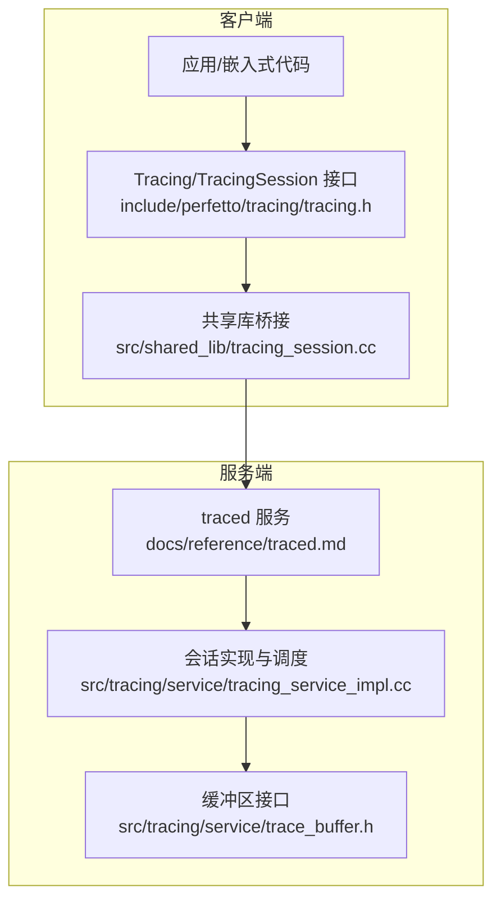
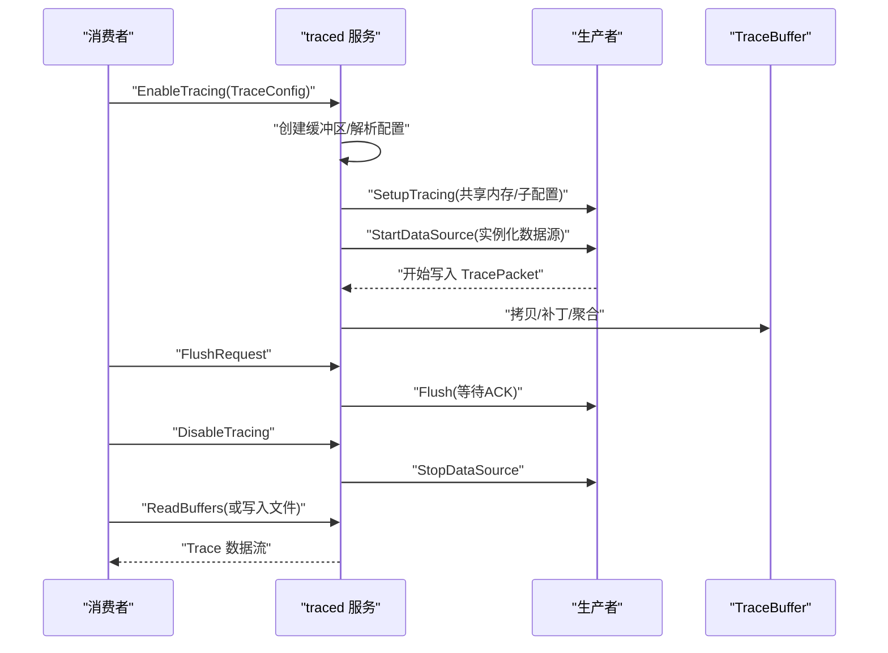
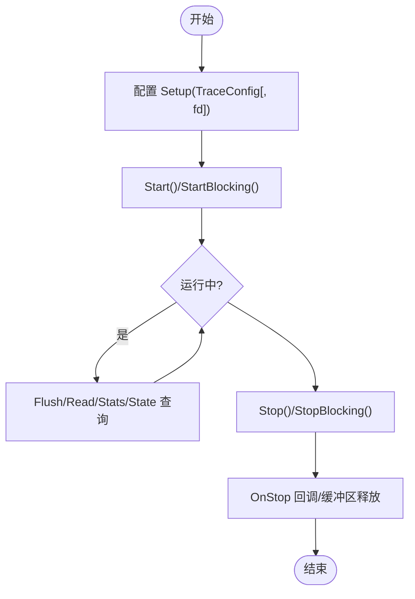
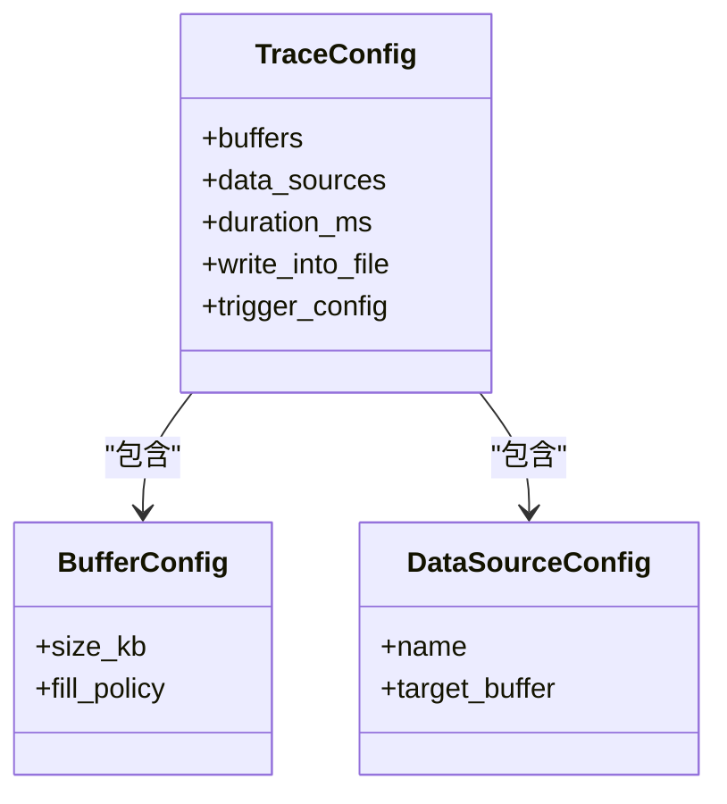
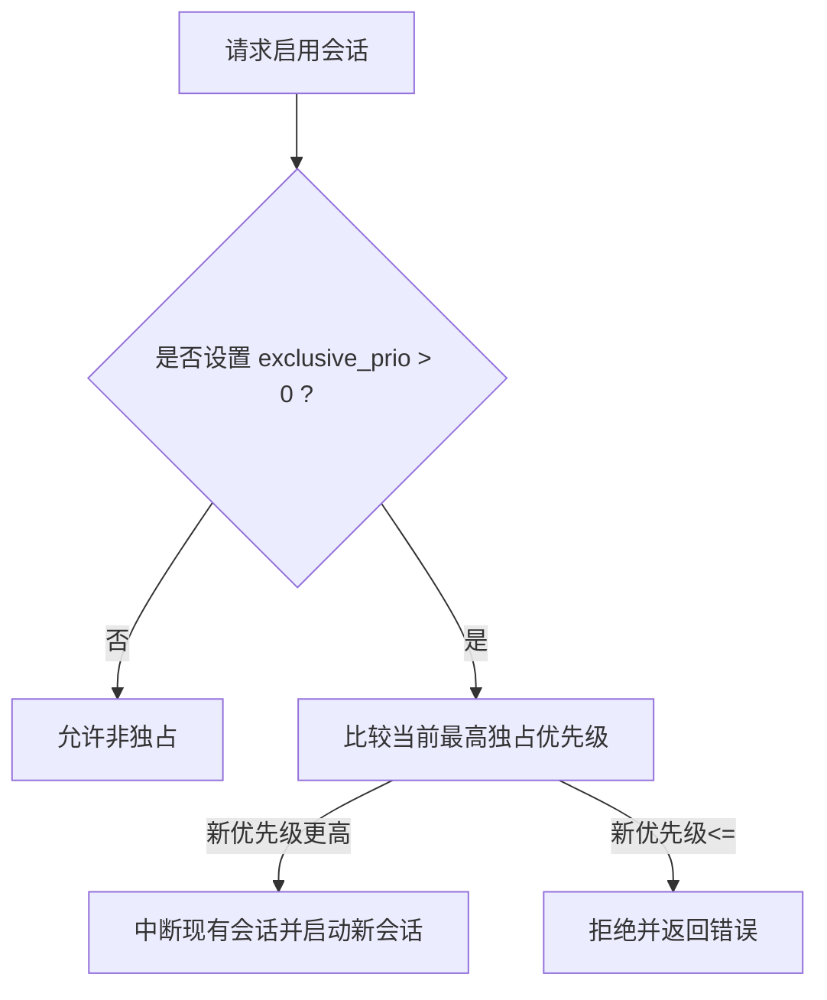
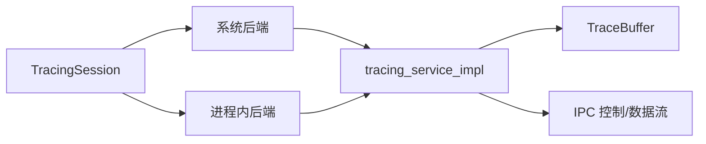

# 追踪会话管理

<cite>
**本文引用的文件**
- [tracing.h](file://include/perfetto/tracing/tracing.h)
- [tracing_session.cc](file://src/shared_lib/tracing_session.cc)
- [tracing_service_impl.cc](file://src/tracing/service/tracing_service_impl.cc)
- [trace_buffer.h](file://src/tracing/service/trace_buffer.h)
- [traced.md](file://docs/reference/traced.md)
- [life-of-a-tracing-session.md](file://docs/design-docs/life-of-a-tracing-session.md)
- [trace-buffer.md](file://docs/design-docs/trace-buffer.md)
- [tracing_service_impl_unittest.cc](file://src/tracing/service/tracing_service_impl_unittest.cc)
- [tracing_muxer_impl.cc](file://src/tracing/internal/tracing_muxer_impl.cc)
- [example_system_wide.cc](file://examples/sdk/example_system_wide.cc)
- [trace_config_builder.ts](file://ui/src/plugins/dev.perfetto.RecordTraceV2/config/trace_config_builder.ts)
</cite>

## 目录
1. [简介](#简介)
2. [项目结构](#项目结构)
3. [核心组件](#核心组件)
4. [架构总览](#架构总览)
5. [详细组件分析](#详细组件分析)
6. [依赖关系分析](#依赖关系分析)
7. [性能考量](#性能考量)
8. [故障排查指南](#故障排查指南)
9. [结论](#结论)
10. [附录](#附录)

## 简介
本技术文档围绕 Perfetto 的“追踪会话管理”展开，系统阐述从创建、配置到生命周期管理的完整流程，覆盖系统范围追踪、进程内追踪与混合模式；详解追踪配置的构建、数据源选择与缓冲区策略；说明启动、暂停、恢复、停止等操作及优雅关闭与资源清理；给出长时分析、短时诊断、批量任务等典型场景的实践建议，并解释会话与数据源的协调机制与事件流控制策略。

## 项目结构
围绕追踪会话管理的关键代码分布在以下层次：
- 公共接口层：对外暴露的 Tracing/TracingSession API（头文件）
- 客户端桥接层：共享库封装，将 C++ API 暴露为 ABI 可用的函数
- 服务端实现层：traced 服务负责会话调度、缓冲区管理、生产者/消费者编排
- 配置与缓冲区设计：TraceConfig 构建、缓冲区策略与写入/丢弃行为
- 示例与测试：演示系统级追踪、单元测试验证会话行为与边界条件

图表来源
- [tracing.h](file://include/perfetto/tracing/tracing.h)
- [tracing_session.cc](file://src/shared_lib/tracing_session.cc)
- [traced.md](file://docs/reference/traced.md)
- [tracing_service_impl.cc](file://src/tracing/service/tracing_service_impl.cc)
- [trace_buffer.h](file://src/tracing/service/trace_buffer.h)

章节来源
- [tracing.h](file://include/perfetto/tracing/tracing.h)
- [tracing_session.cc](file://src/shared_lib/tracing_session.cc)
- [traced.md](file://docs/reference/traced.md)

## 核心组件
- Tracing/TracingSession：对外统一入口，支持系统后端与进程内后端；提供配置、启动、停止、读取、统计查询、状态查询等能力
- traced 服务：集中式守护进程，负责会话管理、缓冲区分配与回收、生产者/消费者注册与路由、安全隔离
- TraceBuffer：抽象缓冲区接口，定义拷贝、补丁、只读克隆、统计等能力
- TraceConfig 构建与路由：UI/工具链将配置转换为 TraceConfig，服务按配置分发给对应生产者

章节来源
- [tracing.h](file://include/perfetto/tracing/tracing.h)
- [tracing_session.cc](file://src/shared_lib/tracing_session.cc)
- [traced.md](file://docs/reference/traced.md)
- [trace_buffer.h](file://src/tracing/service/trace_buffer.h)

## 架构总览
下图展示一次完整追踪会话从消费者发起到服务端落盘/回放的端到端流程。

图表来源
- [life-of-a-tracing-session.md](file://docs/design-docs/life-of-a-tracing-session.md)
- [tracing_service_impl.cc](file://src/tracing/service/tracing_service_impl.cc)
- [trace_buffer.h](file://src/tracing/service/trace_buffer.h)

## 详细组件分析

### 组件一：会话生命周期与控制流
- 创建与初始化
  - 初始化 Tracing（可指定后端、共享内存参数、日志回调、策略对象等）
  - 通过 NewTrace 获取 TracingSession 实例（系统/进程内后端）
- 配置与启动
  - Setup(TraceConfig[, fd])：传入配置，可选绑定文件描述符自动落盘
  - Start()/StartBlocking()：异步/阻塞启动；可通过回调获知所有数据源已就绪
- 运行期控制
  - Flush()/FlushBlocking()：请求生产者ACK，确保在读取前可见
  - ReadTrace()/ReadTraceBlocking()：读取原始 trace 数据（破坏性、非幂等）
  - GetTraceStats()/QueryServiceState()：查询统计与服务状态快照
- 停止与清理
  - Stop()/StopBlocking()：异步/阻塞停止；OnStop 回调通知完全停止
  - FreeBuffers/断开连接：释放缓冲区，服务端回收资源

图表来源
- [tracing.h](file://include/perfetto/tracing/tracing.h)
- [tracing_session.cc](file://src/shared_lib/tracing_session.cc)

章节来源
- [tracing.h](file://include/perfetto/tracing/tracing.h)
- [tracing_session.cc](file://src/shared_lib/tracing_session.cc)

### 组件二：系统范围追踪、进程内追踪与混合模式
- 系统范围追踪（kSystemBackend）
  - 通过 traced 守护进程统一调度，适合跨进程/跨组件采集
  - 支持多消费者并发、多会话复用共享缓冲区
- 进程内追踪（kInProcessBackend）
  - 无需外部服务，直接在当前进程中收集，适合轻量分析与测试
- 混合模式
  - 通过 TracingInitArgs 同时启用多个后端，按需选择；注意链接体积与死代码消除

章节来源
- [tracing.h](file://include/perfetto/tracing/tracing.h)

### 组件三：追踪配置构建、数据源选择与缓冲区策略
- 配置构建
  - UI/工具链将用户输入转换为 TraceConfig；包含 buffers 列表、data_sources 列表、触发器、持续时间、写入文件等
  - 缓冲区模式：Ring Buffer 或 Discard（STOP_WHEN_FULL），可结合写入文件策略
- 数据源选择
  - 依据名称匹配生产者已注册的数据源；每个数据源可指定目标缓冲区 ID
- 缓冲区策略
  - TraceBuffer 抽象定义了拷贝、补丁、只读克隆、统计等能力
  - V2 行为：达到缓冲区末尾即停止接受新数据，不尝试智能绕过未读数据

图表来源
- [trace_config_builder.ts](file://ui/src/plugins/dev.perfetto.RecordTraceV2/config/trace_config_builder.ts)
- [trace_buffer.h](file://src/tracing/service/trace_buffer.h)
- [trace-buffer.md](file://docs/design-docs/trace-buffer.md)

章节来源
- [trace_config_builder.ts](file://ui/src/plugins/dev.perfetto.RecordTraceV2/config/trace_config_builder.ts)
- [trace_buffer.h](file://src/tracing/service/trace_buffer.h)
- [trace-buffer.md](file://docs/design-docs/trace-buffer.md)

### 组件四：会话与数据源的协调机制与事件流控制
- 生产者注册与更新
  - 生产者通过 IPC 注册数据源描述，服务端维护注册表并转发配置
- 事件流控制
  - StartDataSource 后，TraceWriter 写入 TracePacket，借助 SharedMemoryArbiter 管理 chunk 提交与补丁
  - FlushRequest 触发生产者 Flush 并等待 ACK，确保可见性
- 会话状态观测
  - ConsumerEndpoint 可订阅数据源实例状态变化、全部数据源启动完成等事件

章节来源
- [tracing_service_impl.cc](file://src/tracing/service/tracing_service_impl.cc)
- [tracing_service_impl_unittest.cc](file://src/tracing/service/tracing_service_impl_unittest.cc)

### 组件五：会话优先级与抢占（独占模式）
- 优先级系统
  - exclusive_prio 为正整数，数值越大优先级越高
- 抢占规则
  - 新会话若优先级更高，可中断现有会话；低/等优先级被拒绝
  - Android 上仅 root/shell 可申请独占模式
- 测试验证
  - 单测覆盖独占会话拒绝、抢占与克隆会话清空等行为

图表来源
- [tracing_service_impl.cc](file://src/tracing/service/tracing_service_impl.cc)
- [tracing_service_impl_unittest.cc](file://src/tracing/service/tracing_service_impl_unittest.cc)
- [android.md](file://docs/learning-more/android.md)

章节来源
- [tracing_service_impl.cc](file://src/tracing/service/tracing_service_impl.cc)
- [tracing_service_impl_unittest.cc](file://src/tracing/service/tracing_service_impl_unittest.cc)
- [android.md](file://docs/learning-more/android.md)

### 组件六：系统范围追踪示例与最佳实践
- 示例程序展示了如何使用系统后端进行系统级追踪，配合 UI/命令行工具进行采集与回放
- 最佳实践
  - 使用合适的 buffers.size_kb 与 fill_policy，避免丢包
  - 在读取前调用 Flush，确保最终包可见
  - 长时间运行时考虑 write_into_file 以降低内存压力

章节来源
- [example_system_wide.cc](file://examples/sdk/example_system_wide.cc)

## 依赖关系分析
- 外部依赖
  - traced 服务：作为中心枢纽，协调生产者与消费者
  - IPC 通道：用于控制信号与状态同步
  - 共享内存：高吞吐写入路径，由 Arbiter 管理提交与补丁
- 内部耦合
  - TracingSession 与具体后端（系统/进程内）解耦
  - 服务端对 TraceBuffer 的抽象屏蔽不同实现细节
  - 单元测试覆盖关键边界（独占抢占、缓冲区策略、Flush/Stop 行为）

图表来源
- [tracing.h](file://include/perfetto/tracing/tracing.h)
- [tracing_service_impl.cc](file://src/tracing/service/tracing_service_impl.cc)
- [trace_buffer.h](file://src/tracing/service/trace_buffer.h)

章节来源
- [tracing.h](file://include/perfetto/tracing/tracing.h)
- [tracing_service_impl.cc](file://src/tracing/service/tracing_service_impl.cc)
- [trace_buffer.h](file://src/tracing/service/trace_buffer.h)

## 性能考量
- 缓冲区策略
  - Ring Buffer 适合实时性要求高的场景；Discard（STOP_WHEN_FULL）在高负载下更稳健
  - V2 不再尝试绕过未读数据，到达末尾即停止，避免“看似环形却永久停写”的困惑
- 共享内存优化
  - 批量提交窗口、页大小提示、直写补丁等参数影响吞吐与延迟权衡
- 读取与落盘
  - 读取 trace 前务必 Flush；必要时启用 write_into_file 减少内存占用
- 调度与并发
  - 多会话并发与独占抢占需谨慎规划，避免频繁中断

章节来源
- [trace-buffer.md](file://docs/design-docs/trace-buffer.md)
- [tracing.h](file://include/perfetto/tracing/tracing.h)

## 故障排查指南
- 常见问题
  - 启动失败：检查 TraceConfig 是否合法（数据源名称、缓冲区大小、触发器配置）
  - 无数据：确认 Start 已完成且 Flush 成功；核对数据源是否正确注册与启动
  - 丢包/截断：调整缓冲区大小与 fill_policy；必要时启用 write_into_file
  - 独占会话冲突：检查 exclusive_prio 设置与权限；Android 上仅 root/shell 可用
- 调试手段
  - 使用 GetTraceStats/QueryServiceState 快速定位异常
  - 通过 OnError/OnStop 回调捕获错误与终止事件
  - 单元测试用例可作为行为参考与回归验证

章节来源
- [tracing.h](file://include/perfetto/tracing/tracing.h)
- [tracing_service_impl_unittest.cc](file://src/tracing/service/tracing_service_impl_unittest.cc)

## 结论
Perfetto 的追踪会话管理以 traced 服务为核心，通过清晰的 API 与严格的缓冲区/IPC 设计，实现了跨进程、高吞吐、可扩展的追踪体系。合理配置 TraceConfig、选择合适的缓冲区策略与后端模式，并遵循 Flush/Stop 的正确时序，可在不同场景下获得稳定可靠的性能分析结果。

## 附录
- 场景示例
  - 长时间运行的性能分析：增大缓冲区、启用 write_into_file、周期性 Flush
  - 短时间故障诊断：缩短 duration_ms，使用 Discard 策略避免内存压力
  - 批量处理任务：多会话并行时注意独占抢占与优先级规划
- 相关文档
  - traced 服务职责与交互模型
  - 追踪会话生命周期与端到端流程
  - 缓冲区行为与策略演进

章节来源
- [traced.md](file://docs/reference/traced.md)
- [life-of-a-tracing-session.md](file://docs/design-docs/life-of-a-tracing-session.md)
- [trace-buffer.md](file://docs/design-docs/trace-buffer.md)