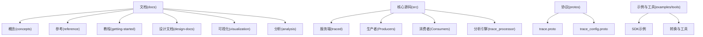
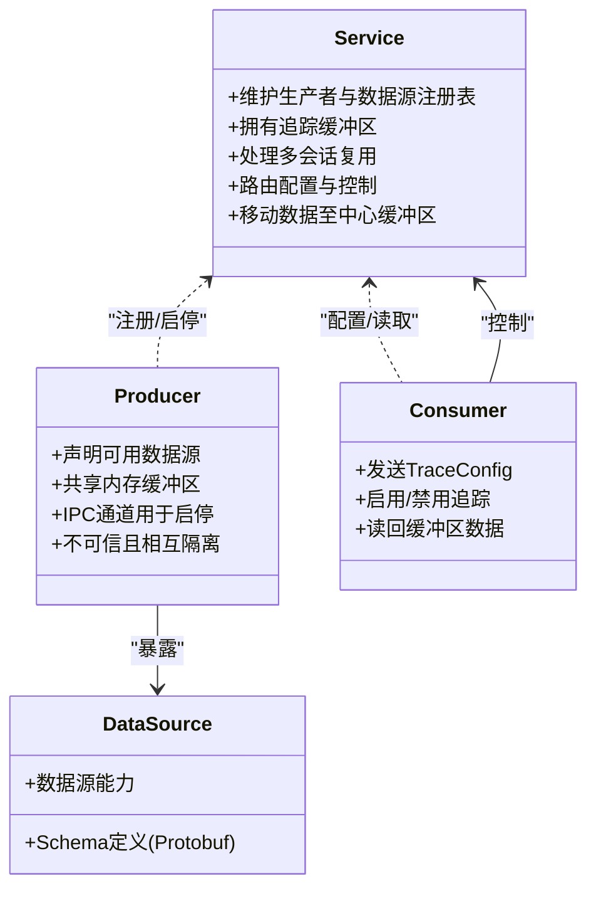
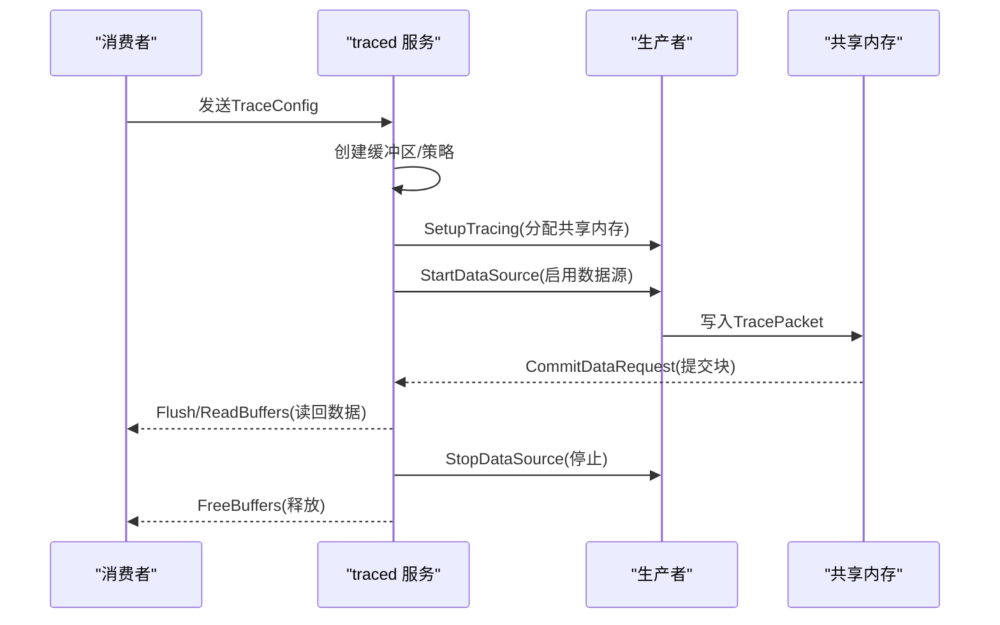
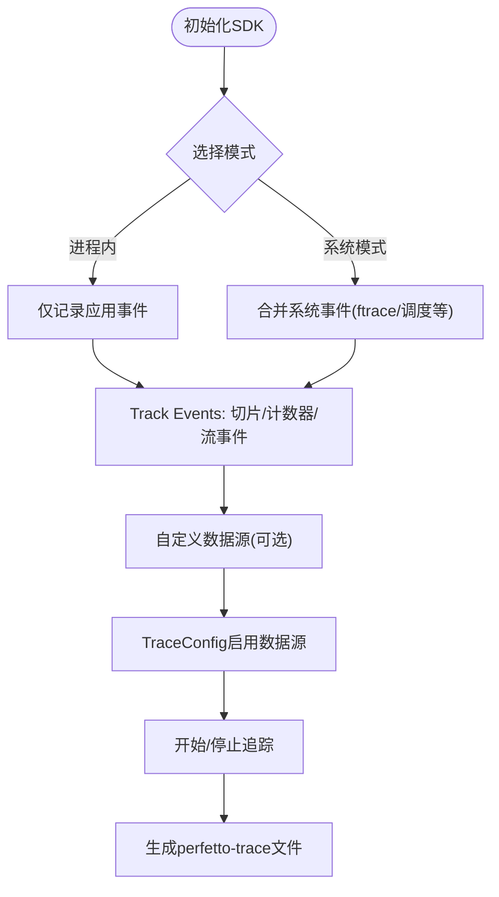
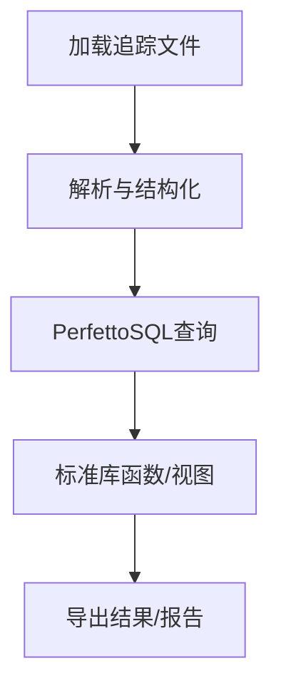
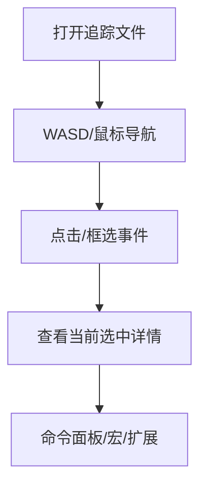

# 项目概述

<cite>
**本文引用的文件**
- [README.md](file://README.md)
- [docs/README.md](file://docs/README.md)
- [docs/getting-started/start-using-perfetto.md](file://docs/getting-started/start-using-perfetto.md)
- [docs/concepts/service-model.md](file://docs/concepts/service-model.md)
- [docs/reference/traced.md](file://docs/reference/traced.md)
- [docs/instrumentation/tracing-sdk.md](file://docs/instrumentation/tracing-sdk.md)
- [docs/analysis/getting-started.md](file://docs/analysis/getting-started.md)
- [docs/visualization/perfetto-ui.md](file://docs/visualization/perfetto-ui.md)
- [docs/reference/perfetto-cli.md](file://docs/reference/perfetto-cli.md)
- [docs/design-docs/life-of-a-tracing-session.md](file://docs/design-docs/life-of-a-tracing-session.md)
- [protos/perfetto/trace/trace.proto](file://protos/perfetto/trace/trace.proto)
- [protos/perfetto/config/trace_config.proto](file://protos/perfetto/config/trace_config.proto)
</cite>

## 目录
1. [引言](#引言)
2. [项目结构](#项目结构)
3. [核心组件](#核心组件)
4. [架构总览](#架构总览)
5. [详细组件分析](#详细组件分析)
6. [依赖关系分析](#依赖关系分析)
7. [性能考量](#性能考量)
8. [故障排查指南](#故障排查指南)
9. [结论](#结论)
10. [附录](#附录)

## 引言
Perfetto 是一个面向复杂系统行为理解与性能根因定位的开源套件，覆盖从客户端到嵌入式设备的广泛场景。它既是 Android 操作系统与 Chromium 浏览器的默认追踪系统，也是跨平台（Linux、Windows、macOS）下进行应用与内核级性能分析的强大工具链。Perfetto 的核心价值在于通过统一的追踪格式与强大的分析能力，帮助开发者在系统与应用层面进行全栈诊断与优化。

本项目概述将围绕以下主题展开：系统定位与目标、核心组件与职责、整体架构与交互流程、典型使用场景与角色分工、快速入门与学习路径，并辅以可视化图示帮助不同背景的读者快速上手。

## 项目结构
仓库采用模块化组织方式，涵盖文档、核心源码、协议定义、构建脚本与示例等部分。其中：
- 文档目录包含概念、参考、教程、设计文档与可视化指南，是理解系统与上手使用的主入口。
- 核心源码分布在 src 下，覆盖服务端守护进程、生产者、消费者、分析引擎、UI 等模块。
- 协议定义位于 protos，统一了追踪数据的序列化格式与配置模型。
- 示例与工具位于 examples 与 tools，便于集成与验证。



图表来源
- [docs/README.md:1-234](file://docs/README.md#L1-L234)
- [docs/getting-started/start-using-perfetto.md:1-475](file://docs/getting-started/start-using-perfetto.md#L1-L475)

章节来源
- [docs/README.md:1-234](file://docs/README.md#L1-L234)
- [docs/getting-started/start-using-perfetto.md:1-475](file://docs/getting-started/start-using-perfetto.md#L1-L475)

## 核心组件
Perfetto 由五大核心组件协同工作，形成“采集-汇聚-分析-可视化-扩展”的完整闭环：

- 高性能追踪守护进程（traced）
  - 负责会话管理、缓冲区管理、生产者/数据源注册、配置路由与数据安全汇聚。
  - 在 Android/Linux 上作为长期运行的系统守护进程，提供稳定的服务基础。
  - 参考：[docs/reference/traced.md:1-114](file://docs/reference/traced.md#L1-L114)

- 低开销追踪 SDK（Tracing SDK）
  - 提供 C++17 用户态追踪 API，支持应用内事件切片、计数器、流事件等，亦可自定义数据源。
  - 支持“进程内模式”与“系统模式”，后者可融合系统事件（如 ftrace、调度、系统调用）进行全栈分析。
  - 参考：[docs/instrumentation/tracing-sdk.md:1-419](file://docs/instrumentation/tracing-sdk.md#L1-L419)

- 广泛的系统级探测器（数据源）
  - 覆盖 Android/Linux 的 ftrace、atrace、CPU 频率、内存计数器、GPU 计数器、系统调用、帧时间线等。
  - 数据源以 Protobuf Schema 定义，统一注入到 TracePacket 中，确保跨来源一致性。
  - 参考：[docs/concepts/service-model.md:59-74](file://docs/concepts/service-model.md#L59-L74)

- 基于浏览器的 UI 界面
  - 全本地、无需安装的 Web UI，支持拖拽打开多 GB 级大型追踪文件，提供时间轴浏览、区域选择、命令与热键等交互能力。
  - 参考：[docs/visualization/perfetto-ui.md:1-138](file://docs/visualization/perfetto-ui.md#L1-L138)

- 基于 SQL 的分析库（Trace Processor + PerfettoSQL）
  - 将多种追踪格式解析为结构化数据，提供 PerfettoSQL 查询语言，支持从交互式探索到自动化大规模分析。
  - 参考：[docs/analysis/getting-started.md:1-90](file://docs/analysis/getting-started.md#L1-L90)

章节来源
- [docs/reference/traced.md:1-114](file://docs/reference/traced.md#L1-L114)
- [docs/instrumentation/tracing-sdk.md:1-419](file://docs/instrumentation/tracing-sdk.md#L1-L419)
- [docs/concepts/service-model.md:59-74](file://docs/concepts/service-model.md#L59-L74)
- [docs/visualization/perfetto-ui.md:1-138](file://docs/visualization/perfetto-ui.md#L1-L138)
- [docs/analysis/getting-started.md:1-90](file://docs/analysis/getting-started.md#L1-L90)

## 架构总览
Perfetto 采用“服务-生产者-消费者”三层解耦架构，通过共享内存与 IPC 实现高吞吐、低延迟的数据传输与控制信令。

```mermaid
graph TB
subgraph "系统层"
UI["浏览器UI<br/>perfetto-ui"]:::node
CLI["命令行工具<br/>perfetto-cli"]:::node
end
subgraph "服务层"
TRACED["traced 守护进程"]:::node
end
subgraph "采集层"
PROD1["应用进程<br/>TrackEvent/自定义数据源"]:::node
PROD2["系统探测器<br/>ftrace/atrace/计数器"]:::node
end
subgraph "存储与分析"
BUF["共享内存缓冲区"]:::node
TP["Trace Processor<br/>PerfettoSQL"]:::node
end
UI --> TRACED
CLI --> TRACED
TRACED <- --> BUF
PROD1 --> BUF
PROD2 --> BUF
BUF --> TRACED
TRACED --> TP
TP --> UI
classDef node fill:#fff,stroke:#333,stroke-width:1px;
```

图表来源
- [docs/concepts/service-model.md:1-119](file://docs/concepts/service-model.md#L1-L119)
- [docs/reference/traced.md:18-75](file://docs/reference/traced.md#L18-L75)
- [docs/visualization/perfetto-ui.md:1-138](file://docs/visualization/perfetto-ui.md#L1-L138)
- [docs/reference/perfetto-cli.md:1-215](file://docs/reference/perfetto-cli.md#L1-L215)

章节来源
- [docs/concepts/service-model.md:1-119](file://docs/concepts/service-model.md#L1-L119)
- [docs/reference/traced.md:18-75](file://docs/reference/traced.md#L18-L75)
- [docs/visualization/perfetto-ui.md:1-138](file://docs/visualization/perfetto-ui.md#L1-L138)
- [docs/reference/perfetto-cli.md:1-215](file://docs/reference/perfetto-cli.md#L1-L215)

## 详细组件分析

### 组件一：服务模型与生命周期
服务模型明确了三类实体的职责边界与交互契约，保证在多生产者、多消费者的复杂场景中实现安全与隔离。



图表来源
- [docs/concepts/service-model.md:5-119](file://docs/concepts/service-model.md#L5-L119)

章节来源
- [docs/concepts/service-model.md:5-119](file://docs/concepts/service-model.md#L5-L119)

### 组件二：追踪守护进程 traced
traced 是系统级中枢，负责会话生命周期、缓冲区策略、数据汇聚与安全隔离，并在 Android 上提供内置生产者与按需启动其他服务的能力。



图表来源
- [docs/design-docs/life-of-a-tracing-session.md:1-84](file://docs/design-docs/life-of-a-tracing-session.md#L1-L84)
- [docs/reference/traced.md:36-75](file://docs/reference/traced.md#L36-L75)

章节来源
- [docs/design-docs/life-of-a-tracing-session.md:1-84](file://docs/design-docs/life-of-a-tracing-session.md#L1-L84)
- [docs/reference/traced.md:36-75](file://docs/reference/traced.md#L36-L75)

### 组件三：Tracing SDK（应用内追踪）
Tracing SDK 提供两类抽象：Track Events（简单事件）与自定义数据源（强类型结构）。支持进程内与系统两种模式，后者可融合系统事件进行全栈分析。



图表来源
- [docs/instrumentation/tracing-sdk.md:269-419](file://docs/instrumentation/tracing-sdk.md#L269-L419)
- [docs/reference/perfetto-cli.md:140-215](file://docs/reference/perfetto-cli.md#L140-L215)

章节来源
- [docs/instrumentation/tracing-sdk.md:269-419](file://docs/instrumentation/tracing-sdk.md#L269-L419)
- [docs/reference/perfetto-cli.md:140-215](file://docs/reference/perfetto-cli.md#L140-L215)

### 组件四：Trace Processor 与 PerfettoSQL
Trace Processor 将多种追踪格式解析为统一结构，PerfettoSQL 提供类 SQL 查询接口，支持从交互式探索到自动化大规模分析。



图表来源
- [docs/analysis/getting-started.md:15-90](file://docs/analysis/getting-started.md#L15-L90)

章节来源
- [docs/analysis/getting-started.md:15-90](file://docs/analysis/getting-started.md#L15-L90)

### 组件五：浏览器 UI
浏览器 UI 提供直观的时间轴浏览、事件选择、区域选择、命令与热键等能力，支持拖拽打开本地或示例追踪文件。



图表来源
- [docs/visualization/perfetto-ui.md:7-138](file://docs/visualization/perfetto-ui.md#L7-L138)

章节来源
- [docs/visualization/perfetto-ui.md:7-138](file://docs/visualization/perfetto-ui.md#L7-L138)

## 依赖关系分析
- 协议层
  - 追踪数据统一封装为 TracePacket，顶层 Trace 作为文件包装容器。
  - TraceConfig 描述缓冲区策略、数据源过滤与内置数据源行为。
  - 参考：[protos/perfetto/trace/trace.proto:23-31](file://protos/perfetto/trace/trace.proto#L23-L31)、[protos/perfetto/config/trace_config.proto:32-127](file://protos/perfetto/config/trace_config.proto#L32-L127)

- 服务-生产者-消费者之间的耦合度低，通过 IPC 控制与共享内存数据通道解耦，避免生产者间的相互干扰与消费者侧的低延迟瓶颈。


图表来源
- [protos/perfetto/config/trace_config.proto:32-127](file://protos/perfetto/config/trace_config.proto#L32-L127)
- [docs/concepts/service-model.md:76-119](file://docs/concepts/service-model.md#L76-L119)

章节来源
- [protos/perfetto/trace/trace.proto:23-31](file://protos/perfetto/trace/trace.proto#L23-L31)
- [protos/perfetto/config/trace_config.proto:32-127](file://protos/perfetto/config/trace_config.proto#L32-L127)
- [docs/concepts/service-model.md:76-119](file://docs/concepts/service-model.md#L76-L119)

## 性能考量
- 低开销采集
  - 生产者通过共享内存与 ProtoZero 编码写入 TracePacket，避免阻塞与高成本拷贝。
  - 参考：[docs/concepts/service-model.md:92-119](file://docs/concepts/service-model.md#L92-L119)

- 会话与缓冲区策略
  - 支持环形缓冲与丢弃策略，结合按名称/正则过滤减少无关数据源对性能的影响。
  - 参考：[protos/perfetto/config/trace_config.proto:33-96](file://protos/perfetto/config/trace_config.proto#L33-L96)

- 分析侧权衡
  - 消费侧读回并非低延迟优化场景，适合离线/批量分析；实时消费需谨慎评估。
  - 参考：[docs/README.md:106-112](file://docs/README.md#L106-L112)

- UI 与 SQL 的可扩展性
  - UI 支持命令、宏与扩展；SQL 标准库提供常见指标计算，便于自动化与规模化监控。
  - 参考：[docs/visualization/perfetto-ui.md:75-138](file://docs/visualization/perfetto-ui.md#L75-L138)、[docs/analysis/getting-started.md:55-90](file://docs/analysis/getting-started.md#L55-L90)

## 故障排查指南
- 常见问题定位
  - 无法连接 traced：检查 IPC 权限与 socket 设置，确认守护进程状态与日志。
    - 参考：[docs/reference/traced.md:76-88](file://docs/reference/traced.md#L76-L88)

  - 追踪数据缺失或不完整：检查缓冲区大小、填充策略、是否发生丢弃；确认数据源已正确启用与过滤。
    - 参考：[protos/perfetto/config/trace_config.proto:33-96](file://protos/perfetto/config/trace_config.proto#L33-L96)

  - UI 打不开大文件或卡顿：尝试区域选择、关闭非必要轨道、使用命令面板进行自动化分析。
    - 参考：[docs/visualization/perfetto-ui.md:60-116](file://docs/visualization/perfetto-ui.md#L60-L116)

  - 自定义数据源导入失败：确保数据源 Schema 与 TraceProcessor 表定义一致，并在 TraceConfig 中启用。
    - 参考：[docs/instrumentation/tracing-sdk.md:175-268](file://docs/instrumentation/tracing-sdk.md#L175-L268)

- 社区与支持
  - GitHub Discussions/Q&A、Issues、Discord 等渠道获取帮助与反馈。
  - 参考：[README.md:88-101](file://README.md#L88-L101)、[docs/README.md:197-234](file://docs/README.md#L197-L234)

章节来源
- [docs/reference/traced.md:76-88](file://docs/reference/traced.md#L76-L88)
- [protos/perfetto/config/trace_config.proto:33-96](file://protos/perfetto/config/trace_config.proto#L33-L96)
- [docs/visualization/perfetto-ui.md:60-116](file://docs/visualization/perfetto-ui.md#L60-L116)
- [docs/instrumentation/tracing-sdk.md:175-268](file://docs/instrumentation/tracing-sdk.md#L175-L268)
- [README.md:88-101](file://README.md#L88-L101)
- [docs/README.md:197-234](file://docs/README.md#L197-L234)

## 结论
Perfetto 通过服务-生产者-消费者解耦架构、低开销共享内存采集、统一的 Protobuf 追踪格式与强大的 Trace Processor/PerfettoSQL 分析能力，构建了覆盖 Android、Linux、Chromium 与通用 C/C++ 应用的全栈性能分析体系。对于不同角色用户，Perfetto 提供从入门教程到高级分析的完整路径，既能满足日常调试，也能支撑大规模自动化监控与回归检测。

## 附录

### 快速开始与学习路径
- 新手入门
  - 先阅读“什么是追踪？”与“如何开始使用 Perfetto”，根据角色选择对应教程。
  - 参考：[docs/README.md:3-80](file://docs/README.md#L3-L80)、[docs/getting-started/start-using-perfetto.md:1-475](file://docs/getting-started/start-using-perfetto.md#L1-L475)

- Android 开发者
  - 系统行为理解、性能优化（延迟、掉帧）、内存问题诊断与 CPU/内存剖析。
  - 参考：[docs/getting-started/start-using-perfetto.md:44-264](file://docs/getting-started/start-using-perfetto.md#L44-L264)

- Linux 内核与系统开发者
  - ftrace、系统调用、内存计数器、perf 事件采集与可视化。
  - 参考：[docs/getting-started/start-using-perfetto.md:265-324](file://docs/getting-started/start-using-perfetto.md#L265-L324)

- C/C++ 开发者（非 Android）
  - 应用内追踪、CPU/内存剖析与自定义数据源。
  - 参考：[docs/getting-started/start-using-perfetto.md:325-366](file://docs/getting-started/start-using-perfetto.md#L325-L366)

- Chromium 开发者
  - chrome://tracing 后端，结合 Perfetto UI 进行浏览器与 V8/Blink 分析。
  - 参考：[docs/getting-started/start-using-perfetto.md:367-383](file://docs/getting-started/start-using-perfetto.md#L367-L383)

- 任意“时间戳数据”
  - 将外部追踪/日志转换为 Perfetto 格式，使用 UI 与 SQL 进行可视化与分析。
  - 参考：[docs/getting-started/start-using-perfetto.md:384-411](file://docs/getting-started/start-using-perfetto.md#L384-L411)

### 关键参考
- 追踪守护进程 traced
  - 参考：[docs/reference/traced.md:1-114](file://docs/reference/traced.md#L1-L114)

- 命令行工具 perfetto
  - 参考：[docs/reference/perfetto-cli.md:1-215](file://docs/reference/perfetto-cli.md#L1-L215)

- 追踪 SDK
  - 参考：[docs/instrumentation/tracing-sdk.md:1-419](file://docs/instrumentation/tracing-sdk.md#L1-L419)

- 分析与可视化
  - 参考：[docs/analysis/getting-started.md:1-90](file://docs/analysis/getting-started.md#L1-L90)、[docs/visualization/perfetto-ui.md:1-138](file://docs/visualization/perfetto-ui.md#L1-L138)

- 协议与配置
  - 参考：[protos/perfetto/trace/trace.proto:1-32](file://protos/perfetto/trace/trace.proto#L1-L32)、[protos/perfetto/config/trace_config.proto:1-200](file://protos/perfetto/config/trace_config.proto#L1-L200)