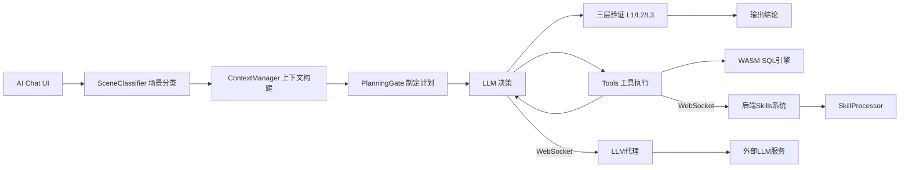
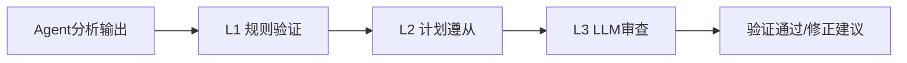
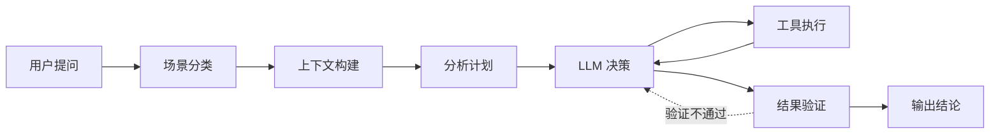
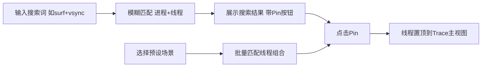
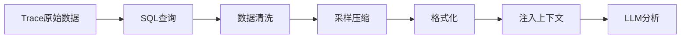

# OpenPerfetto — AI + Trace分析的尝试与经验分享

> 当 AI Agent 遇上性能分析，我们能做出怎样的工具？文章将分享 OpenPerfetto 项目从想法诞生到落地实践的全过程——架构设计、核心模块、实用工具、未来规划、项目缺点、项目痛点，以及一路踩过的坑。

---

## 引言：为什么做这个项目

### 两个世界的痛点

作为性能优化工程师，我们的日常工作中有两个"老伙计"：**AI 大模型**和 **Trace 分析工具**。它们各自强大，却各有各的别扭。

**AI 独立分析的困境：**

你把一段性能日志丢给 LLM工具，它洋洋洒洒给你一大段分析。看起来头头是道——但你心里总不踏实。这些结论对吗？有没有幻觉？你不得不打开原始数据，一条一条手动验证。AI 给出的"建议"变成了"需要验证的假设"，效率提升打了个大大的折扣。

**Trace 工具的繁琐：**

打开 Perfetto，加载一个几百 MB 的 trace 文件。展开进程树，搜索目标线程，拖动时间轴找到关键区间，查看 slice 信息，记下时间戳，再跳到另一个线程去对比……一次完整的卡顿分析下来，光是"找东西"就耗掉大半时间。更别提要把分析过程和结论整理成文档了。

**那么问题来了**
如果让 AI 融入 Trace 分析工具，AI 的分析过程与结果在 Perfetto 上能直接查看和跳转，能直接对 AI 分析结果 Check 而无需重复打开 Trace，甚至能进行 AI 二次分析/深入分析 ——会怎样？

这就是 OpenPerfetto 的起点。

### 原始需求

我们的目标很明确：**在 Google Perfetto 开源项目中集成 AI Agent，实现对 trace 的智能分析**。具体来说，需要做到：

- **便利交互**：AI Agent 融入 Perfetto，在最熟悉的 Perfetto 中和 AI 协作分析
- **场景识别**：自动识别和总结性能问题发生的场景（启动慢？滑动卡顿？ANR？）
- **多维分析**：覆盖冷/热/温启动、滑动掉帧、锁竞争、Binder 阻塞、IO 瓶颈等主流性能问题
- **因果推理**：不仅指出"哪里慢了"，还要分析直接原因和根本原因
- **可执行建议**：给出明确的结论和下一步优化方向

### 长期愿景

> 做服务于研发的最称手的 AI Trace 分析工具。

注意关键词——**称手**。不是大而全的平台，不是炫技的 Demo，而是真正能融入日常工作流、让你分析 trace 时觉得"少了它不行"的工具。

### 当前能力一览

经过持续迭代，OpenPerfetto 目前已经具备了从 AI 对话到工具联动的完整能力链：

| 模块 | 能力 | 状态 |
|------|------|:----:|
| 前端插件框架 | 拓展可折叠侧边栏、接入便利工具、主题切换 | ✅ |
| 搜索与置顶 | 进程/线程模糊搜索、预设场景一键置顶 | ✅ 可优化 |
| 标记与跳转 | AI/手动标记、序号渲染、快速跳转 | ✅ 仍需优化 |
| Agent 对话 | 流式渲染、工具调用可视化、可点击时间戳 | ✅ 可优化 |
| Agent 核心引擎 | 场景分类、上下文管理、状态机驱动 | ✅ 仍需优化 |
| 三层验证系统 | L1 规则验证、L2 计划遵从、L3 LLM 审查 | ✅ L3审查暂未实施 |
| 后端服务 | WebSocket 网关、LLM 代理、会话管理 | ✅ 可拓展 |
| Skills 系统 | 9 类目录、50+ YAML 定义的 Skills | ✅ 仍需优化 |
| 工具系统 | 10+ 内置 Tools，支持插件化扩展 | ✅ 仍需优化 |

接下来，让我们深入核心模块的设计与实现。

---

## 第一章：创新架构设计

### 核心理念：为业务定制，而非套用框架

市面上有很多优秀的 Agent 框架——LangChain、AutoGen、CrewAI……它们通用性强，但在 Trace 分析这个垂直场景下，通用框架往往意味着"架构冗杂，业务不精辟，不能很好融入已有工作流"。

OpenPerfetto 选择了一条不同的路：**针对 Trace 分析业务场景，从零定制融入 Perfetto 的 Agent 架构**。

这意味着：
- 状态机专为分析流程设计，而非通用任务编排
- 工具系统深度集成在原生 Perfetto 的 SQL 查询引擎和 UI 操作
- 不打破正常分析工作流，上手简单，可以和 Agent 直接协作分析
- 验证规则紧贴性能分析的专业知识
- 上下文管理方便针对 trace 数据的特征做专门优化

### 前后端分离的 AI 架构

OpenPerfetto 采用了前后端分离的 AI 架构，这个决策背后有一个关键洞察：**每一个打开的 Perfetto 网页，本身就是一个独立的分析环境**。

- **前端**：结合 Perfetto UI 前端现有 TS 架构实现 Agent 核心模块，让 AI Agent直接"住进" Perfetto UI。前端承载 Agent Loop 状态机、Tools 执行引擎、记忆存储和验证系统。每个网页就是一个独立的 Agent，拥有自己的 trace 数据、分析上下文和工具链。这意味着不需要在后端维护复杂的 trace 状态，前端的 WASM 引擎直接提供了离线 SQL 查询能力。

- **后端**：承载 Skills 系统和 LLM 代理。Skills 通过后端加载和管理，前端无需关心 Skill 的具体实现，只需通过 `invoke_skill` 工具发起调用。这使得 Skill 的扩展和更新完全独立于前端部署。且方便后续拓展知识库、用例库。

### 整体架构

下面这张架构图展示了 OpenPerfetto 的前后端 AI 架构全貌：



> **前端**：UI → 场景分类 → 上下文构建 → 计划 → LLM决策 ⇄ 工具执行 → 验证，每个网页即一个独立 Agent。 **后端**：Skills 系统（50+ YAML）+ LLM 代理，通过 WebSocket 与前端通信。

### 架构优势

这套架构的设计带来了几个显著的优势：

**1. 不打破原始工作流**

OpenPerfetto 以 Perfetto 插件的形式存在，不修改 Perfetto 的核心代码路径，不破坏 Perfetto 的任何功能。用户仍然可以正常使用 Perfetto 的所有原生功能——加载 trace、浏览时间轴、查看 slice 详情。AI 能力是"加法"，而非"替换"。
单独 LLM 工具分析结论需要重新打开 Trcae 进行 Review 确认结论，不支持动态二次分析。OpenPerfetto 上能直接查看和跳转，也能方便得二次分析/深入分析。

**2. 每个网页独立 Agent**

每个浏览器标签页加载的 Perfetto 实例都是一个独立的 Agent。它拥有自己的 trace 数据、分析状态和上下文记忆。这完全符合实际工作场景：你可能同时打开多个 trace 文件做对比分析，每个 Agent 互不干扰。

**3. 后端 Skills 系统不污染前端**

Skills 的定义、加载和更新完全在后端完成，前端不需要加载具体的 Skill 实现。这意味着：
- 新增一个 Skill 不需要重新构建前端
- 不同团队可以维护自己的 Skill 库
- Skill 的 SQL 模板和参数验证逻辑集中管理

**4. WASM 离线执行能力**

Perfetto 自带的 WASM SQL 引擎让前端具备了不依赖后端的数据查询能力，也不需要单独的 MCP 服务，AI 数据获取和原生架构结合。

**5. 前后端职责清晰**

| 职责 | 前端 | 后端 |
|------|------|------|
| Trace 数据存储与查询 | ✅ WASM 引擎 | — |
| Agent 状态管理 | ✅ 状态机 | — |
| 工具执行 | ✅ Tools 系统 | — |
| 结果验证 | ✅ 验证系统 | — |
| UI 交互与渲染 | ✅ | — |
| LLM 调用 | — | ✅ LLM 代理 |
| Skill 管理与执行 | — | ✅ Skills 系统 |
| 知识库（规划中） | — | ✅ |

---

## 第二章：Agent 核心引擎

Agent 核心引擎是 OpenPerfetto 的"大脑"，负责将用户的自然语言问题转化为一系列结构化的分析动作，并确保分析结果的质量。

### 三层管控机制

在 AI Agent 的世界里，"幻觉"和"跑偏"是最大的敌人。为了确保分析结果的可靠性，OpenPerfetto 设计了三层管控机制：



> **L1** 含 23 条启发式规则，覆盖 data_integrity / performance_metrics / assertion / causality / frame_analysis / tool_usage 六大类。 **L2** 检查是否按计划执行、是否遗漏关键步骤。 **L3** 预留 LLM 交叉验证接口。

**L1 规则验证**是第一道防线，包含 **23 条启发式规则**，覆盖 6 大类检查：

| 规则类别 | 检查内容 | 示例 |
|----------|----------|------|
| `data_integrity` | 数据引用是否真实存在 | 引用的 slice 名称在 trace 中是否存在 |
| `performance_metrics` | 性能指标是否合理 | 帧耗时不会是负数，启动时间不会是 0ms |
| `assertion` | 基本断言是否成立 | 结论中引用的线程是否存在于 trace 中 |
| `causality` | 因果关系是否成立 | "因为 A 导致 B"中 A 的时间是否早于 B |
| `frame_analysis` | 帧分析专项 | 掉帧统计是否与 actual_frame 数据一致 |
| `tool_usage` | 工具使用是否规范 | SQL 查询是否返回了有效结果 |

**L2 计划遵从**检查 Agent 是否按照预定的分析计划执行。如果计划中要求"先查询主线程耗时，再分析 RenderThread"，但 Agent 跳过了第一步直接分析 RenderThread，L2 会标记这个偏差。

**L3 LLM 审查**是预留接口，计划通过另一个 LLM 对分析结论进行交叉验证。这类似于"代码 review"——让另一个"大脑"检查第一个"大脑"的工作。

### 分析流程：从问题到结论

当用户提出一个分析问题时，Agent 会按照严谨的流程推进：



**场景分类**是关键的第一步。OpenPerfetto 内置了 12 个预定义分析场景：

| 场景 | 说明 |
|------|------|
| `startup_cold` | 冷启动分析 |
| `startup_warm` | 温启动分析 |
| `startup_hot` | 热启动分析 |
| `scrolling` | 滑动流畅性分析 |
| `anr` | ANR 问题分析 |
| `lock_contention` | 锁竞争分析 |
| `binder_blocking` | Binder 阻塞分析 |
| `io_analysis` | IO 性能分析 |
| `high_load` | 高负载分析 |
| `screen_on_off` | 亮灭屏分析 |
| `unlock` | 解锁性能分析 |
| `general` | 通用分析 |

场景分类的结果直接影响后续的上下文构建——不同场景会注入不同的 Skill 列表和分析模板，确保 LLM 拿到的上下文信息与问题高度相关。

### Tools：Perfetto 插件化工具系统

Agent 的"手脚"是 Tools 系统。每个 Tool 都是一个标准化的函数，Agent 通过 LLM 决策来选择调用哪个工具、传入什么参数。

OpenPerfetto 目前内置了 10+ 工具，核心包括：

| 工具 | 功能 | 典型用途 |
|------|------|----------|
| `execute_sql` | 执行 SQL 查询 | 查询 trace 中的 slice、counter、sched 等数据 |
| `invoke_skill` | 调用后端 Skill | 执行预定义的复杂分析逻辑 |
| `fetch_artifact` | 获取缓存数据 | 复用之前查询的结果，避免重复查询 |
| `pin_thread` | 置顶线程 | 将关键线程固定到 trace 视图顶部 |
| `add_marker` | 添加标记 | 在时间轴上标记关键时间点 |
| `scroll_to_time` | 跳转时间 | 将视图跳转到指定时间戳 |

工具系统采用插件化设计，新增工具只需要实现标准接口并注册即可，无需修改 Agent 核心逻辑。

### Skills：低代码定制化分析能力

如果说 Tools 是 Agent 的"手脚"，那么 Skills 就是 Agent 的"专业技能"。Skills 系统是 OpenPerfetto 后端的核心模块，通过 YAML 低代码方式定义复杂的分析能力。

**9 类 50+ Skills** 覆盖了主流性能分析场景：

| 目录 | 覆盖场景 |
|------|----------|
| `startup` | 冷/温/热启动分析 |
| `scrolling` | 滑动流畅性、帧耗时分析 |
| `anr` | ANR 原因分析 |
| `binder` | Binder 调用链、阻塞分析 |
| `lock` | 锁竞争、死锁检测 |
| `memory` | 内存占用、泄漏分析 |
| `network` | 网络请求耗时分析 |
| `power` | 功耗分析 |
| `general` | 通用查询、系统概览 |

每个 Skill 用 YAML 定义，结构清晰：

```yaml
id: startup_cold_analysis
name: 冷启动耗时分析
type: sql_query
scene: startup_cold
parameters:
  - name: package_name
    type: string
    required: true
    description: 目标应用包名
prerequisites:
  - trace 中包含 launching 事件
sql_template: |
  SELECT
    ts, dur, name
  FROM slice
  WHERE name LIKE 'launching: %{{package_name}}%'
  ORDER BY ts
output_schema:
  columns: [ts, dur, name]
  description: 冷启动的 launching 事件列表
```

Skill 的处理流程也经过精心设计：

1. **参数验证**：SkillProcessor 检查传入参数是否符合定义
2. **SQL 模板渲染**：将参数填入 SQL 模板，生成可执行的 SQL
3. **预编译验证**：在执行前验证 SQL 语法的正确性
4. **执行与采样**：执行 SQL 并对结果进行智能采样

### Artifact 智能管理

Trace 数据查询的结果往往很大——一次 `sched_slice` 查询可能返回几十万行数据。直接把所有数据塞给 LLM 既不经济也不有效。OpenPerfetto 的 Artifact 管理模块解决了这个问题：

- **分位数采样**：保留 p0、p25、p50、p75、p90、p95、p99、p99.9 等关键分位数据，用统计分布代替全量数据
- **极值保留**：始终保留 Top5 和 Bottom5 的极端值，因为性能问题往往藏在极端情况中
- **LRU 缓存**：最近 100 条查询结果缓存在 Artifact Store 中，Agent 可以通过 `fetch_artifact` 工具复用之前的查询结果，避免重复执行昂贵的 SQL 查询

这套机制让 Agent 能够在有限的 Token 预算内获取足够的数据信息，既保证了分析精度，又控制了 LLM 调用成本。

---

## 第三章：实用工具优化 — 从痛点出发

> 好的工具不是功能最多的，而是最能解决实际问题的。

这一章聚焦于日常实际使用痛点出发设计的工具：搜索置顶和标记跳转。它们看起来不如 AI Agent 那么"高大上"，但希望在日常 trace 分析中能帮助你快捷分析。

### 3.1 搜索与置顶（Search&Pin - 功能仍需优化存在的Bug）

#### 痛点

在原始的 Perfetto 中，要分析一个滑动卡顿问题，你通常需要：

1. 展开 `System_server` 进程 → 找到 `iq` 线程
2. 展开 `surfaceflinger` 进程 → 找到 `VSYNC-app` `VSYNC-sf` `BufferTX队列` 线程
3. 展开目标应用进程 → 找到主线程（`UI Thread`）→ 继续找到 `RenderThread`
4. 可能还需要再次找到 `surfaceflinger` 主线程

每个线程都需要：**Ctrl+F 搜索进程** → **手动展开进程** → **Ctrl+F 搜索线程** → **滚动定位** → **置顶**，并且要重复以上过程多次。如果你在分析过程中不小心刷新了页面，所有的置顶状态都会丢失，一切从头再来。

#### 解决方案

OpenPerfetto 的 Search&Pin 功能提供了三种高效的搜索置顶方式：

**进程+线程模糊搜索**

使用 `+` 分隔进程名和线程名，支持模糊匹配。只需要分别输入 `模糊进程名 + 模糊线程名`，就能在 trace 搜索到指定线程并可直接点击 Pin 住置顶 ：
- 输入 `surf+vsync` → 匹配 `surfaceflinger` 进程下所有包含 `vsync` 的线程
- 输入 `com.example+render` → 匹配目标应用包名的 `RenderThread`
- 输入 `syst+iq` → 匹配 `system_server` 下的 iq 线程

**预设场景一键置顶**

针对常见分析场景，预置了线程组合模板。一键点击组合模板的标签，就能直接 Pin 置顶模版内所有分析所需的线程。
在设置里你可以方便的新建任何你需要的线程组合。包括可能需要的"通用卡顿线程"、"系统内存占用 线程"、"BGMI 游戏出帧线程"、"亮灭屏流程 线程"、"多任务切换动画 线程"、"音量条响应流程 线程"...当你分析到对应问题，一键置顶对应场景的线程，省去了反复搜索的麻烦。例如：

```
PresetPinScene {
    name: "BGMI 游戏卡顿分析",
    threads: [
        { processPattern: "system_server", threadPattern: "iq" },
        { processPattern: "surfaceflinger", threadPattern: "VSYNC-app" },
        { processPattern: "surfaceflinger", threadPattern: "VSYNC-sf" },
        { processPattern: "<BGMI 包名>", threadPattern: "<BGMI Unity绘制线程>" },
        { processPattern: "<BGMI 包名>", threadPattern: "<BGMI 渲染出帧线程>" }
    ]
}
```

**搜索历史**

最近的搜索记录会被保存，方便快速重复搜索。当你在多个 trace 文件之间切换分析时，这个功能尤其实用。

#### 交互流程



#### AI 集成

Search&Pin 不仅是一个手动工具——它同时也是 AI Agent 的 `pin_thread` 工具的底层实现。当 AI 分析发现某个线程存在性能问题时，会自动调用 `pin_thread` 将其置顶。AI 置顶的线程行会显示一个专属的 AI 图标，方便用户区分哪些是 AI 推荐的关注点，哪些是自己手动置顶的。

通过特定接口，Agent 可以精确地将特定线程置顶，让用户在阅读 AI 分析结论的同时，直接在 trace 视图中看到对应的线程数据。

### 3.2 标记与跳转（Marker - 功能仍需优化存在的Bug）

#### 痛点

一次复杂的性能分析往往涉及多个关键时间点：启动开始时间、首帧渲染时间、卡顿发生时间、ANR 触发时间……在分析过程中，你可能需要在这些时间点之间反复跳转。

但在原始 Perfetto 中，没有"书签"功能。你只能靠记忆或者在笔记本上记下时间戳，然后手动在时间轴上定位。当分析要点超过五六个时，或者设计到复杂的流程调用追踪时，就会影响分析效率。

#### 解决方案

OpenPerfetto 的 Marker 系统提供了直观的标记与跳转能力：

**快捷标记**

- 选中一个 slice 后按 `E` 键：标记该 slice 的位置和信息
- 未选中 slice 时按 `E` 键：标记当前鼠标位置
- 每个标记显示为圆形序号（①②③④⑤……），直观醒目

**标记信息**

每个标记包含完整的上下文信息：

| 字段 | 说明 |
|------|------|
| 序号 | 自动递增的圆形序号 |
| 进程名 | 标记所在的进程 |
| 线程名 | 标记所在的线程 |
| 时间戳 | 精确的时间位置 |
| 备注 | 用户自定义的说明文字 |
| 来源 | 手动标记 / AI 标记 |

**侧边栏列表**

所有标记按序号排列在侧边栏中，点击任一标记即可一键跳转：系统会自动展开对应的轨道，并将时间轴平移到目标时间戳位置。

**标记数据结构**

```typescript
interface AIMarker {
    id: string;
    timestamp: number;
    name: string;
    note: string;
    sliceId?: number;
    relatedTrackUri?: string;
    isAI: boolean;
    color: string;
    type: 'manual' | 'ai';
}
```

#### AI 集成

与 SearchPin 类似，Marker 系统也与 AI Agent 深度集成。Agent 在分析过程中可以通过 `add_marker` 工具在关键时间点添加标记。AI 添加的标记会显示专属的 AI 图标，与手动标记明确区分。

一个典型的 AI 分析场景：
1. AI 识别到一次冷启动耗时过长
2. 自动标记 ① 启动开始时间
3. 自动标记 ② 首帧渲染时间
4. 自动标记 ③ 耗时最长的 slice 位置
5. 在分析结论中引用这些标记序号，用户可以直接点击跳转查看

这种"结论 + 标记"的联动，让 AI 的分析结果不再是空洞的文字，而是可以直接在 trace 视图中验证的具体证据。

---

## 第四章：项目规划

OpenPerfetto 目前仍在积极开发中，还有大量的优化和扩展工作需要完成。如果你对 AI + Trace 分析这个方向感兴趣，非常欢迎一起参与推动。

以下是当前规划的主要优化和重构方向：

### 方向一：Agent 任务调度优化

当前的 Agent 状态机虽然能够完成基本的分析流程，但在复杂场景下还存在不少改进空间：
- **状态机优化**：支持更灵活的状态跳转和回退策略
- **重试机制**：工具调用失败时的智能重试，而非简单放弃
- **数据流处理**：多个独立的分析子任务并行执行，提升整体分析效率

### 方向二：拓展通用 AI 分析子工具

结合日常分析常见分析要点，直接通过提供的工具进行拆解分析：
- **启动耗时拆解 子工具**：支持从俩份 trace 中直接选择启动阶段，对比拆解耗时与差异
- **负载拆解 子工具**：单独框选负载后直接让 AI 分析负载占用 Top 进程/线程任务耗时原因，并生成报告
- **IO 拆解 子工具**：对于单独选中的 IO 阶段进行拆解，输出 IO 速率、器件速率等数据拆解与分析结论

### 方向三：Memory 优化

LLM 的上下文窗口是有限的，如何在有限的 Token 预算内塞入最有价值的信息，是一个持续优化的课题：
- **上下文压缩**：对历史对话进行摘要，保留关键信息
- **长对话管理**：多轮分析对话中，智能选择需要保留和可以丢弃的历史信息
- **跨会话记忆**：将分析经验持久化，在新的分析会话中复用

### 方向四：Skill 丰富与优化

当前 Skills 只是一个起点，还有大量的分析场景等待覆盖，且 Skills 由 Ai 生成，暂未完成调优：
- **更多场景覆盖**：添加 GPU 渲染分析、线程调度分析、电量消耗分析等
- **SQL 模板优化**：提升查询效率，减少不必要的全表扫描
- **新 Skill 类型**：支持 `composite`（组合多个 SQL 查询）和 `pipeline`（多步骤分析流水线）等更复杂的 Skill 类型

### 方向五：Tools 丰富与优化

让 Agent 能操作更多的 Perfetto 原生功能：
- **Track 展开/折叠**：程序化地控制 trace 视图的显示
- **区间选择**：自动选中指定时间范围
- **截图导出**：将当前视图状态导出为图片
- **数据导出**：将分析结果导出为结构化报告

### 方向六：后端知识库架构

目前后端存在 Skills 系统，但是性能问题如果能基于已有案例进行分析，将极大提高分析效率和准确度：
- **案例参考**：建立历史性能问题案例库，相似问题可参考历史解决方案
- **代码分析**：将源码级别的知识（如 framework 源码）纳入知识库
- **经验库**：将团队积累的性能优化经验结构化，供 Agent 参考

### 方向七：已有工具融入 OpenPerfetto

很多团队已经有自己的性能分析工具和脚本。OpenPerfetto 应该能够作为一个集成平台，将这些工具纳入统一的分析流程：
- **自定义 Tool 注册**：让用户可以将自己的脚本注册为 Agent Tool
- **外部数据源接入**：支持从其他监控系统拉取数据
- **报告模板自定义**：支持按团队需求定制分析报告格式

### 方向八：Agent 埋点扩展

要持续优化 Agent 的分析能力，需要数据驱动：
- **能力数据收集**：记录 Agent 的分析准确率、工具调用成功率等指标
- **量化分析**：对比不同 prompt 策略、不同 Skill 组合的效果
- **持续优化**：基于数据反馈调整 Agent 的行为策略

---

## 第五章：企业部署扩展

如果 OpenPerfetto 要从个人工具演进为企业级性能分析平台，以下是我们设想的扩展方向：

### 5.1 账号管理与权限控制

企业环境下，不同角色对 trace 数据和分析能力的访问权限不同。需要建立完善的账号体系：
- 基于角色的访问控制（RBAC）
- trace 文件的访问权限管理
- API 调用配额管理

### 5.2 后端知识库扩展

企业最大的优势是团队的经验沉淀：
- **团队经验库**：将资深工程师的分析经验编码为 Skill，让新人也能站在巨人肩膀上
- **历史案例库**：建立"问题特征 → 根因 → 解决方案"的结构化案例库
- **自动关联**：新问题自动匹配历史相似案例，缩短分析时间

### 5.3 为测试用例定制 Skill

将 Skill 系统与测试用例深度结合，所有测试用例问题能快速使用 OpenPerfetto 进行分析，并给出结论：
- 针对每种测试用例（启动测试、滑动测试、稳定性测试等）定制专属分析 Skill
- 测试用例失败时，能提供对应 Skill 快速准确地进行分析
- 实现测试问题的全覆盖自动化分析

### 5.4 业务工具融入

企业通常有自己的性能监控体系和工具链：
- 与内部 APM 系统对接
- 与 Bug 跟踪系统联动

### 5.5 数据安全与隐私保护

企业场景对数据安全有严格要求，新机器新平台信息需要做好准确值消除，提供清洗后的相对值供 AI 分析，防止泄密：
- trace 数据的加密存储和传输
- LLM 调用的数据脱敏
- 支持私有部署的 LLM 服务
- 审计日志记录

### 5.6 多模块支持

SaaS 模式下，需要支持多个团队/项目的隔离运行：
- 独立的 Skill 库和知识库
- 资源配额隔离
- 数据完全隔离

## 第六章：当前已知问题

> 坦诚地说，OpenPerfetto 目前还处于"不能用"的阶段，当前还是个"玩具"。以下是我们清楚认知到的问题。

### 场景分析质量参差不齐

虽然定义了 12 个分析场景，但各场景的分析质量差异较大。冷启动、滑动卡顿、IO 分析、功耗分析等所有场景由于 Skill 直接由 AI 生成，暂未完成针对性调优，SQL 模板不够精细，分析质量较差劲。每个场景都需要针对性地调优 prompt、Skill 组合和验证规则。

### SQL 数据查询架构待优化

当前的 SQL 查询数据流存在 **4 个中间断点**，导致执行链路容易断裂：

```
用户问题 → 场景分类 → Skill 选择 → SQL 生成 → (断点1) → SQL 执行 
→ (断点2) → 结果采样 → (断点3) → Artifact 存储 → (断点4) → LLM 消费
```

每个断点都可能导致数据丢失或格式异常，让 LLM 拿到不完整的数据。这个架构问题需要从根本上重新设计数据流管道。

### 各类 Bug

项目开发迭代较快，不可避免地积累了一些 Bug：

- **流式输出不稳定**：在长文本输出时偶尔出现中断或乱序
- **验证规则误判**：部分 L1 规则过于严格，导致正确的分析结果被误标为异常
- **工具重复调用**：Agent 在某些情况下会重复调用相同的工具，浪费 Token 和时间
- **上下文信息遗漏**：复杂场景下，LLM 拿到的上下文可能不包含关键的 trace 元信息

### LLM 上下文信息不够完整

Token 预算限制导致 LLM 能看到的信息有限。当 trace 文件较大、涉及的进程和线程较多时，上下文清洗裁剪可能会丢掉关键信息。如何在有限的 Token 内最大化信息密度，是一个持续的优化课题。

### 验证规则与 Skill 语义匹配

L1 验证规则是通用性的启发式规则，而 Skill 的输出是场景特异性的。两者之间的匹配有时不够精准——通用规则可能无法正确验证特定 Skill 的输出格式，或者对某些合理但非常规的输出产生误判。

---

## 第七章：经验与教训

> 每个项目都是一次学习。以下是在 OpenPerfetto 开发过程中积累的一些经验教训。

### 教训一：SQL 数据查询、数据清洗、数据流架构十分重要

这是整个项目中最深刻的教训。

在 AI Agent 的架构中，大家往往关注 prompt engineering、Agent 策略、工具定义这些"高大上"的部分。但实际项目告诉我们：**数据从 trace 到 LLM 的完整链路，每一环都影响最终分析质量**。



如果 SQL 查询写得不够精准，返回了大量无关数据；如果数据清洗遗漏了异常值处理；如果采样策略丢失了关键的极端值；如果格式化后的数据结构让 LLM 难以理解——任何一环出问题，最终的分析质量都会大打折扣。

**结论**：在 AI Agent Trace分析项目中，数据管道的设计和优化需要投入大量工作。

### 教训二：Skill 的精准描述

YAML 中 Skill 的描述（`name`、`description`、`parameters`）质量直接决定了 LLM 能否正确选择和使用这个 Skill。

一个反面案例：早期有个 Skill 的描述是"分析启动性能"——这个描述太模糊了。冷启动、温启动、热启动都算"启动性能"，LLM 无法判断该在什么场景下使用这个 Skill。

改进后的描述："分析应用冷启动耗时，包括 `launching` 事件的时间分布、Application 初始化耗时、首帧渲染耗时。需要 `package_name` 参数。仅适用于 trace 中包含 `launching` 事件的冷启动场景。"

**结论**：Skill 描述应该包含使用场景、能力边界、前置条件和参数说明。宁愿描述冗长，也不要留下歧义。

### 教训三：Harness 设计需要兜底拦截

"信任但验证"是 Agent 开发的核心原则。LLM 不是确定性程序——相同的输入可能产生不同的输出。三层验证、自动修正、错误恢复机制缺一不可。

实际开发中遇到的典型问题：
- LLM 生成了语法错误的 SQL → 需要 SQL 预编译验证
- LLM 引用了不存在的 Skill → 需要 Skill 注册表校验
- LLM 的分析结论与数据矛盾 → 需要 L1 规则验证
- LLM 偏离了分析计划 → 需要 L2 计划遵从检查

每一层验证都是真实场景中踩坑后加上去的。如果只依赖 LLM 的输出质量而不做任何拦截，Agent 的可用性会非常不稳定。

**结论**：不要假设 LLM 总是正确的。每一个 LLM 输出到系统执行的关键路径上，都应该有验证和兜底。

### 教训四：定制 Agent vs 通用 Agent 框架

这是架构层面的核心决策。我们最终选择了定制化而非通用框架，原因是：

| 对比维度 | 通用框架 | 定制 Agent |
|----------|----------|-----------|
| 开发速度 | 快速启动 | 前期投入大 |
| 场景适配 | 需要大量适配代码 | 原生支持 |
| 性能优化 | 受框架限制 | 完全可控 |
| 维护成本 | 依赖框架更新 | 自主维护 |
| 深度集成 | 有限制 | 无限制 |

在 Trace 分析这个场景下，定制 Agent 的优势在于：
- 状态机可以精确反映分析流程
- 工具可以直接操作 Perfetto 内部 API
- 无需复杂的 MCP 服务和后端结构
- 验证规则可以利用性能分析的领域知识
- 上下文管理可以针对 trace 数据特征优化

**结论**：如果你的应用场景足够垂直、对集成深度要求高，定制 Agent 比通用框架更灵活、更高效。

### 教训五：Vibe Coding 的实践体会

OpenPerfetto 的开发过程中大量使用了 AI 辅助编码（俗称 Vibe Coding）。一些体会：

**AI 擅长的**：
- 生成样板代码和重复性逻辑
- 将自然语言需求转化为初始代码框架
- 快速原型验证
- 编写单元测试

**AI 不擅长的**：
- 跨模块的架构设计决策
- 对现有代码库的深度理解
- 性能敏感的关键路径优化
- 处理非常规的边界情况

**结论**：即使需求细节完全阐述清楚，数据处理流程完全讲述清楚，也不要太期望 AI 能一次编码准确实现你心里的效果。Vibe Coding 能显著提升开发效率，但架构设计和关键决策仍然需要人来主导和验证。AI 是加速器，不是方向盘。

---

## 结语

### 时间线

从三月初心血来潮购买域名到逐步地完善想法，从 Agent 架构学习到初步搭建出项目框架，OpenPerfetto 已经走过了最初的从零到一。虽然这个"一"还非常得粗糙，但它已经验证了一个核心假设：**AI Agent 与 Perfetto 深度结合，是可行的，也是有价值的。**

### 收获

这个项目让我对三个领域有了更深入的理解：

1. **定制业务 Agent**：通用框架固然好，但在垂直领域，定制化的 Agent 能提供更深刻的用户体验和分析质量。
2. **Vibe Coding**：AI 辅助开发确实能大幅提升效率，但前提是你清楚地知道自己要什么。寄希望于一次完成的需求 + AI 编码 = 大量的返工。
3. **Perfetto 架构**：Perfetto 的插件化架构、WASM SQL 引擎、track 渲染系统，都是非常优秀的工程设计，值得深入学习。

### 坦诚现状

目前的 OpenPerfetto 更多还带有"玩具属性"——它能展示 AI + Trace 分析的可能性，但还不具备稳定的生产力。分析质量参差不齐，Bug 仍然爆炸多，用户体验还需要大量打磨。

从 Demo 到真正"称手的工具"，中间还有很长的路要走，需要在 Skill 精细化、数据流优化、验证系统完善、用户体验打磨等多个维度持续投入。

### 号召

如果你觉得这个项目的想法不错，或者其中的某些功能实现对你有启发——**请帮忙点个 Star！** 这是对我们最大的鼓励！感谢您！

更欢迎你的见解和意见反馈。无论是架构设计的建议、Bug 报告、还是新功能的想法，我们都非常期待听到！

### 致谢

OpenPerfetto 的诞生离不开以下项目和社区的启发与支持：

- [**Google Perfetto**](https://github.com/google/perfetto) — 强大而优雅的系统级 Trace 分析工具，OpenPerfetto 的基石
- [**perfetto-mcp**](https://github.com/antarikshc/perfetto-mcp) — Perfetto MCP 集成的探索性项目，提供了宝贵的参考思路
- [**AndroidPerformance**](https://androidperformance.com/) — 高质量的 Android 性能优化知识社区，持续输出有价值的技术内容

感谢开源社区让这一切成为可能！

---

*如果这篇文章对你有帮助，欢迎分享给你身边同样关注性能优化和 AI 工程化的朋友。谢谢*
